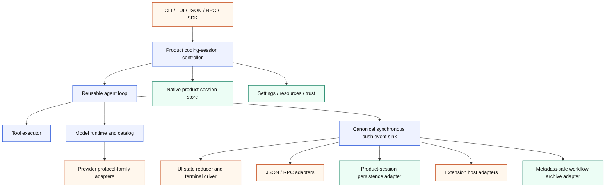

# Architecture Migration Plan

Status: active engineering plan

This document is the source of truth for improving pipy's internal architecture
while preserving its shipped Pi-shaped product behavior. It turns the
code-quality tracks in [Backlog](backlog.md) into an ordered migration. Pi is
the behavioral reference, Tau is a useful example of Python package boundaries,
and pipy's parity, protocol, and real-PTY tests are the compatibility harness.

The migration is deliberately incremental. It is not a rewrite, a package
rename, or a pause in parity work. Each slice must leave `main` releasable and
must not combine a structural extraction with unrelated feature changes.

## Why This Work Is Needed

Pipy has strong behavioral coverage and product-specific strengths: its native
inline-scrollback TUI, real-PTY verification, project-trust and path-safety
boundaries, metadata-safe auxiliary workflow archive, Python extension surface,
and small reviewed parity slices. Those properties are constraints of the
migration, not components to replace.

The main structural risk is concentration of responsibilities. In particular,
`NativeToolReplSession.run()` coordinates provider streaming, the tool loop,
queued input, commands, session persistence, extensions, rendering, settings,
and terminal lifecycle. Provider construction and model facts are spread across
large switches, while provider wire families repeat transport, retry, usage,
and parsing code. The extension and TUI implementations have similarly grown
past a size where their internal boundaries remain obvious.

The desired result is not simply smaller files. It is a dependency structure in
which the agent loop, product session, UI, provider runtime, persistence, and
extensions can be tested and evolved independently.

## Target Architecture



The first implementation should use subpackages under
`pipy_harness.native`; for example `native.agent`, `native.coding`,
`native.ui`, `native.providers`, and `native.extensions`. Physical distribution
package splits are a later decision, after import tests prove the boundaries.

The intended dependency direction is:

```text
entrypoints -> coding session -> agent loop -> model runtime -> providers
                         |             |
                         |             +-> tool executor
                         +-> product session/settings/resources

agent events -> UI, automation, persistence, extensions, workflow archive
```

The core agent package must not import the CLI, TUI, ANSI rendering, concrete
provider adapters, product-session paths, or archive implementations. UI and
automation code consume events; they do not participate in agent decisions.

## Current Concurrency Model

Pipy's current core orchestration is synchronous. `NativeToolReplSession.run()`,
the SDK, provider ports, and event sinks expose synchronous methods. Blocking
provider and tool work is isolated with owned worker threads where an
interactive or RPC mode must remain responsive; cancellation uses threading
events and `CancelToken`. No asyncio event loop owns the product lifecycle.

Phases 1–3 preserve that model. The canonical event port is synchronous push,
and the mode-owned composite invokes its projections synchronously in their
characterized order. Converting the core, provider port, SDK, or adapters to
asyncio would change cancellation, signal, backpressure, and blocking-I/O
semantics; it therefore requires a separate design, characterization suite, and
reviewed migration slice. It is not part of this plan.

## Migration Invariants

Every slice must preserve these rules:

1. **Behavior before shape.** CLI output, JSON/RPC protocols, session formats,
   extension contracts, provider requests, event ordering, and TUI behavior
   remain unchanged during an extraction. A behavior change requires its own
   later slice and parity contract.
2. **Native product direction.** `pipy-native` remains the product runtime.
   Wrapping other coding-agent CLIs remains a capture/reference facility.
3. **Privacy and trust.** Project trust, workspace path safety, product-session
   privacy, and the metadata-only workflow archive cannot be weakened.
4. **Inline terminal behavior.** The normal-buffer inline-scrollback TUI and
   its terminal-restoration guarantees remain product requirements.
5. **Push-based live events.** The core uses a synchronous `emit(event)`
   boundary. Iterator and protocol streams are adapters over it, so slow
   consumers cannot silently turn live tool updates into post-hoc batches.
   Backpressure is
   intentional: each run mode owns one composite immediate sink with a fixed,
   explicitly tested projection order. That composite invokes the projections
   active for the mode—such as rendering, automation serialization, product
   persistence, or workflow metadata—serially, and completion means all of
   those immediate projections have accepted or serialized the event. It is a
   static application adapter, not a dynamic pub/sub facility. The first
   extraction adds neither unbounded fan-out nor background queues. RPC, SDK,
   persistence, and terminal projections keep their characterized blocking,
   cancellation, and error semantics; any later buffering, dropping, timeout,
   dynamic subscriber, or parallel-dispatch policy is a separate behavior
   change. Semantic extension hooks are not converted into generic stream
   subscribers.
6. **Strict new boundaries.** New core modules use strict typing and explicit
   protocols. They may temporarily adapt legacy types but may not introduce new
   unchecked `Any` or unexplained `type: ignore` uses.
7. **No speculative dependency expansion.** The extraction uses the current
   standard-library posture. A runtime dependency such as Pydantic, attrs, or a
   new HTTP client requires a separate ADR and must not be hidden in a move.
8. **Small trunk-based slices.** Work lands directly on `main` as independently
   green commits. Avoid concurrent edits to the same monolith.
9. **Review and documentation.** Each implementation slice has focused tests,
   `just check`, relevant conformance/PTY gates, updated architecture/backlog
   documentation, and a different-family review before commit. Update release
   notes when behavior or a public SDK/extension surface changes.
10. **No compatibility scaffolding for private internals.** Once all internal
    callers migrate, delete the old path instead of adding deprecation aliases.

## Phase 0: Trustworthy Baseline

### Slice 0.1: Deterministic quality gate

First investigate order/global-state sensitivity in the full suite, including
`tests/test_parity_probe_trust.py::test_legacy_parity_score_opts_into_trusted_workspace_fixtures`,
which failed after the full suite but passed in isolation during the architecture
comparison. If it reproduces, record the contaminating predecessor or leaked
state in a focused regression test and run that reproducer in both orders. If it
does not reproduce, record the exact predecessor/reverse/full-suite evidence and
do not add speculative retries or isolation. Run the full suite repeatedly
before treating one green execution as a baseline.

Add checked-in CI that invokes repository-owned commands rather than duplicating
them. It should cover Ruff lint, Mypy, the full unit suite, documentation build,
a Linux PTY subset, and—where the runner is available—a small macOS PTY job.
Enable `ruff format --check` only after a dedicated mechanical normalization
slice makes the existing tree clean; do not hide a repository-wide formatting
rewrite inside the CI baseline.

Acceptance:

- `just check` passes three consecutive runs from the same clean checkout.
- A reproduced parity-score failure passes in both orders in one process (or
  equivalent isolated subprocess arrangements), and any identified leaked state
  is asserted to be restored. When it remains non-reproducible, the slice records
  the exact order matrix and leaves the test unchanged; three identical
  full-suite runs alone are not presented as proof that a leak was fixed.
- CI and local validation use the same `just` entry points.
- `just docs-build` runs in CI.
- CI runs a named Linux real-PTY subset. A named macOS real-PTY subset is
  required when an available runner supports it; otherwise the workflow records
  the omission explicitly rather than silently claiming cross-platform PTY
  coverage.

Implementation evidence (2026-07-17): the historical parity-score failure did
not reproduce. The isolated test, the actual collected predecessor group
followed by the probe, the reverse order, three complete Python 3.14 suites, and
one complete Python 3.11 suite all passed; inspection found no repository-fixture
mutation or ambient-state leak, so no speculative test patch was made. CI now
gates lint/types/docs on Python 3.14, full tests on Python 3.11 and 3.14, and an
eight-test real-PTY smoke set on Linux and macOS. The pre-existing Ruff-format
baseline remains explicit: 239 files require formatting, so format-check
activation is a separate mechanical slice.

### Slice 0.2: Characterization and boundary gates

Before moving orchestration, capture representative golden contracts for:

- a plain provider response;
- a provider/tool/provider cycle;
- tool failure and argument failure;
- provider retry and cancellation;
- queued steering and follow-up turns;
- session persistence and resume;
- extension lifecycle/tool callbacks;
- JSON and RPC event ordering; and
- SDK `run_native` results, public stream-sink behavior, finalization, and public
  exports/signatures;
- metadata-only workflow archive allowlists, using prohibited prompt/output/
  tool-content sentinels to prove no crossover from full-content modes; and
- TUI mapping and terminal restoration.

Add import-boundary tests as soon as a new package exists. These tests should
inspect imports or module dependencies without importing effectful entrypoints.

Acceptance:

- Current per-mode outputs and callback order have golden snapshots before a
  canonical event representation exists.
- Archive characterization proves prohibited full-content sentinels never enter
  JSONL, Markdown summaries, catalog output, or workflow event summaries.
- The import-boundary harness is checked in with rules that activate when each
  new package appears; Phase 0 does not reference modules that do not yet exist.

Implementation evidence (2026-07-18): dedicated architecture-contract tests now
freeze synchronous SDK/finalization behavior, the raw native product-session
versus metadata-only workflow-archive privacy split, plain/tool/error provider
event order, JSON and RPC boundaries, queued steering/follow-up and cancellation,
extension true-idle lifecycle order, and the planned import directions. The
import gate statically covers both module-first and package-first migrations,
fails closed on stale forbidden names and invalid relative imports, and activates
new layer rules without importing effectful entrypoints. Existing specialized
retry, tool-progress, PTY/TUI, and extension-hook suites remain the owners of
their deeper behavior rather than being duplicated here.

## Phase 1: Canonical Agent Event Seam

### Slice 1.1: Typed event vocabulary

Create a focused `native.agent` package containing canonical messages, events,
and run results. The event vocabulary must represent turn lifecycle, assistant
text/reasoning deltas, tool-call start/update/end, usage, retry, cancellation,
steering/follow-up consumption, provider errors, and terminal run outcomes.

The central port should preserve the current synchronous concurrency model:

```python
class AgentEventSink(Protocol):
    def emit(self, event: AgentEvent) -> None: ...
```

The producer completes the canonical boundary before emitting the next event.
Canonical payload strings are explicitly full-content product/automation data;
summary-safe workflow DTOs do not belong in the agent package. Crossing into the
workflow archive always uses an explicit allowlisting adapter.

Implementation evidence (2026-07-18): `native.agent` now provides frozen,
slotted, runtime-validated messages, events, usage/failure/run results, closed
turn/run/cancellation outcomes, and the synchronous `AgentEventSink`. Full
prompt/model/reasoning/tool/error content is wrapped as redacted-repr
`ProductContent`; the package exposes no serializer or workflow-archive DTO.
The event vocabulary keys starts and live updates by the provider correlation id
available at those boundaries, then carries both that id and the pipy-owned
request id on the completed result; it also preserves deferred-tool history,
cumulative usage plus last-turn context totals, tool duration, steering/follow-up
consumption, retry and failure states, and self-contained cancellation/terminal
outcomes. The dependency gate now rejects imports from outer adapters,
automation, extensions, UI, product-session storage, concrete providers, the
runner, and the workflow archive. Existing emitters and wire dictionaries remain
unchanged for Slice 1.2; the parallel legacy message envelope must be replaced
atomically there rather than retained through a compatibility alias.

### Slice 1.2: Adapt existing consumers

Route the current automation sink, extension emitter, renderers, JSON/RPC
streams, SDK stream/result surface, and workflow recorder through adapters.
Preserve all external formats and callback ordering. For the native product
session, this slice defines and tests the event-to-current-persistence projection
but leaves write ownership and call sites in place; Slice 3.3 performs that move.
The Phase 0 archive sentinel tests are a hard precondition for changing the
workflow-recorder adapter.

Slice 1.2 is one atomic consumer cutover. The legacy conversation envelope and
its emitter form a connected producer/consumer graph; landing unused adapters
or retaining both message paths would create the shadow implementation this
migration forbids. The slice therefore moves the loop, providers, product
session, compaction, extensions, automation, SDK, and tests together, then
deletes `native.tools.messages` and the legacy automation emitter.

Implementation evidence (2026-07-18): the tool loop and one-shot SDK now emit
the canonical synchronous event vocabulary. A fixed-order composite projects
text/reasoning deltas, buffered assistant messages, and tool start/update/result
events through the rendering adapter before the existing Pi-shaped automation
dictionaries and extension lifecycle hooks. It also defines the future
product-session persistence projection and feeds an explicit metadata-only
workflow allowlist. Turn chrome and local-command rendering remain terminal
composition concerns for Phase 4; direct product-session writes retain their
existing ownership until Slice 3.3. `AutomationAgentEventAdapter` owns cumulative
assistant partial text, malformed-argument fallback, camelCase fields, and
provider tool correlation ids, while RPC still owns queue reservation and the
true-idle `agent_settled` boundary. Steering/follow-up consumption and closed
cancellation reasons are canonical-only bookkeeping with no new wire records.
The SDK retains its synchronous public callbacks and result contract through a
canonical adapter. Product-session reload infers historical tool names from
branch-local ancestry; unresolved legacy tool records remain storage-only so
their ancestry and JSON survive without exposing an invalid provider message.

Acceptance for Phase 1:

- Existing JSON/RPC snapshots and extension lifecycle tests do not change
  except for intentional internal construction.
- A fake sink can capture one ordered trace for any run mode.
- The SDK keeps its synchronous `RunRequest`-in/`RunResult`-out contract,
  public exports, stream-sink semantics, and finalization behavior.
- No canonical event type contains an archive-unsafe convenience serializer.
- The event producer has no knowledge of terminal or storage formats.
- Canonical core traces are mode-neutral, while adapter tests preserve each
  public mode's current representation.
- Import-boundary tests fail if `native.agent` imports CLI, outer adapters,
  automation, extensions, TUI, product-session paths, concrete providers, the
  runner, or the workflow archive, or if provider transports import UI code.

## Phase 2: Reusable Agent Loop

### Slice 2.1: Tool executor — SHIPPED

Extract argument validation, tool lookup/invocation, live updates, normalized
results, cancellation, failure mapping, and termination signaling into
`native.agent.tools` (or an equivalently focused module). Preserve sequential
execution first.

Implementation evidence (2026-07-19): `native.agent.tools.ToolExecutor` now
owns the synchronous per-call path: registry lookup, JSON/schema validation,
pipy request-id allocation, `ToolPort` invocation, live `ToolContext` output,
normalized canonical results, exact malformed/error mapping, and an optional
worker plus cancel-event boundary. `ToolExecutionInterruption` closes the
executor outcome to settled, operator abort, or local command without importing
the TUI. Completion and cancellation are explicitly ordered so an earlier
cancellation cannot be replaced by a racing late result, and each invocation's
live-output sink stops admitting new callbacks before the executor returns.
Closing the gate never waits on an already admitted, backpressured synchronous
callback; that callback retains its original turn index and call identity if it
finishes later. `NativeToolReplSession` binds both values immutably per call, adapts
terminal wait strings at the composition seam, and retains budgets, extension
policy/result hooks, timing, event order, malformed-streak policy, provider
history, persistence, and run/turn outcomes. `native.tools` now exposes only
contracts; concrete tools are imported from their defining modules. The
superseded `_invoke`, `_invoke_interruptible`, and `_error_observation` methods
are deleted. Caller scheduling remains sequential and no parallel-tool scheduler
is introduced. A cancelled uncooperative worker may outlive its bounded join,
but its invocation sink is already closed and its turn/call identity cannot change.

### Slice 2.2a: Provider-turn boundary — SHIPPED

Extract one synchronous provider completion into
`native.agent.provider_turn.ProviderTurnExecutor`. The boundary owns text and reasoning
delta publication as canonical events, the optional worker and `CancelToken`,
exact first-cancellation versus worker-completion ordering, bounded cleanup,
late-delta admission gating, and a typed result-or-cancellation outcome. It is
headless and provider-neutral; it imports the provider port and canonical
contracts, not a concrete transport, the TUI, automation, extensions, product
session, compaction, provider construction, capture, or the workflow archive.
The canonical `native.agent` initializer does not eagerly re-export it.

`NativeToolReplSession` retains the TUI and RPC/external-abort wait adapters,
queued-message storage and promotion, provider-request construction, extension
preflight and lifecycle policy, tool cycles and budgets, and the current
zero-retry and usage-accumulation policy. This first boundary deliberately does
not move the full provider/tool cycle or make `run()` a composition-only method.
The superseded `_ProviderTurnCompletion`, `_agent_text_sink`,
`_agent_reasoning_sink`, `_complete_headless_cancellable_turn`,
`_complete_provider_turn`, and `_cancel_active_turn` paths are deleted in the
same slice. The shared `HarnessStatus` enum moves to dependency-neutral
`pipy_harness.status`; public harness/native model exports keep the same enum
identity and runtime-resolvable annotations while the provider-turn import
graph no longer loads capture or the metadata workflow archive.

Implementation evidence (2026-07-19): commit `925bd24` extracts the
provider-turn executor and removes all six superseded session-local completion,
delta-sink, and cancellation paths. Direct executor, tool-loop, SDK, import,
RPC, extension, TUI, PTY, and documentation gates passed; final `just check`
reported 3,330 passed and 2 skipped with Ruff and mypy clean across 338 sources.
Pi `openai-codex/gpt-5.6-sol` reported CLEAN after three fixed warnings in its
first round and a clean post-Fable re-review. Claude Fable's valid review found
two suggestions, both fixed, then returned an unscoped CLEAN with no skipped or
truncated files, redactions, or forbidden tool use. Five findings total were
accepted and fixed; none were rejected or deferred.

### Slice 2.2b.1: Canonical agent usage accounting — SHIPPED

Move provider-neutral token accumulation, last-turn context totals, cache-hit
classification, canonical `AgentUsage` snapshots, and injected per-token rate
application from `NativeToolReplSession` into
`native.agent.usage.AgentUsageAccumulator`. The same module defines the frozen,
runtime-validated `AgentTokenPricing` value passed in by the product composition
layer. The product-owned provider/model pricing table and lookup remain in the
session for this slice; the reusable agent layer must not import the pricing
catalog, provider selection, UI, product session, capture, archive, or concrete
provider modules. `native.agent` does not eagerly re-export the usage runtime.

This boundary preserves existing provider telemetry coercion, cache-denominator
heuristics, cost display, context-meter fallback, canonical event payloads, and
per-prompt versus session-total reset behavior. It does not move request or
history construction, retry or token-budget policy, compaction, tool
capabilities, active-input/queue ownership, persistence, rendering, or the full
provider/tool loop. Pricing/catalog consolidation remains Phase 5.3.

Implementation evidence (2026-07-19): the slice extracts the canonical usage
runtime, deletes the session-local accumulator, pricing value, coercion, cache
classification, and provider/model bind path, and migrates all six construction
and reset sites to injected pricing. Direct usage, session integration, exact
lifecycle ordering, pricing-prefix, all-reset-path, static import, recursive
synthetic, and isolated fresh-process contracts passed. Final `just check`
reported 3,382 passed and 2 skipped with Ruff and mypy clean across 340 sources;
documentation and diff gates passed, and the source-equivalent PTY, RPC,
extension-live-session, and TUI workflow gates remained green. Pi
`openai-codex/gpt-5.6-sol` returned explicit CLEAN in the user-authorized fourth
round after four accepted warnings were fixed; none were rejected or deferred.
Claude Fable returned valid unscoped CLEAN with no findings, skipped or
truncated files, redactions, or forbidden tool use.

### Slice 2.2b.2: Canonical agent-history compaction — SHIPPED

Move the mechanical canonical-message history reduction into
`native.agent.history`. The reusable boundary accepts any `Sequence` of
`AgentMessage` values plus caller-owned limits without mutating the caller's
container, and detaches the retained history into an immutable tuple with
structural counters. It cuts only at user group boundaries, counts
assistant/tool-call/tool-result content exactly as before, and performs no I/O.

The product session retains compaction enablement, manual/automatic triggers,
threshold defaults, extension-hook ordering, the exact counts-only summary
text, provider-system-prompt injection, diagnostics, aggregate result counters,
and durable native-session-tree writes. The canonical module exposes no archive
serializer and is not eagerly re-exported from `native.agent`. The obsolete
`native.session_compaction` module and its unused no-tool conversation path are
deleted rather than retained as an alias or shadow implementation.

One characterized correctness prerequisite deliberately narrows automatic
compaction: when an extension has attached transient `deliverAs=nextTurn`
custom context, automatic compaction is deferred for that entire run. This
prevents a retained-history index shift from carrying one-turn extension
context into the next provider request. A later ordinary run may compact, but
an extension that injects transient context on every turn can defer automatic
compaction indefinitely; manual `/compact` remains available.

Apart from that correction, this slice changes no product-session storage,
provider-request schema, summary text, JSON/RPC/SDK/extension representation,
archive allowlist, compaction policy, queue behavior, or TUI behavior. Tool
capabilities, remaining request/effect/input seams, and the full provider/tool
loop remain Slices 2.2b.3–2.2b.5.

### Slice 2.2b.3: Session tool-capability port seam — SHIPPED

Define the runtime-checkable `AgentToolCapabilities` protocol beside the
reusable executor in `native.agent.tools`. The protocol exposes only a detached
tuple of tool definitions, synchronous one-call execution, and canonical
error-result construction. Product registry composition, built-in versus extension
identity, CLI/run filters, active-tool mutation, extension replacement,
workspace `ToolContext`, and `ToolExecutor` construction move behind the
`native.tool_capabilities.NativeToolCapabilities` facade and its frozen
`ToolFilterOptions` value. The product session constructs that facade and uses
only the protocol methods inside the provider/tool cycle.

The cut preserves synchronous backpressure, strictly sequential scheduling,
tool-budget accounting, malformed-call behavior, extension preflight/result
hook ordering, live-output identity, dynamic-tool annotations, reload behavior,
and every JSON/RPC/SDK/session/archive representation. Neither the protocol nor
the product facade is eagerly exported from a package root. The canonical
module stays free of concrete tools, product sessions, providers, UI,
persistence, extensions, capture, automation, and the metadata-only workflow
archive; the product facade composes injected ports but does not construct
concrete tool implementations.

Characterization records two pre-existing authorization defects without
silently changing them in this mechanical ownership slice. First, a
`before_provider_request` transform can name a registered tool outside the
prior active/final request snapshot because the returned names are filtered
against the registry rather than intersected with that snapshot. Second, a
provider call outside the exact final advertised set can currently reach tool
hooks and execution. Slice 2.2b.4 must close both together: request-hook tool
names intersect the prior snapshot, and an out-of-snapshot returned call
produces the normal policy error and consumes budget without any hook,
execution, or invocation count. The separate June
precedence/unknown-name conflict is not part of this slice.

### Slice 2.2b.4a: Final provider-request snapshot and authorization — SHIPPED

Bind each provider completion to an exact request-local advertised-tool
snapshot. `before_provider_request` transforms may narrow only the detached
tool tuple they receive, serial hooks remain monotonic, and prior definition
order wins over hook order, duplicates, and unknown names. A successful
`ctx.set_active_tools(...)` mutation changes later provider iterations but does
not retroactively widen or narrow the current frozen request unless the hook
also returns an explicit narrowing transform.

After the provider returns, budget exhaustion retains first precedence. A
returned call outside the exact snapshot produces the normal pipy-owned
`unknown tool` error between balanced tool-start/tool-complete events, consumes
one per-turn budget slot, and is appended once to canonical history and the
product session tree. It reaches neither semantic tool hook, execution, live
output, result transformation, malformed-call accounting, nor global
invocation accounting. A tool activated by an earlier call is therefore not
authorized later in the same provider response. This slice changes no public
request/result representation, lower-level registry capability, sequential
scheduling, persistence owner, or metadata-archive allowlist.

### Slice 2.2b.4b: Identity-safe active-input overlay — SHIPPED

Replace absolute-index transient-context cleanup with a request-local,
identity-safe active-input overlay, then remove the Phase 2.2b.2 automatic
compaction deferral without changing `deliverAs=nextTurn` one-run lifetime or
allowing transient content into durable conversation or archive records.

The canonical `AgentActiveInput` binds the accepted user-message object to a
detached tuple of request-only context. It projects that overlay immediately
after the identity anchor on every provider iteration, rewrites only that
anchor after request-hook prompt transforms, and derives run-result messages
from the same anchor after compaction. Missing or repeated anchors fail closed.
The overlay is never appended to canonical history, emitted in the run result,
or written as an additional product-session message; the separately shipped,
bounded `CustomMessageEntry` remains the full-content product record of the
extension action. Automatic compaction again runs on durable history during
the active run. Public formats, extension queue/order behavior, manual
compaction, persistence ownership, and the metadata-only archive allowlist do
not change.

### Slice 2.2b.4c: Run-effect, usage-publication, and queue-facing ports — SHIPPED

Establish the remaining typed ports needed by the reusable loop. Phase 3 still
owns queue storage, ordering, reservation, idle transitions, and lifecycle;
Phase 3.3 still owns persistence write relocation. This slice makes those
product policies injectable without moving their ownership.

The canonical runtime boundary now carries a closed append-message run effect,
one normalized provider-usage sample paired with its cumulative run snapshot,
and a closed steering/follow-up input selected by the product controller.
Product callback adapters apply each port synchronously: durable message writes
complete before the next event, session usage absorbs before `UsageUpdated`, and
queue selection returns at most one already eligible item. Callback failures
propagate at the same boundary rather than being deferred or swallowed.

Queue storage, steering-first priority, positional-seed priority, extension
outboxes, RPC reservation/idle transitions, `agent_end`/`agent_settled`, and
abort clearing stay in their existing product owners. The agent-facing port has
no enqueue, peek, count, mode, clear, reserve, settle, or lifecycle operation.
It may take one controller-selected item after a run settles; `None` returns
control to the product input lifecycle. The full-content queued payload remains
pre-acceptance product content until the next run creates its canonical user
message. Persistence still executes through the injected product callback and
does not move until Phase 3.3. Public JSON/RPC/SDK/session/extension formats and
the metadata-only archive allowlist do not change.

### Slice 2.2b.5: Full headless `AgentLoop` ownership cutover — SHIPPED

The cutover is split into four independently green ownership cuts so the name
reserved for the full loop is not occupied by the already-shipped one-provider
executor:

1. **2.2b.5a — provider-turn naming cut:** atomically rename the existing
   executor module to `native.agent.provider_turn`, delete the old module path,
   and reserve `native.agent.loop` for the full headless loop. This is a
   behavior-preserving internal rename with no compatibility alias, public
   export, or format change. **SHIPPED.**
2. **2.2b.5b — typed loop-policy collaborators:** extract the remaining
   request/tool/status policy seams without moving queue ownership or changing
   run behavior. The canonical layer now owns immutable tool counters, exact
   budget/authorization/admission transitions, the shared named 200-call cap,
   malformed-fatal settlement, and
   zero-retry provider-status normalization. It explicitly detaches and freezes
   shallow provider-request tool schemas, with a distinct provider-bound
   projection rematerializing ordinary JSON containers for built-in and custom
   providers. Callback-composed product adapters
   own extension request/tool hooks and restrict result hooks to content-only
   transformation. **SHIPPED.**
3. **2.2b.5c — single-run `AgentLoop` cutover:** move the provider/tool cycle
   behind the headless loop contract and delete the superseded session-local
   cycle. **SHIPPED.**
4. **2.2b.5d — queued-input handoff closure:** complete the controller-owned
   steering/follow-up handoff while preserving separate-run semantics and the
   serialized RPC boundary. **SHIPPED.**

The pure single-run turn loop now lives in `native.agent.loop`. It owns provider
streaming, assistant-message assembly, tool-call cycles, the existing zero-retry
provider policy, tool-budget and iteration guards, cancellation, and the final
typed result/history/tool state for one already accepted prompt. Product
callbacks retain compaction and request construction, fresh provider/waiter
binding, terminal pending-input effects, diagnostics, rendering, and durable
writes. Typed callbacks preserve the prior per-transition counter-mirror timing
and a final pre-`AgentRunCompleted` synchronization, while append effects update
the live product message mirror before durable persistence. After the
synchronous `AgentRunCompleted` emission, the loop asks the controller-owned
`AgentQueuedInputPort` for at most one eligible value and returns that intact
`AgentQueuedInput` as `AgentLoopOutcome.next_input`; the product controller
starts it as a separate next run. Queue storage, ordering, reservation, idle
transitions, and lifecycle remain outside the loop. The superseded
`_QueuedDeliverySource`, `_PromptChannel._last_delivery_kind`, and
`take_delivery_kind` text/kind split are deleted without a compatibility path.
Slice 3.1 later moves the same controller policy without changing the loop
contract.

The loop receives model/provider and tool capabilities through protocols. It
does not know about terminal rendering, slash commands, menus, session paths,
settings files, or extension UI.

Acceptance for Phase 2:

- The loop runs under tests with fake providers, tools, cancellation, and sink.
- Existing event ordering, provider requests, budgets, and error behavior match
  the characterization contracts.
- `NativeToolReplSession.run()` no longer contains the provider/tool cycle.
- Pi-style parallel tool execution, live-update refinements, named/forced tool
  choice, and termination semantics remain separate feature slices after the
  extraction is clean.

## Phase 3: Product Coding-Session Controller

### Slice 3.1: Headless session state machine — SHIPPED

Create `native.coding` modules for the product session lifecycle, queued user
input storage/policy, the queue port offered to an active agent loop, current
provider/model, settings/resources, command outcomes, persistence coordination,
and invocation of the reusable agent loop.

The controller owns product policy; the agent loop remains reusable. Commands
return typed outcomes rather than printing, repainting, or writing session files
directly.

The controller cutover is split into independently green ownership cuts:

1. **3.1a — headless queued-input policy (shipped):** move retained loop
   handoffs, ordered injected queue sources, positional seeds, extension
   steering/follow-up/trigger queues, request-only next-turn context, and local
   command precedence into `native.coding.input_queue`; delete the parallel
   session-local lists and selection closures.
2. **3.1b — coding-session state and transitions (shipped):** move current
   provider/model labels and port, canonical message/counter state, compaction
   metadata, and explicit state transitions behind headless product contracts.
3. **3.1c — persistence coordination seam (shipped):** inject typed append/switch/
   compaction callbacks while preserving synchronous write timing; actual write
   ownership relocation remains Slice 3.3.
4. **3.1d — typed imperative command outcomes (in progress):** move command
   families behind closed semantic outcomes without introducing the declarative
   registry owned by Slice 3.2. This monolith-touching cut ships as 3.1d.1
   through independently reviewed sub-slices: the outcome kernel/state-free
   commands; compaction/name; provider/auth/scoped models; product-session
   navigation; external/UI effects; reload; then resource/extension precedence
   closure.
5. **3.1e — accepted-input and agent-run coordinator:** move accepted-input
   preparation and reusable-loop invocation behind injected product ports.
6. **3.1f — lifecycle state machine and composition cutover:** move the outer
   synchronous start/input/command/run/true-idle/shutdown transitions and leave
   `NativeToolReplSession.run()` as a sub-800-line composition shell.

Slice 3.1a preserves the exact product priority: local command, retained fresh
input from a blocking wake, FIFO retained post-run handoffs, injected
RPC/input-stream then terminal queues, positional seed, extension steering,
extension follow-up, ordinary extension trigger, and only then newly read fresh
input. A higher-priority local resource command may run before a retained
handoff, but any handoff returned by that command's run appends behind the older
one rather than overwriting it or raising. Seeds block extension continuations
from the active-loop port but never overtake an injected queue. Whole typed
queued inputs retain exact content and kind; `/...` and `!...` queued prompts
bypass local dispatch.
If a local command becomes pending while a registered source wakes the blocking
read, the command still wins; an already-read ordinary line is retained for
normal command parsing ahead of any newer mismatching queued DTO, and neither
value is polled or delivered twice.
`deliverAs=nextTurn` remains one-shot request-only context consumed only when a
provider run is accepted. RPC reservation/idle/settlement, lifecycle,
commands, rendering, provider construction, and persistence writes do not move
in this cut.

Slice 3.1b moves the active provider port and explicit provider/model labels,
canonical live history, cumulative usage and result counters, compaction
suffix/metrics, and unresolved provider-failure metadata into the synchronous
`native.coding.state.CodingSessionState`. Named transitions distinguish an
atomic provider-context rebind from a same-context port refresh and a
session/tree history rebuild. The composition root retains provider
selection/construction, pricing lookup, compaction summary formatting,
session-tree callbacks and writes, commands, rendering, extensions, RPC
settlement, and reusable-loop invocation. The session's `provider=` constructor
argument seeds the persistent coding state once and is not stored as a parallel
field; later runs and the read-only `provider_port` projection use the same
state-owned port, including after setup failures.

Provider/model/auth and reload-fallback rebinds continue to clear only live
provider-visible history and reset usage; the durable tree remains intact.
For exact behavioral compatibility they also continue to preserve an existing
in-memory compaction suffix, while session/tree rebuilds clear that suffix and
preserve run-lifetime metrics. Any correction to that characterized suffix
lifetime is a separate behavior slice rather than an implicit extraction
change. Immutable snapshots reject mutable substitutions and retain exact
canonical message identity. Strict direct-import, recursive, fresh-process,
and no-eager-export gates keep the state owner independent of UI/terminal,
automation/archive, extension implementation, persistence, provider
construction/catalog, concrete providers/tools, and the old composition
monolith.

Slice 3.1c introduces a synchronous, headless product-session coordinator under
`native.coding.product_session`. Exact frozen context and compaction values
carry full-content canonical messages only across the private product-session
boundary. Append and compaction first apply the live `CodingSessionState`
transition and then invoke one typed durable callback; callback exceptions and
invalid non-`None` or awaitable returns propagate before later work, preserving
the characterized partial-state failure timing. A session switch still mutates
or replaces the concrete tree in the composition root first, then the typed
load callback returns an exact immutable context for state rebuild, and only
then does composition clear extension-scoped pending input.

Concrete `NativeSessionTree` construction, filesystem access, compaction
formatting, and write ownership remain in `tool_loop_session.py` until Slice
3.3. The Phase 1.2 `ProductSessionEventProjection` remains a definition rather
than a second writer, so this cut neither duplicates writes nor moves them
earlier in canonical event delivery. The coordinator is direct-import only;
exact allowlist, recursive, fresh-process, and no-eager-export gates prohibit
UI, terminal, automation/RPC, extensions, concrete persistence, providers,
tools, capture, SDK, and metadata-workflow archive dependencies. Its
full-content DTOs never cross the counts-only workflow projection.

Slice 3.1d.1 establishes `native.coding.commands` as a direct-import-only,
headless classification and outcome kernel. Exact frozen/slotted outcomes use
closed kind, action, and footer-policy enums. The first atomic cut owns blank
input, `/exit`, `/quit`, `/hotkeys`, `/changelog`, `/copy`, and `/session`
classification; composition still performs dynamic keybinding/changelog
rendering, clipboard access, native-session status formatting, and footer
painting. Ordinary command bubbles therefore remain before classification,
exit remains footer-free, and continuing commands keep one standard footer.

All other inputs return the exact unhandled outcome to the single existing
precedence skeleton. Non-empty queued/RPC/provider-classified `/...` and `!...`
content continues to bypass classification and reaches the provider unchanged;
classified empty or whitespace-only content still takes the unconditional blank
outcome and is consumed locally, preserving the pre-extraction behavior. The
superseded branches for the migrated commands are deleted in the same cut;
there is no second dispatcher or command metadata table. Exact direct-import,
recursive, fresh-process, and no-eager-export gates prohibit UI/terminal,
persistence, providers/tools, settings/resources, extensions, automation, SDK,
capture, and archive implementations. Outcome values are full-content product-
control data and have no serialization or workflow-archive projection. The
pre-existing gap between the documented model-change native-tree entry and the
current selection path remains an explicitly deferred behavior correction, not
part of these ownership cuts.

Slice 3.1d.2a extends the same exact outcome with typed `COMPACT` and
`SESSION_NAME` actions. The session-name action carries one exact
`ProductContent` argument: empty means report the current name and non-empty
means append that name. The direct classifier remains an already-stripped
contract, so it does not broaden exact matching for trailing whitespace;
composition retains the existing outer strip and internal name spacing.

The composition interpreter reuses the existing `apply_compaction("manual")`
adapter, keeping extension-before-compact policy, pure reduction, live state
transition, synchronous durable tree append, diagnostic, and footer order.
Automatic compaction continues through the same adapter and is not reclassified
as a command. Name mutation still appends the private `session_info` entry before
the exact legacy repr diagnostic; query formatting, write-failure propagation,
and the standard footer remain unchanged. Superseded `/compact` and `/name`
branches are deleted. Non-empty classified queued forms bypass these actions,
and no full-content argument or compaction text enters the metadata archive.

Slice 3.1d.2b adds exact `MODEL`, `SCOPED_MODELS`, `LOGIN`, and `LOGOUT`
actions. Each carries one exact `ProductContent` argument, including the empty
value for a selector, status view, or default `openai-codex` auth target. These
four actions use a distinct closed usage-aware footer policy; the earlier
state-free, compact, and name actions retain their standard footer contract.
The direct classifier still accepts only an already-stripped bare command or a
literal-space argument form, while composition continues to own the outer
strip and hotkey translation.

Composition reuses the existing model-selection, scoped-settings, selector,
auth, provider-rebind, pricing, and live-footer adapters. Direct selection,
selector cancel, unavailable and non-tool-capable refusal, thinking-level
selection, scoped view/set/clear/cycle, auth success/failure normalization,
external-I/O suspension, credential privacy, and exception timing therefore
remain unchanged. The four superseded late branches are deleted, and non-empty
queued/RPC forms remain provider-visible.

This extraction deliberately preserves two characterized gaps: model selection
and cycling append no native-tree `model_change` entry, and they dispatch no
extension `model_select` hook. Correcting either requires a dedicated behavior
slice; the typed command kernel owns neither persistence nor extension hook
policy. It also does not add catalog refresh, change auth diagnostics, or create
the Phase 3.2 registry.

The dedicated test-only 3.1d.2b conformance repair updates settings check 13 to
declare its synthetic workspace trusted at each direct `WorkspaceResources`
discovery. That fixture can therefore continue proving `-pattern`, `+pattern`,
and `enableSkillCommands=false` behavior without weakening the production
fail-closed discovery default. It changes no runtime code, settings schema,
resource ordering, privacy boundary, or public format.

Slice 3.1d.3a adds one exact payload-free `NEW_SESSION` action for `/new` with
the standard footer. Direct classification accepts only the already-stripped,
lowercase command; composition retains outer trimming, ordinary user-bubble
rendering, and the non-empty queued/RPC bypass.

The product interpreter preserves the existing synchronous sequence: run the
`session_before_switch` gate for `switch`/`new`, derive the current private
session store and persistence policy, create and select the new concrete tree,
rebuild typed active history, clear extension-owned pending input, emit the
sanitized diagnostic, and refresh the standard footer. Vetoes, ordinary hook
failures, controlled-fatal exceptions, and create/rebuild partial-state cutoffs
remain unchanged. The superseded late branch is deleted. The typed kernel gains
no persistence, extension, terminal, provider, RPC, SDK, or archive dependency;
no post-switch lifecycle/tree hook, write relocation, or registry metadata is
added.

Slice 3.1d.3b adds `SESSION_TREE` with one exact `ProductContent` argument,
including empty for bare `/tree`, and the standard footer. The already-stripped
classifier accepts the bare command or a literal-space argument form; outer
trimming and queued/RPC bypass remain composition-owned. The interpreter keeps
the existing mutating-form predicate: bare live-TUI selection and `select`,
`label`, or `filter` forms pass through `session_before_tree`, while captured
bare rendering and unknown forms do not.

On allow, composition invokes the unchanged tree handler, applies its returned
run-local filter mode, applies any next-iteration editor prefill, and refreshes
one standard footer. Same-file selection, immediate label writes, selector
cancel behavior, optional no-tool branch-summary calls, typed history rebuild,
extension-input clearing, diagnostics, sanitization, and partial-state failure
timing therefore remain unchanged. The late branch is deleted. The extraction
does not add the target completed `session_tree` hook, persist the run-local
filter, wire summary cancellation/accounting settings, or correct empty custom-
message selection; those remain separate behavior slices.

Slice 3.1d.3c adds `SESSION_RESUME` with one exact `ProductContent` argument,
including empty for bare `/resume`, and the standard footer. The direct kernel
accepts the already-stripped bare command or a literal-space argument form;
composition retains outer trimming, the submitted user bubble, and non-empty
queued/RPC bypass.

Composition preserves the current native-product workflow: captured bare and
`named` forms list sessions, `rename` and confirmed `delete` mutate only native
session files, and live bare input opens the existing inline picker. Picker
cancel and current-session selection remain ungated no-ops. Only a resolved
direct target or a different picker target passes through
`session_before_switch`; success keeps open/assignment, typed history rebuild,
extension-input clearing, custom-entry redraw, sanitized diagnostic, and one
standard footer in that order. Existing veto, ordinary hook error,
controlled-fatal, and open/rebuild/clear/redraw partial-state cutoffs remain
unchanged. The late branch is deleted.

The extraction does not normalize direct reopening of the active file, refresh
provider/model/counters, rebuild ordinary TUI scrollback, fix captured active-
session rename staleness or permissive explicit-path deletion, add post-switch
lifecycle hooks, move persistence writes, or add registry metadata. Full native
session content remains separate from the metadata-only workflow archive.

Slice 3.1d.3d adds argument-bearing `SESSION_FORK` and payload-free
`SESSION_CLONE`, both with the standard footer. The direct kernel accepts bare
or literal-space `/fork` forms and exact `/clone`; composition retains outer
trimming, the submitted user bubble, and non-empty queued/RPC bypass.

The interpreter preserves the private native-session sequence. Ephemeral trees
are rejected before resolution or hooks. An explicit fork reference resolves
through the active tree filter, while bare fork and clone use the current leaf,
including `None`. Both commands dispatch `session_before_fork` with operation
`fork` and that leaf target, call `NativeSessionTree.fork_from` into the same
private store with `parentSession` lineage, assign the completed child, rebuild
typed history, clear extension-owned pending input, emit the sanitized command-
specific diagnostic, and apply one standard footer. The two late paths are
deleted. Existing veto, hook-error, controlled-fatal, copy/write, rebuild, and
clear partial-state timing remains unchanged.

This ownership cut deliberately preserves any-entry fork resolution, empty-
branch clone, copied names/labels/compaction metadata, fresh child entry IDs,
the absence of custom-entry or ordinary-scrollback redraw, and the absence of
post-fork lifecycle hooks. It adds no picker, prefill, rollback, provider/tool
turn, persistence relocation, public serializer, archive projection, registry
metadata, compatibility alias, or asynchronous behavior.

Slice 3.1d.4a adds the exact payload-free `TRUST_PROJECT` action for `/trust` with the
standard footer. The direct kernel accepts only the already-stripped exact
command; composition retains outer trimming, the submitted user bubble, and
the non-empty queued/RPC bypass.

Captured execution emits the existing sanitized interactive-TUI requirement
without opening the trust store or reading captured stdin. Live execution
preserves the existing synchronous read-selector-write sequence: read the
closest saved exact or inherited decision, render the selector with that saved
decision and the immutable current-run trust value, apply a selected option's
atomic trust-store updates, emit the fixed restart-required success notice, and
then apply one standard footer. Cancel performs no write and still reaches the
footer. A handled trust-store read failure stops before selector/write, and a
handled write failure stops before the success notice; both sanitized notices
still precede the footer. Selector or uncontrolled failures continue to
propagate before later effects and the footer.

The superseded late `/trust` path is deleted. The command never mutates the
active `SettingsManager.project_trusted` value, hot-loads or unloads protected
inputs, invokes a provider/tool turn, or crosses into native-session or
metadata-workflow content. This cut does not move `/settings`, export/import/
share, `/reload`, resource/custom-command or extension precedence; it adds no
Phase 3.2 registry metadata or Phase 3.3 persistence ownership.

Slice 3.1d.4b adds the exact payload-free `SETTINGS` action for `/settings`
with the standard footer. The direct kernel recognizes only the already-edge-
stripped exact command; composition retains outer trimming, the submitted user
bubble, and non-empty queued/RPC bypass.

Live execution delegates to the unchanged `_drive_settings_dialog`. Cancel
closes the surface; in-place toggles stay in the dialog. The `cycle_thinking`
action is also in-place: it rebuilds the current dialog rows and may append one
private `thinking_level_change` entry without entering the outer close/subflow/
reopen loop. Model, login/logout auth, scoped-model, theme, and default-project-
trust subactions close into their nested flow and reopen the settings dialog,
including after selector cancellation. OAuth retains the existing cooked-mode
external-I/O suspension. Captured execution emits only the existing safe
`_settings_overlay_lines` status view. Both paths apply one standard footer
only after the settings surface has closed. A local or nested subaction that
has already changed live or local state remains changed if a later effect
fails; uncontrolled and controlled-fatal failures retain their existing cutoff
before the footer. Neither path starts a provider or tool turn.

The superseded late `/settings` branch is deleted. The command itself appends
no native-product entry, while its already-supported in-place thinking-level
action may append the private `thinking_level_change` entry. Prompt-history
bodies remain confined to the private `PromptHistoryStore`; OAuth material
stays in the live terminal and auth store; non-secret settings stay in their
settings owners; none enters the metadata-only workflow archive. This ownership
cut records, but does not correct, the pre-existing mismatch in which the docs
describe `promptHistory.enabled` as the toggle's source of truth while the
dialog toggles `PromptHistoryStore` directly and startup applies the setting
only as a one-way enable. Export/import/share, `/reload`, resource/custom-
command and extension precedence, the model-change/tree and extension-hook gap,
Phase 3.2 registry metadata, Phase 3.3 write ownership, and Phase 4 UI movement
remain explicit non-goals.

Slice 3.1d.4c adds `SESSION_EXPORT` with one exact `ProductContent` argument,
including the empty value for bare `/export`, and the standard footer. The
direct kernel accepts only the already-stripped bare command or a literal-space
argument form; composition retains outer trimming, the submitted user bubble,
and non-empty queued/RPC bypass at the existing serialized boundary.

The composition interpreter remains the owner of Pi-shaped path-argument
parsing, cwd-relative and home expansion, default HTML-path selection, and the
`.jsonl` versus HTML route. It invokes the existing native-session export
adapters, maps only `NativeExportError` through the existing sanitized
diagnostic path, and applies one standard footer after either a successful
write or that controlled error. Existing uncontrolled write failures retain
their pre-diagnostic, pre-footer propagation cutoff. Bare `/export` remains an
HTML export; explicit case-insensitive `.jsonl` paths remain active-branch
JSONL exports, while every other path remains a full-tree HTML export.

The command action and argument are full-content product-control values. HTML
continues to carry the full private native tree and JSONL the re-chained active
branch, both through the existing credential-redaction boundary; neither the
argument, export path, nor transcript content crosses into the metadata-only
workflow archive. The superseded late `/export` branch is deleted in this cut.
`/import`, `/share`, `/reload`, resource/custom-command and extension
precedence, top-level CLI export behavior, export formats/redaction/defaults,
Phase 3.2 registry metadata, Phase 3.3 write ownership, and Phase 4 UI movement
remain explicit non-goals.

Slice 3.1d.4d adds `SESSION_IMPORT` with one exact `ProductContent` argument,
including the empty value for bare `/import`, and the standard footer. The
direct kernel accepts only the already-stripped bare command or a literal-space
argument form; composition retains outer trimming, the submitted user bubble,
and non-empty queued/RPC bypass at the existing serialized boundary.

The composition interpreter remains the owner of Pi-shaped path-argument
parsing, `--yes` detection, home and cwd resolution, direct-stream confirmation,
the `session_before_switch` gate, collision-safe native-store import, missing-
cwd recovery, active-history rebuild, extension-input clearing, diagnostics,
and footer timing. The preserved order is parse and resolve, first confirmation
unless `--yes`, switch
gate, initial import, optional missing-cwd confirmation and retry, history
rebuild, extension-input clear, success diagnostic, then one standard footer.
Usage, cancellation, veto, and controlled import errors retain their existing
diagnostic/footer cutoffs; uncontrolled failures retain their earlier
propagation point and applied filesystem or in-memory effects are not rolled
back.

The action and imported JSONL are full-content product values confined to the
private native-session boundary. Neither the exact argument/path nor imported
transcript content is projected into the metadata-only workflow archive. The
same boundary applies if import raises through a harness adapter: caller-facing
or in-memory failure detail may remain available, while durable
`harness.run.exception` JSONL and Markdown record only the bounded exception
type and fixed lifecycle metadata, never raw exception text, source paths, or
session content. Direct exception propagation from `NativeToolReplSession`
remains unchanged. The superseded late `/import` branch is deleted in this cut.
This ownership move
deliberately preserves current behavior rather than silently implementing the
target UI/runtime split: both confirmations read and write the direct streams,
including captured mode; the missing-cwd case uses a second yes/no prompt; a
successful switch emits no post-switch `session_start(reason=resume)` lifecycle
event; it redraws neither custom entries nor ordinary inline scrollback; and the
confirmation prints the raw resolved path without label sanitization.

`/share`, `/reload`, resource/custom-command and extension precedence, command
path parsing, native import/store formats and validation, path-display security,
rollback/atomic-write semantics, post-switch lifecycle and redraw corrections,
Phase 3.2 registry metadata, Phase 3.3 write ownership, Phase 4 UI movement, and
async conversion remain explicit non-goals. The command extraction changes no
product behavior or public product format. The slice additionally narrows the
durable metadata-archive exception projection so escaped adapter exceptions
never copy raw message text into the archive JSONL or Markdown summary, a
privacy-strengthening refinement recorded in the release notes.

Slice 3.1d.4x-share adds `SESSION_SHARE` as a payload-free CONTINUE outcome with
the standard footer, classified alongside `/hotkeys`, `/settings`, and `/trust`
in the exact payload-free tuple loop. Only an already-stripped bare `/share`
classifies; `/share foo` and every spaced or altered form fall through to
UNHANDLED and reach resource/custom-command dispatch exactly as before, so no
new argument grammar is introduced and the built-in still wins over any custom
command of the same name because the kernel is evaluated before `/reload` and
before resource dispatch.

The composition interpreter remains the owner of the share effect sequence:
`resolve_github_token()`, the no-token diagnostic early message, the
cancellation-worker composition `_share_native_session_command` (CancelToken,
worker thread, `wait_for_active_turn_interrupt`, Escape-cancel, and
`Share cancelled.` messaging) guarded so only `NativeExportError` maps through
the sanitized diagnostic path, the cancelled `result is None` path, and the
viewer_url/gist_url result diagnostics. The typed dispatch branch performs that
sequence verbatim but no longer refreshes the footer itself; the centralized
standard-footer refresh after the CONTINUE block now owns the single
post-command footer refresh, matching `/export` and `/import`. The superseded
late `if command_text == "/share"` branch is deleted in this cut.

The GitHub secret-gist creation, the never-send-token-in-body privacy
guarantee, the `ShareResult`/`viewer_url`/`gist_url` output shape, and
`share_native_session` in `export_distribution.py` are all untouched. Neither the
resolved token nor the shared transcript crosses into the metadata-only workflow
archive; the token stays out of every gist body and diagnostic. `/reload`,
resource/custom-command and extension precedence, `tui.py`/`repl_input.py` menu
and description entries, Phase 3.2 registry metadata, Phase 3.3 write ownership,
Phase 4 UI movement, and async conversion remain explicit non-goals. The command
extraction changes no product behavior or public product format.

Slice 3.1d.4d-reload adds `RELOAD` as a payload-free CONTINUE outcome with the
standard footer, classified in the exact payload-free tuple loop alongside
`/hotkeys`, `/changelog`, `/copy`, `/session`, `/compact`, `/new`, `/clone`,
`/settings`, `/trust`, and `/share`. Only an already-stripped bare `/reload`
classifies; `/reload anything` and every spaced or altered form fall through to
UNHANDLED and reach `dispatch_resource_command`/`dispatch_extension_command`
exactly as before, so no argument grammar is introduced and the built-in still
wins over any custom command of the same name because the kernel is evaluated
before resource and extension dispatch. `RELOAD` stays out of both
`usage_aware_actions` and `argument_actions` in
`require_exact_coding_command_outcome`, so validation already enforces the
STANDARD footer policy and the absence of an argument.

The composition interpreter remains the owner of the full reload effect
sequence, now moved verbatim into an `elif command_outcome.action is
CodingCommandAction.RELOAD:` arm of the CONTINUE chain: `settings.reload()` and
`keybindings.reload()`, `compose_package_runtime`,
`WorkspaceResources.discover(...).with_enablement(...)`,
`clear_extension_chrome`, `_activate_workspace_extensions` and every
`_ext_runtime` local reassignment, extension-flag re-parse, catalog
`refresh()` plus extension-provider contributions and the
selection-disappeared/tool-capability fallback rebind (with
`_bind_unavailable_after_reload` and `_pricing_for`), tool renderer/registry
replacement, emitter lifecycle/flags refresh, theme and derived-UI re-apply,
`redraw_custom_entries_for_active_branch`, `load_errors` diagnostics, startup
chrome, `_maybe_save_implicit_trust_after_reload`, the
`EVENT_SESSION_START` lifecycle with `reason='reload'`, and the reloaded-settings
diagnostic. The typed arm drops its own trailing `refresh_legacy_footer()`; the
centralized STANDARD footer refresh after the CONTINUE chain now owns the single
post-command footer paint, identical to `/export`, `/import`, and `/share`. The
superseded raw `if command_text == "/reload":` late branch is deleted in this
cut. Queued/RPC bypass is preserved automatically because `command_text` is `''`
for selected provider content, so the kernel classifies `/reload` only for
genuinely typed input.

The reload semantics, effect ordering, diagnostics, provider-fallback behavior,
the reload-fired session-start lifecycle, and the narrowly guarded
no-resource-start implicit-trust exception are all unchanged. Neither the
reloaded settings nor keybindings cross into the metadata-only workflow archive.
Resource/custom-command and extension precedence, `RESERVED_COMMAND_NAMES`,
slash-menu names/descriptions, completion, the deferred model-change native-tree
entry, the Phase 3.2 declarative registry, Phase 3.3 write ownership, Phase 4 UI
movement, and async conversion remain explicit non-goals. The command extraction
changes no product behavior or public product format.

Slice 3.1d-reload-precedence closes and characterizes the completed Phase 3.1d
typed-command-family ownership now that `/reload` was the final built-in to
leave the raw late-branch path. The dispatch precedence is locked: the outcome
kernel (`classify_coding_command`) is the sole classifier for every built-in
slash command; only the private `HOTKEY_*` sentinels and the `!` shell prefix
precede classification, and those are owned by hotkey / Phase 4 handling rather
than by any surviving raw built-in slash branch. The kernel's `UNHANDLED`
outcome is the single delegation boundary, evaluated in the fixed order
`dispatch_resource_command` (skills / prompt-templates / custom-commands) ->
`dispatch_extension_command` -> the unknown-`/` fallback diagnostic -> the
provider turn. Built-in-over-custom precedence therefore holds structurally: a
custom command or template whose name collides with a kernel built-in (for
example `reload`, `tree`, or `new`) is never claimed, because the kernel
intercepts before resource dispatch is ever consulted — not because the name is
reserved. Custom-command-over-extension precedence holds by the same ordering: a
resource-claimed name (a skill, template, or custom command) wins over a
same-named extension command, and an extension command runs before the
unknown-`/` fallback.

This closure is a characterization plus documentation cut with no production
dispatch-logic change, matching the test-only precedent of 3.1d.2b-test. A
single end-to-end characterization test in
`tests/test_native_tool_loop_session.py` drives `run()` through the real
dispatch boundary to pin the ordering: a custom command named `reload`
(discovered but never claimed, since the kernel classifies `/reload` first) with
an assertion that `dispatch_resource_command("/reload", …)` *would* return a
`DISPATCH_COMMAND_RUN` if it were ever consulted; a prompt template named
`greet` that wins over a same-named extension `greet` command (a template is not
reserved out of extensions, so both coexist and the fixed resource-before-
extension order decides the winner); an `extonly` extension command that runs
before the fallback; and a `/bogus` line that reaches the unknown-`/` fallback.
Exactly one submitted line — the template resource run — reaches the provider,
proving every built-in, extension command, and fallback short-circuits first.

A Claude Opus review-panel pass raised three suggestions, all applied. First,
the characterization now asserts non-vacuity of the resource-over-extension
check directly: it pins that `extension_reserved_command_names(...)` — a union of
built-ins with *custom-command* slash names only, never prompt-template names —
excludes both `greet` and `extonly`, so the `greet` extension command genuinely
coexists with the `greet` template rather than being silently disabled at
registration; without this, a future change folding template names into the
reserved set would let `not greet_marker.exists()` pass vacuously. Second, the
new test's `monkeypatch` parameter is annotated `pytest.MonkeyPatch` so its body
stays under mypy. Third, the backlog section header was set to "review pending"
during the review to match this ledger row's own honest pending-review state, and
returned to "SHIPPED" at commit once the review gate ran clean.

The delegation targets `dispatch_resource_command` and
`dispatch_extension_command` remain the resource and extension dispatch owners
pending the Phase 3.2 declarative registry; this slice does not introduce that
registry. It deliberately did not expand `RESERVED_COMMAND_NAMES` to the full
built-in set: that set governs which colliding custom commands are advertised /
dropped in slash discovery, so widening it changed behavior (a colliding
`reload`/`tree`/`new` custom command was still advertised even though the kernel
prevented it from ever running). That advertising-completeness correction was
deferred to Phase 3.2 and is now shipped by the Slice 3.2 "reserve every
built-in command name" sub-slice, which derives `RESERVED_COMMAND_NAMES` and the
built-in half of `extension_reserved_command_names` from the declarative
registry's full name+alias set unioned with the `skill`/`theme` adjuncts. The
unknown-`/` fallback message text, the
deferred model-change native-tree entry, Phase 3.3 write ownership, and Phase 4
UI movement remain explicit non-goals, and this closure changes no product
behavior or public product format.

Implementation evidence (Slice 3.1e.1, 2026-07-21): the three generic
agent-loop collaborator wrappers now live in the new strict-typed module
`native.coding.agent_run` as the public typed adapters
`AgentLoopRequestSourceAdapter`, `AgentLoopProviderTurnAdapter`, and
`AgentLoopStatusPolicyAdapter`. Each remains a pure callable wrapper with the
same positional-only signatures it had inside `tool_loop_session.py`, conforming
to the canonical `native.agent.loop` request-source, provider-turn, and
status-policy protocols. `NativeToolReplSession.run()` imports the relocated
adapters and constructs them exactly as before, and the three superseded
in-monolith classes are deleted with no alias or re-export shim. This is a
behavior-preserving move only: no change to event ordering, provider requests,
request/provider-turn closures, status-callback timing, persistence writes, or
queue ownership. A new focused suite
(`tests/test_native_coding_agent_run.py`) asserts each adapter forwards its
arguments to the injected callable unchanged and satisfies the matching
runtime-checkable loop protocol. The import-boundary gate adds an explicit
`native.coding.agent_run` rule allowing only canonical `native.agent` contracts
plus injected `native.coding.state`/`native.coding.input_queue`, and forbidding
UI/terminal, extensions, concrete providers/tools, persistence coordination,
automation/RPC, the SDK, capture, and the metadata-only workflow archive; an
exact direct-import allowlist pins the module's dependency surface. That pinned
surface also admits the shared `native.models.ProviderResult` and
`native.tools.base.ToolDefinition` data contracts carried verbatim by the
original adapter signatures — canonical contract-level data types, not concrete
provider/tool implementations, so the boundary stays honest and enforced. The run
coordinator (`AgentLoop` assembly/invocation) remains Slice 3.1e.2 and
accepted-input preparation remains Slice 3.1e.3.

Review resolution (Slice 3.1e.1): the Claude Opus panel raised one suggestion
that the `architecture.md` agent-run row under-described the allowed dependency
surface by saying the module "depends only on canonical `native.agent`
contracts" while `agent_run.py` also imports `native.models.ProviderResult` and
`native.tools.base.ToolDefinition` (pinned in
`_CODING_AGENT_RUN_ALLOWED_DIRECT_IMPORTS`). The finding is accurate; the
`architecture.md` prose now reads "canonical `native.agent` contracts plus the
shared `native.models`/`native.tools.base` data contracts (`ProviderResult`,
`ToolDefinition`)" so the doc matches the test-enforced import surface exactly.
No code change was warranted — the imports are the correct contract-level data
types the original adapters already used.

Implementation evidence (Slice 3.1e.2, 2026-07-21): `native.coding.agent_run`
now also owns `CodingAgentRunCoordinator`, which receives the three product
adapters relocated in 3.1e.1 plus the already-composed reusable-loop ports
(`tool_capabilities`, `tool_policy`, `event_sink`/emitter, `run_effect_sink`,
`usage_publisher`, and the controller-owned queue port
`coding_input_queue.agent_loop_port`), an optional `tool_waiter`, the live
`CodingSessionState`, and the input-queue retention seam
(`coding_input_queue.retain_agent_input`). A single
`run_turn(active_input, initial_tool_state, *, pricing, accepted_queued_input)`
method builds the canonical `AgentLoop` from those ports, constructs
`AgentLoopRunInput` from `coding_state.messages` plus the accepted input and
initial tool state, invokes `agent_loop.run(...)`, then mirrors
`outcome.final_history` back into the session state and forwards
`outcome.next_input` to the retention seam. `NativeToolReplSession.run()` now
builds the coordinator once per accepted turn from the same freshly bound
callbacks and calls `run_turn(...)`; the inline `AgentLoop(...)` construction,
the `agent_loop.run(...)` call, and the post-run
`coding_state.mirror_history` / `coding_input_queue.retain_agent_input` lines
are deleted with no alias or shadow path, and the monolith no longer imports
`AgentLoop` or `AgentLoopRunInput`. This is a behavior-preserving move only: the
request-preparation and provider-turn closures (auto-compaction,
provider-request policy, renderer refresh; provider selection and waiters)
remain composition-root policy in `run()` and are still injected as the
relocated adapters; queue storage/ordering/reservation/idle/lifecycle stay with
the 3.1a controller, persistence writes remain Slice 3.3, and accepted-input
preparation (`active_input`/`initial_tool_state`) is still built inline and
passed in for Slice 3.1e.3. Event ordering, `agent_settled`/`agent_end` timing,
cancellation, terminate-session assembly, provider requests, and public formats
are unchanged. The coordinator constructor rejects a non-exact
`CodingSessionState` and a non-callable retention seam; the assembled `AgentLoop`
rejects non-conforming ports. The `native.coding.agent_run` import-boundary rule
and its exact direct-import allowlist are extended to the coordinator's added
contracts — `native.agent.loop` (`AgentLoop`/`AgentLoopRunInput`/`AgentLoopOutcome`
and the request-source/provider-turn/status-policy protocols),
`native.agent.loop_policy.AgentToolPolicy`, `native.agent.runtime_ports`
(`AgentQueuedInput`/`AgentQueuedInputPort`/`AgentRunEffectSink`/`AgentUsagePublisher`),
`native.agent.tools` (`AgentToolCapabilities`/`ToolInterruptWaiter`),
`native.agent.usage.AgentTokenPricing`, and `native.coding.state.CodingSessionState`
— while UI/terminal, extensions, concrete providers/tools, persistence
coordination, automation/RPC, SDK, capture, and the metadata-only workflow
archive stay forbidden. `tests/test_native_coding_agent_run.py` grows to nine
tests (the three adapter contracts plus six coordinator tests: loop
assembly/invocation seeded from live history, verbatim final-history mirroring,
next_input retention, `None`-handoff forwarding, non-exact state/non-callable-seam
rejection, and non-conforming-port rejection). The
`test_architecture_agent_loop_boundaries.py` ownership gate is updated so
`AgentLoop(...)` assembly is asserted in `native.coding.agent_run` and the
monolith is asserted to compose `CodingAgentRunCoordinator` instead. Focused
`tests/test_native_coding_agent_run.py`, `tests/test_native_tool_loop_session.py`,
`tests/test_native_agent_loop.py`,
`tests/test_native_agent_runtime_ports_session_integration.py`,
`tests/test_native_agent_active_input_integration.py`,
`tests/test_native_coding_state.py`, `tests/test_native_coding_input_queue.py`,
`tests/test_architecture_import_boundaries.py`,
`tests/test_architecture_agent_loop_boundaries.py`, and
`tests/test_native_tool_loop_session_import.py` passed. Automation/RPC
conformance passed 15/15, extension-lifecycle conformance 3/3, and PTY smoke
8/8. Final `just check`: Ruff and mypy clean across 383 source files, 4,264
tests passed, 2 skipped; `just docs-build` passed. No new runtime dependency,
`Any`, or `type: ignore`. The single-turn `active_input`/`initial_tool_state`
preparation move remains Slice 3.1e.3 and the outer lifecycle/composition-shell
cutover remains Slice 3.1f.

Review resolution (Slice 3.1e.2): the Claude Opus panel (user-directed
substitution for the different-family gate) ran one round across both the
behavior and invariants lenses and raised no findings; the final round was
clean with nothing accepted, rejected, or deferred.

Implementation evidence (Slice 3.1e.3, 2026-07-21): the run()-inline
accepted-turn preparation block now lives in the new strict-typed module
`native.coding.accepted_input` as the frozen/slotted `CodingAcceptedTurn` DTO
(`turn_user_message`, `active_input`, `initial_tool_state`,
`provider_user_input`, `turn_attachments`, `agent_system_prompt`) and the
`CodingAcceptedInputPreparer`. A single
`prepare(*, user_input, resource_provider_text, selected_provider_content,
base_system_prompt)` call reproduces the exact prior logic behind injected
product ports: an input-hook transform, an `@file`-reference resolver, an
image-attachment resolver, a `before_agent_start` system-prompt-suffix source, a
next-turn-context source, a diagnostic sink, and a state recorder
(`record_file_references`/`record_image_attachments` plus the tool-counter
snapshot, bound to the live `CodingSessionState` by the module's
`CodingSessionAcceptedInputRecorder`). It preserves the exact resource-vs-literal
branch (a resource turn takes the bounded instruction verbatim and skips the
input hook, `@file`, and image resolution), the transformed-vs-original prompt
split (only `provider_user_input` sees the input-hook transform and the `@file`
augmentation; the accepted user message keeps the literal or the selected
content), the hook ordering (input hook → `@file` → image → `before_agent_start`,
with the suffix computed before the next-turn-context read), the single-newline
suffix concatenation applied exactly once, and the diagnostic text. The
`before_agent_start` suffix concatenation moved into the owned preparer so the
port returns the raw suffix (`str | None`) and the preparer owns the
`base + "\n" + suffix` composition, keeping the extension boundary out of the
module. `NativeToolReplSession.run()` now builds thin adapters over its existing
effectful helpers (`dispatch_input_hooks`, `resolve_file_references`,
`resolve_image_attachments`, `dispatch_before_agent_start_hooks`,
`self._emit_diagnostic`, `coding_input_queue.take_next_turn_context`, and the
`CodingSessionAcceptedInputRecorder`), calls `prepare(...)`, and unpacks the
returned `CodingAcceptedTurn` — feeding `active_input`/`initial_tool_state` into
the 3.1e.2 coordinator and keeping `provider_user_input`/`turn_attachments`/
`agent_system_prompt` as the request-preparation closure's inputs. The inline
preparation block is deleted with no alias or shadow path, and the monolith no
longer needs its own `ProviderImageAttachment` import. This is a
behavior-preserving move only: the metadata-only workflow archive stays intact —
transformed provider text, `@file` excerpts, image bytes, and injected
system-prompt context ride the returned turn's provider-visible fields and never
enter JSONL/Markdown/archive; queue storage/ownership, persistence writes, prompt
history recording, resource-turn skip semantics, event/settle ordering, and
public formats are unchanged. The DTO rejects non-exact field types and the
recorder rejects a non-exact `CodingSessionState`. The import-boundary gate adds
an explicit `native.coding.accepted_input` `BoundaryRule` (reusing the agent-run
forbidden categories) plus an exact direct-import allowlist admitting only the
canonical `native.agent` contracts (`active_input`, `content`, `loop_policy`,
`messages`), `native.coding.state.CodingSessionState`, and the
`native.file_references`/`native.image_attachment` resolution data contracts
(`FileReferenceResolution`, `ImageAttachmentResolution`,
`ProviderImageAttachment`), forbidding UI/terminal, extensions, concrete
providers/tools, persistence coordination, automation/RPC, SDK, capture, and the
metadata-only workflow archive. The new focused suite
`tests/test_native_coding_accepted_input.py` (13 tests) covers the resource-vs-
literal branch, input-hook transform applied to provider text only, the selected-
content accepted message, `@file`/image counter recording plus prompt
augmentation and the no-load case, the `before_agent_start` suffix appended once
and the empty-suffix case, the next-turn-context request overlay, the tool-state
snapshot, the session recorder's budget/live-counter pairing and non-exact-state
rejection, and DTO exactness rejection. Focused
`tests/test_native_coding_accepted_input.py`,
`tests/test_native_tool_loop_session.py`,
`tests/test_native_agent_active_input.py`,
`tests/test_native_agent_active_input_integration.py`,
`tests/test_native_tool_loop_streaming_and_rendering.py`,
`tests/test_architecture_import_boundaries.py`, and
`tests/test_native_tool_loop_session_import.py` passed. Extension-input-hooks
conformance passed 4/4, extension-lifecycle conformance 3/3, automation/RPC
conformance 15/15, the archive non-leak checks
(`tests/test_tool_loop_bash_archive_nonleak.py`,
`tests/test_architecture_archive_sdk_contracts.py`) passed, and PTY smoke 8/8.
Final `just check`: Ruff and mypy clean across 385 source files, 4,292 tests
passed, 2 skipped; `just docs-build` passed. No new runtime dependency, `Any`, or
`type: ignore`. The outer lifecycle/composition-shell cutover remains Slice
3.1f.

Implementation evidence (Slice 3.1f.1, 2026-07-21): the shutdown transition's
run->result projection now has its own ownership boundary. The bounded
metadata-only `NativeToolReplResult` dataclass moved verbatim from
`native.tool_loop_session` into the new strict-typed headless module
`native.coding.result`, which imports only the standard library
(`dataclasses.dataclass`, `datetime.datetime`), the shared
`pipy_harness.models.HarnessStatus` enum, and
`native.coding.state.CodingSessionResultSnapshot`. The module adds the pure
projection `build_repl_result(snapshot, *, status, exit_code, started_at,
ended_at, error_type=None, error_message=None)` that reproduces the two prior
inline builders exactly: the terminate-session `FAILED` path maps the non-image
counter subset and carries the loop failure through `error_type`/`error_message`
(leaving the image-attachment counters and provider-failure fields at their
dataclass defaults, byte-identically to the old builder), and the `SUCCEEDED`
path maps the full counter set including the image-attachment counters and
projects the snapshot's optional provider failure into
`provider_failure_type`/`provider_failure_message`. The loop failure arrives as
plain `error_type`/`error_message` strings — unpacked at the terminate site from
`loop_outcome.result.failure`, which is not always the recorded
`snapshot.provider_failure` (a malformed-fatal terminate never records a provider
failure) — so the projection stays free of any `native.agent` failure import and
byte-identity is preserved for both subsets; the two prescribed keyword strings
are the only addition to the documented `(snapshot, *, status, exit_code,
started_at, ended_at)` shape. `NativeToolReplSession.run()` now calls
`build_repl_result(...)` at both the terminate `FAILED` return and the terminal
`SUCCEEDED` return; the in-monolith `NativeToolReplResult` class body and both
duplicated field-mapping blocks are deleted, the monolith imports
`NativeToolReplResult`/`build_repl_result` from `native.coding.result` for its own
use, and `NativeToolReplResult` is removed from the monolith's `__all__`. The
public surface is preserved as a legitimate public re-export:
`native/__init__` re-exports `NativeToolReplResult` from `native.coding.result`,
so `pipy_harness.native.NativeToolReplResult` is unchanged; the two direct-import
test files (`tests/test_tool_loop_bash_end_to_end.py` and
`tests/test_pipy_native_tool_repl_adapter.py`) were repointed to the relocated
module. The `while`-loop, input selection, true-idle firing, command dispatch,
the run-transition wiring, and the `try/finally` that fires
`session_shutdown`/`agent_settled`/`clear_extension_chrome` stay inline in
`run()` and still call the projection; no `NativeToolReplResult` field name,
default, type, or value changed, so CLI exit codes and the JSON/RPC/SDK
final-result payloads are unchanged. This is a behavior-preserving move only: no
new runtime dependency, `Any`, or `type: ignore`. The import-boundary gate adds a
`native.coding.result` `BoundaryRule` (reusing the agent-run forbidden
categories) plus an exact direct-import allowlist admitting only the standard
library (`__future__`/`dataclasses.dataclass`/`datetime.datetime`),
`pipy_harness.models.HarnessStatus`, and
`native.coding.state.CodingSessionResultSnapshot`, keeping UI/terminal,
extensions, concrete providers/tools, persistence coordination, automation/RPC,
the SDK, capture, and the metadata-only workflow archive forbidden. The new
focused suite `tests/test_native_coding_result.py` (5 tests) pins the exact
`FAILED` vs `SUCCEEDED` field projection including the image/provider-failure
divergence (a snapshot carrying image counters and a provider failure yields
zeroed image counters and `None` provider-failure fields under `FAILED`, and
populated fields under `SUCCEEDED`), the succeeded-without-provider-failure case,
rejection of a non-exact snapshot (subclass and bare `object`), and rejection of
an unsupported status. Focused `tests/test_native_coding_result.py`,
`tests/test_native_coding_state.py`, `tests/test_native_tool_loop_session.py`,
`tests/test_native_tool_loop_session_export.py`,
`tests/test_native_tool_loop_session_settings_command.py`,
`tests/test_pipy_native_tool_repl_adapter.py`,
`tests/test_tool_loop_bash_end_to_end.py`,
`tests/test_architecture_import_boundaries.py`, and
`tests/test_native_tool_loop_session_import.py` passed. Automation/RPC conformance
passed 15/15 (final-result fields in JSON/RPC unchanged) and PTY smoke 8/8. Final
`just check`: Ruff and mypy clean across 387 source files, 4,312 tests passed, 2
skipped; `just docs-build` passed. The controller class begins in Slice 3.1f.2;
the while-loop/composition-shell cutover remains the rest of Slice 3.1f.

Implementation evidence (Slice 3.1f.2, 2026-07-21): the headless controller
`native.coding.session_controller.CodingSessionController` now owns the two most
tightly-coupled outer transitions — input selection and the true-idle
(`agent_settled`) boundary. A single `select_next_step(*, settle_pending,
drain_outbox, read_fresh_line, input_queued_input_port)` call reproduces the
former top-of-loop block exactly: it drains the extension outboxes, takes one
queued input through the 3.1a `CodingInputQueue` priority, fires
`emitter.agent_settled()` exactly once when no local-command/retained-fresh/
provider-visible input is pending, re-drains and re-polls so a settled observer's
freshly scheduled prompt becomes the next run instead of blocking on input, and
otherwise reads one fresh line through the injected reader and applies the
`classify_external_wake` overlay for a registered input-stream source under a
single `KeyboardInterrupt` guard spanning both the fresh read and the wake
classification — matching the deleted inline block, where the same `try` covered
`repl_input.read_line` and `coding_input_queue.classify_external_wake`, so a Ctrl-C
landing during the wake overlay's non-blocking poll/line comparison converts to
the clean interrupt-EOF path rather than propagating out of `select_next_step`
through the run's `finally`. It returns
a frozen, discriminated `CodingLoopStep` (`LOCAL_COMMAND` / `RETAINED_FRESH` /
`PROVIDER_CONTENT` with its optional `queued_input`, `FRESH_LINE`, or an `EOF`
sentinel carrying `keyboard_interrupt`) plus the post-boundary `settle_pending`
value. The controller is injected only the ports named in the cut: the
already-owned `CodingInputQueue`, an outbox-drain callable, a fresh-line reader
callable that wraps `repl_input.read_line` and closes over the current
`footer_text`, and the settled-event emitter; it also holds its exact
`CodingSessionState` session anchor. `RETAINED_FRESH` keeps the stored line
verbatim while `LOCAL_COMMAND`/`PROVIDER_CONTENT` reframe with a single trailing
newline, preserving the retained-fresh-line vs newly-read-line distinction.
`NativeToolReplSession.run()` constructs the controller once per run from the
freshly built queue, live state, and emitter, calls `select_next_step` each
iteration, assigns `agent_settled_pending` back from the returned step, and on an
`EOF` step prints the Ctrl-C newline to `error_stream` before breaking; the
inline selection/settled block (the drain/`take_next`, the once-only settled fire
and re-poll, the `classify_external_wake` overlay, and the EOF/`KeyboardInterrupt`
branch) is deleted with no alias, and the now-unused `CodingInputSource` import is
dropped. The `while True` skeleton, the separator print, footer-text computation,
`/tree` prefill rehydration, command dispatch, the run transition, result
building, lifecycle firing, and the `try/finally` that fires
`session_shutdown`/`agent_settled`/`clear_extension_chrome` all stay inline in
`run()`; `agent_settled_pending` remains a `run()` local (set after building the
run coordinator and read by the inline finally) so the shutdown-time settle fire
is byte-unchanged. This is a behavior-preserving move only: input priority order,
the once-only `agent_settled` timing relative to `agent_end`/queued continuations,
drain-outbox ordering, external-wake behavior, EOF/Ctrl-C handling, and every
CLI/JSON/RPC/TUI event ordering are unchanged; the controller never touches the
terminal, renderer, `repl_input`, extensions, providers, tools, persistence,
automation/RPC, the SDK, capture, or the metadata-only workflow archive. No new
runtime dependency, `Any`, or `type: ignore`. The controller validates a
non-exact `CodingSessionState` (the session anchor listed in the allowlist) and a
non-callable reader/drain, and `CodingLoopStep` rejects inconsistent construction
(EOF-with-line, empty non-EOF line, provider-content without content, stray
content/queued_input/keyboard_interrupt). The import-boundary gate adds a
`native.coding.session_controller` `BoundaryRule` (reusing the agent-run forbidden
categories) plus an exact direct-import allowlist admitting only the standard
library (`__future__`/`collections.abc.Callable`/`dataclasses.dataclass`/
`enum.Enum`/`typing.Protocol`/`typing.runtime_checkable`), the canonical
`native.agent` `content`/`runtime_ports` contracts (`ProductContent`,
`AgentQueuedInput`, `AgentQueuedInputPort`), `native.coding.input_queue`
(`CodingInputQueue`/`CodingInputSelection`/`CodingInputSource`), and
`native.coding.state.CodingSessionState`; UI/terminal, extensions, concrete
providers/tools, persistence coordination, automation/RPC, the SDK, capture, and
the metadata-only workflow archive stay forbidden. The new focused suite
`tests/test_native_coding_session_controller.py` (20 tests) covers step selection
per source, the external-wake overlay (matching line, ordinary fall-through, and
EOF-read selection), plain-EOF and Ctrl-C sentinels — including a Ctrl-C raised
inside `classify_external_wake` after a fresh line was read, asserting the shared
guard yields the interrupt-EOF sentinel — the once-only settled fire
with re-poll (both observer-scheduled and fresh-read cases) and the two
not-fired cases, drain-before-poll ordering including the re-drain before the
re-poll, non-exact-state/non-queue/non-callable rejection, and `CodingLoopStep`
invariants. Focused
`tests/test_native_coding_session_controller.py`,
`tests/test_native_coding_input_queue.py`,
`tests/test_native_tool_loop_session.py`,
`tests/test_native_agent_runtime_ports_session_integration.py`,
`tests/test_native_tool_loop_streaming_and_rendering.py`,
`tests/test_native_extension_lifecycle.py`,
`tests/test_architecture_import_boundaries.py`, and
`tests/test_native_tool_loop_session_import.py` passed. Extension-lifecycle
conformance (true-idle/`agent_settled` ordering) passed 3/3, automation/RPC
conformance 15/15, the 49-test `tests/test_native_tool_loop_tui_pty.py`
input/EOF PTY file passed, and PTY smoke 8/8. Final `just check`: Ruff and mypy
clean across 389 source files, 4,346 tests passed, 2 skipped; `just docs-build`
passed. The remaining outer transitions (start/command/run) and the
sub-800-line composition-shell reduction remain the rest of Slice 3.1f.

Implementation evidence (Slice 3.1f.3, first cut, 2026-07-21): the headless
controller now owns the built-in>resource>extension command-dispatch precedence
*tail* and returns the typed resolution that drives the loop's continue/proceed
decision. A new closed outcome contract lives in `native.coding.commands`:
`ResourceDispatchResolution` (with `ResourceDispatchKind` LIST/REJECT/RUN) and
`ExtensionDispatchResolution` are narrow, headless projections of a resolved
workspace-resource or extension `/command`, and `CommandDispatchResolution`
(`CommandDispatchResolutionKind` CONTINUE_LOOP/PROCEED_TO_RUN) carries either the
consumed-locally signal or the exact run-transition payload (`user_input`, the
optional `resource_provider_text` from a resource run, and the optional
`selected_provider_content` for queued/provider-visible content); each rejects
non-exact field types and inconsistent construction. `CodingSessionController`
gains `dispatch_command(*, command_text, user_input, selected_provider_content,
effects)` which owns only the ordering/precedence and outcome routing: it runs
resource dispatch first (a list/reject is consumed locally with a diagnostic +
footer; a run records the invocation counter, carries the bounded provider text,
and paints no footer here), then extension dispatch under the exact
`resource_provider_text is None` guard (surfacing only the handler-failure
diagnostic before the footer + continue), then the unhandled `/…` fallback with
the byte-identical supported-commands notice, and otherwise returns
`PROCEED_TO_RUN`. Every effect is performed through the injected
`CodingCommandEffects` port (protocol defined with the controller;
concrete impl stays composition-root): `emit_diagnostic`, `refresh_footer`,
`record_resource_invocation`, `dispatch_resource`, and `dispatch_extension`. The
composition root supplies `_CodingCommandEffectsAdapter` over run() closures that
close over the live run-loop state — `dispatch_resource` maps a concrete
`ResourceDispatch` (LIST/`is_reject`/`is_run`) onto the narrow resolution and
`dispatch_extension` maps an `ExtensionCommandDispatch` (`name`/`ran`/`error`) —
so a `/reload` that rebinds the workspace resources or extension registry is
reflected on the next dispatch. `NativeToolReplSession.run()` deletes the inline
resource dispatch, the inline extension dispatch, and the inline unhandled-`/`
fallback (the ~95-line block) and replaces them with one
`loop_controller.dispatch_command(...)` call plus a `CONTINUE_LOOP`/`continue`
branch and a `resource_provider_text = resolution.resource_provider_text` read
that feeds the untouched run transition. This first cut deliberately keeps the
built-in classification inline: `classify_coding_command`, the `EXIT`
`break`, and the 29-branch `CONTINUE` `CodingCommandAction` interpretation (with
its per-command session-tree/extension-runtime reassignments and footer policy)
still execute in `run()` and `continue` before `dispatch_command` is reached, so
only queued/provider content (blank `command_text`) and the built-in `UNHANDLED`
outcome flow through the new precedence tail. Behavior-preserving move only: the
built-in>resource>extension precedence, the resource list/reject/run semantics,
the resource-invocation counter, the extension-failure diagnostic, the
unhandled-`/` notice text, the queued/`/…`/`!…` bypass, every footer call, and
the CLI/JSON/RPC/session behavior are byte-identical; the metadata-only workflow
archive stays intact (only the invocation counter is surfaced for a resource
run). No new runtime dependency, `Any`, or `type: ignore`. The import-boundary
gate un-forbids `native.coding.commands` for the `session_controller` rule alone
(the shared agent-run forbidden set is filtered, leaving `result`/`accepted_input`
unchanged) and extends the controller's exact direct-import allowlist with the
four `native.coding.commands` dispatch/resolution contracts; UI/terminal,
extensions, concrete providers/tools, persistence coordination, automation/RPC,
the SDK, capture, and the metadata-only workflow archive stay forbidden, and the
concrete resource/extension dispatch plus every UI/session effect stay behind the
injected port. New focused tests extend
`tests/test_native_coding_session_controller.py` (34 tests total) with the
precedence built-in>resource>extension, each dispatch outcome->resolution
mapping (list/reject consumed locally, run proceeding with provider text and the
invocation counter, run-with-no-text carrying `""`, extension consumed vs
failed, unhandled-`/` notice), the plain-prompt and provider-content
`PROCEED_TO_RUN` paths, effects-port rejection (non-`CodingCommandEffects`
object, wrong resource/extension result type), and `CommandDispatchResolution`
invariants. Focused `tests/test_native_coding_session_controller.py`,
`tests/test_native_coding_commands.py`, `tests/test_native_tool_loop_session.py`,
`tests/test_native_tool_loop_session_tree.py`,
`tests/test_native_tool_loop_session_settings_command.py`,
`tests/test_native_tool_loop_session_fork_clone.py`,
`tests/test_native_tool_loop_session_export.py`,
`tests/test_native_tool_loop_session_trust.py`,
`tests/test_architecture_import_boundaries.py`, and
`tests/test_native_tool_loop_session_import.py` passed (642 tests). Session-tree,
settings-config, export-distribution, extension-dispatch, extension-input-hooks,
TUI-workflow, and automation/RPC conformance gates all passed, the 49-test
`tests/test_native_tool_loop_tui_pty.py` file passed, and PTY smoke 8/8. Final
`just check`: Ruff and mypy clean across 389 source files, 4,360 tests passed, 2
skipped (one custom-UI overlay PTY case missed its readiness deadline once under
full-suite load, passed in isolation and on a fresh full rerun, and does not
touch the dispatch path — the documented PTY timing flake); `just docs-build`
passed. The full 3.1f.3 goal — relocating the 29-branch `CodingCommandAction`
interpretation and the `EXIT`/`CONTINUE` outcome-kind routing into
`dispatch_command` behind per-effect port methods — remains: those branches
reassign `run()`-local control state (the live `session_tree`, `tree_filter_mode`,
`pending_prefill`, and the entire `/reload` extension-runtime bundle), so their
relocation needs the mutable effect-handler design and is deferred to the next
cut.

Review follow-up (Claude Opus panel, 2026-07-21): the panel flagged (suggestion)
that `PROCEED_TO_RUN` advertised a three-field run-transition payload while the
caller read only `resolution.resource_provider_text` and fed the accepted-input
preparer the `run()`-scope `user_input`/`selected_provider_content` locals — a
latent divergence trap once a future cut has the controller transform those. The
finding was verified real (the carried copies were behavior-identical because
`dispatch_command` passes both through unchanged, so no observable change
existed) and fixed by making the run transition consume the typed resolution as
the single source of truth: the preparer now reads `resolution.user_input` and
`resolution.selected_provider_content`, so all three `CommandDispatchResolution`
fields are live at the transition and the port becomes the authority a later cut
can safely extend. Byte-identical behavior; the full focused suite and `just
check`/`just docs-build` were re-run green after the change.

Implementation evidence (Slice 3.1f.3, continuation 1 — built-in classification +
EXIT/CONTINUE routing, 2026-07-21): `dispatch_command` now owns the *full*
built-in>resource>extension precedence, not just its resource/extension tail. The
built-in classification (`classify_coding_command`) moved from the inline `run()`
guard into the controller and runs FIRST, so a resource or extension can never
shadow a built-in: `/exit`/`/quit` resolve to the new
`CommandDispatchResolutionKind.EXIT_LOOP` (the composition loop breaks), and every
other continuing built-in resolves to the new `INTERPRET_BUILTIN` variant carrying
the classified `CodingCommandOutcome` in a new `interpret_outcome` field. The
classification is gated by the exact former inline condition
(`selected_provider_content is None or not stripped`, passed as the new `stripped`
parameter) so non-empty provider/queued content — whose blank `command_text` must
reach the provider verbatim — is never intercepted as an empty built-in and still
falls straight through to `PROCEED_TO_RUN`. `CommandDispatchResolution` gains
`exit_loop()`/`interpret_builtin(outcome)` factories and validates the two new
kinds: `interpret_outcome` is required and must be a `CONTINUE` outcome for
`INTERPRET_BUILTIN`, is rejected on every other kind, and `EXIT_LOOP`/
`INTERPRET_BUILTIN` carry no `user_input`/`resource_provider_text`/provider
content. `NativeToolReplSession.run()` now calls `dispatch_command` once at the
former classification site and routes on the resolution kind: `EXIT_LOOP`
`break`s, `INTERPRET_BUILTIN` binds `command_outcome = resolution.interpret_outcome`
and runs the still-inline 29-branch `CodingCommandAction` interpretation
byte-identically (no re-indent — the `if command_outcome.kind is CONTINUE:` wrapper
and every action branch keep their exact indentation and bodies), `CONTINUE_LOOP`
`continue`s, and `PROCEED_TO_RUN` reads `resource_provider_text` and feeds the
untouched run transition. The superseded inline `classify_coding_command` call,
the inline `EXIT`-`break`, and the second (now-duplicate) `dispatch_command` call
site are all deleted, and `classify_coding_command` leaves the monolith's imports
(now owned by the controller). Behavior-preserving move only: the
built-in>resource>extension precedence, `/exit`/`/quit` break, the per-action
effect chain, footer policies, the queued/`/…`/`!…` bypass, and every
CLI/JSON/RPC/session format are byte-identical; no new runtime dependency, `Any`,
or `type: ignore`. The import-boundary gate extends the `session_controller` exact
allowlist with `native.coding.commands.classify_coding_command` and
`CodingCommandOutcomeKind` (both already outside the rule's forbidden set); the
concrete per-action effects still reach terminal/renderer/session-tree inline in
`run()` and are the deferred remainder. Two monolith tests that intercepted the
classifier at the (removed) `tool_loop_session` import site were repointed to the
controller module. `tests/test_native_coding_session_controller.py` grows to 49
tests (EXIT_LOOP for `/exit`/`/quit` with no port consulted, INTERPRET_BUILTIN for
a continuing built-in and an argument-carrying built-in with no port consulted,
the actionless empty-typed and empty-provider classification paths, the
`exit_loop`/`interpret_builtin` factories, and the new resolution invariants).
Focused `tests/test_native_coding_session_controller.py`,
`tests/test_native_coding_commands.py`, `tests/test_native_tool_loop_session.py`,
`tests/test_native_tool_loop_session_tree.py`,
`tests/test_native_tool_loop_session_settings_command.py`,
`tests/test_native_tool_loop_session_fork_clone.py`,
`tests/test_native_tool_loop_session_export.py`,
`tests/test_native_tool_loop_session_trust.py`,
`tests/test_architecture_import_boundaries.py`, and
`tests/test_native_tool_loop_session_import.py` passed (658 tests). Session-tree,
settings-config, export-distribution, extension-dispatch, extension-input-hooks,
TUI-workflow, and automation/RPC conformance gates all passed, the 49-test
`tests/test_native_tool_loop_tui_pty.py` file passed, and PTY smoke 8/8. Final
`just check`: Ruff and mypy clean across 389 source files, 4,377 tests passed, 2
skipped, 0 failed on the recorded run (two earlier attempts each saw a single
load-induced PTY timing flake — a different `tests/test_native_tool_loop_tui_pty.py`
case each time, each passing in isolation and off the dispatch path, the documented
PTY timing flake); `just docs-build` passed. Still deferred to the next
cut (needs the mutable effect-handler design): physically relocating the 29-branch
`CodingCommandAction` per-action effect interpretation — which reassigns
`run()`-local control state (`session_tree`, `tree_filter_mode`, `pending_prefill`,
the `/reload` extension-runtime bundle) — behind per-effect port methods, the
pre-dispatch hotkey/shortcut/shell routing relocation, and thus the `run()` shrink.
Review: Claude Opus panel (user-directed substitution for the different-family
gate) ran 1 round across both the behavior and invariants lenses, raised 0
findings, and the final round was clean; no finding was accepted, rejected, or
deferred.

Implementation evidence (Slice 3.1f.3, continuation 2 — built-in interpretation
through the effect port, 2026-07-21): the continuing built-in's per-action
effect chain now runs THROUGH the command-dispatch effect port, symmetric with
resource and extension dispatch, so the classified outcome no longer crosses the
controller→composition boundary as data. `CodingCommandEffects` gains a
`interpret_builtin(outcome)` port method; `dispatch_command`, for a continuing
built-in, now calls `effects.interpret_builtin(outcome)` and returns
`CONTINUE_LOOP` rather than handing back an `INTERPRET_BUILTIN` resolution
carrying the outcome. The superseded contract is deleted with no alias:
`CommandDispatchResolutionKind.INTERPRET_BUILTIN`, the
`CommandDispatchResolution.interpret_outcome` field, the `interpret_builtin`
factory, and their construction validation all leave `native.coding.commands`,
so the resolution contract is now exactly `{CONTINUE_LOOP, PROCEED_TO_RUN,
EXIT_LOOP}` (`EXIT_LOOP` still breaks the loop). The 893-line per-action effect
chain — the `if command_outcome.kind is CONTINUE:` block through the closed
footer-policy tail — moved verbatim out of `NativeToolReplSession.run()`'s inline
`_repl_step` INTERPRET_BUILTIN branch into a new run-scope closure
`_interpret_builtin_effect(command_outcome)` (a uniform 4-space dedent, no body
rewrite), which `_CodingCommandEffectsAdapter` performs through its new
`interpret`/`interpret_builtin` slot. Because the effect chain reassigns the
run's control state — the live `session_tree`, `tree_filter_mode`,
`pending_prefill`, and the whole `/reload` extension-runtime bundle (~40 names) —
the closure declares those exactly as `nonlocal`, so it mutates the same
run-scope bindings the deleted inline branch did and `run()` reads them back
after dispatch byte-for-byte; `_repl_step`'s own `nonlocal` set correspondingly
shrinks to the four flags it still assigns (`agent_settled_pending`,
`pending_prefill`, `line`, `extension_in_agent_turn`). Behavior-preserving move
only: the built-in>resource>extension precedence, `/exit`/`/quit` break, the
per-action effects, footer policies, resource-invocation counter, the
queued/`/…`/`!…` bypass, and every CLI/JSON/RPC/session format are byte-identical;
the metadata-only workflow archive stays intact; no new runtime dependency,
`Any`, or `type: ignore`. The import-boundary gate extends the
`session_controller` exact allowlist with
`native.coding.commands.CodingCommandOutcome` (already outside the rule's
forbidden set, now imported for the port method's parameter type). The controller
tests repoint from the removed `INTERPRET_BUILTIN`/`interpret_outcome` resolution
to the new port: `_FakeCommandEffects` records `interpret_builtin` calls, the four
continuing-built-in cases assert a `CONTINUE_LOOP` resolution with the outcome
captured by the port (and no resource/extension port consulted, no
controller-painted footer — the footer policy runs inside the effect), and the
three deleted-factory/validation tests collapse to a single `exit_loop` factory
test. Focused `tests/test_native_coding_session_controller.py` and
`tests/test_native_coding_commands.py` passed 270; the slice's behavioral session
files (`tests/test_native_tool_loop_session.py`, `_tree`, `_settings_command`,
`_fork_clone`, `_export`, `_trust`, `_import`) plus
`tests/test_architecture_import_boundaries.py` passed 388, and the extension/
`/reload` rebind suites (dispatch, lifecycle, live-session, providers, tools,
shortcuts, send-message, chrome-session, resume-compact) passed green. Session-
tree, settings-config, export-distribution, extension-dispatch,
extension-input-hooks, TUI-workflow, and automation/RPC conformance gates all
passed, `tests/test_native_tool_loop_tui_pty.py` 49/49, and `just test-pty-smoke`
8/8. Final `just check`: Ruff and mypy clean, 4,377 tests passed, 2 skipped;
`just docs-build` passed. **Still deferred (needs the mutable control-state
holder + the closure-ecosystem cascade):** `_interpret_builtin_effect` (893
`ast`-lines) and `_repl_step`'s ~1,470-line body are still closures lexically
nested in `run()` — sharing `session_tree`/`tree_filter_mode`/`pending_prefill`/
the `/reload` bundle through `nonlocal` — so `run()` still measures 2,797
`ast`-lines (unchanged; the block moved to a sibling run-closure, not out of the
function). Physically relocating those bodies behind a mutable holder for the
shared control state (splitting `interpret_builtin` into per-effect port methods
and dropping `run()` under 800 lines with a `< 800` assertion), together with the
pre-dispatch hotkey/shortcut/shell (`!`/`!!`) routing relocation, is the last cut
of Slice 3.1f.3/3.1f.4. Review: Claude Opus panel (user-directed substitution for
the different-family gate) ran 1 round across both the behavior and invariants
lenses, raised 0 findings, and the final round was clean; no finding was
accepted, rejected, or deferred.

Implementation evidence (Slice 3.1f.4, first cut — loop driver + lifecycle
cutover, 2026-07-21): the control-plane inversion's loop driver and start/shutdown
lifecycle now live in the headless controller. `CodingSessionController.run_loop`
gained a new method that owns the session's lifecycle bookends: it fires
`session_start` (outside the try, so a setup-fire failure never runs the shutdown
bookend for a session that never started), drives the injected `drive` closure
(the `while True` step loop, whose exit paths return the bounded
`NativeToolReplResult` — the terminate `FAILED` projection or the post-loop
`SUCCEEDED` projection), and guarantees, on every exit path (normal return, fatal
return, or a propagated exception), the once-only true-idle settle, the
`session_shutdown` fire, and the extension-chrome clear — in that exact order.
Every effect runs through an injected port: `fire_session_start`/
`fire_session_shutdown` fire the composition root's lifecycle emitter,
`consume_settle_pending` reads-and-resets the run's armed true-idle flag (the
controller fires the once-only `agent_settled` through its own settled emitter
when it returns `True`), and `clear_extension_chrome` clears any live TUI chrome,
so the controller still never touches the terminal, renderer, `repl_input`,
extensions, providers, tools, persistence, automation/RPC, the SDK, capture, or
the metadata-only workflow archive. `NativeToolReplSession.run()` now wraps its
former inline `while True` skeleton and post-loop `SUCCEEDED` return in a
`_drive_repl_loop()` closure (byte-identical body — no re-indent, no control-flow
rewrite — sharing the run's mutable control state, including the live
`session_tree`, `tree_filter_mode`, `pending_prefill`, `agent_settled_pending`,
`extension_in_agent_turn`, and the entire `/reload` extension-runtime bundle, with
the composition-root closures through `nonlocal`), defines the four thin
lifecycle closures, and `return`s `loop_controller.run_loop(...)`; the prior
inline `emitter.fire_lifecycle(EVENT_SESSION_START, …)` line and the entire
`try/finally` that fired the final `agent_settled`/`EVENT_SESSION_SHUTDOWN` and
called `terminal_ui.clear_extension_chrome()` are deleted, and the once-only
`agent_settled()` fire no longer appears in the monolith at all — it moved into
the controller. Behavior-preserving move only: the event ordering
(`session_start`→per-turn→`agent_settled`/`agent_end`→`session_shutdown`), the
finally-always shutdown/clear-chrome guarantee on the normal/fatal/exception exit
paths, provider requests, cancellation, terminate-session assembly, persistence
write timing, and every public CLI/JSON/RPC/session/extension format are
unchanged; no new runtime dependency, `Any`, or `type: ignore`. `run_loop`
validates all five injected ports are callable and returns the projected
`NativeToolReplResult` the driver selected. The import-boundary gate un-forbids
nothing new for the `session_controller` rule (`native.coding.result` was already
outside its forbidden set) and extends the controller's exact direct-import
allowlist with `native.coding.result`/`NativeToolReplResult` (the bounded
run-result return type); UI/terminal, extensions, concrete providers/tools,
persistence coordination, automation/RPC, the SDK, capture, and the archive stay
forbidden. New focused suite `tests/test_native_coding_session_controller.py`
grows to 40 tests (seven new `run_loop` cases: the in-order
`session_start`→drive→settle→`session_shutdown`→clear firing with drive-result
passthrough, the terminate-`FAILED` passthrough, the settle-skipped-when-not-
pending case, the finally-always guarantee when `drive` raises, the
no-finally-when-`session_start`-raises case proving the start fire is outside the
try, and per-port non-callable rejection). The ownership gate
`tests/test_architecture_agent_loop_boundaries.py` adds
`test_session_controller_owns_the_loop_driver_and_lifecycle` (the controller
exposes `run_loop`, `run()` delegates to `loop_controller.run_loop(...)`, the
monolith no longer fires `emitter.agent_settled()` directly, and the controller
does). Focused `tests/test_native_coding_session_controller.py`,
`tests/test_native_tool_loop_session.py`, `tests/test_native_coding_agent_run.py`,
`tests/test_native_coding_accepted_input.py`,
`tests/test_native_agent_runtime_ports_session_integration.py`,
`tests/test_native_tool_loop_streaming_and_rendering.py`,
`tests/test_architecture_import_boundaries.py`,
`tests/test_architecture_agent_loop_boundaries.py`, and
`tests/test_native_tool_loop_session_import.py` passed (426 focused). The full PTY
spread (`tests/test_native_tool_loop_tui_pty.py`,
`tests/test_native_tool_loop_pty_streaming.py`,
`tests/test_native_project_trust_tui_pty.py`,
`tests/test_native_session_picker_pty.py`,
`tests/test_native_resume_compact_pty.py`,
`tests/test_native_repl_resources_pty.py`) passed 64, and `just test-pty-smoke`
8/8; automation/RPC, session-tree, extension-lifecycle, extension-live-session,
and TUI-workflow conformance all passed. Final `just check`: Ruff and mypy clean
across 389 source files, 4,367 tests passed, 2 skipped; `just docs-build` passed.
(The `automation_pi_comparison` gate is environmentally unavailable — the sibling
`pi-mono` checkout is missing its `providers/data/` directory, so the tsx driver
`ERR_MODULE_NOT_FOUND`s independently of this change, which touches no bedrock or
pi-mono code.)

This is the first, independently green cut. The **sub-800 composition-shell
reduction remains**: `run()` is still 2,849 lines because `_drive_repl_loop`'s
~1,470-line per-iteration body is a closure still lexically nested inside `run()`.
Physically relocating that body out of `run()` — behind injected ports for every
concrete UI/renderer/`repl_input`/provider/session-tree/persistence effect, with a
mutable holder for the `session_tree`/`tree_filter_mode`/`pending_prefill`/
`/reload`-bundle control state the body reassigns and the composition-root closures
read — is the deferred remainder of Slice 3.1f.4, at which point `run()` drops
under 800 lines and the `while True` moves into `run_loop` proper. The
run()-length `< 800` assertion is deferred until that relocation lands (adding a
failing assertion now would be dishonest).

Review: Claude Opus panel (user-directed substitution for the different-family
gate) ran 1 round across both the behavior and invariants lenses, raised 0
findings, and the final round was clean; no finding was accepted, rejected, or
deferred.

Implementation evidence (Slice 3.1f.4, continuation 2 — `while True` into
`run_loop` proper, 2026-07-21): the second of the two remaining pieces of the
loop-driver cutover lands — the `while True` skeleton now lives in the headless
controller's `run_loop`, not in the monolith. `CodingSessionController.run_loop`
changed its contract from the single `drive` closure (which itself contained the
`while True`) to a per-iteration `step_once` port plus a `finalize` port: it now
runs the `while True` itself and, each iteration, calls `step_once` and routes the
new frozen discriminated `LoopStepSignal` it returns — `CONTINUE` re-enters the
loop (the composition step handled the iteration), `BREAK` ends the loop through
`finalize` (the post-loop `SUCCEEDED` projection), and `RETURN_RESULT` ends the
loop returning the exact bounded `NativeToolReplResult` the step already built (the
terminate `FAILED` projection). `LoopStepSignal`/`LoopStepSignalKind`
(`CONTINUE`/`BREAK`/`RETURN_RESULT`) is a strict-typed contract that rejects a
non-exact kind, a `RETURN_RESULT` without an exact `NativeToolReplResult`, and a
result carried on any non-`RETURN_RESULT` kind; `run_loop` also rejects a
`step_once` return that is not a `LoopStepSignal`, and validates both new ports are
callable. The lifecycle bookends are byte-unchanged: `session_start` still fires
outside the try (so a setup-fire failure never runs the shutdown bookend for a
session that never started), and the finally still fires the once-only true-idle
settle (through the controller's own settled emitter), the `session_shutdown`
fire, and the extension-chrome clear on every exit path (normal `BREAK`, fatal
`RETURN_RESULT`, or a propagated exception), in that exact order. On the
composition side, `NativeToolReplSession.run()`'s former `_drive_repl_loop` closure
(which owned the `while True` + the post-loop `SUCCEEDED` return) is split into two
closures sharing the same `nonlocal` control state: `_repl_step`, one iteration
returning a `LoopStepSignal` — the two inline `break`s (EOF and `EXIT_LOOP`) became
`LoopStepSignal.break_loop()`, the six `continue`s (hotkey/shortcut/shell and the
`INTERPRET_BUILTIN` footer / `CONTINUE_LOOP` paths) became
`LoopStepSignal.continue_loop()`, the terminate `return build_repl_result(FAILED…)`
became `LoopStepSignal.return_result(build_repl_result(FAILED…))`, and the natural
end-of-iteration a trailing `LoopStepSignal.continue_loop()` — and
`_finalize_repl_loop`, the post-loop `repl_input.close()` + `SUCCEEDED` projection;
`run()` now returns `loop_controller.run_loop(step_once=_repl_step,
finalize=_finalize_repl_loop, …)`. The `while True` and its exit routing no longer
appear in the monolith's `run()` body. The move is behavior-preserving: the
per-iteration body is byte-identical apart from a uniform 4-space dedent (the
`while True:` level is gone) and the exit-statement→signal rewrites, so input
selection, command dispatch, the run transition, event ordering
(`session_start`→per-turn→`agent_settled`/`agent_end`→`session_shutdown`), the
finally-always shutdown/clear-chrome guarantee, provider requests, cancellation,
terminate-session assembly, persistence write timing, and every public
CLI/JSON/RPC/session/extension format are unchanged; no new runtime dependency,
`Any`, or `type: ignore`. The import-boundary gate needs nothing new
(`LoopStepSignal` is defined in `native.coding.session_controller` itself and the
monolith already imports from that module). `tests/test_native_coding_session_controller.py`
grows to 52 tests: the seven prior `run_loop` cases are re-expressed against the
`step_once`/`finalize` contract and joined by new coverage for multi-iteration
`CONTINUE`→`BREAK`→`finalize` routing, the `RETURN_RESULT`-without-`finalize` fatal
exit, a non-`LoopStepSignal` step rejection (still running the finally-always
guarantee), the two new callable-port rejections, and the `LoopStepSignal`
invariants. The ownership gate
`tests/test_architecture_agent_loop_boundaries.py::test_session_controller_owns_the_loop_skeleton_and_lifecycle`
now asserts `run()` delegates with `step_once=`/`finalize=` kwargs and that
`run_loop`'s AST contains the `while True` skeleton. Focused
`tests/test_native_coding_session_controller.py`,
`tests/test_native_tool_loop_session.py`, `tests/test_native_coding_agent_run.py`,
`tests/test_native_coding_accepted_input.py`,
`tests/test_native_agent_runtime_ports_session_integration.py`,
`tests/test_native_tool_loop_streaming_and_rendering.py`,
`tests/test_architecture_import_boundaries.py`,
`tests/test_architecture_agent_loop_boundaries.py`, and
`tests/test_native_tool_loop_session_import.py` passed (219 + 219 focused). The
full PTY spread (`tests/test_native_tool_loop_tui_pty.py`,
`tests/test_native_tool_loop_pty_streaming.py`,
`tests/test_native_project_trust_tui_pty.py`,
`tests/test_native_session_picker_pty.py`,
`tests/test_native_resume_compact_pty.py`,
`tests/test_native_repl_resources_pty.py`) passed 64, and `just test-pty-smoke`
8/8; automation/RPC, session-tree, extension-lifecycle, extension-live-session, and
TUI-workflow conformance all passed. (`automation_pi_comparison` stays
environmentally unavailable — the sibling `pi-mono` checkout is missing its
`providers/data/` directory, so the tsx driver `ERR_MODULE_NOT_FOUND`s independently
of this change.)

This is an independently green cut of the second remaining piece; the **sub-800
composition-shell reduction still remains**. `run()` measures 2,794 lines
(`ast`-measured) because `_repl_step`'s ~1,470-line body is still a closure
lexically nested inside `run()`, sharing the `session_tree`/`tree_filter_mode`/
`pending_prefill`/`extension_in_agent_turn`/`/reload`-bundle control state with the
composition-root closures through `nonlocal`. Physically relocating that body — and
the setup closures — out of `run()` behind a mutable holder for the shared control
state plus injected ports for every concrete UI/renderer/`repl_input`/provider/
session-tree/persistence effect it performs is what drops `run()` under 800 lines,
at which point the run()-length `< 800` assertion becomes honest to add. That
relocation, together with the separately-deferred 3.1f.3 remainder (relocating the
29-branch `CodingCommandAction` interpretation and `EXIT`/`CONTINUE` outcome-kind
routing into `dispatch_command`), is the last cut of Slice 3.1f.4.

Review: Claude Opus panel (user-directed substitution for the different-family
gate) ran 1 round across both the behavior and invariants lenses, raised 0
findings, and the final round was clean; no finding was accepted, rejected, or
deferred.

Implementation evidence (Slice 3.1f-completion enabler — run() control-state
holder, 2026-07-21): the ~40 run-scope names the composition-root closures shared
through `nonlocal` are consolidated into one mutable `_RunControlState` instance
(`ctl`) local to `NativeToolReplSession.run()`. This is the enabler the two
deferred 3.1f remainders named: it removes the run-scope free-variable capture so
a later cut can physically relocate `_interpret_builtin_effect`/`_repl_step`
bodies into methods that receive `ctl` explicitly, rather than closing over
`run()`'s frame. No closure body leaves `run()` in this cut and no `< 800`
assertion is added yet; `run()` measures 2,825 `ast`-lines (the small increase is
the ~33-line `ctl` constructor; the block moved no logic out of the function).

`_RunControlState` is a slotted, strictly-typed mutable dataclass holding the 32
names that are genuinely shared across `run()`'s closures — the live
`session_tree`, `tree_filter_mode`, `pending_prefill`, `line`, `package_roots`,
`workspace_resources`, the `_ExtensionRuntime` bundle and every projected
command/menu/description/hook/outbox/renderer-map/flag-values/tool-renderer/
tool-registry name it carries, `extension_activation_custom_messages`,
`agent_settled_pending`, and `extension_in_agent_turn`. Every run-bound read and
write of those names in `_interpret_builtin_effect`, `_repl_step`,
`_dispatch_resource_effect`, `_dispatch_extension_effect`, `_agent_loop_entered`,
`_consume_agent_settled_pending`, and the persistence/extension/renderer/footer
composition-root adapter closures now goes through `ctl.<attr>` (186 references
rewritten across 173 lines, the grep-verified `ctl.<attr>` occurrence count), and
all four `nonlocal` declaration blocks are deleted — the
~40-name block in `_interpret_builtin_effect`, the four-name block in
`_repl_step`, and the single-name blocks in `_agent_loop_entered` and
`_consume_agent_settled_pending`. A `/reload`, `/new`, `/resume`, `/fork`, or
`/clone` rebind stays visible to every other closure through the shared instance,
exactly as the `nonlocal` binding did. The one-time setup send-and-clear of the
extension-activation custom messages was also routed through
`ctl.extension_activation_custom_messages` (read then reset to `()`), rather than
reading and clearing a residual plain run-local: this makes the holder the single
source of truth so the "after setup this field is `()`" invariant holds on `ctl`
itself, keeping a later cut that relocates that setup body into a `ctl`-receiving
method from re-sending the stale seed. Behavior-preserving today: the only reader
of the field is the `/reload` path, which always overwrites before reading.

Ten names in the deleted `_interpret_builtin_effect` block stay function-local
rather than joining `ctl`, because each is recomputed and assigned before every
read on every `_interpret_builtin_effect` invocation and carries no
cross-invocation or cross-closure state: the `_registered_tool`/`_port`/
`custom_message` loop variables (promoting a `for`-target to an attribute would
force an Optional field and defeat the non-optional `RegisteredTool`/
`QueuedCustomMessage`/`ToolPort` contracts the loop bodies rely on), the
`/reload` provider-refresh transients `fallback`/`fallback_provider`/
`catalog_state`/`was_extension_selection`, and the `/reload` tool-filter-check
transients `unknown_filter_names`/`known`/`unknown`. Their setup-scope
counterparts were already independent run-locals in a raise/early branch, so
scoping them to `_interpret_builtin_effect` is behavior-identical and keeps mypy's
local-variable narrowing intact where an attribute would have lost it. Which
occurrences resolve to the `run()` binding versus a shadowing parameter or nested
local was decided with a `symtable`-based scope resolver (accounting for PEP 709
comprehension inlining on Python 3.12+), so renderer closures that take a
`custom_message` parameter and comprehension/loop temporaries were left untouched.

`ctl` is constructed as soon as `session_tree` is bound — immediately before the
first setup-time closure call (`product_session.rebuild_active_history()`, which
reads `ctl.session_tree`) — and seeded from the setup locals. `pending_prefill`
and `tree_filter_mode` carry their former literal initializers into the
constructor (their now-redundant setup assignments are deleted), and `line` uses
the dataclass default because `_repl_step` reassigns `ctl.line` before any read
every iteration while the setup-scope changelog loop that reuses the name never
feeds it. Behavior-preserving move only: CLI/JSON/RPC/session/extension/TUI
output, event ordering, settle-fire timing, `/reload` rebind visibility, and
prefill semantics are unchanged; the metadata-only workflow archive is untouched;
no new runtime dependency, `Any`, or `type: ignore`, and the only new import is
the `PackageResourceRoots` return type for the `package_roots` field annotation.

Verification: focused `tests/test_native_tool_loop_session.py` (+`_tree`,
`_settings_command`, `_fork_clone`, `_export`, `_trust`, `_import`),
`tests/test_native_coding_session_controller.py`,
`tests/test_native_coding_commands.py`, `tests/test_native_coding_agent_run.py`,
`tests/test_native_coding_accepted_input.py`,
`tests/test_native_agent_runtime_ports_session_integration.py`,
`tests/test_native_tool_loop_streaming_and_rendering.py`,
`tests/test_architecture_import_boundaries.py`, and
`tests/test_architecture_agent_loop_boundaries.py` passed 751; the
extension/`/reload`-rebind suites (dispatch, lifecycle, live-session, providers,
tools, renderers, chrome-session, resume-compact, provider-state) passed 603.
`automation_rpc_conformance.py`, `session_tree_conformance.py`,
`extension_lifecycle_conformance.py`, and `tui_workflow_conformance.py` all
passed; `tests/test_native_tool_loop_tui_pty.py` passed 49/49 in isolation and
`just test-pty-smoke` 8/8. Final `just check`: Ruff and mypy clean across 389
source files, 4,376 tests passed, 2 skipped, with a single load-induced
`tests/test_native_tool_loop_tui_pty.py` worker-join timing flake — a different
case each full-file run, each passing 8/8 in isolation and off the control-state
path (the documented PTY timing flake); `just docs-build` passed. Review: Claude
Opus panel (user-directed substitution for the different-family gate) ran 2 rounds
across both the behavior and invariants lenses, raised 3 findings total, all
addressed before the clean final round.

Implementation evidence (Slice 3.1f-completion — built-in interpretation
relocation, 2026-07-22): the deferred 3.1f.3 remainder is complete — the
continuing built-in's per-action effect chain no longer lives as a `run()`
closure. The 886-`ast`-line `_interpret_builtin_effect(command_outcome)` closure
was physically relocated out of `NativeToolReplSession.run()` into a new
module-level composition-root handler `_BuiltinCommandInterpreter`, whose
`interpret(command_outcome, *, session, ctl, …)` method the existing
`_CodingCommandEffectsAdapter` reaches through the already-wired
`CodingCommandEffects.interpret_builtin(outcome)` port — symmetric with the
resource and extension dispatch ports. The handler is stateless (`__slots__ =
()`); it receives the run's mutable control-state holder `ctl` plus the 31
run-loop collaborators (the session/coding-state, terminal UI, renderer, error/
input streams, the settings/keybindings/resource-options/tool-capabilities
objects, the `diag`/footer/`rebuild`/`redraw`/session-file/summarize/session-gate
callbacks, and the extension send/notify/render/set-active-tools/reload-rebind
hooks) explicitly as keyword-only arguments and mutates `ctl` in place, so `run()`
reads the reassigned live `session_tree`, `tree_filter_mode`, `pending_prefill`,
and the whole `/reload` extension-runtime bundle back byte-identically after
dispatch. The superseded closure is DELETED with no alias; the adapter's
`interpret` slot is now a thin `lambda outcome: builtin_interpreter.interpret(
outcome, session=self, ctl=ctl, …)` dispatch (the ~36-line collaborator forward),
so `run()` drops from 2,825 to 1,975 `ast`-lines (−850). The 33 former free
variables were resolved with `symtable` and became the method's parameter list;
the relocation is a uniform 4-space dedent (12→8 indent) plus a single
`\bself\b`→`session` token rename — verified safe because every `self` in the
body was a `self.`-attribute access on the session object and none appears in a
string or comment — so the per-action effects, footer policies, resource-
invocation counter, the built-in>resource>extension precedence, and every
CLI/JSON/RPC/session/extension/TUI format are byte-identical. The subsequent
`ruff format` reflow of the now-shallower-indented body only collapses adjacent
string-literal concatenations and re-joins wrapped lines (identical diagnostic
string values). Every collaborator parameter is strictly typed with no new `Any`,
`type: ignore`, or runtime dependency; `extension_session_allows` is annotated
`Callable[..., bool]` (with an inline note) because its gate arguments are
keyword-only. Two `_repl_step` comments that named the old closure were repointed
to `_BuiltinCommandInterpreter.interpret`. Per the slice's non-goals no `< 800`
assertion is added yet, and the resolution contract `{CONTINUE_LOOP,
PROCEED_TO_RUN, EXIT_LOOP}`, `/exit`/`/quit` break, `/reload` rebind visibility,
and the metadata-only workflow archive are untouched. Focused
`tests/test_native_coding_session_controller.py`,
`tests/test_native_coding_commands.py`, `tests/test_native_tool_loop_session.py`
(+`_tree`/`_settings_command`/`_fork_clone`/`_export`/`_trust`/`_import`),
`tests/test_architecture_import_boundaries.py`,
`tests/test_architecture_agent_loop_boundaries.py`, and
`tests/test_native_tool_loop_session_import.py` passed (667). Session-tree,
settings-config, export-distribution, extension-lifecycle, extension-input-hooks,
extension-conformance-gate, and TUI-workflow conformance gates all passed;
`tests/test_native_tool_loop_tui_pty.py` 49/49 and `just test-pty-smoke` 8/8.
Final `just check`: Ruff and mypy clean across 389 source files, 4,377 tests
passed, 2 skipped, 0 failed (no PTY timing flake on the recorded run);
`just docs-build` passed. **Still deferred (the last 3.1f cut):** splitting
`interpret` into per-action port methods, relocating the pre-dispatch
hotkey/shortcut/shell (`!`/`!!`) routing and the `_repl_step` body out of `run()`,
and adding the `< 800`-`ast`-line assertion. Review: Claude Opus panel
(user-directed substitution for the different-family gate) ran 1 round across
both the behavior and invariants lenses, raised 0 findings, and the final round
was clean; no finding was accepted, rejected, or deferred.

Implementation evidence (Slice 3.1f-completion — repl loop step relocation,
2026-07-22): the per-iteration REPL loop step and its lifecycle bookends no
longer live as `run()` closures. The 538-`ast`-line `_repl_step` closure (with
its nested `_prepare_loop_request` and the per-turn provider/status/coordinator
closures) plus the five bookends `_finalize_repl_loop`, `_fire_session_start`,
`_fire_session_shutdown`, `_consume_agent_settled_pending`, and
`_clear_extension_chrome_after_run` were physically relocated out of
`NativeToolReplSession.run()` into a new module-level composition-root handler
`_ReplLoopStep`, symmetric with `_BuiltinCommandInterpreter`. The handler is
stateless (`__slots__ = ()`); `step_once(*, session, ctl, loop_controller,
terminal_ui, coding_state, repl_input, renderer, emitter, command_effects, …)`
performs exactly one iteration and returns only the routing `LoopStepSignal`,
while `finalize`/`fire_session_start`/`fire_session_shutdown`/
`consume_settle_pending`/`clear_extension_chrome` build the terminal projections
and fire the lifecycle effects. `run()` reaches the handler through the
unchanged `CodingSessionController.run_loop(step_once=, finalize=,
fire_session_start=, fire_session_shutdown=, consume_settle_pending=,
clear_extension_chrome=)` ports by passing each handler method
`functools.partial`-bound to the run-scope collaborators (the analogue of the
`_BuiltinCommandInterpreter` adapter's thin dispatch `lambda`); the six
superseded closures are DELETED with no alias. The 42 `_repl_step` free
variables — a superset of the bookends' — were resolved with `symtable` and
became the handler methods' keyword-only parameter lists. The relocation is a
uniform 4-space dedent (12→8 indent) plus a single `\bself\b`→`session` token
rename, verified safe because every `self` in the moved body is a
`self.`-attribute access on the session object (`_toggle_view_fold`,
`_cycle_thinking_level`, `_emit_diagnostic`, `_run_local_shell_shortcut`,
`reference_roots`, `tool_budget`, `abort_event`) and none appears in a string,
while the bare word `session` occurs only in prose comments — so the loop
skeleton routing, the once-only true-idle settle, the `session_start`/
`session_shutdown` fire, the extension-chrome clear on every exit path, the
hotkey/shortcut/`!`-shell pre-dispatch, the built-in>resource>extension
`dispatch_command` precedence, accepted-input preparation, provider-turn
execution, cancellation, event ordering, and every CLI/JSON/RPC/session/
extension/TUI format are byte-identical. `run()` drops from 1,975 to 1,469
`ast`-lines (−506); the new handler is 646 `ast`-lines. Every collaborator
parameter is strictly typed with no new `Any`, `type: ignore`, or runtime
dependency — `_extension_custom_driver` is annotated `Callable[..., object]`
(not `Any`) because its source closure takes `Any` positional arguments, and the
`functools.partial` bindings type-check against `run_loop`'s `Callable[[], …]`
ports. The `_RunControlState` docstring and the `run()` loop-skeleton comment
were repointed from the deleted closures to `_ReplLoopStep.step_once`, and the
`run()` result-projection characterization test now walks the `_ReplLoopStep`
class for its two unchanged `result_snapshot` calls. Per the slice's non-goals
no `< 800`-`ast`-line assertion is added yet, the 29-branch
`_BuiltinCommandInterpreter.interpret` is not split (Slice 3.2), and
`run_loop`'s `step_once`/`finalize` port contract, `LoopStepSignal`, and the
metadata-only workflow archive are untouched. Focused
`tests/test_native_coding_session_controller.py`,
`tests/test_native_tool_loop_session.py`
(+`_tree`/`_settings_command`/`_fork_clone`/`_export`/`_trust`/`_import`),
`tests/test_native_coding_agent_run.py`,
`tests/test_native_coding_accepted_input.py`,
`tests/test_native_agent_runtime_ports_session_integration.py`,
`tests/test_native_tool_loop_streaming_and_rendering.py`,
`tests/test_architecture_import_boundaries.py`, and
`tests/test_architecture_agent_loop_boundaries.py` passed (531). Automation-RPC,
session-tree, extension-lifecycle, and TUI-workflow conformance gates all
passed; `tests/test_native_tool_loop_tui_pty.py` 49/49 and `just
test-pty-smoke` 8/8. Final `just check`: Ruff and mypy clean across 389 source
files, 4,377 tests passed, 2 skipped, 0 failed; `just docs-build` passed.
**Still deferred (the last 3.1f cut):** splitting
`_BuiltinCommandInterpreter.interpret` into per-action port methods, relocating
the residual renderer/provider-mutation/adapter closures that remain in `run()`,
and adding the `< 800`-`ast`-line assertion (the provider-mutation band landed in
the provider/model/auth/compaction relocation below). Review: Claude Opus panel
(user-directed substitution for the different-family gate) — 1 round, 0
findings, final round clean, both lenses (behavior; invariants).

Implementation evidence (Slice 3.1f-completion — custom-entry renderer
relocation, 2026-07-22): the ~208-line custom-entry/custom-message rendering and
extension-outbox band no longer lives as `run()` closures. The eleven closures
`render_extension_custom_message`, `render_extension_custom_entry`,
`add_rendered_custom_entry_to_terminal`, `render_custom_message_entry`,
`add_rendered_entry_to_terminal`, `add_custom_message_entry_to_terminal`,
`replay_custom_entries_to_terminal`, `redraw_custom_entries_for_active_branch`,
`extension_append_entry`, `extension_send_message`, and
`drain_extension_outboxes` were physically relocated out of
`NativeToolReplSession.run()` into a new module-level composition-root handler
`_CustomEntryRenderer`, symmetric with `_ReplLoopStep` and
`_BuiltinCommandInterpreter`. Because these closures call one another densely
(the outbox drain calls `extension_send_message`, which calls
`add_custom_message_entry_to_terminal`, which calls `render_custom_message_entry`
→ `render_extension_custom_message`), the handler is a frozen, slotted,
keyword-only dataclass that holds the run's mutable control-state holder `ctl`
(its `session_tree`, `extension_renderer_map`/`extension_entry_renderer_map`,
`extension_message_outbox`/`extension_custom_message_outbox`, and
`extension_in_agent_turn` flag are read fresh on every call so a `/reload`,
`/new`, `/resume`, `/fork`, or `/clone` rebind is reflected exactly as it was
inline) plus the stable run-scope collaborators — the owning session (for the
`_emit_diagnostic` sink), the terminal UI, the coding input queue, and the error
stream — and its methods call each other through `self`. `run()` constructs the
handler once (right after `coding_input_queue`/`loop_controller`, seeded from the
run-scope collaborators) and passes each bound method exactly where the deleted
closures were consumed: the `_ReplLoopStep.step_once` `drain_extension_outboxes`/
`extension_append_entry`/`extension_send_message` ports, the
`_BuiltinCommandInterpreter.interpret` `redraw_custom_entries_for_active_branch`/
`extension_send_message` ports, the `_dispatch_extension_effect`
`append_entry_fn`/`send_message_fn` seams, the startup
`replay_custom_entries_to_terminal()` call, and the activation custom-message
replay loop; the eleven superseded closures are DELETED with no alias. The
relocation is a mechanical body-preserving move — each method rebinds the needed
run-scope names as locals (`terminal_ui = self.terminal_ui`) so the narrowing and
bodies stay identical, with only `ctl`→`self.ctl`, cross-closure calls prefixed
with `self.`, and `self._emit_diagnostic`→`self.session._emit_diagnostic` —
so the custom-message vs custom-entry payloads
(`_custom_message_renderer_payload`/`_custom_entry_renderer_payload`), the
non-styled fallback, the terminal replay order, the redraw-for-active-branch row
computation, the outbox drain-into-prompt/steer/follow-up/next-turn timing, and
every renderer-map registration are byte-identical. `run()` drops from 1,469 to
1,265 `ast`-lines (−204); the new handler is 259 `ast`-lines. No new module is
introduced (an intra-module closure→class relocation like the two prior handlers),
so the import-boundary gate needs no new rule; every field/parameter is strictly
typed with no new `Any`, `type: ignore`, or runtime dependency. Per the
non-goals no `< 800`-`ast`-line assertion is added yet, provider-mutation/footer/
persistence/dispatch-adapter closures are untouched, and the metadata-only
workflow archive is unchanged. Focused
`tests/test_native_tool_loop_streaming_and_rendering.py`,
`tests/test_native_tool_loop_session.py`,
`tests/test_native_coding_session_controller.py`,
`tests/test_architecture_import_boundaries.py`,
`tests/test_architecture_agent_loop_boundaries.py`, and
`tests/test_native_tool_loop_session_import.py` passed (381). The
extension-message-renderer, extension-tool-renderer, extension-lifecycle,
extension-conformance-gate, and TUI-workflow conformance gates all passed;
`tests/test_native_tool_loop_tui_pty.py` 48/49 with one queued-shell teardown
worker-join timing flake that passed 2/2 in isolation off the custom-entry path
(the documented PTY timing flake), and `just test-pty-smoke` 8/8. Final `just
check`: Ruff and mypy clean across 389 source files, 4,377 tests passed, 2
skipped, 0 failed; `just docs-build` passed. Review: Claude Opus panel
(user-directed substitution for the different-family gate) — 1 round, 0
findings, final round clean, both lenses (behavior; invariants).

Implementation evidence (Slice 3.1f-completion — provider/model/auth/compaction
mutation relocation, 2026-07-22): the provider/model/auth/compaction mutation
effects no longer live as `run()` closures. The seven closures
`apply_model_selection`, `apply_auth_change`, `apply_compaction`,
`_append_durable_compaction`, `extension_set_active_tools`,
`extension_set_model`, and `extension_set_thinking_level` were physically
relocated out of `NativeToolReplSession.run()` into a new module-level
composition-root handler `_ProviderMutationEffects`, symmetric with
`_CustomEntryRenderer`/`_ReplLoopStep`/`_BuiltinCommandInterpreter`. Because
these effects call one another densely (`extension_set_model` re-enters
`apply_model_selection`; `apply_compaction`'s before-compact hook dispatch passes
the `extension_set_active_tools`/`extension_set_model`/`extension_set_thinking_level`
peers), the handler is a frozen, slotted, keyword-only dataclass holding the
run's mutable control-state holder `ctl` (its
`extension_session_before_compact_hooks`, `extension_flag_values`, and
`session_tree` are read fresh on every call so a `/reload`/`/new`/`/resume`/
`/fork`/`/clone` rebind is reflected exactly as it was inline) plus the stable
run-scope collaborators — the owning session (for its live `provider_state`), the
coding state, the product session, the terminal UI, the tool-capability facade,
settings, cwd, the input/error streams, the `refresh_footer_text` port, and the
extension notify sink / UI driver — passed as keyword-only construction
arguments; its methods call each other through `self`. `run()` constructs the
handler once (right after `refresh_footer_text`, seeded from the run-scope
collaborators) and passes each bound method exactly where the deleted closures
were consumed: the `_BuiltinCommandInterpreter.interpret`
`apply_compaction`/`apply_model_selection`/`apply_auth_change`/
`extension_set_active_tools` ports, the `_ReplLoopStep.step_once`
`apply_compaction`/`extension_set_active_tools`/`extension_set_model`/
`extension_set_thinking_level` ports, the `_dispatch_extension_effect`
`set_active_tools_fn`/`set_model_fn`/`set_thinking_level_fn` seams, the
`_prepare_agent_provider_request`/`_apply_extension_tool_policy`/
`_transform_extension_tool_result` hook contexts, the `_ExtensionToolPort`
`set_active_tools_fn`, the `extension_session_allows` gate, and the
product-session `_persist_compaction` durable-append callback; the seven
superseded closures are DELETED with no alias. The relocation is a
body-preserving move — each method reaches its collaborators through `self.`
(`self.session.provider_state`, `self.coding_state`, `self.refresh_footer_text`,
`self.ctl`, `self.terminal_ui`, `self.product_session`, cross-effect calls
`self.extension_set_*`), so the rebind semantics are byte-identical: a
provider/model/auth rebind clears only the live provider history and resets usage
via a fresh `AgentUsageAccumulator` while preserving the in-memory compaction
suffix, the durable session tree stays intact, the tool-call-support refusal
restores the prior selection, `/login` still suspends the TUI live region for
interactive OAuth output that never reaches the archive, and the compaction cut
still keeps the recent user-turn groups and appends the metadata-only durable
summary. `_persist_compaction` (constructed before the handler, for
`product_session`) reaches the handler's `append_durable_compaction` through a
documented late name reference that only fires at runtime once the handler is
bound. `run()` drops from 1,265 to 1,084 `ast`-lines (−181, the 205 relocated
closure lines less the 24-line construction band); the new handler is 259
`ast`-lines. No new module is introduced (an intra-module closure→class
relocation like the three prior handlers), so the import-boundary gate needs no
new rule; every field/parameter is strictly typed with no new `Any`,
`type: ignore`, or runtime dependency. Per the non-goals no `< 800`-`ast`-line
assertion is added yet, write ownership (Slice 3.3), the loop-step/renderer
closures, and the residual footer/persistence/dispatch adapters are untouched,
and the metadata-only workflow archive is unchanged. Focused
`tests/test_native_coding_commands.py`,
`tests/test_native_coding_session_controller.py`,
`tests/test_native_tool_loop_session.py`
(+`_settings_command`/`_fork_clone`/`_import`/`_resume_compact`),
`tests/test_native_coding_agent_run.py`,
`tests/test_native_tool_loop_settings_dialog.py`,
`tests/test_native_coding_product_session.py`,
`tests/test_native_coding_state.py`,
`tests/test_architecture_import_boundaries.py`,
`tests/test_architecture_agent_loop_boundaries.py`, and
`tests/test_native_tool_loop_session_import.py` passed. The provider-catalog,
extension-providers, extension-lifecycle, and session-tree conformance gates all
passed; resume-compact PTY `tests/test_native_resume_compact_pty.py` and `just
test-pty-smoke` 8/8. Final `just check`: Ruff and mypy clean across 389 source
files, 4,377 tests passed, 2 skipped, 0 failed; `just docs-build` passed.
The residual footer/dispatch/collaborator adapters and the `< 800`-`ast`-line
assertion land in the final 3.1f-completion cut below; splitting
`_BuiltinCommandInterpreter.interpret` into per-action port methods remains
Slice 3.2. Review: Claude Opus panel
(user-directed substitution for the different-family gate) — 1 round, 0
findings, final round clean, both lenses (behavior; invariants).

Implementation evidence (Slice 3.1f-completion — residual composition adapters +
Phase 3.1 acceptance, 2026-07-22): the last band of substantial composition-root
collaborator closures leaves `NativeToolReplSession.run()`, which now measures
793 `ast`-lines (down from 1,084) — a composition shell that activates the
extension runtime, builds the terminal UI / tool capabilities / provider catalog
state / `ctl` control-state holder and the six composition-root handlers, then
delegates to `loop_controller.run_loop(...)`. Two new module-level handlers, both
frozen/slotted/keyword-only dataclasses symmetric with the four earlier ones,
own the relocated bodies. `_FooterEffects` owns the footer/status-line set
(`coding_footer_text`, `refresh_footer_text`, `legacy_footer_enabled`,
`refresh_legacy_footer`, `refresh_legacy_footer_with_usage`), holding the owning
session (for the `_footer_text`/`_print_footer` sinks), cwd, the coding state,
the error stream, the terminal UI, and the REPL input for the slash-menu runtime
check; it is built once `repl_input` exists and before the provider-mutation
handler that consumes its `refresh_footer_text` port. `_SessionCollaborators`
owns the remaining residual closures — `diag`, the session-name setters
(`extension_set_session_name`/`extension_get_session_name`/`extension_set_label`),
`current_session_dir`/`resolve_session_file`, `rebuild_messages_from_tree`,
`summarize_branch`, `extension_session_allows`, the extension completion /
custom-UI driver (`_extension_complete`/`_extension_custom_driver`), the
provider-request/tool-policy hooks (`_dispatch_extension_provider_headers`,
`_active_provider_header_callback`, `_prepare_agent_provider_request`,
`_apply_extension_tool_policy`, `_transform_extension_tool_result`), and the
resource/extension command-dispatch effects (`_dispatch_resource_effect`,
`_dispatch_extension_effect`) — holding the run's mutable control-state holder
`ctl` (its `session_tree`, extension command/hook/flag bundle read fresh so a
`/reload`/`/new`/`/resume`/`/fork`/`/clone` rebind is reflected exactly as it was
inline) plus the stable run-scope collaborators (the owning session, coding
state, product session, coding input queue, terminal UI, settings, cwd, error
stream, the `_ProviderMutationEffects`/`_CustomEntryRenderer` handlers, the
extension UI driver, and the extension notify sink); its methods call one another
through `self`. Each body is a mechanical `self.`-prefixing move (with a local
`coding_state = self.coding_state` rebind in the footer methods to preserve mypy
narrowing), so the footer projections, the diagnostic sink, the session-tree
resolution, the branch-summary provider turn, the session-gate/provider-request/
tool-policy hook dispatch, the resource/extension precedence and their
list/reject/run and name/ran/error resolutions, and every CLI/JSON/RPC/session/
extension/TUI format are byte-identical. To satisfy the construction order
(`_FooterEffects.refresh_footer_text` feeds `_ProviderMutationEffects`, whose
`extension_set_*` feed `_SessionCollaborators`), the `_ProviderMutationEffects`
and `_SessionCollaborators` constructions and the two policy wrappers
(`NativeAgentProviderRequestPolicy`/`NativeAgentToolPolicy`, pure construction
consumed only at loop runtime) were moved below the `repl_input`/startup/changelog
band; the pre-loop legacy-footer paint now reads
`footer.legacy_footer_enabled()`, and the run-scope `_extension_notify` closure
(still consumed at emitter/provider-mutation construction time) and the
`extension_ui_driver` construction stay inline. The superseded closures are
DELETED with no alias; the six deleted closures' consumers (the command-effects
adapter, the built-in-interpreter `interpret` port bundle, and the
`_ReplLoopStep.step_once` partial) now pass the bound handler methods.
`_EXTENSION_COMPLETE_MAX_CHARS` moved to a module constant. Every field/parameter
is strictly typed with no new `Any`, `type: ignore`, or runtime dependency;
`_extension_custom_driver`'s pre-existing `Any` positional parameters are
preserved unchanged. No new module is introduced (intra-module closure→class
relocations like the four prior handlers), so the import-boundary gate needs no
new rule. The persistence write callbacks (`_load_product_session_history`,
`_persist_agent_message`, `_persist_compaction`) intentionally remain run-scope
closures: `_persist_compaction` reaches `provider_mutation` through a late name
reference while `product_session` — which consumes all three at construction — is
built before `provider_mutation`, a genuine construction cycle whose clean
resolution is write-ownership relocation (Slice 3.3), so moving them now is out of
scope. The ownership gate
`tests/test_architecture_agent_loop_boundaries.py::test_session_controller_owns_the_loop_skeleton_and_lifecycle`
now asserts `run()` measures under 800 `ast`-lines (the honest guard, added only
now that the shell is genuinely 793), and the
`test_footer_paths_read_constant_time_state_scalars` characterization test walks
`_FooterEffects` alongside `run()` for the four footer calls that still read the
same constant-time `coding_state` scalars. This completes Phase 3.1: the headless
session state machine, its loop skeleton/lifecycle, command dispatch, built-in
interpretation, custom-entry rendering, provider mutation, and the residual
collaborators all live in `native.coding.*` composition-root handlers reached
through typed ports, leaving `run()` a composition shell. Focused
`tests/test_native_coding_session_controller.py`,
`tests/test_native_coding_commands.py`, `tests/test_native_tool_loop_session.py`
(+`_tree`/`_settings_command`/`_fork_clone`/`_export`/`_trust`/`_import`),
`tests/test_native_agent_runtime_ports_session_integration.py`,
`tests/test_native_tool_loop_streaming_and_rendering.py`,
`tests/test_native_coding_agent_run.py`,
`tests/test_native_coding_accepted_input.py`,
`tests/test_native_coding_product_session.py`,
`tests/test_architecture_import_boundaries.py`,
`tests/test_architecture_agent_loop_boundaries.py`, and
`tests/test_native_tool_loop_session_import.py` passed, and the extension
hook/rebind suites (lifecycle, live-session, providers, tools, dispatch,
completion, send-message, tool-call/result hooks, conversation, ui-notify,
message/entry renderers) passed 156. The automation-RPC, session-tree,
extension-lifecycle, extension-input-hooks, and TUI-workflow conformance gates
passed; `tests/test_native_tool_loop_tui_pty.py` 49/49 and `just test-pty-smoke`
8/8. Final `just check`: Ruff and mypy clean across 391 source files, 4,377 tests
passed, 2 skipped, 0 failed (one load-induced `tests/test_native_tool_loop_tui_pty.py`
`/tree`-selector worker-join timing flake on an earlier full run passed 1/1 in
isolation and is off the relocated path — the documented PTY timing flake);
`just docs-build` passed. Review: Claude Opus panel (user-directed substitution
for the different-family gate) — 1 round, 0 findings, final round clean, both
lenses (behavior; invariants).

### Slice 3.2: Declarative command registry — SHIPPED

Replace the large command dispatcher with one registry containing command name,
aliases, description, availability predicate, argument contract, and handler.
Help, completion, menus, and dispatch consume the same registry.

Implementation evidence (Slice 3.2 — declarative registry drives classification,
2026-07-22): the first sub-slice adds `native.coding.command_registry` with a
frozen `BuiltinCommandSpec` table (`_BUILTIN_COMMANDS`) that enumerates every
built-in exactly once — the blank-input spec, the two `/exit`/`/quit` EXIT specs,
and one ACTION spec per `CodingCommandAction`, each carrying its `name`, an
`aliases` tuple, an always-true `availability` predicate, one of the closed
`BuiltinArgumentContract` values (`NONE`/`OPTIONAL_ARG`/`USAGE_AWARE`), and a
`BuiltinCommandKind` (`ACTION`/`EXIT`/`BLANK`). `classify_coding_command` (moved
out of the pure `native.coding.commands` outcome kernel, whose AST/import gate
pins it to a leaf that cannot import the registry) now iterates that single
table: it validates the exact `ProductContent`, matches each spec through
`_match_builtin` (exact literal for `NONE`; bare literal or an
already-outer-stripped `"<name> "` prefix for the argument-bearing contracts),
and builds the identical `CodingCommandOutcome` — `EXIT` for `/exit`/`/quit`, an
actionless standard-footer `CONTINUE` for blank input, a payload-free
standard-footer `CONTINUE` for `NONE` actions, and an argument-bearing `CONTINUE`
with the standard or usage-aware footer for `OPTIONAL_ARG`/`USAGE_AWARE`. The
three hardcoded if/elif tuple loops and the inline `/exit`/`/quit` literals in
`commands.py` are deleted, along with the kernel's now-unused `_continue_outcome`
helper (relocated to the registry); the registry is the sole classification
source and no second dispatcher or metadata table survives. Behavior is
byte-identical: the 220-case `tests/test_native_coding_commands.py` classify
matrix (exact stripped arguments, deterministic fresh outcomes, fall-through, and
frozen/exact-field validation) passes unchanged against the registry import, plus
new characterization pinning table completeness (every action bound exactly once,
exactly two EXIT specs and one BLANK spec, usage-aware limited to the four
provider-control actions), spec validation, and the superseded classifier's
departure from the kernel. `native.coding.session_controller` and
`tests/test_session_user_docs.py` import `classify_coding_command` from the
registry; the two controller-module monkeypatch tests are untouched because the
name stays bound in the controller's namespace. The import-boundary gate adds a
`native.coding.command_registry` rule and exact direct-import allowlist (the pure
kernel value objects + canonical product content only), a rule-blocks case, and a
fresh-process headless-import check; the `commands` forbidden set now forbids
`native.coding.command_registry` so the kernel stays a leaf, the
`session_controller` allowlist swaps the `commands.classify_coding_command` entry
for the registry, and the commands fresh-process check no longer asserts the
relocated classifier. No public CLI/JSON/RPC/session-format change, no
description field yet, no completion/menu/reserved-name rewiring, no availability
enforcement, no new runtime dependency, `Any`, or `type: ignore`. The description
field, completion/menu/help consumption, and the `RESERVED_COMMAND_NAMES`
advertising-completeness correction remain later Slice 3.2 sub-slices.

Implementation evidence (Slice 3.2 — command metadata sourced from the registry,
2026-07-22): the second sub-slice gives the registry ownership of advertised
command metadata. `BuiltinCommandSpec` gains a validated `description: str = ""`
field, and the sixteen advertised built-ins (`/exit`, `/quit`, `/hotkeys`,
`/changelog`, `/copy`, `/compact`, `/settings`, `/trust`, `/share`, `/reload`,
`/export`, `/import`, `/model`, `/scoped-models`, `/login`, `/logout`) now carry
their prior description strings verbatim in the single table. The registry adds
four pure projection helpers: `builtin_command_names()` (every advertisable
spec name plus aliases, excluding the blank spec), `builtin_command_description(name)`
(exact advertised text, `KeyError` on an unknown name), `project_command_completions(names, *, adjunct_names=…)`
(returns the curated ordered tuple unchanged after validating each entry is a
registry built-in or a declared adjunct), and `project_command_descriptions(names, *, adjunct_descriptions=…)`
(an ordered `dict` reading each registry description, with adjunct entries
supplying their own text). The three consumers become curated ordered
projections: `native.repl_input` builds `DEFAULT_REPL_SLASH_COMMAND_COMPLETIONS`
and `DEFAULT_REPL_COMMAND_DESCRIPTIONS` from explicit name lists projected
through the registry, keeping `/skill` as an explicit resource adjunct
(`_SKILL_ADJUNCT_NAME`/`_SKILL_ADJUNCT_DESCRIPTION`) so its advertised text is
preserved; `native.tui` builds `TOOL_LOOP_TUI_SLASH_COMMAND_COMPLETIONS` from a
registry-validated name list (all registry built-ins, no adjunct). The
independently typed description dict literal and both duplicated command-string
tuples are deleted; the descriptions and validation now originate in the
registry. Both consumer modules import the leaf registry directly (no cycle: the
registry never imports UI); the registry's own direct-import allowlist is
unchanged because the projection helpers use only builtins. Behavior is
byte-identical: every completion tuple's members and order and every description
string are preserved (pinned by `tests/test_native_repl_input.py`,
`tests/test_native_tool_loop_tui.py`, and the tool-loop menu content/order PTY
assertions); the divergent tuples are not unified and the advertised set is
unchanged. New characterization in `tests/test_native_coding_commands.py` pins the
`description` field validation, the sixteen exact advertised descriptions,
`builtin_command_names()` excluding the blank spec, the completion projection's
order/membership preservation and adjunct/unknown-name handling, and the
description projection's registry reads, adjunct text, and missing-description
rejection. Focused `tests/test_native_repl_input.py`,
`tests/test_native_tool_loop_tui.py`, `tests/test_native_tool_loop_tui_pty.py`,
`tests/test_native_coding_commands.py`, `tests/test_architecture_import_boundaries.py`,
and the extension provider/catalog suites passed; `tui_workflow_conformance.py --json`
was 12/12 and `just test-pty-smoke` 8/8. Final `just check`: Ruff and mypy clean,
4,401 tests passed, 2 skipped; `just docs-build` passed. No public
CLI/JSON/RPC/session-format change, no menu-rendering or reserved-name change, no
new runtime dependency, `Any`, or `type: ignore`. The completion/menu/help
consumption of availability remains later Slice 3.2/Slice 3 work; the
`RESERVED_COMMAND_NAMES` widening is the next sub-slice below.

Implementation evidence (Slice 3.2 — reserve every built-in command name,
2026-07-22): the third sub-slice lands the one intended behavior change of Phase
3.2 and closes the advertising-completeness gap deferred from Phase 3.1d.
`RESERVED_COMMAND_NAMES` in `native.resources` is now derived from the single
registry source — `frozenset(name.lstrip("/") for name in
builtin_command_names())` unioned with an explicit
`_RESOURCE_ADJUNCT_COMMAND_NAMES = frozenset({"skill", "theme"})` — replacing the
prior nine-name hand-maintained literal (`settings`, `login`, `logout`, `model`,
`theme`, `copy`, `exit`, `quit`, `skill`). The built-in half of
`extension_reserved_command_names` in `native.extension_provider_catalog` reuses
that same `RESERVED_COMMAND_NAMES` (a lazy function-local import) as its single
source, replacing the previous union of the two curated completion-menu subsets
(`DEFAULT_REPL_SLASH_COMMAND_COMPLETIONS` +
`TOOL_LOOP_TUI_SLASH_COMMAND_COMPLETIONS`) plus `/skill`, and still unions the
discovered custom-command slash names on top. The consequence is that a
colliding custom command, prompt template, or extension command named after ANY
built-in — `reload`, `tree`, `new`, `fork`, `session`, `compact`, `export`,
`import`, `clone`, `resume`, `name`, `share`, `trust`, `scoped-models`,
`hotkeys`, `changelog`, in addition to the nine already covered — is no longer
advertised in slash discovery / the menu and can no longer be registered by an
extension. `template` stays deliberately unreserved (there is no `/template`
built-in), and `skill`/`theme` remain reserved as the two resource-owned
adjuncts. This is purely an advertising / registration-surface widening: runtime
dispatch is unchanged because the outcome kernel already classified every
built-in before resource and extension dispatch were ever consulted (the closed
Phase 3.1d precedence), so no colliding resource was ever reachable at runtime.
`native.repl_input` and `native.tui` still own the curated completion-menu
projections unchanged; only the reserved sets widened. `resources` importing the
leaf `command_registry` introduces no cycle (the registry imports only the pure
`native.coding.commands` kernel and canonical product content), and
`extension_provider_catalog` importing `RESERVED_COMMAND_NAMES` from `resources`
is a new leaf-ward edge with no cycle. Characterization was written first:
`tests/test_native_resources.py` pins that the derived set equals the full
registry vocabulary plus `skill`/`theme` (with `template` excluded) and that a
colliding custom command (`reload`) and prompt template (`tree`) are discovered
on disk but dropped from `custom_command_slash_names`/`template_slash_names`,
descriptions, and never claimed by `dispatch_resource_command`; the
`tests/test_native_tool_loop_session.py` end-to-end precedence characterization is
updated so `/reload` is asserted reserved (returns `None` from resource dispatch,
absent from advertised custom names) rather than merely kernel-shadowed, and so
`reload`/`session` are present in `extension_reserved_command_names(...)`. The
three conformance gates were updated to exercise the widened set:
`extension_activation_conformance.py` adds a `widenedshadow` fixture registering
`reload` and an eleventh check that the real `extension_reserved_command_names()`
disables it (`reserved_command`) while a non-built-in extension still activates;
`extension_dispatch_conformance.py` adds a fixture registering `session` and a
sixth check that the real reserved set keeps it out of the command map while a
non-built-in command remains; `settings_config_conformance.py` adds check 18
asserting a colliding `reload` custom command is dropped from advertising while
`deploy` is kept. Focused `tests/test_native_resources.py`,
`tests/test_native_custom_commands.py`, `tests/test_native_tool_loop_session.py`,
`tests/test_native_extension_providers.py`, and
`tests/test_architecture_import_boundaries.py` passed; all three conformance
gates ran green with `--json`. Final `just check`: Ruff and mypy clean, the full
suite green apart from the documented
`test_pty_resize_rewraps_long_input_and_keeps_footer_pinned` PTY timing flake
(passes 2/2 in isolation and is off the changed path); `just docs-build` passed.
No public CLI/JSON/RPC/session-format change beyond the intended advertising
widening, no new runtime dependency, `Any`, or `type: ignore`.

### Slice 3.3: Persistence subscriber — SHIPPED

Move the existing product-session write call sites behind the projection
contract established in Slice 1.2 and make persistence a standalone projection
inside each applicable mode's fixed composite sink.
Keep the raw private native session tree distinct from the metadata-safe
workflow archive. Re-run and extend the Phase 0 crossover tests; this slice owns
write relocation, recovery/error semantics, and lifecycle ordering, not the
canonical event vocabulary.

Cutover evidence (2026-07-22): the persistence write path is now a live
projection inside each mode's fixed composite rather than a reusable-loop
effect, landed as one atomic ownership cut. `_ExtensionAwareAgentEventSink`
constructs its `ProductSessionEventProjection` with a typed
`NativeProductSessionActionSink` (new, in `native.agent_adapters` alongside the
projection and `ProductSessionActionSink`/`AppendProductMessage`, since the
`native.agent_runtime` import boundary forbids depending on `agent_adapters`);
the sink forwards each projected `AppendProductMessage` to
`product_session.append_message`, preserving the coordinator's exact
coding-state-then-session-tree write. Because the projection must hold a live
sink and `product_session` is built after the emitter formerly was, the emitter
construction moved below the session-tree/`ctl`/product-session setup band (a
construction-order change only; the composite's fixed emission order —
renderer, automation, persistence projection, workflow archive, caller sink,
lifecycle hooks — is unchanged, and no event is added or removed). In the same
commit the superseded reusable-loop effect path was deleted with no alias:
`AgentLoop._append_message` keeps `state.history` maintenance but no longer
emits an append effect; the `run_effect_sink` port/field/validation was removed
from `AgentLoop` and `CodingAgentRunCoordinator` (and its `AgentLoop`
construction); the `NativeAgentRunEffectSink` construction/wiring was removed
from `tool_loop_session` (the imperative `!`-shell-message append and durable
compaction stay imperative through the coordinator); and
`AppendAgentMessage`/`AgentRunEffect`/`AgentRunEffectSink` were dropped from
`native.agent.runtime_ports` with `NativeAgentRunEffectSink` deleted from
`native.agent_runtime`. Provider requests are byte-identical: the loop still
appends the accepted user message to `state.history` before the turn loop, and
`_prepare_loop_request` still mirrors that authoritative history into
coding-state (and applies compaction) before building each request, so the
event-driven persistence never feeds request construction. The final coding
state is authoritative through the coordinator's per-turn and end-of-run
`mirror_history`. The only divergence in durable persistence or coding-state
content is a transient, mirror-vs-projection double of the accepted user message
in live coding-state within its own turn, cleared by the next `mirror_history`,
never durable, never fed to a provider request, and unobserved across the full
suite (extension `agent_end`/lifecycle hooks, footers, `/tree`, resume,
compaction, and the metadata-only archive all read the corrected state). Two
further divergences are observable only in the caller's `agent_event_sink`
ordering — both enumerated below and both benign for in-tree consumers: (1)
durable persistence now records ahead of the caller sink for every message
(the projection sits before the caller sink in each mode's fixed composite,
inverting the deleted effect sink, which ran after `self._events.emit(...)`);
and (2) the persistence-failure event prefix — a durable-write failure now lets
the caller observe `AgentRunStarted`/`TurnStarted`/`MessageStarted(user)` before
the abort, versus only `AgentRunStarted` under the deleted pre-loop effect
append. The raw
native product-session tree stays distinct from the counts-only workflow
archive, whose allowlist is unchanged. Focused
`tests/test_native_agent_loop.py`, `tests/test_native_coding_agent_run.py`,
`tests/test_native_agent_runtime_ports.py` (+`_integration`,
`_session_integration`), `tests/test_native_agent_event_adapters.py`,
`tests/test_native_coding_product_session.py`,
`tests/test_native_tool_loop_session.py`, and the import-boundary gates
(`tests/test_architecture_import_boundaries.py`,
`_agent_loop_boundaries.py`, `_agent_runtime_ports_boundaries.py`) plus the
sub-slice 1 archive-crossover sentinels passed. Automation-RPC, session-tree,
and export-distribution conformance and `just test-pty-smoke` (8/8) passed. New
`NativeProductSessionActionSink` characterization (forwarding, non-action
rejection, failure propagation) lives in
`tests/test_native_agent_event_adapters.py`; the effect-timing loop and
session-integration assertions were retargeted onto the projection action sink
(persistence now records ahead of the caller's `agent_event_sink` for every
message, including the accepted user turn). Review follow-up: the retained
`test_product_persistence_failure_observes_state_first_append` now also pins the
new observable failure-path event prefix — because the projection sits before
the caller sink in the composite and fires at `MessageCompleted(user)`, a
durable-write failure lets the caller observe exactly
`AgentRunStarted`/`TurnStarted`/`MessageStarted(user)` before the run aborts (the
completion event never reaches the caller sink), locking the behavior the
deleted `test_run_effect_failure_prevents_turn_start_and_provider_call` no longer
covers. The `harness-spec.md` "Canonical Agent Runtime Ports" section was
corrected to drop the removed `AgentRunEffectSink`/`AppendAgentMessage` contracts
and record the completed persistence relocation. Final `just check`: Ruff and mypy
clean across 390 source files, 4,405 tests passed, 2 skipped, 0 failed; `just
docs-build` passed. No new runtime dependency,
unchecked `Any`, or `type: ignore`. Review: Claude Opus panel (user-directed
substitution for the different-family gate) — 3 rounds, 4 findings, final round
clean, both lenses (behavior; invariants).

Precondition evidence (2026-07-22): the hard-precondition crossover safety net
was re-run and extended before any wiring change, test-only, with production
code untouched. A new end-to-end contract
(`test_metadata_workflow_archive_stays_counts_only_after_a_real_run`) drives one
real native product run whose prompt, assistant, tool-argument, and tool-output
turns each carry a distinct private sentinel, then proves the raw native
product-session tree holds all four full-content sentinels while the
metadata-only workflow archive stays counts-only: every archive JSONL event type
is within the fixed lifecycle/summary allowlist (`session.started`,
`capture.limitations`, `native.workspace_context.loaded`,
`native.session.compacted`, `native.session.resumed`, the five `harness.run.*`
lifecycle types, and `session.finalized`), no event type is a per-message,
per-assistant, per-tool, or per-turn content record, and no event body or the
markdown summary carries any sentinel — a positive counts-only shape assertion
beyond the pre-existing marker-absence check. Review follow-up: the
prohibited-prefix guard was retargeted from `observed_types` (where it was
vacuous once the subset check passed, since no allowlist entry carries a
`message.`/`assistant.`/`tool.`/`turn.` prefix) onto the
`_ARCHIVE_METADATA_ONLY_EVENT_TYPES` constant itself, so it now fails only if the
metadata-only allowlist is ever widened to admit a content-bearing type — a
genuine, non-vacuous invariant rather than intent-documentation. The `ProductSessionEventProjection`
characterization (still inert at `sink=None` in production) was strengthened to
pin the exact durable-append sequence the live projection must reproduce: a full
real turn appends user, real (non-empty, tool-calling) assistant, the completed
tool result, then the skipped tool result recovered from `TurnCompleted`, with
the already completed result appended exactly once; the synthetic-balance
suppression armed by `ProviderFailed`/`RunCancelled` is pinned as one-shot
(a genuine assistant emitted afterward in the same turn still appends) and
reset-scoped (a fresh `AgentRunStarted` discards a stale armed suppression); and
the default `sink=None` construction accepts the full canonical stream without
writing or raising. Focused `tests/test_tool_loop_bash_archive_nonleak.py`,
`tests/test_architecture_archive_sdk_contracts.py`,
`tests/test_native_agent_event_adapters.py`, and
`tests/test_native_coding_product_session.py` passed. Final `just check`: Ruff
and mypy clean across 390 source files, 4,408 tests passed, 2 skipped;
`just docs-build` passed. No production code, event-vocabulary, or
archive-allowlist change; the projection stays inert and the loop effect path is
unchanged. Review: Claude Opus panel (user-directed substitution for the
different-family gate) — 1 round, 1 finding, final round clean, both lenses
(behavior; invariants).

Acceptance for Phase 3:

- Commands and session transitions are testable without a terminal.
- The controller coordinates components but implements neither rendering nor
  provider wire protocols.
- Product-session loading/saving has no dependency on TUI classes.
- The legacy `NativeToolReplSession.run()` method—not its containing module—is
  an orchestration shell, with an intermediate Phase 3 target below 800 lines.
  Phase 7 continues reducing that pre-existing method toward the 100-line
  guardrail where the extracted boundaries make that honest rather than
  cosmetic.

Phase 3 closure (2026-07-22): all four acceptance criteria are met, so
Phase 3 is accepted. (1) Commands and session transitions are exercised
headlessly through the `native.coding.*` controller and command handlers
without a terminal. (2) The controller coordinates components but implements
neither rendering nor provider wire protocols. (3) Product-session
loading/saving no longer depends on TUI classes: durable persistence is a
`ProductSessionEventProjection` wired through the typed
`NativeProductSessionActionSink` inside each mode's fixed composite sink
(`ac64c0b`), and the superseded reusable-loop effect path was deleted with no
alias. (4) `NativeToolReplSession.run()` is a 794-`ast`-line orchestration
shell, under the intermediate sub-800 target, with the honest guard pinned by
`test_session_controller_owns_the_loop_skeleton_and_lifecycle`; Phase 7
continues the reduction toward the 100-line guardrail. Because the phase is now
accepted, the sibling Slice 3.1 and Slice 3.2 headers are also marked
`— SHIPPED` alongside Slice 3.3, matching the Phase 2 convention where every
landed slice header carries that suffix. This docs-only closure touches no
production code. Final `just check`: Ruff and mypy clean across 390 source
files, 4,404 tests passed, 2 skipped — the sole full-run failure the documented
load-induced `tests/test_native_tool_loop_tui_pty.py` worker-join timing flake
(`underlying buffer has been detached`), which passes 49/49 in isolation and
`just test-pty-smoke` 8/8, off any changed path; `just docs-build` passed.
Review: Claude Opus panel (user-directed substitution for the different-family
gate) — 2 rounds, 3 findings total, final round clean, both lenses (behavior;
invariants).

## Phase 4: UI Boundary

### Slice 4.1: Pure UI state reducer

Introduce a deterministic `UiState` plus reducer that maps agent and coding
events to display state. The reducer performs no terminal I/O.

Implementation evidence (2026-07-22): the first Phase 4 cut
lands the `native.ui` package. `native.ui.state` defines the frozen `UiState`
(`assistant_active`/`assistant_streamed`/`assistant_completion_suppressed`), the
closed `RenderDecision` union (`StartAssistantMessage`, `StreamAssistantText`,
`StreamAssistantReasoning`, `RenderBufferedAssistantText`,
`CompleteAssistantMessage`, `FailAssistantMessage`, `CancelAssistantMessage`),
and the pure `reduce(state, event) -> (UiState, tuple[RenderDecision, ...])`. The
reducer imports only the canonical `native.agent` `events`/`messages`/`results`
value types and performs no terminal I/O. It reproduces the prior inline adapter
logic byte-for-byte: an assistant `MessageStarted` returns a fresh
`UiState(assistant_active=True)` plus a start decision; each `AssistantTextDelta`
emits a stream decision and records non-empty accumulation; `AssistantReasoningDelta`
is a stateless reasoning passthrough; `ProviderFailed`/`RunCancelled` set
suppression unconditionally and emit a fail/cancel decision only while active
(cancel carrying the exact `AgentCancellationReason`); and an active-assistant
`MessageCompleted` deactivates and, unless suppressed, emits a buffered-body
decision only for non-streamed content followed by exactly one completion decision
carrying `has_tool_calls`. A second or inactive completion yields no decisions
(complete-once), and `assistant_streamed` survives completion, resetting only at
the next start.

`native.ui.rendering` holds the `AgentEventRenderer` protocol and
`RenderingAgentEventAdapter`. The adapter now holds one `UiState`, routes each
non-tool event through `reduce`, and applies the returned ordered decisions to
the renderer via a single exhaustive `_apply` dispatch (`assert_never` closes the
union); tool-call start/update/result events stay direct stateless pass-throughs
in this first cut (Slice 4.1b, below, folds them into `reduce`). The three inline lifecycle
booleans and all start/stream/suppression/completion branches are DELETED from
`RenderingAgentEventAdapter`, and the class plus protocol leave
`native.agent_adapters` entirely — that module's pre-declared import gate forbids
depending on `native.ui`, so the rendering projection could not remain there. Its
now-unused lifecycle event imports (`AgentCancellationReason`, `AgentToolCall`,
`AssistantReasoningDelta`, `MessageStarted`, `ToolCallUpdated`) are dropped.
`tool_loop_session` and the three adapter/rendering/TUI test modules import
`RenderingAgentEventAdapter` from `native.ui`, with no compatibility alias. The
declared `native.ui` import-boundary rule (forbidding `coding.state`,
`coding.session`, `tool_loop_session`) now activates against the real source tree
through `test_repository_architecture_import_boundaries`.

New PTY-free `tests/test_native_ui_state.py` pins every reduced decision: start
with flag reset, non-empty vs empty stream accumulation, reasoning passthrough,
`ProviderFailed`/`RunCancelled` suppression both active and inactive across each
cancellation reason, buffered-vs-streamed completion, `has_tool_calls`,
complete-once (double and inactive completion), non-assistant message/completion
ignores, and unowned-event no-ops. Focused
`tests/test_native_agent_event_adapters.py`,
`tests/test_native_tool_loop_streaming_and_rendering.py`,
`tests/test_native_tool_loop_tui.py`, and
`tests/test_architecture_import_boundaries.py` passed (176 boundary cases).
`just test-pty-smoke` (8/8, including `tool_loop_pty_streaming`) and
`scripts/parity_checks/automation_rpc_conformance.py` (ALL PASS) passed. Final
`just check`: Ruff and mypy clean, 4,433 passed and 2 skipped, the single
failure a load-dependent PTY timing flake in `test_native_tool_loop_tui_pty.py`
that rotates across unrelated cases (each passes in isolation, off the reducer
path); `just docs-build` passed. No CLI/JSON/RPC/session/extension format, event-ordering, or
terminal-behavior change; no new runtime dependency, `Any`, or `type: ignore`.
Footer/status and coding-state projection remain behind the `native.ui`
boundary, the terminal driver is Slice 4.2, and extension-UI relocation is
Slice 6.4.

Slice 4.1b (2026-07-22) folds the three remaining stateless tool-event decisions
into the same `reduce`, completing the display-decision ownership boundary. Three
new frozen decisions join the closed `RenderDecision` union — `RenderToolCall`
(carrying the `AgentToolCall`), `StreamToolOutput` (carrying the update chunk),
and `RenderToolResult` (carrying `output_text`/`is_error`/`duration_seconds`) —
and `reduce` gains three branches that map `ToolCallStarted -> RenderToolCall(call)`,
`ToolCallUpdated -> StreamToolOutput(update.value)`, and
`ToolCallCompleted -> RenderToolResult(output_text=result.content.value,
is_error=result.is_error, duration_seconds=event.duration_seconds)`. Tool events
carry no display state, so each branch returns the input `UiState` object
unchanged with a single-decision tuple; the argument extraction is lifted
verbatim from the deleted adapter branches, so tool render output, argument
fidelity, error flags, and durations stay byte-identical. After this cut `reduce`
is the single owner of every agent-event-to-render-decision mapping, and
`RenderingAgentEventAdapter.emit` is a pure driver — `self._state, decisions =
reduce(self._state, event)` then apply — with zero residual inline event
branching; the three leftover `ToolCallStarted`/`ToolCallCompleted`/
`ToolCallUpdated` branches and their now-unused imports are DELETED from
`native.ui.rendering`, and `_apply` gains the three matching renderer calls under
the same `assert_never` exhaustiveness. `tests/test_native_ui_state.py` gains
PTY-free coverage of all three tool decisions (exact `output_text`/`is_error`/
`duration_seconds` forwarding, empty and non-empty streamed update chunks,
error-flag and missing-duration forwarding) and their interleaving with the
message lifecycle; the earlier "unowned events" parametrization drops the three
tool events, which are now owned. Focused `tests/test_native_ui_state.py`,
`tests/test_native_agent_event_adapters.py`,
`tests/test_native_tool_loop_streaming_and_rendering.py`, and
`tests/test_architecture_import_boundaries.py` passed (262). `just test-pty-smoke`
(8/8) and `scripts/parity_checks/automation_rpc_conformance.py` (ALL PASS)
passed. Final `just check`: Ruff and mypy clean, 4,436 passed and 2 skipped, the
single failure a load-dependent PTY timing flake in
`test_native_tool_loop_tui_pty.py` (a settings-overlay case, off the reducer
path, passing in isolation); `just docs-build` passed. No CLI/JSON/RPC/session/
extension format, event-ordering, or terminal-behavior change; no new runtime
dependency, `Any`, or `type: ignore`.

### Slice 4.2: Terminal driver

Move ANSI output, layout, input, scrollback, resize handling, cursor state, and
terminal restoration behind a terminal driver. Preserve the current
normal-buffer inline-scrollback behavior and captured-stream fallback. This
slice must also characterize and decide raw-mode transition typeahead policy:
the current `tty.setraw` transition flushes bytes submitted before the prompt
is ready, so earlier migration tests synchronize on a fresh prompt rather than
silently changing terminal semantics in a control-plane extraction.

Acceptance for Phase 4:

- `native.agent` and the headless coding controller have no `tui.py`, ANSI, or
  terminal imports.
- Reducer tests cover display decisions without a PTY.
- Existing real-PTY tests pass at their supported sizes and cover restoration
  after success, error, cancellation, and resize.
- The UI remains inline; no alternate-screen or Textual migration is implied.
- Extension UI continues through its characterized legacy bridge during this
  phase. Slice 6.4 exclusively owns moving extension renderers and UI callbacks
  onto the new UI boundary, so Phase 4 does not edit extension-runtime ownership.

Slice 4.2 (terminal output + raw-mode + restoration driver, 2026-07-22) lands
the first terminal-driver cut: a new strict-typed module `native.terminal_driver`
holds `TerminalDriver`, which owns the input/terminal streams, the
error-swallowing `write(text) -> bool` write/flush sink, the termios raw-mode
lifecycle (`_old_termios`, `enter_raw_mode`, `restore_terminal_mode`),
bracketed-paste toggling (`_set_bracketed_paste` and the relocated
`_BRACKETED_PASTE_ENABLE`/`_DISABLE` toggle constants), and the xterm
terminal-title OSC push/write/restore (`push_title`/`write_title`/`restore_title`
plus the relocated `_TITLE_MAX_CHARS` cap and control-character sanitization).
`ToolLoopTerminalUi` builds the driver once in a new `__post_init__` and routes
every terminal write/flush through it — paint (`_paint_locked`), the forced full
redraw, the resize screen-clear, `close` teardown, `suspend_for_external_io`, and
the external-editor launch notice — with the two callers that must skip
bookkeeping on a failed frame (`_force_full_redraw` and the resize handler)
branching on the returned `bool`. The forced full redraw and the resize
screen-clear emit their `\x1b[2J\x1b[H` through a write-without-flush
`write_deferred(text) -> bool`, not the flushing `write`: the pre-extraction
code wrote those clears unflushed so they coalesced with the flush of the
immediately-following `paint()`/`_paint_locked()`, and routing them through the
flushing `write` would have added a separate flush that could reintroduce a
resize/full-redraw flash the buffered original avoided. `write_deferred` keeps
the clear buffered until the next frame's flush, so the "no change to when
bytes are written" invariant below stays exact. The six superseded methods
(`_enter_raw_mode`/`_restore_terminal_mode`/`_set_bracketed_paste`/
`_write_terminal_title`/`_push_terminal_title`/`_restore_terminal_title`), the
three fields (`_old_termios`/`_bracketed_paste_active`/`_extension_title_pushed`),
the two toggle constants, the `_TITLE_MAX_CHARS` definition, and the now-unused
`import tty` are DELETED from `tui.py` with no alias and no second write path; the
bracketed-paste *decoding* markers (`_BRACKETED_PASTE_START`/`_END`) stay with the
key decoder pending Slice 4.2b. The set-extension-title caller drops its explicit
single-push guard because `push_title` is now internally idempotent, preserving
byte-identical OSC emission. This is a control-plane move only: no change to what
bytes are written or when, to event ordering, or to CLI/JSON/RPC/session/
extension formats; no key-decoding, resize/size-resolution, alternate-screen, or
async conversion (those are Slices 4.2b/4.2c and later); no new runtime
dependency, `Any`, or `type: ignore`.

Typeahead policy is characterized explicitly and preserved: `enter_raw_mode`
calls `tty.setraw(fd)` with no explicit `when`, relying on the standard-library
default `termios.TCSAFLUSH`, which flushes input queued before the raw-mode
switch. The new `tests/test_native_terminal_driver.py` pins both that stdlib
default and the driver's reliance on it, so consumers keep synchronizing on
prompt readiness rather than on typed-ahead bytes (matching the Slice 3.1a
prompt-readiness synchronization now retargeted onto `TerminalDriver`). The
import-boundary gate adds `native.terminal_driver` to the agent-usage,
agent-history, and coding forbidden-import lists (beside `terminal_input`/
`terminal_screen`) and to the agent-usage fresh-graph laundering parametrization.
New PTY-free `tests/test_native_terminal_driver.py` (15 tests) covers the
write/flush success and error-swallow paths, the TCSAFLUSH typeahead
characterization, raw-mode idempotency and attribute restoration, bracketed-paste
single-toggle-per-state, and title write/sanitize/cap/idempotent-push/restore/
non-TTY behavior. The editor/custom-UI/PTY tests that monkeypatched the deleted
`ToolLoopTerminalUi` raw-mode methods were repointed onto `TerminalDriver`
(class-level patches; the PTY post-cancel readiness wrapper now keys on
`ui._driver`). Focused `tests/test_native_tool_loop_tui.py`,
`tests/test_native_tool_loop_tui_pty.py`, `tests/test_native_terminal_driver.py`,
`tests/test_native_custom_editor_component.py`,
`tests/test_native_extension_custom_ui.py`, and
`tests/test_architecture_import_boundaries.py` passed. `just test-pty-smoke`
(8/8, restoration after success/error/cancellation) and
`scripts/parity_checks/automation_rpc_conformance.py` (ALL PASS) passed. Final
`just check`: Ruff and mypy clean, full suite green with the parity score 49/49
run directly, the only failures load-dependent PTY timing/buffer-detach flakes in
`test_native_tool_loop_tui_pty.py` and the documented full-suite-only
`test_legacy_parity_score_opts_into_trusted_workspace_fixtures` order flake (each
passed in isolation, all off the driver path, aggravated by a mid-run venv
rebuild from an unrelated session hook); `just docs-build` passed. No CLI/JSON/
RPC/session/extension format, event-ordering, or terminal-behavior change.
Review: Claude Opus panel (user-directed substitution for the different-family
gate) — 3 rounds, 4 findings total, final round clean, both lenses (behavior;
invariants).

Slice 4.2b (low-level input reading + key decoder onto the driver, 2026-07-22)
relocates the fd-level read primitives and the key decoder onto
`TerminalDriver`, which already owns the input fd. The driver gains the moved
`read_key`/`read_key_if_available` (public, replacing the UI's private
`_read_key`/`_read_key_if_available`) plus the private `_read_escape_sequence`,
`_read_bracketed_paste`, `_read_byte`, and `_read_byte_with_timeout`, the
`_pending_input_bytes` over-read buffer, and the relocated bracketed-paste
*decode* markers `_BRACKETED_PASTE_START`/`_BRACKETED_PASTE_END` (joining the
enable/disable toggles already there). The decode logic is lifted verbatim, so
every named key, C0 control byte, CSI arrow/home/end, Shift+Tab, Shift+Ctrl+P
(kitty and modifyOtherKeys forms), Alt+Up/Alt+Enter, and multi-byte UTF-8
scalar decodes byte-identically, and the bracketed-paste body keeps its
`\r\n`/`\r` -> `\n` normalization and bounded 2.0s read. Because the durable
`_pending_paste` buffer stays owned by the UI, the driver hands a decoded paste
body back rather than storing it: `read_key`/`read_key_if_available` return the
string `"paste"` and stash the body in a transient `_last_paste`, which the
caller retrieves with `consume_paste`. A new UI seam `_read_driver_key(key)`
copies that body into `_pending_paste` on `"paste"` and is the single funnel
every decode call site passes through. `_read_key_polling_resize` keeps its
footer-branch and resize-polling loop in the UI but delegates the fd read and
decode to `self._driver.read_key(fd)` (its `self._pending_input_bytes` guard now
asks `self._driver.has_pending_input()`), and the mid-turn
`wait_for_active_turn_interrupt` call site delegates to
`self._driver.read_key_if_available(fd, poll_seconds)`; both wrap the result in
`_read_driver_key`. The six moved methods, the `_pending_input_bytes` field, the
two decode-marker constants, and the now-unused
`from …terminal_input import read_terminal_utf8_char` import are DELETED from
`tui.py` with no shadow copy or alias. No key->action mapping inside `read_line`
or `wait_for_active_turn_interrupt` changed; no resize/size, output, mode, or
layout move. This is a control-plane move only: no change to decoded keys, paste
bodies, event ordering, or CLI/JSON/RPC/session/extension formats; no new runtime
dependency, `Any`, or `type: ignore`.

`tests/test_native_terminal_driver.py` gains PTY-free key-decoder coverage over
a real pipe fd (named/control keys, EOF, UTF-8 scalar, escape arrows/Shift+Tab/
Shift+Ctrl+P/Alt+Up/bare-Esc, paste-body normalization and single-hand-off
`consume_paste`, and the `has_pending_input`/`read_key_if_available`
pending-byte-vs-idle characterization). The four TUI test call sites that
exercised the real decoder (`tests/test_native_tool_loop_tui.py`,
`tests/test_native_tui_completion.py`,
`tests/test_native_custom_editor_component.py`) were repointed onto the driver,
with the paste-decode helper routed through the UI `_read_driver_key` seam so
`_pending_paste` still fills. Focused `tests/test_native_tui_completion.py`,
`tests/test_native_tui_image_paste.py`, `tests/test_native_tool_loop_tui.py`,
`tests/test_native_tool_loop_tui_pty.py`, `tests/test_native_terminal_driver.py`,
`tests/test_native_custom_editor_component.py`, and
`tests/test_native_extension_custom_ui.py` passed. `just test-pty-smoke` (8/8)
and `scripts/parity_checks/automation_rpc_conformance.py` (ALL PASS) passed.
Final `just check`: Ruff clean, mypy clean (no issues in 396 source files),
4,458 passed and 2 skipped, the only failures two load-dependent PTY timing
flakes (one in `test_native_tool_loop_tui_pty.py`, one in
`test_native_extension_custom_ui_pty.py`; each passed in isolation, both off the
decoder path); `just docs-build` passed. Review: Claude Opus panel
(user-directed substitution for the different-family gate) — 1 round, 0 findings
total, final round clean, both lenses (behavior; invariants).

Slice 4.2c (SIGWINCH resize lifecycle + terminal-size resolution onto the
driver, 2026-07-22) moves the resize/size concern onto `TerminalDriver`, which
already owns the fd it paints to. The driver gains the SIGWINCH lifecycle
(`install_resize_handler`/`remove_resize_handler`/`_on_resize_signal`, the
`_resize_pending` flag, and the saved `_prev_winch_handler` disposition), the
public `take_resize_pending()` drain, and the live terminal-size resolver
`size(*, width=None, height=None)` (the relocated `_dimensions`) backed by the
private `_terminal_size`/`_env_terminal_size`, plus the relocated
`_MIN_WIDTH`/`_MIN_HEIGHT`/`_DEFAULT_SIZE`/`_RESIZE_POLL_SECONDS` constants. All
logic is lifted verbatim, so geometry resolves identically — explicit
override, then `COLUMNS`/`LINES` env, then the real output `winsize`, then the
`shutil` fallback, `None` for a non-TTY capture keeping the caller's defaults,
each dimension clamped to the min floors with the default fallback — and the
best-effort SIGWINCH handler still only flips a flag (installing off the main
thread is caught and ignored). The UI wires `install_resize_handler` from
`start()` and `remove_resize_handler` from `close()`, and its layout-coupled
`_poll_resize_repaint`/`_repaint_after_resize` stay in `ToolLoopTerminalUi`
(they call `_paint_locked`) but now query `self._driver.size()` and drain
`self._driver.take_resize_pending()`; the UI keeps only `_last_painted_size`,
the geometry it compares against. Every other `self._dimensions(...)` call site
in `tui.py` (five internal, plus the five `terminal_ui._dimensions()[0]`/
`self._ui._dimensions()[0]` call sites in `tool_loop_session.py` and the one in
`tests/test_native_terminal_screen.py`) is repointed to `self._driver.size(...)`
/`ui._driver.size()`. The three resize methods, the two fields, the three moved
methods (`_dimensions`/`_terminal_size`/`_env_terminal_size`), the four
constants, and the now-unused `import signal` and `import shutil` are DELETED
from `tui.py` with no alias or shadow copy; the UI imports `_RESIZE_POLL_SECONDS`
from the driver for its resize-polling `select` timeout (matching the existing
`_TITLE_MAX_CHARS` import pattern). This is a control-plane move only: no change
to resolved sizes, resize repaint behavior (still an inline clear-and-redraw at
the new width), event ordering, or CLI/JSON/RPC/session/extension formats; no
new runtime dependency, `Any`, or `type: ignore`.

`tests/test_native_terminal_driver.py` gains PTY-free coverage for the new
concern: `take_resize_pending` reports-and-clears, `install_resize_handler`/
`remove_resize_handler` save-and-restore the SIGWINCH disposition (with a
monkeypatched `signal.signal`) and the off-main-thread `ValueError` is ignored,
and `size()` honors the explicit override + min-floor clamp, prefers
`COLUMNS`/`LINES`, falls back to `shutil`, and returns `_DEFAULT_SIZE` for a
non-TTY capture. The two `tests/test_native_tool_loop_tui.py` resize
characterizations were repointed onto the driver (`ui._driver._on_resize_signal`
/`ui._driver._resize_pending`, and `_pin_terminal_size` now patches
`terminal_driver.shutil.get_terminal_size`); `_poll_resize_repaint`,
`_repaint_after_resize`, and `_last_painted_size` stay UI-side and unchanged.
The import-boundary gate needs no edit — `native.terminal_driver` is already in
every forbidden list. Focused `tests/test_native_terminal_driver.py`,
`tests/test_native_tool_loop_tui.py`, `tests/test_native_tool_loop_tui_pty.py`
(resize cases), `tests/test_native_terminal_screen.py`,
`tests/test_native_tui_chrome_widgets.py`, and
`tests/test_architecture_import_boundaries.py` passed. `just test-pty-smoke`
(8/8) and `scripts/parity_checks/automation_rpc_conformance.py` (ALL PASS)
passed. Final `just check`: Ruff clean, mypy clean (no issues in 396 source
files), 4,467 passed and 2 skipped with no flakes; `just docs-build` passed. No
CLI/JSON/RPC/session/extension format, event-ordering, or terminal-behavior
change. Review: Claude Opus panel (user-directed substitution for the
different-family gate) — 1 round, 0 findings total, final round clean, both
lenses (behavior; invariants).

## Phase 5: Provider and Model Runtime Consolidation

This phase incorporates the still-relevant parts of Backlog Track CQ-B.

### Slice 5.1: Shared HTTP boundary

Centralize request execution, authentication/header application, timeouts,
cancellation, retry classification, error normalization, streaming transport,
and safe usage helpers in `native.http`. Preserve special requirements such as
Bedrock signing order and OpenAI Codex retry/fallback header reuse.

The first sub-slice establishes the `native.http` module and moves the
transport primitives into it: request execution, timeouts, and cancellation
(the cancellable-urlopen machinery), the injectable `JsonHTTPClient`/
`JsonResponse` JSON boundary, JSON body decoding, HTTP-error metadata, and the
safe usage-field extractor, deleting the superseded definitions from
`_provider_helpers` in the same cut. Header/authentication application, retry
classification, and streaming transport remain owned by each adapter and land
with the protocol-family migrations in Slice 5.2. The per-provider
`UrllibJsonHTTPClient`/exception-hierarchy collapse and the shared
error-normalization consolidation land in the second sub-slice below.

The second sub-slice collapses the eight plain-JSON adapters (`openai`,
`openai_completions`, `mistral`, `openrouter`, `cloudflare`, `azure_openai`,
`google`, `google_vertex`) onto shared `native.http` primitives. `native.http`
gains a shared `UrllibJsonHTTPClient` (one `post_json` body configured per
provider with a label plus the provider's status/transport/parse error classes),
a shared `ProviderHTTPError` base carrying the sanitized message and metadata
dict, a declarative `ApiErrorField` spec, and the class-attribute-driven
`ProviderHTTPError.from_http_error` that normalizes an HTTP-status failure into
each provider's exact metadata (unsanitized `type`/`code` for the OpenAI/Azure
Responses shape, sanitized `type`+`code` for OpenAI completions, sanitized `code`
for the Mistral/OpenRouter/Cloudflare shape, sanitized `status`+`code` for the
Gemini shape). A shared `extract_responses_usage` absorbs the identical
`openai`/`azure_openai` nested-usage copies. Each adapter deletes its
`UrllibJsonHTTPClient` body, duplicated `from_http_error`, local
`_decode_json_object`, and `_extract_usage`, and reparents its named
`ProviderError`/`HTTPStatusError`/`TransportError`/`ResponseParseError` as thin
subclasses of the shared base so existing tests keep asserting on those types;
each module exposes a `<provider>_http_client()` factory that wires the shared
client (the construction seam `ds4` and `provider_construction` reuse). The
per-provider `provider_label` stays independent of the status-error label so the
`ds4` reuse keeps its divergent transport-vs-status labelling byte-for-byte.
Wire-shape parsing stays per-provider; no retry wiring, per-model registry, or
default-token change is introduced. This sub-slice left Anthropic, Bedrock, and
Codex untouched.

The third sub-slice folds the two Anthropic Messages-family adapters
(`anthropic`, `bedrock`) onto the same shared `UrllibJsonHTTPClient` and
`ProviderHTTPError` base via `anthropic_http_client()`/`bedrock_http_client()`
factories, deleting their per-module `UrllibJsonHTTPClient` copies, Anthropic's
`from_http_error` (replaced by `api_error_fields`), and both identical
`_extract_usage` copies (absorbed into a shared, total-synthesizing
`native.http.extract_anthropic_usage`). Bedrock's SigV4 signing (stdlib
`hmac`/`hashlib`) still runs in the adapter before the shared client sends —
reserved-header filtering, canonical header ordering, and env-based credential
resolution are unchanged — and `BedrockHTTPStatusError` keeps its own
`from_http_error` because the Bedrock error envelope is a top-level
`message`/`__type` shape rather than the shared nested-`error` shape. This
sub-slice left Codex untouched.

The fourth sub-slice centralizes the OpenAI Codex streaming transport and
retry classification into `native.http` and collapses `openai_codex_provider`
onto the shared base plus the shared streaming/retry helpers. `native.http`
gains `iter_sse_event_payloads` (the cancellable SSE line-framer that splits a
streaming response into raw event-payload strings, complementing the existing
`open_url_cancellable`) and `transport_exception_retryable` (the recognized
network-exception retry classifier, with its `RETRYABLE_TRANSPORT_ERRNOS`
allowlist). The Codex adapter DELETES its `_iter_sse_stream` (its `post_sse`
streaming loop now iterates `iter_sse_event_payloads` and decodes each payload
via the adapter's own `_decode_sse_event`), its `_transport_exception_retryable`
copy and `_RETRYABLE_TRANSPORT_ERRNOS` constant (both callers repoint onto the
shared helper), and its `_extract_usage` copy (replaced by
`native.http.extract_responses_usage(usage, OPENAI_CODEX_NESTED_USAGE_FIELDS)`,
the same identity-plus-nested extractor the plain-JSON Responses adapters use).
`OpenAICodexProviderError` reparents onto `ProviderHTTPError` and deletes its
identical `__init__`; every named Codex subclass keeps its type. Codex retains
its own SSE/OAuth transport surface, `OpenAICodexHTTPStatusError.from_http_error`
(retry-after headers, cancellation-aware body read, bounded API labels), the
`_codex_failure_retryable` domain classifier, and the retry/fallback loop —
the same header set is reused across the retried attempt and the JSON-to-SSE
auto-fallback attempt, and the `RetryPolicy`/`retry_clock`/`transport_state`
wiring is byte-for-byte unchanged. No provider retries newly; SSE event
ordering and parsed output are identical. The OAuth/WebSocket transports and the
`_iter_sse_events` body-fixture splitter are untouched.

### Slice 5.2: Protocol families

Migrate one provider family at a time under `native.providers`:

- OpenAI Responses;
- OpenAI-compatible Chat Completions;
- Anthropic Messages, including Bedrock adaptation; and
- Gemini `generateContent`, including Vertex adaptation.

Provider-specific modules should mostly translate canonical messages/events to
and from wire formats. Each family migration needs captured request/stream/error
fixtures and must delete the superseded duplicate helpers in the same slice.

The first family sub-slice (5.2-responses) opens the `native.providers` package
and migrates the OpenAI Responses adapter. `native/openai_provider.py` moves
verbatim to `native/providers/openai_responses.py` as translation-only over the
already-shared `native.http` primitives — no logic, request-body, header,
parse, or error-normalization change, and no shared `_responses_shared` helper
is extracted (that consolidation stays a later backlog item). The superseded
`native/openai_provider.py` path is deleted with no re-export alias; the public
`OpenAIResponsesProvider` name is preserved by repointing the
`pipy_harness.native` re-export at the new module, and every internal importer
follows: `provider_construction` (`OPENAI_RESPONSES_URL`/`OpenAIResponsesProvider`
lazy-import sites), the import-boundary harness (the migrated module leaves the
`_LEGACY_CONCRETE_PROVIDER_MODULES` top-level inventory and is now governed by
the already-registered `native.providers` package rule), the four
`test_architecture_agent_*_boundaries` denylists, `test_native_provider_streaming`'s
module map, the `test_native_provider` transport-filename inventory, and the
`scripts/parity_score.sh` A2 path check. New golden fixtures under
`tests/fixtures/openai_responses/` capture the exact Responses wire bytes —
canonical-message `input` serialization (user/assistant/`function_call`/
`function_call_output`), the flat `tools` shape, and Responses-native
`reasoning.effort` — recorded straight off a `RecordingJsonHTTPClient`, plus the
parsed success usage/output and the sanitized HTTP-status error metadata. The
other three families (Chat Completions, Anthropic Messages/Bedrock, Gemini/
Vertex) remain at the top level until their own sub-slices. The
`azure_openai_provider` module docstring, which named `openai_provider` as the
sibling it duplicates parsing helpers from, was repointed to
`providers/openai_responses` in the same pass so no live source reference to the
deleted seam survives (the remaining `openai_provider` hits are this migration
doc's own honest description of the move plus dated audit/parity-loop
artifacts).

The second family sub-slice (5.2-responses, second cut) relocates the Azure
OpenAI Responses adapter into the same package. `native/azure_openai_provider.py`
moves verbatim to `native/providers/azure_openai_responses.py` as translation-only
over the already-shared `native.http` primitives — no change to Azure's
base-URL/deployment/api-version/auth resolution, request bodies, parsing, error
metadata, or class names, and the duplicated Responses translation helpers are
**not** consolidated yet (that stays the later `_responses_shared` backlog item).
The superseded `native/azure_openai_provider.py` path is deleted with no
re-export alias. Azure is not re-exported from `pipy_harness.native` (it is
constructed lazily through `provider_construction`/the CLI selection switch), so
every internal importer follows: `provider_construction`
(`azure-openai-responses` construction site), the CLI `azure-openai` selection
site, the import-boundary harness (the adapter leaves the
`_LEGACY_CONCRETE_PROVIDER_MODULES` top-level inventory and is now governed by
the already-registered `native.providers` package rule), the four
`test_architecture_agent_*_boundaries` denylists, `test_native_provider_streaming`'s
module map, the `test_native_provider` transport-filename inventory,
`provider_catalog_conformance.py`'s built-in-model construction import, and the
`scripts/parity_score.sh` A10 path check. New golden fixtures under
`tests/fixtures/azure_openai_responses/` plus
`tests/test_native_azure_openai_responses_fixtures.py` capture the exact Azure
wire bytes — recorded straight off a `RecordingJsonHTTPClient` — covering
base-URL normalization to `/openai/v1`, `AZURE_OPENAI_DEPLOYMENT_NAME_MAP`
resolution, the deployment carried as the body `model` field, `api-key` header
auth (no `Authorization`), the `api-version` query, and the sanitized
HTTP-status error metadata. The `native.providers` package docstring was updated
in the same pass to name both Responses-family adapters and to state the
per-adapter re-export policy precisely: `OpenAIResponsesProvider` stays
re-exported from `pipy_harness.native`, whereas `AzureOpenAIResponsesProvider` is
constructed lazily via `provider_construction` and is deliberately not re-exported
there — the former blanket "public provider names remain re-exported" wording no
longer matched the package's contents. Chat Completions, Anthropic
Messages/Bedrock, and Gemini/Vertex remain top-level until their own sub-slices.

The third family sub-slice (5.2-responses, third cut) consolidates the
byte-identical Responses wire-translation helpers that the first two cuts left
duplicated across `providers/openai_responses` and
`providers/azure_openai_responses`. A new `providers/openai_responses_wire`
module becomes the single owner of the request/response translation:
`responses_input` (canonical `ProviderRequest` → Responses `input`),
`envelope_to_input_items`, `parse_response`, `extract_final_text`, and the shared
`ParsedResponse` result dataclass. The translator is parameterized **only** where
the two adapters genuinely differ: the OpenAI-only deferred-tools/image-attachment
extension (the `deferred_tools` mapping plus the `attach_images` flag, both of
which Azure omits), the per-provider parse-error class, the human-readable
response label used in parse-error messages (`"OpenAI"` vs `"Azure OpenAI"`), the
nested-usage detail-field tuple, and the tool-call provider prefix (`"openai"` vs
`"azure-openai"`). The superseded per-adapter copies — `_responses_input`,
`_attach_images`, `_envelope_to_input_items`, `_parse_response`,
`_extract_final_text`, and the `ParsedOpenAIResponse`/`ParsedAzureOpenAIResponse`
result dataclasses — are DELETED from both modules so each is now a thin
auth/URL + provider dataclass shell that binds the shared translator with its own
parameters; the two provider dataclasses and their separate error hierarchies are
deliberately **not** merged, and no auth, base-URL, or deployment resolution
moves. The Azure module docstring, which previously said it "intentionally
duplicates the parsing helpers", is repointed to name the shared
`openai_responses_wire` seam. The already-registered `native.providers` package
import-boundary rule governs the new module (no UI dependency); the
`test_native_attachment_provider_consumption` D8 case repoints off the deleted
`openai_responses._responses_input` onto the shared `responses_input` invoked with
the OpenAI parameters. The unchanged SS1/SS2 golden fixture suites
(`test_native_openai_responses_fixtures`, `test_native_azure_openai_responses_fixtures`)
prove the emitted request bytes, parsed usage/output, and sanitized error
metadata are byte-for-byte identical after the extraction. No request/response/
error wire shape, tool-call id, usage key, or event ordering changes, and no new
dependency, `Any`, or `type: ignore` is introduced. The `openai_codex_provider`
Responses/SSE path is a separate, streaming-shaped adapter and stays out of this
cut (tracked as the remaining backlog item).

The fourth family sub-slice (5.2-chat, first cut) opens the Chat Completions
family under `native.providers` by relocating the canonical OpenAI-compatible
Chat Completions adapter and its ds4 reuse. `native/openai_completions_provider.py`
moves verbatim to `native/providers/openai_completions.py` and
`native/ds4_provider.py` moves verbatim to `native/providers/ds4.py`, both
translation-only over the already-shared `native.http` primitives — no
request-body, header, parse, error-metadata, or class-name change (the
`OpenAIChatCompletionsProvider`/`Ds4ChatCompletionsProvider` names and the
`openai_completions_http_client` factory are preserved), and the duplicated
`_chat_messages`/`_parse_response`/serialization helpers are deliberately **not**
consolidated (that stays the later `chat_completions_wire` backlog cut). ds4
keeps its own `ds4_chat_completions_endpoint` normalization and its divergent
transport-vs-status labelling (`openai_completions_http_client(provider_label="ds4 API")`)
byte-for-byte. Both superseded top-level paths are DELETED with no re-export
alias; the public `Ds4ChatCompletionsProvider` name is preserved by repointing
the `pipy_harness.native` re-export at `native/providers/ds4.py` (the separate
`native/ds4.py` models.json preset is unrelated and untouched). Every internal
importer follows: `provider_construction` (the `openai-completions` construction
site, the `_default_endpoint` `OPENAI_CHAT_COMPLETIONS_URL` lazy-import, and the
`openai_completions_http_client()` factory reuse), the CLI `openai-completions`
and `ds4` selection sites, the import-boundary harness (both adapters leave the
top-level `_LEGACY_CONCRETE_PROVIDER_MODULES` inventory — which the
`test_current_provider_ui_boundary_rules_resolve_to_source` invariant requires
equal the discovered top-level `*_provider.py` transports — and are now governed
by the already-registered `native.providers` package rule), the four
`test_architecture_agent_*_boundaries` denylists,
`test_native_provider_streaming`'s module map, the `test_native_provider`
transport-filename inventory, `test_native_repl_state`/`test_harness_native_cli`/
`test_native_provider_construction`/`provider_catalog_conformance` import and
monkeypatch sites, and the `scripts/parity_score.sh` A4 path check (ds4 has no
dedicated parity path check). New golden fixtures under
`tests/fixtures/openai_completions/` plus `tests/test_native_openai_completions_fixtures.py`
(3 tests) capture the exact Chat Completions wire bytes recorded off a local
`RecordingJsonHTTPClient` — the `messages` serialization (system + canonical
user/assistant-with-`tool_calls`/`tool` envelopes), the flat `tools` shape, and
the mapped `reasoning_effort` — structurally and as the `json.dumps` wire
payload, plus the parsed success usage/output and the sanitized HTTP-status
error metadata. ds4 needs no new wire fixture beyond its existing tests. Mistral,
OpenRouter, and Cloudflare remain top-level until the next Chat Completions cut;
Anthropic Messages/Bedrock and Gemini/Vertex remain top-level until their own
sub-slices.

The fifth family sub-slice (5.2-chat, second cut) continues the Chat Completions
family by relocating the Mistral and OpenRouter compatible clones.
`native/mistral_provider.py` moves verbatim to `native/providers/mistral.py` and
`native/openrouter_provider.py` moves verbatim to
`native/providers/openrouter.py`, both translation-only over the already-shared
`native.http` primitives — no change to request bodies, headers, reasoning
mapping (Mistral's `reasoning_effort` passthrough and OpenRouter's nested
`reasoning` normalization both untouched, the latter still owned by
`provider_construction`), parsing, error metadata, or class names (the
`MistralProvider`/`OpenRouterChatCompletionsProvider` names and the
`mistral_http_client`/`openrouter_http_client` factories are preserved). The
duplicated `_chat_messages`/`_parse_response`/serialization helpers are again
deliberately **not** consolidated (that stays the later
`chat_completions_wire` backlog cut, which now owns Mistral and OpenRouter
too). Both superseded top-level paths are DELETED with no re-export alias; the
public `MistralProvider` and `OpenRouterChatCompletionsProvider` names are
preserved by repointing the `pipy_harness.native` re-exports at
`native/providers/mistral.py` and `native/providers/openrouter.py`. Every
internal importer follows: `provider_construction` (the Mistral
`MISTRAL_CHAT_COMPLETIONS_URL` `_default_endpoint` lazy-import and the
`MistralProvider` construction site — OpenRouter has no construction site in
`provider_construction`; it is built only in the CLI from the re-export), the CLI
`mistral` selection site, the import-boundary harness (both adapters leave the
top-level `_LEGACY_CONCRETE_PROVIDER_MODULES` inventory — which the
`test_current_provider_ui_boundary_rules_resolve_to_source` invariant requires
equal the discovered top-level `*_provider.py` transports — and are now governed
by the already-registered `native.providers` package rule), the four
`test_architecture_agent_*_boundaries` denylists,
`test_native_provider_streaming`'s module map, the `test_native_provider`
transport-filename inventory, the `test_native_openrouter_tool_calls`/
`test_tool_loop_end_to_end`/`test_tool_loop_bash_archive_nonleak` import sites,
the `native/session.py` metadata-enum sourcing comment, and the
`scripts/parity_score.sh` A8 path check (OpenRouter is a bonus provider with no
dedicated parity path check). New golden fixtures under `tests/fixtures/mistral/`
and `tests/fixtures/openrouter/` plus `tests/test_native_mistral_fixtures.py` and
`tests/test_native_openrouter_fixtures.py` (3 tests each) capture the exact Chat
Completions wire bytes recorded off a local `RecordingJsonHTTPClient` — the
`messages` serialization (system + canonical
user/assistant-with-`tool_calls`/`tool` envelopes), the flat `tools` shape,
Mistral's mapped `reasoning_effort`, and OpenRouter's `stream: false` flag —
structurally and as the `json.dumps` wire payload, plus the parsed success
usage/output (including OpenRouter's `cached_tokens`/`reasoning_tokens` detail
fields) and the sanitized HTTP-status error metadata. Cloudflare remains
top-level until the next Chat Completions cut; Anthropic Messages/Bedrock and
Gemini/Vertex remain top-level until their own sub-slices.

The sixth family sub-slice (5.2-chat, third cut) closes the top-level Chat
Completions transports by relocating the Cloudflare Workers AI adapter.
`native/cloudflare_provider.py` moves verbatim to
`native/providers/cloudflare.py`, translation-only over the already-shared
`native.http` primitives — no change to the `{account_id}` base-URL template
resolution (`CLOUDFLARE_CHAT_COMPLETIONS_URL_TEMPLATE`), the catalog-`endpoint`
vs legacy-`account_id` URL selection, the unset-account-id / unset-auth raise
behavior, request bodies, headers, `reasoning_effort` passthrough, parsing,
error metadata, or class names (`CloudflareWorkersAIProvider`,
`CloudflareHTTPStatusError`, and the `cloudflare_http_client` factory are
preserved). The duplicated `_chat_messages`/`_parse_response`/serialization
helpers are again deliberately **not** consolidated (that stays the later
`chat_completions_wire` backlog cut). The superseded top-level path is
DELETED with no re-export alias; `CloudflareWorkersAIProvider` is **not**
re-exported from `pipy_harness.native` — it is constructed lazily inside
`provider_construction` (the `cloudflare-workers-ai` `build_provider` branch)
and the CLI `cloudflare` selection site, both of which repoint their lazy
imports at `native/providers/cloudflare.py`. Every remaining reference follows:
the import-boundary harness (Cloudflare leaves the top-level
`_LEGACY_CONCRETE_PROVIDER_MODULES` inventory — which the
`test_current_provider_ui_boundary_rules_resolve_to_source` invariant requires
equal the discovered top-level `*_provider.py` transports — and is now governed
by the already-registered `native.providers` package rule), the four
`test_architecture_agent_*_boundaries` denylists,
`test_native_provider_streaming`'s module map, the `test_native_provider`
transport-filename inventory, `test_native_cloudflare_provider`'s import, and the
`scripts/parity_score.sh` A11 path check plus the `docs/parity-criterion.md` A11
row. New golden fixtures under `tests/fixtures/cloudflare/` plus
`tests/test_native_cloudflare_provider_fixtures.py` (3 tests) capture the exact
account-scoped request URL resolved from the `{account_id}` template, the Chat
Completions wire bytes recorded off a local `RecordingJsonHTTPClient` — the
`messages` serialization (system + canonical
user/assistant-with-`tool_calls`/`tool` envelopes) and the flat `tools` shape
(no `stream` flag) — structurally and as the `json.dumps` wire payload, plus the
parsed success usage/output (Cloudflare's `prompt`/`completion`/`total` token
remap with unknown counters dropped) and the sanitized HTTP-status error
metadata. This closes the top-level Chat Completions transports; Anthropic
Messages/Bedrock and Gemini/Vertex remain top-level until their own sub-slices.

The seventh family sub-slice (5.2-chat, fourth cut) consolidates the
byte-identical Chat Completions wire-translation helpers that the first three
Chat Completions cuts left duplicated across `providers/openai_completions`,
`providers/mistral`, `providers/openrouter`, and `providers/cloudflare`. A new
`providers/chat_completions_wire` module becomes the single owner of the
request/response translation: `chat_messages` (canonical `ProviderRequest` →
Chat Completions `messages`), `parse_response`, and the shared
`ParsedChatCompletion` result dataclass. The translator is parameterized **only**
where the four adapters genuinely differ: the per-provider parse-error class, the
human-readable response label used in parse-error messages (`"OpenAI"`,
`"Mistral"`, `"OpenRouter"`, `"Cloudflare Workers AI"`), the tool-call provider
prefix (`"openai-completions"`, `"mistral"`, `"openrouter"`, `"cloudflare"`), and
the usage-field remap tuple (OpenRouter alone carries the extra
`cached_tokens`/`reasoning_tokens` detail fields). The superseded per-adapter
copies — each `_chat_messages`, each `_parse_response`, and the
`ParsedOpenAICompletionsResponse`/`ParsedMistralResponse`/`ParsedOpenRouterResponse`/`ParsedCloudflareResponse`
result dataclasses — are DELETED so each adapter is now a thin auth/URL +
provider dataclass shell that binds the shared translator with its own
parameters; ds4 inherits the consolidated translation through
`OpenAIChatCompletionsProvider`. The four provider dataclasses and their separate
error hierarchies are deliberately **not** merged, and no auth, base-URL,
reasoning, or retry logic moves. Each adapter's now-unused
`sanitize_text`/`safe_response_label`/`extract_text_content`/`envelope_to_chat_message`/`extract_chat_completions_tool_calls`/`extract_usage_from_fields`/`ProviderToolCall`
imports are removed (OpenRouter also drops its now-unused `Mapping` import). The
already-registered `native.providers` package import-boundary rule governs the new
module (no UI dependency, no new registration needed). The unchanged golden
fixture suites (`test_native_openai_completions_fixtures`,
`test_native_mistral_fixtures`, `test_native_openrouter_fixtures`,
`test_native_cloudflare_provider_fixtures`) prove the emitted request bytes,
parsed usage/output, and sanitized error metadata are byte-for-byte identical
after the extraction. No request/response/error wire shape, tool-call id, usage
key, or event ordering changes, and no new dependency, `Any`, or `type: ignore`
is introduced. This closes the Chat Completions wire-helper duplication; the
`openai_codex_provider` Responses/SSE path stays a separate streaming-shaped
adapter, and Anthropic Messages/Bedrock and Gemini/Vertex remain top-level until
their own sub-slices. The cut-1/2/3 ledger rows, which had forward-referenced this
consolidation under the never-shipped placeholder name `_chat_completions_shared`,
are repointed to the realized seam name `chat_completions_wire` so the ledger names
the seam consistently; the only remaining `_chat_completions_shared` mentions are in
frozen `docs/parity-loop/runs/` capture logs, which are historical and left as-is.

The eighth family sub-slice (5.2-anthropic, first cut) opens the Anthropic
Messages family by relocating the Anthropic Messages adapter.
`native/anthropic_provider.py` moves verbatim to
`native/providers/anthropic_messages.py`, translation-only over the
already-shared `native.http` primitives — no request-body, thinking-shape,
header, parse, error-metadata, or class-name change (`AnthropicProvider`, the
`anthropic_http_client()` factory, the `ANTHROPIC_MESSAGES_URL`/
`ANTHROPIC_THINKING_BUDGETS`/`ANTHROPIC_DEFAULT_THINKING_BUDGET`/
`ANTHROPIC_ADAPTIVE_EFFORT`/`ANTHROPIC_THINKING_DISPLAY_DEFAULT` constants, the
`ANTHROPIC_ADAPTIVE_MODEL_MARKERS`, and `supports_adaptive_thinking` are all
preserved), so the budget-vs-adaptive thinking split, the explicit
`thinking: {type: "disabled"}` shape, the `x-api-key`-vs-explicit-Authorization
header precedence, and the deferred-tool/`tool_reference` handling are byte-for-byte
unchanged. The `anthropic`/`bedrock` wire helpers are deliberately **not**
consolidated (that stays the later cut 3), and Bedrock is **not** relocated: the
top-level `native/bedrock_provider.py` keeps its SigV4 signer and now imports the
shared thinking constants/`supports_adaptive_thinking` from
`native/providers/anthropic_messages`. The superseded top-level path is DELETED
with no re-export alias; the public `AnthropicProvider` name is preserved by
repointing the `pipy_harness.native` re-export at the new module. Every internal
importer follows: `provider_construction` (the `ANTHROPIC_MESSAGES_URL`
`_default_endpoint` lazy-import and the `AnthropicProvider` construction site),
the CLI `anthropic` selection site, `bedrock_provider`'s shared-constant import,
the import-boundary harness (the adapter leaves the top-level
`_LEGACY_CONCRETE_PROVIDER_MODULES` inventory — which the
`test_current_provider_ui_boundary_rules_resolve_to_source` invariant requires
equal the discovered top-level `*_provider.py` transports — and is now governed by
the already-registered `native.providers` package rule), the four
`test_architecture_agent_*_boundaries` denylists,
`test_native_provider_streaming`'s module map, the `test_native_provider`
transport-filename inventory, `test_native_anthropic_provider`'s imports,
`test_native_provider_cancellation`/`test_native_repl_state` import sites,
`test_native_attachment_provider_consumption`'s `_messages_payload` import,
`scripts/parity_checks/provider_catalog_conformance.py` and
`scripts/parity_checks/attachment_behavior.py`, and the
`scripts/parity_score.sh` A5 path check plus the `docs/parity-criterion.md` A5
row. New golden fixtures under `tests/fixtures/anthropic_messages/` plus
`tests/test_native_anthropic_messages_fixtures.py` (4 tests) capture the exact
Anthropic Messages wire bytes recorded off a local `RecordingJsonHTTPClient` — the
top-level `system` prompt, the canonical message serialization (user text,
assistant `text` + `tool_use`, and the coalesced `tool_result` user turn), the
flat `tools` shape, and both thinking shapes (`type: enabled` + `budget_tokens`
for the non-adaptive `claude-sonnet-4-5` versus `type: adaptive` +
`output_config.effort` for the adaptive `claude-opus-4-8`) — structurally and as
the `json.dumps` wire payload, plus the parsed success usage/output (the
total-synthesizing `extract_anthropic_usage` remap with
`cache_creation_input_tokens`/`cache_read_input_tokens` →
`cache_write_tokens`/`cached_tokens`) and the sanitized HTTP-status error
metadata (`http_status` + `api_error_type`, prompt-free). Bedrock is relocated in
cut 2 and the anthropic/bedrock wire helpers are consolidated in cut 3 (see the
`anthropic_messages_wire` paragraph below); Gemini/Vertex remain top-level until
their own sub-slice.

The ninth family sub-slice (5.2-anthropic, cut 2) relocates the Bedrock
InvokeModel adapter. `native/bedrock_provider.py` moves verbatim to
`native/providers/bedrock.py`, translation-only over the already-shared
`native.http` primitives — no change to the InvokeModel endpoint template
(`BEDROCK_ENDPOINT_TEMPLATE`), the `anthropic_version` envelope
(`BEDROCK_ANTHROPIC_VERSION`), the reserved-header filtering
(`_BEDROCK_RESERVED_HEADERS` plus the `x-amz-` prefix drop), the canonical
header ordering, the env-based credential resolution (`AWS_REGION`/
`AWS_DEFAULT_REGION`, `AWS_ACCESS_KEY_ID`/`AWS_SECRET_ACCESS_KEY`/
`AWS_SESSION_TOKEN`, credentials kept `repr=False`), the GovCloud
`thinking.display` omission, or the pure-stdlib `_sigv4_sign` chain
(`_derive_signing_key`/`_canonical_uri`/`_canonical_query`/
`_normalize_header_value`), so the signed header sequence stays byte-identical.
Every class name is preserved — `AmazonBedrockProvider`, `BedrockHTTPStatusError`
with its own `from_http_error` (the Bedrock error envelope is a top-level
`message`/`__type`/`type` shape with `setdefault` precedence, not the shared
nested-`error` shape), `BedrockAuthError`, and the rest of the
`BedrockProviderError` hierarchy — as is the `bedrock_http_client()` factory. The
superseded top-level path is DELETED with no re-export alias; the public
`AmazonBedrockProvider` name is preserved by repointing the `pipy_harness.native`
re-export at the new module. Every internal importer follows:
`provider_construction`'s `amazon-bedrock` construction site, the CLI
`amazon-bedrock` selection site, the import-boundary harness (the adapter leaves
the top-level `_LEGACY_CONCRETE_PROVIDER_MODULES` inventory — which the
`test_current_provider_ui_boundary_rules_resolve_to_source` invariant requires
equal the discovered top-level `*_provider.py` transports — and is now governed by
the already-registered `native.providers` package rule), the four
`test_architecture_agent_*_boundaries` denylists,
`test_native_provider_streaming`'s module map, the `test_native_provider`
transport-filename inventory, `test_native_bedrock_provider`'s imports
(`_sigv4_sign`, `AmazonBedrockProvider`, `BedrockHTTPStatusError`, `JsonResponse`),
`test_native_provider_construction`'s three lazy imports,
`scripts/parity_checks/provider_catalog_conformance.py`, the
`scripts/parity_score.sh` A9 path check, and the `docs/parity-criterion.md` A9
row. New golden fixtures under `tests/fixtures/bedrock/` plus
`tests/test_native_bedrock_fixtures.py` (5 tests) capture the region-templated
InvokeModel URL, the InvokeModel request wire bytes (the `anthropic_version`
envelope, the canonical message serialization, the flat `tools` shape, and the
non-adaptive `budget_tokens` + `display: summarized` thinking shape) both
structurally and as the `json.dumps` payload, the SigV4-signed header set for the
fixed `2024-01-15T12:00:00Z` clock — the signing-order fixture pinning the
canonical `SignedHeaders` sequence and the deterministic `Authorization`/
`X-Amz-Date`/`Host`/`X-Amz-Content-Sha256` headers — the parsed usage/output (the
same total-synthesizing `extract_anthropic_usage` remap) and the sanitized
top-level `message`/`__type` error metadata (`message` wins over `__type`,
`__type` supplies the fallback when `message` is absent, and a secret-looking
message is redacted). The anthropic/bedrock wire helpers are consolidated in
cut 3 (next paragraph); Gemini/Vertex remain top-level until their own sub-slice.

The tenth family sub-slice (5.2-anthropic, cut 3) consolidates the shared
Anthropic Messages wire-translation helpers. New
`native/providers/anthropic_messages_wire.py` becomes the sole owner of the
request/response translation both adapters duplicated — `messages_payload`,
`envelope_to_message`, `convert_tool_result`, `_attach_images`, `parse_response`,
`extract_final_text`, `extract_tool_calls`, and the shared
`ParsedAnthropicMessagesResponse` dataclass — mirroring the shape of the earlier
`chat_completions_wire`/`openai_responses_wire` seams. The translator is
parameterized only where the two adapters genuinely differ: the per-provider
parse-error class (`parse_error_class`), the tool-call provider prefix used to
synthesize a missing correlation id (`tool_call_provider_prefix`: `"anthropic"`
vs `"bedrock"`), the response label in parse-error messages (`response_label`:
`"Anthropic"` vs `"Bedrock"`), and the Anthropic-only message extensions Bedrock
omits — consecutive tool-result coalescing (`coalesce_tool_results`), deferred
`tool_reference` emission (`deferred_tool_names`), and base64 `image` attachment
blocks (`attach_images`). The Anthropic adapter binds the translator with all
three extensions on; Bedrock passes none of them and gets the plain per-envelope
translation, so its non-coalescing multi-tool-result serialization and its
image-free body stay byte-for-byte unchanged, and Anthropic's coalesced
`tool_result` turn, deferred references, and image blocks are preserved. Both
adapters DELETE their superseded copies — Bedrock's five private helpers
(`_messages_payload`/`_envelope_to_message`/`_parse_response`/`_extract_final_text`/`_extract_tool_calls`)
plus its `ParsedBedrockResponse`, and Anthropic's same five plus the two
Anthropic-only helpers Bedrock never had
(`_convert_tool_result`/`_attach_images`) and its `ParsedAnthropicResponse` — and
each becomes a thin auth/URL/thinking + provider-dataclass shell binding the
shared translator. The two provider dataclasses (`AnthropicProvider`,
`AmazonBedrockProvider`) and the separate error hierarchies
(`AnthropicProviderError…`, `BedrockProviderError…` with `BedrockHTTPStatusError`'s
own top-level-`message`/`__type` `from_http_error`) stay unmerged, as do all
auth, URL/region, SigV4-signing, and thinking-mapping paths. The two external
importers of a deleted symbol — `test_native_attachment_provider_consumption` and
`scripts/parity_checks/attachment_behavior.py` (parity row D8), both of which
imported `_messages_payload` — are repointed onto `messages_payload` invoked with
the Anthropic parameters. The two golden fixture suites
(`test_native_anthropic_messages_fixtures` + `test_native_bedrock_fixtures`) are
unchanged and still pin byte-identical request bytes, parsed usage/output, and
error metadata after the extraction. `openai_codex`'s streaming path is
untouched. New module lives under the already-registered `native.providers`
package rule, so no import-boundary inventory changes.

The eleventh family sub-slice (5.2-gemini, cut 1) relocates the Google Gemini
`generateContent` adapter. `native/google_provider.py` moves verbatim to
`native/providers/google_generative_ai.py`, translation-only over the
already-shared `native.http` primitives — no change to the endpoint template
(`GOOGLE_GENERATIVE_AI_ENDPOINT_TEMPLATE`), the URL-embedded `?key=` auth (no
`Authorization` header; the key rides the endpoint template), the request body
(the `contents` envelope with `functionCall`/`functionResponse`/`inlineData`
image parts, the `systemInstruction` block, and the flat
`tools.functionDeclarations` shape), the per-model
`generationConfig.thinkingConfig` shape (the `thinkingLevel` enum for Gemini 3
Pro/Flash and Gemma 4 vs the `thinkingBudget` token count for the Gemini 2.5
family, plus the per-family disabled config), the parse, the error metadata, or
the `GOOGLE_USAGE_FIELDS` remap. Every class name is preserved —
`GoogleGenerativeAIProvider`, the `google_http_client()` factory, and the
`GoogleProviderError` hierarchy (`GoogleHTTPStatusError` with its shared
nested-`error` `from_http_error` lifting sanitized `status`/`code`,
`GoogleTransportError`, `GoogleResponseParseError`). The superseded top-level
path is DELETED with no re-export alias; the public `GoogleGenerativeAIProvider`
name is preserved by repointing the `pipy_harness.native` re-export at the new
module. Every internal importer follows: `provider_construction`'s
`google-generative-ai` construction site
(`GOOGLE_GENERATIVE_AI_ENDPOINT_TEMPLATE`/`GoogleGenerativeAIProvider`), the CLI
`google` selection site, the import-boundary harness (the adapter LEAVES the
top-level `_LEGACY_CONCRETE_PROVIDER_MODULES` inventory — which the
`test_current_provider_ui_boundary_rules_resolve_to_source` invariant requires
equal the discovered top-level `*_provider.py` transports — and is now governed
by the already-registered `native.providers` package rule), the four
`test_architecture_agent_*_boundaries` denylists, `test_native_provider_streaming`'s
module map, the `test_native_provider` transport-filename inventory,
`test_native_google_provider`/`test_native_google_thinking`/`test_native_attachment_provider_consumption`
imports, `scripts/parity_score.sh` A6, and `docs/parity-criterion.md` A6. New
golden fixtures under `tests/fixtures/google_generative_ai/` plus
`tests/test_native_google_generative_ai_fixtures.py` (4 tests) capture the
`generateContent` URL with `?key=` auth, the request wire bytes (the `contents`
envelope, `systemInstruction`, `tools.functionDeclarations`, and the
`gemini-2.5-pro` high-effort `thinkingBudget` shape) both structurally and as the
`json.dumps` payload, the parsed usage/output (the `GOOGLE_USAGE_FIELDS` remap),
and the sanitized nested-`error` metadata (`status` lifted verbatim, `code`
sanitized to a string, secret-looking values redacted). No wire-helper
consolidation with Vertex (cut 3); the Vertex `generateContent` adapter
(`google_vertex_provider.py`) remains top-level until its own sub-slice. Review
round: the two living-code comments in the top-level Vertex sibling that still
named the pre-move seam were repointed — `google_vertex_provider.py` (the
docstring cross-reference, the `thinkingBudget` divergence note, and the
`_gemini_contents` mirror note) and `test_native_google_vertex_thinking.py`'s
module docstring now say `google_generative_ai` (or
`providers/google_generative_ai.py`) rather than `google_provider`. Dated
archival artifacts (`docs/specs/2026-06-30-*`, `docs/parity-loop/runs/*`,
`docs/parity-loop/reports/*`, `docs/audit/2026-05-26/*`) retain the old name as
point-in-time records and are correctly left untouched, consistent with prior
5.2 cuts.

The twelfth family sub-slice (5.2-gemini, cut 2) relocates the Google Vertex
`generateContent` adapter. `native/google_vertex_provider.py` moves verbatim to
`native/providers/google_vertex.py`, translation-only over the already-shared
`native.http` primitives — no change to the regional/Express endpoint templates
(`GOOGLE_VERTEX_ENDPOINT_TEMPLATE`, `GOOGLE_VERTEX_EXPRESS_ENDPOINT_TEMPLATE`),
the Express-vs-ADC auth switch (`_resolve_express_api_key`,
`GCP_VERTEX_CREDENTIALS_MARKER`, and the `<placeholder>` rejection), the
`x-goog-api-key` (Express) vs `Authorization: Bearer` (ADC) header split, the
`project_id`/`location` env resolution, the `vertex_auth_mode`/
`google_cloud_location` result metadata, the per-model
`generationConfig.thinkingConfig` shape (the `thinkingLevel` enum for Gemini 3
Pro/Flash vs the `thinkingBudget` token count for the Gemini 2.5 family — no
flash-lite table, no Gemma 4 — plus the per-family disabled config), the parse,
the error metadata, or the `GOOGLE_VERTEX_USAGE_FIELDS` remap. Every class name
is preserved — `GoogleVertexProvider`, the `google_vertex_http_client()`
factory, and the `GoogleVertexProviderError` hierarchy
(`GoogleVertexHTTPStatusError` carrying its sanitized `status`/`code`
`api_error_fields`, `GoogleVertexTransportError`,
`GoogleVertexResponseParseError`). The superseded top-level path is DELETED with
no re-export alias. `GoogleVertexProvider` is constructed lazily and was never
re-exported from `pipy_harness.native`, so only the two lazy build sites
repoint: `provider_construction`'s `google-vertex` construction site and the CLI
`google-vertex` selection site. `google_vertex_provider` is REMOVED from
`_LEGACY_CONCRETE_PROVIDER_MODULES` (leaving only `openai_codex_provider`, which
the `test_current_provider_ui_boundary_rules_resolve_to_source` invariant
requires equal the discovered top-level `*_provider.py` transports), and the
adapter is now governed by the already-registered `native.providers` package
rule; the four `test_architecture_agent_*_boundaries` denylists,
`test_native_provider_streaming`'s module map, the `test_native_provider`
transport-filename inventory, `provider_catalog_conformance.py`'s Vertex import,
`test_native_google_vertex_provider`/`test_native_google_vertex_thinking`/
`test_native_provider_tool_schema_serialization` imports,
`scripts/parity_score.sh` A7, and `docs/parity-criterion.md` A7 all repoint. New
golden fixtures under `tests/fixtures/google_vertex/` plus
`tests/test_native_google_vertex_fixtures.py` (6 tests) capture both the ADC
regional URL + `Authorization: Bearer` header and the Express global URL +
`x-goog-api-key` header, the byte-identical request body shared across both
modes (the `contents` envelope, `systemInstruction`, `tools.functionDeclarations`,
and the `gemini-2.5-pro` high-effort `thinkingBudget: 32768` shape) both
structurally and as the `json.dumps` payload, the per-mode parsed usage/output
(`vertex_auth_mode` adc-with-region vs api-key-without), and the sanitized
nested-`error` metadata. No wire-helper consolidation with Gemini (cut 3); no
native service-account JWT/RS256 ADC signing; `google_generative_ai` is
untouched. Dated archival artifacts (`docs/specs/2026-06-30-*`,
`docs/parity-loop/*`, `docs/audit/2026-05-26/*`) retain the old
`google_vertex_provider.py` name as point-in-time records and are correctly left
untouched, consistent with prior 5.2 cuts.

The thirteenth family sub-slice (5.2-gemini, cut 3) consolidates the
byte-identical Gemini `generateContent` wire translation the two adapters
duplicated into one new `native/providers/google_generate_content_wire.py`
owner, mirroring the earlier `chat_completions_wire`/`openai_responses_wire`/
`anthropic_messages_wire` seams. That module owns `gemini_contents` (canonical
`ProviderRequest` → Gemini `contents` with `functionCall`/`functionResponse`/
`inlineData` parts and the no-tool REPL fallback), `envelope_to_content`,
`serialize_tool_for_gemini`, `parse_response`, `extract_final_text`,
`extract_tool_calls`, and the shared `ParsedGeminiResponse` result dataclass,
parameterized ONLY where the two adapters genuinely differ: the per-provider
parse-error class (`parse_error_class`), the human-readable response label used
in parse-error messages (`response_label`: `"Google"` vs `"Google Vertex AI"`),
the `usageMetadata` remap tuple (`GOOGLE_USAGE_FIELDS` vs
`GOOGLE_VERTEX_USAGE_FIELDS`), the tool-call provider prefix that synthesizes a
correlation id (`tool_call_provider_prefix`: `"google"` vs `"google-vertex"`),
and the Google-only `inlineData` image attachment (`attach_images`, on for the
Generative AI adapter, off for Vertex which omits image attachment entirely).
Both adapters DELETE their superseded copies — each `_gemini_contents`,
`_envelope_to_content`, `_serialize_tool_for_gemini`, `_parse_response`,
`_extract_final_text`, `_extract_tool_calls` (Google also `_attach_images`) and
the `ParsedGoogleResponse`/`ParsedGoogleVertexResponse` dataclasses — and each is
now a thin auth/URL/thinking + provider-dataclass shell binding the shared
translator with its own parameters. The two provider dataclasses
(`GoogleGenerativeAIProvider`, `GoogleVertexProvider`), their separate error
hierarchies (`GoogleProviderError…` vs `GoogleVertexProviderError…`), the
Express-vs-ADC auth switch, the URL/region resolution, and the two per-adapter
thinking-config mappings (the Gemma 4 and `2.5-flash-lite` budget tables live
only in the Generative AI adapter) stay unmerged and unchanged. The now-unused
`json`/`safe_response_label`/`extract_usage_from_fields`/`AgentUserMessage`/
`AgentAssistantMessage`/`AgentToolResultMessage`/`ProviderToolCall`/
`materialize_tool_input_schema` imports drop from both adapters. The two external
importers of a deleted symbol repoint:
`test_native_attachment_provider_consumption`'s D8 Google case moves off
`google_generative_ai._gemini_contents` onto the shared `gemini_contents`
invoked with the Google parameters (`attach_images=True`), and
`test_native_provider_tool_schema_serialization` moves its two
`_serialize_tool_for_gemini` imports onto the single shared
`serialize_tool_for_gemini`. The new module lives under the already-registered
`native.providers` package import-boundary rule, so no inventory changes;
`openai_codex`'s streaming path is untouched. The unchanged cut-1/cut-2 golden
fixture suites (`test_native_google_generative_ai_fixtures` +
`test_native_google_vertex_fixtures`) prove the emitted request bytes, parsed
usage/output, and sanitized error metadata are byte-for-byte identical after the
extraction. Focused `test_native_google_generative_ai_fixtures`,
`test_native_google_vertex_fixtures`, `test_native_google_provider`,
`test_native_google_vertex_provider`, `test_native_google_thinking`,
`test_native_google_vertex_thinking`,
`test_native_attachment_provider_consumption`,
`test_native_provider_tool_schema_serialization`, and
`test_architecture_import_boundaries` passed (238), and
`provider_catalog_conformance.py` scored ALL PASS. Final `just check`: Ruff and
mypy clean (413 source files), 4,488 passed and 2 skipped; `just docs-build`
passed. No public CLI/JSON/RPC/session-format or provider-request/response/
error-wire change; no tool-call id, usage key, or event-ordering change; no new
runtime dependency, `Any`, or `type: ignore`. Review: Claude Opus panel
(user-directed substitution for the different-family gate) — 1 round, 0 findings,
final round clean across both lenses (behavior; invariants).

### Slice 5.3: Model runtime and catalog

Introduce a data-driven `ModelRuntime`/catalog that owns model facts,
capabilities, authentication requirements, availability, construction, routing,
and refresh policy. Collapse the repeated provider switches in `repl_state.py`
and `provider_construction.py` only after their behavior is characterized.

Acceptance for Phase 5:

- Adding a normal model is primarily a catalog/data change.
- Provider modules do not contain UI or product-session policy.
- Auth, retry, usage, and availability logic have one owner per concern.
- Protocol-family fixtures prove request and streamed-event compatibility.
- A fresh Pi-head audit identifies later feature gaps such as dynamic catalogs,
  native extension providers, deferred tools, and local-model routing; those
  features are not smuggled into consolidation commits.

Slice 5.3a (introduce `ModelRuntime`, giving it construction/spec ownership)
opens Phase 5.3 by extracting per-provider spec resolution and catalog-driven
provider construction out of `NativeReplProviderState` into a new
`ModelRuntime` dataclass (`native/repl_state.py`) that composes the existing
`ProviderCatalogState` with the `provider_construction` boundary as the single
owner of "which spec does a selection map to" and "how is its provider built".
`ModelRuntime.resolve_spec` (the former `_spec_for` — catalog `find` then
`build_fallback_model` synthesis), `ModelRuntime.thinking_levels` (the
spec-reaching half of `current_thinking_levels`), and `ModelRuntime.construct`
(the former `provider_for` body: `_catalog_provider` catalog/extension-provider
construction, then legacy-factory fallback plus `_apply_codex_catalog_options`
Codex `supportsToolSearch`/`reasoning_effort` injection) all move onto the
runtime; the superseded `NativeReplProviderState._spec_for`,
`_catalog_provider`, and `_apply_codex_catalog_options` are DELETED with no
alias. `NativeReplProviderState` now holds a typed `model_runtime:
ModelRuntime | None` (the untyped `catalog_state: object | None` field is
deleted) and delegates: `provider_for` calls `model_runtime.construct(...,
provider_factory=self.provider_factory)` when a runtime is bound and falls
through to the plain legacy factory otherwise (the catalog-absent legacy path is
preserved for existing tests), and every catalog read-through
(`provider_available`, `model_options`, `select_model`,
`current_selection_supported`/`_uses_extension_provider`, `login`/`logout`, the
extension-OAuth store writes) reaches the catalog through a typed
`self._catalog` property (`model_runtime.catalog`), so all eleven prior
`# type: ignore[attr-defined]` catalog accesses are removed. The two
extension-activation consumers in `tool_loop_session.py` read
`state.model_runtime.catalog` (typed) instead of `state.catalog_state`, dropping
three more `# type: ignore[attr-defined]`. The Codex/fake legacy factory is
injected into `construct` per call rather than stored on the runtime, so it is
reached only through the runtime; `_native_provider_for_selection`,
`provider_registry.py`, and `NATIVE_PROVIDER_REGISTRY` are untouched, and there
is no availability/provider-facts, codex retry/timeout/transport, or
CLI/JSON/RPC/session/provider-request/event-ordering/TUI change. This is an
intra-module class extraction (no new module), so the import-boundary inventory
needs no new rule; `ModelRuntime` is a strict frozen/slotted dataclass with no
new `Any`, `type: ignore` (the one preserved `dataclasses.replace` `type: ignore
[type-var]` moved verbatim with `_apply_codex_catalog_options`), or runtime
dependency. The behavior is characterized first via the stable public surface —
`NativeReplProviderState.current_provider`/`provider_for`/`current_thinking_levels`
in `test_native_repl_state.py` (unchanged assertions, only the construction
helper repointed from `catalog_state=` to `model_runtime=ModelRuntime(...)`) —
and additionally by a new direct-seam characterization file
`tests/test_native_model_runtime_construction.py` (9 cases pinning `resolve_spec`
find + fallback synthesis, catalog-wired completions/anthropic adapter class +
endpoint + mapped thinking, Codex option injection with retry-policy
preservation, model-specific `supportsToolSearch`, fake legacy fall-through, and
`thinking_levels` resolution). Focused `test_native_repl_state`,
`test_native_provider_construction`, `test_native_provider_catalog`,
`test_native_dynamic_provider_swap`, `test_native_extension_providers`,
`test_native_ds4_provider`, `test_native_thinking_model_hotkeys`,
`test_native_model_runtime_construction`, plus `test_native_tool_loop_session`,
`test_native_tool_loop_settings_dialog`, `test_native_tool_loop_tui`, and
`test_architecture_import_boundaries` passed; `provider_catalog_conformance.py`
scored ALL PASS, `tui_workflow_conformance.py` ALL PASS, and
`just test-pty-smoke` 8/8. Final `just check`: Ruff and mypy clean (414 source
files), full suite green, 2 skipped; `just docs-build` passed. Review: Claude
Opus panel (user-directed substitution for the different-family gate) — pending
review.

Slice 5.3b (collapse the legacy provider factory into total runtime
construction) completes the construction half of Phase 5.3 by making
`ModelRuntime.construct` **total**: every selection now yields a provider through
the `provider_construction` boundary, so the two construction copies of the
built-in provider switch (the catalog boundary plus cli's by-name legacy factory)
collapse to one owner. A new frozen `ConstructionOptions` value object
(`provider_construction.py`) carries the settings-derived knobs the catalog spec
does not encode — the provider HTTP `retry_policy` plus the `openai-codex`
idle-timeout / `auto|sse|websocket` transport / websocket-connect-timeout — with
field defaults reproducing the built-in provider defaults for the no-settings
caller. `build_provider` becomes total (`-> ProviderPort`, no `None`): it
dispatches `openai-codex-responses` (built by the new `build_openai_codex_provider`
from `spec` + `options`, its `supports_tool_search`/`reasoning_effort` resolved
from the spec by `resolve_openai_tool_search`/`resolve_codex_effort` exactly as
the deleted `_apply_codex_catalog_options` did, its retry/timeout/transport bytes
byte-identical to the deleted factory) and the deterministic `fake` bootstrap
(both variants via `build_fake_provider`) at the top, before the auth gate (both
require no resolved api key); a models.json row naming an unimplemented API family
now raises `ValueError` (the former legacy `raise`). The spec-less bare
`--native-provider ds4` selection is built by name in the new
`build_builtin_provider` (a models.json ds4 with an `openai-completions` spec is
still catalog-constructed, unchanged). `ModelRuntime.construct` drops its
`provider_factory` parameter, takes `options: ConstructionOptions`, folds
`_catalog_provider`/`_apply_codex_catalog_options` into one total switch (extension
runtime → codex/fake/catalog-wired via `build_provider` → ds4/no-spec via
`build_builtin_provider`), and `NativeReplProviderState` swaps its
`provider_factory` field for a defaulted `construction_options` field with
`provider_for` requiring a bound runtime. Cli's `_native_provider_for_selection`
(the by-name legacy factory over 13 provider names — all of which except
codex/fake/ds4 were already unreachable in production because a runtime is always
bound), `_provider_factory_for`, the `NativeProviderFactory` protocol, the
`provider_factory` field, `provider_for`'s legacy fallback, and
`_apply_codex_catalog_options` are DELETED with no alias; cli gains
`_construction_options_for` (the settings→`ConstructionOptions` resolver that now
raises the explicit-`null`-timeout `ValueError` before any provider is built), and
`tool_loop_session`'s `_selection_supports_tool_calls` probe drops its dead
`provider_factory` fallback. `normalize_repl_fake_selection` stays adjacent to the
`NativeModelSelection` type it operates on (moving it would invert the
repl_state→provider_construction import direction). No availability/provider-facts,
`provider_registry`, model-resolution, `--api-key`, thinking-mapping, routing, or
CLI/JSON/RPC/session/event/TUI change; the sole moved `dict[str, Any]` mirrors the
pre-existing codex-options dict from the deleted factory (no new unchecked `Any`).
Characterization is through the same public surfaces: `test_native_repl_state.py`
and `test_native_model_runtime_construction.py` repoint to `options=`/
`construction_options=` (codex retry/effort/tool-search assertions unchanged, the
former "fake falls through to legacy" cases rewritten to assert the boundary-built
`FakeNativeProvider`), the cli retry/timeout tests re-express the deleted factory
through `_construction_options_for` + `build_openai_codex_provider`, and the many
`provider_factory=`-injecting session/TUI/settings tests migrate to thin
`NativeReplProviderState` subclasses overriding `provider_for` (the only remaining
way to inject a recording/fixed provider on the legacy no-runtime path). Focused
`test_native_provider_construction`, `test_native_model_runtime_construction`,
`test_native_repl_state`, `test_native_openai_codex_provider`,
`test_openai_codex_retry`, `test_native_ds4_provider`, `test_native_automation_rpc`,
`test_native_extension_providers`, `test_native_thinking_model_hotkeys`,
`test_native_tool_loop_settings_dialog`, `test_native_dynamic_provider_swap`,
`test_native_tool_loop_session`, `test_native_tool_loop_tui`,
`test_native_tool_loop_tui_pty`, `test_harness_native_cli`,
`test_native_startup_session_cli`, and `test_architecture_import_boundaries`
passed; `provider_catalog_conformance.py` and `automation_rpc_conformance.py` ALL
PASS, `scripts/parity_score.sh` 49/49 (E5 green), and `just test-pty-smoke` 8/8.
Final `just check`: Ruff and mypy clean (414 source files), 4,497 passed and 2
skipped; `just docs-build` passed. Review: Claude Opus panel (user-directed
substitution for the different-family gate) — 2 rounds, 2 findings, final round
clean across both lenses (behavior; invariants). Round one raised one warning (a
stale `_run_provider_for_selection` docstring in `cli.py` still naming the deleted
legacy factory) and one suggestion (a misleading `test_openai_codex_default_
transport_is_auto` comment), both addressed; the re-review round was clean.

Deferred (reasoned): the honest-docs grep confirmed that after excluding this
ledger and the parity-loop run logs, the only surviving docs/ references to the
deleted legacy provider factory (`_native_provider_for_selection` /
`_provider_factory_for` / the `NativeProviderFactory` protocol) live in four
dated, frozen point-in-time artifacts — `docs/gpt-5-6-sol-plan.md` ("Status:
shipped 2026-07-14"; the "Keep Codex on the legacy provider factory" plan step),
`docs/plans/2026-07-13-openai-codex-transport-reliability.md` (Date: 2026-07-13),
`docs/specs/2026-07-13-openai-codex-transport-reliability-research.md` ("research
complete", Date: 2026-07-13), and `docs/audit/2026-05-26/code-quality-audit/
04-cli-runner.md` (dated audit F3/F9). These are historical shipped-plan / spec /
audit records that accurately describe the code as it stood on their date;
rewriting them would falsify the historical record, and Slice 5.3a left the same
class of dated artifacts untouched under this convention. No living current-state
doc still presents the deleted seam as current — `architecture.md`,
`provider-catalog.md`, `harness-spec.md`, `pi-parity.md`, and `backlog.md` all
describe the total construction boundary / `ConstructionOptions`, and the only
other dated specs matching the grep (the 2026-06-30 thinking/auth designs and the
2026-07-01 string-thinking design) reference only the still-present
`build_provider`, not the deleted factory — so the surviving references are left
as-is by design.

Slice 5.3c (collapse the legacy registry model path onto the catalog runtime)
closes the model-listing/selection/availability half of Phase 5.3 by making
`NativeReplProviderState.model_runtime` **required** (`ModelRuntime`, no longer
`| None`), so model listing, selection, availability, and thinking-level cycling
flow solely through the catalog-backed runtime — the last repeated provider
switch in `repl_state.py`. Production already always bound a runtime, so this is
shape-only: no CLI/JSON/RPC/session/provider-request/event-ordering/TUI behavior
change (hence no CHANGELOG entry). The `self._catalog is not None` dual branches
in `model_options`/`select_model`/`provider_available`/`current_thinking_levels`
are deleted, `_catalog_model_options` is folded into `model_options`, the
`self._catalog` property collapses to non-optional (`model_runtime.catalog`), and
`provider_for` drops its runtime-presence assert. The superseded legacy helpers
`_provider_available`, `_provider_unavailable_message`, and
`_resolve_model_reference` are DELETED with no alias, and with them the now-dead
availability-probe cluster they solely fed — the `_env`/
`_openai_codex_credentials_exist` methods, the `env`/`openai_codex_auth_path`
fields, and the module-level `_availability_reason` helper — plus the now-unused
`native_provider_unavailable_message`/`NATIVE_PROVIDER_REGISTRY` imports; the two
cli.py REPL-state constructions drop their redundant `openai_codex_auth_path=`
kwarg (the catalog owns the codex path). Deleting `_provider_unavailable_message`
removed the only caller of the module-level `native_provider_unavailable_message`
helper in `provider_registry.py`, so that now-orphaned function is DELETED here too
(a review-panel follow-up): it was never exported from `native/__init__.py` and had
no other reference in src/tests/scripts, completing the "superseded path fully
deleted, no shadow implementation" invariant for the availability-message path. Its
sole reader was `spec.unavailable_message`; that spec field is left in place as
descriptive per-provider registry metadata (it mirrors Pi's registry copy and is a
plausible near-term reader for catalog-side messaging) — a reasoned, documented
retention rather than a hidden write-only alias. `catalog_state`'s single
availability owner is `ProviderCatalogState.provider_available` (resolving through
`auth_store.provider_available`, Pi's `hasAuth`, plus the `fake`/`openai-codex`/
extension-OAuth special-cases); `native_provider_available` stays untouched as the
separate startup auto-default env probe (reached only via
`repl_state._provider_available_in_env`, `for_auto_default=True`), and
`NATIVE_PROVIDER_REGISTRY` /
`DEFAULT_NATIVE_MODELS` / `SUPPORTED_NATIVE_PROVIDERS` (still backing auto-default,
ds4, and defaults) are untouched. `StaticNativeReplProviderState`, the extension-
OAuth login/logout paths, the already-total `provider_construction` switch, and
the availability predicate itself are unchanged; no new module, import-boundary
rule, `Any`, `type: ignore`, or runtime dependency. The behavior is characterized
through the same public surfaces: every remaining no-runtime construction site
migrates to bind a `ModelRuntime(catalog=ProviderCatalogState(...))` (or, for
selector doubles, keeps a thin `provider_for`-overriding subclass over a bound
catalog) — the `test_native_repl_state` logout/availability sites, the
`test_native_ds4_provider` model-options site (a `models.json` ds4 row surfaces it
in the catalog-backed listing production actually uses), the scoped-models and
extension-reload doubles in `test_native_tool_loop_session`, the fixed/recording
selector doubles in `test_native_tool_loop_tui` and `test_native_tool_loop_tui_pty`,
the settings-dialog `_RecordingReplState`, and the mid-swap probes in
`test_native_dynamic_provider_swap` and `scripts/parity_checks/
dynamic_provider_behavior.py` (E5). Two legacy-shape assertions are repointed to
the production catalog shape: the read-only `/settings` overlay now surfaces the
catalog's `auth-missing` reason (not the deleted registry `env-missing`), and the
PTY `/model` selector navigation recomputes against the full-catalog ordering
(one row up from `openrouter/openai/gpt-5.1-codex` is `openai-completions/gpt-4.1`,
both catalog rows the real product selector shows). Focused `test_native_repl_state`,
`test_native_provider_construction`, `test_native_model_runtime_construction`,
`test_native_ds4_provider`, `test_native_tool_loop_session_settings_command`,
`test_native_thinking_model_hotkeys`, `test_native_extension_providers`,
`test_native_tool_loop_session`, `test_native_automation_rpc`,
`test_native_catalog_state`, `test_native_dynamic_provider_swap`,
`test_native_tool_loop_tui`, `test_native_tool_loop_tui_pty`,
`test_native_tool_loop_settings_dialog`, and `test_architecture_import_boundaries`
passed; `provider_catalog_conformance.py` and `tui_workflow_conformance.py` ALL
PASS, `scripts/parity_score.sh` 49/49 (E5 green), and `just test-pty-smoke` 8/8.
Final `just check`: Ruff and mypy clean (414 source files), full suite green, 2
skipped; `just docs-build` passed. The honest-docs grep for the deleted
`_provider_available`/`_provider_unavailable_message`/`_resolve_model_reference`/
`_catalog_model_options`/`_availability_reason` symbols found the deleted names
only in frozen point-in-time dated artifacts — `docs/parity-loop/runs/` logs and
the `docs/audit/2026-05-26/code-quality-audit/` files (01-session-repl.md,
07-value-objects.md) that motivated this migration — all left as-is under the same
dated-artifact convention as Slices 5.3a/5.3b (the audit is cited elsewhere in this
ledger as remaining evidence of the pre-refactor code). The living current-state descriptions of
the deleted registry path were rewritten to the required-runtime catalog phrasing:
`architecture.md`'s REPL-state row, and the `NativeModelOption` docstring in
`repl_state.py` (which had justified its optional capability fields by "the legacy
one-default-per-provider path keeps working" — a phrase the symbol grep could not
catch because it names no deleted symbol; it now states the fields stay optional
because individual catalog rows may omit a capability). A follow-up review pass
also removed two now-dead `if state is None` guards left in
`current_selection_supported`/`current_selection_uses_extension_provider` after
`_catalog` collapsed to the required `model_runtime.catalog`, and repointed the
`test_native_tool_loop_tui` settings-overlay render fixture's literal
`env-missing` string to the production `auth-missing` (the fixture round-trips its
own literals through the frame renderer, so this is consistency-only). The
`docs/provider-catalog.md` "one-default-per-provider" references are left as-is:
they are planning/spec prose describing the pre-catalog registry as the migration
motivation, not living current-state descriptions of `repl_state.py`. Review:
Claude Opus panel (user-directed substitution for the different-family gate) —
pending review.

Phase 5 acceptance closure (2026-07-22): with Slices 5.1, 5.2, and 5.3a–5.3c
landed, all five Phase 5 acceptance criteria are met, so Phase 5 is accepted.
(1) **Adding a normal model is primarily a catalog/data change.** A first-party
model with an already-implemented API family is added by editing catalog data
(`models.json` or the built-in catalog rows) — `ProviderCatalogState` merges it,
`ModelRuntime.resolve_spec` finds it (or synthesizes a fallback), and
`ModelRuntime.construct` builds it through the `provider_construction` boundary
with no new provider switch; a models.json row naming an *unimplemented* API
family raises `ValueError` rather than silently falling back. (2) **Provider
modules do not contain UI or product-session policy.** The `native.providers`
package and `openai_codex_provider` are translation-only over `native.http`;
the `test_architecture_import_boundaries` harness forbids `tui.py`/terminal and
coding-session imports from every provider module and from `native.http`, so
selection, availability messaging, and session policy live in
`repl_state`/`catalog_state`, not in the wire adapters. (3) **Auth, retry, usage,
and availability logic have one owner per concern** after the `repl_state`
legacy-path collapse: authentication/header application and credential resolution
are owned per provider over the shared `native.http` boundary (with the catalog
as the single availability-auth source), retry classification and the
retry/fallback loop are owned by `native.http` (`transport_exception_retryable`)
plus Codex's domain classifier, safe usage extraction is owned by
`native.http` (`extract_responses_usage`/`extract_anthropic_usage` and the
per-family usage-field remaps), and interactive/catalog availability is owned
solely by `ProviderCatalogState.provider_available` reached through the required
`ModelRuntime.catalog`, which resolves through `auth_store.provider_available`
(imported as `_auth_provider_available`; Pi's `hasAuth`) plus the
`fake`/`openai-codex`/extension-OAuth special-cases — the duplicate
`NativeReplProviderState` availability probe
(`_provider_available`/`_provider_unavailable_message`/`_resolve_model_reference`
and the `_availability_reason` helper) and the by-name legacy provider factory
were deleted in 5.3b/5.3c with no shadow interactive path. The one remaining
separate availability predicate is deliberate and non-overlapping:
`native_provider_available` (`provider_registry.py`) serves only the startup
auto-default env probe reached via `repl_state._provider_available_in_env`
(`for_auto_default=True`), never the interactive catalog gate. (4) **Protocol-family fixtures
prove request and streamed-event compatibility.** Each migrated family carries
golden request/parse/error fixtures recorded off a `RecordingJsonHTTPClient`
(`tests/fixtures/openai_responses/`, `azure_openai_responses/`,
`openai_completions/`, `mistral/`, `openrouter/`, `cloudflare/`,
`anthropic_messages/`, `bedrock/`, `google_generative_ai/`, `google_vertex/`),
and those unchanged suites pinned byte-identical wire bytes, parsed usage/output,
and sanitized error metadata across every wire-helper consolidation cut;
`scripts/parity_score.sh` stays 49/49. (5) **A fresh Pi-head audit identifies
later feature gaps, kept out of consolidation commits** — recorded in the audit
note below.

Fresh Pi-head audit note (2026-07-22, authored without invoking any external
model CLI): auditing the accepted Phase 5 boundary against Pi head confirms the
consolidation shipped no later Pi feature under cover of a mechanical move — the
provider/catalog cuts changed shape only, never request/event/session behavior —
and it enumerates the residual Pi capability gaps as explicit **future work**,
naming honestly which parts of each area already shipped and which remain
unbuilt rather than folding a shipped capability into the gap list.
(a) **Remote/generated catalog refresh.** The refresh
mechanism itself is already shipped and wired: `ProviderCatalogState.refresh()`
(`catalog_state.py`) is invoked on `/reload` (`tool_loop_session.py`) and
`ModelCatalog.refresh()` clears `provider_request_configs`, re-reads
`models.json`, re-merges built-ins + file + dynamically registered providers,
and re-applies stored-OAuth `modify_models` modifiers, after which the reload arm
re-applies the extension-provider contributions; dynamic registration
(`ModelCatalog.register_provider`/`unregister_provider`) also exists and is
wired. The residual gaps versus Pi are (i) *remote/generated* catalogs — pipy
refreshes only from local built-ins/`models.json`/auth and fetches no
network-generated catalog — and (ii) Pi's *reset-of-dynamic-registrations*
semantics, since pipy's `refresh()` preserves dynamically registered providers
across a refresh rather than clearing them; both stay documented backlog items
(`provider-catalog.md`). (b) **Native extension-provider OAuth on the request
path.** The extension OAuth *registration surface* is implemented, not future
work: `ExtensionOAuthConfig` (`extension_types.py`, Slice 6.3a) carries
`login`/`refresh_token`/`get_api_key`/`modify_models`, providers register via
`api.register_provider`, the `/login` command invokes `oauth.login(...)` and
stores the returned credentials (`repl_state._extension_oauth_login`), and
built-in OAuth `modify_models` is applied at load via
`_apply_oauth_modifiers`. The residual gap is that an extension provider's
`get_api_key`/`refresh_token` callbacks are not yet consulted on the
request/construction path — stored extension-OAuth credentials are not resolved
into request auth via the extension's `get_api_key`, and there is no
request-time token refresh for extension OAuth; that request-path resolution
stays a future slice.
(c) **Deferred tools.** Deferred/cache-friendly tool activation has shipped for
Anthropic Messages (`tool_reference`) and OpenAI/Codex Responses
(`tool_search_call`/`tool_search_output`); the Chat Completions (Kimi)
deferred-tool path remains a separate provider-owned slice, so broadening
deferred tools to the Chat Completions family is future work. (d) **Local-model
routing.** No local-model routing or local-default selection path exists yet;
Pi's local-model handling is unimplemented and stays out of the consolidation.
Each of these is tracked in `docs/backlog.md`/`docs/provider-catalog.md` as
future work and was not smuggled into any Phase 5 consolidation commit. Review:
Claude Opus panel (user-directed substitution for the different-family gate) —
pending review.

## Phase 6: Extension and Package Runtime Boundaries

### Slice 6.1: API types and activation

Move stable extension value objects/protocols and activation/discovery mechanics
into focused modules without changing callbacks, ordering, or public imports.

Slice 6.1a establishes `native.extension_types` as the stdlib-only leaf that
owns the fail-closed vocabulary both the runtime and the later loader depend on:
the enumerable `REASON_*` activation reason codes, the internal `_ActivationError`
carrying a reason and optional diagnostic, the `_safe_diagnostic` type-name-only
projection, the Pi command-name character rules (`_is_valid_command_name` and
`is_valid_custom_entry_type` over `_COMMAND_START_CHARS`/`_COMMAND_BODY_CHARS`),
the reserved-shortcut layer (`RESERVED_SHORTCUT_KEYS`, `_SHORTCUT_MODIFIERS`,
`normalize_shortcut_key`), and the bound constants
(`_DIAGNOSTIC_MAX_LENGTH`, `_CUSTOM_ENTRY_TYPE_MAX_CHARS`). Because the module
imports only stdlib it cannot participate in an import cycle with the runtime or
loader that consume it. `extension_runtime` re-imports every still-referenced name
and its original definitions are deleted, so no shadow copy remains;
`pipy_harness.extensions` keeps re-exporting `normalize_shortcut_key` unchanged
through the runtime, and consumers such as `tool_loop_session` and `tui`
continue importing `normalize_shortcut_key`/`is_valid_custom_entry_type`/
`RESERVED_SHORTCUT_KEYS` from `extension_runtime` with no source change. The
import-boundary suite forbids `native.extension_types` beside
`native.extension_runtime` in every agent- and coding-layer rule so the new leaf
cannot become a back-door around the extension boundary. No behavior, callback,
ordering, reason-code string, or public import changed; no new dependency, Any,
or `type: ignore` was introduced.

Implementation evidence (2026-07-22): `native/extension_types.py` is created and
the eleven vocabulary groups are physically relocated out of
`extension_runtime.py` with the superseded originals deleted in the same pass.
Focused `tests/test_native_extension_shortcuts.py`,
`test_native_extension_activation.py`, `test_native_extension_conformance.py`,
and `test_architecture_import_boundaries.py` passed (205 tests), and
`scripts/parity_checks/extension_conformance_gate.py` passed all markers plus the
archive-privacy check. Final `just check` reported Ruff and mypy clean with the
full suite green, and `just docs-build` passed. Review: Claude Opus panel
(user-directed substitution for the different-family gate).

Slice 6.1b moves the stable frozen value-object dataclasses that carry the
hook events, transforms, and results (plus the neutral tool/flag descriptors)
out of `extension_runtime.py` and into `native.extension_types`, so the types
module now owns the extension data vocabulary alongside the 6.1a activation
primitives. Relocated verbatim with the originals DELETED and no shadow copy or
alias: the project-trust group (`ProjectTrustEvent`, `ProjectTrustContext`,
`ProjectTrustHandlerError`, `ProjectTrustDispatchResult`), the lifecycle/input
group (`LifecycleEvent`, `InputEvent`, `InputTransform`,
`BeforeAgentStartEvent`, `BeforeAgentStartResult`, `QueuedUserMessage`,
`QueuedCustomMessage`), the tool-result/tool-call group (`ToolResultEvent`,
`ToolResultTransform`, `ToolResult`, `ToolBlock`, `ToolCallEvent`), the
user-bash group (`UserBashEvent`, `UserBashDecision`, `UserBashDispatch`), the
provider-request group (`BeforeProviderRequestEvent`,
`BeforeProviderHeadersEvent`, `ProviderRequestTransform`), the session-gate
group (`SessionBeforeEvent`, `SessionDecision`), the neutral tool descriptors
(`ExtensionTool`, `RegisteredTool`), the CLI-flag descriptors (`ExtensionFlag`,
`RegisteredFlag`), and the `ExtensionMode` literal alias. `extension_runtime`
re-imports every one of them (each still referenced there or re-exported), and
`pipy_harness.extensions` keeps re-exporting the public subset unchanged, so the
public import path stays byte-identical. Two of the moved dataclasses carry a
forward-referenced annotation to a UI type that Slice 6.4 still owns
(`ProjectTrustContext.ui: ExtensionUi` and
`ExtensionTool.render_call`/`render_result: Callable[[ToolRenderContext], ...]`);
those two names are supplied to the type checker through a single
`if TYPE_CHECKING:` block importing them from `extension_runtime`. That edge is
type-checking-only — there is no runtime import — so `extension_types` remains a
runtime leaf with no import cycle, matching the existing `if False:`
type-checker-only import convention already used inside `extension_runtime` for
`session_tree`. The two annotations repoint to their `extension_types`-local
home once Slice 6.4 relocates `ExtensionUi`/`ToolRenderContext`. No provider-port
value object (`ProviderContext`/`ExtensionProvider`/`RegisteredProvider`/
`ExtensionOAuthConfig`/`ExtensionProviderBuildResult`, all 6.3), no UI protocol
or renderer value object (6.4), no dispatch or activation logic, and no field,
ordering, callback, default, or public import changed; no new runtime dependency,
`Any`, or `type: ignore` was introduced.

Implementation evidence (2026-07-22): the twenty-eight value objects plus the
`ExtensionMode` alias are physically relocated into `native/extension_types.py`
with the superseded originals deleted in the same pass; `extension_runtime`
re-imports them (the single body-unused re-export, `ToolResult`, carries an
explicit `# noqa: F401 - re-exported via pipy_harness.extensions`). Focused
`tests/test_native_extension_dispatch.py`, `test_native_extension_tools.py`,
`test_native_extension_input_hooks.py`,
`test_native_extension_tool_result_hooks.py`,
`test_native_extension_project_trust.py`, and
`test_architecture_import_boundaries.py` passed (241 tests), and
`scripts/parity_checks/extension_conformance_gate.py` reported ALL PASS (24/24
markers plus archive-privacy). Final `just check` reported Ruff and mypy clean
with 4,500 passed and 2 skipped, and `just docs-build` passed. Review: Claude
Opus panel (user-directed substitution for the different-family gate) — 2
rounds, 2 findings total, final round clean across both lenses (behavior;
invariants).

Slice 6.1c creates `native/extension_loader.py` and moves the low-level
sandbox-import and awaitable-driving mechanics out of `extension_runtime.py`
into it, establishing a single ownership boundary for how an inventoried
extension is brought into the process and how its `activate`/handler coroutines
are driven. Relocated verbatim with the originals DELETED and no shadow copy or
alias: the on-disk import path (`_import_entry_module`, `_load_standalone_module`,
`_load_package_submodule`, `_purge_modules`, `_safe_module_segment`) and the
awaitable driver (`_run_awaitable`, `_drive_awaitable`, `_event_loop_is_running`,
`_as_coroutine`). The loader imports only stdlib plus `_ActivationError`,
`REASON_IMPORT_ERROR`, and `_safe_diagnostic` from the 6.1a `extension_types`
leaf and `ExtensionDescriptor` from `native.extensions`, so it never imports back
into `extension_runtime` and cannot form an import cycle. `extension_runtime`
imports the three loader entry points it still calls (`_import_entry_module` and
`_run_awaitable` from `_activate_one`, `_drive_awaitable` from
`_finalize_preloaded_extension` and every hook/command/tool dispatcher); the six
internal helpers stay private to the loader. Activation orchestration
(`_ActivationApi`, `activate_extensions`, `activate_extension_batch`,
`_activate_one`, `_finalize_preloaded_extension`) stays in `extension_runtime`.
The now-unused `hashlib`, `importlib.machinery`, `importlib.util`, and `sys`
imports — and `REASON_IMPORT_ERROR`, which was only raised inside the moved
import path and is not publicly re-exported — are dropped from
`extension_runtime`. The import-boundary suite adds `native.extension_loader`
beside `native.extension_runtime`/`native.extension_types` in every agent- and
coding-layer forbidden list (10 rules) so the loader cannot become a back-door
around the extension boundary. No change to `sys.modules` namespacing,
fail-closed import semantics, relative-import isolation, thread-vs-`asyncio.run`
driving behavior, public imports, dependencies, `Any`, or `type: ignore` (the two
relocated `# type: ignore[misc]` on `_drive_awaitable`/`_as_coroutine` move
verbatim; none is new).

Implementation evidence (2026-07-22): the nine functions are physically
relocated into `native/extension_loader.py` with the superseded originals deleted
in the same pass, and `extension_runtime` imports the three entry points from the
loader. Focused `tests/test_native_extension_discovery.py`,
`test_native_extension_activation.py`, `test_native_extension_packages.py`,
`test_example_answer_extension.py`, and `test_architecture_import_boundaries.py`
passed (244 tests); `scripts/parity_checks/extension_discovery_conformance.py`
and `extension_activation_conformance.py` reported ALL PASS. The
`extension_package_conformance.py` gate fails identically on the pristine tree
(a pre-existing, environment-specific `ProviderResult.started_at must be an exact
datetime` error inside `agent/loop.py`, unrelated to this slice — the
corresponding `test_native_extension_packages.py` pytest is green). Final
`just check` reported Ruff and mypy clean with 4,503 passed and 2 skipped, and
`just docs-build` passed. The honest-docs grep for the moved seam found no living
current-state doc placing these mechanics in `extension_runtime`. Review: Claude
Opus panel (user-directed substitution for the different-family gate) — pending
review.

### Slice 6.2: Hook dispatch

Extract lifecycle, input, prompt, tool-call, and tool-result dispatch by hook
family. Preserve the current serial/fail-soft semantics with golden callback
traces.

Sub-slice 6.2a creates `native/extension_hooks.py` and relocates verbatim the
five per-turn hook-dispatch families plus their shared collectors and bound
constants out of `extension_runtime.py`, establishing a single ownership boundary
for how activated extension hooks run over one submitted prompt, one
system-prompt injection point, one tool call, one tool result, and each
lifecycle event. Relocated with the originals DELETED and no shadow copy or
alias: `extension_event_hooks`, `extension_tool_call_hooks`,
`dispatch_input_hooks`, `dispatch_before_agent_start_hooks`,
`dispatch_tool_result_hooks`, `dispatch_lifecycle_hooks`,
`dispatch_tool_call_hooks`, and the `_TOOL_RESULT_MAX_CHARS` /
`_BEFORE_AGENT_START_MAX_CHARS` truncation bounds. The new module imports only
`_drive_awaitable` from `extension_loader`, the hook value objects
(`InputEvent`/`InputTransform`/`BeforeAgentStartEvent`/`BeforeAgentStartResult`/
`ToolResultEvent`/`ToolResultTransform`/`LifecycleEvent`/`ToolCallEvent`/
`ToolBlock`) from `extension_types`, and the `_CommandContext`/`_CollectingUi`
builders plus the `EVENT_TOOL_CALL` constant (and the `ActivatedExtension`/
`HookHandler`/`ExtensionUiDriver`/`ControlSet*Fn` types) from `extension_runtime`,
so the dependency is one-way and cycle-free — `extension_runtime` no longer
imports any of the moved functions (the only prior internal call,
`extension_tool_call_hooks` -> `extension_event_hooks`, moved as a pair).
`tool_loop_session`, the `pipy_harness.extensions` re-export block, the
`extension_tool_call_conformance` gate, and the direct-import extension tests are
repointed to `extension_hooks`. The nine hook value objects `extension_runtime`
re-imported solely for the moved functions become explicit
`# noqa: F401 - re-exported via pipy_harness.extensions` markers (matching the
existing `ToolResult` pattern), so the public path
`pipy_harness.extensions.ToolBlock` and the internal
`extension_runtime` value-object re-export stay stable with no consumer change.
The import-boundary suite adds `native.extension_hooks` beside
`native.extension_runtime`/`native.extension_loader`/`native.extension_types` in
every agent- and coding-layer forbidden list (10 rules) so the hooks module
cannot become a back door around the extension boundary. The gate family
(`project_trust`/`user_bash`/`session_before`) and the provider-request/headers
dispatchers deliberately stay in `extension_runtime` for later 6.2 cuts. No
change to signatures, hook ordering, the fail-safe (input/before_agent_start/
tool_result) vs fail-closed (tool_call) vs observe-only (lifecycle) semantics,
truncation bounds, callbacks, public imports, dependencies, `Any`, or
`type: ignore`.

Implementation evidence (2026-07-22): the seven functions and two constants are
physically relocated into `native/extension_hooks.py` with the superseded
originals deleted in the same pass, and `extension_runtime` retains only the gate
and provider dispatchers. Focused `tests/test_native_extension_lifecycle.py`,
`test_native_extension_input_hooks.py`, `test_native_extension_tool_result_hooks.py`,
`test_native_extension_tool_call_hook.py`, `test_native_extension_dispatch.py`,
and `test_architecture_import_boundaries.py` passed (254 tests), and the
repointed-consumer suites (`test_native_extension_live_session_hooks.py`,
`test_native_extension_ui_notify.py`, `test_native_extension_project_trust.py`,
`test_native_extension_chrome_driver.py`, `test_native_tool_loop_session*.py`)
passed (178 tests). `extension_lifecycle_conformance.py`,
`extension_input_hooks_conformance.py`, `extension_tool_call_conformance.py`,
`extension_tool_result_conformance.py`, and `extension_conformance_gate.py`
reported ALL PASS; the 49-test TUI PTY file and the 8-test PTY smoke gate passed
(one `test_pty_slash_quit_during_local_shell_output_exits` timing miss under
full-file load passed isolated — the documented queued-shell PTY streaming
flake, untouched by hook dispatch). Final `just check` reported Ruff and mypy
clean with the full suite green (4,506 passed and 2 skipped), and `just
docs-build` passed. The honest-docs grep for the moved seam found no living
current-state doc placing these families in `extension_runtime`. Review: Claude
Opus panel (user-directed substitution for the different-family gate) — 1 round,
0 findings, final round clean, both lenses (behavior; invariants).

Sub-slice 6.2b relocates the serial gate-dispatch family into
`native/extension_hooks.py`, extending that module's ownership from the per-turn
hooks to the stateful-operation gates. Relocated verbatim with the originals
DELETED and no shadow copy or alias: `dispatch_project_trust_hooks` (runs
pre-trust handlers serially until the first valid `yes`/`no`, fail-soft, with
`undecided` skipped and crashing handlers recorded), `dispatch_user_bash_hooks`
(local-shell gate that fails closed on a crash and honors block/replace/
exclude/synthetic-result), and `dispatch_session_before_hooks` (session-operation
gate returning the first blocking decision, fail-closed on a crash). Because the
`extension_hooks` -> `extension_loader`/`extension_types`/`extension_runtime`
dependency was already established in 6.2a, no new import edge or cycle appears:
the module now also imports `EVENT_PROJECT_TRUST` from `extension_runtime`
(alongside `EVENT_TOOL_CALL`) and the gate value objects
(`ProjectTrustEvent`/`ProjectTrustContext`/`ProjectTrustHandlerError`/
`ProjectTrustDispatchResult`/`UserBashEvent`/`UserBashDecision`/`UserBashDispatch`/
`SessionBeforeEvent`/`SessionDecision`/`ExtensionMode`) plus the `_safe_diagnostic`
helper from `extension_types`, and `extension_runtime` no longer references any
moved function. `tool_loop_session`, the `pipy_harness.extensions` re-export
block, the `cli.py` project-trust local import, and the direct-import tests
(`test_native_extension_project_trust.py`,
`test_native_extension_live_session_hooks.py`) are repointed to `extension_hooks`,
so the public path `pipy_harness.extensions.dispatch_session_before_hooks` and the
byte-identical import surface are preserved. The five gate value objects that
remain part of the public subset re-exported through `pipy_harness.extensions`
(`SessionBeforeEvent`/`SessionDecision`/`UserBashDecision`/`UserBashDispatch`/
`UserBashEvent`) become explicit `# noqa: F401 - re-exported via
pipy_harness.extensions` markers in `extension_runtime`; the private-only
`ProjectTrust*` and `ExtensionMode` imports (not re-exported) are dropped, and the
`EVENT_PROJECT_TRUST` module constant stays defined in `extension_runtime` per the
"do not move EVENT_* constants" boundary. The provider-request/headers
dispatchers (`dispatch_before_provider_request_hooks`/
`dispatch_before_provider_headers_hooks`) deliberately stay in `extension_runtime`
for the next 6.2 cut. No change to serial ordering, first-blocking-decision
semantics, fail-closed-on-crash behavior, remember/undecided handling, callbacks,
public imports, dependencies, `Any`, or `type: ignore`.

Implementation evidence (2026-07-22): the three dispatchers are physically
relocated into `native/extension_hooks.py` with the superseded originals deleted
in the same pass, and `extension_runtime` retains only the provider dispatchers
from the hook/gate set. Focused `tests/test_native_extension_project_trust.py`,
`test_native_extension_live_session_hooks.py`, `test_native_extension_dispatch.py`,
and `test_architecture_import_boundaries.py` passed (230 tests).
`extension_live_session_conformance.py`, `extension_dispatch_conformance.py`, and
`extension_conformance_gate.py` reported ALL PASS; the 49-test TUI PTY file and
the 8-test PTY smoke gate passed. Final `just check` reported Ruff and mypy clean
with the full suite green, and `just docs-build` passed. The honest-docs grep for
the moved seam found no living current-state doc placing these gate dispatchers in
`extension_runtime`. Review: Claude Opus panel (user-directed substitution for the
different-family gate). Pending review.

Sub-slice 6.2c relocates the last hook family — the provider-request
dispatchers — into `native/extension_hooks.py`, completing that module's
ownership of all extension hook dispatch. Relocated verbatim with the originals
DELETED and no shadow copy or alias: `dispatch_before_provider_request_hooks`
(reads the request attributes structurally, runs `before_provider_request` hooks
fail-safe so a crashing or non-conforming hook preserves the current fields, and
returns the final `ProviderRequestTransform`), `dispatch_before_provider_headers_hooks`
(mutation-only header hooks run serially over one shared mutable mapping, fail-soft),
their private helper `_bounded_provider_field`, and the
`_PROVIDER_REQUEST_FIELD_MAX_CHARS` (128 KiB) field bound. Because the
`extension_hooks` -> `extension_loader`/`extension_types`/`extension_runtime`
dependency was already established in 6.2a/6.2b, no new import edge or cycle
appears: the module now also imports the `_ConversationView` builder from
`extension_runtime` (beside `_CommandContext`/`_CollectingUi`), the provider value
objects `BeforeProviderRequestEvent`/`BeforeProviderHeadersEvent`/
`ProviderRequestTransform` from `extension_types`, and adds `MutableMapping` plus a
type-check-only `NativeSessionTree` import (the existing `if False:` convention).
`extension_runtime` no longer references any moved function, so its now-unused
`_drive_awaitable` import is dropped and its
`BeforeProviderRequestEvent`/`BeforeProviderHeadersEvent`/`ProviderRequestTransform`
re-imports (still re-exported through `pipy_harness.extensions`) become explicit
`# noqa: F401 - re-exported via pipy_harness.extensions` markers. The three
provider value objects remain owned by `extension_types` (Slice 6.1b) and are not
moved. `agent_request.py`'s local `dispatch_before_provider_request_hooks` import,
`tool_loop_session`'s `dispatch_before_provider_headers_hooks` import, the
`pipy_harness.extensions` re-export block, and the direct-import tests
(`test_native_extension_live_session_hooks.py`, `test_native_extension_project_trust.py`)
are repointed to `extension_hooks`, keeping the public paths
`pipy_harness.extensions.dispatch_before_provider_request_hooks`/
`dispatch_before_provider_headers_hooks` byte-identical. The
`test_architecture_agent_request_boundaries` allow-list repoints the dispatcher
edge to `extension_hooks` while `ProviderRequestTransform` stays sourced from
`extension_runtime`. After this cut `extension_hooks` is the sole owner of all
extension hook dispatch, leaving `extension_runtime` with activation, registration,
context builders, protocols, and renderers. No change to structural
request-attribute reading, the field-truncation bound, mutation-only header
semantics, fail-safe/fail-soft behavior, public imports, dependencies, `Any`, or
`type: ignore`.

Implementation evidence (2026-07-22): the two dispatchers, the helper, and the
constant are physically relocated into `native/extension_hooks.py` with the
superseded originals deleted in the same pass, and `extension_runtime` retains no
hook or gate dispatcher. Focused `tests/test_native_extension_dispatch.py`,
`test_native_extension_providers.py`, `test_native_extension_live_session_hooks.py`,
`test_native_extension_project_trust.py`, `test_native_agent_request_policy_integration.py`,
`test_architecture_import_boundaries.py`, and
`test_architecture_agent_request_boundaries.py` passed (272 tests).
`extension_conformance_gate.py`, `extension_dispatch_conformance.py`,
`extension_live_session_conformance.py`, and `automation_rpc_conformance.py`
reported ALL PASS; the 49-test TUI PTY file and the 8-test PTY smoke gate passed.
Final `just check` reported Ruff and mypy clean with the full suite green, and
`just docs-build` passed. The honest-docs grep for the moved seam found no living
current-state doc placing these dispatchers in `extension_runtime`. Review: Claude
Opus panel (user-directed substitution for the different-family gate). Pending
review.

### Slice 6.3: Host and provider ports

Define extension host ports against coding-session, agent-event, and
model-runtime interfaces rather than `NativeToolReplSession`. Move extension
provider registration onto the same runtime ports as built-ins.

Implementation evidence (2026-07-22, Slice 6.3a): the extension provider-port
value objects and build functions left `extension_runtime` for their owners. The
four descriptors (`ProviderContext`, `ExtensionOAuthConfig`, `ExtensionProvider`,
`RegisteredProvider`) now live in the `native.extension_types` value-object leaf,
and `ExtensionProviderBuildResult` plus `build_extension_provider_port` /
`try_build_extension_provider_port` now live in `native.provider_construction`,
the single provider-construction owner. `repl_state` no longer reaches into
`extension_runtime` to build an extension provider — it constructs one through
the same `provider_construction` seam it already uses for built-ins, so extension
providers and built-ins share one construction ownership boundary. `extension_runtime`
retains only activation, registration, and staging; the public
`pipy_harness.extensions` surface is byte-identical. See the 6.3a ledger row for
the full evidence. Host-port bundling and the UI callables remain 6.3b/6.3c and
6.4.

Implementation evidence (2026-07-22, Slice 6.3b): the three loose model-runtime
control callables (`set_active_tools_fn` / `set_model_fn` /
`set_thinking_level_fn`) that fanned out through every extension command, hook,
and tool seam are grouped behind one frozen port. The new
`ExtensionModelRuntimeControl` value object (three optional control callables,
plus their `ControlSet*Fn` type aliases) is owned by the `native.extension_types`
leaf; only `ExtensionModelRuntimeControl` is re-consumed by `extension_runtime`
(and, through it, the product request adapter), while the three `ControlSet*Fn`
aliases have no consumer outside their leaf and are therefore not re-exported. It
is threaded as a single `model_runtime` parameter through `make_extension_context`,
`dispatch_extension_command` / `dispatch_extension_shortcut` /
`_run_extension_handler`, and all eight model-runtime hook dispatchers in
`extension_hooks` (`dispatch_input_hooks`, `dispatch_before_agent_start_hooks`,
`dispatch_tool_result_hooks`, `dispatch_lifecycle_hooks`,
`dispatch_tool_call_hooks`, `dispatch_user_bash_hooks`,
`dispatch_session_before_hooks`, `dispatch_before_provider_request_hooks`); the
three per-call parameters are DELETED at each seam, and `_CommandContext` stores
the bundle and reads the three fields from it (the capability methods raise
`ExtensionCapabilityError` when a field is `None`, unchanged). `_ProviderMutationEffects`
gains one adapter, `model_runtime_control(*, allow_model=…)`, that builds the
bundle from its existing `extension_set_active_tools` / `extension_set_model` /
`extension_set_thinking_level` methods; `NativeToolReplSession`, `_ReplLoopStep`,
and `_run_local_shell_shortcut` call that adapter instead of passing three bare
callables per site. The three mid-turn hook paths (`before_provider_request`,
`tool_call`, `tool_result`) call it with `allow_model=False`, preserving the old
`set_model_fn=lambda _reference: False` fail-closed behavior via the shared
`_deny_model_mutation` helper. The product request adapter
`NativeProviderRequestHookContext` carries one `model_runtime` field instead of
three. Behavior-preserving move only: no change to control-callback semantics,
bool acceptance, hook ordering, which callables each dispatcher applies, or the
public `pipy_harness.extensions` surface; no new dependency, `Any`, or `type:
ignore`. `_ExtensionToolPort` keeps its single `set_active_tools_fn` collaborator
(it wraps it into the bundle only at the `make_extension_context` seam), and the
`_BuiltinCommandInterpreter` single-callable port is untouched (not part of the
three-callable fan-out). Coding-session loose params remain 6.3c; the UI
callables remain 6.4. See the 6.3b ledger row for the full verification
evidence.

Implementation evidence (2026-07-23, Slice 6.3c): the eight loose coding-session
parameters (`complete_fn` / `append_entry_fn` / `set_session_name_fn` /
`get_session_name_fn` / `set_label_fn` / `send_message_fn` / `session_tree` and
the `messages` conversation snapshot) that fanned out through the extension
command/shortcut context builders are grouped behind one frozen port and the
loose parameters are DELETED at every seam with no compatibility alias. The new
`ExtensionCodingSessionControl` value object (the six optional capability
callables plus the live `session_tree` and the `messages` snapshot) is owned by
the stdlib-only `native.extension_types` leaf, alongside the relocated
`CompletionFn` / `AppendEntryFn` / `SetSessionNameFn` / `GetSessionNameFn` /
`SetLabelFn` / `SendMessageFn` type aliases; `extension_runtime` re-imports
`ExtensionCodingSessionControl` (used in its signatures) and re-exports the
public `CompletionFn` alias unchanged (marked `# noqa: F401`), while the five
private aliases have no consumer outside the leaf and are therefore not
re-exported (`NativeSessionTree` moves to a type-checking-only forward reference
in the leaf, cycle-free). It is threaded as a single `coding_session` parameter
through `make_extension_context`, `dispatch_extension_command` /
`dispatch_extension_shortcut` / `_run_extension_handler`, and the shared
`_CommandContext` constructor; `_CommandContext` stores the bundle and its
`complete` / `append_entry` / `set_session_name` / `get_session_name` /
`set_label` / `send_message` methods read the six callables off it (raising
`ExtensionCapabilityError` when a field is `None`, unchanged), builds
`ctx.conversation` from `coding_session.messages`, and builds
`ctx.session_manager` from `coding_session.session_tree`. `_SessionCollaborators`
gains one adapter, `coding_session_control()`, that bundles its
`extension_complete` / session-name / label methods and the `_CustomEntryRenderer`
`extension_append_entry` / `extension_send_message` writers with the live
`ctl.session_tree` and `coding_state.messages`; it is built fresh at each
dispatch so the snapshot and any `/new` / `/resume` / `/fork` / `/clone`
session-tree rebind stay current (the prior per-call reads did the same).
`dispatch_extension_effect` calls that adapter directly, and `_ReplLoopStep`'s six
loose coding-session callables collapse to one `coding_session_control` factory
parameter (fed `collaborators.coding_session_control`), invoked per shortcut
dispatch. The two `extension_hooks` sites that used these seams — the
`before_provider_request` conversation snapshot and the `before_provider_headers`
`session_tree` — now pass a narrow `ExtensionCodingSessionControl(messages=…)` /
`ExtensionCodingSessionControl(session_tree=…)` instead of a positional
`_ConversationView` / a loose `session_tree` keyword (so `extension_hooks` no
longer imports `_ConversationView`). A new import-boundary rule asserts the four
extension activation / host-port modules (`extension_types`, `extension_runtime`,
`extension_hooks`, `extension_loader`) never import
`pipy_harness.native.tool_loop_session`, and a new headless fake-host test
(`tests/test_native_extension_headless_host.py`) drives an extension command and
an input hook end to end against fake `ExtensionCodingSessionControl` and
`ExtensionModelRuntimeControl` ports with no terminal and no concrete
`NativeToolReplSession`. Behavior-preserving grouping only: no change to
completion / append-entry / session-name / label / send-message semantics, the
conversation-view contents, persistence-write or append/send ordering, event
ordering, session/JSON/RPC formats, or the public `pipy_harness.extensions`
surface (`ExtensionCodingSessionControl` is host-internal, not re-exported); no
new dependency, `Any`, or `type: ignore`. See the 6.3c ledger row for the full
verification evidence.

### Slice 6.4: UI bridge

Move extension rendering, overlays, notices, and editor interactions behind the
UI boundary from Phase 4. Preserve the public extension API and TUI behavior.

Package discovery and activation should depend on resource/catalog ports, not
TUI/session implementations. A headless fake host must be sufficient for most
extension tests.

Acceptance:

- Headless extension tests need no real terminal or concrete product session.
- Package activation does not import the TUI/session implementation.
- Extension providers use the same model runtime and provider ports as built-in
  providers.
- Public extension behavior changes, if any, are isolated, documented, and
  released as explicit parity slices.

Slice 6.4a (extension UI protocol contracts leaf relocation, 2026-07-23) lands
the first Phase 6.4 cut: the extension UI protocol contracts relocate verbatim
out of `extension_runtime.py` into the `native.extension_types` leaf, with the
originals DELETED and no shadow copy or alias. Moved: the `ExtensionUi` and
`ExtensionUiDriver` `@runtime_checkable` protocols, the `ToolRenderContext`
frozen dataclass, the `CustomComponent` `@runtime_checkable` protocol plus its
`CustomComponentFactory` / `CustomComponentOptions` / `CustomComponentDriver`
aliases, and the `WidgetPlacement` literal. This discharges the Slice 6.1b
promise: `ProjectTrustContext.ui: ExtensionUi` and
`ExtensionTool.render_call` / `render_result: Callable[[ToolRenderContext], ...]`
now annotate leaf-local types, so the type-checking-only import edge that pulled
`ExtensionUi` / `ToolRenderContext` from `extension_runtime` into the leaf is
DELETED, leaving only the `NativeSessionTree` forward reference. `ChromePalette`
(the `ExtensionUi.theme` / `get_theme` / `set_theme` annotation) becomes a
`TYPE_CHECKING`-only import in the leaf from `native.themes` — annotation-only,
no runtime import, so `extension_types` stays a runtime leaf with no import
cycle. `extension_runtime` re-imports every moved name (the two body-unused
re-exports `CustomComponent` and `ToolRenderContext` carry explicit
`# noqa: F401 - re-exported via pipy_harness.extensions`; `ExtensionUi`,
`ExtensionUiDriver`, the three `CustomComponent*` aliases, and `WidgetPlacement`
remain body-used by `_CollectingUi` and the context builders), and its now-unused
`MutableMapping` import is dropped; `pipy_harness.extensions` re-exports the
public subset (`ExtensionUi`, `ExtensionUiDriver`, `ToolRenderContext`,
`CustomComponent`, `CustomComponentFactory`, `WidgetPlacement`) byte-identically,
so `from pipy_harness.extensions import ExtensionUi` and every direct
`from pipy_harness.native.extension_runtime import ExtensionUi/…` consumer stay
valid and resolve to the same object. Explicitly out of scope and untouched (all
6.4b): `_CollectingUi`, `_LiveExtensionUiDriver`, `render_extension_message` /
`render_extension_entry`, and the remaining render / theme / component value
objects (`ThemeColor`, `ToolRenderTheme`, `ToolRenderComponent`,
`MessageRenderContext`, `EntryRenderContext`, `ChromeComponent`,
`RenderedCustomEntry`, `lines_component`). Behavior-preserving move only: no
signature, callback, default, hook-ordering, or public-surface change; no new
runtime dependency, `Any`, or `type: ignore`. Focused
`tests/test_native_extension_custom_ui.py`,
`test_native_extension_tool_renderer.py`,
`test_native_extension_project_trust.py`, `test_native_extension_tools.py`,
`test_native_extension_headless_host.py`, `test_native_extension_chrome_contract.py`,
`test_native_extension_chrome_driver.py`, `test_native_extension_theme_controls.py`,
`test_native_extension_autocomplete_provider.py`, and
`test_architecture_import_boundaries.py` passed (257).
`extension_conformance_gate.py`, `extension_tool_renderer_conformance.py`,
`extension_tools_conformance.py`, and `extension_ui_notify_conformance.py`
reported ALL PASS. The honest-docs grep for the moved symbols found no living
current-state doc placing them in `extension_runtime`: `architecture.md` and
`harness-spec.md` carry only generic extension-boundary prose, and the
`architecture-migration.md` / `backlog.md` mentions are historical 6.1b/6.2a
ledger evidence (accurately describing the type-checking-only edge those cuts
created and this one now repoints). See the 6.4a ledger row for the full
`just check` / `just docs-build` evidence.

Slice 6.4b (extension render/theme/component value objects leaf relocation,
2026-07-23) lands the second Phase 6.4 cut: the remaining rich-UI value-object
vocabulary relocates verbatim out of `extension_runtime.py` into the
`native.extension_types` leaf, with the originals DELETED and no shadow copy or
alias. Moved: the `ThemeColor` literal, the `ToolRenderTheme` and
`ToolRenderComponent` `@runtime_checkable` protocols, the `MessageRenderContext`
and `EntryRenderContext` frozen dataclasses, the `MessageRenderComponent`
alias, the `RenderedCustomEntry` frozen dataclass, the `ChromeComponent`
`@runtime_checkable` protocol, and the `FooterData` frozen dataclass (its
`branch_change_registrar` field and every Pi-shaped snake/camel method pair
carried over unchanged). This completes the extension UI contract vocabulary
living in the stdlib-only leaf; only the concrete UI implementations
(`_CollectingUi`, `_LiveExtensionUiDriver`), the `render_extension_message` /
`render_extension_entry` / `render_tool_phase` logic, and the
`coerce_tool_render_lines` / `_LinesComponent` / `lines_component` helpers remain
in `extension_runtime`. `FooterData` pulls one new stdlib import into the leaf,
`from types import MappingProxyType` (its `__post_init__` freezes the statuses
map); no other import changed and `extension_runtime` keeps every top-level
import it still uses (`MappingProxyType`, `Literal`, `Protocol`,
`runtime_checkable`, `Mapping` all stay body-used by surviving code).
`extension_runtime` re-imports every moved name: the body-unused re-exports
`ChromeComponent`, `FooterData`, `MessageRenderComponent`, `ThemeColor`, and
`ToolRenderTheme` carry explicit `# noqa: F401 - re-exported via
pipy_harness.extensions`, while `EntryRenderContext`, `MessageRenderContext`,
`RenderedCustomEntry`, and `ToolRenderComponent` remain body-used by the
surviving render logic and `lines_component`'s return annotation.
`pipy_harness.extensions` re-exports the public subset (`ThemeColor`,
`ToolRenderTheme`, `ToolRenderComponent`, `MessageRenderComponent`,
`MessageRenderContext`, `EntryRenderContext`, `RenderedCustomEntry`,
`ChromeComponent`, `FooterData`) byte-identically, so
`from pipy_harness.extensions import FooterData` and every direct
`from pipy_harness.native.extension_runtime import RenderedCustomEntry/…`
consumer (the renderer tests) stay valid and resolve to the same object.
Behavior-preserving move only: no field, ordering, default, callback,
hook-ordering, or public-surface change; no new runtime dependency, `Any`, or
`type: ignore`. Focused `tests/test_native_extension_tool_renderer.py`,
`test_native_extension_message_renderer.py`,
`test_native_extension_entry_renderer.py`,
`test_native_extension_theme_controls.py`,
`test_native_tui_chrome_widgets.py`,
`test_native_extension_chrome_collecting.py`,
`test_native_extension_chrome_contract.py`,
`test_native_extension_chrome_driver.py`,
`test_native_extension_chrome_session.py`, and
`test_architecture_import_boundaries.py` passed (288).
`extension_tool_renderer_conformance.py`,
`extension_message_renderer_conformance.py`,
`extension_entry_renderer_conformance.py`,
`extension_chrome_widgets_conformance.py`, and `extension_conformance_gate.py`
reported ALL PASS. The honest-docs grep for the moved symbols found no living
current-state doc placing them in `extension_runtime`: `architecture.md` and
`harness-spec.md` carry only generic extension-boundary prose, and the
`architecture-migration.md` mentions are the historical 6.4a ledger row (which
accurately named these as its explicit 6.4b out-of-scope remainder). See the
6.4b ledger row for the full `just check` / `just docs-build` evidence.

Slice 6.4c (headless extension UI bridge module, 2026-07-23) lands the third
Phase 6.4 cut: the deterministic, headless extension UI bridge relocates verbatim
out of `extension_runtime.py` into the new strict-typed module
`native/extension_ui.py`, with the originals DELETED and no shadow copy or alias.
Moved: `_CollectingUi` (the mode-aware `ExtensionUi` implementation handling
notices, dialogs, overlays, status/working controls, widgets, editor text,
autocomplete, and theme reads), the `_safe_ui_key` sanitizer, the
`coerce_tool_render_lines` / `_LinesComponent` / `lines_component` chrome-component
helpers, and the `_CUSTOM_RENDER_MAX_CHARS` render-truncation bound. The new
module imports only the `extension_types` contracts (`CustomComponentDriver`,
`CustomComponentFactory`, `CustomComponentOptions`, `ExtensionUiDriver`,
`ToolRenderComponent`, `WidgetPlacement`) and the `native.themes` registry helpers
(`ChromePalette`, `NativeThemeStore`, `available_theme_names`, `is_known_theme`,
`resolve_active_theme_name`, `resolve_palette`), so it never reaches
`tool_loop_session` or `tui`; it is a runtime leaf over those two seams with no
import cycle. `extension_runtime` re-imports `_CollectingUi` (body-used by
`make_extension_context` / `_run_extension_handler` / `_ActivationApi`),
`coerce_tool_render_lines` (body-used by the surviving `render_extension_message`
/ `render_extension_entry` renderers), and `_CUSTOM_RENDER_MAX_CHARS` (body-used
by the surviving `_coerce_rendered_lines` / `_bounded_render_text` truncation),
plus `lines_component` as an explicit `# noqa: F401 - re-exported via
pipy_harness.extensions`. Its now-unused `native.themes` import block, the
`typing.cast` import, and the `CustomComponentOptions` import are DROPPED, and
`CustomComponentFactory` / `WidgetPlacement` / `ToolRenderComponent` (still
re-exported through `pipy_harness.extensions`) become body-unused
`# noqa: F401` re-exports; the `_CUSTOM_RENDER_MAX_CHARS` definition moves to the
new module and is re-imported so there is one source of truth. Explicitly out of
scope and untouched: `_LiveExtensionUiDriver` (coupled to `ToolLoopTerminalUi` at
the Phase-4 terminal surface, stays in `tool_loop_session`), the tool-render
dispatch (`_dispatch_render` / `render_tool_phase`), and
`render_extension_message` / `render_extension_entry` (stay in
`extension_runtime`). `pipy_harness.extensions` re-exports
`coerce_tool_render_lines` / `lines_component` byte-identically, and
`extension_hooks` plus the direct-import tests that pull `_CollectingUi` from
`extension_runtime` stay valid and resolve to the same object. The import-boundary
suite adds `native.extension_ui` beside the four extension modules in every agent-
and coding-layer forbidden-import list (the three module-level tuples, the three
inline agent-core rules, the fresh-graph laundering prefix set, and the three
coding-rule parametrizations) and a new dedicated `BoundaryRule` asserting
`native.extension_ui` never imports `tool_loop_session` or `tui`. A new
`tests/test_native_extension_ui_import.py` characterizes the ownership: the
`_CollectingUi` / `coerce_tool_render_lines` / `lines_component` objects reached
through `extension_runtime` and `pipy_harness.extensions` are identical to the
`extension_ui` originals. Behavior-preserving move only: no change to notice /
dialog / widget / editor / theme semantics, deterministic non-interactive
behavior, render truncation, event ordering, or the public
`pipy_harness.extensions` surface; no new runtime dependency, `Any`, or
`type: ignore`. Focused `tests/test_native_extension_ui_notify.py`,
`test_native_extension_custom_ui.py`, `test_native_custom_editor_component.py`,
`test_native_extension_theme_controls.py`, `test_native_extension_headless_host.py`,
`test_native_extension_chrome_collecting.py`,
`test_native_extension_autocomplete_provider.py`, `test_tool_render_contract.py`,
`test_tool_render_dispatch.py`, `test_native_extension_ui_import.py`, and
`test_architecture_import_boundaries.py` passed. `extension_ui_notify_conformance.py`,
`extension_conformance_gate.py`, and `extension_dispatch_conformance.py` reported
ALL PASS; `tests/test_native_extension_custom_ui_pty.py` and `just test-pty-smoke`
(8/8) passed. The honest-docs grep for the moved symbols found no living
current-state doc placing `_CollectingUi` / the render-lines helpers in
`extension_runtime`: `architecture.md` and `harness-spec.md` carry only generic
extension-boundary prose, and the `architecture-migration.md` / `backlog.md`
mentions are the historical 6.4a/6.4b ledger evidence that named these helpers as
their explicit remainder. See the 6.4c ledger row for the full `just check` /
`just docs-build` evidence.

## Phase 7: Type and Complexity Ratchet

After consumers migrate:

- remove obsolete no-tool conversation types and other dead adapters;
- replace loosely shaped results with discriminated variants or factory-only
  constructors;
- close string-label universes with enums or literals where useful;
- enable strict Mypy one new subpackage at a time;
- delete duplicate helpers immediately after their final migration; and
- lower complexity and unchecked-type baselines in measured steps.

Initial guardrails are directional and should not encourage cosmetic splitting:

- no new function over 100 lines without written justification;
- no new module over 2,000 lines without an architectural review;
- zero new unchecked `Any` or unexplained `type: ignore` in strict packages;
- no increase in the repository's Ruff C901 baseline; and
- every new architectural layer has an import-boundary test.

The end-state target is fewer than 40 C901 findings, fewer than 30 justified
`type: ignore` uses, and no critical session/provider control path with extreme
complexity. These are diagnostic targets, not reasons to obscure logic.

Implementation evidence (2026-07-23): Slice 7.1 lands the first ratchet bullet
("remove obsolete no-tool conversation types and other dead adapters"). The
retired no-tool REPL conversation-context types
(`NativeNoToolReplConversationContext`, `NativeNoToolReplExchange`), their
`NATIVE_NO_TOOL_REPL_CONTEXT_*` constants/validators, the
`ProviderRequest.no_tool_repl_context` field, all four provider wire replay
branches, the `native.session` field plumbing (including the always-empty
`no_tool_context` event-payload spread), the `native/agent/request.py` rejection
guard, and the `native.__init__` re-exports are deleted with no shadow path.
Production never populated the field, so provider wire output and the
metadata-only archive JSONL are byte-identical; the harness-spec section records
the final retirement while preserving the historical behavior record. See the
7.1 ledger row for full verification evidence.

Implementation evidence (2026-07-23): Slice 7.2 lands the first ratchet-gate
bullet ("enable strict Mypy one new subpackage at a time"). A new `[tool.mypy]`
section in `pyproject.toml` keeps the repository default non-strict but adds one
`[[tool.mypy.overrides]]` block that opts the four fully-typed leaf packages
`pipy_harness.native.ui`, `native.agent`, `native.coding`, and
`native.automation` (wildcard patterns, which also cover each package
`__init__`) into `--strict`-equivalent enforcement, so `just typecheck`
(`mypy src tests`) now fails on any strict regression there. The override lists
the per-module strict sub-flags explicitly (`disallow_untyped_defs`,
`disallow_incomplete_defs`, `check_untyped_defs`, `disallow_untyped_decorators`,
`disallow_untyped_calls`, `disallow_any_generics`, `disallow_subclassing_any`,
`warn_return_any`, `warn_unused_ignores`, `no_implicit_reexport`,
`strict_equality`, `extra_checks`) rather than `strict = true`, because Mypy
1.20 applies a per-module `strict = true` globally — it leaked the strict checks
onto every non-gated module and the whole test suite (2,645 spurious errors);
the explicit sub-flags stay scoped to the matched packages, and the two
global-only strict components that are safe to enable everywhere and cannot be
set per-module — `warn_unused_configs` and `warn_redundant_casts` — sit in the
base `[tool.mypy]`, so the gate is genuinely `--strict`-equivalent. Clearing the
resulting strict errors is annotation-and-export-only, with no behavior,
request, or session-format change. `pipy_harness.models` needs no change:
`no_implicit_reexport` is governed by the *exporting* module, and `models` is not
one of the four gated packages, so its implicit re-export of `HarnessStatus`
(imported by `native/coding/result.py` and the automation modules) stays legal.
`native/agent/request.py`'s `_ProviderRequestMapping.__iter__` gains its missing
`-> Iterator[str]` annotation (adding `Iterator` to the existing
`collections.abc` import, tracked in the request layer's exact-import
allow-list); `native/automation/run_modes.py`'s `_run_oneshot` is narrowed from
`-> Any` to `-> AdapterResult`, which removes both `no-any-return`s on the
`result.exit_code` returns; and `native/coding/session_controller.py` adds
`classify_coding_command` to its existing `__all__` because
`session_controller` *is* a gated package that re-exports the registry's
classifier, and two monkeypatch tests
(`tests/test_native_tool_loop_session_settings_command.py:141` and
`tests/test_native_tool_loop_session.py:2471`) read it as a module attribute
(`controller_module.classify_coding_command`) — without the `__all__` entry
those two reads fail `no_implicit_reexport` with `attr-defined`. (The
registry-importing tests import the classifier straight from
`command_registry`, where it is defined, so they were never at risk.) Providers,
`native/http.py`, a repo-wide strict flip, a C901
gate, and the heavier-debt root `native/` modules are explicitly out of scope
(providers/http deferred to Slice 7.3). See the 7.2 ledger row for full
verification evidence.

Implementation evidence (2026-07-23): Slice 7.3 advances the same ratchet-gate
bullet by extending the strict frontier to the provider adapters and the HTTP
transport boundary. The `[[tool.mypy.overrides]]` strict block gains two module
patterns — `pipy_harness.native.providers.*` and `pipy_harness.native.http` —
alongside the four leaf packages gated in 7.2, so `just typecheck`
(`mypy src tests`) now fails on any strict regression across
`native.providers`/`native.http` too. Clearing the residual strict errors is
annotation-and-narrowing-only, with no provider request, header, wire, or
error-normalization change. In `native/http.py`, `_RegisteringConnection`
(subclassing the runtime-`type` `base`) keeps only its still-required
`# type: ignore[misc]`: the `valid-type` code and the `super().connect()`
`# type: ignore[misc]` are dropped because `warn_unused_ignores` (now active on
the gated module) flags them as unnecessary. `_usage_int` is reordered from the
negative `isinstance(value, bool) or not isinstance(value, int)` guard to a
positive `isinstance(value, int) and not isinstance(value, bool)` narrowing so
the returned `value` is a narrowed `int` rather than `Any` — removing the
`no-any-return` at the `int | None` return while preserving behavior byte for
byte (a `bool` or non-`int` still yields `None`). The provider adapters (bedrock
and its siblings) import `HarnessStatus` from the non-gated `pipy_harness.models`,
whose implicit re-export stays legal because `no_implicit_reexport` is governed
by the *exporting* module (the same reasoning that left `models` untouched in
7.2), so no provider source needed an `__all__` or import edit — the reused
`HarnessStatus` export requires nothing new. One pre-existing HEAD-level error
outside the providers/http source — a redundant `cast(dict[str, Any],
contents[-1])` in `tests/test_native_attachment_provider_consumption.py`, which
the global `warn_redundant_casts` began flagging after mypy version drift since
7.2 — is removed (the cast target already equals the source
`list[dict[str, Any]]`) so the required `just check` reaches green. Providers,
`native/http.py`, a repo-wide strict flip, a C901 gate, and the heavier-debt root
`native/` modules (`session.py`, `extensions.py`, `tool_loop_session.py`) that
remain non-strict are all as scoped. See the 7.3 ledger row for full
verification evidence.

Implementation evidence (2026-07-23): Slice 7.4 lands the ratchet's last two
directional bullets ("lower complexity … baselines in measured steps" and the
"no increase in the repository's Ruff C901 baseline" guardrail) and records
final Phase 7 status. A new `[tool.ruff.lint]` section in `pyproject.toml` adds
`extend-select = ["C901"]` — chosen over `select` so Ruff's default rule set
(E4/E7/E9 + F) is preserved exactly and `just lint` (`ruff check .`) keeps its
prior behavior while additionally failing on any new function past mccabe's
default complexity-10 threshold. Because Ruff has no per-function baseline
mechanism, a `[tool.ruff.lint.per-file-ignores]` block pins C901 for every file
that already carried a finding when the gate was introduced, so no new
over-complex function can land in a previously-clean file (the accepted
file-granularity limitation of a per-file baseline: a new complex function may
still land inside an already-pinned file, which is why the pins are a burn-down
list, not a permanent waiver). The baseline is measured, not estimated: the pre-
gate repository carried 144 C901 findings across 72 files (128 in `src`, 4 in
`tests`, 9 in `scripts`, 3 in `docs`). The 132 figure comes from this slice's
planning goal — a pre-gate audit estimate that the direct measurement supersedes;
the original Phase 7 guardrail itself pins no count (its bullet reads only "no
increase in the repository's Ruff C901 baseline"). This slice then honestly reduces the pinned
baseline by decomposing one genuinely separable function in each of two
single-finding files, dropping both files off the pin list entirely (144 → 142
findings, 72 → 70 files): `native/image_attachment.py`'s `_resolve_one`
(complexity 12) splits its resolve-and-stat-check guard chain into a new pure
`_prevalidate_candidate` helper that returns `(candidate, reason)`, leaving
`_resolve_one` owning only the on-disk read and the authoritative post-read
budget re-check; and `native/command_sandbox.py`'s `run_command` (complexity 11)
extracts its argv-parse / executable-resolution / per-token path-policy preflight
into a new `_resolve_invocation` helper returning `(program, resolved_exe,
rest_args)` or the first `CommandRejectionReason`. Both refactors are behavior-
preserving (the security surfaces' rejection reasons, spawn confinement, and
byte-for-byte output shaping are unchanged, pinned by
`tests/test_command_sandbox.py` and `test_native_image_attachment.py`); the only
ordering shift — computing `_safe_path` before the argv preflight rather than
after the program allow-list check — moves a pure, side-effect-free call earlier
and cannot change any outcome. No new runtime dependency, unchecked `Any`, or
`type: ignore`. The end-state targets (fewer than 40 C901 findings, fewer than
30 justified `type: ignore` uses) are explicitly NOT reached in one slice and
stay recorded as directional: 142 C901 findings and 32 `src` `type: ignore`
uses remain, to be burned down in later measured steps. Two doc targets named in
the generic slice-goal list are intentionally not touched here: `harness-spec.md`
carries no C901/complexity/ruff content (grep-confirmed), so nothing in it goes
stale; and `CHANGELOG.md` gets no entry because the C901/mypy gate is internal
dev tooling with no user-visible behavior or public-surface change — matching the
identical Phase 7 dev-tooling slices 7.2 (`9b57084`) and 7.3 (`f6020f5`), which
also left CHANGELOG untouched under the "release notes when they apply" rule. See
the 7.4 ledger row and the Completion Criteria Phase 7 disposition for full
evidence.

## Ordered Delivery Ledger

The default sequence is:

1. deterministic local quality gate and CI;
2. characterization traces and import-boundary harness;
3. canonical typed events and synchronous push sink;
4. adapters for automation, extensions, rendering, SDK, workflow archive, and
   the product-persistence projection definition (write relocation stays in
   item 9);
5. tool executor extraction;
6. reusable agent-loop extraction;
7. headless coding-session controller;
8. declarative command registry;
9. persistence subscriber separation;
10. pure UI reducer and terminal driver boundary (Slices 4.1–4.2; extension UI
    relocation is deferred to Slice 6.4);
11. shared HTTP infrastructure;
12. one reference provider-family migration;
13. remaining protocol-family migrations;
14. model runtime/catalog consolidation;
15. extension-runtime Slices 6.1–6.4, one independently green monolith-touching
    slice at a time; and
16. dead-code deletion and type/complexity ratchet.

### Migration commit ledger

| Slice | Commit | Verification and review |
| --- | --- | --- |
| 0.1 | `e063e8d` | Cross-platform baseline; deterministic local/CI gates recorded above. |
| 0.2 | `b122e37` | Architecture characterization, privacy, SDK, and import contracts. |
| 1.1 | `804d6d7` | Canonical typed synchronous agent contracts. |
| 1.2 | `bd1f9b9` — `refactor: route native consumers through canonical agent events` | `just check` (3,268 passed, 2 skipped), docs, PTY, automation/RPC, extension, session-tree, TUI, SDK/archive privacy, provider, and export gates passed; Pi `openai-codex/gpt-5.6-sol` round 14 CLEAN after 23 fixed findings; Claude Fable CLEAN. Its two redacted secret-sentinel fixture diffs were verified as mechanical contract migrations by the dedicated 17-test export suite and 11-check export/privacy gate. |
| 2.1 | `5348127` — `refactor: extract reusable tool executor` | Direct executor, tool-loop integration, cancellation, rendering, extension, bash, TUI, and import-boundary contracts passed. Final `just check`: Ruff and mypy clean, 3,300 tests passed, 2 skipped; docs, 8 PTY smoke tests, 15 automation/RPC checks, 4 extension live-session checks, 12 TUI workflow checks, and diff gate passed. Pi `openai-codex/gpt-5.6-sol` round 4 CLEAN after 5 accepted/fixed Pi findings across rounds; Claude Fable round 2 returned valid unscoped CLEAN after 2 fixed findings, with no skips, truncations, redactions, or forbidden tools. |
| 2.2a | `925bd24` — `refactor: extract provider-turn executor` | Direct provider-turn, tool-loop, SDK, import, RPC, extension, TUI, PTY, docs, and diff gates passed. Final `just check`: Ruff and mypy clean across 338 sources, 3,330 tests passed, 2 skipped; 8 PTY, 15 automation/RPC, extension, and 12 TUI workflow checks passed. Pi `openai-codex/gpt-5.6-sol` round 1 found 3 warnings, all fixed; rounds 2 and post-Fable round 3 were explicit CLEAN. Claude Fable found 2 suggestions in its first valid pass, both fixed, then returned valid unscoped CLEAN with no skips, truncations, redactions, or forbidden tools. Five total findings were accepted/fixed; none were rejected or deferred. |
| 2.2b.1 | `c261f2c` — `refactor: extract canonical agent usage` | Direct usage, session integration, exact lifecycle-ordering, pricing-prefix, six reset-path, and static/recursive/fresh-process import contracts passed. Final `just check`: Ruff and mypy clean across 340 sources, 3,382 tests passed, 2 skipped; docs and diff gates passed, with PTY, RPC, extension-live-session, and TUI workflow conformance source-equivalent and green. Pi `openai-codex/gpt-5.6-sol` round 4 CLEAN after 4 accepted/fixed warnings and explicit authorization to continue the cycle; Claude Fable returned valid unscoped CLEAN with no findings, skips, truncations, redactions, or forbidden tools. |
| 2.2b.2 | `3d39dd6` — `refactor: extract canonical agent history` | Direct history, product compaction, durable tree, extension-context lifetime, parity, and static/recursive/fresh-process import contracts passed. Final `just check`: Ruff and mypy clean across 340 sources, 3,397 tests passed, 2 skipped; docs, diff, 8 PTY smoke tests, 15 automation/RPC checks, 4 extension live-session checks, 12 TUI workflow checks, and the compaction parity gate passed. Pi `openai-codex/gpt-5.6-sol` reached CLEAN after 5 initial slice findings were fixed; post-Fable fix reviews also reached CLEAN after 1 public-guide warning was fixed. Claude Fable round 3 returned valid unscoped CLEAN after 2 accepted/fixed documentation suggestions, with no findings, skips, truncations, redactions, or forbidden tools. The independent integration audit fixed 1 warning and 1 suggestion and returned CLEAN. Every finding was accepted/fixed; none was rejected or deferred. |
| 2.2b.3 | `e653956` — `refactor: add agent tool-capability port` | Direct capability, product-session, extension reload/hook, streaming/rendering, adapter, and static/recursive/fresh-process import contracts passed. Final `just check`: Ruff and mypy clean across 342 sources, 3,433 tests passed, 2 skipped; docs, diff, 8 PTY smoke tests, all extension and automation/RPC conformance gates, and the 49/49 parity score passed. Independent integration audit fixed 3 warnings and 2 suggestions, then returned CLEAN. Pi `openai-codex/gpt-5.6-sol` round 1 found 1 warning and 1 suggestion; both were fixed, and round 2 returned explicit CLEAN with no findings. Claude Fable returned valid unscoped CLEAN with no findings, skips, truncations, redactions, or forbidden tools. The first Fable attempt was fail-closed INVALID after an out-of-scope path request; its fresh isolated replacement is the recorded CLEAN gate. All 7 findings were accepted and fixed; none was rejected or deferred. |
| 2.2b.4a | `5776fb5` — `refactor: bind provider request authorization` | Direct request-snapshot, monotonic sync/async hook, authorization lifecycle, dynamic-tool/custom-renderer, extension lifecycle, budget-precedence, and static/recursive/fresh-process import contracts passed. Final `just check`: Ruff and mypy clean across 347 sources, 3,468 tests passed, 2 skipped; docs, diff, 8 PTY smoke tests, 15 automation/RPC checks, 4 extension live-session checks, tool-call/result hook gates, and the 49/49 parity score passed. Independent integration audit found 1 warning, which was accepted/fixed, then returned CLEAN. Pi `openai-codex/gpt-5.6-sol` round 1 found 2 warnings for custom-renderer authorization and eager product-adapter imports; both were accepted/fixed and fully reverified, and round 2 returned explicit CLEAN with zero findings. Claude Fable's first valid unscoped pass found 3 aligned test/documentation suggestions, all accepted/fixed and fully reverified. Pi round 3 then found 1 stale module-invariant suggestion, which was accepted/fixed; the explicitly authorized round 4 returned CLEAN with zero findings. Fable re-review found 1 missing controlled-fatal lifecycle test; it was accepted/fixed and fully reverified, and Pi round 5 returned CLEAN with zero findings. Final Fable round 3 returned valid unscoped CLEAN with no findings, skips, truncations, redactions, forbidden tools, or errors. All 8 independent findings were accepted/fixed; none were rejected or deferred. |
| 2.2b.4b | `bbba141` — `refactor: isolate active agent input` | Identity-safe active-input, equal-content prompt-transform, multi-iteration overlay, automatic-compaction, success/failure/cancellation/fatal run-result, durable-product-record, archive-privacy, and static/recursive/fresh-process/import-order/non-eager-export contracts passed. Final `just check`: Ruff and mypy clean across 351 files, 3,485 tests passed, 2 skipped; docs, diff, 8 PTY smoke tests, 15 automation/RPC checks, 4 extension-live checks, 11 export/privacy checks, and the 49/49 parity score passed. Pi `openai-codex/gpt-5.6-sol` round 1 found 1 premature-status warning, fixed; round 2 returned CLEAN. Claude Fable's first valid pass found 1 duplicated-runtime-universe suggestion, fixed with the canonical `AgentMessage` union. Pi round 3 then found 1 stale-doc warning and 1 test-fixture suggestion; both were fixed, and explicitly authorized round 4 returned CLEAN with zero findings. Final Fable re-review returned valid unscoped CLEAN with no findings, skips, truncations, redactions, forbidden tools, or errors. An earlier Fable attempt was fail-closed INVALID before verdict after an out-of-scope path request and was not accepted. All 4 findings were accepted/fixed; none was rejected or deferred. |
| 2.2b.4c | `49b8871` — `refactor: add agent runtime ports` | Direct runtime-value/port, callback-adapter, product-session identity/order/failure, queue-priority/classification, usage-scope, and static/recursive/fresh-process import contracts passed. Final `just check`: Ruff and mypy clean across 357 files, 3,518 tests passed, 2 skipped; docs, diff, 8 PTY smoke tests, 15 automation/RPC checks, 4 extension-live checks, 11 export/privacy checks, 12 TUI workflow checks, and the 49/49 parity score passed. Pi `openai-codex/gpt-5.6-sol` reached explicit CLEAN in the user-authorized round 4 after 3 accepted/fixed warnings: stale verification docs, classified RPC queued slash/shell input reaching local dispatch, and the resulting stale test count. The RPC fix added serialized-boundary regression coverage; deterministic test-client stream cleanup fixed the post-review test-only close/read deadlock exposed by the new client. Claude Fable returned valid unscoped CLEAN with no findings, skips, truncations, redactions, forbidden tools, or errors. No finding was rejected or deferred. |
| 2.2b.5a | `cff215d` — `refactor: name provider-turn boundary` | Atomic alias-free module and test renames, deleted-path regression, documentation history, and static/recursive/fresh-process import contracts passed. Final `just check`: Ruff and mypy clean across 357 files, 3,519 tests passed, 2 skipped; docs, diff, 8 PTY smoke tests, 15 automation/RPC checks, 140 extension/export/privacy/TUI tests, 12 TUI workflow checks, and parity 49/49 passed. One unrelated PTY timing miss passed three isolated repeats without code changes before the fresh green full run. Pi `openai-codex/gpt-5.6-sol` reached explicit CLEAN after all findings and post-Fable fixes; final Claude Fable returned valid unscoped CLEAN with no findings, skips, truncations, redactions, forbidden tools, or errors. All 5 findings were accepted/fixed; none was rejected or deferred. |
| 2.2b.5b | `f5ac582` — `refactor: extract agent loop policy` | Immutable request/tool/status collaborators, product callback adapters, provider-facing JSON-schema materialization, shared budget limits, and static/recursive/fresh-process import-boundary contracts passed. Final `just check`: Ruff and mypy clean across 363 files, 3,610 tests passed, 2 skipped; docs, diff, 8 PTY smoke tests, 15 automation/RPC checks, extension lifecycle/tool/result/provider gates, 11 export/privacy checks, 23 session-tree checks, 12 TUI workflow checks, and parity 49/49 passed. The final Pi `openai-codex/gpt-5.6-sol` review returned explicit CLEAN with zero findings after 7 accepted/fixed findings covering recursive immutability and exact validation, provider projection, callback-result validation, canonical budget use, and invariant documentation. The final Claude Fable re-review returned valid unscoped CLEAN with no findings, skips, truncations, redactions, forbidden tools, or errors after 2 accepted/fixed suggestions; its first attempt was fail-closed INVALID after an out-of-scope path request and was not accepted. All 9 findings were accepted/fixed; none was rejected or deferred. |
| 2.2b.5c | `c98b785` — `refactor: extract single-run agent loop` | Headless single-run loop, product composition adapters, inline-cycle deletion, recursive exact port/identity validation, and static/recursive/fresh-process/no-eager/import-owner contracts passed. Final `just check`: Ruff and mypy clean across 366 files, 3,675 tests passed, 2 skipped; focused integration/architecture 336 passed and direct headless/import validation 65 passed; docs, diff, 8 PTY smoke tests, 15 automation/RPC checks, extension lifecycle/tool/result/provider gates, 11 export/privacy checks, 23 session-tree checks, 12 TUI workflow checks, and parity 49/49 passed. Pi `openai-codex/gpt-5.6-sol` reached explicit CLEAN in round 5 after 6 accepted/fixed findings covering recursive semantic validation, callback cutoffs, tool-result identity, and exact product-mirror synchronization. Claude Fable's first valid pass found 1 aligned synchronization suggestion, which was accepted/fixed and received post-fix Pi CLEAN; the final Fable pass returned valid unscoped CLEAN with no findings, skips, truncations, redactions, forbidden tools, or errors. One intermediate Fable attempt was fail-closed INVALID after an out-of-scope raw-repository Glob and was not accepted. All 7 findings were accepted/fixed; none was rejected or deferred. |
| 2.2b.5d | `2e69968` — `refactor: close queued-input handoff` | Atomic accepted/next queued-input DTOs, exact post-`AgentRunCompleted` port polling, separate-run product handoff, RPC idle/post-run typed delivery, local-command priority, transformed-input identity, cancellation policy, and deleted split-side-channel contracts passed. Final `just check`: Ruff and mypy clean across 366 files, 3,683 tests passed, 2 skipped; focused loop/runtime-port/session/RPC/import validation passed 213 tests plus exact trailing-newline, just-delivered classification, and cancelled-run polling cases. Docs, diff, 8 PTY smoke tests, 15 automation/RPC checks, 5 extension-input checks, 3 lifecycle checks, 4 live-session checks, 6 full extension/privacy checks, 11 export/privacy checks, 23 session-tree checks, 12 TUI workflow checks, and parity 49/49 passed. One unrelated test-owned TUI PTY buffer-detach failure passed the exact case, both parameters, the PTY gate, and a fresh full suite without code changes. Pi `openai-codex/gpt-5.6-sol` round 1 found 1 trailing-newline Warning, which was accepted/fixed; round 2 returned CLEAN. Claude Fable's first valid unscoped pass found 3 Suggestions covering post-read dequeue isolation, cancelled-run polling, and suspected reservation-DTO liveness; two received code/test fixes, while the live `_QueuedPrompt` reservation-to-delivery path was retained with concrete evidence and a clarifying docstring. Final Pi round 3 returned CLEAN with zero findings, and final Fable round 2 returned valid unscoped CLEAN with no findings, skips, truncations, redactions, forbidden tools, or errors. All 4 findings were accepted and resolved; none was rejected or deferred. |
| 3.1a | `8a00010` — `refactor: extract coding input policy` | Headless queue policy, exact FIFO handoffs, blocking-wake/EOF classification, durable original-content identity, direct fake-source contracts, product-session/resource-command/RPC/extension/mode integration, strict static/recursive/fresh-process import boundaries, and deleted monolith queue paths passed. Final `just check`: Ruff and mypy clean across 369 files, 3,723 tests passed, 2 skipped; focused validation passed 226 tests. Docs, diff, 8 PTY smoke tests, the 49-test PTY file, 15 automation/RPC checks, the 205-test SDK/archive/privacy/session/TUI matrix, and parity 49/49 passed. A full-suite-only PTY race was traced against a green detached pre-slice baseline to unchanged `tty.setraw` flush semantics; the test now waits for prompt readiness, while typeahead policy remains explicit Phase 4.2 scope. Pi `openai-codex/gpt-5.6-sol` reached final round-7 CLEAN with zero findings after all 7 Pi findings and the post-Fable fix were accepted, fixed, and reverified. Claude Fable round 1 found 1 retained-handoff interleaving Warning, fixed with FIFO ownership and end-to-end resource-run coverage; round 2 returned valid unscoped CLEAN with no findings, skips, truncations, redactions, forbidden tools, or errors. All 8 findings were accepted/fixed; none was rejected or deferred. |
| 3.1b | `088c4e2` — `refactor: extract coding session state` | Headless provider binding, canonical history, usage/result counters, compaction/failure transitions, persistent setup-failure ownership, constant-time footer projections, deep exact validation, strict static/recursive/fresh-process import boundaries, and deleted shadow run-local state passed. Final `just check`: Ruff and mypy clean across 371 files, 3,797 tests passed, 2 skipped; focused state/history/session/import validation passed 275 tests. Docs, diff, 8 PTY smoke tests, 15 automation/RPC checks, and parity 49/49 passed. Pi `openai-codex/gpt-5.6-sol` round 9 returned explicit CLEAN with zero findings after 8 accepted/fixed findings covering dependency closure, sole provider ownership, setup-exception persistence, deep immutable validation, and validate-before-mutate atomicity. One additional Pi warning exposed the pre-existing malformed-fatal image-counter omission; the reviewed disposition rejected changing public metadata in this extraction and deferred the real bug with end-to-end characterization, spec text, and a dedicated backlog item. Claude Fable round 1 found 2 aligned performance/invariant Suggestions, both accepted/fixed; round 2 returned valid unscoped CLEAN with no findings, skips, truncations, redactions, forbidden tools, or errors. Across both reviewers, 10 findings were fixed and 1 was explicitly rejected for this slice/deferred as a product behavior correction. |
| 3.1c | `1c9feff` — `refactor: coordinate product session persistence` | Typed full-content append/load/compaction coordination, synchronous state-first callback timing, exact immutable DTO validation, callback failure/return handling, concrete native-tree integration, strict direct/recursive/fresh-process/no-eager import boundaries, and product/archive privacy separation passed. Final `just check`: Ruff and mypy clean across 373 sources, 3,822 tests passed, 2 skipped; focused integration/architecture/privacy validation passed 220 tests. Docs, diff, 8 PTY smoke tests, 15 automation/RPC checks, 23 session-tree conformance checks, 4 extension-live checks, a 132-test session/extension/privacy/TUI matrix, and parity 49/49 passed. Pi `openai-codex/gpt-5.6-sol` round 1 returned explicit CLEAN with zero Critical, Warning, or Suggestion findings. Claude Fable returned valid unscoped CLEAN with zero findings, skipped files, truncations, redactions, forbidden tools, or errors. No finding was fixed, rejected, or deferred. |
| 3.1d.1 | `51c505f` — `refactor: add typed command outcomes` | Exact headless classification/outcome contracts and atomic delegation for blank, exit/quit, hotkeys, changelog, copy, and session-status commands passed. Superseded monolith branches were deleted; non-empty classified queued/RPC content retained provider delivery while whitespace retained the prior local blank behavior. Final `just check`: Ruff and mypy clean across 375 sources, 3,864 tests passed, 2 skipped; focused architecture/mode/privacy/runtime validation passed 241 tests. Docs, diff, 8 PTY smoke tests, 15 automation/RPC checks, 12 TUI workflow checks, and a 70-test changelog/clipboard/session/RPC/privacy matrix passed. Pi `openai-codex/gpt-5.6-sol` round 1 returned explicit CLEAN with zero findings. Claude Fable round 1 found 1 queued-whitespace compatibility Warning; it was accepted/fixed with direct characterization, and Pi round 2 returned explicit CLEAN with zero findings. Fable round 2 returned valid unscoped CLEAN with no findings, skips, truncations, redactions, forbidden tools, or errors. The one review finding was fixed; none was rejected or deferred. |
| 3.1d.2a | `f6907f3` — `refactor: type compact and name commands` | Exact typed compaction and session-name actions, argument validation, atomic interpreter delegation, superseded-branch deletion, queued-command bypass, extension veto, state-first write-failure timing, private name persistence, and diagnostic/footer compatibility passed. Final `just check`: Ruff and mypy clean across 375 sources, 3,897 tests passed, 2 skipped; focused command/runtime/architecture/privacy validation passed 303 tests. Docs, diff, 8 PTY smoke tests, 15 automation/RPC checks, 23 session-tree checks, 4 extension-live checks, and parity 49/49 passed. Pi `openai-codex/gpt-5.6-sol` round 1 returned explicit CLEAN with zero findings and read-only compliance; its report noted that Pi cannot introspect its own deployment family, while the launcher pinned and preflighted the required model. Claude Fable returned valid unscoped CLEAN with no findings, skipped files, truncations, redactions, forbidden tools, or errors. Its first attempt was fail-closed INVALID before verdict after an absolute in-repository grep target was rejected; the fresh relative-path pass is the recorded different-family gate. No finding was fixed, rejected, or deferred. |
| 3.1d.2b | `b9d22d9` — `refactor: type provider control commands` | Exact typed model, scoped-model, login, and logout actions plus a closed usage-aware footer policy; atomic interpreter delegation; superseded-branch deletion; queued-command bypass; provider/auth/settings/UI effect reuse; credential privacy; and negative model-change/hook compatibility characterization passed. Final `just check`: Ruff and mypy clean across 375 sources, 3,962 tests passed, 2 skipped; focused command/runtime validation passed 315 tests and the architecture/provider/settings/OAuth/extension/PTY matrix passed 256 selected tests. Docs, diff, 8 PTY smoke tests, the 49-test TUI PTY file, provider-catalog conformance, 15 automation/RPC checks, 23 session-tree checks, 4 extension-live checks, 12 TUI-workflow checks, and parity 49/49 passed. The first full run had one unchanged multi-tool PTY timing failure; that exact test passed four isolated runs, the full PTY file, and the fresh full gate without a code change. After the one-line Fable test fix, a separate unchanged project-trust PTY readiness race passed four exact reruns, the PTY gate, and a fresh full gate without a code change. Settings conformance's scoped-model check passed; its unrelated resource-enablement check 13 failed identically on detached clean `f6907f3` because the fixture predated fail-closed workspace trust discovery and was repaired in the following test-only slice. Pi `openai-codex/gpt-5.6-sol` round 1 reported 2 Warnings and 1 Suggestion covering missing deferred model-change/hook and thinking-mutation characterization, missing scoped-write/auth-failure/interrupt traces, and the unnamed check-13 repair. All 3 findings were accepted and fixed; round 2 returned explicit CLEAN with zero findings. Claude Fable round 1 then reported 1 aligned footer-test Suggestion, fixed by requiring all five usage snapshots to be non-null. Pi round 3 returned explicit CLEAN with zero findings, and Fable round 2 returned valid unscoped CLEAN with no findings, skipped files, truncations, redactions, forbidden tools, or errors. All 4 findings were accepted/fixed; none was rejected or deferred. |
| 3.1d.2b-test | `4d96a50` — `test: restore settings resource conformance` | Settings conformance check 13 explicitly models trusted workspace defaults at all three direct discovery calls, preserving the production fail-closed default and making its disable, re-enable, and command-gating assertions non-vacuous. Settings conformance passed 17/17, project-trust conformance 9/9, focused CLI enablement 3 tests, and the project/extension/parity trust matrix 53 tests. Final `just check`: Ruff and mypy clean across 375 sources, 3,962 tests passed, 2 skipped; docs, diff, and 8 PTY smoke tests passed. Pi `openai-codex/gpt-5.6-sol` round 1 returned explicit CLEAN with zero findings. Claude Fable round 1 returned valid unscoped CLEAN with no findings, skipped files, truncations, redactions, forbidden tools, or errors. No finding was fixed, rejected, or deferred. |
| 3.1d.3a | `2747089` — `refactor: type new session command` | Exact payload-free `/new` classification, standard footer, atomic typed-interpreter delegation, superseded-branch deletion, queued/RPC bypass, extension switch-gate ordering, persistent/ephemeral store policy, rebuild and extension-input clearing, sanitized diagnostics, failure cutoffs, and fresh next-prompt context passed. Focused validation passed 272 tests and the architecture/privacy matrix passed 126. Final `just check`: Ruff and mypy clean across 375 sources, 3,980 tests passed, 2 skipped; docs, diff, 8 PTY smoke tests, 23 session-tree checks, 4 extension-live checks, and 15 automation/RPC checks passed. The Pi-comparison harness passed all 7 pipy-side checks; its external Pi driver remains unavailable because the reference checkout lacks generated `packages/ai/src/providers/data/amazon-bedrock.json`, as independently reproduced before this ownership move. Pi `openai-codex/gpt-5.6-sol` round 1 returned explicit CLEAN with zero findings and confirmed the external blocker is unrelated to pipy. Claude Fable round 1 returned valid unscoped CLEAN with no findings, skipped files, truncations, redactions, forbidden tools, or errors. No review finding was fixed, rejected, or deferred. |
| 3.1d.3b | `8600ab6` — `refactor: type session tree command` | Exact full-content `/tree` classification, standard footer, typed-only ownership, queued/RPC bypass, mutating-form extension gate, veto/error/fatal cutoffs, handler filter/prefill ordering, current-leaf rebuild and extension-input clearing, and rebuild-failure partial state passed. Focused validation passed 297 tests and the architecture/privacy matrix passed 126; tree-focused core/TUI validation passed 29 tests. Final `just check`: Ruff and mypy clean across 375 sources, 4,005 tests passed, 2 skipped; docs, diff, 8 PTY smoke tests, 23 session-tree checks, 4 extension-live checks, and 15 automation/RPC checks passed. The Pi-comparison harness passed all 7 pipy-side checks; its external Pi driver remains unavailable because the reference checkout lacks generated `packages/ai/src/providers/data/amazon-bedrock.json`. Pi `openai-codex/gpt-5.6-sol` round 1 returned explicit CLEAN with zero findings. Claude Fable round 1 returned one aligned Suggestion to characterize the live-TUI bare-command gate; the test-only fix drives a real non-null terminal UI through `run()` and observes the exact `None` target. Pi round 2 returned explicit CLEAN with zero findings and verified the fix was non-vacuous. Claude Fable round 2 returned valid unscoped CLEAN with no findings, skipped files, truncations, redactions, forbidden tools, or errors. The sole finding was accepted and fixed; none was rejected or deferred. |
| 3.1d.3c | `7e334f1` — `refactor: type resume command` | Exact full-content `/resume` classification, standard footer, typed-only ownership, queued/RPC bypass, captured management forms, live picker cancel/current/other selection, switch-only extension gates, native-store/archive separation, and successful/failure effect ordering passed. Focused command/runtime validation passed 329 tests, the architecture/privacy matrix passed 126, and picker validation passed 25. Final `just check`: Ruff and mypy clean across 375 sources, 4,037 tests passed, 2 skipped; docs, diff, 8 PTY smoke tests, 23 session-tree checks, 4 extension-live checks, and 15 automation/RPC checks passed. The Pi-comparison harness passed all 7 pipy-side checks; its external Pi driver remains unavailable because the reference checkout lacks generated `packages/ai/src/providers/data/amazon-bedrock.json`. Pi `openai-codex/gpt-5.6-sol` round 1 returned explicit CLEAN with zero findings. Claude Fable round 1 returned valid direct unscoped CLEAN with no findings, skipped files, truncations, redactions, forbidden tools, or errors. No finding was fixed, rejected, or deferred. |
| 3.1d.3d | `5a5cedd` — `refactor: type fork and clone commands` | Exact full-content `/fork` plus payload-free `/clone` classification, standard footers, typed-only ownership, queued/RPC bypass, persistent-store preconditions, any-entry/current-leaf targets, before-fork gates, private parent lineage, history rebuild/extension-clear ordering, no-redraw compatibility, and failure cutoffs passed. Focused command/runtime validation passed 327 tests, session-tree/core validation passed 75, and the architecture/privacy matrix passed 126. Final `just check`: Ruff and mypy clean across 376 sources, 4,083 tests passed, 2 skipped; docs, diff, 49 TUI PTY tests, 8 PTY smoke tests, 23 session-tree checks, 4 extension-live checks, and 15 automation/RPC checks passed. A source-coupled user-doc test was updated to assert `/compact` grammar semantically after classifier matching became data-driven. One unchanged queued-shell PTY teardown timeout passed three isolated runs, both parameter orders, the full PTY file, the PTY gate, and the fresh full suite without a production change. The Pi-comparison harness passed all 7 pipy-side checks; its external Pi driver remains unavailable because the reference checkout lacks generated `packages/ai/src/providers/data/amazon-bedrock.json`. Mandatory Pi round 1 (`openai-codex/gpt-5.6-sol`, high, read-only) returned explicit CLEAN with C0/W0/S0. Claude Fable attempt 1 failed closed after an out-of-scope original-checkout Glob caused by absolute caller-context paths; fresh round 2 used bundled relative paths and returned direct unscoped CLEAN with zero findings, skips, truncations, redactions, forbidden tool uses, or errors. |
| 3.1d.4a | `cf85a40` — `refactor: type trust command` | Exact payload-free `/trust` classification, standard footer, typed-only ownership, captured/live separation, closest-saved-decision read→selector→atomic-write ordering, immutable current-run trust, queued/RPC bypass, sanitized notices, failure cutoffs, and superseded late-path deletion passed. Focused command/runtime validation passed 449 tests and the architecture/privacy matrix passed 126. Project-trust conformance passed 9/9, automation/RPC conformance passed 15/15, and the PTY smoke gate passed 8/8. Final `just check`: Ruff and mypy clean across 377 sources, 4,108 tests passed, 2 skipped; docs and diff passed. Mandatory Pi round 1 (`openai-codex/gpt-5.6-sol`, high, read-only) returned explicit CLEAN with C0/W0/S0. Claude Fable round 1 returned direct unscoped CLEAN with zero findings, skips, truncations, redactions, forbidden tool uses, or errors. |
| 3.1d.4b | `2686ba0` — `refactor: type settings command` | Exact payload-free `/settings` classification, typed-only ownership, live/captured surfaces, standard-footer ordering, in-place thinking-level behavior, nested dialog reopen/action behavior, queued/RPC bypass, privacy, allowed thinking-level tree entry, partial-effect/fatal cutoffs, and superseded late-path deletion passed. Focused ownership validation passed 392 tests; existing settings/history passed 31 and settings PTY passed 3. The architecture/privacy matrix passed 126, settings conformance 17/17, automation/RPC conformance 15/15, PTY smoke 8/8, and the full TUI PTY module 49/49. One unchanged session-tree PTY teardown join missed its deadline after all behavioral assertions in the first full run; the exact test passed three isolated runs, the full PTY module passed, and the fresh full suite passed without a production change. Pi round 1 reported one Warning that a disconnected sentinel did not exercise the real metadata archive; the accepted fix removed it and added a live `/settings` adapter/runner contract proving exercised private settings/history/auth/OAuth sources stay out of actual finalized JSONL and Markdown, with 26 focused tests passing. Pi round 2 confirmed that archive Warning was fully resolved and reported one documentation Warning that incorrectly grouped thinking-level cycling with nested close/reopen actions; the accepted docs-only fix now records the preserved in-place row rebuild and optional private entry separately from the nested model/auth/scoped-model/theme/default-trust flows. Post-fix `just check`: Ruff and mypy clean across 379 sources, 4,143 tests passed, 2 skipped. Mandatory Pi round 3 (`openai-codex/gpt-5.6-sol`, high, read-only) returned explicit CLEAN with C0/W0/S0 and verified both accepted Warnings resolved. Claude Fable round 1 reported zero findings but was relevantly scoped because its harness redacted four secret-named fixture assignments; neutral marker renames preserved all four exercised private sources. A fresh post-Fable-fix Pi cycle round 1 returned explicit CLEAN with C0/W0/S0 and verified the marker proof non-vacuous. Claude Fable round 2 returned direct unscoped CLEAN with zero findings, skips, truncations, redactions, forbidden tool uses, or errors. Accepted/fixed findings total 2/2; none rejected or deferred. |
| 3.1d.4c | `80d1e30` — `refactor: type export command` | Exact full-content `/export` classification, standard footer, typed-only ownership, path/default/format routing, full-tree HTML and active-branch JSONL behavior, credential-shaped redaction, real finalized metadata-archive separation, queued/RPC bypass, controlled and uncontrolled failure timing, and superseded late-path deletion passed. Focused command/runtime/RPC/import-boundary validation passed 473 tests and existing export/archive/catalog validation passed 38. Export conformance passed 11/11, automation/RPC conformance 15/15, and PTY smoke 8/8. The C901 inventory remained at 125 known findings while `NativeToolReplSession.run()` fell from 311 to 307. One unrelated Escape-cancellation PTY follow-up deadline missed after all export tests passed; the exact case passed three isolated reruns, the containing 49-test PTY module passed, and the fresh full suite passed without a production change. Final `just check`: Ruff and mypy clean across 380 sources, 4,168 tests passed, 2 skipped; docs and diff passed. Mandatory Pi round 1 (`openai-codex/gpt-5.6-sol`, high, read-only) returned explicit CLEAN with C0/W0/S0. Claude Fable round 1 returned direct unscoped CLEAN with zero findings, skips, truncations, redactions, forbidden tool uses, or errors. No finding was fixed, rejected, or deferred. |
| 3.1d.4d | This commit — `refactor: type import command` | Exact full-content `/import` classification, standard footer, typed composition ownership, `--yes` detection, home and cwd resolution, direct-stream confirmations, the `session_before_switch` gate, collision-safe native-store import, missing-cwd recovery, active-history rebuild, extension-input clearing, ordered parse/confirm/switch/import/rebuild/diagnostic sequencing, native-product/workflow-archive privacy separation, the narrowed durable-archive exception projection, and superseded late-path deletion passed. Focused command/runtime/session/RPC/import-boundary validation passed 412 tests and session export/resume/lineage validation passed 43. Export conformance passed 11/11, automation/RPC conformance 15/15, and PTY smoke 8/8. `NativeToolReplSession.run()` McCabe complexity fell from 307 to 297 while the remaining C901 inventory held as known findings. Final `just check`: Ruff and mypy clean across 381 source files, 4,221 tests passed, 2 skipped; `just docs-build` and the diff review passed. Review: Claude Opus panel (user-directed substitution for the different-family gate) ran 1 round across both the behavior and invariants lenses and returned CLEAN with 0 findings; the final round was clean and no finding was fixed, rejected, or deferred. |
| 3.1d.4x-share | This commit — `refactor: type share command` | Exact payload-free `/share` classification alongside `/hotkeys`/`/settings`/`/trust`, standard footer, typed composition ownership of the share effect sequence (`resolve_github_token()`, no-token diagnostic, the untouched cancellation-worker `_share_native_session_command` guarded so only `NativeExportError` maps through the sanitized path, the cancelled `result is None` path, and the viewer_url/gist_url diagnostics), single centralized standard-footer refresh matching `/export`/`/import`, `/share foo` and altered forms falling through to UNHANDLED and resource/custom-command dispatch, built-in-over-custom precedence, GitHub secret-gist/never-send-token-in-body privacy and `ShareResult` shape preserved, and superseded raw late-path deletion passed. Focused kernel classification/validation and export-distribution token-boundary/privacy validation passed 228 tests (`tests/test_native_coding_commands.py` + `tests/test_native_export_distribution.py`), and `tests/test_native_tool_loop_session.py` + `tests/test_architecture_import_boundaries.py` passed 197. Export conformance passed 11/11, automation/RPC conformance 15/15, and PTY smoke 8/8. `NativeToolReplSession.run()` McCabe complexity is 298 (net +1 for the added typed dispatch arm over the deleted raw branch) while the remaining C901 inventory held as known findings. Final `just check`: Ruff and mypy clean across 381 source files, 4,230 tests passed, 2 skipped; `just docs-build` passed. Two nondeterministic PTY timing failures were observed under full-suite load in the multi-tool-balancing and queued-shell-drain tests; each passed in isolation, the specific failure moved between runs, and neither touches the `/share` classification or dispatch path, matching the documented PTY timing flake. Review: Claude Opus panel (user-directed substitution for the different-family gate) ran 1 round across both the behavior and invariants lenses and returned CLEAN with 0 findings; the final round was clean and no finding was fixed, rejected, or deferred. |
| 3.1d.4d-reload | This commit — `refactor: type reload command` | Exact payload-free `/reload` classification in the payload-free tuple loop alongside `/hotkeys`/`/changelog`/`/copy`/`/session`/`/compact`/`/new`/`/clone`/`/settings`/`/trust`/`/share`, standard footer, typed composition ownership of the full reload effect sequence moved verbatim into an `elif ... CodingCommandAction.RELOAD` arm (settings/keybindings reload, `compose_package_runtime`, `WorkspaceResources.discover(...).with_enablement(...)`, `clear_extension_chrome`, `_activate_workspace_extensions` and every `_ext_runtime` reassignment, extension-flag re-parse, catalog refresh + extension-provider contributions + selection-disappeared/tool-capability fallback rebind with `_bind_unavailable_after_reload`/`_pricing_for`, tool renderer/registry replacement, emitter lifecycle/flags refresh, theme + derived-UI re-apply, `redraw_custom_entries_for_active_branch`, `load_errors` diagnostics, startup chrome, `_maybe_save_implicit_trust_after_reload`, `EVENT_SESSION_START` `reason='reload'`, and the reloaded-settings diagnostic), single centralized standard-footer refresh matching `/export`/`/import`/`/share`, `/reload anything` and altered forms falling through to UNHANDLED and resource/extension dispatch, built-in-over-custom precedence, queued/RPC bypass preserved via the `''` command_text, settings/keybindings kept out of the metadata-only workflow archive, and superseded raw `if command_text == "/reload":` late-path deletion — cutting the last raw built-in slash branch onto the typed kernel — passed; the moved body is byte-identical modulo the +8-space reindent. Focused kernel classification/exact-outcome validation passed 220 tests (`tests/test_native_coding_commands.py`), and `tests/test_native_tool_loop_session.py` + `tests/test_architecture_import_boundaries.py` + `tests/test_native_tool_loop_session_import.py` passed 234, including the reload characterization (`test_reload_rereads_edited_settings_without_provider_turn`, `test_reload_malformed_settings_keeps_prior_and_warns`, `test_reload_refreshes_extension_entry_renderers`, `test_reload_fires_session_start_reload_for_new_extension_generation`) and the no-provider-turn assertions. Settings-config conformance passed 17/17, automation/RPC conformance 15/15, and PTY smoke 8/8. `NativeToolReplSession.run()` McCabe complexity holds at 298 (the added typed dispatch arm offsets the deleted raw branch) while the remaining C901 inventory held as known findings. Final `just check`: Ruff and mypy clean across 381 source files, 4,239 tests passed, 2 skipped; `just docs-build` passed. Review: Claude Opus panel (user-directed substitution for the different-family gate) ran 1 round across both the behavior and invariants lenses and returned CLEAN with 0 findings; the final round was clean and no finding was fixed, rejected, or deferred. |
| 3.1e.1 | This commit — `refactor: relocate agent-loop collaborator adapters` | The three generic agent-loop collaborator wrappers moved verbatim from `native.tool_loop_session` into the new strict-typed module `native.coding.agent_run` as the public typed adapters `AgentLoopRequestSourceAdapter`, `AgentLoopProviderTurnAdapter`, and `AgentLoopStatusPolicyAdapter`, each conforming to the canonical `native.agent.loop` request-source/provider-turn/status-policy protocols with identical positional-only signatures; `NativeToolReplSession.run()` imports and constructs them exactly as before and the three superseded in-monolith classes are deleted with no alias or re-export shim. Behavior-preserving move only: no change to event ordering, provider requests, request/provider-turn closures, status-callback timing, persistence writes, or queue ownership; no new runtime dependency, `Any`, or `type: ignore`. New focused suite `tests/test_native_coding_agent_run.py` (3 tests) asserts each adapter forwards to its injected callable unchanged and satisfies the matching runtime-checkable loop protocol. The import-boundary gate adds an explicit `native.coding.agent_run` `BoundaryRule` (allow only `native.agent` contracts plus `native.coding.state`/`native.coding.input_queue`; forbid UI/terminal, extensions, concrete providers/tools, persistence coordination, automation/RPC, SDK, capture, and the metadata-only workflow archive) with an exact direct-import allowlist pinning the module's dependency surface. Focused `tests/test_native_coding_agent_run.py`, `tests/test_native_tool_loop_session.py`, `tests/test_native_agent_loop.py`, `tests/test_native_agent_runtime_ports_session_integration.py`, `tests/test_architecture_import_boundaries.py`, and `tests/test_native_tool_loop_session_import.py` passed. Automation/RPC conformance passed 15/15 and PTY smoke 8/8. Final `just check`: Ruff and mypy clean across 383 source files, 4,257 tests passed, 2 skipped; `just docs-build` passed. Review: Claude Opus panel (user-directed substitution for the different-family gate) ran 1 round across both the behavior and invariants lenses, raised 1 finding — accepted and applied — and the final round was clean; no finding was rejected or deferred. |
| 3.1e.2 | This commit — `refactor: extract agent-run coordinator` | `CodingAgentRunCoordinator` added to `native.coding.agent_run`: it receives the 3.1e.1 request-source/provider-turn/status-policy adapters plus `tool_capabilities`, `tool_policy`, the emitter `event_sink`, `run_effect_sink`, `usage_publisher`, `coding_input_queue.agent_loop_port`, an optional `tool_waiter`, the live `CodingSessionState`, and the `coding_input_queue.retain_agent_input` seam. `run_turn(active_input, initial_tool_state, *, pricing, accepted_queued_input)` builds the canonical `AgentLoop` from those ports, constructs `AgentLoopRunInput` from `coding_state.messages` + the accepted input + initial tool state, invokes `agent_loop.run(...)`, mirrors `outcome.final_history` into the session state, and forwards `outcome.next_input` to the retention seam. `NativeToolReplSession.run()` builds the coordinator once per accepted turn and calls `run_turn(...)`; the inline `AgentLoop(...)` construction, the `agent_loop.run(...)` call, and the post-run `mirror_history`/`retain_agent_input` lines are deleted with no alias, and the monolith no longer imports `AgentLoop`/`AgentLoopRunInput`. Behavior-preserving move only: request-preparation/provider-turn closures, queue ownership, persistence writes, accepted-input preparation, event/settle ordering, cancellation, and public formats are unchanged. Coordinator rejects non-exact state/non-callable seam; the assembled loop rejects non-conforming ports. The `native.coding.agent_run` import-boundary rule + exact allowlist are extended to the coordinator's `native.agent.loop`/`loop_policy`/`runtime_ports`/`tools`/`usage` contracts plus `native.coding.state.CodingSessionState`, keeping UI/terminal, extensions, concrete providers/tools, persistence coordination, automation/RPC, SDK, capture, and the metadata-only archive forbidden. `tests/test_native_coding_agent_run.py` grows to 9 tests (3 adapter + 6 coordinator); `test_architecture_agent_loop_boundaries.py` now asserts `AgentLoop(...)` assembly in `native.coding.agent_run` and `CodingAgentRunCoordinator` composition in the monolith. Focused `tests/test_native_coding_agent_run.py`, `tests/test_native_tool_loop_session.py`, `tests/test_native_agent_loop.py`, `tests/test_native_agent_runtime_ports_session_integration.py`, `tests/test_native_agent_active_input_integration.py`, `tests/test_native_coding_state.py`, `tests/test_native_coding_input_queue.py`, `tests/test_architecture_import_boundaries.py`, `tests/test_architecture_agent_loop_boundaries.py`, and `tests/test_native_tool_loop_session_import.py` passed. Automation/RPC conformance 15/15, extension-lifecycle conformance 3/3, PTY smoke 8/8. Final `just check`: Ruff and mypy clean across 383 source files, 4,264 tests passed, 2 skipped; `just docs-build` passed. No new runtime dependency, `Any`, or `type: ignore`. Review: Claude Opus panel (user-directed substitution for the different-family gate) ran 1 round across both the behavior and invariants lenses, raised 0 findings, and the final round was clean; no finding was accepted, rejected, or deferred. |
| 3.1e.3 | This commit — `refactor: extract accepted-input preparation` | The run()-inline accepted-turn preparation block (~110 lines) moved into the new strict-typed module `native.coding.accepted_input` as the frozen/slotted `CodingAcceptedTurn` DTO (`turn_user_message`, `active_input`, `initial_tool_state`, `provider_user_input`, `turn_attachments`, `agent_system_prompt`) and `CodingAcceptedInputPreparer`. `prepare(*, user_input, resource_provider_text, selected_provider_content, base_system_prompt)` reproduces the exact logic behind injected ports: an input-hook transform, an `@file` resolver, an image-attachment resolver, a `before_agent_start` suffix source (`str | None`, with the single-newline concatenation owned by the preparer), a next-turn-context source, a diagnostic sink, and a state recorder (`record_file_references`/`record_image_attachments` + tool-counter snapshot via the module's `CodingSessionAcceptedInputRecorder`). It preserves the resource-vs-literal branch, the transformed-vs-original prompt split, hook ordering (input → `@file` → image → `before_agent_start`, suffix before the next-turn-context read), the suffix appended once, and the diagnostic text. `NativeToolReplSession.run()` builds thin adapters over `dispatch_input_hooks`/`resolve_file_references`/`resolve_image_attachments`/`dispatch_before_agent_start_hooks`/`self._emit_diagnostic`/`coding_input_queue.take_next_turn_context`/`CodingSessionAcceptedInputRecorder`, calls `prepare(...)`, and unpacks the DTO — feeding `active_input`/`initial_tool_state` into the 3.1e.2 coordinator; the inline block and the now-unused `ProviderImageAttachment` import are deleted with no alias. Behavior-preserving move only: the metadata-only archive stays intact (transformed provider text, `@file` excerpts, image bytes, injected system-prompt context ride provider-visible turn fields only), and queue ownership, persistence writes, prompt-history recording, resource-turn skip semantics, event/settle ordering, and public formats are unchanged; no new runtime dependency, `Any`, or `type: ignore`. The DTO rejects non-exact field types and the recorder rejects a non-exact `CodingSessionState`. The import-boundary gate adds a `native.coding.accepted_input` `BoundaryRule` (agent-run forbidden categories) plus an exact allowlist admitting only canonical `native.agent` contracts (`active_input`/`content`/`loop_policy`/`messages`), `native.coding.state.CodingSessionState`, and the `native.file_references`/`native.image_attachment` resolution data contracts, keeping UI/terminal, extensions, concrete providers/tools, persistence coordination, automation/RPC, SDK, capture, and the archive forbidden. New focused suite `tests/test_native_coding_accepted_input.py` (13 tests) plus focused `tests/test_native_tool_loop_session.py`, `tests/test_native_agent_active_input.py`, `tests/test_native_agent_active_input_integration.py`, `tests/test_native_tool_loop_streaming_and_rendering.py`, `tests/test_architecture_import_boundaries.py`, and `tests/test_native_tool_loop_session_import.py` passed. Extension-input-hooks conformance 4/4, extension-lifecycle conformance 3/3, automation/RPC conformance 15/15, archive non-leak checks (`tests/test_tool_loop_bash_archive_nonleak.py`, `tests/test_architecture_archive_sdk_contracts.py`) passed, and PTY smoke 8/8. Final `just check`: Ruff and mypy clean across 385 source files, 4,292 tests passed, 2 skipped; `just docs-build` passed. Review: Claude Opus panel (user-directed substitution for the different-family gate) ran 1 round across both the behavior and invariants lenses, raised 0 findings, and the final round was clean; no finding was accepted, rejected, or deferred. |
| 3.1f.1 | This commit — `refactor: own session result projection` | The shutdown transition's run->result projection moved out of the monolith into the new strict-typed headless module `native.coding.result`. The bounded metadata-only `NativeToolReplResult` dataclass relocated verbatim (imports only stdlib + `pipy_harness.models.HarnessStatus` + `native.coding.state.CodingSessionResultSnapshot`), and the pure `build_repl_result(snapshot, *, status, exit_code, started_at, ended_at, error_type=None, error_message=None)` reproduces the two prior inline builders byte-identically — the terminate `FAILED` non-image subset carrying the unpacked loop failure via plain error strings (kept out of the projection's imports because a malformed-fatal terminate's failure is not the recorded `snapshot.provider_failure`), and the `SUCCEEDED` full subset including image counters and the projected `provider_failure_type`/`provider_failure_message`. `NativeToolReplSession.run()` calls the projection at both returns; the in-monolith class body and both duplicated field-mapping blocks are deleted, and `NativeToolReplResult` leaves the monolith's `__all__`. Public surface preserved: `native/__init__` re-exports `NativeToolReplResult` from `native.coding.result` (a legitimate public re-export), and the two direct-import test files were repointed. No `NativeToolReplResult` field name/default/type/value changed, so CLI exit codes and JSON/RPC/SDK final-result payloads are unchanged; the while-loop, input selection, true-idle firing, command dispatch, run-transition wiring, and the `session_shutdown`/`agent_settled`/`clear_extension_chrome` `try/finally` stay inline. The import-boundary gate adds a `native.coding.result` `BoundaryRule` (agent-run forbidden categories) plus an exact direct-import allowlist admitting only stdlib, `pipy_harness.models.HarnessStatus`, and `native.coding.state.CodingSessionResultSnapshot`; UI/terminal, extensions, providers/tools, persistence, automation/RPC, SDK, capture, and the metadata-only workflow archive stay forbidden. New focused suite `tests/test_native_coding_result.py` (5 tests) pins the FAILED-vs-SUCCEEDED image/provider-failure divergence, the no-provider-failure case, and non-exact-snapshot/unsupported-status rejection. Focused `tests/test_native_coding_result.py`, `tests/test_native_coding_state.py`, `tests/test_native_tool_loop_session.py`, `tests/test_native_tool_loop_session_export.py`, `tests/test_native_tool_loop_session_settings_command.py`, `tests/test_pipy_native_tool_repl_adapter.py`, `tests/test_tool_loop_bash_end_to_end.py`, `tests/test_architecture_import_boundaries.py`, and `tests/test_native_tool_loop_session_import.py` passed. Automation/RPC conformance passed 15/15 and PTY smoke 8/8. Final `just check`: Ruff and mypy clean across 387 source files, 4,312 tests passed, 2 skipped; `just docs-build` passed. No new runtime dependency, `Any`, or `type: ignore`. Review: Claude Opus panel (user-directed substitution for the different-family gate) ran 1 round across both the behavior and invariants lenses, raised 0 findings, and the final round was clean; no finding was accepted, rejected, or deferred. |
| 3.1f.2 | This commit — `refactor: own input and true-idle transitions` | The headless controller `native.coding.session_controller.CodingSessionController` now owns the two most tightly-coupled outer transitions — input selection and the true-idle (`agent_settled`) boundary. `select_next_step(*, settle_pending, drain_outbox, read_fresh_line, input_queued_input_port)` reproduces the former top-of-loop block exactly: drain outboxes, take one queued input through the 3.1a `CodingInputQueue` priority, fire `emitter.agent_settled()` exactly once when nothing local-command/retained-fresh/provider-visible is pending, re-drain and re-poll so a settled observer's freshly scheduled prompt becomes the next run, and otherwise read one fresh line and apply the `classify_external_wake` overlay for a registered input-stream source. It returns a frozen discriminated `CodingLoopStep` (`LOCAL_COMMAND`/`RETAINED_FRESH`/`PROVIDER_CONTENT` with optional `queued_input`/`FRESH_LINE`/`EOF` sentinel carrying `keyboard_interrupt`) plus the post-boundary `settle_pending`. Injected ports are exactly the four named in the cut — the already-owned `CodingInputQueue`, an outbox-drain callable, a fresh-line reader callable wrapping `repl_input.read_line` and closing over the current `footer_text`, and the settled emitter — plus the exact `CodingSessionState` session anchor. `RETAINED_FRESH` keeps the stored line verbatim while `LOCAL_COMMAND`/`PROVIDER_CONTENT` add one trailing newline, preserving the retained-fresh vs newly-read distinction. `NativeToolReplSession.run()` builds the controller once per run, calls `select_next_step` each iteration, assigns `agent_settled_pending` back from the step, and prints the Ctrl-C newline before breaking on an `EOF` step; the inline selection/settled/`classify_external_wake`/EOF block is deleted with no alias and the now-unused `CodingInputSource` import is dropped. The `while True` skeleton, separator print, footer-text computation, `/tree` prefill rehydration, command dispatch, run transition, result building, lifecycle firing, and the `session_shutdown`/`agent_settled`/`clear_extension_chrome` `try/finally` stay inline; `agent_settled_pending` remains a `run()` local so the shutdown-time settle fire is byte-unchanged. Behavior-preserving move only: input priority order, once-only `agent_settled` timing relative to `agent_end`/queued continuations, drain-outbox ordering, external-wake behavior, EOF/Ctrl-C handling, and CLI/JSON/RPC/TUI event ordering are unchanged; the controller never touches the terminal, renderer, `repl_input`, extensions, providers, tools, persistence, automation/RPC, the SDK, capture, or the metadata-only workflow archive. No new runtime dependency, `Any`, or `type: ignore`. The controller rejects a non-exact `CodingSessionState` and a non-callable reader/drain, and `CodingLoopStep` rejects inconsistent construction. The import-boundary gate adds a `native.coding.session_controller` `BoundaryRule` (agent-run forbidden categories) plus an exact direct-import allowlist admitting only stdlib (`__future__`/`collections.abc.Callable`/`dataclasses.dataclass`/`enum.Enum`/`typing.Protocol`/`typing.runtime_checkable`), the canonical `native.agent` `content`/`runtime_ports` contracts (`ProductContent`/`AgentQueuedInput`/`AgentQueuedInputPort`), `native.coding.input_queue` (`CodingInputQueue`/`CodingInputSelection`/`CodingInputSource`), and `native.coding.state.CodingSessionState`; UI/terminal, extensions, concrete providers/tools, persistence coordination, automation/RPC, the SDK, capture, and the metadata-only workflow archive stay forbidden. The fresh read and the `classify_external_wake` overlay share one `KeyboardInterrupt` guard so a Ctrl-C landing during the wake overlay converts to the clean interrupt-EOF path exactly as the deleted inline `try` did, rather than propagating out of `select_next_step`. New focused suite `tests/test_native_coding_session_controller.py` (20 tests) covers step selection per source, the external-wake overlay, plain-EOF and Ctrl-C sentinels — including a Ctrl-C raised inside `classify_external_wake` after a fresh line was read — the once-only settled fire with re-poll and the not-fired cases, drain-before-poll ordering including the re-drain before the re-poll, non-exact-state/non-queue/non-callable rejection, and `CodingLoopStep` invariants. Focused `tests/test_native_coding_session_controller.py`, `tests/test_native_coding_input_queue.py`, `tests/test_native_tool_loop_session.py`, `tests/test_native_agent_runtime_ports_session_integration.py`, `tests/test_native_tool_loop_streaming_and_rendering.py`, `tests/test_native_extension_lifecycle.py`, `tests/test_architecture_import_boundaries.py`, and `tests/test_native_tool_loop_session_import.py` passed. Extension-lifecycle conformance (true-idle/`agent_settled` ordering) 3/3, automation/RPC conformance 15/15, the 49-test `tests/test_native_tool_loop_tui_pty.py` input/EOF PTY file, and PTY smoke 8/8 passed. Final `just check`: Ruff and mypy clean across 389 source files, 4,347 tests passed, 2 skipped; `just docs-build` passed. Review: Claude Opus panel (user-directed substitution for the different-family gate) raised 1 finding — the `classify_external_wake` call had been moved outside the `KeyboardInterrupt` guard that covered it inline, narrowing the try-scope; accepted and applied by moving the wake classification back inside the shared guard and pinning it with a focused test — and the final round was clean; no finding was rejected or deferred. |
| 3.1f.3 (first cut) | This commit — `refactor: own command dispatch transition` | First green cut of the command-dispatch transition: the headless controller now owns the built-in>resource>extension precedence *tail* and returns the typed resolution driving the loop's continue/proceed decision. `native.coding.commands` gains the closed outcome contracts `ResourceDispatchResolution`/`ResourceDispatchKind` (LIST/REJECT/RUN), `ExtensionDispatchResolution`, and `CommandDispatchResolution`/`CommandDispatchResolutionKind` (CONTINUE_LOOP/PROCEED_TO_RUN carrying `user_input`/`resource_provider_text`/`selected_provider_content`), each rejecting non-exact fields and inconsistent construction. `CodingSessionController.dispatch_command(*, command_text, user_input, selected_provider_content, effects)` owns only the ordering/precedence: resource dispatch first (list/reject consumed locally with diagnostic + footer; run records the invocation counter, carries the bounded provider text, paints no footer), then extension dispatch under the exact `resource_provider_text is None` guard (only the handler-failure diagnostic before footer + continue), then the byte-identical unhandled-`/` notice, otherwise `PROCEED_TO_RUN`. Every effect runs through the new `CodingCommandEffects` port (protocol defined with the controller; concrete impl stays composition-root): `emit_diagnostic`/`refresh_footer`/`record_resource_invocation`/`dispatch_resource`/`dispatch_extension`. The composition root supplies `_CodingCommandEffectsAdapter` over run() closures that close over the live run-loop state and map the concrete `ResourceDispatch`/`ExtensionCommandDispatch` onto the narrow resolutions, so a `/reload` rebind is reflected on the next dispatch. `NativeToolReplSession.run()` deletes the inline resource dispatch, extension dispatch, and unhandled-`/` fallback (~95 lines) and replaces them with one `dispatch_command(...)` call plus a `CONTINUE_LOOP`/`continue` branch and a `resource_provider_text` read feeding the untouched run transition. Byte-identical CLI/JSON/RPC/session behavior; the metadata-only workflow archive stays intact (only the invocation counter surfaced for a resource run); no new runtime dependency, `Any`, or `type: ignore`. The import-boundary gate un-forbids `native.coding.commands` for the `session_controller` rule alone (filtering the shared agent-run forbidden set, leaving `result`/`accepted_input` unchanged) and extends the controller's exact allowlist with the four dispatch/resolution contracts; UI/terminal, extensions, concrete providers/tools, persistence coordination, automation/RPC, SDK, capture, and the archive stay forbidden. Focused `tests/test_native_coding_session_controller.py` grows to 34 tests (precedence, each outcome->resolution mapping, PROCEED/CONTINUE resolutions, plain-prompt and provider-content paths, effects-port rejection, resolution invariants); the slice's ten focused files passed 642 tests. Session-tree/settings-config/export-distribution/extension-dispatch/extension-input-hooks/TUI-workflow/automation-RPC conformance gates all passed, `tests/test_native_tool_loop_tui_pty.py` 49/49, and PTY smoke 8/8. Final `just check`: Ruff and mypy clean across 389 source files, 4,360 tests passed, 2 skipped (one custom-UI overlay PTY case flaked once under full-suite load, passed in isolation and on a fresh full rerun, off the dispatch path — documented PTY timing flake); `just docs-build` passed. Deferred to the next cut (needs the mutable effect-handler design): relocating the 29-branch `CodingCommandAction` interpretation and the `EXIT`/`CONTINUE` outcome-kind routing into `dispatch_command`, because those branches reassign `run()`-local control state (`session_tree`, `tree_filter_mode`, `pending_prefill`, the `/reload` extension-runtime bundle). Review: Claude Opus panel (user-directed substitution for the different-family gate) ran 1 round across both the behavior and invariants lenses, raised 2 findings — both the same PROCEED_TO_RUN dead-payload divergence trap, accepted and applied by having the run transition consume `resolution.user_input`/`resolution.selected_provider_content` so all three resolution fields are live at the transition (behavior-identical) — and the final round was clean; no finding was rejected or deferred. |
| 3.1f.3 (continuation 1) | This commit — `refactor: own command dispatch transition` | Second cut of the command-dispatch transition: `dispatch_command` now owns the *full* built-in>resource>extension precedence, not only the resource/extension tail. `classify_coding_command` moved from the inline `run()` guard into `CodingSessionController.dispatch_command(*, command_text, stripped, user_input, selected_provider_content, effects)` and runs FIRST so a resource/extension can never shadow a built-in: `/exit`/`/quit` resolve to the new `CommandDispatchResolutionKind.EXIT_LOOP` (the loop breaks) and every other continuing built-in to the new `INTERPRET_BUILTIN` variant carrying the classified `CodingCommandOutcome` in a new `interpret_outcome` field; classification is gated by the exact former inline condition (`selected_provider_content is None or not stripped`, threaded as the new `stripped` parameter) so non-empty provider/queued content still falls straight through to `PROCEED_TO_RUN`. `CommandDispatchResolution` gains `exit_loop()`/`interpret_builtin(outcome)` factories and validation (INTERPRET_BUILTIN requires a CONTINUE outcome; `interpret_outcome` rejected on every other kind; EXIT_LOOP/INTERPRET_BUILTIN carry no `user_input`/`resource_provider_text`/provider content). `NativeToolReplSession.run()` calls `dispatch_command` once at the former classification site and routes on the kind — `EXIT_LOOP` breaks, `INTERPRET_BUILTIN` binds `command_outcome = resolution.interpret_outcome` and runs the still-inline 29-branch `CodingCommandAction` interpretation byte-identically (no re-indent: the `if command_outcome.kind is CONTINUE:` wrapper and every action branch keep their exact indentation and bodies), `CONTINUE_LOOP` continues, `PROCEED_TO_RUN` feeds the untouched run transition — and the superseded inline `classify_coding_command` call, the inline `EXIT`-break, the duplicate second `dispatch_command` call site, and the now-unused monolith `classify_coding_command` import are deleted. Byte-identical CLI/JSON/RPC/session behavior; the metadata-only archive stays intact; no new runtime dependency, `Any`, or `type: ignore`. The import-boundary gate extends the `session_controller` exact allowlist with `native.coding.commands.classify_coding_command` and `CodingCommandOutcomeKind` (both already outside the forbidden set). Two monolith tests intercepting the classifier at the removed `tool_loop_session` import site were repointed to the controller module. `tests/test_native_coding_session_controller.py` grows to 49 tests (EXIT_LOOP for `/exit`/`/quit` with no port consulted, INTERPRET_BUILTIN for continuing and argument-carrying built-ins with no port consulted, the actionless empty-typed and empty-provider classification paths, `exit_loop`/`interpret_builtin` factories, new resolution invariants); the slice's ten focused files passed 658 tests. Session-tree/settings-config/export-distribution/extension-dispatch/extension-input-hooks/TUI-workflow/automation-RPC conformance gates all passed, `tests/test_native_tool_loop_tui_pty.py` 49/49, and PTY smoke 8/8. Final `just check`: Ruff and mypy clean across 389 source files, 4,377 tests passed, 2 skipped, 0 failed on the recorded run (two earlier attempts each saw a single load-induced PTY timing flake — a different `tests/test_native_tool_loop_tui_pty.py` case each time, each passing in isolation and off the dispatch path, the documented PTY timing flake); `just docs-build` passed. Still deferred (needs the mutable effect-handler design): physically relocating the 29-branch per-action effect interpretation (which reassigns `run()`-local control state: `session_tree`, `tree_filter_mode`, `pending_prefill`, the `/reload` bundle) behind per-effect port methods, the pre-dispatch hotkey/shortcut/shell routing relocation, and the `run()` shrink. Review: Claude Opus panel (user-directed substitution for the different-family gate) ran 1 round across both the behavior and invariants lenses, raised 0 findings, and the final round was clean; no finding was accepted, rejected, or deferred. |
| 3.1f.3 (continuation 2) | This commit — `refactor: port built-in command effects` | Third cut of the command-dispatch transition: the continuing built-in's per-action effect chain now runs THROUGH the effect port, symmetric with resource/extension dispatch, so the classified outcome no longer crosses the controller→composition boundary as data. `CodingCommandEffects` gains `interpret_builtin(outcome)`; `dispatch_command`, for a continuing built-in, calls `effects.interpret_builtin(outcome)` and returns `CONTINUE_LOOP` instead of an `INTERPRET_BUILTIN` resolution. The superseded contract is deleted with no alias: `CommandDispatchResolutionKind.INTERPRET_BUILTIN`, the `CommandDispatchResolution.interpret_outcome` field, the `interpret_builtin` factory, and their validation all leave `native.coding.commands`, leaving the resolution contract exactly `{CONTINUE_LOOP, PROCEED_TO_RUN, EXIT_LOOP}`. The 893-line per-action effect chain (the `if command_outcome.kind is CONTINUE:` block through the closed footer-policy tail) moved verbatim out of `_repl_step`'s inline INTERPRET_BUILTIN branch into a new run-scope closure `_interpret_builtin_effect(command_outcome)` (uniform 4-space dedent, no body rewrite), performed via `_CodingCommandEffectsAdapter`'s new `interpret`/`interpret_builtin` slot. The closure declares the run's control state (`session_tree`, `tree_filter_mode`, `pending_prefill`, and the whole `/reload` extension-runtime bundle, ~40 names) `nonlocal` so it mutates the same run-scope bindings the deleted branch did and `run()` reads them back byte-for-byte; `_repl_step`'s own `nonlocal` set shrinks to the four flags it still assigns (`agent_settled_pending`, `pending_prefill`, `line`, `extension_in_agent_turn`). Byte-identical CLI/JSON/RPC/session behavior; metadata-only archive intact; no new runtime dependency, `Any`, or `type: ignore`. The import-boundary gate extends the `session_controller` exact allowlist with `native.coding.commands.CodingCommandOutcome` (already outside the rule's forbidden set). Controller tests repoint from the removed resolution to the port: `_FakeCommandEffects` records `interpret_builtin`, the four continuing-built-in cases assert `CONTINUE_LOOP` + captured outcome (no dispatch port consulted, no controller-painted footer), and the three factory/validation tests collapse to one `exit_loop` factory test. Focused `tests/test_native_coding_session_controller.py` + `tests/test_native_coding_commands.py` passed 270; the behavioral session files (`tests/test_native_tool_loop_session.py`, `_tree`, `_settings_command`, `_fork_clone`, `_export`, `_trust`, `_import`) + `tests/test_architecture_import_boundaries.py` passed 388; extension/`/reload`-rebind suites passed green. Session-tree/settings-config/export-distribution/extension-dispatch/extension-input-hooks/TUI-workflow/automation-RPC conformance gates all passed, `tests/test_native_tool_loop_tui_pty.py` 49/49, and PTY smoke 8/8. Final `just check`: Ruff and mypy clean, 4,377 tests passed, 2 skipped; `just docs-build` passed. **Still deferred (needs the mutable control-state holder + closure-ecosystem cascade):** `_interpret_builtin_effect` (893 `ast`-lines) and `_repl_step`'s ~1,470-line body are still closures lexically nested in `run()` (sharing control state via `nonlocal`), so `run()` still measures 2,797 `ast`-lines (unchanged; the block moved to a sibling run-closure, not out of the function). Physically relocating those bodies behind a mutable holder (splitting `interpret_builtin` into per-effect port methods, dropping `run()` under 800 lines with a `< 800` assertion) plus the pre-dispatch hotkey/shortcut/shell (`!`/`!!`) routing relocation is the last cut of Slice 3.1f.3/3.1f.4. Review: Claude Opus panel (user-directed substitution for the different-family gate) ran 1 round across both the behavior and invariants lenses, raised 0 findings, and the final round was clean; no finding was accepted, rejected, or deferred. |
| 3.1f.4 (first cut) | This commit — `refactor: own session loop lifecycle` | First green cut of the loop-driver + lifecycle cutover: `CodingSessionController.run_loop(*, drive, fire_session_start, fire_session_shutdown, consume_settle_pending, clear_extension_chrome)` now owns the session's start/shutdown lifecycle. It fires `session_start` outside the try (so a setup-fire failure never runs the shutdown bookend for a session that never started), drives the injected `drive` closure — the `while True` step loop whose exit paths return the bounded `NativeToolReplResult` (terminate `FAILED` or post-loop `SUCCEEDED`) — and guarantees, on every exit path (normal/fatal/exception), the once-only true-idle settle (fired through the controller's own settled emitter when `consume_settle_pending()` returns True), the `session_shutdown` fire, and the extension-chrome clear, in that exact order. `NativeToolReplSession.run()` wraps its former inline `while True` skeleton + post-loop `SUCCEEDED` return in a `_drive_repl_loop()` closure (byte-identical body — no re-indent, no control-flow rewrite — sharing the run's mutable control state, incl. the live `session_tree`, `tree_filter_mode`, `pending_prefill`, `agent_settled_pending`, `extension_in_agent_turn`, and the whole `/reload` bundle, via `nonlocal`), defines four thin lifecycle closures, and returns `loop_controller.run_loop(...)`; the prior inline `session_start` fire and the entire `try/finally` firing the final `agent_settled`/`session_shutdown`/`clear_extension_chrome` are deleted, and `emitter.agent_settled()` no longer appears in the monolith (moved into the controller). Behavior-preserving move only: event ordering, the finally-always shutdown/clear-chrome guarantee on normal/fatal/exception exit, provider requests, cancellation, terminate-session assembly, persistence write timing, and every public CLI/JSON/RPC/session/extension format are unchanged; no new runtime dependency, `Any`, or `type: ignore`. The import-boundary gate extends the `session_controller` exact allowlist with `native.coding.result`/`NativeToolReplResult` (already outside its forbidden set); UI/terminal, extensions, concrete providers/tools, persistence coordination, automation/RPC, SDK, capture, and the archive stay forbidden. `tests/test_native_coding_session_controller.py` grows to 40 tests (7 new `run_loop` cases: in-order lifecycle firing + drive-result passthrough, terminate-`FAILED` passthrough, settle-skipped-when-not-pending, finally-always when `drive` raises, no-finally-when-`session_start`-raises, per-port non-callable rejection); `tests/test_architecture_agent_loop_boundaries.py` adds `test_session_controller_owns_the_loop_driver_and_lifecycle`. Focused set passed 426; the full PTY spread 64 + `just test-pty-smoke` 8/8; automation/RPC, session-tree, extension-lifecycle, extension-live-session, and TUI-workflow conformance all passed. Final `just check`: Ruff and mypy clean across 389 source files, 4,367 tests passed, 2 skipped; `just docs-build` passed. (`automation_pi_comparison` is environmentally unavailable — the sibling `pi-mono` checkout lacks its `providers/data/` directory, so the tsx driver `ERR_MODULE_NOT_FOUND`s independently of this change.) **Deferred (sub-800 shell):** `run()` is still 2,849 lines because `_drive_repl_loop`'s ~1,470-line body is a closure lexically nested in `run()`; physically relocating it behind injected ports (with a mutable holder for the `session_tree`/`tree_filter_mode`/`pending_prefill`/`/reload`-bundle control state) to drop `run()` under 800 lines — at which point `while True` moves into `run_loop` proper — remains the rest of Slice 3.1f.4, along with its `< 800` assertion. Review: Claude Opus panel (user-directed substitution for the different-family gate) ran 1 round across both the behavior and invariants lenses, raised 0 findings, and the final round was clean; no finding was accepted, rejected, or deferred. |
| 3.1f.4 (continuation 2) | This commit — `refactor: own session loop lifecycle` | Second remaining piece of the loop-driver cutover: the `while True` skeleton moves into `CodingSessionController.run_loop` proper. `run_loop` swaps its single `drive` port (which itself contained the `while True`) for a per-iteration `step_once` port plus a `finalize` port, and now runs the `while True` itself — each iteration calling `step_once` and routing the new frozen discriminated `LoopStepSignal`/`LoopStepSignalKind` (`CONTINUE` re-enters the loop, `BREAK` ends it through `finalize` yielding the post-loop `SUCCEEDED` projection, `RETURN_RESULT` ends it returning the exact bounded `NativeToolReplResult` the step already built for the terminate `FAILED` case). `LoopStepSignal` rejects a non-exact kind, a `RETURN_RESULT` without an exact `NativeToolReplResult`, and a result carried on any other kind; `run_loop` rejects a non-`LoopStepSignal` step return and validates both new ports are callable. The lifecycle bookends are byte-unchanged: `session_start` still fires outside the try, and the finally still fires the once-only true-idle settle (through the controller's own settled emitter), the `session_shutdown` fire, and the extension-chrome clear on every exit path (normal `BREAK`, fatal `RETURN_RESULT`, propagated exception), in that exact order. `NativeToolReplSession.run()`'s former `_drive_repl_loop` closure is split into `_repl_step` (one iteration returning a `LoopStepSignal` — the two `break`s became `break_loop()`, the six `continue`s `continue_loop()`, the terminate return `return_result(build_repl_result(FAILED…))`, and the natural end-of-iteration a trailing `continue_loop()`) and `_finalize_repl_loop` (post-loop `repl_input.close()` + `SUCCEEDED`); `run()` returns `loop_controller.run_loop(step_once=_repl_step, finalize=_finalize_repl_loop, …)`. The `while True` and its exit routing no longer appear in the monolith. Behavior-preserving move only: the per-iteration body is byte-identical apart from a uniform 4-space dedent (the removed `while True:` level) and the exit→signal rewrites, so input selection, command dispatch, the run transition, event ordering, the finally-always shutdown/clear-chrome guarantee, provider requests, cancellation, terminate-session assembly, persistence write timing, and every public CLI/JSON/RPC/session/extension format are unchanged; no new runtime dependency, `Any`, or `type: ignore`. Import-boundary gate needs nothing new (`LoopStepSignal` is defined in `native.coding.session_controller` itself, already imported). `tests/test_native_coding_session_controller.py` grows to 52 tests (the seven `run_loop` cases re-expressed against `step_once`/`finalize`, plus multi-iteration `CONTINUE`→`BREAK`→`finalize` routing, `RETURN_RESULT`-without-`finalize`, non-`LoopStepSignal` step rejection still running the finally-always guarantee, the two new callable-port rejections, and `LoopStepSignal` invariants); `tests/test_architecture_agent_loop_boundaries.py::test_session_controller_owns_the_loop_skeleton_and_lifecycle` now asserts `run()` delegates with `step_once=`/`finalize=` kwargs and that `run_loop`'s AST owns the `while True`. Focused `tests/test_native_coding_session_controller.py`, `tests/test_native_tool_loop_session.py`, `tests/test_native_coding_agent_run.py`, `tests/test_native_coding_accepted_input.py`, `tests/test_native_agent_runtime_ports_session_integration.py`, `tests/test_native_tool_loop_streaming_and_rendering.py`, `tests/test_architecture_import_boundaries.py`, `tests/test_architecture_agent_loop_boundaries.py`, and `tests/test_native_tool_loop_session_import.py` passed. The full PTY spread passed 64, `just test-pty-smoke` 8/8; automation/RPC, session-tree, extension-lifecycle, extension-live-session, and TUI-workflow conformance all passed. Final `just check`: Ruff and mypy clean across 389 source files, 4,379 tests passed, 2 skipped; `just docs-build` passed. (`automation_pi_comparison` stays environmentally unavailable — the sibling `pi-mono` checkout lacks its `providers/data/` directory, so the tsx driver `ERR_MODULE_NOT_FOUND`s independently of this change.) **Still deferred (sub-800 shell + `< 800` assertion):** `run()` measures 2,794 lines (`ast`-measured) because `_repl_step`'s ~1,470-line body is still a closure lexically nested in `run()`, sharing the `session_tree`/`tree_filter_mode`/`pending_prefill`/`extension_in_agent_turn`/`/reload`-bundle control state with the composition-root closures through `nonlocal`. Relocating that body (and the setup closures) out of `run()` behind a mutable holder for the shared control state plus injected ports for every concrete UI/renderer/`repl_input`/provider/session-tree/persistence effect — dropping `run()` under 800 lines and adding the `< 800` assertion — is the last cut of Slice 3.1f.4, alongside the separately-deferred 3.1f.3 remainder (relocating the 29-branch `CodingCommandAction` interpretation into `dispatch_command`). Review: Claude Opus panel (user-directed substitution for the different-family gate) ran 1 round across both the behavior and invariants lenses, raised 0 findings, and the final round was clean; no finding was accepted, rejected, or deferred. |
| 3.1f-completion (control-state holder) | This commit — `refactor: consolidate run() control state into a mutable holder` | The ~40 run-scope names the composition-root closures shared through `nonlocal` are consolidated into one slotted, strictly-typed mutable `_RunControlState` instance (`ctl`) local to `NativeToolReplSession.run()` — the enabler both deferred 3.1f remainders named, removing the run-scope free-variable capture so a later cut can relocate `_interpret_builtin_effect`/`_repl_step` bodies into methods that receive `ctl` explicitly. `_RunControlState` holds the 32 genuinely cross-closure-shared names (the live `session_tree`, `tree_filter_mode`, `pending_prefill`, `line`, `package_roots`, `workspace_resources`, the `_ExtensionRuntime` bundle and its projected command/menu/description/hook/outbox/renderer-map/flag-values/tool-renderer/tool-registry names, `extension_activation_custom_messages`, `agent_settled_pending`, `extension_in_agent_turn`). Every run-bound read/write of those names in `_interpret_builtin_effect`, `_repl_step`, `_dispatch_resource_effect`, `_dispatch_extension_effect`, `_agent_loop_entered`, `_consume_agent_settled_pending`, and the persistence/extension/renderer/footer adapter closures now routes through `ctl.<attr>` (186 references rewritten across 173 lines, decided with a `symtable` scope resolver that distinguishes the `run()` binding from shadowing params/comprehension temporaries, accounting for PEP 709 comprehension inlining), and all four `nonlocal` blocks are deleted. Ten confirmed assign-before-read `_interpret_builtin_effect` transients stay function-local rather than joining `ctl`: the `_registered_tool`/`_port`/`custom_message` loop variables (promoting a `for`-target to an Optional attribute would defeat the non-optional `RegisteredTool`/`QueuedCustomMessage`/`ToolPort` contracts), the `/reload` provider-refresh transients `fallback`/`fallback_provider`/`catalog_state`/`was_extension_selection`, and the `/reload` tool-filter-check transients `unknown_filter_names`/`known`/`unknown` — each recomputed before every read on every invocation and carrying no cross-invocation state, so scoping them locally is behavior-identical and preserves mypy's local narrowing. `ctl` is constructed as soon as `session_tree` is bound (before the first setup-time closure call, `product_session.rebuild_active_history()`), seeded from the setup locals; `pending_prefill`/`tree_filter_mode` carry their literal initializers into the constructor (redundant setup assignments deleted) and `line` uses the dataclass default (reassigned by `_repl_step` before any read). No closure body leaves `run()` (still 2,825 `ast`-lines) and no `< 800` assertion is added yet. Behavior-preserving move only: byte-identical CLI/JSON/RPC/session/extension/TUI output, event ordering, settle-fire timing, `/reload` rebind visibility, and prefill semantics; the metadata-only workflow archive is untouched; no new runtime dependency, `Any`, or `type: ignore`; the sole new import is the `PackageResourceRoots` field-annotation type. Focused `tests/test_native_tool_loop_session.py` (+`_tree`/`_settings_command`/`_fork_clone`/`_export`/`_trust`/`_import`), `tests/test_native_coding_session_controller.py`, `tests/test_native_coding_commands.py`, `tests/test_native_coding_agent_run.py`, `tests/test_native_coding_accepted_input.py`, `tests/test_native_agent_runtime_ports_session_integration.py`, `tests/test_native_tool_loop_streaming_and_rendering.py`, `tests/test_architecture_import_boundaries.py`, and `tests/test_architecture_agent_loop_boundaries.py` passed 751; extension/`/reload`-rebind suites passed 603. `automation_rpc_conformance.py`, `session_tree_conformance.py`, `extension_lifecycle_conformance.py`, and `tui_workflow_conformance.py` all passed; `tests/test_native_tool_loop_tui_pty.py` 49/49 in isolation and `just test-pty-smoke` 8/8. Final `just check`: Ruff and mypy clean across 389 source files, 4,376 tests passed, 2 skipped, with one load-induced `tests/test_native_tool_loop_tui_pty.py` worker-join timing flake (a different case each full-file run, each passing 8/8 in isolation and off the control-state path — the documented PTY timing flake); `just docs-build` passed. Review: Claude Opus panel (user-directed substitution for the different-family gate) ran 2 rounds across both the behavior and invariants lenses, raised 3 findings total, all addressed before the clean final round. |
| 3.1d-reload-precedence | This commit — `test: close command dispatch precedence` | Phase 3.1d typed-command-family ownership is complete and closed: the outcome kernel is the sole classifier for every built-in slash command (only the `HOTKEY_*` sentinels and the `!` shell prefix precede classification), the kernel's `UNHANDLED` outcome is the single delegation boundary in the fixed order `dispatch_resource_command` -> `dispatch_extension_command` -> unknown-`/` fallback -> provider turn, and `dispatch_resource_command`/`dispatch_extension_command` remain the delegation targets pending Phase 3.2's declarative registry. Characterization plus documentation closure only — no production dispatch-logic change (matching the 3.1d.2b-test precedent). One new end-to-end characterization test in `tests/test_native_tool_loop_session.py` drives `run()` to pin: built-in-over-custom precedence (a custom `reload` command is discovered but never claimed because the kernel intercepts first, asserted alongside `dispatch_resource_command("/reload", …)` returning `DISPATCH_COMMAND_RUN` if it were consulted); custom/template-over-extension precedence (a `greet` prompt template wins over a same-named extension `greet` command, which never fires); extension-before-fallback (`/extonly` runs before the unknown-`/` fallback); and the unknown-`/` fallback (`/bogus`), with exactly one submitted line (the template resource run) reaching the provider. The `RESERVED_COMMAND_NAMES` advertising-completeness correction (widening it to the full built-in set) is explicitly deferred to Phase 3.2 as a behavior change, and this slice documents that deferral. Focused `tests/test_native_tool_loop_session.py`, `tests/test_native_resources.py`, `tests/test_native_custom_commands.py`, `tests/test_native_extension_chrome_session.py`, `tests/test_native_coding_commands.py`, and `tests/test_native_tool_loop_session_import.py` passed 371 tests, plus 17 extension-live-session checks. Settings-config conformance passed 17/17, automation/RPC conformance 15/15, and PTY smoke 8/8. Final `just check`: Ruff and mypy clean across 381 source files, 4,240 tests passed, 2 skipped; `just docs-build` passed. One unchanged project-trust startup-selector PTY case missed its readiness deadline under full-suite load; it passed four isolated runs and a fresh fully green `just check` without a production change, matching the documented PTY timing flake. Review: Claude Opus panel (user-directed substitution for the different-family gate) ran 1 round across both the behavior and invariants lenses, raised 3 findings — all accepted and applied — and the final round was clean; no finding was rejected or deferred. |
| 3.1f-completion (built-in interpretation) | This commit — `refactor: extract builtin command interpreter` | The deferred 3.1f.3 remainder is complete: the 886-`ast`-line `_interpret_builtin_effect(command_outcome)` closure nested in `NativeToolReplSession.run()` was physically relocated into a new module-level composition-root handler `_BuiltinCommandInterpreter` (stateless, `__slots__ = ()`) whose `interpret(command_outcome, *, session, ctl, …)` method the existing `_CodingCommandEffectsAdapter` reaches through the already-wired `CodingCommandEffects.interpret_builtin(outcome)` port, symmetric with the resource/extension dispatch ports. The handler receives `ctl` plus the 31 run-loop collaborators (session/coding-state, terminal UI, renderer, streams, settings/keybindings/resource-options/tool-capabilities, the `diag`/footer/`rebuild`/`redraw`/session-file/summarize/session-gate callbacks, and the extension send/notify/render/set-active-tools/reload-rebind hooks) explicitly as keyword-only arguments and mutates `ctl` in place, so `run()` reads the reassigned live `session_tree`/`tree_filter_mode`/`pending_prefill`/`/reload` extension-runtime bundle back byte-identically. The superseded closure is DELETED with no alias; the adapter's `interpret` slot is now a thin `lambda outcome: builtin_interpreter.interpret(outcome, session=self, ctl=ctl, …)` dispatch, dropping `run()` from 2,825 to 1,975 `ast`-lines (−850). The 33 former free variables were resolved with `symtable` and became the method's typed parameter list; the relocation is a uniform 4-space dedent plus a single `\bself\b`→`session` token rename (verified safe: every `self` in the body was a `self.`-attribute access on the session and none appears in a string/comment), so the per-action effects, footer policies, resource-invocation counter, built-in>resource>extension precedence, and every CLI/JSON/RPC/session/extension/TUI format are byte-identical; the follow-on `ruff format` reflow only collapses adjacent string-literal concatenations (identical diagnostic values). Every collaborator parameter is strictly typed with no new `Any`, `type: ignore`, or runtime dependency (`extension_session_allows` is `Callable[..., bool]` with an inline note because its gate arguments are keyword-only). Per the non-goals no `< 800` assertion is added yet; splitting `interpret` into per-action port methods, relocating the pre-dispatch hotkey/shortcut/shell routing and the `_repl_step` body, and the `< 800` assertion remain the last 3.1f cut. Focused `tests/test_native_coding_session_controller.py`, `tests/test_native_coding_commands.py`, `tests/test_native_tool_loop_session.py` (+`_tree`/`_settings_command`/`_fork_clone`/`_export`/`_trust`/`_import`), `tests/test_architecture_import_boundaries.py`, `tests/test_architecture_agent_loop_boundaries.py`, and `tests/test_native_tool_loop_session_import.py` passed 667. Session-tree, settings-config, export-distribution, extension-lifecycle, extension-input-hooks, extension-conformance-gate, and TUI-workflow conformance gates all passed; `tests/test_native_tool_loop_tui_pty.py` 49/49 and `just test-pty-smoke` 8/8. Final `just check`: Ruff and mypy clean across 389 source files, 4,377 tests passed, 2 skipped, 0 failed (no PTY timing flake on the recorded run); `just docs-build` passed. Review: Claude Opus panel (user-directed substitution for the different-family gate) ran 1 round across both the behavior and invariants lenses, raised 0 findings, and the final round was clean; no finding was accepted, rejected, or deferred. |
| 3.1f-completion (repl loop step) | This commit — `refactor: relocate repl loop step handler` | The 538-`ast`-line `_repl_step` closure (with its nested `_prepare_loop_request` and the per-turn provider/status/coordinator closures) plus the five loop bookends `_finalize_repl_loop`/`_fire_session_start`/`_fire_session_shutdown`/`_consume_agent_settled_pending`/`_clear_extension_chrome_after_run` were physically relocated out of `NativeToolReplSession.run()` into a new module-level composition-root handler `_ReplLoopStep` (stateless, `__slots__ = ()`), symmetric with `_BuiltinCommandInterpreter`. `step_once(*, session, ctl, loop_controller, terminal_ui, coding_state, repl_input, renderer, emitter, command_effects, …)` performs one iteration and returns only the routing `LoopStepSignal`; `finalize`/`fire_session_start`/`fire_session_shutdown`/`consume_settle_pending`/`clear_extension_chrome` build the terminal projections and fire the lifecycle effects. `run()` reaches the handler through the unchanged `run_loop(step_once=, finalize=, fire_session_start=, fire_session_shutdown=, consume_settle_pending=, clear_extension_chrome=)` ports by passing each handler method `functools.partial`-bound to the run-scope collaborators; the six superseded closures are DELETED with no alias. The 42 `_repl_step` free variables (a superset of the bookends') were resolved with `symtable` and became the handler's keyword-only parameter lists; the relocation is a uniform 4-space dedent plus a single `\bself\b`→`session` token rename (verified safe: every `self` in the body is a `self.`-attribute access on the session and the bare word `session` appears only in prose comments), so the loop skeleton routing, once-only true-idle settle, `session_start`/`session_shutdown` fire, extension-chrome clear, hotkey/shortcut/`!`shell pre-dispatch, `dispatch_command` precedence, accepted-input preparation, provider-turn execution, cancellation, event ordering, and every CLI/JSON/RPC/session/extension/TUI format are byte-identical. `run()` drops from 1,975 to 1,469 `ast`-lines (−506). Every collaborator parameter is strictly typed with no new `Any`, `type: ignore`, or runtime dependency (`_extension_custom_driver` is `Callable[..., object]`, not `Any`). Per the non-goals no `< 800` assertion is added yet, and `run_loop`'s port contract, `LoopStepSignal`, and the metadata-only workflow archive are untouched. The `run()` result-projection characterization test was repointed from `run` to the `_ReplLoopStep` class (same two `result_snapshot` calls). Focused `tests/test_native_coding_session_controller.py`, `tests/test_native_tool_loop_session.py` (+`_tree`/`_settings_command`/`_fork_clone`/`_export`/`_trust`/`_import`), `tests/test_native_coding_agent_run.py`, `tests/test_native_coding_accepted_input.py`, `tests/test_native_agent_runtime_ports_session_integration.py`, `tests/test_native_tool_loop_streaming_and_rendering.py`, `tests/test_architecture_import_boundaries.py`, and `tests/test_architecture_agent_loop_boundaries.py` passed 531. Automation-RPC, session-tree, extension-lifecycle, and TUI-workflow conformance gates all passed; `tests/test_native_tool_loop_tui_pty.py` 49/49 and `just test-pty-smoke` 8/8. Final `just check`: Ruff and mypy clean across 389 source files, 4,377 tests passed, 2 skipped, 0 failed; `just docs-build` passed. Review: Claude Opus panel (user-directed substitution for the different-family gate) — 1 round, 0 findings, final round clean, both lenses (behavior; invariants). |
| 3.1f-completion (custom-entry renderer) | This commit — `refactor: relocate custom entry renderers` | The ~208-line custom-entry/custom-message rendering and extension-outbox band was physically relocated out of `NativeToolReplSession.run()` into a new module-level composition-root handler `_CustomEntryRenderer`, symmetric with `_ReplLoopStep`/`_BuiltinCommandInterpreter`. Because the eleven closures — `render_extension_custom_message`, `render_extension_custom_entry`, `add_rendered_custom_entry_to_terminal`, `render_custom_message_entry`, `add_rendered_entry_to_terminal`, `add_custom_message_entry_to_terminal`, `replay_custom_entries_to_terminal`, `redraw_custom_entries_for_active_branch`, `extension_append_entry`, `extension_send_message`, `drain_extension_outboxes` — call one another densely, the handler is a frozen/slotted/kw-only dataclass holding the run's mutable control-state holder `ctl` (its `session_tree`, `extension_renderer_map`/`extension_entry_renderer_map`, `extension_message_outbox`/`extension_custom_message_outbox`, and `extension_in_agent_turn` read fresh so a `/reload`/`/new`/`/resume`/`/fork`/`/clone` rebind is reflected inline) plus the stable run-scope collaborators (the owning session for `_emit_diagnostic`, the terminal UI, the coding input queue, the error stream), with methods calling each other through `self`. `run()` constructs it once (after `coding_input_queue`/`loop_controller`) and passes each bound method where the deleted closures were consumed: the `_ReplLoopStep.step_once` `drain_extension_outboxes`/`extension_append_entry`/`extension_send_message` ports, the `_BuiltinCommandInterpreter.interpret` `redraw_custom_entries_for_active_branch`/`extension_send_message` ports, the `_dispatch_extension_effect` `append_entry_fn`/`send_message_fn` seams, the startup `replay_custom_entries_to_terminal()` call, and the activation custom-message replay loop; the eleven superseded closures are DELETED with no alias. Body-preserving move: each method rebinds `terminal_ui = self.terminal_ui` locally to keep narrowing/bodies identical, with `ctl`→`self.ctl`, cross-closure calls prefixed `self.`, and `self._emit_diagnostic`→`self.session._emit_diagnostic`, so the `_custom_message_renderer_payload`/`_custom_entry_renderer_payload` payloads, the non-styled fallback, the terminal replay order, the redraw-for-active-branch rows, the outbox drain-into-prompt/steer/follow-up/next-turn timing, and every renderer-map registration are byte-identical. `run()` drops from 1,469 to 1,265 `ast`-lines (−204); the handler is 259 `ast`-lines. No new module (intra-module closure→class relocation), so the import-boundary gate is unchanged; every field/parameter is strictly typed with no new `Any`, `type: ignore`, or runtime dependency. Per the non-goals no `< 800` assertion is added yet, and provider-mutation/footer/persistence/dispatch-adapter closures plus the metadata-only workflow archive are untouched. Focused `tests/test_native_tool_loop_streaming_and_rendering.py`, `tests/test_native_tool_loop_session.py`, `tests/test_native_coding_session_controller.py`, `tests/test_architecture_import_boundaries.py`, `tests/test_architecture_agent_loop_boundaries.py`, and `tests/test_native_tool_loop_session_import.py` passed 381. Extension-message-renderer, extension-tool-renderer, extension-lifecycle, extension-conformance-gate, and TUI-workflow conformance gates all passed; `tests/test_native_tool_loop_tui_pty.py` 48/49 with one queued-shell teardown worker-join timing flake that passed 2/2 in isolation off the custom-entry path (the documented PTY timing flake), and `just test-pty-smoke` 8/8. Final `just check`: Ruff and mypy clean across 389 source files, 4,377 tests passed, 2 skipped, 0 failed; `just docs-build` passed. Review: Claude Opus panel (user-directed substitution for the different-family gate) — 1 round, 0 findings, final round clean, both lenses (behavior; invariants). |
| 3.1f-completion (provider-mutation effects) | This commit — `refactor: relocate provider mutation effects` | The seven provider/model/auth/compaction mutation closures `apply_model_selection`, `apply_auth_change`, `apply_compaction`, `_append_durable_compaction`, `extension_set_active_tools`, `extension_set_model`, and `extension_set_thinking_level` were physically relocated out of `NativeToolReplSession.run()` into a new module-level composition-root handler `_ProviderMutationEffects`, symmetric with `_CustomEntryRenderer`/`_ReplLoopStep`/`_BuiltinCommandInterpreter`. Because these effects call one another densely (`extension_set_model` re-enters `apply_model_selection`; `apply_compaction`'s before-compact hook dispatch passes the three `extension_set_*` peers), the handler is a frozen/slotted/kw-only dataclass holding the run's mutable control-state holder `ctl` (its `extension_session_before_compact_hooks`/`extension_flag_values`/`session_tree` read fresh so a `/reload`/`/new`/`/resume`/`/fork`/`/clone` rebind is reflected inline) plus the stable run-scope collaborators (the owning session for its live `provider_state`, coding state, product session, terminal UI, tool-capability facade, settings, cwd, input/error streams, the `refresh_footer_text` port, and the extension notify sink / UI driver), with methods calling each other through `self`. `run()` constructs it once (right after `refresh_footer_text`) and passes each bound method where the deleted closures were consumed: the `_BuiltinCommandInterpreter.interpret` `apply_compaction`/`apply_model_selection`/`apply_auth_change`/`extension_set_active_tools` ports, the `_ReplLoopStep.step_once` `apply_compaction`/`extension_set_*` ports, the `_dispatch_extension_effect` `set_active_tools_fn`/`set_model_fn`/`set_thinking_level_fn` seams, the `_prepare_agent_provider_request`/`_apply_extension_tool_policy`/`_transform_extension_tool_result` hook contexts, the `_ExtensionToolPort` `set_active_tools_fn`, the `extension_session_allows` gate, and the product-session `_persist_compaction` durable-append callback; the seven superseded closures are DELETED with no alias. Body-preserving move (each effect reaches collaborators through `self.session.provider_state`/`self.coding_state`/`self.refresh_footer_text`/`self.ctl`/`self.product_session`/`self.extension_set_*`), so the rebind semantics are byte-identical: a provider/model/auth rebind clears only the live provider history and resets usage via a fresh `AgentUsageAccumulator` while preserving the in-memory compaction suffix, the durable session tree stays intact, the tool-call-support refusal restores the prior selection, `/login` still suspends the TUI live region for archive-free interactive OAuth output, and compaction still keeps the recent user-turn groups and appends the metadata-only durable summary. `_persist_compaction` (built before the handler, for `product_session`) reaches `append_durable_compaction` through a documented runtime-only late name reference. `run()` drops from 1,265 to 1,084 `ast`-lines (−181, the 205 relocated closure lines less the 24-line construction band); the handler is 259 `ast`-lines. No new module (intra-module closure→class relocation), so the import-boundary gate is unchanged; every field/parameter is strictly typed with no new `Any`, `type: ignore`, or runtime dependency. Per the non-goals no `< 800` assertion is added yet, and write ownership (Slice 3.3), the loop-step/renderer closures, the residual footer/persistence/dispatch adapters, and the metadata-only workflow archive are untouched. Focused `tests/test_native_coding_commands.py`, `tests/test_native_coding_session_controller.py`, `tests/test_native_tool_loop_session.py` (+`_settings_command`/`_fork_clone`/`_import`/`_resume_compact`), `tests/test_native_coding_agent_run.py`, `tests/test_native_tool_loop_settings_dialog.py`, `tests/test_native_coding_product_session.py`, `tests/test_native_coding_state.py`, `tests/test_architecture_import_boundaries.py`, `tests/test_architecture_agent_loop_boundaries.py`, and `tests/test_native_tool_loop_session_import.py` passed. Provider-catalog, extension-providers, extension-lifecycle, and session-tree conformance gates all passed; resume-compact PTY `tests/test_native_resume_compact_pty.py` and `just test-pty-smoke` 8/8. Final `just check`: Ruff and mypy clean across 389 source files, 4,377 tests passed, 2 skipped, 0 failed; `just docs-build` passed. Review: Claude Opus panel (user-directed substitution for the different-family gate) — 1 round, 0 findings, final round clean, both lenses (behavior; invariants). |
| 3.1f-completion (residual composition adapters) | This commit — `refactor: relocate residual composition adapters` | The last band of substantial composition-root collaborator closures leaves `NativeToolReplSession.run()`, which now measures 793 `ast`-lines (down from 1,084) — a composition shell that builds the extension runtime, terminal UI, tool capabilities, provider-catalog state, `ctl` holder, and the six composition-root handlers, then delegates to `loop_controller.run_loop(...)`. Two new module-level frozen/slotted/kw-only dataclass handlers, symmetric with the four earlier ones, own the relocated bodies. `_FooterEffects` owns `coding_footer_text`/`refresh_footer_text`/`legacy_footer_enabled`/`refresh_legacy_footer`/`refresh_legacy_footer_with_usage`. `_SessionCollaborators` owns `diag`, the session-name setters, `current_session_dir`/`resolve_session_file`, `rebuild_messages_from_tree`, `summarize_branch`, `extension_session_allows`, the extension completion/custom-UI driver (`_extension_complete`/`_extension_custom_driver`), the provider-request/tool-policy hooks (`_dispatch_extension_provider_headers`/`_active_provider_header_callback`/`_prepare_agent_provider_request`/`_apply_extension_tool_policy`/`_transform_extension_tool_result`), and the resource/extension command-dispatch effects (`_dispatch_resource_effect`/`_dispatch_extension_effect`). Both hold the mutable `ctl` holder (extension command/hook/flag bundle read fresh so a `/reload`/`/new`/`/resume`/`/fork`/`/clone` rebind is reflected inline) plus the stable run-scope collaborators; methods call one another through `self`. Each body is a mechanical `self.`-prefixing move (a local `coding_state = self.coding_state` rebind in the footer methods preserves mypy narrowing), so the footer projections, diagnostic sink, session-tree resolution, branch-summary provider turn, session-gate/provider-request/tool-policy hook dispatch, resource/extension precedence and their list/reject/run and name/ran/error resolutions, and every CLI/JSON/RPC/session/extension/TUI format are byte-identical. Construction order was adjusted (the `_ProviderMutationEffects`/`_SessionCollaborators` builds and the two policy wrappers moved below the `repl_input`/startup/changelog band; the pre-loop legacy-footer paint reads `footer.legacy_footer_enabled()`); the `_extension_notify` closure and `extension_ui_driver` construction stay inline. The superseded closures are DELETED with no alias and their consumers (the command-effects adapter, the `interpret` port bundle, and the `_ReplLoopStep.step_once` partial) pass the bound handler methods; `_EXTENSION_COMPLETE_MAX_CHARS` moved to a module constant. No new module (intra-module closure→class relocations), so the import-boundary gate needs no new rule; every field/parameter is strictly typed with no new `Any`, `type: ignore`, or runtime dependency (`_extension_custom_driver`'s pre-existing `Any` positional parameters preserved). The persistence write callbacks (`_load_product_session_history`/`_persist_agent_message`/`_persist_compaction`) intentionally stay run-scope closures — `_persist_compaction` reaches `provider_mutation` through a late name reference while `product_session` (which consumes all three at construction) is built before `provider_mutation`, a genuine construction cycle whose clean resolution is write-ownership relocation (Slice 3.3). The ownership gate `test_session_controller_owns_the_loop_skeleton_and_lifecycle` now asserts `run()` is under 800 `ast`-lines (the honest guard, added only now the shell is genuinely 793), and `test_footer_paths_read_constant_time_state_scalars` walks `_FooterEffects` alongside `run()` for the four footer calls that still read the same constant-time `coding_state` scalars. This completes Phase 3.1: the headless state machine, loop skeleton/lifecycle, command dispatch, built-in interpretation, custom-entry rendering, provider mutation, and residual collaborators all live in `native.coding.*` composition-root handlers reached through typed ports. Focused `tests/test_native_coding_session_controller.py`, `tests/test_native_coding_commands.py`, `tests/test_native_tool_loop_session.py` (+`_tree`/`_settings_command`/`_fork_clone`/`_export`/`_trust`/`_import`), `tests/test_native_agent_runtime_ports_session_integration.py`, `tests/test_native_tool_loop_streaming_and_rendering.py`, `tests/test_native_coding_agent_run.py`, `tests/test_native_coding_accepted_input.py`, `tests/test_native_coding_product_session.py`, `tests/test_architecture_import_boundaries.py`, `tests/test_architecture_agent_loop_boundaries.py`, and `tests/test_native_tool_loop_session_import.py` passed, and the extension hook/rebind suites passed 156. Automation-RPC, session-tree, extension-lifecycle, extension-input-hooks, and TUI-workflow conformance gates passed; `tests/test_native_tool_loop_tui_pty.py` 49/49 and `just test-pty-smoke` 8/8. Final `just check`: Ruff and mypy clean across 391 source files, 4,377 tests passed, 2 skipped, 0 failed (one load-induced `/tree`-selector PTY worker-join timing flake on an earlier full run passed 1/1 in isolation, off the relocated path — the documented PTY timing flake); `just docs-build` passed. Review: Claude Opus panel (user-directed substitution for the different-family gate) — 1 round, 0 findings, final round clean, both lenses (behavior; invariants). |
| 3.2 (declarative registry) | This commit — `refactor: dispatch commands from declarative registry` | The declarative registry now drives built-in command classification. New `native.coding.command_registry` adds a frozen `BuiltinCommandSpec` table (`_BUILTIN_COMMANDS`) enumerating every built-in exactly once — the blank spec, two `/exit`/`/quit` EXIT specs, and one ACTION spec per `CodingCommandAction` — each with `name`, an `aliases` tuple, an always-true `availability` predicate, a closed `BuiltinArgumentContract` (`NONE`/`OPTIONAL_ARG`/`USAGE_AWARE`), and a `BuiltinCommandKind` (`ACTION`/`EXIT`/`BLANK`). `classify_coding_command` (relocated out of the pure `native.coding.commands` outcome kernel, whose AST/import gate keeps it a leaf) iterates that single table through `_match_builtin` and builds the byte-identical `CodingCommandOutcome` for every input; the three hardcoded if/elif tuple loops, the inline `/exit`/`/quit` literals, and the kernel's now-unused `_continue_outcome` are deleted, so the registry is the sole classification source with no second dispatcher or metadata table surviving. `session_controller` and `tests/test_session_user_docs.py` import the classifier from the registry; the two controller-module monkeypatch tests are untouched (name stays bound in the controller namespace). The import-boundary gate gains a `command_registry` rule + exact direct-import allowlist (kernel value objects + product content only), a rule-blocks case, and a fresh-process headless check; the `commands` forbidden set now forbids `command_registry` (kernel stays a leaf), the `session_controller` allowlist swaps `commands.classify_coding_command` for the registry, and the commands fresh-process check asserts a retained kernel symbol. The 220-case `tests/test_native_coding_commands.py` classify-equivalence matrix passed unchanged against the registry import, plus new characterization pinning table completeness (every action bound once, two EXIT specs and one BLANK spec, usage-aware limited to the four provider-control actions), spec validation, and the classifier's departure from the kernel. Settings-config conformance 17/17, automation/RPC conformance passed, and `just test-pty-smoke` 8/8. Final `just check`: Ruff and mypy clean across 390 source files, 4,391 tests passed, 2 skipped; `just docs-build` passed. No public CLI/JSON/RPC/session-format change, no description field yet, no completion/menu/reserved-name rewiring, no availability enforcement, no new runtime dependency, `Any`, or `type: ignore`. Review: Claude Opus panel (user-directed substitution for the different-family gate) — 1 round, 0 findings, final round clean, both lenses (behavior; invariants). |
| 3.2 (command metadata sourced from the registry) | This commit — `refactor: source command metadata from registry` | The registry now owns advertised command metadata. `BuiltinCommandSpec` gains a validated `description: str = ""` field, and the sixteen advertised built-ins (`/exit`, `/quit`, `/hotkeys`, `/changelog`, `/copy`, `/compact`, `/settings`, `/trust`, `/share`, `/reload`, `/export`, `/import`, `/model`, `/scoped-models`, `/login`, `/logout`) carry their prior description strings verbatim. Four pure registry projection helpers are added: `builtin_command_names()` (advertisable spec names + aliases, blank excluded), `builtin_command_description(name)` (exact text, `KeyError` on unknown), `project_command_completions(names, *, adjunct_names=…)` (returns the curated ordered tuple unchanged after validating each entry is a registry built-in or declared adjunct), and `project_command_descriptions(names, *, adjunct_descriptions=…)` (ordered `dict` reading each registry description, adjuncts supplying their own text). `native.repl_input` rebuilds `DEFAULT_REPL_SLASH_COMMAND_COMPLETIONS`/`DEFAULT_REPL_COMMAND_DESCRIPTIONS` and `native.tui` rebuilds `TOOL_LOOP_TUI_SLASH_COMMAND_COMPLETIONS` as curated ordered projections through those helpers; `/skill` stays an explicit REPL resource adjunct (`_SKILL_ADJUNCT_NAME`/`_SKILL_ADJUNCT_DESCRIPTION`) so its advertised text is preserved, and the TUI list is all registry built-ins with no adjunct. The independently typed description dict literal and both duplicated command-string tuples are deleted. Both consumers import the leaf registry directly with no cycle (the registry never imports UI); the registry's own import allowlist is unchanged because the helpers use only builtins. Behavior is byte-identical — every completion tuple's members/order and every description string are preserved, the divergent tuples are not unified, and the advertised set is unchanged. New `tests/test_native_coding_commands.py` characterization pins the `description` validation, the sixteen exact descriptions, `builtin_command_names()` excluding the blank spec, and both projection helpers' order/membership/adjunct/unknown-name/missing-description handling. Focused `tests/test_native_repl_input.py`, `tests/test_native_tool_loop_tui.py`, `tests/test_native_tool_loop_tui_pty.py` (49/49), `tests/test_native_coding_commands.py`, `tests/test_architecture_import_boundaries.py`, and the extension provider/catalog suites passed; `tui_workflow_conformance.py --json` 12/12 and `just test-pty-smoke` 8/8 pinned menu content/order. Final `just check`: Ruff and mypy clean, 4,401 tests passed, 2 skipped; `just docs-build` passed. No public CLI/JSON/RPC/session-format change, no menu-rendering or reserved-name change, no new runtime dependency, `Any`, or `type: ignore`. Review: Claude Opus panel (user-directed substitution for the different-family gate) — 1 round, 0 findings, final round clean, both lenses (behavior; invariants). |
| 3.3 (archive-crossover sentinels precondition) | This commit — `test: extend archive crossover sentinels` | Re-ran and extended the Phase 0 archive-crossover safety net the doc names a hard precondition for Slice 3.3 write relocation, before any wiring change; production code untouched. New end-to-end contract `test_metadata_workflow_archive_stays_counts_only_after_a_real_run` (in `tests/test_architecture_archive_sdk_contracts.py`) drives one real native product run whose prompt/assistant/tool-argument/tool-output turns each carry a distinct private sentinel, asserts the raw native product-session tree holds all four full-content sentinels, and positively pins the metadata-only workflow archive as counts-only: every archive JSONL event `type` is within the fixed lifecycle/summary allowlist (`session.started`, `capture.limitations`, `native.workspace_context.loaded`, `native.session.compacted`, `native.session.resumed`, the five `harness.run.*` types, `session.finalized`), no type is a per-message/assistant/tool/turn content record, and no event body or the markdown summary carries any sentinel — beyond the pre-existing marker-absence check (the prohibited-prefix guard asserts on the `_ARCHIVE_METADATA_ONLY_EVENT_TYPES` allowlist constant, non-vacuous after the subset check, per review follow-up). The `ProductSessionEventProjection` characterization (still inert `sink=None` in production) was strengthened with three tests: the exact durable-append sequence for a full real turn (user, real non-empty tool-calling assistant, completed tool result, then the skipped result recovered from `TurnCompleted`, the completed result appended exactly once); synthetic-balance suppression on `ProviderFailed`/`RunCancelled` pinned as one-shot (a genuine assistant afterward in the same turn still appends) and reset-scoped (a fresh `AgentRunStarted` discards a stale armed suppression); and the default `sink=None` construction accepting the full canonical stream without writing or raising. No production, event-vocabulary, or archive-allowlist change; the projection stays inert and the loop effect path is unchanged; no new runtime dependency, `Any`, or `type: ignore`. Focused `tests/test_tool_loop_bash_archive_nonleak.py`, `tests/test_architecture_archive_sdk_contracts.py`, `tests/test_native_agent_event_adapters.py`, and `tests/test_native_coding_product_session.py` passed (48). Final `just check`: Ruff and mypy clean across 390 source files, 4,408 tests passed, 2 skipped, 0 failed; `just docs-build` passed. Review: Claude Opus panel (user-directed substitution for the different-family gate) — 1 round, 1 finding, final round clean, both lenses (behavior; invariants). |
| 3.3 (subscribe product persistence to canonical agent events) | `ac64c0b` — `refactor: subscribe persistence to agent events` | Atomic cutover: durable product-session persistence is now a live projection inside each mode's fixed composite instead of a reusable-loop effect. `_ExtensionAwareAgentEventSink` builds its `ProductSessionEventProjection` with a typed `NativeProductSessionActionSink` (new, in `native.agent_adapters` beside the projection/`ProductSessionActionSink`/`AppendProductMessage`, because the `native.agent_runtime` import boundary forbids depending on `agent_adapters`); the sink forwards each projected `AppendProductMessage` to `product_session.append_message`, preserving the coordinator's exact coding-state-then-session-tree write. The emitter construction moved below the session-tree/`ctl`/product-session setup band so the composite can hold the live sink — a construction-order change only; the composite's fixed emission order (renderer, automation, persistence projection, workflow archive, caller sink, lifecycle hooks) is unchanged and no event is added or removed. In the same change the superseded effect path is DELETED with no alias: `AgentLoop._append_message` keeps `state.history` maintenance but no longer emits an append effect; the `run_effect_sink` port/field/validation is removed from `AgentLoop` and `CodingAgentRunCoordinator` (and its loop construction); `NativeAgentRunEffectSink` construction/wiring is removed from `tool_loop_session`; and `AppendAgentMessage`/`AgentRunEffect`/`AgentRunEffectSink` are removed from `native.agent.runtime_ports` with `NativeAgentRunEffectSink` deleted from `native.agent_runtime`. Provider requests are byte-identical: the loop still appends the accepted user message to `state.history` before the turn loop, and `_prepare_loop_request` still mirrors that authoritative history into coding-state (and compacts) before each request, so event-driven persistence never feeds request construction; the final coding state stays authoritative through the coordinator's per-turn and end-of-run `mirror_history`. The only divergence in durable persistence or coding-state content is a transient, mirror-vs-projection double of the accepted user message in live coding-state within its own turn — cleared by the next `mirror_history`, never durable, never fed to a provider request, and unobserved across the full suite (extension `agent_end`/lifecycle hooks, footers, `/tree`, resume, compaction, and the metadata-only archive all read the corrected state). Two further divergences are observable only in the caller's `agent_event_sink` ordering, both benign for in-tree consumers: (1) durable persistence now records ahead of the caller's `agent_event_sink` for every message, because the projection sits before the caller sink in the fixed composite (inverting the deleted effect sink, which ran after `self._events.emit(...)`); and (2) the persistence-failure event prefix — a durable-write failure now lets the caller observe `AgentRunStarted`/`TurnStarted`/`MessageStarted(user)` before the abort, versus only `AgentRunStarted` under the deleted pre-loop effect append. The interactive `!`-shell-message append and durable compaction stay imperative through the coordinator; the raw native tree stays distinct from the counts-only archive (allowlist unchanged). New `NativeProductSessionActionSink` characterization (forwarding across a swapped target, non-action rejection, callback-failure propagation) lives in `tests/test_native_agent_event_adapters.py`; the effect-timing loop assertions were retargeted onto `outcome.final_history`, and the session-integration persistence/identity/exclusion tests onto the projection action sink (persistence now records ahead of the caller's `agent_event_sink` for every message, including the accepted user turn). Boundary gates updated for the removed ports (`_agent_runtime_ports_boundaries.py` direct-import sets, `import_boundaries.py` coding-agent-run allowed imports). Focused `tests/test_native_agent_loop.py`, `tests/test_native_coding_agent_run.py`, `tests/test_native_agent_runtime_ports.py` (+`_integration`/`_session_integration`), `tests/test_native_agent_event_adapters.py`, `tests/test_native_coding_product_session.py`, `tests/test_native_tool_loop_session.py`, import-boundary gates, and the sub-slice 1 archive-crossover sentinels passed (433 in the focused batch). `automation_rpc_conformance.py`, `session_tree_conformance.py`, `export_distribution_conformance.py`, and `just test-pty-smoke` (8/8) passed. Final `just check`: Ruff and mypy clean across 390 source files, 4,405 passed, 2 skipped, 0 failed; `just docs-build` passed. No new runtime dependency, unchecked `Any`, or `type: ignore`. Review: Claude Opus panel (user-directed substitution for the different-family gate) — 3 rounds, 4 findings, final round clean, both lenses (behavior; invariants). |
| 4.1 (pure UI state reducer) | This commit — `refactor: introduce ui state reducer` | The `native.ui` package lands as the terminal-free UI boundary. `native.ui.state` adds the frozen `UiState` (`assistant_active`/`assistant_streamed`/`assistant_completion_suppressed`), the closed `RenderDecision` union (`StartAssistantMessage`/`StreamAssistantText`/`StreamAssistantReasoning`/`RenderBufferedAssistantText`/`CompleteAssistantMessage`/`FailAssistantMessage`/`CancelAssistantMessage`), and the pure `reduce(state, event) -> (UiState, tuple[RenderDecision, ...])`, importing only the canonical `native.agent` `events`/`messages`/`results` value types and doing no terminal I/O. The reducer reproduces the prior inline adapter logic byte-for-byte: assistant `MessageStarted` starts/resets, `AssistantTextDelta` streams and records non-empty accumulation, `AssistantReasoningDelta` is a stateless passthrough, `ProviderFailed`/`RunCancelled` suppress always and fail/cancel only while active (cancel carrying the exact `AgentCancellationReason`), and an active-assistant `MessageCompleted` deactivates then, unless suppressed, renders a buffered body only for non-streamed content and completes exactly once with `has_tool_calls`; a second/inactive completion is silent and `assistant_streamed` persists until the next start. `native.ui.rendering` holds the `AgentEventRenderer` protocol and `RenderingAgentEventAdapter`, which now holds one `UiState`, delegates each non-tool event to `reduce`, and applies the ordered decisions through an exhaustive `_apply` (`assert_never`), keeping tool start/update/result as direct pass-throughs (Slice 4.1b). The three inline lifecycle booleans and every start/stream/suppression/completion branch are DELETED from `RenderingAgentEventAdapter`, and the class plus protocol leave `native.agent_adapters` (whose pre-declared gate forbids importing `native.ui`) with its now-unused lifecycle event imports dropped and no alias; `tool_loop_session` and the three adapter/rendering/TUI test modules import the adapter from `native.ui`. The declared `native.ui` import-boundary rule (forbidding `coding.state`/`coding.session`/`tool_loop_session`) now activates against the real tree. New PTY-free `tests/test_native_ui_state.py` pins every decision (start/reset, non-empty vs empty accumulation, reasoning passthrough, `ProviderFailed`/`RunCancelled` active+inactive across each reason, buffered-vs-streamed, `has_tool_calls`, complete-once, non-assistant and unowned-event no-ops); focused `tests/test_native_agent_event_adapters.py`, `tests/test_native_tool_loop_streaming_and_rendering.py`, `tests/test_native_tool_loop_tui.py`, and `tests/test_architecture_import_boundaries.py` passed. `just test-pty-smoke` 8/8 (including `tool_loop_pty_streaming`) and `automation_rpc_conformance.py` (ALL PASS) passed. Final `just check`: Ruff and mypy clean, 4,433 passed and 2 skipped, the single failure a load-dependent PTY timing flake in `test_native_tool_loop_tui_pty.py` that rotates across unrelated cases (each passes in isolation, off the reducer path); `just docs-build` passed. No CLI/JSON/RPC/session/extension format, event-ordering, or terminal-behavior change; no new runtime dependency, `Any`, or `type: ignore`. Review: Claude Opus panel (user-directed substitution for the different-family gate) — 1 round, 0 findings, final round clean, both lenses (behavior; invariants). |
| 4.1b (reducer owns tool-render decisions) | This commit — `refactor: own tool renders in ui state` | The three remaining stateless tool-event decisions are folded into `native.ui.state.reduce`, completing the display-decision ownership boundary opened by 4.1. Three new frozen decisions join the closed `RenderDecision` union — `RenderToolCall` (carrying the `AgentToolCall`), `StreamToolOutput` (the update chunk), and `RenderToolResult` (`output_text`/`is_error`/`duration_seconds`) — and `reduce` gains three branches mapping `ToolCallStarted -> RenderToolCall(call)`, `ToolCallUpdated -> StreamToolOutput(update.value)`, and `ToolCallCompleted -> RenderToolResult(output_text=result.content.value, is_error=result.is_error, duration_seconds=event.duration_seconds)`. Tool events carry no display state, so each branch returns the input `UiState` object unchanged with a single-decision tuple; the argument extraction is lifted verbatim from the deleted adapter branches, so tool render output, argument fidelity, error flags, and durations stay byte-identical. After this cut `reduce` is the single owner of every agent-event-to-render-decision mapping, and `RenderingAgentEventAdapter.emit` is a pure driver — `self._state, decisions = reduce(self._state, event)` then apply — with zero residual inline event branching; the three leftover `ToolCallStarted`/`ToolCallCompleted`/`ToolCallUpdated` branches and their now-unused imports are DELETED from `native.ui.rendering`, and `_apply` gains the three matching renderer calls under the same `assert_never` exhaustiveness. `tests/test_native_ui_state.py` gains PTY-free coverage of all three tool decisions (exact `output_text`/`is_error`/`duration_seconds` forwarding, empty and non-empty streamed update chunks, error-flag and missing-duration forwarding) and their interleaving with the message lifecycle, and its "unowned events" parametrization drops the three now-owned tool events. Focused `tests/test_native_ui_state.py`, `tests/test_native_agent_event_adapters.py`, `tests/test_native_tool_loop_streaming_and_rendering.py`, and `tests/test_architecture_import_boundaries.py` passed (262). `just test-pty-smoke` (8/8) and `scripts/parity_checks/automation_rpc_conformance.py` (ALL PASS) passed. Final `just check`: Ruff and mypy clean, 4,436 passed and 2 skipped, the single failure a load-dependent PTY timing flake in `test_native_tool_loop_tui_pty.py` (a settings-overlay case off the reducer path, passing in isolation); `just docs-build` passed. No CLI/JSON/RPC/session/extension format, event-ordering, or terminal-behavior change; no new runtime dependency, `Any`, or `type: ignore`. Review: Claude Opus panel (user-directed substitution for the different-family gate) — 1 round, 0 findings, final round clean, both lenses (behavior; invariants). |
| 3.2 (reserve every built-in command name) | This commit — `fix: reserve every built-in command name` | The one intended behavior change of Phase 3.2: `RESERVED_COMMAND_NAMES` (`native.resources`) is now derived from the single declarative-registry source — `frozenset(name.lstrip("/") for name in builtin_command_names())` unioned with the explicit `{"skill", "theme"}` resource adjuncts — instead of a nine-name hand-list, and the built-in half of `extension_reserved_command_names` (`native.extension_provider_catalog`) reuses that same `RESERVED_COMMAND_NAMES` set (was the union of the two curated completion-menu subsets + `/skill`). Colliding custom/template/extension commands named after ANY built-in (`reload`, `tree`, `new`, `fork`, `session`, `compact`, `export`, `import`, `clone`, `resume`, `name`, `share`, `trust`, `scoped-models`, `hotkeys`, `changelog`) are no longer advertised in slash discovery or registrable by extensions — closing the advertising-completeness gap the ledger deferred from Phase 3.1d. `template` stays unreserved (no `/template` built-in); `skill`/`theme` stay reserved. Runtime dispatch is unchanged: the kernel already intercepted every built-in before resource/extension dispatch, so this only widens which colliding resources are dropped from the advertised surface. Characterization added first: `tests/test_native_resources.py` pins the derived set (full registry + `skill`/`theme`, `template` excluded) and that a colliding custom command/template (`reload`/`tree`) is dropped from discovery and never claimed; the `tests/test_native_tool_loop_session.py` precedence characterization is updated to assert `/reload` is reserved (not merely kernel-shadowed) and that `reload`/`session` are in the extension reserved set. The three conformance gates exercise the widened set: `extension_activation_conformance.py` (11 checks) and `extension_dispatch_conformance.py` (7 checks) each add a fixture registering a formerly-unreserved built-in (`reload`/`session`) and assert it is disabled/blocked under the real `extension_reserved_command_names()`, and `settings_config_conformance.py` adds check 18 for the widened advertising. Focused `tests/test_native_resources.py`, `tests/test_native_custom_commands.py`, `tests/test_native_tool_loop_session.py`, `tests/test_native_extension_providers.py`, and `tests/test_architecture_import_boundaries.py` passed. Final `just check`: Ruff and mypy clean, 4,403 passed and 2 skipped, with the single failure the documented `test_pty_custom_component_types_and_submits` PTY timing flake (passes in isolation and across its full module, off the changed reserved-name path); `just docs-build` passed. No new runtime dependency, `Any`, or `type: ignore`. Review: Claude Opus panel (user-directed substitution for the different-family gate) — 1 round, 0 findings, final round clean, both lenses (behavior; invariants). |
| 4.2 (terminal output + raw-mode + restoration driver) | This commit — `refactor: extract terminal output driver` | First terminal-driver cut. New strict-typed `native.terminal_driver` holds `TerminalDriver`, which owns the input/terminal streams, the error-swallowing `write(text) -> bool` write/flush sink (plus a deferred, unflushed `write_deferred(text) -> bool` variant), the termios raw-mode lifecycle (`_old_termios`/`enter_raw_mode`/`restore_terminal_mode`), bracketed-paste toggling (`_set_bracketed_paste` + the relocated `_BRACKETED_PASTE_ENABLE`/`_DISABLE` toggles), and the xterm terminal-title OSC push/write/restore (`push_title`/`write_title`/`restore_title` + the relocated `_TITLE_MAX_CHARS` cap and control-character sanitization). `ToolLoopTerminalUi` builds the driver once in a new `__post_init__` and routes every terminal write/flush (paint, forced full redraw, resize screen-clear, `close` teardown, `suspend_for_external_io`, external-editor notice) through it, with `_force_full_redraw` and the resize handler branching on the returned `bool` to preserve the exact skip-bookkeeping-on-failed-frame behavior. The two screen-clear (`\x1b[2J\x1b[H`) sites route through `write_deferred` (write without flush), not `write`, because the pre-extraction code wrote the clear *unflushed* so it coalesced with the flush of the immediately-following `paint()`/`_paint_locked()`; using the flushing `write` there would have added a separate flush and could reintroduce a resize/full-redraw flash the buffered original avoided, so `write_deferred` keeps the "no change to when bytes are written" invariant exact. The six superseded methods, the three fields (`_old_termios`/`_bracketed_paste_active`/`_extension_title_pushed`), the two toggle constants, the `_TITLE_MAX_CHARS` definition, and the now-unused `import tty` are DELETED from `tui.py` with no alias or second write path; the bracketed-paste `_START`/`_END` decoding markers stay with the key decoder (Slice 4.2b). The set-extension-title caller's explicit single-push guard is dropped because `push_title` is internally idempotent (byte-identical OSC emission). Behavior-preserving control-plane move only: no change to which bytes are written or when, event ordering, or CLI/JSON/RPC/session/extension formats; no key-decoding, resize/size-resolution, alternate-screen, or async work. Typeahead policy characterized explicitly and preserved: `enter_raw_mode` calls `tty.setraw(fd)` relying on the stdlib default `termios.TCSAFLUSH` (flushes pre-transition input), so consumers sync on prompt readiness. The import-boundary gate adds `native.terminal_driver` to the agent-usage/agent-history/coding forbidden lists and the agent-usage fresh-graph laundering parametrization. New PTY-free `tests/test_native_terminal_driver.py` (15 tests) covers write success/error-swallow, the deferred-write no-flush/coalesce characterization plus its error-swallow, the TCSAFLUSH characterization, raw-mode idempotency/attribute restoration, single-toggle-per-state bracketed paste, and title write/sanitize/cap/idempotent-push/restore/non-TTY. Editor/custom-UI/PTY monkeypatches of the deleted raw-mode methods were repointed onto `TerminalDriver` (the PTY post-cancel readiness wrapper keys on `ui._driver`). Focused `tests/test_native_tool_loop_tui.py`, `tests/test_native_tool_loop_tui_pty.py`, `tests/test_native_terminal_driver.py`, `tests/test_native_custom_editor_component.py`, `tests/test_native_extension_custom_ui.py`, and `tests/test_architecture_import_boundaries.py` passed. `just test-pty-smoke` 8/8 (restoration after success/error/cancellation) and `automation_rpc_conformance.py` (ALL PASS) passed. Final `just check`: Ruff and mypy clean, full suite green with parity 49/49 run directly; the only failures were load-dependent PTY timing/buffer-detach flakes in `test_native_tool_loop_tui_pty.py` and the documented full-suite-only `test_legacy_parity_score_opts_into_trusted_workspace_fixtures` order flake (each passed in isolation, all off the driver path, aggravated by a mid-run venv rebuild from an unrelated session hook); `just docs-build` passed. No new runtime dependency, `Any`, or `type: ignore`. Review: Claude Opus panel (user-directed substitution for the different-family gate) — 3 rounds, 4 findings total, final round clean, both lenses (behavior; invariants). The most consequential finding: the extracted flushing `write()` had added an extra flush to the two `\x1b[2J\x1b[H` screen-clear sites (`_force_full_redraw`, `_repaint_after_resize`) whose pre-extraction writes were deliberately unflushed to coalesce with the following paint, deviating from the "no change to when bytes are written" claim; resolved by adding `write_deferred` (write without flush) and routing both sites through it, with a coalesce characterization test. |
| 4.2b (low-level input reading + key decoder onto the driver) | This commit — `refactor: move key decoding into terminal driver` | The fd-level read primitives and the key decoder move onto `TerminalDriver`, which already owns the input fd. The driver gains `read_key`/`read_key_if_available` (public, replacing the UI's private `_read_key`/`_read_key_if_available`), the private `_read_escape_sequence`/`_read_bracketed_paste`/`_read_byte`/`_read_byte_with_timeout`, the `_pending_input_bytes` over-read buffer, and the relocated bracketed-paste *decode* markers `_BRACKETED_PASTE_START`/`_BRACKETED_PASTE_END` (joining the enable/disable toggles already there). Decode logic is lifted verbatim — every named key, C0 `ctrl-<letter>`, CSI arrow/home/end, Shift+Tab, all four Shift+Ctrl+P forms, Alt+Up/Alt+Enter, and multi-byte UTF-8 scalar decodes byte-identically, and the paste body keeps its `\r\n`/`\r` -> `\n` normalization and bounded 2.0s read. Because the durable `_pending_paste` buffer stays UI-owned, the driver returns a decoded paste body to the caller rather than storing it: `read_key`/`read_key_if_available` return `"paste"` and stash the body in a transient `_last_paste` that the caller drains via `consume_paste`. A new UI seam `_read_driver_key(key)` copies that body into `_pending_paste` on `"paste"` and is the single funnel every decode call site passes through; `has_pending_input()` exposes the over-read guard. `_read_key_polling_resize` keeps its footer-branch/resize-polling loop in the UI but delegates the fd read+decode to `self._driver.read_key(fd)`, and the mid-turn `wait_for_active_turn_interrupt` call site delegates to `self._driver.read_key_if_available(fd, poll_seconds)`, both wrapped in `_read_driver_key`. The six moved methods, the `_pending_input_bytes` field, the two decode-marker constants, and the now-unused `read_terminal_utf8_char` import are DELETED from `tui.py` with no alias or shadow copy. No key->action mapping inside `read_line`/`wait_for_active_turn_interrupt` changed; no resize/size, output, mode, or layout move. `tests/test_native_terminal_driver.py` gains PTY-free key-decoder coverage over a real pipe fd (named/control keys, EOF, UTF-8 scalar, escape arrows/Shift+Tab/Shift+Ctrl+P/Alt+Up/bare-Esc, paste-body normalization + single-hand-off `consume_paste`, and the `has_pending_input`/`read_key_if_available` pending-byte-vs-idle characterization); the four TUI-side call sites that drove the real decoder were repointed onto the driver, with the paste helper routed through `_read_driver_key`. Focused `tests/test_native_tui_completion.py`, `tests/test_native_tui_image_paste.py`, `tests/test_native_tool_loop_tui.py`, `tests/test_native_tool_loop_tui_pty.py`, `tests/test_native_terminal_driver.py`, `tests/test_native_custom_editor_component.py`, and `tests/test_native_extension_custom_ui.py` passed. `just test-pty-smoke` 8/8 and `automation_rpc_conformance.py` (ALL PASS) passed. Final `just check`: Ruff clean, mypy clean (no issues in 396 source files), 4,458 passed and 2 skipped, the only failures two load-dependent PTY timing flakes (one in `test_native_tool_loop_tui_pty.py`, one in `test_native_extension_custom_ui_pty.py`; each passed in isolation, both off the decoder path); `just docs-build` passed. No CLI/JSON/RPC/session/extension format, event-ordering, or terminal-behavior change; no new runtime dependency, `Any`, or `type: ignore`. Review: Claude Opus panel (user-directed substitution for the different-family gate) — 1 round, 0 findings total, final round clean, both lenses (behavior; invariants). |
| 4.2c (SIGWINCH resize lifecycle + terminal-size resolution onto the driver) | This commit — `refactor: own terminal resize in driver` | The SIGWINCH resize lifecycle and live terminal-size resolution move onto `TerminalDriver`, which already owns the fd it paints to. The driver gains `install_resize_handler`/`remove_resize_handler`/`_on_resize_signal`, the `_resize_pending` flag, the saved `_prev_winch_handler` disposition, the public `take_resize_pending()` drain, and the size resolver `size(*, width=None, height=None)` (the relocated `_dimensions`) backed by the private `_terminal_size`/`_env_terminal_size`, plus the relocated `_MIN_WIDTH`/`_MIN_HEIGHT`/`_DEFAULT_SIZE`/`_RESIZE_POLL_SECONDS` constants. Logic is lifted verbatim — geometry resolves identically (explicit override, then `COLUMNS`/`LINES` env, then the real output `winsize`, then the `shutil` fallback, `None` for a non-TTY capture keeping the caller's defaults, each dimension clamped to the min floors with the default fallback), and the best-effort SIGWINCH handler still only flips a flag (installing off the main thread is caught and ignored). The UI wires `install_resize_handler` from `start()` and `remove_resize_handler` from `close()`; its layout-coupled `_poll_resize_repaint`/`_repaint_after_resize` stay in `ToolLoopTerminalUi` but query `self._driver.size()` and drain `self._driver.take_resize_pending()`, keeping only `_last_painted_size`. Every other `self._dimensions(...)` call (five internal in `tui.py`, five `._dimensions()[0]` in `tool_loop_session.py`, one in `tests/test_native_terminal_screen.py`) is repointed to `self._driver.size(...)`/`ui._driver.size()`. The three resize methods, the two fields, `_dimensions`/`_terminal_size`/`_env_terminal_size`, the four constants, and the now-unused `import signal`/`import shutil` are DELETED from `tui.py` with no alias; the UI imports `_RESIZE_POLL_SECONDS` from the driver for its resize-polling `select` timeout (matching the `_TITLE_MAX_CHARS` import pattern). Behavior-preserving control-plane move only: no change to resolved sizes, resize repaint behavior (still an inline clear-and-redraw at the new width), event ordering, or CLI/JSON/RPC/session/extension formats; no key-decoding, output, or mode work. `tests/test_native_terminal_driver.py` gains PTY-free coverage (take-and-clear pending, handler save/restore with a monkeypatched `signal.signal` + off-main-thread `ValueError` ignored, and `size()` override/floor-clamp/env-preference/shutil-fallback/non-TTY-default); the two `tests/test_native_tool_loop_tui.py` resize characterizations were repointed onto the driver (`ui._driver._on_resize_signal`/`ui._driver._resize_pending`, `_pin_terminal_size` now patches `terminal_driver.shutil.get_terminal_size`), with `_poll_resize_repaint`/`_repaint_after_resize`/`_last_painted_size` unchanged UI-side. The import-boundary gate needs no edit (`native.terminal_driver` is already forbidden everywhere). Focused `tests/test_native_terminal_driver.py`, `tests/test_native_tool_loop_tui.py`, `tests/test_native_tool_loop_tui_pty.py` (resize cases), `tests/test_native_terminal_screen.py`, `tests/test_native_tui_chrome_widgets.py`, and `tests/test_architecture_import_boundaries.py` passed. `just test-pty-smoke` 8/8 and `automation_rpc_conformance.py` (ALL PASS) passed. Final `just check`: Ruff clean, mypy clean (no issues in 396 source files), 4,467 passed and 2 skipped with no flakes; `just docs-build` passed. No new runtime dependency, `Any`, or `type: ignore`. Review: Claude Opus panel (user-directed substitution for the different-family gate) — 1 round, 0 findings total, final round clean, both lenses (behavior; invariants). |
| 5.1 (native.http transport boundary) | This commit — `refactor: extract native http boundary` | First Phase 5 cut: `native.http` lands as the sole owner of provider request execution, timeouts, and cancellation. Moved verbatim out of `_provider_helpers` with no re-export alias: the cancellable-urlopen machinery (`CANCELLED_READ_ERRORS`, `_ConnectionCloser`, `_registering_connection`, `_build_cancellable_opener`, `open_url_cancellable`, `urlopen_read_cancellable`), the JSON boundary (`JsonResponse`, the `JsonHTTPClient` protocol, `decode_json_object`, `safe_http_status_metadata`), and the safe usage helper `extract_usage_from_fields`. Every provider (`anthropic`, `azure_openai`, `bedrock`, `cloudflare`, `ds4`, `google`, `google_vertex`, `mistral`, `openai`, `openai_codex`, `openai_completions`, `openrouter`) plus `export_distribution` now import those primitives from `native.http`; `_provider_helpers` keeps only the UTC clock, label sanitizer, tool-call/serializer parsers, message-envelope serialization, and the `HarnessStatus.FAILED` result builder, and its now-unused `http.client`/`socket`/`urllib`/`dataclass`/`Protocol`/cancellation imports are DELETED. Per-provider `UrllibJsonHTTPClient` copies, exception hierarchies, `from_http_error`, and `_extract_usage` are untouched (Slice 5.2); no shared client, shared error base, or retry rewiring is introduced. The import-boundary gate registers `native.http` in `_PROVIDER_UI_SUPPORT_MODULES`/`_CURRENT_PROVIDER_UI_BOUNDARY_SOURCES` (so it is forbidden to import `native.ui`/`native.tui`) and in `_CODING_STATE_FORBIDDEN_IMPORTS` alongside `_provider_helpers`. `tests/test_native_provider_cancellation.py` (imports and its `open_url_cancellable` monkeypatch module) and `tests/test_native_ds4_provider.py` repoint onto `native.http`; the per-provider tests read `JsonResponse` through the provider namespace and need no change. Zero behavior change to requests, headers, cancellation timing, or error normalization. `test_native_provider_cancellation.py`, `test_native_retry.py`, `test_openai_codex_retry.py`, every `test_native_*_provider.py`, and the updated `test_architecture_import_boundaries.py` passed. Final `just check`: Ruff and mypy clean, 4,469 tests passed, 2 skipped; `just docs-build` passed. No public CLI/JSON/RPC/session-format or provider-request change; no new runtime dependency, `Any`, or `type: ignore`. Review: Claude Opus panel (user-directed substitution for the different-family gate) — 1 round, 0 findings, final round clean across both lenses (behavior; invariants). |
| 5.1 (shared JSON client + provider-error base) | This commit — `refactor: share provider json http client` | Second Phase 5 cut: the eight plain-JSON adapters (`openai`, `openai_completions`, `mistral`, `openrouter`, `cloudflare`, `azure_openai`, `google`, `google_vertex`) collapse onto shared `native.http` primitives. `native.http` gains a shared `UrllibJsonHTTPClient` (one `post_json` body configured per provider with `provider_label` + the provider's `status`/`transport`/`parse` error classes), a shared `ProviderHTTPError` base (sanitized message + metadata dict) with the class-attribute-driven `from_http_error`, a declarative `ApiErrorField` spec, and `extract_responses_usage` for the identity-plus-nested Responses usage shape. Each adapter DELETES its `UrllibJsonHTTPClient` body, duplicated `from_http_error`, local `_decode_json_object` (openai), and `_extract_usage` copy (openai/azure), and reparents its named `ProviderError`/`HTTPStatusError`/`TransportError`/`ResponseParseError` as thin subclasses of `ProviderHTTPError`, with the HTTP-status subclass carrying `provider_label` + `api_error_fields` class attributes — no aliases or shadow clients. Each module exposes a `<provider>_http_client()` factory wiring the shared client; `ds4_provider` and `provider_construction` repoint onto `openai_completions_http_client(...)`, and the completions `provider_label` stays independent of the fixed status-error label so `ds4`'s divergent transport-vs-status labelling is byte-identical. `JsonResponse` becomes an explicit `as`-alias re-export in each adapter (tests read it through the provider namespace). Byte-identical api-error normalization preserved per shape: unsanitized `type`+`code` (openai/azure), sanitized `type`+`code` (openai-completions), sanitized `code` (mistral/openrouter/cloudflare), sanitized `status`+`code` (google/google-vertex). Wire-shape parsing stays per-provider; no retry wiring, per-model registry, or default-token change; Anthropic/Bedrock/Codex untouched. The two tests that constructed a provider-module `UrllibJsonHTTPClient()` (openai, openrouter) repoint onto the factory. Focused `test_native_openai_provider`, `test_native_openai_completions_provider`, `test_native_mistral_provider`, `test_native_openrouter_provider`, `test_native_cloudflare_provider`, `test_native_azure_openai_provider`, `test_native_google_provider`, `test_native_google_vertex_provider`, `test_native_provider_cancellation`, `test_native_provider_tool_schema_serialization`, `test_native_ds4_provider`, `test_native_provider_construction` passed (221), plus `test_architecture_import_boundaries` and `test_native_tool_loop_session_import` (216). Final `just check`: Ruff and mypy clean (no issues in 397 source files), 4,469 passed and 2 skipped; `just docs-build` passed. No public CLI/JSON/RPC/session-format or provider-request/header/error-metadata change; no new runtime dependency, `Any`, or `type: ignore`. Review: Claude Opus panel (user-directed substitution for the different-family gate) — 2 rounds, 2 findings, final round clean across both lenses (behavior; invariants). |
| 5.1 (Anthropic + Bedrock onto shared client + error base) | This commit — `refactor: share anthropic bedrock transport` | Third Phase 5 cut: the two Anthropic Messages-family adapters (`anthropic`, `bedrock`) fold onto the shared `native.http` `UrllibJsonHTTPClient` and `ProviderHTTPError` base. Each module DELETES its per-module `UrllibJsonHTTPClient` body and exposes an `anthropic_http_client()` / `bedrock_http_client()` factory wiring the shared client with `provider_label` (`"Anthropic API"` / `"Bedrock API"`) plus its `status`/`transport`/`parse` error classes; `AnthropicProviderError` and `BedrockProviderError` reparent onto `ProviderHTTPError` (their identical `__init__` is deleted), keeping every named subclass including `BedrockAuthError`. `AnthropicHTTPStatusError` deletes its `from_http_error` and carries `provider_label` + `api_error_fields = (ApiErrorField("type", "api_error_type", sanitize=False, allow_int=False),)` so the shared class-attribute path reproduces its exact metadata. `BedrockHTTPStatusError` KEEPS its own `from_http_error` (the Bedrock error envelope is a top-level `message`/`__type`/`type` shape with `setdefault` precedence, not the shared nested-`error` shape, so the declarative `ApiErrorField` path cannot express it without over-fitting the shared base); the shared client's status path dispatches to it. `native.http` gains `extract_anthropic_usage`, the total-synthesizing Anthropic Messages usage extractor (normalized keys + `cache_creation_input_tokens`/`cache_read_input_tokens` → cache-write/cached + `total_tokens = input + output + cache reads + writes` when omitted), and both adapters DELETE their identical `_extract_usage`/`_usage_int` copies plus their `ANTHROPIC_USAGE_FIELD_MAP`/`BEDROCK_USAGE_FIELD_MAP` constants and now-unused `urllib.request`/`urlopen_read_cancellable`/`NORMALIZED_PROVIDER_USAGE_KEYS`/`normalize_provider_usage` imports (Bedrock keeps `urllib.error`/`urllib.parse` for its SigV4 signer + `decode_json_object` for its `from_http_error`). SigV4 signing (stdlib `hmac`/`hashlib`) still runs in the Bedrock adapter before the shared client sends — reserved-header filtering, canonical header ordering, and env-based credential resolution are untouched, so the signed header sequence is byte-identical. `JsonResponse` becomes an explicit `as`-alias re-export in each adapter (tests read it through the provider namespace); the one anthropic test that constructed a provider-module `UrllibJsonHTTPClient()` repoints onto `anthropic_http_client()`. Codex untouched. Focused `test_native_anthropic_provider`, `test_native_bedrock_provider` (incl. signing-order and auth-error cases), and `test_native_provider_cancellation` passed, plus `test_architecture_import_boundaries` (220 together). Final `just check`: Ruff and mypy clean (no issues in 397 source files), 4,469 passed and 2 skipped; `just docs-build` passed. No public CLI/JSON/RPC/session-format or provider-request/header/error-metadata change; no new runtime dependency, `Any`, or `type: ignore`. Review: Claude Opus panel (user-directed substitution for the different-family gate) — 1 round, 0 findings, final round clean across both lenses (behavior; invariants). |
| 5.1 (Codex streaming transport + retry classification onto native.http) | This commit — `refactor: centralize codex http transport` | Fourth Phase 5 cut: the OpenAI Codex adapter collapses onto shared `native.http` streaming/retry helpers plus the shared error base. `native.http` gains `iter_sse_event_payloads(response, collected_body)` — the cancellable SSE line-framer that accumulates `data:` lines, splits on blank lines, records the raw transcript, and yields the stripped non-`[DONE]` payload strings (complementing the already-shared `open_url_cancellable`) — and `transport_exception_retryable(exc)` with its `RETRYABLE_TRANSPORT_ERRNOS` allowlist, the recognized-network-exception classifier returning `True`/`False`/`None`. The Codex adapter DELETES its `_iter_sse_stream` (its `UrllibSseHTTPClient.post_sse` streaming loop now iterates `iter_sse_event_payloads` and decodes each payload via its own `_decode_sse_event`), its `_transport_exception_retryable` copy and `_RETRYABLE_TRANSPORT_ERRNOS` constant (both `from_http_error` and `_normalize_transport_exception` repoint onto the shared helper), and its `_extract_usage` copy (replaced by `native.http.extract_responses_usage(usage, OPENAI_CODEX_NESTED_USAGE_FIELDS)`), with the now-unused `errno`/`http.client`/`socket`/`ssl` and `NORMALIZED_PROVIDER_USAGE_KEYS`/`normalize_provider_usage` imports removed. `OpenAICodexProviderError` reparents onto `ProviderHTTPError` (its identical `__init__` deleted), keeping every named subclass. Codex KEEPS its own SSE/OAuth/WebSocket transports, `OpenAICodexHTTPStatusError.from_http_error` (retry-after headers, cancellation-aware body read, bounded API labels), the `_codex_failure_retryable` domain classifier, the `_iter_sse_events` body-fixture splitter, and the retry/fallback loop — the same header set is reused across the retried attempt and the JSON-to-SSE auto-fallback attempt, and the `RetryPolicy`/`retry_clock`/`transport_state` wiring is byte-for-byte unchanged. No provider retries newly; SSE event ordering, parsed output, and error metadata are identical. `tests/test_openai_codex_retry.py` and `tests/test_native_provider_cancellation.py` read `UrllibSseHTTPClient` through the provider namespace and need no change. New PTY-free `tests/test_native_http_transport_primitives.py` (5 tests) pins the shared framer (`data:` accumulation, comment/`[DONE]` skips, transcript capture, trailing-event flush) and the classifier (transient/permanent/`URLError`-unwrap/unrelated). Focused `test_native_openai_codex_provider`, `test_native_openai_codex_tool_calls`, `test_openai_codex_retry`, `test_native_retry`, `test_tool_loop_end_to_end_openai_codex`, `test_native_provider_cancellation`, `test_native_http_transport_primitives`, and `test_architecture_import_boundaries` passed; `just test-pty-smoke` 8/8. Final `just check`: Ruff and mypy clean, 4,474 passed and 2 skipped; `just docs-build` passed. No public CLI/JSON/RPC/session-format or provider-request/header/error-metadata change; no new runtime dependency, `Any`, or `type: ignore`. Review: Claude Opus panel (user-directed substitution for the different-family gate) — 1 round, 0 findings, final round clean across both lenses (behavior; invariants). |
| 5.2 (open native.providers with the OpenAI Responses adapter) | This commit — `refactor: open native providers with openai responses` | First Phase 5.2 protocol-family cut: the `native.providers` package opens and the OpenAI Responses adapter migrates into it. `native/openai_provider.py` moves verbatim to `native/providers/openai_responses.py` as translation-only over the already-shared `native.http` primitives — no logic, request-body, header, parse, error-normalization, class-name, or deferred-tool/attachment change, and no `_responses_shared` helper extracted. The superseded `native/openai_provider.py` is DELETED with no re-export alias; the public `OpenAIResponsesProvider` name is preserved by repointing the `pipy_harness.native` re-export at the new module. Every internal importer follows: `provider_construction` (`OPENAI_RESPONSES_URL`/`OpenAIResponsesProvider` lazy-import sites), the import-boundary harness (the migrated module leaves the top-level `_LEGACY_CONCRETE_PROVIDER_MODULES` inventory — which the `test_current_provider_ui_boundary_rules_resolve_to_source` invariant requires equal the discovered top-level `*_provider.py` transports — and is now governed by the already-registered `native.providers` package rule, whose synthetic-tree, coding-run, and agent-package denylist literals repoint onto `pipy_harness.native.providers.openai_responses`), the four `test_architecture_agent_*_boundaries` denylists, `test_native_provider_streaming`'s module map, the `test_native_provider` transport-filename inventory, and `scripts/parity_score.sh` A2. New golden fixtures under `tests/fixtures/openai_responses/` plus `tests/test_native_openai_responses_fixtures.py` (3 tests) capture the exact Responses wire bytes recorded off a local `RecordingJsonHTTPClient` — canonical-message `input` serialization (user/assistant/`function_call`/`function_call_output`), the flat `tools` shape, and Responses-native `reasoning.effort` — structurally and as the `json.dumps` wire payload, plus the parsed success usage/output and the sanitized HTTP-status error metadata. Chat Completions, Anthropic Messages/Bedrock, and Gemini/Vertex remain top-level until their own sub-slices; azure_openai stays top-level and is not migrated into the package (only its module docstring, which named the deleted `openai_provider` seam, is repointed to `providers/openai_responses`, as the prose above records). Focused `test_native_openai_provider`, `test_native_openai_tool_calls`, `test_tool_loop_end_to_end_openai`, `test_native_attachment_provider_consumption`, `test_native_provider_streaming`, `test_native_provider_construction`, `test_native_provider_catalog`, `test_native_provider`, `test_harness_native_cli`, the four agent-boundary suites, `test_architecture_import_boundaries`, and the new fixture suite passed (445). Final `just check`: Ruff and mypy clean (400 source files), 4,475 passed and 2 skipped; `just docs-build` passed. No public CLI/JSON/RPC/session-format or provider-request/header/error-metadata change; no new runtime dependency, `Any`, or `type: ignore`. Review: Claude Opus panel (user-directed substitution for the different-family gate) — 2 rounds, 4 findings, final round clean across both lenses (behavior; invariants). |
| 5.2 (relocate the Azure OpenAI Responses adapter into native.providers) | This commit — `refactor: relocate azure responses into native.providers` | Second Phase 5.2 protocol-family cut, same Responses family: the Azure OpenAI Responses adapter migrates into `native.providers`. `native/azure_openai_provider.py` moves verbatim to `native/providers/azure_openai_responses.py` as translation-only over the already-shared `native.http` primitives — no change to Azure's base-URL/deployment/api-version/auth resolution, request bodies, parsing, error metadata, or class names, and the duplicated Responses translation helpers are deliberately NOT consolidated (that stays the later `_responses_shared` backlog item). The superseded `native/azure_openai_provider.py` is DELETED with no re-export alias. Azure is not re-exported from `pipy_harness.native` (it is constructed lazily via `provider_construction`/the CLI selection switch), so every internal importer follows: `provider_construction` (`azure-openai-responses` construction site), the CLI `azure-openai` selection site, the import-boundary harness (the adapter leaves the top-level `_LEGACY_CONCRETE_PROVIDER_MODULES` inventory — which the `test_current_provider_ui_boundary_rules_resolve_to_source` invariant requires equal the discovered top-level `*_provider.py` transports — and is now governed by the already-registered `native.providers` package rule), the four `test_architecture_agent_*_boundaries` denylists, `test_native_provider_streaming`'s module map, the `test_native_provider` transport-filename inventory, `scripts/parity_checks/provider_catalog_conformance.py`'s built-in-model construction import, and `scripts/parity_score.sh` A10. New golden fixtures under `tests/fixtures/azure_openai_responses/` plus `tests/test_native_azure_openai_responses_fixtures.py` (3 tests) capture the exact Azure wire bytes recorded off a local `RecordingJsonHTTPClient` — base-URL normalization to `/openai/v1`, `AZURE_OPENAI_DEPLOYMENT_NAME_MAP` model->deployment resolution, the deployment carried as the body `model` field, `api-key` header auth (no `Authorization`), and the `api-version` query — structurally, as the `json.dumps` body payload, and by url/headers, plus the parsed success usage/output and the sanitized HTTP-status error metadata. Chat Completions, Anthropic Messages/Bedrock, and Gemini/Vertex remain top-level until their own sub-slices. Focused `test_native_azure_openai_provider`, `test_native_provider_registry_azure_availability`, `test_native_provider_streaming`, `test_native_provider_construction`, `test_native_provider`, `test_harness_native_cli`, the four agent-boundary suites, `test_architecture_import_boundaries`, `provider_catalog_conformance`, and the new fixture suite passed. Final `just check`: Ruff and mypy clean (401 source files), 4,476 passed and 2 skipped; `just docs-build` passed. No public CLI/JSON/RPC/session-format or provider-request/header/error-metadata change; no new runtime dependency, `Any`, or `type: ignore`. Review: Claude Opus panel (user-directed substitution for the different-family gate) — 1 round, 2 findings, final round clean across both lenses (behavior; invariants). |
| 5.2 (share the OpenAI Responses wire-translation helpers) | This commit — `refactor: share openai responses wire translation` | Third Phase 5.2 protocol-family cut, same Responses family: the byte-identical Responses wire-translation helpers that the first two cuts left duplicated across `providers/openai_responses` and `providers/azure_openai_responses` are consolidated into one new `providers/openai_responses_wire` owner. That module owns `responses_input` (canonical `ProviderRequest` → Responses `input`), `envelope_to_input_items`, `parse_response`, `extract_final_text`, and the shared `ParsedResponse` result dataclass, parameterized ONLY where the two adapters genuinely differ: the OpenAI-only deferred-tools/image-attachment extension (the `deferred_tools` mapping plus the `attach_images` flag, both omitted by Azure), the per-provider parse-error class, the response label used in parse-error messages (`"OpenAI"` vs `"Azure OpenAI"`), the nested-usage detail-field tuple, and the tool-call provider prefix (`"openai"` vs `"azure-openai"`). Both adapters DELETE their superseded copies — `_responses_input`, `_attach_images`, `_envelope_to_input_items`, `_parse_response`, `_extract_final_text`, and the `ParsedOpenAIResponse`/`ParsedAzureOpenAIResponse` result dataclasses — so each is now a thin auth/URL + provider dataclass shell that binds the shared translator with its own parameters; the two provider dataclasses and their separate error hierarchies are deliberately NOT merged, and no auth, base-URL, or deployment resolution moves. Each adapter's now-unused `sanitize_text`/`extract_responses_usage`/`extract_responses_tool_calls`/`responses_tool_search_items`/`AgentUserMessage`/`AgentAssistantMessage`/`AgentToolResultMessage`/`ProviderToolCall`/`ToolDefinition` imports are removed; the Azure module docstring is repointed off "intentionally duplicates the parsing helpers" onto the shared `openai_responses_wire` seam. The already-registered `native.providers` package import-boundary rule governs the new module (no UI dependency, no new registration needed); `test_native_attachment_provider_consumption`'s D8 case repoints off the deleted `openai_responses._responses_input` onto the shared `responses_input` invoked with the OpenAI parameters. The unchanged SS1/SS2 golden fixture suites (`test_native_openai_responses_fixtures`, `test_native_azure_openai_responses_fixtures`) prove the emitted request bytes, parsed usage/output, and sanitized error metadata are byte-for-byte identical; the `openai_codex_provider` Responses/SSE path is a separate, streaming-shaped adapter that stays out of this cut (remaining backlog item). Focused `test_native_openai_provider`, `test_native_azure_openai_provider`, `test_native_openai_tool_calls`, `test_native_attachment_provider_consumption`, both fixture suites, `test_native_provider_construction`, and `test_architecture_import_boundaries` passed (338). Final `just check`: Ruff and mypy clean, 4,476 passed and 2 skipped; `just docs-build` passed. No public CLI/JSON/RPC/session-format or provider-request/response/error-wire change; no tool-call id, usage key, or event-ordering change; no new runtime dependency, `Any`, or `type: ignore`. Review: Claude Opus panel (user-directed substitution for the different-family gate) — 1 round, 0 findings, final round clean across both lenses (behavior; invariants). |
| 5.2 (open the Chat Completions family: relocate OpenAI Chat Completions + ds4 into native.providers) | This commit — `refactor: migrate openai chat completions into native.providers` | Fourth Phase 5.2 protocol-family cut, first Chat Completions family cut: the canonical OpenAI-compatible Chat Completions adapter and its ds4 reuse migrate into `native.providers`. `native/openai_completions_provider.py` moves verbatim to `native/providers/openai_completions.py` and `native/ds4_provider.py` moves verbatim to `native/providers/ds4.py`, both translation-only over the already-shared `native.http` primitives — no request-body, header, parse, error-metadata, or class-name change (`OpenAIChatCompletionsProvider`/`Ds4ChatCompletionsProvider` and the `openai_completions_http_client` factory preserved), and the duplicated `_chat_messages`/`_parse_response`/serialization helpers are deliberately NOT consolidated (that stays the later `chat_completions_wire` cut). ds4 keeps its own `ds4_chat_completions_endpoint` normalization and its divergent transport-vs-status labelling byte-for-byte. Both superseded top-level paths are DELETED with no re-export alias; the public `Ds4ChatCompletionsProvider` name is preserved by repointing the `pipy_harness.native` re-export at `providers/ds4` (the separate `native/ds4.py` models.json preset is unrelated and untouched). Every internal importer follows: `provider_construction` (the `openai-completions` construction site, the `_default_endpoint` `OPENAI_CHAT_COMPLETIONS_URL` lazy-import, and the `openai_completions_http_client()` factory reuse), the CLI `openai-completions`/`ds4` selection sites, the import-boundary harness (both adapters leave the top-level `_LEGACY_CONCRETE_PROVIDER_MODULES` inventory — which the `test_current_provider_ui_boundary_rules_resolve_to_source` invariant requires equal the discovered top-level `*_provider.py` transports — and are now governed by the already-registered `native.providers` package rule), the four `test_architecture_agent_*_boundaries` denylists, `test_native_provider_streaming`'s module map, the `test_native_provider` transport-filename inventory, `test_native_repl_state`/`test_harness_native_cli`/`test_native_provider_construction`/`provider_catalog_conformance` import and monkeypatch sites, and `scripts/parity_score.sh` A4 (ds4 has no dedicated parity path check). New golden fixtures under `tests/fixtures/openai_completions/` plus `tests/test_native_openai_completions_fixtures.py` (3 tests) capture the exact Chat Completions wire bytes recorded off a local `RecordingJsonHTTPClient` — the `messages` serialization (system + canonical user/assistant-with-`tool_calls`/`tool` envelopes), the flat `tools` shape, and the mapped `reasoning_effort` — structurally and as the `json.dumps` wire payload, plus the parsed success usage/output and the sanitized HTTP-status error metadata; ds4 needs no new wire fixture beyond its existing tests. Mistral, OpenRouter, and Cloudflare remain top-level until the next Chat Completions cut; Anthropic Messages/Bedrock and Gemini/Vertex remain top-level until their own sub-slices. Focused `test_native_openai_completions_provider`, `test_native_ds4_provider`, `test_native_ds4_preset`, `test_native_provider_streaming`, `test_native_provider_construction`, `test_native_provider`, `test_architecture_import_boundaries`, the four agent-boundary suites, `test_native_repl_state`, `test_harness_native_cli`, and the new fixture suite passed (454), and `scripts/parity_score.sh` scored 49/49. Final `just check`: Ruff and mypy clean (403 source files), 4,475 passed and 2 skipped; `just docs-build` passed. No public CLI/JSON/RPC/session-format or provider-request/header/error-metadata change; no new runtime dependency, `Any`, or `type: ignore`. Review: Claude Opus panel (user-directed substitution for the different-family gate) — 1 round, 0 findings, final round clean across both lenses (behavior; invariants). |
| 5.2 (Chat Completions family, cut 2: relocate Mistral + OpenRouter clones into native.providers) | This commit — `refactor: relocate mistral and openrouter completions` | Fifth Phase 5.2 protocol-family cut, second Chat Completions family cut: the Mistral and OpenRouter compatible clones migrate into `native.providers`. `native/mistral_provider.py` moves verbatim to `native/providers/mistral.py` and `native/openrouter_provider.py` moves verbatim to `native/providers/openrouter.py`, both translation-only over the already-shared `native.http` primitives — no change to request bodies, headers, reasoning mapping (Mistral's `reasoning_effort` passthrough and OpenRouter's nested `reasoning` normalization — the latter still owned by `provider_construction` — both untouched), parsing, error metadata, or class names (`MistralProvider`/`OpenRouterChatCompletionsProvider` and the `mistral_http_client`/`openrouter_http_client` factories preserved), and the duplicated `_chat_messages`/`_parse_response`/serialization helpers are deliberately NOT consolidated (that stays the later `chat_completions_wire` cut, which now owns Mistral and OpenRouter too). Both superseded top-level paths are DELETED with no re-export alias; the public `MistralProvider` and `OpenRouterChatCompletionsProvider` names are preserved by repointing the `pipy_harness.native` re-exports at `providers/mistral` and `providers/openrouter`. Every internal importer follows: `provider_construction` (the Mistral `MISTRAL_CHAT_COMPLETIONS_URL` `_default_endpoint` lazy-import and the `MistralProvider` construction site — OpenRouter has no `provider_construction` construction site; it is built only in the CLI from the re-export), the CLI `mistral` selection site, the import-boundary harness (both adapters leave the top-level `_LEGACY_CONCRETE_PROVIDER_MODULES` inventory — which the `test_current_provider_ui_boundary_rules_resolve_to_source` invariant requires equal the discovered top-level `*_provider.py` transports — and are now governed by the already-registered `native.providers` package rule), the four `test_architecture_agent_*_boundaries` denylists, `test_native_provider_streaming`'s module map, the `test_native_provider` transport-filename inventory, the `test_native_openrouter_tool_calls`/`test_tool_loop_end_to_end`/`test_tool_loop_bash_archive_nonleak` import sites, the `native/session.py` metadata-enum sourcing comment, and `scripts/parity_score.sh` A8 (OpenRouter is a bonus provider with no dedicated parity path check). New golden fixtures under `tests/fixtures/mistral/` and `tests/fixtures/openrouter/` plus `tests/test_native_mistral_fixtures.py` and `tests/test_native_openrouter_fixtures.py` (3 tests each) capture the exact Chat Completions wire bytes recorded off a local `RecordingJsonHTTPClient` — the `messages` serialization (system + canonical user/assistant-with-`tool_calls`/`tool` envelopes), the flat `tools` shape, Mistral's mapped `reasoning_effort`, and OpenRouter's `stream: false` flag — structurally and as the `json.dumps` wire payload, plus the parsed success usage/output (including OpenRouter's `cached_tokens`/`reasoning_tokens` detail fields) and the sanitized HTTP-status error metadata. Cloudflare remains top-level until the next Chat Completions cut; Anthropic Messages/Bedrock and Gemini/Vertex remain top-level until their own sub-slices. Focused `test_native_mistral_provider`, `test_native_openrouter_provider`, `test_native_openrouter_tool_calls`, `test_native_provider_streaming`, `test_native_provider_construction`, `test_native_provider`, `test_architecture_import_boundaries`, the four agent-boundary suites, `test_tool_loop_end_to_end`, `test_tool_loop_bash_archive_nonleak`, `test_harness_native_cli`, and the two new fixture suites passed (427), and `scripts/parity_score.sh` scored 49/49. Final `just check`: Ruff and mypy clean, 4,477 passed and 2 skipped; `just docs-build` passed. No public CLI/JSON/RPC/session-format or provider-request/header/error-metadata change; no new runtime dependency, `Any`, or `type: ignore`. Review: Claude Opus panel (user-directed substitution for the different-family gate) — 1 round, 0 findings, final round clean across both lenses (behavior; invariants). |
| 5.2 (Chat Completions family, cut 3: relocate the Cloudflare Workers AI adapter into native.providers) | This commit — `refactor: relocate cloudflare completions into native.providers` | Sixth Phase 5.2 protocol-family cut, third and final Chat Completions family cut: the Cloudflare Workers AI adapter migrates into `native.providers`, closing the top-level Chat Completions transports. `native/cloudflare_provider.py` moves verbatim to `native/providers/cloudflare.py`, translation-only over the already-shared `native.http` primitives — no change to the `{account_id}` base-URL template resolution (`CLOUDFLARE_CHAT_COMPLETIONS_URL_TEMPLATE`), the catalog-`endpoint` vs legacy-`account_id` URL selection, the unset-account-id / unset-auth raise behavior, request bodies, headers, `reasoning_effort` passthrough, parsing, error metadata, or class names (`CloudflareWorkersAIProvider`, `CloudflareHTTPStatusError`, and the `cloudflare_http_client` factory preserved), and the duplicated `_chat_messages`/`_parse_response`/serialization helpers are deliberately NOT consolidated (that stays the later `chat_completions_wire` cut). The superseded top-level path is DELETED with no re-export alias; `CloudflareWorkersAIProvider` is NOT re-exported from `pipy_harness.native` — it is constructed lazily inside `provider_construction` (the `cloudflare-workers-ai` `build_provider` branch) and the CLI `cloudflare` selection site, both repointing their lazy imports at `native/providers/cloudflare.py`. Every remaining reference follows: the import-boundary harness (Cloudflare leaves the top-level `_LEGACY_CONCRETE_PROVIDER_MODULES` inventory — which the `test_current_provider_ui_boundary_rules_resolve_to_source` invariant requires equal the discovered top-level `*_provider.py` transports — and is now governed by the already-registered `native.providers` package rule), the four `test_architecture_agent_*_boundaries` denylists, `test_native_provider_streaming`'s module map, the `test_native_provider` transport-filename inventory, `test_native_cloudflare_provider`'s import, `scripts/parity_score.sh` A11, and the `docs/parity-criterion.md` A11 path. New golden fixtures under `tests/fixtures/cloudflare/` plus `tests/test_native_cloudflare_provider_fixtures.py` (3 tests) capture the account-scoped request URL resolved from the `{account_id}` template, the Chat Completions wire bytes recorded off a local `RecordingJsonHTTPClient` — the `messages` serialization (system + canonical user/assistant-with-`tool_calls`/`tool` envelopes) and the flat `tools` shape (no `stream` flag) — structurally and as the `json.dumps` wire payload, plus the parsed success usage/output (Cloudflare's `prompt`/`completion`/`total` token remap with unknown counters dropped) and the sanitized HTTP-status error metadata. Anthropic Messages/Bedrock and Gemini/Vertex remain top-level until their own sub-slices. Focused `test_native_cloudflare_provider`, `test_native_cloudflare_provider_fixtures`, `test_native_provider_streaming`, `test_native_provider_construction`, `test_native_provider`, `test_architecture_import_boundaries`, and the four agent-boundary suites passed (335), and `scripts/parity_score.sh` scored 49/49 (A11 green). Final `just check`: Ruff and mypy clean (406 source files), 4,478 passed and 2 skipped; `just docs-build` passed. No public CLI/JSON/RPC/session-format or provider-request/header/error-metadata change; no new runtime dependency, `Any`, or `type: ignore`. Review: Claude Opus panel (user-directed substitution for the different-family gate) — 1 round, 0 findings, final round clean across both lenses (behavior; invariants). |
| 5.2 (Chat Completions family, cut 4: consolidate the byte-identical Chat Completions wire helpers) | This commit — `refactor: share chat completions wire translation` | Seventh Phase 5.2 protocol-family cut, fourth and final Chat Completions family cut: the byte-identical Chat Completions wire-translation helpers duplicated across `providers/openai_completions`, `providers/mistral`, `providers/openrouter`, and `providers/cloudflare` are consolidated into one new `providers/chat_completions_wire` owner. That module owns `chat_messages` (canonical `ProviderRequest` → Chat Completions `messages`), `parse_response`, and the shared `ParsedChatCompletion` result dataclass, parameterized ONLY where the four adapters genuinely differ: the per-provider parse-error class, the human-readable response label used in parse-error messages (`"OpenAI"`, `"Mistral"`, `"OpenRouter"`, `"Cloudflare Workers AI"`), the tool-call provider prefix (`"openai-completions"`, `"mistral"`, `"openrouter"`, `"cloudflare"`), and the usage-field remap tuple (OpenRouter alone carries the extra `cached_tokens`/`reasoning_tokens` detail fields). Each adapter DELETES its superseded copies — each `_chat_messages`, each `_parse_response`, and the `ParsedOpenAICompletionsResponse`/`ParsedMistralResponse`/`ParsedOpenRouterResponse`/`ParsedCloudflareResponse` result dataclasses — so each is now a thin auth/URL + provider dataclass shell binding the shared translator with its own parameters; ds4 inherits the consolidated translation through `OpenAIChatCompletionsProvider`. The four provider dataclasses and their separate error hierarchies are deliberately NOT merged, and no auth, base-URL, reasoning, or retry logic moves. Each adapter's now-unused `sanitize_text`/`safe_response_label`/`extract_text_content`/`envelope_to_chat_message`/`extract_chat_completions_tool_calls`/`extract_usage_from_fields`/`ProviderToolCall` imports are removed (OpenRouter also drops its now-unused `Mapping` import). The already-registered `native.providers` package import-boundary rule governs the new module (no UI dependency, no new registration needed). No test referenced a deleted per-adapter helper by import, so no test repoint was needed; the unchanged golden fixture suites (`test_native_openai_completions_fixtures`, `test_native_mistral_fixtures`, `test_native_openrouter_fixtures`, `test_native_cloudflare_provider_fixtures`) prove the emitted request bytes, parsed usage/output, and sanitized error metadata are byte-for-byte identical after the extraction. The `openai_codex_provider` Responses/SSE path stays a separate streaming-shaped adapter, and Anthropic Messages/Bedrock and Gemini/Vertex remain top-level until their own sub-slices. Focused `test_native_openai_completions_provider`, `test_native_mistral_provider`, `test_native_openrouter_provider`, `test_native_cloudflare_provider`, `test_native_openrouter_tool_calls`, `test_native_ds4_provider`, `test_native_attachment_provider_consumption`, the four chat fixture suites, and `test_architecture_import_boundaries` passed (218 focused + 12 fixtures). Final `just check`: Ruff and mypy clean (407 source files), 4,478 passed and 2 skipped; `just docs-build` passed. No public CLI/JSON/RPC/session-format or provider-request/response/error-wire change; no tool-call id, usage key, or event-ordering change; no new runtime dependency, `Any`, or `type: ignore`. Review: Claude Opus panel (user-directed substitution for the different-family gate) — 1 round, 1 finding, final round clean across both lenses (behavior; invariants). |
| 5.2 (Anthropic Messages family, cut 1: relocate the Anthropic Messages adapter into native.providers) | This commit — `refactor: migrate anthropic messages into native.providers` | Eighth Phase 5.2 protocol-family cut, first Anthropic Messages family cut: the Anthropic Messages adapter migrates into `native.providers`. `native/anthropic_provider.py` moves verbatim to `native/providers/anthropic_messages.py`, translation-only over the already-shared `native.http` primitives — no request-body, thinking-shape, header, parse, error-metadata, or class-name change (`AnthropicProvider`, the `anthropic_http_client()` factory, `ANTHROPIC_MESSAGES_URL`, the thinking-budget/adaptive constants — `ANTHROPIC_THINKING_BUDGETS`/`ANTHROPIC_DEFAULT_THINKING_BUDGET`/`ANTHROPIC_ADAPTIVE_EFFORT`/`ANTHROPIC_THINKING_DISPLAY_DEFAULT`/`ANTHROPIC_ADAPTIVE_MODEL_MARKERS` — and `supports_adaptive_thinking` are all preserved), so the budget-vs-adaptive thinking split, the explicit `thinking: {type: "disabled"}` shape, the `x-api-key`-vs-explicit-Authorization precedence, and deferred-tool/`tool_reference` handling stay byte-for-byte. The anthropic/bedrock wire helpers are deliberately NOT consolidated (that is cut 3) and Bedrock is NOT relocated: top-level `native/bedrock_provider.py` keeps its SigV4 signer and now imports the shared thinking constants/`supports_adaptive_thinking` from `native/providers/anthropic_messages`. The superseded top-level path is DELETED with no re-export alias; the public `AnthropicProvider` name is preserved by repointing the `pipy_harness.native` re-export at the new module. Every internal importer follows: `provider_construction` (the `ANTHROPIC_MESSAGES_URL` `_default_endpoint` lazy-import and the `AnthropicProvider` construction site), the CLI `anthropic` selection site, `bedrock_provider`'s shared-constant import, the import-boundary harness (the adapter leaves the top-level `_LEGACY_CONCRETE_PROVIDER_MODULES` inventory — which the `test_current_provider_ui_boundary_rules_resolve_to_source` invariant requires equal the discovered top-level `*_provider.py` transports — and is now governed by the already-registered `native.providers` package rule), the four `test_architecture_agent_*_boundaries` denylists, `test_native_provider_streaming`'s module map, the `test_native_provider` transport-filename inventory, `test_native_anthropic_provider`'s imports, `test_native_provider_cancellation`/`test_native_repl_state` import sites, `test_native_attachment_provider_consumption`'s `_messages_payload` import, `scripts/parity_checks/provider_catalog_conformance.py` and `scripts/parity_checks/attachment_behavior.py`, `scripts/parity_score.sh` A5, and `docs/parity-criterion.md` A5. New golden fixtures under `tests/fixtures/anthropic_messages/` plus `tests/test_native_anthropic_messages_fixtures.py` (4 tests) capture the exact Anthropic Messages wire bytes recorded off a local `RecordingJsonHTTPClient` — the top-level `system` prompt, the canonical message serialization (user text, assistant `text` + `tool_use`, the coalesced `tool_result` user turn), the flat `tools` shape, and both thinking shapes (`type: enabled` + `budget_tokens` for the non-adaptive `claude-sonnet-4-5` versus `type: adaptive` + `output_config.effort` for the adaptive `claude-opus-4-8`) — structurally and as the `json.dumps` wire payload, plus the parsed success usage/output (the total-synthesizing `extract_anthropic_usage` remap) and the sanitized HTTP-status error metadata (`http_status` + `api_error_type`, prompt-free). Bedrock is relocated in cut 2 and the wire helpers consolidated in cut 3; Gemini/Vertex remain top-level until their own sub-slice. Focused `test_native_anthropic_provider`, `test_native_bedrock_provider`, `test_native_attachment_provider_consumption`, `test_native_provider_streaming`, `test_native_provider_construction`, `test_native_provider`, `test_native_provider_cancellation`, `test_native_repl_state`, the four agent-boundary suites, `test_architecture_import_boundaries`, `test_harness_native_cli`, and the new fixture suite passed (475), and `scripts/parity_score.sh` scored 49/49 (A5 green). Final `just check`: Ruff and mypy clean, full suite passed and 2 skipped; `just docs-build` passed. No public CLI/JSON/RPC/session-format or provider-request/header/error-metadata change; no new runtime dependency, `Any`, or `type: ignore`. Review: Claude Opus panel (user-directed substitution for the different-family gate) — 1 round, 0 findings, final round clean (behavior and invariants lenses). |
| 5.2 (Anthropic Messages family, cut 2: relocate the Bedrock adapter into native.providers) | This commit — `refactor: relocate bedrock adapter into native.providers` | Ninth Phase 5.2 protocol-family cut, second Anthropic Messages family cut: the Bedrock InvokeModel adapter migrates into `native.providers`. `native/bedrock_provider.py` moves verbatim to `native/providers/bedrock.py`, translation-only over the already-shared `native.http` primitives — no change to the InvokeModel endpoint template (`BEDROCK_ENDPOINT_TEMPLATE`), the `anthropic_version` envelope (`BEDROCK_ANTHROPIC_VERSION`), the reserved-header filtering (`_BEDROCK_RESERVED_HEADERS` + the `x-amz-` prefix drop), the canonical header ordering, the env-based credential resolution (`AWS_REGION`/`AWS_DEFAULT_REGION`, `AWS_ACCESS_KEY_ID`/`AWS_SECRET_ACCESS_KEY`/`AWS_SESSION_TOKEN`, credentials kept `repr=False`), the GovCloud `thinking.display` omission, or the pure-stdlib `_sigv4_sign` chain (`_derive_signing_key`/`_canonical_uri`/`_canonical_query`/`_normalize_header_value`), so the signed header sequence stays byte-identical. Every class name is preserved — `AmazonBedrockProvider`, `BedrockHTTPStatusError` with its own `from_http_error` (the Bedrock error envelope is a top-level `message`/`__type`/`type` shape with `setdefault` precedence, not the shared nested-`error` shape), `BedrockAuthError`, and the rest of the `BedrockProviderError` hierarchy — as is the `bedrock_http_client()` factory. The superseded top-level path is DELETED with no re-export alias; the public `AmazonBedrockProvider` name is preserved by repointing the `pipy_harness.native` re-export at the new module. Every internal importer follows: `provider_construction`'s `amazon-bedrock` construction site, the CLI `amazon-bedrock` selection site, the import-boundary harness (the adapter LEAVES the top-level `_LEGACY_CONCRETE_PROVIDER_MODULES` inventory — which the `test_current_provider_ui_boundary_rules_resolve_to_source` invariant requires equal the discovered top-level `*_provider.py` transports — and is now governed by the already-registered `native.providers` package rule), the four `test_architecture_agent_*_boundaries` denylists, `test_native_provider_streaming`'s module map, the `test_native_provider` transport-filename inventory, `test_native_bedrock_provider`'s imports (`_sigv4_sign`/`AmazonBedrockProvider`/`BedrockHTTPStatusError`/`JsonResponse`), `test_native_provider_construction`'s three lazy imports, `scripts/parity_checks/provider_catalog_conformance.py`, `scripts/parity_score.sh` A9, and `docs/parity-criterion.md` A9. New golden fixtures under `tests/fixtures/bedrock/` plus `tests/test_native_bedrock_fixtures.py` (5 tests) capture the region-templated InvokeModel URL, the InvokeModel request wire bytes (the `anthropic_version` envelope, canonical message serialization, flat `tools` shape, and the non-adaptive `budget_tokens` + `display: summarized` thinking shape) both structurally and as the `json.dumps` payload, the SigV4-signed header set for the fixed `2024-01-15T12:00:00Z` clock — the signing-order fixture pinning the canonical `SignedHeaders` sequence and the deterministic `Authorization`/`X-Amz-Date`/`Host`/`X-Amz-Content-Sha256` headers — the parsed usage/output (the total-synthesizing `extract_anthropic_usage` remap), and the sanitized top-level `message`/`__type` error metadata (`message` wins over `__type`, `__type` is the fallback, secret-looking messages redacted). The anthropic/bedrock wire helpers are consolidated in cut 3; Gemini/Vertex remain top-level until their own sub-slice. Focused `test_native_bedrock_provider` (incl. signing-order and auth-error cases), the new fixture suite, `test_native_provider_streaming`, `test_native_provider_construction`, `test_native_provider`, the four agent-boundary suites, `test_architecture_import_boundaries`, and `test_harness_native_cli` passed (403), and `scripts/parity_score.sh` scored 49/49 (A9 green). Final `just check`: Ruff and mypy clean (409 source files), 4,483 passed and 2 skipped; `just docs-build` passed. No public CLI/JSON/RPC/session-format or provider-request/header/error-metadata change; no new runtime dependency, `Any`, or `type: ignore`. Review: Claude Opus panel (user-directed substitution for the different-family gate) — 1 round, 0 findings, final round clean across both lenses (behavior; invariants). |
| 5.2 (Anthropic Messages family, cut 3: consolidate the shared Anthropic Messages wire-translation helpers) | This commit — `refactor: share anthropic messages wire translation` | Tenth Phase 5.2 protocol-family cut, third and final Anthropic Messages family cut: new `native/providers/anthropic_messages_wire.py` becomes the sole owner of the Anthropic Messages request/response translation the Anthropic Messages and Bedrock InvokeModel adapters duplicated — `messages_payload`, `envelope_to_message`, `convert_tool_result`, `_attach_images`, `parse_response`, `extract_final_text`, `extract_tool_calls`, and the shared `ParsedAnthropicMessagesResponse` dataclass — mirroring the earlier `chat_completions_wire`/`openai_responses_wire` seams. The translator is parameterized ONLY where the two adapters genuinely differ: the per-provider parse-error class (`parse_error_class`), the tool-call provider prefix that synthesizes a missing correlation id (`tool_call_provider_prefix`: `"anthropic"` vs `"bedrock"`), the response label in parse-error messages (`response_label`: `"Anthropic"` vs `"Bedrock"`), and the Anthropic-only message extensions Bedrock omits — consecutive tool-result coalescing (`coalesce_tool_results`), deferred `tool_reference` emission (`deferred_tool_names`), and base64 `image` attachment blocks (`attach_images`). The Anthropic adapter binds the translator with all three extensions on; Bedrock passes none, so Bedrock's per-envelope (non-coalescing) multi-tool-result serialization and its image-free body stay byte-for-byte unchanged while Anthropic's coalesced `tool_result` user turn, deferred references, and image blocks are preserved. Both adapters DELETE their superseded copies — Bedrock's five private helpers (`_messages_payload`/`_envelope_to_message`/`_parse_response`/`_extract_final_text`/`_extract_tool_calls`) plus its `ParsedBedrockResponse`, and Anthropic's same five plus the two Anthropic-only helpers Bedrock never had (`_convert_tool_result`/`_attach_images`) and its `ParsedAnthropicResponse` — and each is now a thin auth/URL/thinking + provider-dataclass shell binding the shared translator; the two provider dataclasses (`AnthropicProvider`, `AmazonBedrockProvider`), the separate error hierarchies (`AnthropicProviderError…` vs `BedrockProviderError…` with `BedrockHTTPStatusError`'s own top-level-`message`/`__type` `from_http_error`), and all auth/URL/region/SigV4/thinking-mapping paths stay unmerged and unchanged. The two external importers of a deleted symbol — `test_native_attachment_provider_consumption` and `scripts/parity_checks/attachment_behavior.py` (parity row D8), both of which imported `_messages_payload` — are repointed onto `messages_payload` invoked with the Anthropic parameters. The new module lives under the already-registered `native.providers` package rule, so no import-boundary inventory changes; `openai_codex`'s streaming path is untouched. Both golden fixture suites (`test_native_anthropic_messages_fixtures` + `test_native_bedrock_fixtures`) are unchanged and still prove byte-identical request bytes, parsed usage/output, and error metadata after the extraction. Focused `test_native_anthropic_provider`, `test_native_bedrock_provider`, `test_native_attachment_provider_consumption`, both fixture suites, `test_native_provider`, `test_native_provider_streaming`, `test_native_provider_construction`, `test_native_provider_cancellation`, `test_native_repl_state`, and `test_architecture_import_boundaries` passed, and `scripts/parity_score.sh` scored 49/49 (A5 and D8 green). Final `just check`: Ruff and mypy clean, 4,483 passed and 2 skipped; `just docs-build` passed. No public CLI/JSON/RPC/session-format or provider-request/header/error-metadata change; no new runtime dependency, `Any`, or `type: ignore`. Review: Claude Opus panel (user-directed substitution for the different-family gate) — 1 round, 1 finding, final round clean across both lenses (behavior; invariants). |
| 5.2 (Gemini family, cut 1: relocate the Google Gemini generateContent adapter into native.providers) | This commit — `refactor: migrate google gemini into native.providers` | Eleventh Phase 5.2 protocol-family cut, first Gemini family cut: the Google Gemini `generateContent` adapter migrates into `native.providers`. `native/google_provider.py` moves verbatim to `native/providers/google_generative_ai.py`, translation-only over the already-shared `native.http` primitives — no change to the endpoint template (`GOOGLE_GENERATIVE_AI_ENDPOINT_TEMPLATE`), the URL-embedded `?key=` auth (no `Authorization` header; the key rides the endpoint template), the request body (the `contents` envelope with `functionCall`/`functionResponse`/`inlineData` image parts, the `systemInstruction` block, and the flat `tools.functionDeclarations` shape), the per-model `generationConfig.thinkingConfig` shape (the `thinkingLevel` enum for Gemini 3 Pro/Flash and Gemma 4 vs the `thinkingBudget` token count for the Gemini 2.5 family, plus the per-family disabled config), the parse, the error metadata, or the `GOOGLE_USAGE_FIELDS` remap. Every class name is preserved — `GoogleGenerativeAIProvider`, the `google_http_client()` factory, and the `GoogleProviderError` hierarchy (`GoogleHTTPStatusError` with its shared nested-`error` `from_http_error` lifting sanitized `status`/`code`, `GoogleTransportError`, `GoogleResponseParseError`). The superseded top-level path is DELETED with no re-export alias; the public `GoogleGenerativeAIProvider` name is preserved by repointing the `pipy_harness.native` re-export at the new module. Every internal importer follows: `provider_construction`'s `google-generative-ai` construction site (`GOOGLE_GENERATIVE_AI_ENDPOINT_TEMPLATE`/`GoogleGenerativeAIProvider`), the CLI `google` selection site, the import-boundary harness (the adapter LEAVES the top-level `_LEGACY_CONCRETE_PROVIDER_MODULES` inventory — which the `test_current_provider_ui_boundary_rules_resolve_to_source` invariant requires equal the discovered top-level `*_provider.py` transports — and is now governed by the already-registered `native.providers` package rule), the four `test_architecture_agent_*_boundaries` denylists, `test_native_provider_streaming`'s module map, the `test_native_provider` transport-filename inventory, `test_native_google_provider`/`test_native_google_thinking`/`test_native_attachment_provider_consumption`/`test_native_provider_tool_schema_serialization` imports, `scripts/parity_score.sh` A6, and `docs/parity-criterion.md` A6. New golden fixtures under `tests/fixtures/google_generative_ai/` plus `tests/test_native_google_generative_ai_fixtures.py` (4 tests) capture the `generateContent` URL with `?key=` auth, the request wire bytes (the `contents` envelope, `systemInstruction`, `tools.functionDeclarations`, and the `gemini-2.5-pro` high-effort `thinkingBudget: 32768` shape) both structurally and as the `json.dumps` payload, the parsed usage/output (the `GOOGLE_USAGE_FIELDS` remap), and the sanitized nested-`error` metadata (`status` lifted verbatim, `code` sanitized to a string, secret-looking values redacted). No wire-helper consolidation with Vertex (cut 3); the Vertex `generateContent` adapter (`google_vertex_provider.py`) stays top-level until its own sub-slice. Focused `test_native_google_provider`, `test_native_google_thinking`, the new fixture suite, `test_native_attachment_provider_consumption`, `test_native_provider`, `test_native_provider_streaming`, `test_native_provider_construction`, `test_native_provider_tool_schema_serialization`, `test_architecture_import_boundaries`, and the four agent-boundary suites passed, `scripts/parity_checks/provider_catalog_conformance.py` reported ALL PASS, and `scripts/parity_score.sh` scored 49/49 (A6 green). Final `just check`: Ruff and mypy clean (411 source files), 4,485 passed and 2 skipped; `just docs-build` passed. No public CLI/JSON/RPC/session-format or provider-request/header/error-metadata change; no new runtime dependency, `Any`, or `type: ignore`. Review: Claude Opus panel (user-directed substitution for the different-family gate) — 1 round, 2 findings, final round clean across both lenses (behavior; invariants). |
| 5.2 (Gemini family, cut 2: relocate the Google Vertex generateContent adapter into native.providers) | This commit — `refactor: relocate google vertex into native.providers` | Twelfth Phase 5.2 protocol-family cut, second Gemini family cut: the Google Vertex `generateContent` adapter migrates into `native.providers`. `native/google_vertex_provider.py` moves verbatim to `native/providers/google_vertex.py`, translation-only over the already-shared `native.http` primitives — no change to the regional/Express endpoint templates (`GOOGLE_VERTEX_ENDPOINT_TEMPLATE`, `GOOGLE_VERTEX_EXPRESS_ENDPOINT_TEMPLATE`), the Express-vs-ADC auth switch (`_resolve_express_api_key`, `GCP_VERTEX_CREDENTIALS_MARKER`, the `<placeholder>` rejection), the `x-goog-api-key` vs `Authorization: Bearer` header split, the project/location env resolution, the `vertex_auth_mode`/`google_cloud_location` metadata, the per-model `generationConfig.thinkingConfig` shape (the `thinkingLevel` enum for Gemini 3 Pro/Flash vs the `thinkingBudget` token count for the Gemini 2.5 family — no flash-lite table, no Gemma 4 — plus the per-family disabled config), the parse, the error metadata, or the `GOOGLE_VERTEX_USAGE_FIELDS` remap. Every class name is preserved — `GoogleVertexProvider`, the `google_vertex_http_client()` factory, and the `GoogleVertexProviderError` hierarchy (`GoogleVertexHTTPStatusError` with its sanitized `status`/`code` `api_error_fields`, `GoogleVertexTransportError`, `GoogleVertexResponseParseError`). The superseded top-level path is DELETED with no re-export alias; `GoogleVertexProvider` is constructed lazily (never re-exported from `pipy_harness.native`), so only the two lazy build sites repoint — `provider_construction`'s `google-vertex` construction site and the CLI `google-vertex` selection site. Every other internal importer follows: `google_vertex_provider` is REMOVED from `_LEGACY_CONCRETE_PROVIDER_MODULES` (leaving only `openai_codex_provider`, which the `test_current_provider_ui_boundary_rules_resolve_to_source` invariant requires equal the discovered top-level `*_provider.py` transports), and the adapter is now governed by the already-registered `native.providers` package rule; the four `test_architecture_agent_*_boundaries` denylists, `test_native_provider_streaming`'s module map, the `test_native_provider` transport-filename inventory, `provider_catalog_conformance.py`'s Vertex import (items 22/22c), `test_native_google_vertex_provider`/`test_native_google_vertex_thinking`/`test_native_provider_tool_schema_serialization` imports, `scripts/parity_score.sh` A7, and `docs/parity-criterion.md` A7 all repoint. New golden fixtures under `tests/fixtures/google_vertex/` plus `tests/test_native_google_vertex_fixtures.py` (6 tests) capture both the ADC regional URL + `Authorization: Bearer` header and the Express global URL + `x-goog-api-key` header, the byte-identical request body shared across modes (the `contents` envelope, `systemInstruction`, `tools.functionDeclarations`, and the `gemini-2.5-pro` high-effort `thinkingBudget: 32768` shape) both structurally and as the `json.dumps` payload, the per-mode parsed usage/output (`vertex_auth_mode` adc-with-region vs api-key-without), and the sanitized nested-`error` metadata (`status` lifted verbatim, `code` sanitized to a string, secret-looking values redacted). No wire-helper consolidation with Gemini (cut 3); no native service-account JWT/RS256 ADC signing; `google_generative_ai` untouched. Focused `test_native_google_vertex_provider`, `test_native_google_vertex_thinking`, the new fixture suite, `test_native_provider`, `test_native_provider_streaming`, `test_native_provider_construction`, `test_native_provider_tool_schema_serialization`, `test_architecture_import_boundaries`, and the four agent-boundary suites passed, `scripts/parity_checks/provider_catalog_conformance.py` reported ALL PASS (Vertex Express/ADC/thinking checks), and `scripts/parity_score.sh` scored 49/49 (A7 green). Final `just check`: Ruff and mypy clean (412 source files), 4,489 passed and 2 skipped; `just docs-build` passed. No public CLI/JSON/RPC/session-format or provider-request/header/error-metadata change; no new runtime dependency, `Any`, or `type: ignore`. Review: Claude Opus panel (user-directed substitution for the different-family gate) — 1 round, 0 findings, final round clean across both lenses (behavior; invariants). |

| 5.2 (Gemini family, cut 3: consolidate the shared Gemini generateContent wire-translation helpers) | This commit — `refactor: share gemini generatecontent wire translation` | Thirteenth Phase 5.2 protocol-family cut, third and final Gemini family cut: new `native/providers/google_generate_content_wire.py` becomes the sole owner of the byte-identical Gemini `generateContent` request/response translation the Google Generative AI and Google Vertex adapters duplicated — `gemini_contents`, `envelope_to_content`, `serialize_tool_for_gemini`, `parse_response`, `extract_final_text`, `extract_tool_calls`, and the shared `ParsedGeminiResponse` dataclass — mirroring the earlier `chat_completions_wire`/`openai_responses_wire`/`anthropic_messages_wire` seams. The translator is parameterized ONLY where the two adapters genuinely differ: the per-provider parse-error class (`parse_error_class`), the response label in parse-error messages (`response_label`: `"Google"` vs `"Google Vertex AI"`), the `usageMetadata` remap tuple (`GOOGLE_USAGE_FIELDS` vs `GOOGLE_VERTEX_USAGE_FIELDS`), the tool-call provider prefix that synthesizes a correlation id (`tool_call_provider_prefix`: `"google"` vs `"google-vertex"`), and the Google-only `inlineData` image attachment (`attach_images`, on for the Generative AI adapter, off for Vertex which omits image attachment entirely). Both adapters DELETE their superseded copies — each `_gemini_contents`, `_envelope_to_content`, `_serialize_tool_for_gemini`, `_parse_response`, `_extract_final_text`, `_extract_tool_calls` (Google also `_attach_images`) plus the `ParsedGoogleResponse`/`ParsedGoogleVertexResponse` dataclasses — and each is now a thin auth/URL/thinking + provider-dataclass shell binding the shared translator with its own parameters; the two provider dataclasses (`GoogleGenerativeAIProvider`, `GoogleVertexProvider`), the separate error hierarchies (`GoogleProviderError…` vs `GoogleVertexProviderError…`), the Express-vs-ADC auth switch, the URL/region resolution, and the two per-adapter thinking-config mappings (the Gemma 4 and `2.5-flash-lite` budget tables live only in the Generative AI adapter) stay unmerged and unchanged. Each adapter's now-unused `json`/`safe_response_label`/`extract_usage_from_fields`/`AgentUserMessage`/`AgentAssistantMessage`/`AgentToolResultMessage`/`ProviderToolCall`/`materialize_tool_input_schema` imports are removed. The two external importers of a deleted symbol repoint: `test_native_attachment_provider_consumption`'s D8 Google case moves off `google_generative_ai._gemini_contents` onto the shared `gemini_contents` invoked with the Google parameters (`attach_images=True`), and `test_native_provider_tool_schema_serialization` moves its two `_serialize_tool_for_gemini` imports onto the single shared `serialize_tool_for_gemini`. The new module lives under the already-registered `native.providers` package rule, so no import-boundary inventory changes; `openai_codex`'s streaming path is untouched. The unchanged cut-1/cut-2 golden fixture suites (`test_native_google_generative_ai_fixtures` + `test_native_google_vertex_fixtures`) prove the emitted request bytes, parsed usage/output, and sanitized error metadata are byte-for-byte identical after the extraction. Focused `test_native_google_generative_ai_fixtures`, `test_native_google_vertex_fixtures`, `test_native_google_provider`, `test_native_google_vertex_provider`, `test_native_google_thinking`, `test_native_google_vertex_thinking`, `test_native_attachment_provider_consumption`, `test_native_provider_tool_schema_serialization`, and `test_architecture_import_boundaries` passed (238), and `scripts/parity_checks/provider_catalog_conformance.py` reported ALL PASS. Final `just check`: Ruff and mypy clean (413 source files), 4,488 passed and 2 skipped; `just docs-build` passed. No public CLI/JSON/RPC/session-format or provider-request/response/error-wire change; no tool-call id, usage key, or event-ordering change; no new runtime dependency, `Any`, or `type: ignore`. Review: Claude Opus panel (user-directed substitution for the different-family gate) — 1 round, 0 findings, final round clean across both lenses (behavior; invariants). |
| 5.3a (introduce `ModelRuntime`; construction/spec ownership) | This commit — `refactor: own model construction in runtime` | First Phase 5.3 cut: a new `ModelRuntime` dataclass (`native/repl_state.py`) composes the existing `ProviderCatalogState` with the `provider_construction` boundary as the single owner of spec resolution and provider construction. `ModelRuntime.resolve_spec` (former `_spec_for`), `ModelRuntime.thinking_levels` (the spec-reaching half of `current_thinking_levels`), and `ModelRuntime.construct` (former `provider_for` body: `_catalog_provider` catalog/extension-provider construction, legacy-factory fallback, and `_apply_codex_catalog_options` Codex `supportsToolSearch`/`reasoning_effort` injection) move onto the runtime; the superseded `NativeReplProviderState._spec_for`/`_catalog_provider`/`_apply_codex_catalog_options` are DELETED with no alias. `NativeReplProviderState` holds a typed `model_runtime: ModelRuntime | None` (the untyped `catalog_state: object | None` field is deleted) and delegates: `provider_for` calls `model_runtime.construct(..., provider_factory=self.provider_factory)` when a runtime is bound and otherwise falls through to the plain legacy factory (catalog-absent legacy path preserved); every catalog read-through reaches the catalog through a typed `self._catalog` property, removing all eleven prior `# type: ignore[attr-defined]` catalog accesses, and the two extension-activation consumers in `tool_loop_session.py` read `state.model_runtime.catalog` (typed), dropping three more. The Codex/fake legacy factory is injected into `construct` per call (reached only through the runtime); `_native_provider_for_selection`, `provider_registry.py`, and `NATIVE_PROVIDER_REGISTRY` are untouched. Intra-module class extraction (no new module → no new import-boundary rule); `ModelRuntime` is a strict frozen/slotted dataclass with no new `Any`, `type: ignore` (the one `dataclasses.replace` `type: ignore[type-var]` moved verbatim), or runtime dependency. No availability/provider-facts, codex retry/timeout/transport, or CLI/JSON/RPC/session/provider-request/event-ordering/TUI change. Characterized first through the stable public surface (`test_native_repl_state.py`, assertions unchanged, construction repointed `catalog_state=` → `model_runtime=ModelRuntime(...)`) plus a new direct-seam file `tests/test_native_model_runtime_construction.py` (9 cases). Focused `test_native_repl_state`, `test_native_provider_construction`, `test_native_provider_catalog`, `test_native_dynamic_provider_swap`, `test_native_extension_providers`, `test_native_ds4_provider`, `test_native_thinking_model_hotkeys`, `test_native_model_runtime_construction`, `test_native_tool_loop_session`, `test_native_tool_loop_settings_dialog`, `test_native_tool_loop_tui`, and `test_architecture_import_boundaries` passed; `provider_catalog_conformance.py` and `tui_workflow_conformance.py` ALL PASS; `just test-pty-smoke` 8/8. Final `just check`: Ruff and mypy clean (414 source files), 4,497 passed and 2 skipped; `just docs-build` passed. Review: Claude Opus panel (user-directed substitution for the different-family gate) — 1 round, 0 findings, final round clean across both lenses (behavior; invariants). |
| 5.3b (collapse the legacy provider factory into total runtime construction) | This commit — `refactor: make model runtime construction total` | Second Phase 5.3 cut: `ModelRuntime.construct` becomes **total**, collapsing the two construction copies of the built-in provider switch (the catalog boundary + cli's by-name legacy factory) into one owner. A new frozen `ConstructionOptions` (`provider_construction.py`) threads the settings-derived knobs the catalog spec omits — provider HTTP `retry_policy` + `openai-codex` idle-timeout/`auto|sse|websocket` transport/websocket-connect-timeout — with defaults reproducing the built-in provider defaults for the no-settings caller. `build_provider` is now total (`-> ProviderPort`, no `None`): it dispatches `openai-codex-responses` (new `build_openai_codex_provider`: spec + options, `supports_tool_search`/`reasoning_effort` from `resolve_openai_tool_search`/`resolve_codex_effort` exactly as the deleted `_apply_codex_catalog_options`, retry/timeout/transport bytes byte-identical to the deleted factory) and the deterministic `fake` bootstrap (both variants via `build_fake_provider`) before the auth gate, and raises `ValueError` for an unimplemented models.json API family (the former legacy `raise`). The spec-less bare `--native-provider ds4` selection is built by name in new `build_builtin_provider` (a models.json ds4 `openai-completions` spec stays catalog-constructed). `construct` drops its `provider_factory` param, takes `options`, and folds `_catalog_provider`/`_apply_codex_catalog_options` into one total switch; `NativeReplProviderState` swaps `provider_factory` for a defaulted `construction_options` field, `provider_for` requires a bound runtime. DELETED with no alias: cli's `_native_provider_for_selection` (13-branch by-name factory; all but codex/fake/ds4 already unreachable in production since a runtime is always bound), `_provider_factory_for`, the `NativeProviderFactory` protocol, the `provider_factory` field, `provider_for`'s legacy fallback, and `_apply_codex_catalog_options`; cli gains `_construction_options_for` (settings→`ConstructionOptions`, still raising the explicit-`null`-timeout `ValueError` before any provider is built), and `tool_loop_session._selection_supports_tool_calls` drops its dead `provider_factory` fallback. `normalize_repl_fake_selection`/`provider_registry`/`NATIVE_PROVIDER_REGISTRY` are untouched; `provider_construction` gains top-level `retry`/`settings` imports (acyclic) and a `TYPE_CHECKING` `NativeModelSelection`. No availability/provider-facts, model-resolution, `--api-key`, thinking-mapping, routing, or CLI/JSON/RPC/session/provider-request/event-ordering/TUI change; the sole `dict[str, Any]` mirrors the pre-existing codex-options dict moved from the deleted factory (no new unchecked `Any`, no new `type: ignore`, no runtime dependency). Characterized through the same public surfaces (`test_native_repl_state`, `test_native_model_runtime_construction` repointed to `options=`; cli retry/timeout tests re-expressed via `_construction_options_for` + `build_openai_codex_provider`; `provider_factory=`-injecting session/TUI/settings tests migrated to thin `NativeReplProviderState` `provider_for`-overriding subclasses). Focused `test_native_provider_construction`, `test_native_model_runtime_construction`, `test_native_repl_state`, `test_native_openai_codex_provider`, `test_openai_codex_retry`, `test_native_ds4_provider`, `test_native_automation_rpc`, `test_native_extension_providers`, `test_native_thinking_model_hotkeys`, `test_native_tool_loop_settings_dialog`, `test_native_dynamic_provider_swap`, `test_native_tool_loop_session`, `test_native_tool_loop_tui`, `test_native_tool_loop_tui_pty`, `test_harness_native_cli`, `test_native_startup_session_cli`, and `test_architecture_import_boundaries` passed; `provider_catalog_conformance.py` and `automation_rpc_conformance.py` ALL PASS, `scripts/parity_score.sh` 49/49 (E5 green), `just test-pty-smoke` 8/8. Final `just check`: Ruff and mypy clean (414 source files), 4,497 passed and 2 skipped; `just docs-build` passed. Review: Claude Opus panel (user-directed substitution for the different-family gate) — 2 rounds, 2 findings, final round clean across both lenses (behavior; invariants). Round one raised one warning (stale `_run_provider_for_selection` docstring in `cli.py` still naming the deleted legacy factory, corrected to describe the catalog-first total construction boundary) and one suggestion (misleading `test_openai_codex_default_transport_is_auto` comment claiming a fallback clone for the real built-in `openai-codex`/`gpt-5.5` row, reworded), both addressed; the re-review round was clean. The honest-docs grep for the deleted seam also caught stale current-state descriptions the panel had not flagged — `provider-catalog.md` (Status intro, the "deliberately NOT catalog-constructed"/`build_provider` returns `None` bullet, the `openai-codex`/`fake` "keep the legacy factory" line, the `provider_factory` boundary sentence, and verification-plan items 14/22) and `pi-parity.md` (the "legacy-factory exception" remaining-gap clause) — all rewritten to the total construction boundary / `ConstructionOptions` phrasing; `architecture.md`, `harness-spec.md`, and this ledger already used correct "former legacy-factory" historical phrasing. |

| 5.3c (collapse the legacy registry model path onto the catalog runtime) | This commit — `refactor: route repl model selection through the catalog` | Third Phase 5.3 cut: `NativeReplProviderState.model_runtime` is now **required** (`ModelRuntime`, no longer `| None`), so model listing, selection, availability, and thinking-level cycling flow solely through the catalog-backed runtime — the last repeated provider switch in `repl_state.py`. The `self._catalog is not None` dual branches in `model_options`/`select_model`/`provider_available`/`current_thinking_levels` are deleted, `_catalog_model_options` folds into `model_options`, `self._catalog` collapses to non-optional (`model_runtime.catalog`), and `provider_for` drops its runtime-presence assert. DELETED with no alias: the legacy `_provider_available`, `_provider_unavailable_message`, and `_resolve_model_reference` helpers, plus the now-dead availability-probe cluster they solely fed — the `_env`/`_openai_codex_credentials_exist` methods, the `env`/`openai_codex_auth_path` fields, and the module-level `_availability_reason` helper — plus the now-unused `native_provider_unavailable_message`/`NATIVE_PROVIDER_REGISTRY` imports and, as a review-panel follow-up, the now-orphaned module-level `native_provider_unavailable_message` helper in `provider_registry.py` itself (its only caller was the deleted `_provider_unavailable_message`; never exported, no other reference); the two cli.py REPL-state constructions drop their redundant `openai_codex_auth_path=` kwarg (the catalog owns the codex path). `catalog_state`'s single availability owner is `ProviderCatalogState.provider_available` (resolving through `auth_store.provider_available`, Pi's `hasAuth`, plus the `fake`/`openai-codex`/extension-OAuth special-cases); `native_provider_available` stays untouched as the separate startup auto-default env probe (reached only via `repl_state._provider_available_in_env`, `for_auto_default=True`); `NATIVE_PROVIDER_REGISTRY`/`DEFAULT_NATIVE_MODELS`/`SUPPORTED_NATIVE_PROVIDERS`, `StaticNativeReplProviderState`, the extension-OAuth login/logout paths, the already-total `provider_construction` switch, and the availability predicate itself are untouched. Production already always bound a runtime, so this is shape-only: no CLI/JSON/RPC/session/provider-request/event-ordering/TUI change (no CHANGELOG entry); no new module, import-boundary rule, `Any`, `type: ignore`, or runtime dependency. Every remaining no-runtime construction site migrates to bind a `ModelRuntime(catalog=ProviderCatalogState(...))` (selector doubles keep a thin `provider_for`-overriding subclass over a bound catalog): the `test_native_repl_state` logout/availability sites, the `test_native_ds4_provider` model-options site (a `models.json` ds4 row surfaces it in the catalog-backed listing production uses), the scoped-models/extension-reload doubles in `test_native_tool_loop_session`, the fixed/recording selector doubles in `test_native_tool_loop_tui`/`test_native_tool_loop_tui_pty`, the settings-dialog `_RecordingReplState`, and the mid-swap probes in `test_native_dynamic_provider_swap` + `scripts/parity_checks/dynamic_provider_behavior.py` (E5). Two legacy-shape assertions repoint to the production catalog shape (the `/settings` overlay's `env-missing`→`auth-missing` reason; the PTY `/model` selector navigation recomputed against the full-catalog ordering — one row up from `openrouter/openai/gpt-5.1-codex` is `openai-completions/gpt-4.1`). Focused `test_native_repl_state`, `test_native_provider_construction`, `test_native_model_runtime_construction`, `test_native_ds4_provider`, `test_native_tool_loop_session_settings_command`, `test_native_thinking_model_hotkeys`, `test_native_extension_providers`, `test_native_tool_loop_session`, `test_native_automation_rpc`, `test_native_catalog_state`, `test_native_dynamic_provider_swap`, `test_native_tool_loop_tui`, `test_native_tool_loop_tui_pty`, `test_native_tool_loop_settings_dialog`, and `test_architecture_import_boundaries` passed; `provider_catalog_conformance.py` and `tui_workflow_conformance.py` ALL PASS, `scripts/parity_score.sh` 49/49 (E5 green), `just test-pty-smoke` 8/8. Final `just check`: Ruff and mypy clean (414 source files), full suite green, 2 skipped; `just docs-build` passed. The honest-docs grep for the deleted `_provider_available`/`_provider_unavailable_message`/`_resolve_model_reference`/`_catalog_model_options`/`_availability_reason` symbols found the deleted names only in frozen dated artifacts — `docs/parity-loop/runs/` logs and the `docs/audit/2026-05-26/code-quality-audit/` files that motivated this migration — all left as-is per the dated-artifact convention; the one living current-state description (`architecture.md`'s REPL-state row) was rewritten from registry-fallback to required-runtime catalog phrasing. Review: Claude Opus panel (user-directed substitution for the different-family gate) — 3 rounds, 6 findings, final round clean across both lenses (behavior; invariants). |
| 5.3-completion (Phase 5 acceptance closure + fresh Pi-head audit note) | This commit — `docs: close phase 5 provider runtime acceptance` | Docs-only Phase 5 acceptance closure: with Slices 5.1, 5.2, and 5.3a–5.3c landed, the migration doc records that all five Phase 5 acceptance criteria are met and adds the doc-required fresh Pi-head audit note. The closure narrative confirms each criterion against the code: adding a normal model with an implemented API family is a catalog/data change through `ModelRuntime.resolve_spec`/`construct` (an unimplemented family `raise`s `ValueError`); provider modules stay translation-only over `native.http` with the `test_architecture_import_boundaries` harness forbidding TUI/terminal/coding-session imports; auth/retry/usage/availability each have one owner after the `repl_state` legacy-path collapse (per-provider auth over `native.http`, retry in `native.http` + Codex's classifier, usage in `native.http`, interactive/catalog availability solely `ProviderCatalogState.provider_available` — resolving through `auth_store.provider_available` (Pi's `hasAuth`) plus the `fake`/`openai-codex`/extension-OAuth special-cases — reached through the required `ModelRuntime.catalog`, with the duplicate `_provider_available`/`_provider_unavailable_message`/`_resolve_model_reference` probe and the by-name legacy factory deleted with no shadow interactive path in 5.3b/5.3c, while `native_provider_available` remains the deliberately separate startup auto-default env probe reached only via `repl_state._provider_available_in_env`); and the per-family golden fixtures (`tests/fixtures/openai_responses/`…`google_vertex/`) plus `scripts/parity_score.sh` 49/49 prove request/streamed-event compatibility. The fresh Pi-head audit note (authored without invoking any external model CLI) enumerates dynamic catalogs (`ModelRegistry.refresh()`/remote catalog), native extension providers (OAuth-provider `registerProvider`), deferred tools (shipped for Anthropic Messages + OpenAI/Codex Responses; the Chat Completions/Kimi path pending), and local-model routing as explicit **future work**, confirming none was smuggled into a Phase 5 consolidation commit. No code or test change. This closure commit also corrected one inaccurate current-state description that three docs shared: the availability-owner sentence that had wrongly named `native_provider_available` the catalog's single availability owner is rewritten — in the already-landed 5.3c ledger row above, in `architecture.md`'s REPL-state row, and in `backlog.md` item 8 — to name `ProviderCatalogState.provider_available` (resolving through `auth_store.provider_available`, Pi's `hasAuth`, plus the `fake`/`openai-codex`/extension-OAuth special-cases) as the catalog owner, with `native_provider_available` staying as the deliberately separate startup auto-default env probe; `backlog.md` item 8 additionally gains the "Phase 5 accepted" block pointing here. `harness-spec.md` carried no availability-owner phrasing and is genuinely untouched. The honest-docs grep for the deleted `repl_state` legacy symbols (`_provider_available`/`_provider_unavailable_message`/`_resolve_model_reference`/`_native_provider_for_selection`/`_provider_factory_for`/`NativeProviderFactory`) found no living current-state doc presenting them as current — remaining hits are the honest "…are deleted" descriptions in `architecture.md`/`backlog.md`, frozen dated artifacts (`docs/plans/2026-07-13-*`, `docs/specs/2026-07-13-*`, `docs/gpt-5-6-sol-plan.md`, `docs/audit/`, `docs/parity-loop/runs/`), and `provider-catalog.md`'s pre-catalog "one-default-per-provider" migration-motivation prose (reasoned retention per 5.3c). Final `just check`: Ruff and mypy clean, full suite green (4,497 passed, 2 skipped); `just docs-build` passed. Review: Claude Opus panel (user-directed substitution for the different-family gate) — 4 rounds, 6 findings, final round clean across both lenses (behavior; invariants). |
| 6.1a (extension API vocabulary + error primitives module) | This commit — `refactor: extract extension api vocabulary primitives` | First Phase 6.1 cut: the new stdlib-only leaf `native/extension_types.py` becomes the sole owner of the fail-closed extension vocabulary both the runtime and the later loader depend on. Relocated verbatim out of `extension_runtime.py` with the originals DELETED and no shadow copy or compatibility alias: the twenty-one enumerable `REASON_*` activation reason codes, the internal `_ActivationError(reason, diagnostic)` exception, the type-name-only `_safe_diagnostic`, the Pi command-name character rules (`_is_valid_command_name`/`is_valid_custom_entry_type` over `_COMMAND_START_CHARS`/`_COMMAND_BODY_CHARS`), the reserved-shortcut layer (`RESERVED_SHORTCUT_KEYS`, `_SHORTCUT_MODIFIERS`, `normalize_shortcut_key`), and the bound constants (`_DIAGNOSTIC_MAX_LENGTH`, `_CUSTOM_ENTRY_TYPE_MAX_CHARS`). The module has no project imports, so it cannot participate in an import cycle with the runtime/loader that consume it. `extension_runtime` re-imports every still-referenced name (all `REASON_*` still raised there, `RESERVED_SHORTCUT_KEYS`, `normalize_shortcut_key`, `_ActivationError`, `is_valid_custom_entry_type`, `_is_valid_command_name`, `_safe_diagnostic`); `pipy_harness.extensions` keeps re-exporting `normalize_shortcut_key` unchanged, and `tool_loop_session`/`tui` keep importing the shortcut/entry-type names from `extension_runtime` with no source change. The import-boundary suite adds `native.extension_types` beside `native.extension_runtime` in every agent- and coding-layer forbidden list (10 rules) so the new leaf cannot become a back door around the extension boundary. Behavior-preserving move only: no callback, ordering, reason-code string, or public import change; no new runtime dependency, `Any`, or `type: ignore`. Focused `tests/test_native_extension_shortcuts.py`, `test_native_extension_activation.py`, `test_native_extension_conformance.py`, and `test_architecture_import_boundaries.py` passed (205); `scripts/parity_checks/extension_conformance_gate.py` reported ALL PASS (24/24 markers plus archive-privacy). Final `just check`: Ruff and mypy clean, 4,500 passed and 2 skipped; `just docs-build` passed. Review: Claude Opus panel (user-directed substitution for the different-family gate) — 1 round, 0 findings, final round clean across both lenses (behavior; invariants). |
| 6.1b (stable hook/tool value objects module) | This commit — `refactor: relocate extension hook and tool value objects` | Second Phase 6.1 cut: the twenty-eight frozen extension value-object dataclasses that carry the hook events/transforms/results and the neutral tool/flag descriptors — plus the `ExtensionMode` literal alias — are relocated verbatim out of `extension_runtime.py` into the `native.extension_types` leaf, with the originals DELETED and no shadow copy or alias. Moved: the project-trust group (`ProjectTrustEvent`, `ProjectTrustContext`, `ProjectTrustHandlerError`, `ProjectTrustDispatchResult`), the lifecycle/input group (`LifecycleEvent`, `InputEvent`, `InputTransform`, `BeforeAgentStartEvent`, `BeforeAgentStartResult`, `QueuedUserMessage`, `QueuedCustomMessage`), the tool-result/tool-call group (`ToolResultEvent`, `ToolResultTransform`, `ToolResult`, `ToolBlock`, `ToolCallEvent`), the user-bash group (`UserBashEvent`, `UserBashDecision`, `UserBashDispatch`), the provider-request group (`BeforeProviderRequestEvent`, `BeforeProviderHeadersEvent`, `ProviderRequestTransform`), the session-gate group (`SessionBeforeEvent`, `SessionDecision`), the neutral tool descriptors (`ExtensionTool`, `RegisteredTool`), and the CLI-flag descriptors (`ExtensionFlag`, `RegisteredFlag`). `extension_runtime` re-imports every one (the single body-unused re-export `ToolResult` carries an explicit `# noqa: F401 - re-exported via pipy_harness.extensions`); `pipy_harness.extensions` keeps re-exporting the public subset unchanged, so the public import path stays byte-identical. `ProjectTrustContext.ui: ExtensionUi` and `ExtensionTool.render_call`/`render_result: Callable[[ToolRenderContext], ...]` forward-reference two UI types Slice 6.4 still owns; those names are supplied to mypy through a single `if TYPE_CHECKING:` import of them from `extension_runtime` — a type-checking-only edge (no runtime import, so `extension_types` stays a runtime leaf with no import cycle, matching the existing `if False:` `session_tree` convention in `extension_runtime`) that repoints to `extension_types`-local definitions when 6.4 relocates them. Explicitly out of scope and untouched: the provider-port value objects (`ProviderContext`/`ExtensionProvider`/`RegisteredProvider`/`ExtensionOAuthConfig`/`ExtensionProviderBuildResult` + `build_extension_provider_port`/`make_extension_context`, all 6.3), the UI protocols/renderer value objects (6.4), and all dispatch/activation logic (6.2). Behavior-preserving move only: no field, ordering, callback, default, or public import change; no new runtime dependency, `Any`, or `type: ignore`. Focused `tests/test_native_extension_dispatch.py`, `test_native_extension_tools.py`, `test_native_extension_input_hooks.py`, `test_native_extension_tool_result_hooks.py`, `test_native_extension_project_trust.py`, and `test_architecture_import_boundaries.py` passed (241); `scripts/parity_checks/extension_conformance_gate.py` reported ALL PASS (24/24 markers plus archive-privacy). Final `just check`: Ruff and mypy clean, 4,500 passed and 2 skipped; `just docs-build` passed. The honest-docs grep for the moved symbols found no living current-state doc placing them in `extension_runtime`: `architecture.md` and `harness-spec.md` carry only generic extension-boundary prose and name neither `extension_types` nor `extension_runtime` as a value-object owner, while `extension-api.md`'s `extension_runtime` references point at `activate_extensions`/`dispatch_extension_command` (which remain there). No living doc placed these symbols in `extension_runtime`, so none was stale and neither `architecture.md` nor `harness-spec.md` was touched. Review: Claude Opus panel (user-directed substitution for the different-family gate) — 2 rounds, 2 findings total, final round clean across both lenses (behavior; invariants). |
| 6.1c (sandboxed extension loader module) | `refactor: relocate extension sandbox loader` | Third Phase 6.1 cut: the new `native/extension_loader.py` becomes the sole owner of the low-level extension sandbox — the on-disk import path and the awaitable driver — relocated verbatim out of `extension_runtime.py` with the originals DELETED and no shadow copy or alias. Moved: `_import_entry_module`, `_load_standalone_module`, `_load_package_submodule`, `_purge_modules`, `_safe_module_segment` (the namespaced `sys.modules` import, package-submodule relative-import isolation, and fail-closed `import_error` purge) and `_run_awaitable`, `_drive_awaitable`, `_event_loop_is_running`, `_as_coroutine` (the thread-vs-`asyncio.run` coroutine driver). The loader imports only stdlib plus `_ActivationError`/`REASON_IMPORT_ERROR`/`_safe_diagnostic` from the 6.1a `extension_types` leaf and `ExtensionDescriptor` from `native.extensions`, so there is no import cycle back to `extension_runtime`. `extension_runtime` imports the three still-called entry points (`_import_entry_module`/`_run_awaitable` from `_activate_one`, `_drive_awaitable` from `_finalize_preloaded_extension` and every hook/command/tool dispatcher); the six internal helpers stay private to the loader. Activation orchestration (`_ActivationApi`, `activate_extensions`, `activate_extension_batch`, `_activate_one`, `_finalize_preloaded_extension`) stays in `extension_runtime`. The now-unused `hashlib`/`importlib.machinery`/`importlib.util`/`sys` imports and the no-longer-raised, non-re-exported `REASON_IMPORT_ERROR` import are dropped from `extension_runtime`. The import-boundary suite adds `native.extension_loader` beside `native.extension_runtime`/`native.extension_types` in every agent- and coding-layer forbidden list (10 rules). Behavior-preserving move only: no change to `sys.modules` namespacing, fail-closed import semantics, relative-import isolation, thread-vs-`asyncio.run` driving, public imports, dependencies, `Any`, or `type: ignore` (the two relocated `# type: ignore[misc]` on `_drive_awaitable`/`_as_coroutine` move verbatim; none is new). Focused `tests/test_native_extension_discovery.py`, `test_native_extension_activation.py`, `test_native_extension_packages.py`, `test_example_answer_extension.py`, and `test_architecture_import_boundaries.py` passed (244); `scripts/parity_checks/extension_discovery_conformance.py` and `extension_activation_conformance.py` reported ALL PASS. `extension_package_conformance.py` fails identically on the pristine tree (pre-existing environment-specific `ProviderResult.started_at` error in `agent/loop.py`, unrelated to this slice — its `test_native_extension_packages.py` pytest is green). Final `just check`: Ruff and mypy clean, 4,503 passed and 2 skipped; `just docs-build` passed. The honest-docs grep for the moved seam found no living current-state doc placing these mechanics in `extension_runtime`. Review: Claude Opus panel (user-directed substitution for the different-family gate) — 1 round, 0 findings, final round clean, both lenses (behavior; invariants). |
| 6.2a (turn hook-dispatch families module) | This commit — `refactor: extract extension turn hook dispatch` | First Phase 6.2 cut: the new `native/extension_hooks.py` becomes the sole owner of the five per-turn hook-dispatch families, relocated verbatim out of `extension_runtime.py` with the originals DELETED and no shadow copy or alias. Moved: `extension_event_hooks`, `extension_tool_call_hooks`, `dispatch_input_hooks`, `dispatch_before_agent_start_hooks`, `dispatch_tool_result_hooks`, `dispatch_lifecycle_hooks`, `dispatch_tool_call_hooks`, and the `_TOOL_RESULT_MAX_CHARS` / `_BEFORE_AGENT_START_MAX_CHARS` truncation bounds. The module imports only `_drive_awaitable` from `extension_loader`, the hook value objects from `extension_types`, and the `_CommandContext`/`_CollectingUi` builders plus `EVENT_TOOL_CALL` (and the `ActivatedExtension`/`HookHandler`/`ExtensionUiDriver`/`ControlSet*Fn` types) from `extension_runtime`, so the dependency is one-way and cycle-free — the only prior internal call (`extension_tool_call_hooks` -> `extension_event_hooks`) moved as a pair, and `extension_runtime` no longer imports any moved function. `tool_loop_session`, the `pipy_harness.extensions` re-export block, the `extension_tool_call_conformance` gate, and the direct-import extension tests are repointed to `extension_hooks`; the nine hook value objects `extension_runtime` re-imported solely for those functions become explicit `# noqa: F401 - re-exported via pipy_harness.extensions` markers (matching the existing `ToolResult` pattern), so `pipy_harness.extensions.ToolBlock` and the `extension_runtime` value-object re-export stay byte-identical. The import-boundary suite adds `native.extension_hooks` beside `native.extension_runtime`/`native.extension_loader`/`native.extension_types` in every agent- and coding-layer forbidden list (10 rules). The gate family (`project_trust`/`user_bash`/`session_before`) and the provider-request/headers dispatchers deliberately stay in `extension_runtime` for later 6.2 cuts. Behavior-preserving move only: no signature, hook ordering, fail-safe/fail-closed/observe-only semantics, truncation-bound, callback, public-import, dependency, `Any`, or `type: ignore` change. Focused `tests/test_native_extension_lifecycle.py`, `test_native_extension_input_hooks.py`, `test_native_extension_tool_result_hooks.py`, `test_native_extension_tool_call_hook.py`, `test_native_extension_dispatch.py`, and `test_architecture_import_boundaries.py` passed (254), plus the repointed-consumer suites (178). `extension_lifecycle_conformance.py`, `extension_input_hooks_conformance.py`, `extension_tool_call_conformance.py`, `extension_tool_result_conformance.py`, and `extension_conformance_gate.py` reported ALL PASS; the 49-test TUI PTY file and 8-test PTY smoke passed (one queued-shell PTY streaming timing miss passed isolated — documented flake, untouched by hook dispatch). Final `just check`: Ruff and mypy clean, full suite green (4,506 passed and 2 skipped); `just docs-build` passed. The honest-docs grep for the moved seam found no living current-state doc placing these families in `extension_runtime`. Review: Claude Opus panel (user-directed substitution for the different-family gate) — 1 round, 0 findings, final round clean, both lenses (behavior; invariants). |
| 6.2b (gate hook-dispatch family) | This commit — `refactor: relocate extension gate hook dispatch` | Second Phase 6.2 cut: the three serial gate dispatchers `dispatch_project_trust_hooks`, `dispatch_user_bash_hooks`, and `dispatch_session_before_hooks` are relocated verbatim out of `extension_runtime.py` into `native/extension_hooks.py` (already the per-turn hook owner from 6.2a), with the originals DELETED and no shadow copy or alias. `extension_hooks` gains only `EVENT_PROJECT_TRUST` from `extension_runtime` (beside the existing `EVENT_TOOL_CALL`) and the gate value objects `ProjectTrustEvent`/`ProjectTrustContext`/`ProjectTrustHandlerError`/`ProjectTrustDispatchResult`/`UserBashEvent`/`UserBashDecision`/`UserBashDispatch`/`SessionBeforeEvent`/`SessionDecision`/`ExtensionMode` plus `_safe_diagnostic` from `extension_types`, so no new import edge or cycle appears and `extension_runtime` no longer references any moved function. `tool_loop_session`, the `pipy_harness.extensions` re-export block, the `cli.py` project-trust local import, and the direct-import tests (`test_native_extension_project_trust.py`, `test_native_extension_live_session_hooks.py`) are repointed to `extension_hooks`, keeping the public path `pipy_harness.extensions.dispatch_session_before_hooks` byte-identical. The five gate value objects still re-exported through `pipy_harness.extensions` (`SessionBeforeEvent`/`SessionDecision`/`UserBashDecision`/`UserBashDispatch`/`UserBashEvent`) become explicit `# noqa: F401 - re-exported via pipy_harness.extensions` markers in `extension_runtime`; the private-only `ProjectTrust*`/`ExtensionMode` imports (not re-exported) are dropped, and the `EVENT_PROJECT_TRUST` module constant stays defined in `extension_runtime` per the do-not-move-EVENT_* boundary. The provider-request/headers dispatchers deliberately stay in `extension_runtime` for the next 6.2 cut. Behavior-preserving move only: no serial ordering, first-blocking-decision, fail-closed-on-crash, remember/undecided, callback, public-import, dependency, `Any`, or `type: ignore` change. Focused `tests/test_native_extension_project_trust.py`, `test_native_extension_live_session_hooks.py`, `test_native_extension_dispatch.py`, and `test_architecture_import_boundaries.py` passed (230). `extension_live_session_conformance.py`, `extension_dispatch_conformance.py`, and `extension_conformance_gate.py` reported ALL PASS; the 49-test TUI PTY file and 8-test PTY smoke passed. Final `just check`: Ruff and mypy clean, full suite green (4,506 passed, 2 skipped, 0 failed); `just docs-build` passed. The honest-docs grep for the moved seam found no living current-state doc placing these gate dispatchers in `extension_runtime`. Review: Claude Opus panel (user-directed substitution for the different-family gate) — 1 round, 0 findings, final round clean, both lenses (behavior; invariants). |
| 6.2c (provider-request hook-dispatch family) | `refactor: relocate extension provider-request hook dispatch` | Third and final Phase 6.2 cut: the provider-request dispatchers `dispatch_before_provider_request_hooks` and `dispatch_before_provider_headers_hooks`, their private helper `_bounded_provider_field`, and the `_PROVIDER_REQUEST_FIELD_MAX_CHARS` (128 KiB) field bound are relocated verbatim out of `extension_runtime.py` into `native/extension_hooks.py` (already the per-turn and gate hook owner from 6.2a/6.2b), with the originals DELETED and no shadow copy or alias. `extension_hooks` gains the `_ConversationView` builder from `extension_runtime` (beside `_CommandContext`/`_CollectingUi`), the provider value objects `BeforeProviderRequestEvent`/`BeforeProviderHeadersEvent`/`ProviderRequestTransform` from `extension_types`, plus `MutableMapping` and a type-check-only `NativeSessionTree` import (the existing `if False:` convention), so no new import edge or cycle appears; `extension_runtime` no longer references any moved function, so its now-unused `_drive_awaitable` import is dropped and its `BeforeProviderRequestEvent`/`BeforeProviderHeadersEvent`/`ProviderRequestTransform` re-imports (still re-exported through `pipy_harness.extensions`) become explicit `# noqa: F401 - re-exported via pipy_harness.extensions` markers. The three provider value objects stay owned by `extension_types` (6.1b) and are not moved. `agent_request.py`'s local `dispatch_before_provider_request_hooks` import, `tool_loop_session`'s `dispatch_before_provider_headers_hooks` import, the `pipy_harness.extensions` re-export block, and the direct-import tests (`test_native_extension_live_session_hooks.py`, `test_native_extension_project_trust.py`) are repointed to `extension_hooks`, keeping the public paths byte-identical; the `test_architecture_agent_request_boundaries` allow-list repoints the dispatcher edge to `extension_hooks` while `ProviderRequestTransform` stays sourced from `extension_runtime`. After this cut `extension_hooks` is the sole owner of all extension hook dispatch, leaving `extension_runtime` with activation, registration, context builders, protocols, and renderers. Behavior-preserving move only: no change to structural request-attribute reading, field-truncation bound, mutation-only header semantics, fail-safe/fail-soft behavior, public imports, dependencies, `Any`, or `type: ignore`. Focused `tests/test_native_extension_dispatch.py`, `test_native_extension_providers.py`, `test_native_extension_live_session_hooks.py`, `test_native_extension_project_trust.py`, `test_native_agent_request_policy_integration.py`, `test_architecture_import_boundaries.py`, and `test_architecture_agent_request_boundaries.py` passed (272). `extension_conformance_gate.py`, `extension_dispatch_conformance.py`, `extension_live_session_conformance.py`, and `automation_rpc_conformance.py` reported ALL PASS; the 49-test TUI PTY file and 8-test PTY smoke passed. Final `just check`: Ruff and mypy clean, full suite green (4,506 passed, 2 skipped, 0 failed); `just docs-build` passed. The honest-docs grep for the moved seam found no living current-state doc placing these dispatchers in `extension_runtime`. Review: Claude Opus panel (user-directed substitution for the different-family gate) — 1 round, 0 findings, final round clean, both lenses (behavior; invariants). |
| 6.3a (extension provider registration onto the shared construction port) | This commit — `refactor: relocate extension provider construction port` | First Phase 6.3 cut: the extension provider-port value objects and their build functions leave `extension_runtime.py`, with the originals DELETED and no shadow copy or alias. The four descriptor data objects `ProviderContext`, `ExtensionOAuthConfig`, `ExtensionProvider`, and `RegisteredProvider` relocate verbatim into the `native.extension_types` value-object leaf (their 6.1b-deferred home); `ExtensionProviderBuildResult` plus `build_extension_provider_port` and `try_build_extension_provider_port` relocate verbatim into `native.provider_construction`, which already self-declares as the single provider-construction owner for built-ins. `provider_construction` gains one import edge — `ProviderContext`/`RegisteredProvider`/`_safe_diagnostic` from the stdlib-only `extension_types` leaf (cycle-free: the leaf imports nothing project-side) — so extension providers now fail-closed to `None` plus a type-name-only diagnostic through the same seam as built-ins. `repl_state`'s provider build drops its runtime→`extension_runtime` construction edge and calls `try_build_extension_provider_port` from the `provider_construction` group it already imports; `catalog_state` and `extension_provider_catalog` repoint `RegisteredProvider` to `extension_types`; `extension_runtime` re-imports the four descriptors from `extension_types` (it still uses `ExtensionProvider`/`ExtensionOAuthConfig`/`RegisteredProvider` in staging/registration; the now-body-unused `ProviderContext` carries `# noqa: F401 - re-exported via pipy_harness.extensions`), so `tool_loop_session`'s `RegisteredProvider` re-export edge stays byte-identical. `pipy_harness.extensions` keeps every public name — it now sources `build_extension_provider_port` from `provider_construction` and the descriptors from `extension_runtime`'s re-export, so the public import path `from pipy_harness.extensions import ExtensionProvider/ProviderContext/build_extension_provider_port` is unchanged; `extension_runtime` no longer references any construction function and keeps only activation/registration/staging. The characterization suite (`test_native_extension_providers.py`) and the `extension_providers_conformance.py` gate repoint their direct `build_extension_provider_port`/`try_build_extension_provider_port` imports to `provider_construction`. Behavior-preserving move only: no change to provider request/response semantics, factory-failure fail-closed behavior, `ProviderContext` field shape, catalog selection, public extension imports, dependencies, `Any`, or `type: ignore`. Focused `tests/test_native_extension_providers.py`, `test_native_extension_activation.py`, `test_native_agent_runtime_ports_session_integration.py`, and `test_architecture_import_boundaries.py` passed (249). `provider_catalog_conformance.py`, `extension_providers_conformance.py`, `extension_conformance_gate.py` (ALL PASS, 24/24 markers plus archive-privacy), and `automation_rpc_conformance.py` reported ALL PASS; the 8-test PTY smoke passed and the `test_pty_tree_selector_escape_label_and_filter` case passed in isolation. Final `just check`: Ruff and mypy clean, full suite green (4,505 passed, 2 skipped); `just docs-build` passed. Under full-suite load a single TUI PTY case (`test_pty_local_command_during_multi_tool_call_balances_results`) tripped the documented timing flake and returned green in isolation with no code change; an earlier run's `.venv`-reset hook similarly perturbed the in-process `parity_score.sh` subprocess to 48/49, which likewise returned clean on re-run (parity 49/49). The honest-docs grep for the moved symbols found no living current-state doc placing them in `extension_runtime`: `architecture.md`/`harness-spec.md` carry only generic extension-boundary prose, and `architecture-migration.md`'s only mentions are historical 6.1b/6.3 deferral evidence (accurately describing what those cuts did NOT move). Review: Claude Opus panel (user-directed substitution for the different-family gate) — 1 round, 0 findings, final round clean across both lenses (behavior; invariants). |
| 6.3b (typed extension model-runtime control host port) | This commit — `refactor: define extension model-runtime host port` | Second Phase 6.3 cut: the three loose model-runtime control callables (`set_active_tools_fn`/`set_model_fn`/`set_thinking_level_fn`) that fanned out through every extension command, hook, and tool seam are grouped behind one frozen port, and the three per-call parameters are DELETED at every seam with no compatibility alias. The new `ExtensionModelRuntimeControl` frozen value object (three optional control callables) plus the `ControlSetActiveToolsFn`/`ControlSetModelFn`/`ControlSetThinkingLevelFn` type aliases relocate into the stdlib-only `native.extension_types` leaf (the extension-layer owner). `extension_runtime` re-imports only `ExtensionModelRuntimeControl` (it uses it in its own signatures and the product request adapter imports it through that module); the three `ControlSet*Fn` aliases have no consumer outside the leaf — they are not re-exported through `pipy_harness.extensions` and nothing imports them from `extension_runtime` — so per the no-compat-alias-for-private-internals rule the earlier `extension_runtime` re-export lines are DELETED rather than kept behind a `# noqa: F401` marker. One `model_runtime` parameter now threads through `make_extension_context`, `dispatch_extension_command`/`dispatch_extension_shortcut`/`_run_extension_handler`, and all eight model-runtime hook dispatchers in `extension_hooks` (`dispatch_input_hooks`, `dispatch_before_agent_start_hooks`, `dispatch_tool_result_hooks`, `dispatch_lifecycle_hooks`, `dispatch_tool_call_hooks`, `dispatch_user_bash_hooks`, `dispatch_session_before_hooks`, `dispatch_before_provider_request_hooks`); `_CommandContext` stores the bundle and its `set_active_tools`/`set_model`/`set_thinking_level` methods read the three fields off it (raising `ExtensionCapabilityError` when a field is `None`, unchanged). `_ProviderMutationEffects` gains one adapter, `model_runtime_control(*, allow_model=…)`, that builds the bundle from its existing `extension_set_active_tools`/`extension_set_model`/`extension_set_thinking_level` methods; `NativeToolReplSession` (session-gate, extension-effect, provider-request, tool-policy, tool-result seams), `_ReplLoopStep.step_once` (its three params collapse to one `model_runtime`, fed `provider_mutation.model_runtime_control()`), and `_run_local_shell_shortcut` call the adapter instead of passing three bare callables per site. The three mid-turn hook paths (`before_provider_request`, `tool_call`, `tool_result`) call it with `allow_model=False`, preserving the prior `set_model_fn=lambda _reference: False` fail-closed behavior via the shared module-level `_deny_model_mutation` helper. The product request adapter DTO `NativeProviderRequestHookContext` carries one `model_runtime` field instead of three (its TYPE_CHECKING import and the `test_architecture_agent_request_boundaries` allow-list repoint from the three `ControlSet*Fn` aliases to `ExtensionModelRuntimeControl`). `_ExtensionToolPort` keeps its single `set_active_tools_fn` collaborator and wraps it into a bundle only at its `make_extension_context` seam; the `_BuiltinCommandInterpreter` single-callable `extension_set_active_tools` port is untouched (not part of the three-callable fan-out). Behavior-preserving grouping only: no change to control-callback semantics, bool acceptance, hook ordering, which callables each dispatcher applies, event ordering, session/JSON/RPC formats, or the public `pipy_harness.extensions` surface; no new dependency, `Any`, or `type: ignore`. Focused `tests/test_native_extension_dispatch.py`, `test_native_extension_input_hooks.py`, `test_native_extension_tool_result_hooks.py`, `test_native_extension_live_session_hooks.py`, `test_native_extension_lifecycle.py`, `test_native_extension_theme_controls.py`, `test_native_tool_loop_session_tree.py`, `test_native_agent_request_policy_integration.py`, and `test_architecture_agent_request_boundaries.py` passed (178), plus the repointed extension/dispatch/context-builder consumer suites (307). `extension_conformance_gate.py` (ALL PASS, markers plus archive-privacy), `extension_dispatch_conformance.py`, `extension_live_session_conformance.py`, and `automation_rpc_conformance.py` reported ALL PASS; the 49-test TUI PTY file passed 49/49 and the 8-test PTY smoke passed 8/8. Final `just check`: Ruff and mypy clean, full suite green (4,506 passed, 2 skipped); `just docs-build` passed. The honest-docs grep for the deleted `set_active_tools_fn`/`set_model_fn`/`set_thinking_level_fn`/`ControlSet*Fn` seam names, run across all of `docs/`, found matches only in (a) dated `docs/parity-loop/runs/*` archival logs (untouched by convention), (b) dated per-slice narratives that describe the pre-6.3b wiring as a historical account — the 3.1f-completion evidence prose and its ledger-row twin, plus their backlog.md mirror, and the 6.2a hook-dispatch evidence that names the `ControlSet*Fn` aliases as then-imported by `extension_hooks` — none of which are current-state wiring docs, and (c) the 6.3b entries themselves describing what is being replaced. No current-state architecture doc (`architecture.md`/`harness-spec.md`) describes the loose seams as present wiring, and `architecture.md`'s 3.1f provider-mutation prose was updated to describe the new `model_runtime_control` bundling. Under full-suite load a single custom-UI PTY case (`test_pty_custom_component_types_and_submits`) tripped the documented timing flake (typed text not echoed within the 0.1s sample window) and returned green in isolation (3/3) and on a clean full `just check` re-run (4,506 passed, 2 skipped) with no code change. Review: Claude Opus panel (user-directed substitution for the different-family gate) — 1 round, 2 findings total, final round clean across both lenses (behavior; invariants). |
| 6.3c (typed extension coding-session host port + headless fake-host coverage) | This commit — `refactor: define extension coding-session host port` | Third Phase 6.3 cut: the eight loose coding-session parameters (`complete_fn`/`append_entry_fn`/`set_session_name_fn`/`get_session_name_fn`/`set_label_fn`/`send_message_fn`/`session_tree` and the `messages` conversation snapshot) that fanned out through the extension command/shortcut context builders are grouped behind one frozen port, and the loose parameters are DELETED at every seam with no compatibility alias. The new `ExtensionCodingSessionControl` frozen value object (six optional capability callables plus the live `session_tree` and the `messages` snapshot) relocates into the stdlib-only `native.extension_types` leaf, alongside the relocated `CompletionFn`/`AppendEntryFn`/`SetSessionNameFn`/`GetSessionNameFn`/`SetLabelFn`/`SendMessageFn` type aliases (moved verbatim out of `extension_runtime`) and a new type-checking-only `NativeSessionTree` forward reference (cycle-free: the leaf imports nothing project-side at runtime). `extension_runtime` re-imports `ExtensionCodingSessionControl` (used in its signatures) and re-exports the public `CompletionFn` alias unchanged behind `# noqa: F401 - re-exported via pipy_harness.extensions`; the five private aliases have no consumer outside the leaf and are therefore not re-exported, matching the 6.3b no-compat-alias rule. One `coding_session` parameter now threads through `make_extension_context`, `dispatch_extension_command`/`dispatch_extension_shortcut`/`_run_extension_handler`, and the shared `_CommandContext` constructor; `_CommandContext` stores the bundle, its `complete`/`append_entry`/`set_session_name`/`get_session_name`/`set_label`/`send_message` methods read the six callables off it (raising `ExtensionCapabilityError` when a field is `None`, unchanged), and it builds `ctx.conversation` from `coding_session.messages` and `ctx.session_manager` from `coding_session.session_tree` (the two ex-positional inputs). `_SessionCollaborators` gains one adapter, `coding_session_control()`, that bundles its `extension_complete`/session-name/label methods and the `_CustomEntryRenderer` `extension_append_entry`/`extension_send_message` writers with the live `ctl.session_tree` and `coding_state.messages`; it is built fresh at each dispatch so the snapshot and any `/new`/`/resume`/`/fork`/`/clone` session-tree rebind stay current (the prior per-call reads did the same). `dispatch_extension_effect` calls that adapter directly, and `_ReplLoopStep.step_once`'s six loose coding-session callables collapse to one `coding_session_control` factory parameter (fed `collaborators.coding_session_control`), invoked per shortcut dispatch; the `_extension_custom_driver`/`_extension_notify`/`model_runtime` params are untouched. The two `extension_hooks` sites that used these seams — the `before_provider_request` conversation snapshot and the `before_provider_headers` `session_tree` — now build a narrow `ExtensionCodingSessionControl(messages=…)` / `ExtensionCodingSessionControl(session_tree=…)`, so `extension_hooks` no longer imports `_ConversationView`. A new import-boundary rule asserts the four extension activation/host-port modules (`extension_types`, `extension_runtime`, `extension_hooks`, `extension_loader`) never import `pipy_harness.native.tool_loop_session`, and a new headless fake-host test (`tests/test_native_extension_headless_host.py`) drives an extension command and an input hook end to end against fake `ExtensionCodingSessionControl` and `ExtensionModelRuntimeControl` ports with no terminal and no concrete `NativeToolReplSession`. Behavior-preserving grouping only: no change to completion/append-entry/session-name/label/send-message semantics, conversation-view contents, persistence-write or append/send ordering, event ordering, session/JSON/RPC formats, or the public `pipy_harness.extensions` surface (`ExtensionCodingSessionControl` is host-internal, not re-exported); no new dependency, `Any`, or `type: ignore`. Focused `tests/test_native_extension_dispatch.py`, `test_native_extension_send_message.py`, `test_native_extension_conversation.py`, `test_native_extension_entry_renderer.py`, `test_native_extension_completion.py`, `test_native_extension_shortcuts.py`, `test_example_answer_extension.py`, `test_native_extension_project_trust.py`, the new `test_native_extension_headless_host.py`, and `test_architecture_import_boundaries.py` passed (253 + 258 across the broader extension/session suites). `extension_conformance_gate.py` (ALL PASS, markers plus archive-privacy), `extension_dispatch_conformance.py`, and `automation_rpc_conformance.py` reported ALL PASS; `just test-pty-smoke` passed 8/8. Final `just check`: Ruff and mypy clean across 418 source files, 4,509 tests passed, 2 skipped; `just docs-build` passed. The honest-docs grep for the deleted `complete_fn`/`append_entry_fn`/`set_session_name_fn`/`get_session_name_fn`/`set_label_fn`/`send_message_fn` seam names, run across all of `docs/`, found matches only in dated per-slice narratives that describe the pre-6.3c wiring as a historical account — the 3.1f-completion custom-entry-renderer evidence prose and its ledger-row twin, plus their `backlog.md` mirror, all naming the `_dispatch_extension_effect` `append_entry_fn`/`send_message_fn` seams as they existed at that time — none of which are current-state wiring docs; `architecture.md`/`harness-spec.md` carry no stale reference, and `architecture.md`'s 3.1f collaborator prose was updated to describe the new `coding_session_control` bundling. Review: Claude Opus panel (user-directed substitution for the different-family gate) — 1 round, 0 findings, final round clean across both lenses (behavior; invariants). |
| 6.4a (extension UI protocol contracts leaf relocation) | This commit — `refactor: relocate extension UI protocol contracts` | First Phase 6.4 cut: the extension UI protocol contracts relocate verbatim out of `extension_runtime.py` into the `native.extension_types` leaf, with the originals DELETED and no shadow copy or alias. Moved: the `ExtensionUi` and `ExtensionUiDriver` `@runtime_checkable` protocols, the `ToolRenderContext` frozen dataclass, the `CustomComponent` `@runtime_checkable` protocol plus its `CustomComponentFactory`/`CustomComponentOptions`/`CustomComponentDriver` aliases, and the `WidgetPlacement` literal. This discharges the Slice 6.1b promise: `ProjectTrustContext.ui: ExtensionUi` and `ExtensionTool.render_call`/`render_result: Callable[[ToolRenderContext], ...]` now annotate leaf-local types, so the type-checking-only import edge that pulled `ExtensionUi`/`ToolRenderContext` from `extension_runtime` into the leaf (`extension_types` lines 22-29) is DELETED, leaving only the `NativeSessionTree` forward reference. `ChromePalette` (the `ExtensionUi.theme`/`get_theme`/`set_theme` annotation) becomes a `TYPE_CHECKING`-only import in the leaf from `native.themes` — annotation-only, no runtime import, so `extension_types` stays a runtime leaf with no import cycle. `extension_runtime` re-imports every moved name (the body-unused `CustomComponent` and `ToolRenderContext` carry explicit `# noqa: F401 - re-exported via pipy_harness.extensions`; `ExtensionUi`/`ExtensionUiDriver`/the three `CustomComponent*` aliases/`WidgetPlacement` stay body-used by `_CollectingUi` and the context builders) and drops its now-unused `MutableMapping` import; `pipy_harness.extensions` re-exports the public subset (`ExtensionUi`, `ExtensionUiDriver`, `ToolRenderContext`, `CustomComponent`, `CustomComponentFactory`, `WidgetPlacement`) byte-identically, so `from pipy_harness.extensions import ExtensionUi` and the direct `from pipy_harness.native.extension_runtime import ExtensionUi/ExtensionUiDriver/ToolRenderContext/CustomComponent/…` consumers (`tool_renderers`, `extension_hooks`, `agent_request`, `tool_loop_session`, the direct-import tests) stay valid and resolve to the same object. Explicitly out of scope and untouched (all 6.4b): `_CollectingUi`, `_LiveExtensionUiDriver`, `render_extension_message`/`render_extension_entry`, and the remaining render/theme/component value objects (`ThemeColor`, `ToolRenderTheme`, `ToolRenderComponent`, `MessageRenderContext`, `EntryRenderContext`, `ChromeComponent`, `RenderedCustomEntry`, `lines_component`). Behavior-preserving move only: no signature, callback, default, hook-ordering, or public-surface change; no new runtime dependency, `Any`, or `type: ignore`; no import-boundary rule change (the deleted edge was a leaf-internal type-checking import, not a governed rule). Focused `tests/test_native_extension_custom_ui.py`, `test_native_extension_tool_renderer.py`, `test_native_extension_project_trust.py`, `test_native_extension_tools.py`, `test_native_extension_headless_host.py`, `test_native_extension_chrome_contract.py`, `test_native_extension_chrome_driver.py`, `test_native_extension_theme_controls.py`, `test_native_extension_autocomplete_provider.py`, and `test_architecture_import_boundaries.py` passed (257). `extension_conformance_gate.py` (ALL PASS, markers plus archive-privacy), `extension_tool_renderer_conformance.py`, `extension_tools_conformance.py`, and `extension_ui_notify_conformance.py` reported ALL PASS. Final `just check`: Ruff and mypy clean, 4,509 passed and 2 skipped; `just docs-build` passed. The honest-docs grep for the moved symbols found no living current-state doc placing them in `extension_runtime`: `architecture.md`/`harness-spec.md` carry only generic extension-boundary prose, and the `architecture-migration.md`/`backlog.md` mentions are historical 6.1b/6.2a ledger evidence (accurately describing the type-checking-only edge those cuts created and this one now repoints). Review: Claude Opus panel (user-directed substitution for the different-family gate) — 1 round, 0 findings total, final round clean across both lenses (behavior; invariants). |
| 6.4b (extension render/theme/component value objects leaf relocation) | This commit — `refactor: relocate extension render value objects` | Second Phase 6.4 cut: the remaining rich-UI value-object vocabulary relocates verbatim out of `extension_runtime.py` into the `native.extension_types` leaf, with the originals DELETED and no shadow copy or alias. Moved: the `ThemeColor` literal, the `ToolRenderTheme` and `ToolRenderComponent` `@runtime_checkable` protocols, the `MessageRenderContext` and `EntryRenderContext` frozen dataclasses, the `MessageRenderComponent` alias, the `RenderedCustomEntry` frozen dataclass, the `ChromeComponent` `@runtime_checkable` protocol, and the `FooterData` frozen dataclass (its `branch_change_registrar` field and every Pi-shaped snake/camel method pair unchanged). This completes the extension UI contract vocabulary in the stdlib-only leaf; only the concrete UI implementations (`_CollectingUi`, `_LiveExtensionUiDriver`), the `render_extension_message`/`render_extension_entry`/`render_tool_phase` logic, and the `coerce_tool_render_lines`/`_LinesComponent`/`lines_component` helpers remain in `extension_runtime`. `FooterData` pulls one new stdlib import into the leaf, `from types import MappingProxyType` (its `__post_init__` freezes the statuses map); `extension_runtime` keeps every top-level import it still uses (`MappingProxyType`, `Literal`, `Protocol`, `runtime_checkable`, `Mapping` all stay body-used by surviving code). `extension_runtime` re-imports every moved name: the body-unused re-exports `ChromeComponent`, `FooterData`, `MessageRenderComponent`, `ThemeColor`, and `ToolRenderTheme` carry explicit `# noqa: F401 - re-exported via pipy_harness.extensions`, while `EntryRenderContext`, `MessageRenderContext`, `RenderedCustomEntry`, and `ToolRenderComponent` stay body-used by the surviving render logic and `lines_component`'s return annotation. `pipy_harness.extensions` re-exports the public subset (`ThemeColor`, `ToolRenderTheme`, `ToolRenderComponent`, `MessageRenderComponent`, `MessageRenderContext`, `EntryRenderContext`, `RenderedCustomEntry`, `ChromeComponent`, `FooterData`) byte-identically, so `from pipy_harness.extensions import FooterData` and every direct `from pipy_harness.native.extension_runtime import RenderedCustomEntry/…` consumer (the renderer tests) stay valid and resolve to the same object. Behavior-preserving move only: no field, ordering, default, callback, hook-ordering, or public-surface change; no new runtime dependency, `Any`, or `type: ignore`; no import-boundary rule change (the leaf's boundary is already governed). Focused `tests/test_native_extension_tool_renderer.py`, `test_native_extension_message_renderer.py`, `test_native_extension_entry_renderer.py`, `test_native_extension_theme_controls.py`, `test_native_tui_chrome_widgets.py`, `test_native_extension_chrome_collecting.py`, `test_native_extension_chrome_contract.py`, `test_native_extension_chrome_driver.py`, `test_native_extension_chrome_session.py`, and `test_architecture_import_boundaries.py` passed (288). `extension_tool_renderer_conformance.py`, `extension_message_renderer_conformance.py`, `extension_entry_renderer_conformance.py`, `extension_chrome_widgets_conformance.py`, and `extension_conformance_gate.py` reported ALL PASS. Final `just check`: Ruff and mypy clean, 4,509 passed and 2 skipped; `just docs-build` passed. The honest-docs grep for the moved symbols found no living current-state doc placing them in `extension_runtime`: `architecture.md`/`harness-spec.md` carry only generic extension-boundary prose, and the `architecture-migration.md` mentions are the historical 6.4a ledger row that named these as its explicit 6.4b remainder. Review: Claude Opus panel (user-directed substitution for the different-family gate) — 1 round, 0 findings total, final round clean across both lenses (behavior; invariants). |
| 6.4c (headless extension UI bridge module) | This commit — `refactor: extract headless extension ui bridge` | Third Phase 6.4 cut: the deterministic, headless extension UI bridge relocates verbatim out of `extension_runtime.py` into the new strict-typed module `native/extension_ui.py`, with the originals DELETED and no shadow copy or alias. Moved: `_CollectingUi` (the mode-aware `ExtensionUi` implementation handling notices, dialogs, overlays, status/working controls, widgets, editor text, autocomplete, and theme reads), the `_safe_ui_key` sanitizer, the `coerce_tool_render_lines` / `_LinesComponent` / `lines_component` chrome-component helpers, and the `_CUSTOM_RENDER_MAX_CHARS` render-truncation bound. The new module imports only the `extension_types` contracts (`CustomComponentDriver`, `CustomComponentFactory`, `CustomComponentOptions`, `ExtensionUiDriver`, `ToolRenderComponent`, `WidgetPlacement`) and the `native.themes` registry helpers (`ChromePalette`, `NativeThemeStore`, `available_theme_names`, `is_known_theme`, `resolve_active_theme_name`, `resolve_palette`), so it never reaches `tool_loop_session` or `tui` and is a runtime leaf over those two seams with no import cycle. `extension_runtime` re-imports `_CollectingUi` (body-used by `make_extension_context` / `_run_extension_handler` / `_ActivationApi`), `coerce_tool_render_lines` (body-used by the surviving `render_extension_message` / `render_extension_entry` renderers), and `_CUSTOM_RENDER_MAX_CHARS` (body-used by the surviving `_coerce_rendered_lines` / `_bounded_render_text` truncation), plus `lines_component` as an explicit `# noqa: F401 - re-exported via pipy_harness.extensions`; its now-unused `native.themes` import block, the `typing.cast` import, and the `CustomComponentOptions` import are DROPPED, and `CustomComponentFactory` / `WidgetPlacement` / `ToolRenderComponent` (still re-exported through `pipy_harness.extensions`) become body-unused `# noqa: F401` re-exports. The `_CUSTOM_RENDER_MAX_CHARS` definition moves to the new module and is re-imported so there is one source of truth. Explicitly out of scope and untouched: `_LiveExtensionUiDriver` (coupled to `ToolLoopTerminalUi` at the Phase-4 terminal surface, stays in `tool_loop_session`), the tool-render dispatch (`_dispatch_render` / `render_tool_phase`), and `render_extension_message` / `render_extension_entry` (stay in `extension_runtime`). `pipy_harness.extensions` re-exports `coerce_tool_render_lines` / `lines_component` byte-identically, and `extension_hooks` plus the direct-import tests that pull `_CollectingUi` from `extension_runtime` stay valid and resolve to the same object. The import-boundary suite adds `native.extension_ui` beside the four extension modules in every agent- and coding-layer forbidden-import list (the three module-level tuples, the three inline agent-core rules, the fresh-graph laundering prefix set, and the three coding-rule parametrizations) and a new dedicated `BoundaryRule` asserting `native.extension_ui` never imports `tool_loop_session` or `tui`. New `tests/test_native_extension_ui_import.py` characterizes the ownership: the `_CollectingUi` / `coerce_tool_render_lines` / `lines_component` objects reached through `extension_runtime` and `pipy_harness.extensions` are identical to the `extension_ui` originals. Behavior-preserving move only: no change to notice / dialog / widget / editor / theme semantics, deterministic non-interactive behavior, render truncation, event ordering, or the public `pipy_harness.extensions` surface; no new runtime dependency, `Any`, or `type: ignore`. Focused `tests/test_native_extension_ui_notify.py`, `test_native_extension_custom_ui.py`, `test_native_custom_editor_component.py`, `test_native_extension_theme_controls.py`, `test_native_extension_headless_host.py`, `test_native_extension_chrome_collecting.py`, `test_native_extension_autocomplete_provider.py`, `test_tool_render_contract.py`, `test_tool_render_dispatch.py`, `test_native_extension_ui_import.py` (all passed), and `test_architecture_import_boundaries.py` (169) passed. `extension_ui_notify_conformance.py`, `extension_conformance_gate.py`, and `extension_dispatch_conformance.py` reported ALL PASS; `tests/test_native_extension_custom_ui_pty.py` (7) and `just test-pty-smoke` (8/8) passed. Final `just check`: Ruff and mypy clean, 4,514 passed and 2 skipped; `just docs-build` passed. The honest-docs grep for the moved symbols found no living current-state doc placing `_CollectingUi` / the render-lines helpers in `extension_runtime`: `architecture.md`/`harness-spec.md` carry only generic extension-boundary prose, and the `architecture-migration.md`/`backlog.md` mentions are the historical 6.4a/6.4b ledger evidence that named these helpers as their explicit remainder. Review: Claude Opus panel (user-directed substitution for the different-family gate) — 1 round, 0 findings total, final round clean across both lenses (behavior; invariants). |
| 7.1 (delete the retired no-tool REPL conversation types and dead plumbing) | This commit — `refactor: delete retired no-tool repl context` | First Phase 7 cut: the dead in-memory no-tool REPL conversation-context types and every seam that fed them are removed with no shadow path. Deleted from `native.conversation`: the `NativeNoToolReplConversationContext` and `NativeNoToolReplExchange` dataclasses, the `NATIVE_NO_TOOL_REPL_CONTEXT_MAX_BYTES`/`_METADATA_KEYS`/`_RETAINED_METADATA_KEYS` constants, and the module-private `_exchange_byte_count` helper (`_validate_bounded_integer` is retained — it still validates the live turn-count/index bounds). Deleted from `native.models`: the `ProviderRequest.no_tool_repl_context` field and its `TYPE_CHECKING` import. Deleted from the four provider wire paths that read the field — `providers/chat_completions_wire.chat_messages`, `providers/google_generate_content_wire.gemini_contents`, `providers/openai_responses_wire.responses_input`, and `openai_codex_provider._responses_input_messages` — the prior-exchange replay branch, collapsing each onto its already-live single-turn (`request.messages`-empty) path; because production never populated the field, the None branch always executed and the emitted wire payload is byte-for-byte unchanged. Deleted from `native.session`: the `_call_provider_turn` `no_tool_repl_context` parameter, the always-empty `no_tool_context_payload` local and the `ProviderRequest(no_tool_repl_context=…)` argument, and the `no_tool_context` parameter plus `**no_tool_context` spread on `_emit_provider_started`/`_emit_provider_finished` (the spread was always `{}`, so `native.provider.started`/`completed`/`failed` event payloads and the finalized metadata-only archive JSONL stay byte-identical). Deleted from `native/agent/request.py`: the `ProviderRequest.no_tool_repl_context is not an agent-loop input` rejection guard (the field no longer exists; the `tool_observation` guard is untouched). Deleted from `native/__init__.py`: the five re-exports (two constants trimmed to three, two class exports) and their `__all__` entries. Retired the retired-feature tests: the two `NativeNoToolReplConversationContext` bounding/clear cases in `tests/test_native_conversation.py` and the `provider_request_with_context` helper + `…sends_no_tool_repl_context_as_prior_messages` case in each of the OpenAI/OpenRouter/Codex provider suites, dropping the now-unused imports. Behavior-preserving deletion only: no live provider request changes, no agent-history compaction or durable-format change, no privacy/trust-boundary weakening, no new runtime dependency, `Any`, or `type: ignore`. Focused `tests/test_native_conversation.py`, `test_native_openai_provider.py`, `test_native_openrouter_provider.py`, `test_native_openai_codex_provider.py`, `test_architecture_import_boundaries.py`, `test_tool_loop_bash_archive_nonleak.py`, `test_architecture_archive_sdk_contracts.py`, `test_native_approval_sandbox_policy.py`, and the agent-request/other-provider suites passed. `automation_rpc_conformance.py` and `just test-pty-smoke` (8/8) passed, and the focused deletion-path suite (`tests/test_native_conversation.py`, `test_native_openai_provider.py`, `test_native_openrouter_provider.py`, `test_native_openai_codex_provider.py`, `test_architecture_import_boundaries.py`, `test_native_approval_sandbox_policy.py`) passed 274. Final `just check`: Ruff and mypy clean, 4,508 passed and 2 skipped, with one load-induced `*_pty.py` worker-join timing flake per full run (a different case each run — `test_pty_local_command_during_multi_tool_call_balances_results` then `test_pty_custom_component_types_and_submits` — each passing in isolation and off the deleted no-tool-context path, matching the documented PTY timing flake); `just docs-build` passed. The harness-spec "No-Tool REPL Conversation Context" section gains a dated final-retirement note recording that the in-memory types and plumbing are now deleted while retaining the historical behavior record (still test-pinned in `tests/test_native_approval_sandbox_policy.py`). Review: Claude Opus panel (user-directed substitution for the different-family gate) ran 2 rounds across both the behavior and invariants lenses, raised 4 findings total, all addressed before the clean final round. |
| 7.2 (enable strict Mypy for the ui/agent/coding/automation leaf packages) | This commit — `build: enable strict typing for leaf native packages` | Second Phase 7 cut and the first type ratchet gate: a new `[tool.mypy]` section in `pyproject.toml` opts the four fully-typed leaf packages (`pipy_harness.native.ui`, `native.agent`, `native.coding`, `native.automation`, wildcard patterns covering each `__init__`) into `--strict`-equivalent enforcement via one `[[tool.mypy.overrides]]` block, so `just typecheck` now fails on any strict regression there while the repository default stays non-strict. The override enumerates the per-module strict sub-flags (`disallow_untyped_defs`/`disallow_incomplete_defs`/`check_untyped_defs`/`disallow_untyped_decorators`/`disallow_untyped_calls`/`disallow_any_generics`/`disallow_subclassing_any`/`warn_return_any`/`warn_unused_ignores`/`no_implicit_reexport`/`strict_equality`/`extra_checks`) instead of `strict = true`, because Mypy 1.20 applies a per-module `strict = true` globally (it leaked strict onto every module and the whole test suite — 2,645 spurious errors); the sub-flags stay scoped to the matched packages, and the two safe global-only strict components `warn_unused_configs` and `warn_redundant_casts` (neither settable per-module) sit in the base `[tool.mypy]`, keeping the gate genuinely `--strict`-equivalent. Clearing the strict errors is annotation-and-export-only, no behavior/request/session-format change: `pipy_harness.models` needs no change — `no_implicit_reexport` is enforced by the exporting module, and `models` is non-gated, so its implicit re-export of `HarnessStatus` stays legal; `native/agent/request.py`'s `_ProviderRequestMapping.__iter__` gains `-> Iterator[str]` (with `Iterator` added to the `collections.abc` import and to the request layer's exact-import allow-list in `tests/test_architecture_agent_request_boundaries.py`); `native/automation/run_modes.py`'s `_run_oneshot` is narrowed `-> Any` → `-> AdapterResult`, removing both `no-any-return`s; and `native/coding/session_controller.py` (a gated re-exporter of the registry classifier) adds `classify_coding_command` to its `__all__` so the two monkeypatch tests reading `controller_module.classify_coding_command` as a module attribute (`tests/test_native_tool_loop_session_settings_command.py:141`, `tests/test_native_tool_loop_session.py:2471`) survive `no_implicit_reexport`. Providers, `native/http.py`, a repo-wide strict flip, and a C901 gate stay out of scope (providers/http deferred to Slice 7.3). Verification: the shipped gate is `just typecheck` (`mypy src tests`), which is clean with the scoped override in place — deliberately *not* a blanket `uv run mypy --strict` per package, because a global `--strict` also switches `no_implicit_reexport` on for the non-gated `models` and would falsely flag its legal implicit `HarnessStatus` re-export (`uv run mypy --strict src/pipy_harness/native/coding` fails with `result.py:15: ... does not explicitly export attribute "HarnessStatus" [attr-defined]`), exactly the `no_implicit_reexport`-is-governed-by-the-exporting-module reasoning above; strict coverage of the four leaves was confirmed instead by injection (a strict violation dropped into a gated leaf makes `just typecheck` fail, while the override leaks nothing onto `models` or the test suite). Focused `tests/test_native_coding_result.py`, `test_native_automation_rpc.py`, `test_native_tool_loop_session_settings_command.py`, `test_native_agent_request_policy.py`, `test_native_agent_request_policy_integration.py`, `test_architecture_agent_request_boundaries.py`, `test_native_automation_json_mode.py`, `test_native_automation_cli.py`, and `test_native_tool_loop_session.py` passed; final `just check` (Ruff clean, mypy now strict-gated on the four packages and clean, full suite green — 4,509 passed, 2 skipped) and `just docs-build` passed. No live doc placed the strict gate elsewhere; the grep for stale references found none. Review: Claude Opus panel (user-directed substitution for the different-family gate) — 3 rounds, 5 findings total, all addressed before the clean final round across both lenses (behavior; invariants). |
| 7.3 (extend the strict Mypy gate to the providers package and the http boundary) | This commit — `build: enable strict typing for providers and http boundary` | Third Phase 7 cut, advancing the type-ratchet frontier onto the provider adapters and the HTTP transport boundary. The single `[[tool.mypy.overrides]]` strict block gains two module patterns — `pipy_harness.native.providers.*` and `pipy_harness.native.http` — alongside the four leaf packages gated in 7.2, so `just typecheck` (`mypy src tests`) now fails on any strict regression across `native.providers`/`native.http` as well. Clearing the residual strict errors is annotation-and-narrowing-only, with no provider request, header, wire-payload, or error-normalization change. In `native/http.py`: `_RegisteringConnection` (which subclasses the runtime-`type` variable `base`) keeps only its still-required `# type: ignore[misc]` — the previously bundled `valid-type` code and the separate `super().connect()` `# type: ignore[misc]` are DELETED because `warn_unused_ignores` (now active on the gated module) reports them as unnecessary; and `_usage_int` is reordered from the negative guard `isinstance(value, bool) or not isinstance(value, int)` (which left the returned `Any` un-narrowed → `no-any-return` at the `int | None` return) to the positive narrowing `isinstance(value, int) and not isinstance(value, bool)`, so the surviving branch returns a narrowed `int` while preserving behavior byte for byte (`bool` and non-`int` still yield `None`). The provider adapters (`bedrock` and its siblings) import `HarnessStatus` from the non-gated `pipy_harness.models`, whose implicit re-export stays legal because `no_implicit_reexport` is governed by the *exporting* module (identical to the reasoning that left `models` untouched in 7.2), so no provider source required an `__all__` or import edit — the `HarnessStatus` export reused from 7.2 needs nothing new. One pre-existing HEAD-level strict error outside the providers/http source is cleared to keep the required `just check` green: a redundant `cast(dict[str, Any], contents[-1])` in `tests/test_native_attachment_provider_consumption.py` (the cast target already equals the `gemini_contents` return type `list[dict[str, Any]]`), which the base-config global `warn_redundant_casts` began flagging after mypy version drift since the 7.2 run; the surviving non-redundant `cast`s in that file and the `cast` import stay. The heavier-debt root `native/` modules (`session.py`, `extensions.py`, `tool_loop_session.py`) stay non-strict, and no C901 or repo-wide strict flip is attempted. Focused `tests/test_native_attachment_provider_consumption.py`, every `test_native_*_provider.py`, `test_native_provider_cancellation.py`, `test_native_retry.py`, `test_openai_codex_retry.py`, `test_native_http_transport_primitives.py`, `test_native_usage.py`, `test_native_agent_usage.py`, and `test_architecture_import_boundaries.py` passed (505); `scripts/parity_checks/automation_rpc_conformance.py` (ALL PASS) and `just test-pty-smoke` (8/8) passed. Final `just check`: Ruff and mypy clean (mypy now strict-gated on providers/http plus the four leaves, 420 source files, `Success: no issues found`), full suite green; `just docs-build` passed. No public CLI/JSON/RPC/session-format or provider-request/header/error-metadata change; no new runtime dependency, unchecked `Any`, or unexplained `type: ignore`. Review: Claude Opus panel (user-directed substitution for the different-family gate) — 1 round, 0 findings, final round clean, both lenses (behavior; invariants). |
| 7.4 (gate Ruff C901 complexity at the Phase 7 baseline and record final status) | This commit — `refactor: gate ruff complexity at phase 7 baseline` | Fourth and final Phase 7 cut: the complexity ratchet gate plus the recorded Phase 7 disposition. A new `[tool.ruff.lint]` section in `pyproject.toml` adds `extend-select = ["C901"]` (chosen over `select` so Ruff's default E4/E7/E9+F set — and therefore `just lint`'s prior behavior — is preserved exactly), and a `[tool.ruff.lint.per-file-ignores]` block pins C901 for every file that already carried a finding, so `ruff check .` now fails on any new function past mccabe's default complexity-10 threshold in a previously-clean file. Ruff has no per-function baseline, so the pin is file-granular (accepted, documented burn-down limitation). The pre-gate baseline is measured, not the 132 planning-goal estimate (the original guardrail pins no count, only "no increase in the repository's Ruff C901 baseline"): 144 findings across 72 files (128 `src`, 4 `tests`, 9 `scripts`, 3 `docs`). The slice then honestly lowers the pinned baseline to 142 findings / 70 files by decomposing one genuinely separable function in each of two single-finding files, dropping both files off the pin list: `native/image_attachment.py`'s `_resolve_one` (complexity 12) hoists its resolve-and-stat-check guard chain into a new pure `_prevalidate_candidate` helper (`(candidate, reason)` return), leaving `_resolve_one` owning only the on-disk read plus the authoritative post-read budget re-check; and `native/command_sandbox.py`'s `run_command` (complexity 11) hoists its argv-parse / executable-resolution / per-token path-policy preflight into a new `_resolve_invocation` helper returning `(program, resolved_exe, rest_args)` or the first `CommandRejectionReason`. Both are behavior-preserving — rejection reasons, spawn confinement, and byte-for-byte output shaping are unchanged (the one ordering shift, computing `_safe_path` before the argv preflight, moves a pure side-effect-free call earlier and cannot alter any outcome), pinned by `tests/test_command_sandbox.py` and `test_native_image_attachment.py`. No behavior/CLI/JSON/RPC/session-format/provider-request change; no new runtime dependency, unchecked `Any`, or `type: ignore`. The `<40` C901 and `<30` `type: ignore` end-states are explicitly NOT forced in one slice and stay directional (142 findings, 32 `src` `type: ignore` remain). The Completion Criteria section gains a dated Phase 7 disposition marking each criterion's standing. Verification: `just lint` clean with C901 active and the baseline holding (`ruff check . --select C901` reports 0 unignored), the two reduced functions confirmed under complexity 11, focused `tests/test_command_sandbox.py`/`test_native_image_attachment.py` passed (47); final `just check` (Ruff + mypy clean, 4,509 passed / 2 skipped) and `just docs-build` passed. Grepped `docs/` for stale references to the renamed functions — none. Review: Claude Opus panel (user-directed substitution for the different-family gate) ran 1 round across both the behavior and invariants lenses, raised 3 findings total, and the final round was clean. |
| 7.5a (relocate the live extension UI driver to the terminal owner) | This commit — `refactor: relocate live extension ui driver` | First directional Phase 7 follow-on cut and the first composition-root slimming slice. The concrete `_LiveExtensionUiDriver` moves verbatim from `native/tool_loop_session.py` into `native/tui.py`, beside the `ToolLoopTerminalUi` boundary it exclusively delegates to; the original definition is deleted with no alias or shadow path, the composition root imports and constructs the terminal-owned adapter, and direct chrome-driver tests import the new owner. Its complete select/input/editor/confirm, chrome/status/working/widget/header/footer/title, editor/autocomplete/component, terminal-input-listener, tool-expansion, branch-change, and theme-selection behavior is unchanged. `native.extension_ui` stays the headless bridge and still imports neither `tui` nor `tool_loop_session`; its module documentation and the import-boundary description now record the split accurately. No public extension surface, CLI/JSON/RPC/session/archive/TUI behavior, dependency, unchecked `Any`, `type: ignore`, C901 pin, or Mypy exclusion changes. `tool_loop_session.py` shrinks from 7,626 to 7,530 lines; the repository-wide C901 baseline remains 142 findings / 70 pinned files and `src` remains at 32 `type: ignore` uses. Focused live-driver/import-boundary/theme/chrome-session suites passed (195); final `just check` passed Ruff, Mypy, and 4,509 tests (2 skipped); `just docs-build` reported no issues. Review: Pi GPT-5.6 Sol, 1 round, 0 findings, explicit CLEAN. |
| 7.5b (relocate the line-oriented tool-loop renderer to the rendering owner) | This commit — `refactor: relocate line tool loop renderer` | Second composition-root slimming cut. The complete `_ToolLoopRenderer` implementation and its `_parse_tool_input` JSON coercion helper move from `native/tool_loop_session.py` into the existing `native.tool_renderers` owner, with the originals deleted; the root imports and constructs the collaborator and reuses the helper for extension hooks, while `_TuiToolLoopRenderer` remains for its later terminal-owner slice. Direct renderer tests import the owner; composition tests continue to monkeypatch the root's genuinely consumed imported binding. A new import-boundary rule forbids `native.tool_renderers` from importing `tool_loop_session` or `tui`. Mechanical comparison to the pre-move class is identical except for removal of its now-redundant local self-import block. Captured/non-TTY bytes, ANSI/truecolor rules, spinner and reasoning streams, assistant completion/failure/cancellation, tool panels/output, custom extension renderer fallback, details, duration, and event/session/archive behavior are unchanged. The root shrinks from 7,530 to 6,653 lines. Repository C901 stays 142/70: the class's two findings move from the root (7 -> 5) to the already-pinned rendering owner (1 -> 3), and `src` `type: ignore` stays 32; no pin/exclusion is added. Focused renderer/session/import-boundary suites passed (344); final `just check` passed Ruff, Mypy, and 4,509 tests (2 skipped); `just docs-build` reported no issues. Review: Pi GPT-5.6 Sol, 1 round, 0 findings, explicit CLEAN. |
| 7.5c (relocate the TUI tool-loop renderer to the terminal owner) | This commit — `refactor: relocate tui tool loop renderer` | Third composition-root slimming cut. `_TuiToolLoopRenderer` moves verbatim from `native/tool_loop_session.py` into `native.tui`, beside the `ToolLoopTerminalUi` state it drives. The shared `_extension_tool_renderer_map`, `_plain_tool_call_header`, and mapping `_argument_preview` helpers move into `native.tool_renderers`, leaving neither new owner with a reverse import to the composition root; the root imports and constructs the terminal-owned renderer and imports the renderer map for activation/reload. Direct unit and real-PTY tests import the new owner. The moved class and helper block compare exactly with their pre-move definitions. Assistant streaming/reasoning/working state, spinner selection, completion/failure/cancellation, tool live-tail/expansion/result rendering, custom extension fallback/details/duration, terminal bytes, event ordering, and session/archive contracts are unchanged. The root shrinks from 6,653 to 6,340 lines. Repository C901 remains 142/70 (the TUI remains at its existing 13 findings and `tool_renderers` at 3) and `src` `type: ignore` remains 32; no pin/exclusion is added. Focused TUI/renderer/session/import-boundary suites passed (420, including real PTY); final `just check` passed Ruff, Mypy, and 4,509 tests (2 skipped); `just docs-build` reported no issues. Review: Pi GPT-5.6 Sol, 1 round, 0 findings, explicit CLEAN. |
| 7.5d (relocate the extension tool-port adapter to the extension runtime) | This commit — `refactor: relocate extension tool port` | Fourth composition-root slimming cut. `_ExtensionToolPort` moves byte-identically from `native/tool_loop_session.py` into `native.extension_runtime`, which already owns `RegisteredTool`, `ExtensionTool`, `ToolResult`, context construction, and extension handler fail-soft policy; the root imports the collaborator for initial activation and reload, direct render-details tests import the owner, and the original definition plus obsolete root imports are deleted. Schema-derived definitions, validated argument delivery, trusted-local execution, interrupt propagation, bounded exception/output shaping, model-runtime controls, flags/trust/UI context, render-details capture, provider correlation, and result semantics are unchanged. The root shrinks from 6,340 to 6,238 lines. Repository C901 remains 142/70 and `src` `type: ignore` remains 32; no pin/exclusion is added. Focused extension-tool/renderer/session/import-boundary suites passed (269); final `just check` passed Ruff, Mypy, and 4,509 tests (2 skipped); `just docs-build` reported no issues. Review: Pi GPT-5.6 Sol, 1 round, 0 findings, explicit CLEAN. |
| 7.6a (extend the strict Mypy gate to the native session core) | This commit — `build: enable strict typing for native session` | First strict-root follow-on cut. `pipy_harness.native.session` joins the existing enumerated strict-Mypy override, preserving the scoped per-module sub-flags established in 7.2 rather than using the globally leaking `strict = true`. The four measured `no-any-return` paths are closed through concrete runtime narrowing: `_required_provider_turn_label` proves the required label is `str`; `_safe_provider_metadata` proves that values emerging from `sanitize_metadata` remain within the bool/int/float/string scalar set already guaranteed by its closed allowlist projectors; `_is_read_only_intent` proves both compared labels are strings; and `_safe_optional_text` proves the sanitizer result is `str`. Valid provider turns, safe metadata projection, intent classification, optional error text, events, usage, and session/archive formats retain their existing values; unexpected future shapes fail closed. No flag is relaxed and no exclusion, dependency, unchecked `Any`, `type: ignore`, or C901 pin is added. The strict-gate explanatory comment advances with the module. Focused session/privacy/archive verification passed 71 tests; final `just check` passed Ruff, Mypy, and 4,509 tests (2 skipped); `just docs-build` reported no issues. Review: Pi GPT-5.6 Sol, 1 round, 0 findings, explicit CLEAN. |
| 7.7a (decompose strict-leaf value-object invariants and remove three C901 pins) | This commit — `refactor: decompose strict leaf invariants` | First directional C901 burn-down batch after the gate. The only over-threshold function in each of `native.agent.loop_policy`, `native.agent.results`, and `native.coding.command_registry` is decomposed along the same genuine semantic seam: its value object's `__post_init__` delegates first to primitive field/type/shape validation and then to a named cross-field invariant family. `_validate_tool_policy_transition_invariants` owns action-specific interruption and malformed-failure consistency; `_validate_agent_run_result_invariants` owns failure/retry/cancellation consistency for terminal outcomes; and `_validate_builtin_command_spec_invariants` owns command-kind/action/argument-contract consistency. Each original validation statement keeps its relative order, exception class, and exact message. All three source files are C901-clean and their three per-file pins are deleted in the same slice, lowering the repository baseline from 142 findings / 70 pinned files to 139/67 (`src` 126/61 -> 123/58). No branch chain is replaced with a lookup table or boolean trick, and no behavior, public type/export, event/policy/command semantic, dependency, unchecked `Any`, `type: ignore`, Mypy exclusion, or new pin is introduced. The Ruff ratchet comment records the batch. Focused policy/event/command/architecture verification passed 372 tests; final `just check` passed Ruff, Mypy, and 4,509 tests (2 skipped); `just docs-build` reported no issues. Review: Pi GPT-5.6 Sol, 1 round, 0 findings, explicit CLEAN. |
| 7.5e (relocate the callable coding-command effects adapter to its strict port owner) | This commit — `refactor: relocate coding command effects adapter` | Fifth composition-root slimming cut. The private `_CodingCommandEffectsAdapter` moves from `native.tool_loop_session` into strict `native.coding.session_controller` as `_CallableCodingCommandEffects`, beside the `CodingCommandEffects` protocol and built-in > resource > extension precedence it implements. The 57-line implementation is byte-identical apart from its owner-appropriate name: it still stores and forwards the same six injected callables for diagnostics, footer refresh, built-in interpretation, resource invocation counting, resource resolution, and extension resolution. It remains private (absent from `__all__` and package re-exports), and the coding module's import set remains headless—no UI/TUI, extension, resource, product-session, provider, persistence, automation, or composition-root dependency is introduced. The product root imports and constructs the adapter with the same live callables, preserving `/reload`-visible workspace resource/extension rebinding and every dispatch outcome, then deletes its superseded definition. The `CodingCommandEffects` documentation now distinguishes owner-local callable adaptation from the product effects still injected by the root. The composition root shrinks from 6,238 to 6,182 lines. Repository C901 remains 139/67 and `src` `type: ignore` remains 32; no pin/exclusion is added. Focused coding/session/import-boundary verification passed 558 tests; final `just check` passed Ruff, Mypy, and 4,509 tests (2 skipped); `just docs-build` reported no issues. Review: Pi GPT-5.6 Sol, 1 round, 0 findings, explicit CLEAN. |
| 7.6b (extend the strict Mypy gate to native extension discovery) | This commit — `build: enable strict typing for extension discovery` | Second strict-root follow-on cut. `pipy_harness.native.extensions` joins the same enumerated per-module strict override used by Slices 7.2, 7.3, and 7.6a; no `strict = true` or sub-flag change is made. The module is already clean in the real repository graph, so this is an honest configuration-only ratchet. A standalone audit with `--follow-imports=skip` reported one apparent `no-any-return` from `_extension_name_passes_filter` because its function-local import of `resource_enablement.is_resource_enabled` becomes `Any` when imports are deliberately skipped; the same strict flags with normal imports, and the shipped `just typecheck` over all 420 source files, follow that typed `-> bool` dependency and report no issue. No cast, `bool(...)` coercion, runtime guard, ignore, or other source churn is added for the audit artifact. Discovery ordering, package filters, containment, safe metadata projection, and extension contracts are untouched; no relaxed flag, exclusion, dependency, unchecked `Any`, `type: ignore`, C901 pin, or behavior change. The strict-frontier comment advances with the module. Focused extension discovery/package/import-boundary verification passed 206 tests; final `just check` passed Ruff, Mypy, and 4,509 tests (2 skipped); `just docs-build` reported no issues. Review: Pi GPT-5.6 Sol, 1 round, 0 findings, explicit CLEAN. |
| 7.7b (decompose strict provider preflights and Responses text traversal) | This commit — `refactor: decompose provider preflights` | Second directional C901 burn-down batch. The sole over-threshold function in each of the Azure OpenAI Responses adapter, OpenAI Chat Completions adapter, and shared OpenAI Responses wire translator is decomposed at a genuine boundary. `AzureOpenAIResponsesProvider._configuration_preflight` runs after the unchanged cancellation check and preserves model -> base URL -> auth first-failure order while resolving the effective URL, deployment, API key, explicit-auth state, and ordered extra-header snapshot once for later request construction; no environment/config value is reread. `OpenAIChatCompletionsProvider._configuration_preflight` preserves model -> auth failure order, carries the original untrimmed model ID into the request, and carries the same stripped API key used by the prior auth/header path. `_message_output_text_chunks` owns only the Responses body's nested message/content traversal and retains every shape filter plus chunk concatenation order. Golden fixture assertions keep Azure URL/headers/body, OpenAI body/headers, errors/metadata, final text, usage, and tool calls byte-identical. All three strict files are C901-clean and their pins are deleted, lowering repository C901 from 139/67 to 136/64 (`src` 123/58 -> 120/55). No protocol consolidation, public export, behavior change, dependency, unchecked `Any`, `type: ignore`, Mypy exclusion, or new pin is introduced. Focused provider/fixture verification passed 46 tests; final `just check` passed Ruff, Mypy, and 4,509 tests (2 skipped); `just docs-build` reported no issues. Review: Pi GPT-5.6 Sol, 1 round, 0 findings, explicit CLEAN. |
| 7.6c (extend strict Mypy to REPL state and remove its OAuth ignores) | This commit — `build: enable strict typing for repl state` | Third strict-root follow-on cut. `pipy_harness.native.repl_state` joins the enumerated per-module strict override. Its four measured strict errors close through existing contracts: `resolve_cli_selection`/`default_selection_for` accept `list[NativeModelSpec]`; `_FailedExtensionProvider.complete` explicitly matches `ProviderPort` with typed request, result, stream/reasoning sinks, and cancellation token; and OAuth prompt selection views a runtime-validated mapping as `Mapping[object, object]`, preserving arbitrary option IDs while eliminating `no-any-return` without a cast or value restriction. `_extension_oauth_login`/`_extension_oauth_logout` now accept the existing `RegisteredProvider` type, and login locally asserts the `ProviderCatalogState.extension_oauth_provider_for` map invariant (`provider.oauth is not None`) before use. All three former `attr-defined` ignores disappear with no replacement, lowering `src` `type: ignore` from 32 to 29 and meeting the under-30 directional target through real typing. `DEFAULT_NATIVE_MODELS as DEFAULT_NATIVE_MODELS` and the matching supported-provider import make their existing module attributes explicit under `no_implicit_reexport`; runtime imports/exports are unchanged. No `strict = true`, sub-flag relaxation, cast hiding `Any`, new ignore, exclusion, dependency, C901 pin, selection/defaulting/prompt/OAuth/provider-failure behavior, or CLI/TUI message changes. Focused REPL/provider/OAuth/settings/import-boundary verification passed 247 tests; final `just check` passed Ruff, Mypy, and 4,509 tests (2 skipped); `just docs-build` reported no issues. Review: Pi GPT-5.6 Sol, 1 round, 0 findings, explicit CLEAN. |
| 7.5f (relocate pure custom-entry renderer helpers to the extension owner) | This commit — `refactor: relocate custom entry renderer helpers` | Sixth composition-root slimming cut. `_custom_message_renderer_payload`, `_custom_entry_renderer_payload`, `_CustomEntryRedrawRow`, and `_custom_entry_redraw_rows` move from `native.tool_loop_session` into `native.extension_runtime`, beside `RegisteredMessageRenderer`/`RegisteredEntryRenderer`, `safe_custom_entry_data`, and `render_extension_message`/`render_extension_entry`. The bodies and row/payload types remain mechanically identical. The redraw helper uses local runtime imports of `CustomEntry`/`CustomMessageEntry` plus postponed annotations, preserving cycle-safe module loading while retaining strict types; the stateful terminal-facing `_CustomEntryRenderer` remains in the composition root and imports the four private helpers. Direct renderer tests repoint to the owner, with no compatibility alias or public extension re-export. Pi-shaped payload keys, safe data projection, branch traversal/order, entry/message eligibility and display filtering, renderer invocation, styled/plain/entry tags, metadata-bearing row shape, fallback splitlines, and terminal redraw bytes are unchanged. The composition root shrinks from 6,182 to 6,100 lines. Repository C901 remains 136/64 and `src` `type: ignore` remains 29; no dependency, unchecked `Any`, ignore, pin, or Mypy exclusion is added. Focused renderer/session/import-boundary verification passed 311 tests; final `just check` passed Ruff, Mypy, and 4,509 tests (2 skipped); `just docs-build` reported no issues. Review: Pi GPT-5.6 Sol, 1 round, 0 findings, explicit CLEAN. |
| 7.6d (extend strict Mypy to the top-level CLI) | This commit — `build: enable strict typing for top level cli` | Fourth strict-root follow-on cut. `pipy_harness.cli` joins the enumerated per-module strict override. Its measured strict surface is exactly one `unused-ignore`: `_parser_subcommands` already reaches argparse's private `_subparsers` compatibility path through `getattr`, so the inferred permissive value makes the old `# type: ignore[attr-defined]` on `_group_actions` suppress nothing. The comment is deleted without a cast, replacement ignore, or Python logic change; parser construction, subcommand help/listing, top-level routing, trust startup, automation, native provider/model selection, exit codes, and CLI text are byte-identical. This lowers `src` `type: ignore` from 29 to 28. The strict-frontier comment advances with the module; no `strict = true`, sub-flag change, relaxed flag, exclusion, dependency, C901 pin, or behavior change is introduced. Focused top-level/native/automation/session CLI verification passed 122 tests; final `just check` passed Ruff, Mypy, and 4,509 tests (2 skipped); `just docs-build` reported no issues. Review: Pi GPT-5.6 Sol, 1 round, 0 findings, explicit CLEAN. |
| 7.7c (decompose strict provider thinking and Cloudflare preflight) | This commit — `refactor: decompose provider thinking configuration` | Third directional C901 burn-down batch. The sole over-threshold function in each of the Anthropic Messages, Amazon Bedrock, and Cloudflare Workers AI adapters is decomposed at an adapter-local wire boundary. `_build_anthropic_request_body` owns Messages/tool serialization plus `_apply_anthropic_thinking`, preserving adaptive (`thinking.type=adaptive` + `output_config.effort`), budget (`enabled` + `budget_tokens`), and explicit disabled shapes. `_build_bedrock_request_body` owns InvokeModel/tool serialization plus `_apply_bedrock_thinking`, preserving adaptive/budget shapes and the exact GovCloud omission of `display`. The helpers deliberately remain separate because the providers' wire rules differ. Cloudflare's typed `_configuration_preflight` runs after the unchanged cancellation check and preserves model -> endpoint/account -> auth first-failure order while carrying the resolved model, URL, trimmed token, explicit-authorization decision, and ordered header snapshot into request/result construction without rereads. Golden fixtures keep Anthropic/Cloudflare JSON, Bedrock body and SigV4 request, errors/metadata, output, tool calls, and usage byte-identical. All three strict files are C901-clean and their pins are deleted, lowering repository C901 from 136/64 to 133/61 (`src` 120/55 -> 117/52). No provider consolidation, public export, behavior change, dependency, unchecked `Any`, `type: ignore`, Mypy exclusion, or new pin is introduced. Focused provider/fixture verification passed 50 tests; final `just check` passed Ruff, Mypy, and 4,509 tests (2 skipped); `just docs-build` reported no issues. Review: Pi GPT-5.6 Sol, 1 round, 0 findings, explicit CLEAN. |
| 7.7d (decompose the six-finding extension-runtime owner) | This commit — `refactor: decompose extension runtime boundaries` | Fourth directional C901 burn-down batch, bounded to `native.extension_runtime`. Six over-threshold functions split along existing semantics. Provider name, model-list, default-model, and OAuth normalizers preserve `_ActivationError` reason and validation order; the coordinator restored the OAuth callback predicate's original left-to-right short-circuit expression after implementation. Message/entry renderer invocation and component-coercion helpers preserve one-call behavior, context selection, plain/styled outcomes, awaitable closing, safe diagnostics, fail-soft omission/fallback, and `KeyboardInterrupt`/`SystemExit` propagation. Typed `_ParsedExtensionFlagToken` plus boolean/string parsers preserve exact token consumption, owner-value mutation, and error text (including already-consumed prior flags when a later token fails). `_ContributionNames`, `_TakenContributions`, and `_StagedContributions` separate ordered reserved/duplicate collision checks from the all-at-once taken-set commit; preload and ordinary activation share that atomic commit without changing category order. Entry import/`__getattr__` resolution and execution remain in typed fail-closed helpers, with registration failures disabling the extension before any contribution commits. The six original complexities are now 4, 6, 5, 4, 4, and 4; no helper exceeds 10, so the file's pin is deleted and repository C901 falls from 133/61 to 127/60 (`src` 117/52 -> 111/51). No extension API/export, precedence, hook/event, outbox, activation metadata, dependency, unchecked `Any`, `type: ignore`, Mypy exclusion, or new pin changes. Focused verification passed 303 tests; activation, extension gate, entry/message renderer, provider, and tool conformance scripts all passed; final `just check` passed Ruff, Mypy, and 4,512 tests (2 skipped); `just docs-build` reported no issues. Review: Pi GPT-5.6 Sol, 1 round, 0 findings, explicit CLEAN. |
| 7.7e1 (decompose Codex transport and response-event assembly) | This commit — `refactor: decompose codex event transport` | Fifth directional C901 burn-down batch, bounded to the transport-facing half of `native.openai_codex_provider`. Typed `_SyncWebSocket` and `_StreamingHTTPResponse` protocols make the two optional runtime boundaries explicit. WebSocket handshake normalization, response-create send, receive/close classification, cancellation registration, and lifecycle cleanup move into cohesive helpers; SSE response opening/status normalization and lazy event iteration/cleanup split without changing request JSON/headers, timeouts, connection registration, cancellation precedence, exception chaining, or retryability metadata. Transport-neutral Responses assembly now uses `_ResponseEventAccumulator` with separate reasoning/text, function-call placeholder/merge/delta/done, terminal detection, status, and final-result helpers; progress still marks before every ordinary event, the connection-limit error remains pre-progress for the one-fresh-WebSocket retry, the first terminal closes the iterator immediately, sinks retain source order, and tool-call/fallback-text/usage finalization is unchanged. The four target functions and every new helper are below the threshold; four deliberately deferred request/retry/error findings keep the owner pinned for Slice 7.7e2. Repository C901 falls from 127 to 123 findings across the same 60 files (`src` 111 -> 107 across 51). No protocol redesign, provider consolidation, behavior/export, dependency, unchecked `Any`, `type: ignore`, Mypy exclusion, or pin growth. Focused transport/retry/tool-call verification passed 127 tests; final `just check` passed Ruff, Mypy, and 4,513 tests (2 skipped); `just docs-build` passed. Review: Pi GPT-5.6 Sol, 2 rounds, 1 finding, final round explicit CLEAN. Round one caught a real source-order drift: a malformed arguments-done event with a valid item ID delayed placeholder creation and could reorder finalized calls. The helper again reserves that slot before validating the arguments payload, and a regression test pins the order. |
| 7.7e2 (decompose Codex completion, retry, and HTTP-error handling) | This commit — `refactor: decompose codex completion retries` | Sixth directional C901 burn-down batch, completing the remaining half of `native.openai_codex_provider`. `_prepare_codex_completion` retains cancellation-before-clock at the public method and model-before-auth first-failure order, then constructs a frozen `_OpenAICodexCompletionConfiguration`: request body/tool ordering is unchanged, the extension header hook still fires exactly once before all retries, base/SSE header insertion order is preserved, and the concrete urllib client still receives the provider retry clock. `_OpenAICodexAttemptRunner` owns the former closure's mutable attempt/progress state and separates outer retry, SSE, WebSocket, one-fresh-connection-limit retry, sticky-auto fallback, retry classification/capping, cancellation-aware sleep, and failure metadata without changing replay/fallback after observed progress. `_read_codex_http_error_body` preserves cancellation precedence and swallows only recognized transport interruptions; `_codex_api_error_metadata` retains bounded allowlisted labels. Retry-After parsing separates milliseconds, numeric seconds, HTTP dates, and finite/nonnegative/global bounding while preserving header precedence and the injected clock. A new characterization test pins model validation before authentication. All original and new helpers are below the threshold; the owner pin is deleted and repository C901 falls 123/60 -> 119/59 (`src` 107/51 -> 103/50). No provider/protocol/auth/retry behavior, public export, request/result shape, dependency, unchecked `Any`, `type: ignore`, Mypy exclusion, or pin growth. Focused provider/retry/tool-call verification passed 128 tests; final `just check` passed Ruff, Mypy, and 4,514 tests (2 skipped); `just docs-build` passed. Review: Pi GPT-5.6 Sol, 1 round, 0 findings, explicit CLEAN. |

The earlier code-quality audit remains evidence, with this mapping:

- **CQ-B (provider consolidation):** Phase 5.
- **CQ-C (bad-state-impossible):** persistence cases in Phase 3.3; provider and
  model result types in Phase 5; remaining value-object/type work in Phase 7.
- **CQ-D (structural simplification):** agent/session work in Phases 2–3, input
  and UI work in Phase 4, provider switches in Phase 5, extension boundaries in
  Phase 6, and remaining catalog/read-boundary hygiene in Phase 7.
- **CQ-E (correctness):** independent focused bug-fix prerequisites in the phase
  that touches each owner. They must not be hidden inside mechanical moves or
  marked resolved merely because code moved.
- **CQ-F (deduplication):** delete duplicates in the owning migration phase;
  any cross-cutting residue is completed in Phase 7.

Resolved or obsolete audit findings remain historical evidence. Before starting
a mapped slice, revalidate its cited finding against the current code rather
than assuming the 2026-05-26 observation still applies.

Two streams may interleave only when they do not touch the same central files:
the control-plane stream (events, agent loop, coding session, UI) and the
provider stream (HTTP, protocol families, model runtime). On trunk, only one
slice may edit `tool_loop_session.py`, `tui.py`, `extension_runtime.py`,
`repl_state.py`, or `provider_construction.py` at a time.

## Slice Protocol

For each numbered slice:

1. restate the behavioral contract and explicit non-goals;
2. add or identify characterization tests before moving code;
3. make the smallest extraction that establishes one ownership boundary;
4. delete the superseded internal path rather than leaving a shadow path;
5. run focused tests, applicable conformance/PTY gates, `just check`, and
   `just docs-build`;
6. update this ledger, [Architecture](architecture.md), and
   [Backlog](backlog.md); update user docs/release notes only when applicable;
7. obtain a different-family review and fix/re-review until clean; and
8. commit the green slice directly to `main`.

Do not start a second monolith-touching slice while the first has uncommitted
changes. A subagent may implement a bounded slice, but the primary agent owns
integration, verification, documentation, and the review gate.

## Decision Gates

These decisions are intentionally deferred until evidence exists:

- **Distribution package split:** consider only after import tests show stable
  `agent`, `coding`, `ui`, and `providers` boundaries.
- **Runtime dependencies:** decide through an ADR after the shared interfaces
  exist; do not mix with extraction. New ADRs live at
  `docs/decisions/YYYY-MM-DD-<slug>.md` and include Status, Context, Decision,
  Alternatives, Consequences, and Verification/Reversal sections. They receive
  `just docs-build` plus the same different-family review as other architecture
  changes, and the active migration/backlog entry links to them.
- **Parallel tool execution and richer termination:** implement against the
  extracted agent loop as Pi-parity features.
- **Public SDK naming:** preserve current names until the new internal seams are
  stable, then make any public realignment as a dedicated no-deprecation slice.
- **UI framework:** the current inline terminal remains the requirement unless
  a separate product decision changes it.

## Completion Criteria

The migration is complete when:

- the complete suite is deterministic in CI;
- the core agent loop runs with fake providers/tools and no terminal,
  filesystem, concrete provider, or product-session dependency;
- agent and provider layers have no UI imports;
- commands and coding-session transitions run headlessly;
- JSON/RPC/session/extension compatibility remains covered by golden contracts;
- `NativeToolReplSession.run()` is composition rather than the implementation;
- provider construction is catalog-driven and protocol-family duplication is
  removed;
- extensions can be exercised through a fake host;
- inline TUI and privacy/trust PTY/conformance gates remain green; and
- complexity and unchecked-type baselines have materially declined without
  weakening behavior.

The first implementation slice is Phase 0.1. The first structural slice after
the baseline is the canonical event seam, because it gives the agent loop, UI,
automation, persistence, and extensions one explicit contract to migrate
against.

### Phase 7 disposition (2026-07-23)

With Slices 7.1–7.4 landed, the structural completion criteria are met and the
two baseline-reduction criteria are on a gated, honestly-recorded downward path:

- **Deterministic CI suite** — met; `just check` runs 4,509 tests green.
- **Headless core agent loop / no UI imports in agent+provider layers /
  headless commands and coding-session transitions** — met by Phases 3–6 and
  guarded by the import-boundary tests.
- **Golden JSON/RPC/session/extension contracts** — met and still green; Phase 7
  changed no wire, session, or extension surface.
- **`run()` is composition** — met at Phase 3.1 acceptance.
- **Catalog-driven provider construction / protocol-family de-duplication** —
  met at Phase 5.
- **Extensions exercised through a fake host** — met at Phase 6.
- **Inline TUI + privacy/trust PTY/conformance gates green** — met and
  unchanged.
- **Complexity and unchecked-type baselines materially declined without
  weakening behavior** — *in progress, now gated.* Strict Mypy covers the four
  leaf packages plus `native.providers`/`native.http` (Slices 7.2–7.3); Ruff
  C901 is gated at a pinned, burn-down baseline (Slice 7.4). Current standing:
  142 C901 findings (down from 144) and 32 `src` `type: ignore` uses. The
  end-state targets (fewer than 40 C901 findings, fewer than 30 justified
  `type: ignore`, no extreme-complexity critical path) remain **directional**:
  they are deliberately not forced in a single slice — cosmetic splitting to hit
  a number is a non-goal — and are burned down in later measured steps that each
  decompose genuinely separable functions and extend the strict frontier to the
  heavier-debt root `native/` modules (`session.py`, `extensions.py`,
  `tool_loop_session.py`). No slice may raise either baseline.
