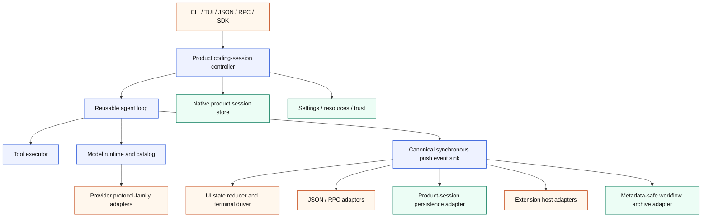

# Architecture Migration Plan

Status: active engineering plan

This document is the source of truth for improving pipy's internal architecture
while preserving its shipped Pi-shaped product behavior. It turns the
code-quality tracks in [Backlog](backlog.md) into an ordered migration. Pi is
the behavioral reference, Tau is a useful example of Python package boundaries,
and pipy's parity, protocol, and real-PTY tests are the compatibility harness.

The migration is deliberately incremental. It is not a rewrite, a package
rename, or a pause in parity work. Each slice must leave `main` releasable and
must not combine a structural extraction with unrelated feature changes.

## Why This Work Is Needed

Pipy has strong behavioral coverage and product-specific strengths: its native
inline-scrollback TUI, real-PTY verification, project-trust and path-safety
boundaries, metadata-safe auxiliary workflow archive, Python extension surface,
and small reviewed parity slices. Those properties are constraints of the
migration, not components to replace.

The main structural risk is concentration of responsibilities. In particular,
`NativeToolReplSession.run()` coordinates provider streaming, the tool loop,
queued input, commands, session persistence, extensions, rendering, settings,
and terminal lifecycle. Provider construction and model facts are spread across
large switches, while provider wire families repeat transport, retry, usage,
and parsing code. The extension and TUI implementations have similarly grown
past a size where their internal boundaries remain obvious.

The desired result is not simply smaller files. It is a dependency structure in
which the agent loop, product session, UI, provider runtime, persistence, and
extensions can be tested and evolved independently.

## Target Architecture



The first implementation should use subpackages under
`pipy_harness.native`; for example `native.agent`, `native.coding`,
`native.ui`, `native.providers`, and `native.extensions`. Physical distribution
package splits are a later decision, after import tests prove the boundaries.

The intended dependency direction is:

```text
entrypoints -> coding session -> agent loop -> model runtime -> providers
                         |             |
                         |             +-> tool executor
                         +-> product session/settings/resources

agent events -> UI, automation, persistence, extensions, workflow archive
```

The core agent package must not import the CLI, TUI, ANSI rendering, concrete
provider adapters, product-session paths, or archive implementations. UI and
automation code consume events; they do not participate in agent decisions.

## Current Concurrency Model

Pipy's current core orchestration is synchronous. `NativeToolReplSession.run()`,
the SDK, provider ports, and event sinks expose synchronous methods. Blocking
provider and tool work is isolated with owned worker threads where an
interactive or RPC mode must remain responsive; cancellation uses threading
events and `CancelToken`. No asyncio event loop owns the product lifecycle.

Phases 1–3 preserve that model. The canonical event port is synchronous push,
and the mode-owned composite invokes its projections synchronously in their
characterized order. Converting the core, provider port, SDK, or adapters to
asyncio would change cancellation, signal, backpressure, and blocking-I/O
semantics; it therefore requires a separate design, characterization suite, and
reviewed migration slice. It is not part of this plan.

## Migration Invariants

Every slice must preserve these rules:

1. **Behavior before shape.** CLI output, JSON/RPC protocols, session formats,
   extension contracts, provider requests, event ordering, and TUI behavior
   remain unchanged during an extraction. A behavior change requires its own
   later slice and parity contract.
2. **Native product direction.** `pipy-native` remains the product runtime.
   Wrapping other coding-agent CLIs remains a capture/reference facility.
3. **Privacy and trust.** Project trust, workspace path safety, product-session
   privacy, and the metadata-only workflow archive cannot be weakened.
4. **Inline terminal behavior.** The normal-buffer inline-scrollback TUI and
   its terminal-restoration guarantees remain product requirements.
5. **Push-based live events.** The core uses a synchronous `emit(event)`
   boundary. Iterator and protocol streams are adapters over it, so slow
   consumers cannot silently turn live tool updates into post-hoc batches.
   Backpressure is
   intentional: each run mode owns one composite immediate sink with a fixed,
   explicitly tested projection order. That composite invokes the projections
   active for the mode—such as rendering, automation serialization, product
   persistence, or workflow metadata—serially, and completion means all of
   those immediate projections have accepted or serialized the event. It is a
   static application adapter, not a dynamic pub/sub facility. The first
   extraction adds neither unbounded fan-out nor background queues. RPC, SDK,
   persistence, and terminal projections keep their characterized blocking,
   cancellation, and error semantics; any later buffering, dropping, timeout,
   dynamic subscriber, or parallel-dispatch policy is a separate behavior
   change. Semantic extension hooks are not converted into generic stream
   subscribers.
6. **Strict new boundaries.** New core modules use strict typing and explicit
   protocols. They may temporarily adapt legacy types but may not introduce new
   unchecked `Any` or unexplained `type: ignore` uses.
7. **No speculative dependency expansion.** The extraction uses the current
   standard-library posture. A runtime dependency such as Pydantic, attrs, or a
   new HTTP client requires a separate ADR and must not be hidden in a move.
8. **Small trunk-based slices.** Work lands directly on `main` as independently
   green commits. Avoid concurrent edits to the same monolith.
9. **Review and documentation.** Each implementation slice has focused tests,
   `just check`, relevant conformance/PTY gates, updated architecture/backlog
   documentation, and a different-family review before commit. Update release
   notes when behavior or a public SDK/extension surface changes.
10. **No compatibility scaffolding for private internals.** Once all internal
    callers migrate, delete the old path instead of adding deprecation aliases.

## Phase 0: Trustworthy Baseline

### Slice 0.1: Deterministic quality gate

First investigate order/global-state sensitivity in the full suite, including
`tests/test_parity_probe_trust.py::test_legacy_parity_score_opts_into_trusted_workspace_fixtures`,
which failed after the full suite but passed in isolation during the architecture
comparison. If it reproduces, record the contaminating predecessor or leaked
state in a focused regression test and run that reproducer in both orders. If it
does not reproduce, record the exact predecessor/reverse/full-suite evidence and
do not add speculative retries or isolation. Run the full suite repeatedly
before treating one green execution as a baseline.

Add checked-in CI that invokes repository-owned commands rather than duplicating
them. It should cover Ruff lint, Mypy, the full unit suite, documentation build,
a Linux PTY subset, and—where the runner is available—a small macOS PTY job.
Enable `ruff format --check` only after a dedicated mechanical normalization
slice makes the existing tree clean; do not hide a repository-wide formatting
rewrite inside the CI baseline.

Acceptance:

- `just check` passes three consecutive runs from the same clean checkout.
- A reproduced parity-score failure passes in both orders in one process (or
  equivalent isolated subprocess arrangements), and any identified leaked state
  is asserted to be restored. When it remains non-reproducible, the slice records
  the exact order matrix and leaves the test unchanged; three identical
  full-suite runs alone are not presented as proof that a leak was fixed.
- CI and local validation use the same `just` entry points.
- `just docs-build` runs in CI.
- CI runs a named Linux real-PTY subset. A named macOS real-PTY subset is
  required when an available runner supports it; otherwise the workflow records
  the omission explicitly rather than silently claiming cross-platform PTY
  coverage.

Implementation evidence (2026-07-17): the historical parity-score failure did
not reproduce. The isolated test, the actual collected predecessor group
followed by the probe, the reverse order, three complete Python 3.14 suites, and
one complete Python 3.11 suite all passed; inspection found no repository-fixture
mutation or ambient-state leak, so no speculative test patch was made. CI now
gates lint/types/docs on Python 3.14, full tests on Python 3.11 and 3.14, and an
eight-test real-PTY smoke set on Linux and macOS. The pre-existing Ruff-format
baseline remains explicit: 239 files require formatting, so format-check
activation is a separate mechanical slice.

### Slice 0.2: Characterization and boundary gates

Before moving orchestration, capture representative golden contracts for:

- a plain provider response;
- a provider/tool/provider cycle;
- tool failure and argument failure;
- provider retry and cancellation;
- queued steering and follow-up turns;
- session persistence and resume;
- extension lifecycle/tool callbacks;
- JSON and RPC event ordering; and
- SDK `run_native` results, public stream-sink behavior, finalization, and public
  exports/signatures;
- metadata-only workflow archive allowlists, using prohibited prompt/output/
  tool-content sentinels to prove no crossover from full-content modes; and
- TUI mapping and terminal restoration.

Add import-boundary tests as soon as a new package exists. These tests should
inspect imports or module dependencies without importing effectful entrypoints.

Acceptance:

- Current per-mode outputs and callback order have golden snapshots before a
  canonical event representation exists.
- Archive characterization proves prohibited full-content sentinels never enter
  JSONL, Markdown summaries, catalog output, or workflow event summaries.
- The import-boundary harness is checked in with rules that activate when each
  new package appears; Phase 0 does not reference modules that do not yet exist.

Implementation evidence (2026-07-18): dedicated architecture-contract tests now
freeze synchronous SDK/finalization behavior, the raw native product-session
versus metadata-only workflow-archive privacy split, plain/tool/error provider
event order, JSON and RPC boundaries, queued steering/follow-up and cancellation,
extension true-idle lifecycle order, and the planned import directions. The
import gate statically covers both module-first and package-first migrations,
fails closed on stale forbidden names and invalid relative imports, and activates
new layer rules without importing effectful entrypoints. Existing specialized
retry, tool-progress, PTY/TUI, and extension-hook suites remain the owners of
their deeper behavior rather than being duplicated here.

## Phase 1: Canonical Agent Event Seam

### Slice 1.1: Typed event vocabulary

Create a focused `native.agent` package containing canonical messages, events,
and run results. The event vocabulary must represent turn lifecycle, assistant
text/reasoning deltas, tool-call start/update/end, usage, retry, cancellation,
steering/follow-up consumption, provider errors, and terminal run outcomes.

The central port should preserve the current synchronous concurrency model:

```python
class AgentEventSink(Protocol):
    def emit(self, event: AgentEvent) -> None: ...
```

The producer completes the canonical boundary before emitting the next event.
Canonical payload strings are explicitly full-content product/automation data;
summary-safe workflow DTOs do not belong in the agent package. Crossing into the
workflow archive always uses an explicit allowlisting adapter.

Implementation evidence (2026-07-18): `native.agent` now provides frozen,
slotted, runtime-validated messages, events, usage/failure/run results, closed
turn/run/cancellation outcomes, and the synchronous `AgentEventSink`. Full
prompt/model/reasoning/tool/error content is wrapped as redacted-repr
`ProductContent`; the package exposes no serializer or workflow-archive DTO.
The event vocabulary keys starts and live updates by the provider correlation id
available at those boundaries, then carries both that id and the pipy-owned
request id on the completed result; it also preserves deferred-tool history,
cumulative usage plus last-turn context totals, tool duration, steering/follow-up
consumption, retry and failure states, and self-contained cancellation/terminal
outcomes. The dependency gate now rejects imports from outer adapters,
automation, extensions, UI, product-session storage, concrete providers, the
runner, and the workflow archive. Existing emitters and wire dictionaries remain
unchanged for Slice 1.2; the parallel legacy message envelope must be replaced
atomically there rather than retained through a compatibility alias.

### Slice 1.2: Adapt existing consumers

Route the current automation sink, extension emitter, renderers, JSON/RPC
streams, SDK stream/result surface, and workflow recorder through adapters.
Preserve all external formats and callback ordering. For the native product
session, this slice defines and tests the event-to-current-persistence projection
but leaves write ownership and call sites in place; Slice 3.3 performs that move.
The Phase 0 archive sentinel tests are a hard precondition for changing the
workflow-recorder adapter.

Slice 1.2 is one atomic consumer cutover. The legacy conversation envelope and
its emitter form a connected producer/consumer graph; landing unused adapters
or retaining both message paths would create the shadow implementation this
migration forbids. The slice therefore moves the loop, providers, product
session, compaction, extensions, automation, SDK, and tests together, then
deletes `native.tools.messages` and the legacy automation emitter.

Implementation evidence (2026-07-18): the tool loop and one-shot SDK now emit
the canonical synchronous event vocabulary. A fixed-order composite projects
text/reasoning deltas, buffered assistant messages, and tool start/update/result
events through the rendering adapter before the existing Pi-shaped automation
dictionaries and extension lifecycle hooks. It also defines the future
product-session persistence projection and feeds an explicit metadata-only
workflow allowlist. Turn chrome and local-command rendering remain terminal
composition concerns for Phase 4; direct product-session writes retain their
existing ownership until Slice 3.3. `AutomationAgentEventAdapter` owns cumulative
assistant partial text, malformed-argument fallback, camelCase fields, and
provider tool correlation ids, while RPC still owns queue reservation and the
true-idle `agent_settled` boundary. Steering/follow-up consumption and closed
cancellation reasons are canonical-only bookkeeping with no new wire records.
The SDK retains its synchronous public callbacks and result contract through a
canonical adapter. Product-session reload infers historical tool names from
branch-local ancestry; unresolved legacy tool records remain storage-only so
their ancestry and JSON survive without exposing an invalid provider message.

Acceptance for Phase 1:

- Existing JSON/RPC snapshots and extension lifecycle tests do not change
  except for intentional internal construction.
- A fake sink can capture one ordered trace for any run mode.
- The SDK keeps its synchronous `RunRequest`-in/`RunResult`-out contract,
  public exports, stream-sink semantics, and finalization behavior.
- No canonical event type contains an archive-unsafe convenience serializer.
- The event producer has no knowledge of terminal or storage formats.
- Canonical core traces are mode-neutral, while adapter tests preserve each
  public mode's current representation.
- Import-boundary tests fail if `native.agent` imports CLI, outer adapters,
  automation, extensions, TUI, product-session paths, concrete providers, the
  runner, or the workflow archive, or if provider transports import UI code.

## Phase 2: Reusable Agent Loop

### Slice 2.1: Tool executor — SHIPPED

Extract argument validation, tool lookup/invocation, live updates, normalized
results, cancellation, failure mapping, and termination signaling into
`native.agent.tools` (or an equivalently focused module). Preserve sequential
execution first.

Implementation evidence (2026-07-19): `native.agent.tools.ToolExecutor` now
owns the synchronous per-call path: registry lookup, JSON/schema validation,
pipy request-id allocation, `ToolPort` invocation, live `ToolContext` output,
normalized canonical results, exact malformed/error mapping, and an optional
worker plus cancel-event boundary. `ToolExecutionInterruption` closes the
executor outcome to settled, operator abort, or local command without importing
the TUI. Completion and cancellation are explicitly ordered so an earlier
cancellation cannot be replaced by a racing late result, and each invocation's
live-output sink stops admitting new callbacks before the executor returns.
Closing the gate never waits on an already admitted, backpressured synchronous
callback; that callback retains its original turn index and call identity if it
finishes later. `NativeToolReplSession` binds both values immutably per call, adapts
terminal wait strings at the composition seam, and retains budgets, extension
policy/result hooks, timing, event order, malformed-streak policy, provider
history, persistence, and run/turn outcomes. `native.tools` now exposes only
contracts; concrete tools are imported from their defining modules. The
superseded `_invoke`, `_invoke_interruptible`, and `_error_observation` methods
are deleted. Caller scheduling remains sequential and no parallel-tool scheduler
is introduced. A cancelled uncooperative worker may outlive its bounded join,
but its invocation sink is already closed and its turn/call identity cannot change.

### Slice 2.2a: Provider-turn boundary — SHIPPED

Extract one synchronous provider completion into
`native.agent.loop.ProviderTurnExecutor`. The boundary owns text and reasoning
delta publication as canonical events, the optional worker and `CancelToken`,
exact first-cancellation versus worker-completion ordering, bounded cleanup,
late-delta admission gating, and a typed result-or-cancellation outcome. It is
headless and provider-neutral; it imports the provider port and canonical
contracts, not a concrete transport, the TUI, automation, extensions, product
session, compaction, provider construction, capture, or the workflow archive.
The canonical `native.agent` initializer does not eagerly re-export it.

`NativeToolReplSession` retains the TUI and RPC/external-abort wait adapters,
queued-message storage and promotion, provider-request construction, extension
preflight and lifecycle policy, tool cycles and budgets, and the current
zero-retry and usage-accumulation policy. This first boundary deliberately does
not move the full provider/tool cycle or make `run()` a composition-only method.
The superseded `_ProviderTurnCompletion`, `_agent_text_sink`,
`_agent_reasoning_sink`, `_complete_headless_cancellable_turn`,
`_complete_provider_turn`, and `_cancel_active_turn` paths are deleted in the
same slice. The shared `HarnessStatus` enum moves to dependency-neutral
`pipy_harness.status`; public harness/native model exports keep the same enum
identity and runtime-resolvable annotations while the provider-turn import
graph no longer loads capture or the metadata workflow archive.

Implementation evidence (2026-07-19): commit `925bd24` extracts the
provider-turn executor and removes all six superseded session-local completion,
delta-sink, and cancellation paths. Direct executor, tool-loop, SDK, import,
RPC, extension, TUI, PTY, and documentation gates passed; final `just check`
reported 3,330 passed and 2 skipped with Ruff and mypy clean across 338 sources.
Pi `openai-codex/gpt-5.6-sol` reported CLEAN after three fixed warnings in its
first round and a clean post-Fable re-review. Claude Fable's valid review found
two suggestions, both fixed, then returned an unscoped CLEAN with no skipped or
truncated files, redactions, or forbidden tool use. Five findings total were
accepted and fixed; none were rejected or deferred.

### Slice 2.2b.1: Canonical agent usage accounting — SHIPPED

Move provider-neutral token accumulation, last-turn context totals, cache-hit
classification, canonical `AgentUsage` snapshots, and injected per-token rate
application from `NativeToolReplSession` into
`native.agent.usage.AgentUsageAccumulator`. The same module defines the frozen,
runtime-validated `AgentTokenPricing` value passed in by the product composition
layer. The product-owned provider/model pricing table and lookup remain in the
session for this slice; the reusable agent layer must not import the pricing
catalog, provider selection, UI, product session, capture, archive, or concrete
provider modules. `native.agent` does not eagerly re-export the usage runtime.

This boundary preserves existing provider telemetry coercion, cache-denominator
heuristics, cost display, context-meter fallback, canonical event payloads, and
per-prompt versus session-total reset behavior. It does not move request or
history construction, retry or token-budget policy, compaction, tool
capabilities, active-input/queue ownership, persistence, rendering, or the full
provider/tool loop. Pricing/catalog consolidation remains Phase 5.3.

Implementation evidence (2026-07-19): the slice extracts the canonical usage
runtime, deletes the session-local accumulator, pricing value, coercion, cache
classification, and provider/model bind path, and migrates all six construction
and reset sites to injected pricing. Direct usage, session integration, exact
lifecycle ordering, pricing-prefix, all-reset-path, static import, recursive
synthetic, and isolated fresh-process contracts passed. Final `just check`
reported 3,382 passed and 2 skipped with Ruff and mypy clean across 340 sources;
documentation and diff gates passed, and the source-equivalent PTY, RPC,
extension-live-session, and TUI workflow gates remained green. Pi
`openai-codex/gpt-5.6-sol` returned explicit CLEAN in the user-authorized fourth
round after four accepted warnings were fixed; none were rejected or deferred.
Claude Fable returned valid unscoped CLEAN with no findings, skipped or
truncated files, redactions, or forbidden tool use.

### Slice 2.2b.2: Canonical agent-history compaction — SHIPPED

Move the mechanical canonical-message history reduction into
`native.agent.history`. The reusable boundary accepts any `Sequence` of
`AgentMessage` values plus caller-owned limits without mutating the caller's
container, and detaches the retained history into an immutable tuple with
structural counters. It cuts only at user group boundaries, counts
assistant/tool-call/tool-result content exactly as before, and performs no I/O.

The product session retains compaction enablement, manual/automatic triggers,
threshold defaults, extension-hook ordering, the exact counts-only summary
text, provider-system-prompt injection, diagnostics, aggregate result counters,
and durable native-session-tree writes. The canonical module exposes no archive
serializer and is not eagerly re-exported from `native.agent`. The obsolete
`native.session_compaction` module and its unused no-tool conversation path are
deleted rather than retained as an alias or shadow implementation.

One characterized correctness prerequisite deliberately narrows automatic
compaction: when an extension has attached transient `deliverAs=nextTurn`
custom context, automatic compaction is deferred for that entire run. This
prevents a retained-history index shift from carrying one-turn extension
context into the next provider request. A later ordinary run may compact, but
an extension that injects transient context on every turn can defer automatic
compaction indefinitely; manual `/compact` remains available.

Apart from that correction, this slice changes no product-session storage,
provider-request schema, summary text, JSON/RPC/SDK/extension representation,
archive allowlist, compaction policy, queue behavior, or TUI behavior. Tool
capabilities, remaining request/effect/input seams, and the full provider/tool
loop remain Slices 2.2b.3–2.2b.5.

### Slice 2.2b.3: Session tool-capability port seam — SHIPPED

Define the runtime-checkable `AgentToolCapabilities` protocol beside the
reusable executor in `native.agent.tools`. The protocol exposes only a detached
tuple of tool definitions, synchronous one-call execution, and canonical
error-result construction. Product registry composition, built-in versus extension
identity, CLI/run filters, active-tool mutation, extension replacement,
workspace `ToolContext`, and `ToolExecutor` construction move behind the
`native.tool_capabilities.NativeToolCapabilities` facade and its frozen
`ToolFilterOptions` value. The product session constructs that facade and uses
only the protocol methods inside the provider/tool cycle.

The cut preserves synchronous backpressure, strictly sequential scheduling,
tool-budget accounting, malformed-call behavior, extension preflight/result
hook ordering, live-output identity, dynamic-tool annotations, reload behavior,
and every JSON/RPC/SDK/session/archive representation. Neither the protocol nor
the product facade is eagerly exported from a package root. The canonical
module stays free of concrete tools, product sessions, providers, UI,
persistence, extensions, capture, automation, and the metadata-only workflow
archive; the product facade composes injected ports but does not construct
concrete tool implementations.

Characterization records two pre-existing authorization defects without
silently changing them in this mechanical ownership slice. First, a
`before_provider_request` transform can name a registered tool outside the
prior active/final request snapshot because the returned names are filtered
against the registry rather than intersected with that snapshot. Second, a
provider call outside the exact final advertised set can currently reach tool
hooks and execution. Slice 2.2b.4 must close both together: request-hook tool
names intersect the prior snapshot, and an out-of-snapshot returned call
produces the normal policy error and consumes budget without any hook,
execution, or invocation count. The separate June
precedence/unknown-name conflict is not part of this slice.

### Slice 2.2b.4: Provider-request, run-effect, usage, and active-input seams — PENDING

Establish the remaining typed ports needed by the reusable loop. Phase 3 still
owns queue storage/lifecycle and Phase 3.3 still owns persistence write
relocation; this slice only makes those product policies injectable. As an
ordered correctness closure, replace absolute-index transient-context cleanup
with identity-based removal or safe re-anchoring, then remove the Phase 2.2b.2
automatic-compaction deferral without changing the context's one-run lifetime.

### Slice 2.2b.5: Full headless `AgentLoop` ownership cutover — PENDING

Extract the pure turn loop from `NativeToolReplSession.run()` into
`native.agent.loop`. It owns provider streaming, assistant-message assembly,
tool-call cycles, retry decisions, token/tool budgets, cancellation, queued
steering/follow-up consumption through a controller-owned port, and the final
typed result. The coding-session controller owns queue storage, ordering, and
lifecycle; the loop can only request the next eligible steering or follow-up
item while a run is active. During Slice 2.2b, the legacy
`NativeToolReplSession` implements and owns that port; Slice 3.1 moves the same
storage/policy behind the new controller without changing the loop contract.

The loop receives model/provider and tool capabilities through protocols. It
does not know about terminal rendering, slash commands, menus, session paths,
settings files, or extension UI.

Acceptance for Phase 2:

- The loop runs under tests with fake providers, tools, cancellation, and sink.
- Existing event ordering, provider requests, budgets, and error behavior match
  the characterization contracts.
- `NativeToolReplSession.run()` no longer contains the provider/tool cycle.
- Pi-style parallel tool execution, live-update refinements, named/forced tool
  choice, and termination semantics remain separate feature slices after the
  extraction is clean.

## Phase 3: Product Coding-Session Controller

### Slice 3.1: Headless session state machine

Create `native.coding` modules for the product session lifecycle, queued user
input storage/policy, the queue port offered to an active agent loop, current
provider/model, settings/resources, command outcomes, persistence coordination,
and invocation of the reusable agent loop.

The controller owns product policy; the agent loop remains reusable. Commands
return typed outcomes rather than printing, repainting, or writing session files
directly.

### Slice 3.2: Declarative command registry

Replace the large command dispatcher with one registry containing command name,
aliases, description, availability predicate, argument contract, and handler.
Help, completion, menus, and dispatch consume the same registry.

### Slice 3.3: Persistence subscriber

Move the existing product-session write call sites behind the projection
contract established in Slice 1.2 and make persistence a standalone projection
inside each applicable mode's fixed composite sink.
Keep the raw private native session tree distinct from the metadata-safe
workflow archive. Re-run and extend the Phase 0 crossover tests; this slice owns
write relocation, recovery/error semantics, and lifecycle ordering, not the
canonical event vocabulary.

Acceptance for Phase 3:

- Commands and session transitions are testable without a terminal.
- The controller coordinates components but implements neither rendering nor
  provider wire protocols.
- Product-session loading/saving has no dependency on TUI classes.
- The legacy `NativeToolReplSession.run()` method—not its containing module—is
  an orchestration shell, with an intermediate Phase 3 target below 800 lines.
  Phase 7 continues reducing that pre-existing method toward the 100-line
  guardrail where the extracted boundaries make that honest rather than
  cosmetic.

## Phase 4: UI Boundary

### Slice 4.1: Pure UI state reducer

Introduce a deterministic `UiState` plus reducer that maps agent and coding
events to display state. The reducer performs no terminal I/O.

### Slice 4.2: Terminal driver

Move ANSI output, layout, input, scrollback, resize handling, cursor state, and
terminal restoration behind a terminal driver. Preserve the current
normal-buffer inline-scrollback behavior and captured-stream fallback.

Acceptance for Phase 4:

- `native.agent` and the headless coding controller have no `tui.py`, ANSI, or
  terminal imports.
- Reducer tests cover display decisions without a PTY.
- Existing real-PTY tests pass at their supported sizes and cover restoration
  after success, error, cancellation, and resize.
- The UI remains inline; no alternate-screen or Textual migration is implied.
- Extension UI continues through its characterized legacy bridge during this
  phase. Slice 6.4 exclusively owns moving extension renderers and UI callbacks
  onto the new UI boundary, so Phase 4 does not edit extension-runtime ownership.

## Phase 5: Provider and Model Runtime Consolidation

This phase incorporates the still-relevant parts of Backlog Track CQ-B.

### Slice 5.1: Shared HTTP boundary

Centralize request execution, authentication/header application, timeouts,
cancellation, retry classification, error normalization, streaming transport,
and safe usage helpers in `native.http`. Preserve special requirements such as
Bedrock signing order and OpenAI Codex retry/fallback header reuse.

### Slice 5.2: Protocol families

Migrate one provider family at a time under `native.providers`:

- OpenAI Responses;
- OpenAI-compatible Chat Completions;
- Anthropic Messages, including Bedrock adaptation; and
- Gemini `generateContent`, including Vertex adaptation.

Provider-specific modules should mostly translate canonical messages/events to
and from wire formats. Each family migration needs captured request/stream/error
fixtures and must delete the superseded duplicate helpers in the same slice.

### Slice 5.3: Model runtime and catalog

Introduce a data-driven `ModelRuntime`/catalog that owns model facts,
capabilities, authentication requirements, availability, construction, routing,
and refresh policy. Collapse the repeated provider switches in `repl_state.py`
and `provider_construction.py` only after their behavior is characterized.

Acceptance for Phase 5:

- Adding a normal model is primarily a catalog/data change.
- Provider modules do not contain UI or product-session policy.
- Auth, retry, usage, and availability logic have one owner per concern.
- Protocol-family fixtures prove request and streamed-event compatibility.
- A fresh Pi-head audit identifies later feature gaps such as dynamic catalogs,
  native extension providers, deferred tools, and local-model routing; those
  features are not smuggled into consolidation commits.

## Phase 6: Extension and Package Runtime Boundaries

### Slice 6.1: API types and activation

Move stable extension value objects/protocols and activation/discovery mechanics
into focused modules without changing callbacks, ordering, or public imports.

### Slice 6.2: Hook dispatch

Extract lifecycle, input, prompt, tool-call, and tool-result dispatch by hook
family. Preserve the current serial/fail-soft semantics with golden callback
traces.

### Slice 6.3: Host and provider ports

Define extension host ports against coding-session, agent-event, and
model-runtime interfaces rather than `NativeToolReplSession`. Move extension
provider registration onto the same runtime ports as built-ins.

### Slice 6.4: UI bridge

Move extension rendering, overlays, notices, and editor interactions behind the
UI boundary from Phase 4. Preserve the public extension API and TUI behavior.

Package discovery and activation should depend on resource/catalog ports, not
TUI/session implementations. A headless fake host must be sufficient for most
extension tests.

Acceptance:

- Headless extension tests need no real terminal or concrete product session.
- Package activation does not import the TUI/session implementation.
- Extension providers use the same model runtime and provider ports as built-in
  providers.
- Public extension behavior changes, if any, are isolated, documented, and
  released as explicit parity slices.

## Phase 7: Type and Complexity Ratchet

After consumers migrate:

- remove obsolete no-tool conversation types and other dead adapters;
- replace loosely shaped results with discriminated variants or factory-only
  constructors;
- close string-label universes with enums or literals where useful;
- enable strict Mypy one new subpackage at a time;
- delete duplicate helpers immediately after their final migration; and
- lower complexity and unchecked-type baselines in measured steps.

Initial guardrails are directional and should not encourage cosmetic splitting:

- no new function over 100 lines without written justification;
- no new module over 2,000 lines without an architectural review;
- zero new unchecked `Any` or unexplained `type: ignore` in strict packages;
- no increase in the repository's Ruff C901 baseline; and
- every new architectural layer has an import-boundary test.

The end-state target is fewer than 40 C901 findings, fewer than 30 justified
`type: ignore` uses, and no critical session/provider control path with extreme
complexity. These are diagnostic targets, not reasons to obscure logic.

## Ordered Delivery Ledger

The default sequence is:

1. deterministic local quality gate and CI;
2. characterization traces and import-boundary harness;
3. canonical typed events and synchronous push sink;
4. adapters for automation, extensions, rendering, SDK, workflow archive, and
   the product-persistence projection definition (write relocation stays in
   item 9);
5. tool executor extraction;
6. reusable agent-loop extraction;
7. headless coding-session controller;
8. declarative command registry;
9. persistence subscriber separation;
10. pure UI reducer and terminal driver boundary (Slices 4.1–4.2; extension UI
    relocation is deferred to Slice 6.4);
11. shared HTTP infrastructure;
12. one reference provider-family migration;
13. remaining protocol-family migrations;
14. model runtime/catalog consolidation;
15. extension-runtime Slices 6.1–6.4, one independently green monolith-touching
    slice at a time; and
16. dead-code deletion and type/complexity ratchet.

### Migration commit ledger

| Slice | Commit | Verification and review |
| --- | --- | --- |
| 0.1 | `e063e8d` | Cross-platform baseline; deterministic local/CI gates recorded above. |
| 0.2 | `b122e37` | Architecture characterization, privacy, SDK, and import contracts. |
| 1.1 | `804d6d7` | Canonical typed synchronous agent contracts. |
| 1.2 | `bd1f9b9` — `refactor: route native consumers through canonical agent events` | `just check` (3,268 passed, 2 skipped), docs, PTY, automation/RPC, extension, session-tree, TUI, SDK/archive privacy, provider, and export gates passed; Pi `openai-codex/gpt-5.6-sol` round 14 CLEAN after 23 fixed findings; Claude Fable CLEAN. Its two redacted secret-sentinel fixture diffs were verified as mechanical contract migrations by the dedicated 17-test export suite and 11-check export/privacy gate. |
| 2.1 | `5348127` — `refactor: extract reusable tool executor` | Direct executor, tool-loop integration, cancellation, rendering, extension, bash, TUI, and import-boundary contracts passed. Final `just check`: Ruff and mypy clean, 3,300 tests passed, 2 skipped; docs, 8 PTY smoke tests, 15 automation/RPC checks, 4 extension live-session checks, 12 TUI workflow checks, and diff gate passed. Pi `openai-codex/gpt-5.6-sol` round 4 CLEAN after 5 accepted/fixed Pi findings across rounds; Claude Fable round 2 returned valid unscoped CLEAN after 2 fixed findings, with no skips, truncations, redactions, or forbidden tools. |
| 2.2a | `925bd24` — `refactor: extract provider-turn executor` | Direct provider-turn, tool-loop, SDK, import, RPC, extension, TUI, PTY, docs, and diff gates passed. Final `just check`: Ruff and mypy clean across 338 sources, 3,330 tests passed, 2 skipped; 8 PTY, 15 automation/RPC, extension, and 12 TUI workflow checks passed. Pi `openai-codex/gpt-5.6-sol` round 1 found 3 warnings, all fixed; rounds 2 and post-Fable round 3 were explicit CLEAN. Claude Fable found 2 suggestions in its first valid pass, both fixed, then returned valid unscoped CLEAN with no skips, truncations, redactions, or forbidden tools. Five total findings were accepted/fixed; none were rejected or deferred. |
| 2.2b.1 | `c261f2c` — `refactor: extract canonical agent usage` | Direct usage, session integration, exact lifecycle-ordering, pricing-prefix, six reset-path, and static/recursive/fresh-process import contracts passed. Final `just check`: Ruff and mypy clean across 340 sources, 3,382 tests passed, 2 skipped; docs and diff gates passed, with PTY, RPC, extension-live-session, and TUI workflow conformance source-equivalent and green. Pi `openai-codex/gpt-5.6-sol` round 4 CLEAN after 4 accepted/fixed warnings and explicit authorization to continue the cycle; Claude Fable returned valid unscoped CLEAN with no findings, skips, truncations, redactions, or forbidden tools. |
| 2.2b.2 | `3d39dd6` — `refactor: extract canonical agent history` | Direct history, product compaction, durable tree, extension-context lifetime, parity, and static/recursive/fresh-process import contracts passed. Final `just check`: Ruff and mypy clean across 340 sources, 3,397 tests passed, 2 skipped; docs, diff, 8 PTY smoke tests, 15 automation/RPC checks, 4 extension live-session checks, 12 TUI workflow checks, and the compaction parity gate passed. Pi `openai-codex/gpt-5.6-sol` reached CLEAN after 5 initial slice findings were fixed; post-Fable fix reviews also reached CLEAN after 1 public-guide warning was fixed. Claude Fable round 3 returned valid unscoped CLEAN after 2 accepted/fixed documentation suggestions, with no findings, skips, truncations, redactions, or forbidden tools. The independent integration audit fixed 1 warning and 1 suggestion and returned CLEAN. Every finding was accepted/fixed; none was rejected or deferred. |
| 2.2b.3 | This commit — `refactor: add agent tool-capability port` | Direct capability, product-session, extension reload/hook, streaming/rendering, adapter, and static/recursive/fresh-process import contracts passed. Final `just check`: Ruff and mypy clean across 342 sources, 3,433 tests passed, 2 skipped; docs, diff, 8 PTY smoke tests, all extension and automation/RPC conformance gates, and the 49/49 parity score passed. Independent integration audit fixed 3 warnings and 2 suggestions, then returned CLEAN. Pi `openai-codex/gpt-5.6-sol` round 1 found 1 warning and 1 suggestion; both were fixed, and round 2 returned explicit CLEAN with no findings. Claude Fable returned valid unscoped CLEAN with no findings, skips, truncations, redactions, or forbidden tools. The first Fable attempt was fail-closed INVALID after an out-of-scope path request; its fresh isolated replacement is the recorded CLEAN gate. All 7 findings were accepted and fixed; none was rejected or deferred. |

The earlier code-quality audit remains evidence, with this mapping:

- **CQ-B (provider consolidation):** Phase 5.
- **CQ-C (bad-state-impossible):** persistence cases in Phase 3.3; provider and
  model result types in Phase 5; remaining value-object/type work in Phase 7.
- **CQ-D (structural simplification):** agent/session work in Phases 2–3, input
  and UI work in Phase 4, provider switches in Phase 5, extension boundaries in
  Phase 6, and remaining catalog/read-boundary hygiene in Phase 7.
- **CQ-E (correctness):** independent focused bug-fix prerequisites in the phase
  that touches each owner. They must not be hidden inside mechanical moves or
  marked resolved merely because code moved.
- **CQ-F (deduplication):** delete duplicates in the owning migration phase;
  any cross-cutting residue is completed in Phase 7.

Resolved or obsolete audit findings remain historical evidence. Before starting
a mapped slice, revalidate its cited finding against the current code rather
than assuming the 2026-05-26 observation still applies.

Two streams may interleave only when they do not touch the same central files:
the control-plane stream (events, agent loop, coding session, UI) and the
provider stream (HTTP, protocol families, model runtime). On trunk, only one
slice may edit `tool_loop_session.py`, `tui.py`, `extension_runtime.py`,
`repl_state.py`, or `provider_construction.py` at a time.

## Slice Protocol

For each numbered slice:

1. restate the behavioral contract and explicit non-goals;
2. add or identify characterization tests before moving code;
3. make the smallest extraction that establishes one ownership boundary;
4. delete the superseded internal path rather than leaving a shadow path;
5. run focused tests, applicable conformance/PTY gates, `just check`, and
   `just docs-build`;
6. update this ledger, [Architecture](architecture.md), and
   [Backlog](backlog.md); update user docs/release notes only when applicable;
7. obtain a different-family review and fix/re-review until clean; and
8. commit the green slice directly to `main`.

Do not start a second monolith-touching slice while the first has uncommitted
changes. A subagent may implement a bounded slice, but the primary agent owns
integration, verification, documentation, and the review gate.

## Decision Gates

These decisions are intentionally deferred until evidence exists:

- **Distribution package split:** consider only after import tests show stable
  `agent`, `coding`, `ui`, and `providers` boundaries.
- **Runtime dependencies:** decide through an ADR after the shared interfaces
  exist; do not mix with extraction. New ADRs live at
  `docs/decisions/YYYY-MM-DD-<slug>.md` and include Status, Context, Decision,
  Alternatives, Consequences, and Verification/Reversal sections. They receive
  `just docs-build` plus the same different-family review as other architecture
  changes, and the active migration/backlog entry links to them.
- **Parallel tool execution and richer termination:** implement against the
  extracted agent loop as Pi-parity features.
- **Public SDK naming:** preserve current names until the new internal seams are
  stable, then make any public realignment as a dedicated no-deprecation slice.
- **UI framework:** the current inline terminal remains the requirement unless
  a separate product decision changes it.

## Completion Criteria

The migration is complete when:

- the complete suite is deterministic in CI;
- the core agent loop runs with fake providers/tools and no terminal,
  filesystem, concrete provider, or product-session dependency;
- agent and provider layers have no UI imports;
- commands and coding-session transitions run headlessly;
- JSON/RPC/session/extension compatibility remains covered by golden contracts;
- `NativeToolReplSession.run()` is composition rather than the implementation;
- provider construction is catalog-driven and protocol-family duplication is
  removed;
- extensions can be exercised through a fake host;
- inline TUI and privacy/trust PTY/conformance gates remain green; and
- complexity and unchecked-type baselines have materially declined without
  weakening behavior.

The first implementation slice is Phase 0.1. The first structural slice after
the baseline is the canonical event seam, because it gives the agent loop, UI,
automation, persistence, and extensions one explicit contract to migrate
against.
