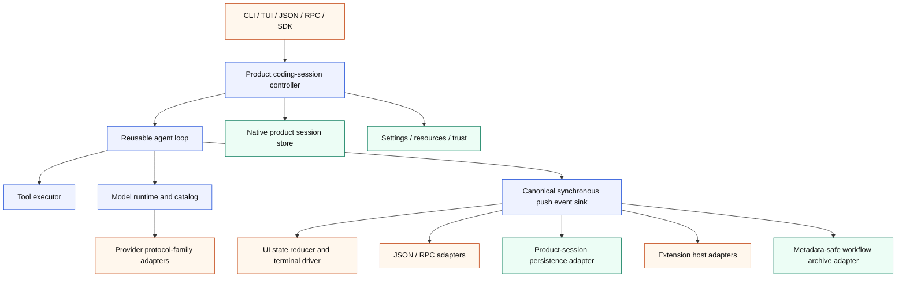

# Architecture Migration Plan

Status: active engineering plan

This document is the source of truth for improving pipy's internal architecture
while preserving its shipped Pi-shaped product behavior. It turns the
code-quality tracks in [Backlog](backlog.md) into an ordered migration. Pi is
the behavioral reference, Tau is a useful example of Python package boundaries,
and pipy's parity, protocol, and real-PTY tests are the compatibility harness.

The migration is deliberately incremental. It is not a rewrite, a package
rename, or a pause in parity work. Each slice must leave `main` releasable and
must not combine a structural extraction with unrelated feature changes.

## Why This Work Is Needed

Pipy has strong behavioral coverage and product-specific strengths: its native
inline-scrollback TUI, real-PTY verification, project-trust and path-safety
boundaries, metadata-safe auxiliary workflow archive, Python extension surface,
and small reviewed parity slices. Those properties are constraints of the
migration, not components to replace.

The main structural risk is concentration of responsibilities. In particular,
`NativeToolReplSession.run()` coordinates provider streaming, the tool loop,
queued input, commands, session persistence, extensions, rendering, settings,
and terminal lifecycle. Provider construction and model facts are spread across
large switches, while provider wire families repeat transport, retry, usage,
and parsing code. The extension and TUI implementations have similarly grown
past a size where their internal boundaries remain obvious.

The desired result is not simply smaller files. It is a dependency structure in
which the agent loop, product session, UI, provider runtime, persistence, and
extensions can be tested and evolved independently.

## Target Architecture



The first implementation should use subpackages under
`pipy_harness.native`; for example `native.agent`, `native.coding`,
`native.ui`, `native.providers`, and `native.extensions`. Physical distribution
package splits are a later decision, after import tests prove the boundaries.

The intended dependency direction is:

```text
entrypoints -> coding session -> agent loop -> model runtime -> providers
                         |             |
                         |             +-> tool executor
                         +-> product session/settings/resources

agent events -> UI, automation, persistence, extensions, workflow archive
```

The core agent package must not import the CLI, TUI, ANSI rendering, concrete
provider adapters, product-session paths, or archive implementations. UI and
automation code consume events; they do not participate in agent decisions.

## Current Concurrency Model

Pipy's current core orchestration is synchronous. `NativeToolReplSession.run()`,
the SDK, provider ports, and event sinks expose synchronous methods. Blocking
provider and tool work is isolated with owned worker threads where an
interactive or RPC mode must remain responsive; cancellation uses threading
events and `CancelToken`. No asyncio event loop owns the product lifecycle.

Phases 1–3 preserve that model. The canonical event port is synchronous push,
and the mode-owned composite invokes its projections synchronously in their
characterized order. Converting the core, provider port, SDK, or adapters to
asyncio would change cancellation, signal, backpressure, and blocking-I/O
semantics; it therefore requires a separate design, characterization suite, and
reviewed migration slice. It is not part of this plan.

## Migration Invariants

Every slice must preserve these rules:

1. **Behavior before shape.** CLI output, JSON/RPC protocols, session formats,
   extension contracts, provider requests, event ordering, and TUI behavior
   remain unchanged during an extraction. A behavior change requires its own
   later slice and parity contract.
2. **Native product direction.** `pipy-native` remains the product runtime.
   Wrapping other coding-agent CLIs remains a capture/reference facility.
3. **Privacy and trust.** Project trust, workspace path safety, product-session
   privacy, and the metadata-only workflow archive cannot be weakened.
4. **Inline terminal behavior.** The normal-buffer inline-scrollback TUI and
   its terminal-restoration guarantees remain product requirements.
5. **Push-based live events.** The core uses a synchronous `emit(event)`
   boundary. Iterator and protocol streams are adapters over it, so slow
   consumers cannot silently turn live tool updates into post-hoc batches.
   Backpressure is
   intentional: each run mode owns one composite immediate sink with a fixed,
   explicitly tested projection order. That composite invokes the projections
   active for the mode—such as rendering, automation serialization, product
   persistence, or workflow metadata—serially, and completion means all of
   those immediate projections have accepted or serialized the event. It is a
   static application adapter, not a dynamic pub/sub facility. The first
   extraction adds neither unbounded fan-out nor background queues. RPC, SDK,
   persistence, and terminal projections keep their characterized blocking,
   cancellation, and error semantics; any later buffering, dropping, timeout,
   dynamic subscriber, or parallel-dispatch policy is a separate behavior
   change. Semantic extension hooks are not converted into generic stream
   subscribers.
6. **Strict new boundaries.** New core modules use strict typing and explicit
   protocols. They may temporarily adapt legacy types but may not introduce new
   unchecked `Any` or unexplained `type: ignore` uses.
7. **No speculative dependency expansion.** The extraction uses the current
   standard-library posture. A runtime dependency such as Pydantic, attrs, or a
   new HTTP client requires a separate ADR and must not be hidden in a move.
8. **Small trunk-based slices.** Work lands directly on `main` as independently
   green commits. Avoid concurrent edits to the same monolith.
9. **Review and documentation.** Each implementation slice has focused tests,
   `just check`, relevant conformance/PTY gates, updated architecture/backlog
   documentation, and a different-family review before commit. Update release
   notes when behavior or a public SDK/extension surface changes.
10. **No compatibility scaffolding for private internals.** Once all internal
    callers migrate, delete the old path instead of adding deprecation aliases.

## Phase 0: Trustworthy Baseline

### Slice 0.1: Deterministic quality gate

First investigate order/global-state sensitivity in the full suite, including
`tests/test_parity_probe_trust.py::test_legacy_parity_score_opts_into_trusted_workspace_fixtures`,
which failed after the full suite but passed in isolation during the architecture
comparison. If it reproduces, record the contaminating predecessor or leaked
state in a focused regression test and run that reproducer in both orders. If it
does not reproduce, record the exact predecessor/reverse/full-suite evidence and
do not add speculative retries or isolation. Run the full suite repeatedly
before treating one green execution as a baseline.

Add checked-in CI that invokes repository-owned commands rather than duplicating
them. It should cover Ruff lint, Mypy, the full unit suite, documentation build,
a Linux PTY subset, and—where the runner is available—a small macOS PTY job.
Enable `ruff format --check` only after a dedicated mechanical normalization
slice makes the existing tree clean; do not hide a repository-wide formatting
rewrite inside the CI baseline.

Acceptance:

- `just check` passes three consecutive runs from the same clean checkout.
- A reproduced parity-score failure passes in both orders in one process (or
  equivalent isolated subprocess arrangements), and any identified leaked state
  is asserted to be restored. When it remains non-reproducible, the slice records
  the exact order matrix and leaves the test unchanged; three identical
  full-suite runs alone are not presented as proof that a leak was fixed.
- CI and local validation use the same `just` entry points.
- `just docs-build` runs in CI.
- CI runs a named Linux real-PTY subset. A named macOS real-PTY subset is
  required when an available runner supports it; otherwise the workflow records
  the omission explicitly rather than silently claiming cross-platform PTY
  coverage.

Implementation evidence (2026-07-17): the historical parity-score failure did
not reproduce. The isolated test, the actual collected predecessor group
followed by the probe, the reverse order, three complete Python 3.14 suites, and
one complete Python 3.11 suite all passed; inspection found no repository-fixture
mutation or ambient-state leak, so no speculative test patch was made. CI now
gates lint/types/docs on Python 3.14, full tests on Python 3.11 and 3.14, and an
eight-test real-PTY smoke set on Linux and macOS. The pre-existing Ruff-format
baseline remains explicit: 239 files require formatting, so format-check
activation is a separate mechanical slice.

### Slice 0.2: Characterization and boundary gates

Before moving orchestration, capture representative golden contracts for:

- a plain provider response;
- a provider/tool/provider cycle;
- tool failure and argument failure;
- provider retry and cancellation;
- queued steering and follow-up turns;
- session persistence and resume;
- extension lifecycle/tool callbacks;
- JSON and RPC event ordering; and
- SDK `run_native` results, public stream-sink behavior, finalization, and public
  exports/signatures;
- metadata-only workflow archive allowlists, using prohibited prompt/output/
  tool-content sentinels to prove no crossover from full-content modes; and
- TUI mapping and terminal restoration.

Add import-boundary tests as soon as a new package exists. These tests should
inspect imports or module dependencies without importing effectful entrypoints.

Acceptance:

- Current per-mode outputs and callback order have golden snapshots before a
  canonical event representation exists.
- Archive characterization proves prohibited full-content sentinels never enter
  JSONL, Markdown summaries, catalog output, or workflow event summaries.
- The import-boundary harness is checked in with rules that activate when each
  new package appears; Phase 0 does not reference modules that do not yet exist.

Implementation evidence (2026-07-18): dedicated architecture-contract tests now
freeze synchronous SDK/finalization behavior, the raw native product-session
versus metadata-only workflow-archive privacy split, plain/tool/error provider
event order, JSON and RPC boundaries, queued steering/follow-up and cancellation,
extension true-idle lifecycle order, and the planned import directions. The
import gate statically covers both module-first and package-first migrations,
fails closed on stale forbidden names and invalid relative imports, and activates
new layer rules without importing effectful entrypoints. Existing specialized
retry, tool-progress, PTY/TUI, and extension-hook suites remain the owners of
their deeper behavior rather than being duplicated here.

## Phase 1: Canonical Agent Event Seam

### Slice 1.1: Typed event vocabulary

Create a focused `native.agent` package containing canonical messages, events,
and run results. The event vocabulary must represent turn lifecycle, assistant
text/reasoning deltas, tool-call start/update/end, usage, retry, cancellation,
steering/follow-up consumption, provider errors, and terminal run outcomes.

The central port should preserve the current synchronous concurrency model:

```python
class AgentEventSink(Protocol):
    def emit(self, event: AgentEvent) -> None: ...
```

The producer completes the canonical boundary before emitting the next event.
Canonical payload strings are explicitly full-content product/automation data;
summary-safe workflow DTOs do not belong in the agent package. Crossing into the
workflow archive always uses an explicit allowlisting adapter.

Implementation evidence (2026-07-18): `native.agent` now provides frozen,
slotted, runtime-validated messages, events, usage/failure/run results, closed
turn/run/cancellation outcomes, and the synchronous `AgentEventSink`. Full
prompt/model/reasoning/tool/error content is wrapped as redacted-repr
`ProductContent`; the package exposes no serializer or workflow-archive DTO.
The event vocabulary keys starts and live updates by the provider correlation id
available at those boundaries, then carries both that id and the pipy-owned
request id on the completed result; it also preserves deferred-tool history,
cumulative usage plus last-turn context totals, tool duration, steering/follow-up
consumption, retry and failure states, and self-contained cancellation/terminal
outcomes. The dependency gate now rejects imports from outer adapters,
automation, extensions, UI, product-session storage, concrete providers, the
runner, and the workflow archive. Existing emitters and wire dictionaries remain
unchanged for Slice 1.2; the parallel legacy message envelope must be replaced
atomically there rather than retained through a compatibility alias.

### Slice 1.2: Adapt existing consumers

Route the current automation sink, extension emitter, renderers, JSON/RPC
streams, SDK stream/result surface, and workflow recorder through adapters.
Preserve all external formats and callback ordering. For the native product
session, this slice defines and tests the event-to-current-persistence projection
but leaves write ownership and call sites in place; Slice 3.3 performs that move.
The Phase 0 archive sentinel tests are a hard precondition for changing the
workflow-recorder adapter.

Slice 1.2 is one atomic consumer cutover. The legacy conversation envelope and
its emitter form a connected producer/consumer graph; landing unused adapters
or retaining both message paths would create the shadow implementation this
migration forbids. The slice therefore moves the loop, providers, product
session, compaction, extensions, automation, SDK, and tests together, then
deletes `native.tools.messages` and the legacy automation emitter.

Implementation evidence (2026-07-18): the tool loop and one-shot SDK now emit
the canonical synchronous event vocabulary. A fixed-order composite projects
text/reasoning deltas, buffered assistant messages, and tool start/update/result
events through the rendering adapter before the existing Pi-shaped automation
dictionaries and extension lifecycle hooks. It also defines the future
product-session persistence projection and feeds an explicit metadata-only
workflow allowlist. Turn chrome and local-command rendering remain terminal
composition concerns for Phase 4; direct product-session writes retain their
existing ownership until Slice 3.3. `AutomationAgentEventAdapter` owns cumulative
assistant partial text, malformed-argument fallback, camelCase fields, and
provider tool correlation ids, while RPC still owns queue reservation and the
true-idle `agent_settled` boundary. Steering/follow-up consumption and closed
cancellation reasons are canonical-only bookkeeping with no new wire records.
The SDK retains its synchronous public callbacks and result contract through a
canonical adapter. Product-session reload infers historical tool names from
branch-local ancestry; unresolved legacy tool records remain storage-only so
their ancestry and JSON survive without exposing an invalid provider message.

Acceptance for Phase 1:

- Existing JSON/RPC snapshots and extension lifecycle tests do not change
  except for intentional internal construction.
- A fake sink can capture one ordered trace for any run mode.
- The SDK keeps its synchronous `RunRequest`-in/`RunResult`-out contract,
  public exports, stream-sink semantics, and finalization behavior.
- No canonical event type contains an archive-unsafe convenience serializer.
- The event producer has no knowledge of terminal or storage formats.
- Canonical core traces are mode-neutral, while adapter tests preserve each
  public mode's current representation.
- Import-boundary tests fail if `native.agent` imports CLI, outer adapters,
  automation, extensions, TUI, product-session paths, concrete providers, the
  runner, or the workflow archive, or if provider transports import UI code.

## Phase 2: Reusable Agent Loop

### Slice 2.1: Tool executor — SHIPPED

Extract argument validation, tool lookup/invocation, live updates, normalized
results, cancellation, failure mapping, and termination signaling into
`native.agent.tools` (or an equivalently focused module). Preserve sequential
execution first.

Implementation evidence (2026-07-19): `native.agent.tools.ToolExecutor` now
owns the synchronous per-call path: registry lookup, JSON/schema validation,
pipy request-id allocation, `ToolPort` invocation, live `ToolContext` output,
normalized canonical results, exact malformed/error mapping, and an optional
worker plus cancel-event boundary. `ToolExecutionInterruption` closes the
executor outcome to settled, operator abort, or local command without importing
the TUI. Completion and cancellation are explicitly ordered so an earlier
cancellation cannot be replaced by a racing late result, and each invocation's
live-output sink stops admitting new callbacks before the executor returns.
Closing the gate never waits on an already admitted, backpressured synchronous
callback; that callback retains its original turn index and call identity if it
finishes later. `NativeToolReplSession` binds both values immutably per call, adapts
terminal wait strings at the composition seam, and retains budgets, extension
policy/result hooks, timing, event order, malformed-streak policy, provider
history, persistence, and run/turn outcomes. `native.tools` now exposes only
contracts; concrete tools are imported from their defining modules. The
superseded `_invoke`, `_invoke_interruptible`, and `_error_observation` methods
are deleted. Caller scheduling remains sequential and no parallel-tool scheduler
is introduced. A cancelled uncooperative worker may outlive its bounded join,
but its invocation sink is already closed and its turn/call identity cannot change.

### Slice 2.2a: Provider-turn boundary — SHIPPED

Extract one synchronous provider completion into
`native.agent.provider_turn.ProviderTurnExecutor`. The boundary owns text and reasoning
delta publication as canonical events, the optional worker and `CancelToken`,
exact first-cancellation versus worker-completion ordering, bounded cleanup,
late-delta admission gating, and a typed result-or-cancellation outcome. It is
headless and provider-neutral; it imports the provider port and canonical
contracts, not a concrete transport, the TUI, automation, extensions, product
session, compaction, provider construction, capture, or the workflow archive.
The canonical `native.agent` initializer does not eagerly re-export it.

`NativeToolReplSession` retains the TUI and RPC/external-abort wait adapters,
queued-message storage and promotion, provider-request construction, extension
preflight and lifecycle policy, tool cycles and budgets, and the current
zero-retry and usage-accumulation policy. This first boundary deliberately does
not move the full provider/tool cycle or make `run()` a composition-only method.
The superseded `_ProviderTurnCompletion`, `_agent_text_sink`,
`_agent_reasoning_sink`, `_complete_headless_cancellable_turn`,
`_complete_provider_turn`, and `_cancel_active_turn` paths are deleted in the
same slice. The shared `HarnessStatus` enum moves to dependency-neutral
`pipy_harness.status`; public harness/native model exports keep the same enum
identity and runtime-resolvable annotations while the provider-turn import
graph no longer loads capture or the metadata workflow archive.

Implementation evidence (2026-07-19): commit `925bd24` extracts the
provider-turn executor and removes all six superseded session-local completion,
delta-sink, and cancellation paths. Direct executor, tool-loop, SDK, import,
RPC, extension, TUI, PTY, and documentation gates passed; final `just check`
reported 3,330 passed and 2 skipped with Ruff and mypy clean across 338 sources.
Pi `openai-codex/gpt-5.6-sol` reported CLEAN after three fixed warnings in its
first round and a clean post-Fable re-review. Claude Fable's valid review found
two suggestions, both fixed, then returned an unscoped CLEAN with no skipped or
truncated files, redactions, or forbidden tool use. Five findings total were
accepted and fixed; none were rejected or deferred.

### Slice 2.2b.1: Canonical agent usage accounting — SHIPPED

Move provider-neutral token accumulation, last-turn context totals, cache-hit
classification, canonical `AgentUsage` snapshots, and injected per-token rate
application from `NativeToolReplSession` into
`native.agent.usage.AgentUsageAccumulator`. The same module defines the frozen,
runtime-validated `AgentTokenPricing` value passed in by the product composition
layer. The product-owned provider/model pricing table and lookup remain in the
session for this slice; the reusable agent layer must not import the pricing
catalog, provider selection, UI, product session, capture, archive, or concrete
provider modules. `native.agent` does not eagerly re-export the usage runtime.

This boundary preserves existing provider telemetry coercion, cache-denominator
heuristics, cost display, context-meter fallback, canonical event payloads, and
per-prompt versus session-total reset behavior. It does not move request or
history construction, retry or token-budget policy, compaction, tool
capabilities, active-input/queue ownership, persistence, rendering, or the full
provider/tool loop. Pricing/catalog consolidation remains Phase 5.3.

Implementation evidence (2026-07-19): the slice extracts the canonical usage
runtime, deletes the session-local accumulator, pricing value, coercion, cache
classification, and provider/model bind path, and migrates all six construction
and reset sites to injected pricing. Direct usage, session integration, exact
lifecycle ordering, pricing-prefix, all-reset-path, static import, recursive
synthetic, and isolated fresh-process contracts passed. Final `just check`
reported 3,382 passed and 2 skipped with Ruff and mypy clean across 340 sources;
documentation and diff gates passed, and the source-equivalent PTY, RPC,
extension-live-session, and TUI workflow gates remained green. Pi
`openai-codex/gpt-5.6-sol` returned explicit CLEAN in the user-authorized fourth
round after four accepted warnings were fixed; none were rejected or deferred.
Claude Fable returned valid unscoped CLEAN with no findings, skipped or
truncated files, redactions, or forbidden tool use.

### Slice 2.2b.2: Canonical agent-history compaction — SHIPPED

Move the mechanical canonical-message history reduction into
`native.agent.history`. The reusable boundary accepts any `Sequence` of
`AgentMessage` values plus caller-owned limits without mutating the caller's
container, and detaches the retained history into an immutable tuple with
structural counters. It cuts only at user group boundaries, counts
assistant/tool-call/tool-result content exactly as before, and performs no I/O.

The product session retains compaction enablement, manual/automatic triggers,
threshold defaults, extension-hook ordering, the exact counts-only summary
text, provider-system-prompt injection, diagnostics, aggregate result counters,
and durable native-session-tree writes. The canonical module exposes no archive
serializer and is not eagerly re-exported from `native.agent`. The obsolete
`native.session_compaction` module and its unused no-tool conversation path are
deleted rather than retained as an alias or shadow implementation.

One characterized correctness prerequisite deliberately narrows automatic
compaction: when an extension has attached transient `deliverAs=nextTurn`
custom context, automatic compaction is deferred for that entire run. This
prevents a retained-history index shift from carrying one-turn extension
context into the next provider request. A later ordinary run may compact, but
an extension that injects transient context on every turn can defer automatic
compaction indefinitely; manual `/compact` remains available.

Apart from that correction, this slice changes no product-session storage,
provider-request schema, summary text, JSON/RPC/SDK/extension representation,
archive allowlist, compaction policy, queue behavior, or TUI behavior. Tool
capabilities, remaining request/effect/input seams, and the full provider/tool
loop remain Slices 2.2b.3–2.2b.5.

### Slice 2.2b.3: Session tool-capability port seam — SHIPPED

Define the runtime-checkable `AgentToolCapabilities` protocol beside the
reusable executor in `native.agent.tools`. The protocol exposes only a detached
tuple of tool definitions, synchronous one-call execution, and canonical
error-result construction. Product registry composition, built-in versus extension
identity, CLI/run filters, active-tool mutation, extension replacement,
workspace `ToolContext`, and `ToolExecutor` construction move behind the
`native.tool_capabilities.NativeToolCapabilities` facade and its frozen
`ToolFilterOptions` value. The product session constructs that facade and uses
only the protocol methods inside the provider/tool cycle.

The cut preserves synchronous backpressure, strictly sequential scheduling,
tool-budget accounting, malformed-call behavior, extension preflight/result
hook ordering, live-output identity, dynamic-tool annotations, reload behavior,
and every JSON/RPC/SDK/session/archive representation. Neither the protocol nor
the product facade is eagerly exported from a package root. The canonical
module stays free of concrete tools, product sessions, providers, UI,
persistence, extensions, capture, automation, and the metadata-only workflow
archive; the product facade composes injected ports but does not construct
concrete tool implementations.

Characterization records two pre-existing authorization defects without
silently changing them in this mechanical ownership slice. First, a
`before_provider_request` transform can name a registered tool outside the
prior active/final request snapshot because the returned names are filtered
against the registry rather than intersected with that snapshot. Second, a
provider call outside the exact final advertised set can currently reach tool
hooks and execution. Slice 2.2b.4 must close both together: request-hook tool
names intersect the prior snapshot, and an out-of-snapshot returned call
produces the normal policy error and consumes budget without any hook,
execution, or invocation count. The separate June
precedence/unknown-name conflict is not part of this slice.

### Slice 2.2b.4a: Final provider-request snapshot and authorization — SHIPPED

Bind each provider completion to an exact request-local advertised-tool
snapshot. `before_provider_request` transforms may narrow only the detached
tool tuple they receive, serial hooks remain monotonic, and prior definition
order wins over hook order, duplicates, and unknown names. A successful
`ctx.set_active_tools(...)` mutation changes later provider iterations but does
not retroactively widen or narrow the current frozen request unless the hook
also returns an explicit narrowing transform.

After the provider returns, budget exhaustion retains first precedence. A
returned call outside the exact snapshot produces the normal pipy-owned
`unknown tool` error between balanced tool-start/tool-complete events, consumes
one per-turn budget slot, and is appended once to canonical history and the
product session tree. It reaches neither semantic tool hook, execution, live
output, result transformation, malformed-call accounting, nor global
invocation accounting. A tool activated by an earlier call is therefore not
authorized later in the same provider response. This slice changes no public
request/result representation, lower-level registry capability, sequential
scheduling, persistence owner, or metadata-archive allowlist.

### Slice 2.2b.4b: Identity-safe active-input overlay — SHIPPED

Replace absolute-index transient-context cleanup with a request-local,
identity-safe active-input overlay, then remove the Phase 2.2b.2 automatic
compaction deferral without changing `deliverAs=nextTurn` one-run lifetime or
allowing transient content into durable conversation or archive records.

The canonical `AgentActiveInput` binds the accepted user-message object to a
detached tuple of request-only context. It projects that overlay immediately
after the identity anchor on every provider iteration, rewrites only that
anchor after request-hook prompt transforms, and derives run-result messages
from the same anchor after compaction. Missing or repeated anchors fail closed.
The overlay is never appended to canonical history, emitted in the run result,
or written as an additional product-session message; the separately shipped,
bounded `CustomMessageEntry` remains the full-content product record of the
extension action. Automatic compaction again runs on durable history during
the active run. Public formats, extension queue/order behavior, manual
compaction, persistence ownership, and the metadata-only archive allowlist do
not change.

### Slice 2.2b.4c: Run-effect, usage-publication, and queue-facing ports — SHIPPED

Establish the remaining typed ports needed by the reusable loop. Phase 3 still
owns queue storage, ordering, reservation, idle transitions, and lifecycle;
Phase 3.3 still owns persistence write relocation. This slice makes those
product policies injectable without moving their ownership.

The canonical runtime boundary now carries a closed append-message run effect,
one normalized provider-usage sample paired with its cumulative run snapshot,
and a closed steering/follow-up input selected by the product controller.
Product callback adapters apply each port synchronously: durable message writes
complete before the next event, session usage absorbs before `UsageUpdated`, and
queue selection returns at most one already eligible item. Callback failures
propagate at the same boundary rather than being deferred or swallowed.

Queue storage, steering-first priority, positional-seed priority, extension
outboxes, RPC reservation/idle transitions, `agent_end`/`agent_settled`, and
abort clearing stay in their existing product owners. The agent-facing port has
no enqueue, peek, count, mode, clear, reserve, settle, or lifecycle operation.
It may take one controller-selected item after a run settles; `None` returns
control to the product input lifecycle. The full-content queued payload remains
pre-acceptance product content until the next run creates its canonical user
message. Persistence still executes through the injected product callback and
does not move until Phase 3.3. Public JSON/RPC/SDK/session/extension formats and
the metadata-only archive allowlist do not change.

### Slice 2.2b.5: Full headless `AgentLoop` ownership cutover — SHIPPED

The cutover is split into four independently green ownership cuts so the name
reserved for the full loop is not occupied by the already-shipped one-provider
executor:

1. **2.2b.5a — provider-turn naming cut:** atomically rename the existing
   executor module to `native.agent.provider_turn`, delete the old module path,
   and reserve `native.agent.loop` for the full headless loop. This is a
   behavior-preserving internal rename with no compatibility alias, public
   export, or format change. **SHIPPED.**
2. **2.2b.5b — typed loop-policy collaborators:** extract the remaining
   request/tool/status policy seams without moving queue ownership or changing
   run behavior. The canonical layer now owns immutable tool counters, exact
   budget/authorization/admission transitions, the shared named 200-call cap,
   malformed-fatal settlement, and
   zero-retry provider-status normalization. It explicitly detaches and freezes
   shallow provider-request tool schemas, with a distinct provider-bound
   projection rematerializing ordinary JSON containers for built-in and custom
   providers. Callback-composed product adapters
   own extension request/tool hooks and restrict result hooks to content-only
   transformation. **SHIPPED.**
3. **2.2b.5c — single-run `AgentLoop` cutover:** move the provider/tool cycle
   behind the headless loop contract and delete the superseded session-local
   cycle. **SHIPPED.**
4. **2.2b.5d — queued-input handoff closure:** complete the controller-owned
   steering/follow-up handoff while preserving separate-run semantics and the
   serialized RPC boundary. **SHIPPED.**

The pure single-run turn loop now lives in `native.agent.loop`. It owns provider
streaming, assistant-message assembly, tool-call cycles, the existing zero-retry
provider policy, tool-budget and iteration guards, cancellation, and the final
typed result/history/tool state for one already accepted prompt. Product
callbacks retain compaction and request construction, fresh provider/waiter
binding, terminal pending-input effects, diagnostics, rendering, and durable
writes. Typed callbacks preserve the prior per-transition counter-mirror timing
and a final pre-`AgentRunCompleted` synchronization, while append effects update
the live product message mirror before durable persistence. After the
synchronous `AgentRunCompleted` emission, the loop asks the controller-owned
`AgentQueuedInputPort` for at most one eligible value and returns that intact
`AgentQueuedInput` as `AgentLoopOutcome.next_input`; the product controller
starts it as a separate next run. Queue storage, ordering, reservation, idle
transitions, and lifecycle remain outside the loop. The superseded
`_QueuedDeliverySource`, `_PromptChannel._last_delivery_kind`, and
`take_delivery_kind` text/kind split are deleted without a compatibility path.
Slice 3.1 later moves the same controller policy without changing the loop
contract.

The loop receives model/provider and tool capabilities through protocols. It
does not know about terminal rendering, slash commands, menus, session paths,
settings files, or extension UI.

Acceptance for Phase 2:

- The loop runs under tests with fake providers, tools, cancellation, and sink.
- Existing event ordering, provider requests, budgets, and error behavior match
  the characterization contracts.
- `NativeToolReplSession.run()` no longer contains the provider/tool cycle.
- Pi-style parallel tool execution, live-update refinements, named/forced tool
  choice, and termination semantics remain separate feature slices after the
  extraction is clean.

## Phase 3: Product Coding-Session Controller

### Slice 3.1: Headless session state machine

Create `native.coding` modules for the product session lifecycle, queued user
input storage/policy, the queue port offered to an active agent loop, current
provider/model, settings/resources, command outcomes, persistence coordination,
and invocation of the reusable agent loop.

The controller owns product policy; the agent loop remains reusable. Commands
return typed outcomes rather than printing, repainting, or writing session files
directly.

The controller cutover is split into independently green ownership cuts:

1. **3.1a — headless queued-input policy (shipped):** move retained loop
   handoffs, ordered injected queue sources, positional seeds, extension
   steering/follow-up/trigger queues, request-only next-turn context, and local
   command precedence into `native.coding.input_queue`; delete the parallel
   session-local lists and selection closures.
2. **3.1b — coding-session state and transitions (shipped):** move current
   provider/model labels and port, canonical message/counter state, compaction
   metadata, and explicit state transitions behind headless product contracts.
3. **3.1c — persistence coordination seam (shipped):** inject typed append/switch/
   compaction callbacks while preserving synchronous write timing; actual write
   ownership relocation remains Slice 3.3.
4. **3.1d — typed imperative command outcomes (in progress):** move command
   families behind closed semantic outcomes without introducing the declarative
   registry owned by Slice 3.2. This monolith-touching cut ships as 3.1d.1
   through independently reviewed sub-slices: the outcome kernel/state-free
   commands; compaction/name; provider/auth/scoped models; product-session
   navigation; external/UI effects; reload; then resource/extension precedence
   closure.
5. **3.1e — accepted-input and agent-run coordinator:** move accepted-input
   preparation and reusable-loop invocation behind injected product ports.
6. **3.1f — lifecycle state machine and composition cutover:** move the outer
   synchronous start/input/command/run/true-idle/shutdown transitions and leave
   `NativeToolReplSession.run()` as a sub-800-line composition shell.

Slice 3.1a preserves the exact product priority: local command, retained fresh
input from a blocking wake, FIFO retained post-run handoffs, injected
RPC/input-stream then terminal queues, positional seed, extension steering,
extension follow-up, ordinary extension trigger, and only then newly read fresh
input. A higher-priority local resource command may run before a retained
handoff, but any handoff returned by that command's run appends behind the older
one rather than overwriting it or raising. Seeds block extension continuations
from the active-loop port but never overtake an injected queue. Whole typed
queued inputs retain exact content and kind; `/...` and `!...` queued prompts
bypass local dispatch.
If a local command becomes pending while a registered source wakes the blocking
read, the command still wins; an already-read ordinary line is retained for
normal command parsing ahead of any newer mismatching queued DTO, and neither
value is polled or delivered twice.
`deliverAs=nextTurn` remains one-shot request-only context consumed only when a
provider run is accepted. RPC reservation/idle/settlement, lifecycle,
commands, rendering, provider construction, and persistence writes do not move
in this cut.

Slice 3.1b moves the active provider port and explicit provider/model labels,
canonical live history, cumulative usage and result counters, compaction
suffix/metrics, and unresolved provider-failure metadata into the synchronous
`native.coding.state.CodingSessionState`. Named transitions distinguish an
atomic provider-context rebind from a same-context port refresh and a
session/tree history rebuild. The composition root retains provider
selection/construction, pricing lookup, compaction summary formatting,
session-tree callbacks and writes, commands, rendering, extensions, RPC
settlement, and reusable-loop invocation. The session's `provider=` constructor
argument seeds the persistent coding state once and is not stored as a parallel
field; later runs and the read-only `provider_port` projection use the same
state-owned port, including after setup failures.

Provider/model/auth and reload-fallback rebinds continue to clear only live
provider-visible history and reset usage; the durable tree remains intact.
For exact behavioral compatibility they also continue to preserve an existing
in-memory compaction suffix, while session/tree rebuilds clear that suffix and
preserve run-lifetime metrics. Any correction to that characterized suffix
lifetime is a separate behavior slice rather than an implicit extraction
change. Immutable snapshots reject mutable substitutions and retain exact
canonical message identity. Strict direct-import, recursive, fresh-process,
and no-eager-export gates keep the state owner independent of UI/terminal,
automation/archive, extension implementation, persistence, provider
construction/catalog, concrete providers/tools, and the old composition
monolith.

Slice 3.1c introduces a synchronous, headless product-session coordinator under
`native.coding.product_session`. Exact frozen context and compaction values
carry full-content canonical messages only across the private product-session
boundary. Append and compaction first apply the live `CodingSessionState`
transition and then invoke one typed durable callback; callback exceptions and
invalid non-`None` or awaitable returns propagate before later work, preserving
the characterized partial-state failure timing. A session switch still mutates
or replaces the concrete tree in the composition root first, then the typed
load callback returns an exact immutable context for state rebuild, and only
then does composition clear extension-scoped pending input.

Concrete `NativeSessionTree` construction, filesystem access, compaction
formatting, and write ownership remain in `tool_loop_session.py` until Slice
3.3. The Phase 1.2 `ProductSessionEventProjection` remains a definition rather
than a second writer, so this cut neither duplicates writes nor moves them
earlier in canonical event delivery. The coordinator is direct-import only;
exact allowlist, recursive, fresh-process, and no-eager-export gates prohibit
UI, terminal, automation/RPC, extensions, concrete persistence, providers,
tools, capture, SDK, and metadata-workflow archive dependencies. Its
full-content DTOs never cross the counts-only workflow projection.

Slice 3.1d.1 establishes `native.coding.commands` as a direct-import-only,
headless classification and outcome kernel. Exact frozen/slotted outcomes use
closed kind, action, and footer-policy enums. The first atomic cut owns blank
input, `/exit`, `/quit`, `/hotkeys`, `/changelog`, `/copy`, and `/session`
classification; composition still performs dynamic keybinding/changelog
rendering, clipboard access, native-session status formatting, and footer
painting. Ordinary command bubbles therefore remain before classification,
exit remains footer-free, and continuing commands keep one standard footer.

All other inputs return the exact unhandled outcome to the single existing
precedence skeleton. Non-empty queued/RPC/provider-classified `/...` and `!...`
content continues to bypass classification and reaches the provider unchanged;
classified empty or whitespace-only content still takes the unconditional blank
outcome and is consumed locally, preserving the pre-extraction behavior. The
superseded branches for the migrated commands are deleted in the same cut;
there is no second dispatcher or command metadata table. Exact direct-import,
recursive, fresh-process, and no-eager-export gates prohibit UI/terminal,
persistence, providers/tools, settings/resources, extensions, automation, SDK,
capture, and archive implementations. Outcome values are full-content product-
control data and have no serialization or workflow-archive projection. The
pre-existing gap between the documented model-change native-tree entry and the
current selection path remains an explicitly deferred behavior correction, not
part of these ownership cuts.

Slice 3.1d.2a extends the same exact outcome with typed `COMPACT` and
`SESSION_NAME` actions. The session-name action carries one exact
`ProductContent` argument: empty means report the current name and non-empty
means append that name. The direct classifier remains an already-stripped
contract, so it does not broaden exact matching for trailing whitespace;
composition retains the existing outer strip and internal name spacing.

The composition interpreter reuses the existing `apply_compaction("manual")`
adapter, keeping extension-before-compact policy, pure reduction, live state
transition, synchronous durable tree append, diagnostic, and footer order.
Automatic compaction continues through the same adapter and is not reclassified
as a command. Name mutation still appends the private `session_info` entry before
the exact legacy repr diagnostic; query formatting, write-failure propagation,
and the standard footer remain unchanged. Superseded `/compact` and `/name`
branches are deleted. Non-empty classified queued forms bypass these actions,
and no full-content argument or compaction text enters the metadata archive.

Slice 3.1d.2b adds exact `MODEL`, `SCOPED_MODELS`, `LOGIN`, and `LOGOUT`
actions. Each carries one exact `ProductContent` argument, including the empty
value for a selector, status view, or default `openai-codex` auth target. These
four actions use a distinct closed usage-aware footer policy; the earlier
state-free, compact, and name actions retain their standard footer contract.
The direct classifier still accepts only an already-stripped bare command or a
literal-space argument form, while composition continues to own the outer
strip and hotkey translation.

Composition reuses the existing model-selection, scoped-settings, selector,
auth, provider-rebind, pricing, and live-footer adapters. Direct selection,
selector cancel, unavailable and non-tool-capable refusal, thinking-level
selection, scoped view/set/clear/cycle, auth success/failure normalization,
external-I/O suspension, credential privacy, and exception timing therefore
remain unchanged. The four superseded late branches are deleted, and non-empty
queued/RPC forms remain provider-visible.

This extraction deliberately preserves two characterized gaps: model selection
and cycling append no native-tree `model_change` entry, and they dispatch no
extension `model_select` hook. Correcting either requires a dedicated behavior
slice; the typed command kernel owns neither persistence nor extension hook
policy. It also does not add catalog refresh, change auth diagnostics, or create
the Phase 3.2 registry.

The dedicated test-only 3.1d.2b conformance repair updates settings check 13 to
declare its synthetic workspace trusted at each direct `WorkspaceResources`
discovery. That fixture can therefore continue proving `-pattern`, `+pattern`,
and `enableSkillCommands=false` behavior without weakening the production
fail-closed discovery default. It changes no runtime code, settings schema,
resource ordering, privacy boundary, or public format.

Slice 3.1d.3a adds one exact payload-free `NEW_SESSION` action for `/new` with
the standard footer. Direct classification accepts only the already-stripped,
lowercase command; composition retains outer trimming, ordinary user-bubble
rendering, and the non-empty queued/RPC bypass.

The product interpreter preserves the existing synchronous sequence: run the
`session_before_switch` gate for `switch`/`new`, derive the current private
session store and persistence policy, create and select the new concrete tree,
rebuild typed active history, clear extension-owned pending input, emit the
sanitized diagnostic, and refresh the standard footer. Vetoes, ordinary hook
failures, controlled-fatal exceptions, and create/rebuild partial-state cutoffs
remain unchanged. The superseded late branch is deleted. The typed kernel gains
no persistence, extension, terminal, provider, RPC, SDK, or archive dependency;
no post-switch lifecycle/tree hook, write relocation, or registry metadata is
added.

Slice 3.1d.3b adds `SESSION_TREE` with one exact `ProductContent` argument,
including empty for bare `/tree`, and the standard footer. The already-stripped
classifier accepts the bare command or a literal-space argument form; outer
trimming and queued/RPC bypass remain composition-owned. The interpreter keeps
the existing mutating-form predicate: bare live-TUI selection and `select`,
`label`, or `filter` forms pass through `session_before_tree`, while captured
bare rendering and unknown forms do not.

On allow, composition invokes the unchanged tree handler, applies its returned
run-local filter mode, applies any next-iteration editor prefill, and refreshes
one standard footer. Same-file selection, immediate label writes, selector
cancel behavior, optional no-tool branch-summary calls, typed history rebuild,
extension-input clearing, diagnostics, sanitization, and partial-state failure
timing therefore remain unchanged. The late branch is deleted. The extraction
does not add the target completed `session_tree` hook, persist the run-local
filter, wire summary cancellation/accounting settings, or correct empty custom-
message selection; those remain separate behavior slices.

Slice 3.1d.3c adds `SESSION_RESUME` with one exact `ProductContent` argument,
including empty for bare `/resume`, and the standard footer. The direct kernel
accepts the already-stripped bare command or a literal-space argument form;
composition retains outer trimming, the submitted user bubble, and non-empty
queued/RPC bypass.

Composition preserves the current native-product workflow: captured bare and
`named` forms list sessions, `rename` and confirmed `delete` mutate only native
session files, and live bare input opens the existing inline picker. Picker
cancel and current-session selection remain ungated no-ops. Only a resolved
direct target or a different picker target passes through
`session_before_switch`; success keeps open/assignment, typed history rebuild,
extension-input clearing, custom-entry redraw, sanitized diagnostic, and one
standard footer in that order. Existing veto, ordinary hook error,
controlled-fatal, and open/rebuild/clear/redraw partial-state cutoffs remain
unchanged. The late branch is deleted.

The extraction does not normalize direct reopening of the active file, refresh
provider/model/counters, rebuild ordinary TUI scrollback, fix captured active-
session rename staleness or permissive explicit-path deletion, add post-switch
lifecycle hooks, move persistence writes, or add registry metadata. Full native
session content remains separate from the metadata-only workflow archive.

Slice 3.1d.3d adds argument-bearing `SESSION_FORK` and payload-free
`SESSION_CLONE`, both with the standard footer. The direct kernel accepts bare
or literal-space `/fork` forms and exact `/clone`; composition retains outer
trimming, the submitted user bubble, and non-empty queued/RPC bypass.

The interpreter preserves the private native-session sequence. Ephemeral trees
are rejected before resolution or hooks. An explicit fork reference resolves
through the active tree filter, while bare fork and clone use the current leaf,
including `None`. Both commands dispatch `session_before_fork` with operation
`fork` and that leaf target, call `NativeSessionTree.fork_from` into the same
private store with `parentSession` lineage, assign the completed child, rebuild
typed history, clear extension-owned pending input, emit the sanitized command-
specific diagnostic, and apply one standard footer. The two late paths are
deleted. Existing veto, hook-error, controlled-fatal, copy/write, rebuild, and
clear partial-state timing remains unchanged.

This ownership cut deliberately preserves any-entry fork resolution, empty-
branch clone, copied names/labels/compaction metadata, fresh child entry IDs,
the absence of custom-entry or ordinary-scrollback redraw, and the absence of
post-fork lifecycle hooks. It adds no picker, prefill, rollback, provider/tool
turn, persistence relocation, public serializer, archive projection, registry
metadata, compatibility alias, or asynchronous behavior.

Slice 3.1d.4a adds the exact payload-free `TRUST_PROJECT` action for `/trust` with the
standard footer. The direct kernel accepts only the already-stripped exact
command; composition retains outer trimming, the submitted user bubble, and
the non-empty queued/RPC bypass.

Captured execution emits the existing sanitized interactive-TUI requirement
without opening the trust store or reading captured stdin. Live execution
preserves the existing synchronous read-selector-write sequence: read the
closest saved exact or inherited decision, render the selector with that saved
decision and the immutable current-run trust value, apply a selected option's
atomic trust-store updates, emit the fixed restart-required success notice, and
then apply one standard footer. Cancel performs no write and still reaches the
footer. A handled trust-store read failure stops before selector/write, and a
handled write failure stops before the success notice; both sanitized notices
still precede the footer. Selector or uncontrolled failures continue to
propagate before later effects and the footer.

The superseded late `/trust` path is deleted. The command never mutates the
active `SettingsManager.project_trusted` value, hot-loads or unloads protected
inputs, invokes a provider/tool turn, or crosses into native-session or
metadata-workflow content. This cut does not move `/settings`, export/import/
share, `/reload`, resource/custom-command or extension precedence; it adds no
Phase 3.2 registry metadata or Phase 3.3 persistence ownership.

Slice 3.1d.4b adds the exact payload-free `SETTINGS` action for `/settings`
with the standard footer. The direct kernel recognizes only the already-edge-
stripped exact command; composition retains outer trimming, the submitted user
bubble, and non-empty queued/RPC bypass.

Live execution delegates to the unchanged `_drive_settings_dialog`. Cancel
closes the surface; in-place toggles stay in the dialog. The `cycle_thinking`
action is also in-place: it rebuilds the current dialog rows and may append one
private `thinking_level_change` entry without entering the outer close/subflow/
reopen loop. Model, login/logout auth, scoped-model, theme, and default-project-
trust subactions close into their nested flow and reopen the settings dialog,
including after selector cancellation. OAuth retains the existing cooked-mode
external-I/O suspension. Captured execution emits only the existing safe
`_settings_overlay_lines` status view. Both paths apply one standard footer
only after the settings surface has closed. A local or nested subaction that
has already changed live or local state remains changed if a later effect
fails; uncontrolled and controlled-fatal failures retain their existing cutoff
before the footer. Neither path starts a provider or tool turn.

The superseded late `/settings` branch is deleted. The command itself appends
no native-product entry, while its already-supported in-place thinking-level
action may append the private `thinking_level_change` entry. Prompt-history
bodies remain confined to the private `PromptHistoryStore`; OAuth material
stays in the live terminal and auth store; non-secret settings stay in their
settings owners; none enters the metadata-only workflow archive. This ownership
cut records, but does not correct, the pre-existing mismatch in which the docs
describe `promptHistory.enabled` as the toggle's source of truth while the
dialog toggles `PromptHistoryStore` directly and startup applies the setting
only as a one-way enable. Export/import/share, `/reload`, resource/custom-
command and extension precedence, the model-change/tree and extension-hook gap,
Phase 3.2 registry metadata, Phase 3.3 write ownership, and Phase 4 UI movement
remain explicit non-goals.

Slice 3.1d.4c adds `SESSION_EXPORT` with one exact `ProductContent` argument,
including the empty value for bare `/export`, and the standard footer. The
direct kernel accepts only the already-stripped bare command or a literal-space
argument form; composition retains outer trimming, the submitted user bubble,
and non-empty queued/RPC bypass at the existing serialized boundary.

The composition interpreter remains the owner of Pi-shaped path-argument
parsing, cwd-relative and home expansion, default HTML-path selection, and the
`.jsonl` versus HTML route. It invokes the existing native-session export
adapters, maps only `NativeExportError` through the existing sanitized
diagnostic path, and applies one standard footer after either a successful
write or that controlled error. Existing uncontrolled write failures retain
their pre-diagnostic, pre-footer propagation cutoff. Bare `/export` remains an
HTML export; explicit case-insensitive `.jsonl` paths remain active-branch
JSONL exports, while every other path remains a full-tree HTML export.

The command action and argument are full-content product-control values. HTML
continues to carry the full private native tree and JSONL the re-chained active
branch, both through the existing credential-redaction boundary; neither the
argument, export path, nor transcript content crosses into the metadata-only
workflow archive. The superseded late `/export` branch is deleted in this cut.
`/import`, `/share`, `/reload`, resource/custom-command and extension
precedence, top-level CLI export behavior, export formats/redaction/defaults,
Phase 3.2 registry metadata, Phase 3.3 write ownership, and Phase 4 UI movement
remain explicit non-goals.

Slice 3.1d.4d adds `SESSION_IMPORT` with one exact `ProductContent` argument,
including the empty value for bare `/import`, and the standard footer. The
direct kernel accepts only the already-stripped bare command or a literal-space
argument form; composition retains outer trimming, the submitted user bubble,
and non-empty queued/RPC bypass at the existing serialized boundary.

The composition interpreter remains the owner of Pi-shaped path-argument
parsing, `--yes` detection, home and cwd resolution, direct-stream confirmation,
the `session_before_switch` gate, collision-safe native-store import, missing-
cwd recovery, active-history rebuild, extension-input clearing, diagnostics,
and footer timing. The preserved order is parse and resolve, first confirmation
unless `--yes`, switch
gate, initial import, optional missing-cwd confirmation and retry, history
rebuild, extension-input clear, success diagnostic, then one standard footer.
Usage, cancellation, veto, and controlled import errors retain their existing
diagnostic/footer cutoffs; uncontrolled failures retain their earlier
propagation point and applied filesystem or in-memory effects are not rolled
back.

The action and imported JSONL are full-content product values confined to the
private native-session boundary. Neither the exact argument/path nor imported
transcript content is projected into the metadata-only workflow archive. The
same boundary applies if import raises through a harness adapter: caller-facing
or in-memory failure detail may remain available, while durable
`harness.run.exception` JSONL and Markdown record only the bounded exception
type and fixed lifecycle metadata, never raw exception text, source paths, or
session content. Direct exception propagation from `NativeToolReplSession`
remains unchanged. The superseded late `/import` branch is deleted in this cut.
This ownership move
deliberately preserves current behavior rather than silently implementing the
target UI/runtime split: both confirmations read and write the direct streams,
including captured mode; the missing-cwd case uses a second yes/no prompt; a
successful switch emits no post-switch `session_start(reason=resume)` lifecycle
event; it redraws neither custom entries nor ordinary inline scrollback; and the
confirmation prints the raw resolved path without label sanitization.

`/share`, `/reload`, resource/custom-command and extension precedence, command
path parsing, native import/store formats and validation, path-display security,
rollback/atomic-write semantics, post-switch lifecycle and redraw corrections,
Phase 3.2 registry metadata, Phase 3.3 write ownership, Phase 4 UI movement, and
async conversion remain explicit non-goals. The command extraction changes no
product behavior or public product format. The slice additionally narrows the
durable metadata-archive exception projection so escaped adapter exceptions
never copy raw message text into the archive JSONL or Markdown summary, a
privacy-strengthening refinement recorded in the release notes.

### Slice 3.2: Declarative command registry

Replace the large command dispatcher with one registry containing command name,
aliases, description, availability predicate, argument contract, and handler.
Help, completion, menus, and dispatch consume the same registry.

### Slice 3.3: Persistence subscriber

Move the existing product-session write call sites behind the projection
contract established in Slice 1.2 and make persistence a standalone projection
inside each applicable mode's fixed composite sink.
Keep the raw private native session tree distinct from the metadata-safe
workflow archive. Re-run and extend the Phase 0 crossover tests; this slice owns
write relocation, recovery/error semantics, and lifecycle ordering, not the
canonical event vocabulary.

Acceptance for Phase 3:

- Commands and session transitions are testable without a terminal.
- The controller coordinates components but implements neither rendering nor
  provider wire protocols.
- Product-session loading/saving has no dependency on TUI classes.
- The legacy `NativeToolReplSession.run()` method—not its containing module—is
  an orchestration shell, with an intermediate Phase 3 target below 800 lines.
  Phase 7 continues reducing that pre-existing method toward the 100-line
  guardrail where the extracted boundaries make that honest rather than
  cosmetic.

## Phase 4: UI Boundary

### Slice 4.1: Pure UI state reducer

Introduce a deterministic `UiState` plus reducer that maps agent and coding
events to display state. The reducer performs no terminal I/O.

### Slice 4.2: Terminal driver

Move ANSI output, layout, input, scrollback, resize handling, cursor state, and
terminal restoration behind a terminal driver. Preserve the current
normal-buffer inline-scrollback behavior and captured-stream fallback. This
slice must also characterize and decide raw-mode transition typeahead policy:
the current `tty.setraw` transition flushes bytes submitted before the prompt
is ready, so earlier migration tests synchronize on a fresh prompt rather than
silently changing terminal semantics in a control-plane extraction.

Acceptance for Phase 4:

- `native.agent` and the headless coding controller have no `tui.py`, ANSI, or
  terminal imports.
- Reducer tests cover display decisions without a PTY.
- Existing real-PTY tests pass at their supported sizes and cover restoration
  after success, error, cancellation, and resize.
- The UI remains inline; no alternate-screen or Textual migration is implied.
- Extension UI continues through its characterized legacy bridge during this
  phase. Slice 6.4 exclusively owns moving extension renderers and UI callbacks
  onto the new UI boundary, so Phase 4 does not edit extension-runtime ownership.

## Phase 5: Provider and Model Runtime Consolidation

This phase incorporates the still-relevant parts of Backlog Track CQ-B.

### Slice 5.1: Shared HTTP boundary

Centralize request execution, authentication/header application, timeouts,
cancellation, retry classification, error normalization, streaming transport,
and safe usage helpers in `native.http`. Preserve special requirements such as
Bedrock signing order and OpenAI Codex retry/fallback header reuse.

### Slice 5.2: Protocol families

Migrate one provider family at a time under `native.providers`:

- OpenAI Responses;
- OpenAI-compatible Chat Completions;
- Anthropic Messages, including Bedrock adaptation; and
- Gemini `generateContent`, including Vertex adaptation.

Provider-specific modules should mostly translate canonical messages/events to
and from wire formats. Each family migration needs captured request/stream/error
fixtures and must delete the superseded duplicate helpers in the same slice.

### Slice 5.3: Model runtime and catalog

Introduce a data-driven `ModelRuntime`/catalog that owns model facts,
capabilities, authentication requirements, availability, construction, routing,
and refresh policy. Collapse the repeated provider switches in `repl_state.py`
and `provider_construction.py` only after their behavior is characterized.

Acceptance for Phase 5:

- Adding a normal model is primarily a catalog/data change.
- Provider modules do not contain UI or product-session policy.
- Auth, retry, usage, and availability logic have one owner per concern.
- Protocol-family fixtures prove request and streamed-event compatibility.
- A fresh Pi-head audit identifies later feature gaps such as dynamic catalogs,
  native extension providers, deferred tools, and local-model routing; those
  features are not smuggled into consolidation commits.

## Phase 6: Extension and Package Runtime Boundaries

### Slice 6.1: API types and activation

Move stable extension value objects/protocols and activation/discovery mechanics
into focused modules without changing callbacks, ordering, or public imports.

### Slice 6.2: Hook dispatch

Extract lifecycle, input, prompt, tool-call, and tool-result dispatch by hook
family. Preserve the current serial/fail-soft semantics with golden callback
traces.

### Slice 6.3: Host and provider ports

Define extension host ports against coding-session, agent-event, and
model-runtime interfaces rather than `NativeToolReplSession`. Move extension
provider registration onto the same runtime ports as built-ins.

### Slice 6.4: UI bridge

Move extension rendering, overlays, notices, and editor interactions behind the
UI boundary from Phase 4. Preserve the public extension API and TUI behavior.

Package discovery and activation should depend on resource/catalog ports, not
TUI/session implementations. A headless fake host must be sufficient for most
extension tests.

Acceptance:

- Headless extension tests need no real terminal or concrete product session.
- Package activation does not import the TUI/session implementation.
- Extension providers use the same model runtime and provider ports as built-in
  providers.
- Public extension behavior changes, if any, are isolated, documented, and
  released as explicit parity slices.

## Phase 7: Type and Complexity Ratchet

After consumers migrate:

- remove obsolete no-tool conversation types and other dead adapters;
- replace loosely shaped results with discriminated variants or factory-only
  constructors;
- close string-label universes with enums or literals where useful;
- enable strict Mypy one new subpackage at a time;
- delete duplicate helpers immediately after their final migration; and
- lower complexity and unchecked-type baselines in measured steps.

Initial guardrails are directional and should not encourage cosmetic splitting:

- no new function over 100 lines without written justification;
- no new module over 2,000 lines without an architectural review;
- zero new unchecked `Any` or unexplained `type: ignore` in strict packages;
- no increase in the repository's Ruff C901 baseline; and
- every new architectural layer has an import-boundary test.

The end-state target is fewer than 40 C901 findings, fewer than 30 justified
`type: ignore` uses, and no critical session/provider control path with extreme
complexity. These are diagnostic targets, not reasons to obscure logic.

## Ordered Delivery Ledger

The default sequence is:

1. deterministic local quality gate and CI;
2. characterization traces and import-boundary harness;
3. canonical typed events and synchronous push sink;
4. adapters for automation, extensions, rendering, SDK, workflow archive, and
   the product-persistence projection definition (write relocation stays in
   item 9);
5. tool executor extraction;
6. reusable agent-loop extraction;
7. headless coding-session controller;
8. declarative command registry;
9. persistence subscriber separation;
10. pure UI reducer and terminal driver boundary (Slices 4.1–4.2; extension UI
    relocation is deferred to Slice 6.4);
11. shared HTTP infrastructure;
12. one reference provider-family migration;
13. remaining protocol-family migrations;
14. model runtime/catalog consolidation;
15. extension-runtime Slices 6.1–6.4, one independently green monolith-touching
    slice at a time; and
16. dead-code deletion and type/complexity ratchet.

### Migration commit ledger

| Slice | Commit | Verification and review |
| --- | --- | --- |
| 0.1 | `e063e8d` | Cross-platform baseline; deterministic local/CI gates recorded above. |
| 0.2 | `b122e37` | Architecture characterization, privacy, SDK, and import contracts. |
| 1.1 | `804d6d7` | Canonical typed synchronous agent contracts. |
| 1.2 | `bd1f9b9` — `refactor: route native consumers through canonical agent events` | `just check` (3,268 passed, 2 skipped), docs, PTY, automation/RPC, extension, session-tree, TUI, SDK/archive privacy, provider, and export gates passed; Pi `openai-codex/gpt-5.6-sol` round 14 CLEAN after 23 fixed findings; Claude Fable CLEAN. Its two redacted secret-sentinel fixture diffs were verified as mechanical contract migrations by the dedicated 17-test export suite and 11-check export/privacy gate. |
| 2.1 | `5348127` — `refactor: extract reusable tool executor` | Direct executor, tool-loop integration, cancellation, rendering, extension, bash, TUI, and import-boundary contracts passed. Final `just check`: Ruff and mypy clean, 3,300 tests passed, 2 skipped; docs, 8 PTY smoke tests, 15 automation/RPC checks, 4 extension live-session checks, 12 TUI workflow checks, and diff gate passed. Pi `openai-codex/gpt-5.6-sol` round 4 CLEAN after 5 accepted/fixed Pi findings across rounds; Claude Fable round 2 returned valid unscoped CLEAN after 2 fixed findings, with no skips, truncations, redactions, or forbidden tools. |
| 2.2a | `925bd24` — `refactor: extract provider-turn executor` | Direct provider-turn, tool-loop, SDK, import, RPC, extension, TUI, PTY, docs, and diff gates passed. Final `just check`: Ruff and mypy clean across 338 sources, 3,330 tests passed, 2 skipped; 8 PTY, 15 automation/RPC, extension, and 12 TUI workflow checks passed. Pi `openai-codex/gpt-5.6-sol` round 1 found 3 warnings, all fixed; rounds 2 and post-Fable round 3 were explicit CLEAN. Claude Fable found 2 suggestions in its first valid pass, both fixed, then returned valid unscoped CLEAN with no skips, truncations, redactions, or forbidden tools. Five total findings were accepted/fixed; none were rejected or deferred. |
| 2.2b.1 | `c261f2c` — `refactor: extract canonical agent usage` | Direct usage, session integration, exact lifecycle-ordering, pricing-prefix, six reset-path, and static/recursive/fresh-process import contracts passed. Final `just check`: Ruff and mypy clean across 340 sources, 3,382 tests passed, 2 skipped; docs and diff gates passed, with PTY, RPC, extension-live-session, and TUI workflow conformance source-equivalent and green. Pi `openai-codex/gpt-5.6-sol` round 4 CLEAN after 4 accepted/fixed warnings and explicit authorization to continue the cycle; Claude Fable returned valid unscoped CLEAN with no findings, skips, truncations, redactions, or forbidden tools. |
| 2.2b.2 | `3d39dd6` — `refactor: extract canonical agent history` | Direct history, product compaction, durable tree, extension-context lifetime, parity, and static/recursive/fresh-process import contracts passed. Final `just check`: Ruff and mypy clean across 340 sources, 3,397 tests passed, 2 skipped; docs, diff, 8 PTY smoke tests, 15 automation/RPC checks, 4 extension live-session checks, 12 TUI workflow checks, and the compaction parity gate passed. Pi `openai-codex/gpt-5.6-sol` reached CLEAN after 5 initial slice findings were fixed; post-Fable fix reviews also reached CLEAN after 1 public-guide warning was fixed. Claude Fable round 3 returned valid unscoped CLEAN after 2 accepted/fixed documentation suggestions, with no findings, skips, truncations, redactions, or forbidden tools. The independent integration audit fixed 1 warning and 1 suggestion and returned CLEAN. Every finding was accepted/fixed; none was rejected or deferred. |
| 2.2b.3 | `e653956` — `refactor: add agent tool-capability port` | Direct capability, product-session, extension reload/hook, streaming/rendering, adapter, and static/recursive/fresh-process import contracts passed. Final `just check`: Ruff and mypy clean across 342 sources, 3,433 tests passed, 2 skipped; docs, diff, 8 PTY smoke tests, all extension and automation/RPC conformance gates, and the 49/49 parity score passed. Independent integration audit fixed 3 warnings and 2 suggestions, then returned CLEAN. Pi `openai-codex/gpt-5.6-sol` round 1 found 1 warning and 1 suggestion; both were fixed, and round 2 returned explicit CLEAN with no findings. Claude Fable returned valid unscoped CLEAN with no findings, skips, truncations, redactions, or forbidden tools. The first Fable attempt was fail-closed INVALID after an out-of-scope path request; its fresh isolated replacement is the recorded CLEAN gate. All 7 findings were accepted and fixed; none was rejected or deferred. |
| 2.2b.4a | `5776fb5` — `refactor: bind provider request authorization` | Direct request-snapshot, monotonic sync/async hook, authorization lifecycle, dynamic-tool/custom-renderer, extension lifecycle, budget-precedence, and static/recursive/fresh-process import contracts passed. Final `just check`: Ruff and mypy clean across 347 sources, 3,468 tests passed, 2 skipped; docs, diff, 8 PTY smoke tests, 15 automation/RPC checks, 4 extension live-session checks, tool-call/result hook gates, and the 49/49 parity score passed. Independent integration audit found 1 warning, which was accepted/fixed, then returned CLEAN. Pi `openai-codex/gpt-5.6-sol` round 1 found 2 warnings for custom-renderer authorization and eager product-adapter imports; both were accepted/fixed and fully reverified, and round 2 returned explicit CLEAN with zero findings. Claude Fable's first valid unscoped pass found 3 aligned test/documentation suggestions, all accepted/fixed and fully reverified. Pi round 3 then found 1 stale module-invariant suggestion, which was accepted/fixed; the explicitly authorized round 4 returned CLEAN with zero findings. Fable re-review found 1 missing controlled-fatal lifecycle test; it was accepted/fixed and fully reverified, and Pi round 5 returned CLEAN with zero findings. Final Fable round 3 returned valid unscoped CLEAN with no findings, skips, truncations, redactions, forbidden tools, or errors. All 8 independent findings were accepted/fixed; none were rejected or deferred. |
| 2.2b.4b | `bbba141` — `refactor: isolate active agent input` | Identity-safe active-input, equal-content prompt-transform, multi-iteration overlay, automatic-compaction, success/failure/cancellation/fatal run-result, durable-product-record, archive-privacy, and static/recursive/fresh-process/import-order/non-eager-export contracts passed. Final `just check`: Ruff and mypy clean across 351 files, 3,485 tests passed, 2 skipped; docs, diff, 8 PTY smoke tests, 15 automation/RPC checks, 4 extension-live checks, 11 export/privacy checks, and the 49/49 parity score passed. Pi `openai-codex/gpt-5.6-sol` round 1 found 1 premature-status warning, fixed; round 2 returned CLEAN. Claude Fable's first valid pass found 1 duplicated-runtime-universe suggestion, fixed with the canonical `AgentMessage` union. Pi round 3 then found 1 stale-doc warning and 1 test-fixture suggestion; both were fixed, and explicitly authorized round 4 returned CLEAN with zero findings. Final Fable re-review returned valid unscoped CLEAN with no findings, skips, truncations, redactions, forbidden tools, or errors. An earlier Fable attempt was fail-closed INVALID before verdict after an out-of-scope path request and was not accepted. All 4 findings were accepted/fixed; none was rejected or deferred. |
| 2.2b.4c | `49b8871` — `refactor: add agent runtime ports` | Direct runtime-value/port, callback-adapter, product-session identity/order/failure, queue-priority/classification, usage-scope, and static/recursive/fresh-process import contracts passed. Final `just check`: Ruff and mypy clean across 357 files, 3,518 tests passed, 2 skipped; docs, diff, 8 PTY smoke tests, 15 automation/RPC checks, 4 extension-live checks, 11 export/privacy checks, 12 TUI workflow checks, and the 49/49 parity score passed. Pi `openai-codex/gpt-5.6-sol` reached explicit CLEAN in the user-authorized round 4 after 3 accepted/fixed warnings: stale verification docs, classified RPC queued slash/shell input reaching local dispatch, and the resulting stale test count. The RPC fix added serialized-boundary regression coverage; deterministic test-client stream cleanup fixed the post-review test-only close/read deadlock exposed by the new client. Claude Fable returned valid unscoped CLEAN with no findings, skips, truncations, redactions, forbidden tools, or errors. No finding was rejected or deferred. |
| 2.2b.5a | `cff215d` — `refactor: name provider-turn boundary` | Atomic alias-free module and test renames, deleted-path regression, documentation history, and static/recursive/fresh-process import contracts passed. Final `just check`: Ruff and mypy clean across 357 files, 3,519 tests passed, 2 skipped; docs, diff, 8 PTY smoke tests, 15 automation/RPC checks, 140 extension/export/privacy/TUI tests, 12 TUI workflow checks, and parity 49/49 passed. One unrelated PTY timing miss passed three isolated repeats without code changes before the fresh green full run. Pi `openai-codex/gpt-5.6-sol` reached explicit CLEAN after all findings and post-Fable fixes; final Claude Fable returned valid unscoped CLEAN with no findings, skips, truncations, redactions, forbidden tools, or errors. All 5 findings were accepted/fixed; none was rejected or deferred. |
| 2.2b.5b | `f5ac582` — `refactor: extract agent loop policy` | Immutable request/tool/status collaborators, product callback adapters, provider-facing JSON-schema materialization, shared budget limits, and static/recursive/fresh-process import-boundary contracts passed. Final `just check`: Ruff and mypy clean across 363 files, 3,610 tests passed, 2 skipped; docs, diff, 8 PTY smoke tests, 15 automation/RPC checks, extension lifecycle/tool/result/provider gates, 11 export/privacy checks, 23 session-tree checks, 12 TUI workflow checks, and parity 49/49 passed. The final Pi `openai-codex/gpt-5.6-sol` review returned explicit CLEAN with zero findings after 7 accepted/fixed findings covering recursive immutability and exact validation, provider projection, callback-result validation, canonical budget use, and invariant documentation. The final Claude Fable re-review returned valid unscoped CLEAN with no findings, skips, truncations, redactions, forbidden tools, or errors after 2 accepted/fixed suggestions; its first attempt was fail-closed INVALID after an out-of-scope path request and was not accepted. All 9 findings were accepted/fixed; none was rejected or deferred. |
| 2.2b.5c | `c98b785` — `refactor: extract single-run agent loop` | Headless single-run loop, product composition adapters, inline-cycle deletion, recursive exact port/identity validation, and static/recursive/fresh-process/no-eager/import-owner contracts passed. Final `just check`: Ruff and mypy clean across 366 files, 3,675 tests passed, 2 skipped; focused integration/architecture 336 passed and direct headless/import validation 65 passed; docs, diff, 8 PTY smoke tests, 15 automation/RPC checks, extension lifecycle/tool/result/provider gates, 11 export/privacy checks, 23 session-tree checks, 12 TUI workflow checks, and parity 49/49 passed. Pi `openai-codex/gpt-5.6-sol` reached explicit CLEAN in round 5 after 6 accepted/fixed findings covering recursive semantic validation, callback cutoffs, tool-result identity, and exact product-mirror synchronization. Claude Fable's first valid pass found 1 aligned synchronization suggestion, which was accepted/fixed and received post-fix Pi CLEAN; the final Fable pass returned valid unscoped CLEAN with no findings, skips, truncations, redactions, forbidden tools, or errors. One intermediate Fable attempt was fail-closed INVALID after an out-of-scope raw-repository Glob and was not accepted. All 7 findings were accepted/fixed; none was rejected or deferred. |
| 2.2b.5d | `2e69968` — `refactor: close queued-input handoff` | Atomic accepted/next queued-input DTOs, exact post-`AgentRunCompleted` port polling, separate-run product handoff, RPC idle/post-run typed delivery, local-command priority, transformed-input identity, cancellation policy, and deleted split-side-channel contracts passed. Final `just check`: Ruff and mypy clean across 366 files, 3,683 tests passed, 2 skipped; focused loop/runtime-port/session/RPC/import validation passed 213 tests plus exact trailing-newline, just-delivered classification, and cancelled-run polling cases. Docs, diff, 8 PTY smoke tests, 15 automation/RPC checks, 5 extension-input checks, 3 lifecycle checks, 4 live-session checks, 6 full extension/privacy checks, 11 export/privacy checks, 23 session-tree checks, 12 TUI workflow checks, and parity 49/49 passed. One unrelated test-owned TUI PTY buffer-detach failure passed the exact case, both parameters, the PTY gate, and a fresh full suite without code changes. Pi `openai-codex/gpt-5.6-sol` round 1 found 1 trailing-newline Warning, which was accepted/fixed; round 2 returned CLEAN. Claude Fable's first valid unscoped pass found 3 Suggestions covering post-read dequeue isolation, cancelled-run polling, and suspected reservation-DTO liveness; two received code/test fixes, while the live `_QueuedPrompt` reservation-to-delivery path was retained with concrete evidence and a clarifying docstring. Final Pi round 3 returned CLEAN with zero findings, and final Fable round 2 returned valid unscoped CLEAN with no findings, skips, truncations, redactions, forbidden tools, or errors. All 4 findings were accepted and resolved; none was rejected or deferred. |
| 3.1a | `8a00010` — `refactor: extract coding input policy` | Headless queue policy, exact FIFO handoffs, blocking-wake/EOF classification, durable original-content identity, direct fake-source contracts, product-session/resource-command/RPC/extension/mode integration, strict static/recursive/fresh-process import boundaries, and deleted monolith queue paths passed. Final `just check`: Ruff and mypy clean across 369 files, 3,723 tests passed, 2 skipped; focused validation passed 226 tests. Docs, diff, 8 PTY smoke tests, the 49-test PTY file, 15 automation/RPC checks, the 205-test SDK/archive/privacy/session/TUI matrix, and parity 49/49 passed. A full-suite-only PTY race was traced against a green detached pre-slice baseline to unchanged `tty.setraw` flush semantics; the test now waits for prompt readiness, while typeahead policy remains explicit Phase 4.2 scope. Pi `openai-codex/gpt-5.6-sol` reached final round-7 CLEAN with zero findings after all 7 Pi findings and the post-Fable fix were accepted, fixed, and reverified. Claude Fable round 1 found 1 retained-handoff interleaving Warning, fixed with FIFO ownership and end-to-end resource-run coverage; round 2 returned valid unscoped CLEAN with no findings, skips, truncations, redactions, forbidden tools, or errors. All 8 findings were accepted/fixed; none was rejected or deferred. |
| 3.1b | `088c4e2` — `refactor: extract coding session state` | Headless provider binding, canonical history, usage/result counters, compaction/failure transitions, persistent setup-failure ownership, constant-time footer projections, deep exact validation, strict static/recursive/fresh-process import boundaries, and deleted shadow run-local state passed. Final `just check`: Ruff and mypy clean across 371 files, 3,797 tests passed, 2 skipped; focused state/history/session/import validation passed 275 tests. Docs, diff, 8 PTY smoke tests, 15 automation/RPC checks, and parity 49/49 passed. Pi `openai-codex/gpt-5.6-sol` round 9 returned explicit CLEAN with zero findings after 8 accepted/fixed findings covering dependency closure, sole provider ownership, setup-exception persistence, deep immutable validation, and validate-before-mutate atomicity. One additional Pi warning exposed the pre-existing malformed-fatal image-counter omission; the reviewed disposition rejected changing public metadata in this extraction and deferred the real bug with end-to-end characterization, spec text, and a dedicated backlog item. Claude Fable round 1 found 2 aligned performance/invariant Suggestions, both accepted/fixed; round 2 returned valid unscoped CLEAN with no findings, skips, truncations, redactions, forbidden tools, or errors. Across both reviewers, 10 findings were fixed and 1 was explicitly rejected for this slice/deferred as a product behavior correction. |
| 3.1c | `1c9feff` — `refactor: coordinate product session persistence` | Typed full-content append/load/compaction coordination, synchronous state-first callback timing, exact immutable DTO validation, callback failure/return handling, concrete native-tree integration, strict direct/recursive/fresh-process/no-eager import boundaries, and product/archive privacy separation passed. Final `just check`: Ruff and mypy clean across 373 sources, 3,822 tests passed, 2 skipped; focused integration/architecture/privacy validation passed 220 tests. Docs, diff, 8 PTY smoke tests, 15 automation/RPC checks, 23 session-tree conformance checks, 4 extension-live checks, a 132-test session/extension/privacy/TUI matrix, and parity 49/49 passed. Pi `openai-codex/gpt-5.6-sol` round 1 returned explicit CLEAN with zero Critical, Warning, or Suggestion findings. Claude Fable returned valid unscoped CLEAN with zero findings, skipped files, truncations, redactions, forbidden tools, or errors. No finding was fixed, rejected, or deferred. |
| 3.1d.1 | `51c505f` — `refactor: add typed command outcomes` | Exact headless classification/outcome contracts and atomic delegation for blank, exit/quit, hotkeys, changelog, copy, and session-status commands passed. Superseded monolith branches were deleted; non-empty classified queued/RPC content retained provider delivery while whitespace retained the prior local blank behavior. Final `just check`: Ruff and mypy clean across 375 sources, 3,864 tests passed, 2 skipped; focused architecture/mode/privacy/runtime validation passed 241 tests. Docs, diff, 8 PTY smoke tests, 15 automation/RPC checks, 12 TUI workflow checks, and a 70-test changelog/clipboard/session/RPC/privacy matrix passed. Pi `openai-codex/gpt-5.6-sol` round 1 returned explicit CLEAN with zero findings. Claude Fable round 1 found 1 queued-whitespace compatibility Warning; it was accepted/fixed with direct characterization, and Pi round 2 returned explicit CLEAN with zero findings. Fable round 2 returned valid unscoped CLEAN with no findings, skips, truncations, redactions, forbidden tools, or errors. The one review finding was fixed; none was rejected or deferred. |
| 3.1d.2a | `f6907f3` — `refactor: type compact and name commands` | Exact typed compaction and session-name actions, argument validation, atomic interpreter delegation, superseded-branch deletion, queued-command bypass, extension veto, state-first write-failure timing, private name persistence, and diagnostic/footer compatibility passed. Final `just check`: Ruff and mypy clean across 375 sources, 3,897 tests passed, 2 skipped; focused command/runtime/architecture/privacy validation passed 303 tests. Docs, diff, 8 PTY smoke tests, 15 automation/RPC checks, 23 session-tree checks, 4 extension-live checks, and parity 49/49 passed. Pi `openai-codex/gpt-5.6-sol` round 1 returned explicit CLEAN with zero findings and read-only compliance; its report noted that Pi cannot introspect its own deployment family, while the launcher pinned and preflighted the required model. Claude Fable returned valid unscoped CLEAN with no findings, skipped files, truncations, redactions, forbidden tools, or errors. Its first attempt was fail-closed INVALID before verdict after an absolute in-repository grep target was rejected; the fresh relative-path pass is the recorded different-family gate. No finding was fixed, rejected, or deferred. |
| 3.1d.2b | `b9d22d9` — `refactor: type provider control commands` | Exact typed model, scoped-model, login, and logout actions plus a closed usage-aware footer policy; atomic interpreter delegation; superseded-branch deletion; queued-command bypass; provider/auth/settings/UI effect reuse; credential privacy; and negative model-change/hook compatibility characterization passed. Final `just check`: Ruff and mypy clean across 375 sources, 3,962 tests passed, 2 skipped; focused command/runtime validation passed 315 tests and the architecture/provider/settings/OAuth/extension/PTY matrix passed 256 selected tests. Docs, diff, 8 PTY smoke tests, the 49-test TUI PTY file, provider-catalog conformance, 15 automation/RPC checks, 23 session-tree checks, 4 extension-live checks, 12 TUI-workflow checks, and parity 49/49 passed. The first full run had one unchanged multi-tool PTY timing failure; that exact test passed four isolated runs, the full PTY file, and the fresh full gate without a code change. After the one-line Fable test fix, a separate unchanged project-trust PTY readiness race passed four exact reruns, the PTY gate, and a fresh full gate without a code change. Settings conformance's scoped-model check passed; its unrelated resource-enablement check 13 failed identically on detached clean `f6907f3` because the fixture predated fail-closed workspace trust discovery and was repaired in the following test-only slice. Pi `openai-codex/gpt-5.6-sol` round 1 reported 2 Warnings and 1 Suggestion covering missing deferred model-change/hook and thinking-mutation characterization, missing scoped-write/auth-failure/interrupt traces, and the unnamed check-13 repair. All 3 findings were accepted and fixed; round 2 returned explicit CLEAN with zero findings. Claude Fable round 1 then reported 1 aligned footer-test Suggestion, fixed by requiring all five usage snapshots to be non-null. Pi round 3 returned explicit CLEAN with zero findings, and Fable round 2 returned valid unscoped CLEAN with no findings, skipped files, truncations, redactions, forbidden tools, or errors. All 4 findings were accepted/fixed; none was rejected or deferred. |
| 3.1d.2b-test | `4d96a50` — `test: restore settings resource conformance` | Settings conformance check 13 explicitly models trusted workspace defaults at all three direct discovery calls, preserving the production fail-closed default and making its disable, re-enable, and command-gating assertions non-vacuous. Settings conformance passed 17/17, project-trust conformance 9/9, focused CLI enablement 3 tests, and the project/extension/parity trust matrix 53 tests. Final `just check`: Ruff and mypy clean across 375 sources, 3,962 tests passed, 2 skipped; docs, diff, and 8 PTY smoke tests passed. Pi `openai-codex/gpt-5.6-sol` round 1 returned explicit CLEAN with zero findings. Claude Fable round 1 returned valid unscoped CLEAN with no findings, skipped files, truncations, redactions, forbidden tools, or errors. No finding was fixed, rejected, or deferred. |
| 3.1d.3a | `2747089` — `refactor: type new session command` | Exact payload-free `/new` classification, standard footer, atomic typed-interpreter delegation, superseded-branch deletion, queued/RPC bypass, extension switch-gate ordering, persistent/ephemeral store policy, rebuild and extension-input clearing, sanitized diagnostics, failure cutoffs, and fresh next-prompt context passed. Focused validation passed 272 tests and the architecture/privacy matrix passed 126. Final `just check`: Ruff and mypy clean across 375 sources, 3,980 tests passed, 2 skipped; docs, diff, 8 PTY smoke tests, 23 session-tree checks, 4 extension-live checks, and 15 automation/RPC checks passed. The Pi-comparison harness passed all 7 pipy-side checks; its external Pi driver remains unavailable because the reference checkout lacks generated `packages/ai/src/providers/data/amazon-bedrock.json`, as independently reproduced before this ownership move. Pi `openai-codex/gpt-5.6-sol` round 1 returned explicit CLEAN with zero findings and confirmed the external blocker is unrelated to pipy. Claude Fable round 1 returned valid unscoped CLEAN with no findings, skipped files, truncations, redactions, forbidden tools, or errors. No review finding was fixed, rejected, or deferred. |
| 3.1d.3b | `8600ab6` — `refactor: type session tree command` | Exact full-content `/tree` classification, standard footer, typed-only ownership, queued/RPC bypass, mutating-form extension gate, veto/error/fatal cutoffs, handler filter/prefill ordering, current-leaf rebuild and extension-input clearing, and rebuild-failure partial state passed. Focused validation passed 297 tests and the architecture/privacy matrix passed 126; tree-focused core/TUI validation passed 29 tests. Final `just check`: Ruff and mypy clean across 375 sources, 4,005 tests passed, 2 skipped; docs, diff, 8 PTY smoke tests, 23 session-tree checks, 4 extension-live checks, and 15 automation/RPC checks passed. The Pi-comparison harness passed all 7 pipy-side checks; its external Pi driver remains unavailable because the reference checkout lacks generated `packages/ai/src/providers/data/amazon-bedrock.json`. Pi `openai-codex/gpt-5.6-sol` round 1 returned explicit CLEAN with zero findings. Claude Fable round 1 returned one aligned Suggestion to characterize the live-TUI bare-command gate; the test-only fix drives a real non-null terminal UI through `run()` and observes the exact `None` target. Pi round 2 returned explicit CLEAN with zero findings and verified the fix was non-vacuous. Claude Fable round 2 returned valid unscoped CLEAN with no findings, skipped files, truncations, redactions, forbidden tools, or errors. The sole finding was accepted and fixed; none was rejected or deferred. |
| 3.1d.3c | `7e334f1` — `refactor: type resume command` | Exact full-content `/resume` classification, standard footer, typed-only ownership, queued/RPC bypass, captured management forms, live picker cancel/current/other selection, switch-only extension gates, native-store/archive separation, and successful/failure effect ordering passed. Focused command/runtime validation passed 329 tests, the architecture/privacy matrix passed 126, and picker validation passed 25. Final `just check`: Ruff and mypy clean across 375 sources, 4,037 tests passed, 2 skipped; docs, diff, 8 PTY smoke tests, 23 session-tree checks, 4 extension-live checks, and 15 automation/RPC checks passed. The Pi-comparison harness passed all 7 pipy-side checks; its external Pi driver remains unavailable because the reference checkout lacks generated `packages/ai/src/providers/data/amazon-bedrock.json`. Pi `openai-codex/gpt-5.6-sol` round 1 returned explicit CLEAN with zero findings. Claude Fable round 1 returned valid direct unscoped CLEAN with no findings, skipped files, truncations, redactions, forbidden tools, or errors. No finding was fixed, rejected, or deferred. |
| 3.1d.3d | `5a5cedd` — `refactor: type fork and clone commands` | Exact full-content `/fork` plus payload-free `/clone` classification, standard footers, typed-only ownership, queued/RPC bypass, persistent-store preconditions, any-entry/current-leaf targets, before-fork gates, private parent lineage, history rebuild/extension-clear ordering, no-redraw compatibility, and failure cutoffs passed. Focused command/runtime validation passed 327 tests, session-tree/core validation passed 75, and the architecture/privacy matrix passed 126. Final `just check`: Ruff and mypy clean across 376 sources, 4,083 tests passed, 2 skipped; docs, diff, 49 TUI PTY tests, 8 PTY smoke tests, 23 session-tree checks, 4 extension-live checks, and 15 automation/RPC checks passed. A source-coupled user-doc test was updated to assert `/compact` grammar semantically after classifier matching became data-driven. One unchanged queued-shell PTY teardown timeout passed three isolated runs, both parameter orders, the full PTY file, the PTY gate, and the fresh full suite without a production change. The Pi-comparison harness passed all 7 pipy-side checks; its external Pi driver remains unavailable because the reference checkout lacks generated `packages/ai/src/providers/data/amazon-bedrock.json`. Mandatory Pi round 1 (`openai-codex/gpt-5.6-sol`, high, read-only) returned explicit CLEAN with C0/W0/S0. Claude Fable attempt 1 failed closed after an out-of-scope original-checkout Glob caused by absolute caller-context paths; fresh round 2 used bundled relative paths and returned direct unscoped CLEAN with zero findings, skips, truncations, redactions, forbidden tool uses, or errors. |
| 3.1d.4a | `cf85a40` — `refactor: type trust command` | Exact payload-free `/trust` classification, standard footer, typed-only ownership, captured/live separation, closest-saved-decision read→selector→atomic-write ordering, immutable current-run trust, queued/RPC bypass, sanitized notices, failure cutoffs, and superseded late-path deletion passed. Focused command/runtime validation passed 449 tests and the architecture/privacy matrix passed 126. Project-trust conformance passed 9/9, automation/RPC conformance passed 15/15, and the PTY smoke gate passed 8/8. Final `just check`: Ruff and mypy clean across 377 sources, 4,108 tests passed, 2 skipped; docs and diff passed. Mandatory Pi round 1 (`openai-codex/gpt-5.6-sol`, high, read-only) returned explicit CLEAN with C0/W0/S0. Claude Fable round 1 returned direct unscoped CLEAN with zero findings, skips, truncations, redactions, forbidden tool uses, or errors. |
| 3.1d.4b | `2686ba0` — `refactor: type settings command` | Exact payload-free `/settings` classification, typed-only ownership, live/captured surfaces, standard-footer ordering, in-place thinking-level behavior, nested dialog reopen/action behavior, queued/RPC bypass, privacy, allowed thinking-level tree entry, partial-effect/fatal cutoffs, and superseded late-path deletion passed. Focused ownership validation passed 392 tests; existing settings/history passed 31 and settings PTY passed 3. The architecture/privacy matrix passed 126, settings conformance 17/17, automation/RPC conformance 15/15, PTY smoke 8/8, and the full TUI PTY module 49/49. One unchanged session-tree PTY teardown join missed its deadline after all behavioral assertions in the first full run; the exact test passed three isolated runs, the full PTY module passed, and the fresh full suite passed without a production change. Pi round 1 reported one Warning that a disconnected sentinel did not exercise the real metadata archive; the accepted fix removed it and added a live `/settings` adapter/runner contract proving exercised private settings/history/auth/OAuth sources stay out of actual finalized JSONL and Markdown, with 26 focused tests passing. Pi round 2 confirmed that archive Warning was fully resolved and reported one documentation Warning that incorrectly grouped thinking-level cycling with nested close/reopen actions; the accepted docs-only fix now records the preserved in-place row rebuild and optional private entry separately from the nested model/auth/scoped-model/theme/default-trust flows. Post-fix `just check`: Ruff and mypy clean across 379 sources, 4,143 tests passed, 2 skipped. Mandatory Pi round 3 (`openai-codex/gpt-5.6-sol`, high, read-only) returned explicit CLEAN with C0/W0/S0 and verified both accepted Warnings resolved. Claude Fable round 1 reported zero findings but was relevantly scoped because its harness redacted four secret-named fixture assignments; neutral marker renames preserved all four exercised private sources. A fresh post-Fable-fix Pi cycle round 1 returned explicit CLEAN with C0/W0/S0 and verified the marker proof non-vacuous. Claude Fable round 2 returned direct unscoped CLEAN with zero findings, skips, truncations, redactions, forbidden tool uses, or errors. Accepted/fixed findings total 2/2; none rejected or deferred. |
| 3.1d.4c | `80d1e30` — `refactor: type export command` | Exact full-content `/export` classification, standard footer, typed-only ownership, path/default/format routing, full-tree HTML and active-branch JSONL behavior, credential-shaped redaction, real finalized metadata-archive separation, queued/RPC bypass, controlled and uncontrolled failure timing, and superseded late-path deletion passed. Focused command/runtime/RPC/import-boundary validation passed 473 tests and existing export/archive/catalog validation passed 38. Export conformance passed 11/11, automation/RPC conformance 15/15, and PTY smoke 8/8. The C901 inventory remained at 125 known findings while `NativeToolReplSession.run()` fell from 311 to 307. One unrelated Escape-cancellation PTY follow-up deadline missed after all export tests passed; the exact case passed three isolated reruns, the containing 49-test PTY module passed, and the fresh full suite passed without a production change. Final `just check`: Ruff and mypy clean across 380 sources, 4,168 tests passed, 2 skipped; docs and diff passed. Mandatory Pi round 1 (`openai-codex/gpt-5.6-sol`, high, read-only) returned explicit CLEAN with C0/W0/S0. Claude Fable round 1 returned direct unscoped CLEAN with zero findings, skips, truncations, redactions, forbidden tool uses, or errors. No finding was fixed, rejected, or deferred. |
| 3.1d.4d | This commit — `refactor: type import command` | Exact full-content `/import` classification, standard footer, typed composition ownership, `--yes` detection, home and cwd resolution, direct-stream confirmations, the `session_before_switch` gate, collision-safe native-store import, missing-cwd recovery, active-history rebuild, extension-input clearing, ordered parse/confirm/switch/import/rebuild/diagnostic sequencing, native-product/workflow-archive privacy separation, the narrowed durable-archive exception projection, and superseded late-path deletion passed. Focused command/runtime/session/RPC/import-boundary validation passed 412 tests and session export/resume/lineage validation passed 43. Export conformance passed 11/11, automation/RPC conformance 15/15, and PTY smoke 8/8. `NativeToolReplSession.run()` McCabe complexity fell from 307 to 297 while the remaining C901 inventory held as known findings. Final `just check`: Ruff and mypy clean across 381 source files, 4,221 tests passed, 2 skipped; `just docs-build` and the diff review passed. Review: Claude Opus panel (user-directed substitution for the different-family gate) ran 1 round across both the behavior and invariants lenses and returned CLEAN with 0 findings; the final round was clean and no finding was fixed, rejected, or deferred. |

The earlier code-quality audit remains evidence, with this mapping:

- **CQ-B (provider consolidation):** Phase 5.
- **CQ-C (bad-state-impossible):** persistence cases in Phase 3.3; provider and
  model result types in Phase 5; remaining value-object/type work in Phase 7.
- **CQ-D (structural simplification):** agent/session work in Phases 2–3, input
  and UI work in Phase 4, provider switches in Phase 5, extension boundaries in
  Phase 6, and remaining catalog/read-boundary hygiene in Phase 7.
- **CQ-E (correctness):** independent focused bug-fix prerequisites in the phase
  that touches each owner. They must not be hidden inside mechanical moves or
  marked resolved merely because code moved.
- **CQ-F (deduplication):** delete duplicates in the owning migration phase;
  any cross-cutting residue is completed in Phase 7.

Resolved or obsolete audit findings remain historical evidence. Before starting
a mapped slice, revalidate its cited finding against the current code rather
than assuming the 2026-05-26 observation still applies.

Two streams may interleave only when they do not touch the same central files:
the control-plane stream (events, agent loop, coding session, UI) and the
provider stream (HTTP, protocol families, model runtime). On trunk, only one
slice may edit `tool_loop_session.py`, `tui.py`, `extension_runtime.py`,
`repl_state.py`, or `provider_construction.py` at a time.

## Slice Protocol

For each numbered slice:

1. restate the behavioral contract and explicit non-goals;
2. add or identify characterization tests before moving code;
3. make the smallest extraction that establishes one ownership boundary;
4. delete the superseded internal path rather than leaving a shadow path;
5. run focused tests, applicable conformance/PTY gates, `just check`, and
   `just docs-build`;
6. update this ledger, [Architecture](architecture.md), and
   [Backlog](backlog.md); update user docs/release notes only when applicable;
7. obtain a different-family review and fix/re-review until clean; and
8. commit the green slice directly to `main`.

Do not start a second monolith-touching slice while the first has uncommitted
changes. A subagent may implement a bounded slice, but the primary agent owns
integration, verification, documentation, and the review gate.

## Decision Gates

These decisions are intentionally deferred until evidence exists:

- **Distribution package split:** consider only after import tests show stable
  `agent`, `coding`, `ui`, and `providers` boundaries.
- **Runtime dependencies:** decide through an ADR after the shared interfaces
  exist; do not mix with extraction. New ADRs live at
  `docs/decisions/YYYY-MM-DD-<slug>.md` and include Status, Context, Decision,
  Alternatives, Consequences, and Verification/Reversal sections. They receive
  `just docs-build` plus the same different-family review as other architecture
  changes, and the active migration/backlog entry links to them.
- **Parallel tool execution and richer termination:** implement against the
  extracted agent loop as Pi-parity features.
- **Public SDK naming:** preserve current names until the new internal seams are
  stable, then make any public realignment as a dedicated no-deprecation slice.
- **UI framework:** the current inline terminal remains the requirement unless
  a separate product decision changes it.

## Completion Criteria

The migration is complete when:

- the complete suite is deterministic in CI;
- the core agent loop runs with fake providers/tools and no terminal,
  filesystem, concrete provider, or product-session dependency;
- agent and provider layers have no UI imports;
- commands and coding-session transitions run headlessly;
- JSON/RPC/session/extension compatibility remains covered by golden contracts;
- `NativeToolReplSession.run()` is composition rather than the implementation;
- provider construction is catalog-driven and protocol-family duplication is
  removed;
- extensions can be exercised through a fake host;
- inline TUI and privacy/trust PTY/conformance gates remain green; and
- complexity and unchecked-type baselines have materially declined without
  weakening behavior.

The first implementation slice is Phase 0.1. The first structural slice after
the baseline is the canonical event seam, because it gives the agent loop, UI,
automation, persistence, and extensions one explicit contract to migrate
against.
