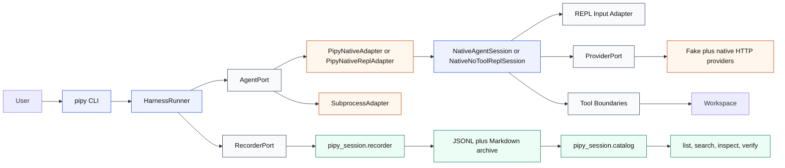
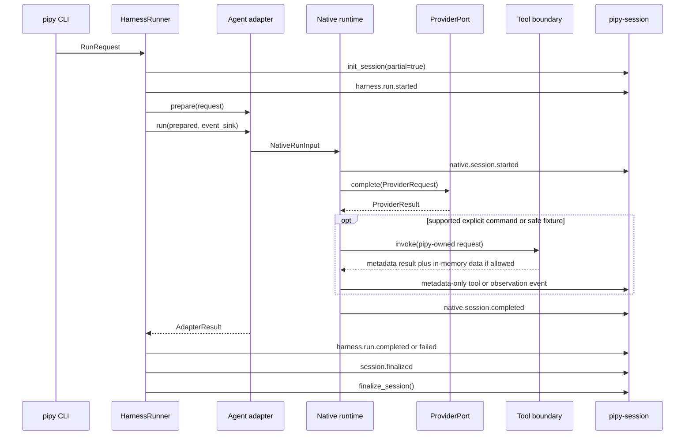

# Pipy Architecture

Status: describes the current codebase after the native shell, proposal,
apply, startup chrome, and input-adapter slices.

Pipy is split into two Python packages:

- `pipy_harness`: the product-facing harness, native runtime, providers, tools,
  and CLI.
- `pipy_session`: the durable session recorder, archive catalog, search,
  inspection, verification, and conservative capture helpers.

The product direction is `pipy-native`. Subprocess wrapping of Codex, Claude,
Pi, or arbitrary commands exists for conservative lifecycle capture and smoke
testing, but those tools are not the main runtime path.

## System View



The important ownership rule is simple: `HarnessRunner` owns the run lifecycle
and the pipy session record. Adapters and native sessions report safe events
through an `EventSink`; they do not mutate finalized records directly.
One-shot native runs go through `PipyNativeAdapter` and `NativeAgentSession`;
interactive REPL runs go through `PipyNativeReplAdapter` and
`NativeNoToolReplSession`.

## Runtime Flow



This diagram compresses the native event stream. See
[Harness Spec](harness-spec.md) for the detailed harness, provider, tool,
proposal, apply, and session event vocabulary.

Provider text, prompts, raw HTTP payloads, raw tool results, diffs, file
contents, stdout, stderr, command output, auth material, secrets, credentials,
tokens, private keys, and sensitive personal data are excluded from JSONL,
Markdown, catalog output, and structured native JSON output by default.

## Codebase Map

| Area | Main files | Responsibility |
| --- | --- | --- |
| CLI | `src/pipy_harness/cli.py` | Parse `pipy`, `pipy run`, `pipy repl`, and auth commands; select adapters and providers; preserve stdout/stderr contracts. |
| Harness core | `src/pipy_harness/models.py`, `src/pipy_harness/runner.py` | Define `RunRequest`, `PreparedRun`, `AdapterResult`, `RunResult`, `HarnessStatus`, recorder port, event sink, lifecycle events, and finalization. |
| Adapter port | `src/pipy_harness/adapters/base.py` | Stable `AgentPort` and `EventSink` protocols. |
| Native adapters | `src/pipy_harness/adapters/native.py` | Bridge the harness port to one-shot native sessions, the no-tool REPL (`PipyNativeReplAdapter`), and the bounded model-driven tool loop (`PipyNativeToolReplAdapter`). |
| Subprocess adapter | `src/pipy_harness/adapters/subprocess.py` | Run arbitrary child processes for conservative lifecycle capture. |
| Capture policy | `src/pipy_harness/capture.py` | Sanitization, workspace basename plus hash, argv redaction, and optional changed-path capture. |
| Native sessions | `src/pipy_harness/native/session.py` | One-shot and no-tool REPL control flow, command dispatch, provider turns, event emission, and metadata-only runtime policy. |
| Tool-loop session | `src/pipy_harness/native/tool_loop_session.py` | Bounded model-driven REPL: turn loop, `--tool-budget` enforcement, malformed-call streak fatal-after-three, production tool registry, and `TranscriptSink` plumbing. |
| Tool-loop terminal UI | `src/pipy_harness/native/tui.py` | Pipy-owned alternate-screen TTY shell for the bounded tool-loop REPL. Keeps submitted user messages, active assistant output, transient working state, and tool blocks in a flowing history region while input/editor and footer/status repaint in a stable frame; captured streams keep the deterministic line-rendering fallback. |
| Terminal-screen verifier | `src/pipy_harness/native/terminal_screen.py` | Stdlib ANSI screen-cell model used by TUI tests and tmux verification artifacts. Replays terminal output into viewport rows, columns, cursor position, scroll state, visible-string findings, reverse/cell attributes, and screen anomaly reports. |
| Terminal comparison verifier | `src/pipy_harness/native/terminal_compare.py` | Compares pipy and Pi screen metrics from controlled tmux captures, writing row/column and cell-attribute deltas plus anomalies for prompt, expected output, footer/status, input row, live cursor, and drawn cursor positions. |
| Native value objects | `src/pipy_harness/native/models.py` | Provider, tool, read, proposal, apply, verification, output, and `ProviderToolCall` value objects; `ProviderRequest.messages`/`available_tools`/`attachments` (current-turn image blocks); closed labels and storage booleans. |
| Conversation state | `src/pipy_harness/native/conversation.py` | In-memory conversation identity, bounded turns, and metadata-only turn payloads. |
| Provider registry | `src/pipy_harness/native/provider_registry.py` | Product provider/model registry: supported ids, default models, local/credential availability probes, one-shot model-default policy, auto-default eligibility, and conservative tool-call capability flags. |
| REPL state | `src/pipy_harness/native/repl_state.py` | Provider/model selection, non-secret defaults, and registry-backed local availability checks. |
| Provider port | `src/pipy_harness/native/provider.py` | `ProviderPort.complete()` protocol plus the `supports_tool_calls` capability flag. |
| Shared provider helpers | `src/pipy_harness/native/_provider_helpers.py` | `JsonResponse`, `JsonHTTPClient` Protocol, and the deduplicated helpers each provider used to inline (`utc_now`, `safe_response_label`, `failed_provider_result`, `extract_chat_completions_tool_calls`, `extract_usage_from_fields`, `serialize_tool_for_*`, `envelope_to_chat_message`, `extract_text_content`, `safe_http_status_metadata`). |
| Providers | `src/pipy_harness/native/fake.py`, `ds4_provider.py`, `openai_provider.py`, `openai_completions_provider.py`, `openai_codex_provider.py`, `openrouter_provider.py`, `anthropic_provider.py`, `google_provider.py`, `google_vertex_provider.py`, `mistral_provider.py`, `bedrock_provider.py`, `azure_openai_provider.py`, `cloudflare_provider.py` | Deterministic fake provider (with `programmable_tool_calls`) plus stdlib HTTP adapters for local ds4, OpenAI Responses, OpenAI Chat Completions, OpenAI Codex subscription, OpenRouter, Anthropic, Google Generative AI, Google Vertex, Mistral, Amazon Bedrock, Azure OpenAI, and Cloudflare Workers AI. Tool-capable real adapters advertise `supports_tool_calls=True`; ds4 is tool-loop capable after a live ds4 smoke verified OpenAI-style tool calls. |
| Archive-safe tool port | `src/pipy_harness/native/tool.py` | Minimal tool invocation protocol used by `/read` and `/apply-proposal`. |
| Model-driven tool contracts | `src/pipy_harness/native/tools/base.py`, `messages.py` | `ToolDefinition`, `ToolRequest`, `ToolExecutionResult`, `ToolArgumentError`, `ToolContext`, `ToolPort`, manual JSON-schema-subset `validate_arguments`, and the `UserMessage`/`AssistantMessage`/`ToolResultMessage` envelope. |
| Model-driven tools | `src/pipy_harness/native/tools/read.py`, `ls.py`, `grep.py`, `find.py`, `write.py`, `edit.py`, `edit_diff.py`, `truncate.py`, `bash.py` (via `command_sandbox.py`) | Production registry tools for the bounded tool-loop. Filesystem tools reuse `_validate_workspace_relative_path`, `_is_ignored_or_generated`, `_is_relative_to`, and `_resolved_relative_label` from `read_only_tool.py` for `.git`/symlink default-deny, and stat-gate oversized file reads before loading content. `truncate` is pure transformation only. `bash` runs through the shared command sandbox (`command_sandbox.py`): a no-shell, allowlisted-executable boundary preserving secret isolation and `.git` default-deny with symlink/path-escape refusal, bounded output, and timeout/kill. |
| Transcript sidecar | `src/pipy_harness/native/transcripts.py` | Opt-in `TranscriptSink` writing raw loop turns to `~/.local/state/pipy/transcripts/<id>.jsonl` outside the pipy session archive, excluded from `pipy-session list/search/inspect`. |
| Usage normalization | `src/pipy_harness/native/usage.py` | Normalizes provider token counters to the safe allowlisted metadata keys. |
| Read boundary | `src/pipy_harness/native/read_only_tool.py` | Bounded explicit file excerpt reads with workspace-relative validation, a shared two-successful-excerpt REPL budget, metadata-only archive output, and the `_resolved_relative_label` helper used by every model-driven tool. |
| Runtime resources | `src/pipy_harness/native/_resource_files.py`, `skills.py`, `prompt_templates.py`, `custom_commands.py`, `resources.py` | Workspace + global `.pipy/{skills,templates,commands}/*.md` discovery (frontmatter parse, byte caps, symlink/secret-shaped/binary/ignored safety screen) and the `WorkspaceResources` registry + pure `dispatch_resource_command` consumed by both REPL paths for `/skill`, `/template`, and custom `/<name>` slash commands. Only safe per-resource metadata (path label, sha256, byte length, truncated, name, kind) is archived; bodies/expansions stay provider-visible only. |
| Chrome + themes | `src/pipy_harness/native/chrome.py`, `themes.py` | Shared Pi-parity terminal chrome (startup banner, separators, two-row status block) rendered through `ChromeStyle`, which holds a `ChromePalette`. `themes.py` is the palette registry (`pi`/`high-contrast`/`ocean`), `NativeThemeStore` persistence, and `resolve_active_theme_name` (env `PIPY_THEME` > store > default). The `/theme` command in both REPLs swaps the active palette; `chrome_style_for` decides color enablement (NO_COLOR / non-TTY → plain) before any palette is consulted, so a theme never overrides the no-color contract. |
| User-directed @-context | `src/pipy_harness/native/file_references.py`, `image_attachment.py` | Resolve `@path` text excerpts and `@image:<path>` image attachments from a genuine prompt, reusing the `read` tool's path policy. `file_references` appends bounded UTF-8 excerpts to the provider prompt; `image_attachment` loads bounded, magic-byte-validated (PNG/JPEG/GIF/WebP) images onto `ProviderRequest.attachments`, which multimodal adapters render as native image blocks. Both fail closed and archive only safe metadata (counts; for images, media type / byte count / sha256) — never file contents or raw image bytes. |
| Patch apply boundary | `src/pipy_harness/native/patch_apply.py` | One approved, human-reviewed, bounded workspace mutation request. |
| Legacy verification boundary | `src/pipy_harness/native/verification.py` | Retained legacy allowlisted `just-check` helper; no longer wired as a user-facing REPL slash command. |
| Session resume (archive) | `src/pipy_harness/native/session_resume.py` | Metadata-only finalized-record reader and safe resume system-block composer over the `pipy-session` archive. Not the product session source. |
| Native product session tree | `src/pipy_harness/native/session_tree.py` | The product session source of truth: append-only JSONL conversation tree (`NativeSessionTree`), entry value objects, parse/write, leaf pointer, `get_branch`/`get_tree`/`build_context`, `fork_from`, `continue_recent`, under `~/.local/state/pipy/native-sessions/--<encoded-cwd>--/`. |
| Session-tree commands | `src/pipy_harness/native/session_tree_commands.py` | Loop-/TTY-independent `/tree` selection semantics, filters, rendering, status, entry/session reference resolution, and `resolve_startup_session` (Pi `-c`/`-r`/`--session`/`--fork`/`--no-session`). |
| Session recorder | `src/pipy_session/recorder.py` | Active `.in-progress/pipy` JSONL records, finalized `pipy/YYYY/MM` records, immutable finalization, and Markdown summaries (metadata archive, not the product session source). |
| Session catalog | `src/pipy_session/catalog.py` | Read-only list, search, inspect, and verify surfaces over finalized records. |
| Automatic capture | `src/pipy_session/auto_capture.py` | Conservative adapter helpers for wrapper and hook-based partial capture (Claude hook + generic `wrap`). |

## Isolation Model

Pipy uses explicit ports and value objects instead of letting provider adapters,
tool code, and archive code freely call each other.


The pure side is not perfectly effect-free because this is still a small Python
codebase, but the dependency direction is deliberate:

- Domain value objects validate closed labels, limits, storage booleans, and
  request authority.
- Provider adapters return `ProviderResult`; they do not write session records.
- Workspace tools return metadata-only result objects; raw excerpt text can
  exist only in memory where the command explicitly needs it.
- Archive-facing allowlists are exposed as `archive_metadata()` methods on
  result value objects, not as a separate archive-metadata module.
- The runner assigns event metadata and calls the recorder.
- The catalog is read-only and works only over finalized archive records.

## Data And Privacy Boundaries

Pipy has three data classes:

- In-memory runtime data: provider prompts, model final text, bounded excerpts,
  proposal drafts, and command input may exist transiently during a run.
- Metadata archive data: JSONL and Markdown keep statuses, safe labels,
  counters, durations, booleans, hashes, and summaries.
- Native or external data: Pi, Codex, Claude, provider, and shell transcript
  stores remain external unless pipy records a metadata-only reference.

The archive is intentionally metadata-first. `--native-output json` follows the
same rule and is not a transcript channel.

## Testing And Verification

The test suite mirrors these boundaries:

- `tests/test_harness_*` covers CLI, runner, subprocess, and native CLI
  behavior.
- `tests/test_native_*` covers providers, session flow, conversation state,
  read-only tools, patch apply, approval helper behavior, usage
  normalization, and privacy assertions.
- `tests/test_recorder.py`, `tests/test_catalog.py`, and
  `tests/test_auto_capture.py` cover session storage and catalog behavior.

Use:

```sh
just check
just docs-build
```

`just check` verifies Python linting, types, and tests. `just docs-build`
verifies that the Zensical documentation site can render.
