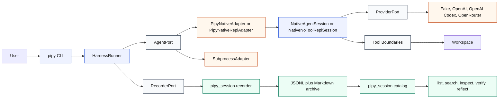
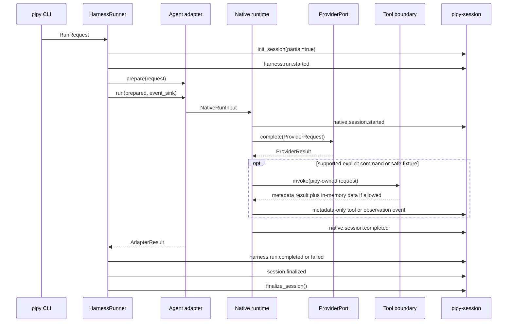
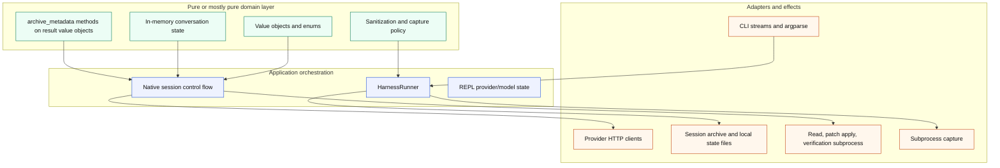

# Pipy Architecture

Status: describes the current codebase after the native shell, proposal,
apply, verification, and startup chrome slices.

Pipy is split into two Python packages:

- `pipy_harness`: the product-facing harness, native runtime, providers, tools,
  and CLI.
- `pipy_session`: the durable session recorder, archive catalog, search,
  inspection, verification, reflection, and conservative capture helpers.

The product direction is `pipy-native`. Subprocess wrapping of Codex, Claude,
Pi, or arbitrary commands exists for conservative lifecycle capture and smoke
testing, but those tools are not the main runtime path.

## System View



The important ownership rule is simple: `HarnessRunner` owns the run lifecycle
and the pipy session record. Adapters and native sessions report safe events
through an `EventSink`; they do not mutate finalized records directly.
One-shot native runs go through `PipyNativeAdapter` and `NativeAgentSession`;
interactive REPL runs go through `PipyNativeReplAdapter` and
`NativeNoToolReplSession`.

## Runtime Flow



This diagram compresses the native event stream. See
[Harness Spec](harness-spec.md) for the detailed harness, provider, tool,
proposal, apply, verification, and session event vocabulary.

Provider text, prompts, raw HTTP payloads, raw tool results, diffs, file
contents, stdout, stderr, command output, auth material, secrets, credentials,
tokens, private keys, and sensitive personal data are excluded from JSONL,
Markdown, catalog output, and structured native JSON output by default.

## Current Feature Surface

The native shell is line-oriented and bounded. It is intentionally not a full
Pi-style TUI yet.

Available now:

- `pipy` and `pipy repl --agent pipy-native` start the native REPL in the
  current directory with compact startup chrome.
- `pipy run --agent pipy-native --goal ...` runs one native provider turn.
- `/help` prints static command usage.
- `/status` prints safe local shell state to stderr.
- `/clear` clears retained no-tool conversation context and pending proposal
  state.
- `/login [openai-codex]`, `/logout [openai-codex]`, and `/model ...` manage
  local provider selection and pipy-owned OpenAI Codex OAuth state.
- Ordinary non-command input makes bounded no-tool provider turns with small
  in-memory conversation context.
- `/read <path>` reads one explicit UTF-8 workspace-relative file excerpt and
  prints it to interactive stdout without archiving file contents.
- `/ask-file <path> -- <question>` reads one bounded excerpt and forwards it
  only in memory to one provider turn.
- `/propose-file <path> -- <change-request>` reads one bounded excerpt,
  forwards it only in memory to one provider turn, and may retain a same-session
  visible proposal draft.
- `/apply-proposal <path>` can apply one same-session, human-reviewed proposal
  for the same normalized path.
- `/verify just-check` can run the internal `just check` command after a
  successful same-session apply.
- `pipy-session` can initialize, append, finalize, list, search, inspect,
  verify, reflect, and record workflow-learning events.

Deferred:

- Full Pi-style TUI editor, footer, overlays, file references, and keyboard
  shortcuts.
- Model-selected general tool use.
- Multiple file reads per REPL session.
- Arbitrary shell execution.
- Non-allowlisted verification commands.
- Branching, compaction, resume UI, RPC mode, extension APIs, and a provider
  registry.
- Raw transcript import by default.

## Codebase Map

| Area | Main files | Responsibility |
| --- | --- | --- |
| CLI | `src/pipy_harness/cli.py` | Parse `pipy`, `pipy run`, `pipy repl`, and auth commands; select adapters and providers; preserve stdout/stderr contracts. |
| Harness core | `src/pipy_harness/models.py`, `src/pipy_harness/runner.py` | Define `RunRequest`, `PreparedRun`, `AdapterResult`, `RunResult`, `HarnessStatus`, recorder port, event sink, lifecycle events, and finalization. |
| Adapter port | `src/pipy_harness/adapters/base.py` | Stable `AgentPort` and `EventSink` protocols. |
| Native adapters | `src/pipy_harness/adapters/native.py` | Bridge the harness port to one-shot native sessions and the REPL. |
| Subprocess adapter | `src/pipy_harness/adapters/subprocess.py` | Run arbitrary child processes for conservative lifecycle capture. |
| Capture policy | `src/pipy_harness/capture.py` | Sanitization, workspace basename plus hash, argv redaction, and optional changed-path capture. |
| Native sessions | `src/pipy_harness/native/session.py` | One-shot and REPL control flow, command dispatch, provider turns, event emission, and metadata-only runtime policy. |
| Native value objects | `src/pipy_harness/native/models.py` | Provider, tool, read, proposal, apply, verification, and output value objects with closed labels and storage booleans. |
| Conversation state | `src/pipy_harness/native/conversation.py` | In-memory conversation identity, bounded turns, and metadata-only turn payloads. |
| REPL state | `src/pipy_harness/native/repl_state.py` | Provider/model selection, non-secret defaults, and local availability checks. |
| Provider port | `src/pipy_harness/native/provider.py` | Minimal `ProviderPort.complete()` protocol. |
| Providers | `src/pipy_harness/native/fake.py`, `openai_provider.py`, `openai_codex_provider.py`, `openrouter_provider.py` | Deterministic fake provider plus direct OpenAI, OpenAI Codex subscription, and OpenRouter adapters. |
| Tool port | `src/pipy_harness/native/tool.py` | Minimal tool invocation protocol. |
| Approval prompt helper | `src/pipy_harness/native/approval_prompt.py` | Test-covered visible approval/sandbox prompt resolver for read-only request shapes; not wired into normal explicit REPL read/context commands. |
| Usage normalization | `src/pipy_harness/native/usage.py` | Normalizes provider token counters to the safe allowlisted metadata keys. |
| Read boundary | `src/pipy_harness/native/read_only_tool.py` | Bounded explicit file excerpt reads with workspace-relative validation and metadata-only archive output. |
| Patch apply boundary | `src/pipy_harness/native/patch_apply.py` | One approved, human-reviewed, bounded workspace mutation request. |
| Verification boundary | `src/pipy_harness/native/verification.py` | One allowlisted post-apply `just-check` command mapping to `just check`. |
| Session recorder | `src/pipy_session/recorder.py` | Active `.in-progress/pipy` JSONL records, finalized `pipy/YYYY/MM` records, immutable finalization, and Markdown summaries. |
| Session catalog | `src/pipy_session/catalog.py` | Read-only list, search, inspect, verify, and reflect surfaces over finalized records. |
| Automatic capture | `src/pipy_session/auto_capture.py` | Conservative adapter helpers for wrapper and hook-based partial capture, including Pi session references without transcript import. |

## Isolation Model

Pipy uses explicit ports and value objects instead of letting provider adapters,
tool code, and archive code freely call each other.



The pure side is not perfectly effect-free because this is still a small Python
codebase, but the dependency direction is deliberate:

- Domain value objects validate closed labels, limits, storage booleans, and
  request authority.
- Provider adapters return `ProviderResult`; they do not write session records.
- Workspace tools return metadata-only result objects; raw excerpt text can
  exist only in memory where the command explicitly needs it.
- Archive-facing allowlists are exposed as `archive_metadata()` methods on
  result value objects, not as a separate archive-metadata module.
- The runner assigns event metadata and calls the recorder.
- The catalog is read-only and works only over finalized archive records.

## Data And Privacy Boundaries

Pipy has three data classes:

- In-memory runtime data: provider prompts, model final text, bounded excerpts,
  proposal drafts, and command input may exist transiently during a run.
- Metadata archive data: JSONL and Markdown keep statuses, safe labels,
  counters, durations, booleans, hashes, and summaries.
- Native or external data: Pi, Codex, Claude, provider, and shell transcript
  stores remain external unless pipy records a metadata-only reference.

The archive is intentionally metadata-first. `--native-output json` follows the
same rule and is not a transcript channel.

## Testing And Verification

The test suite mirrors these boundaries:

- `tests/test_harness_*` covers CLI, runner, subprocess, and native CLI
  behavior.
- `tests/test_native_*` covers providers, session flow, conversation state,
  read-only tools, patch apply, verification, approval helper behavior, usage
  normalization, and privacy assertions.
- `tests/test_recorder.py`, `tests/test_catalog.py`, and
  `tests/test_auto_capture.py` cover session storage and catalog behavior.

Use:

```sh
just check
just docs-build
```

`just check` verifies Python linting, types, and tests. `just docs-build`
verifies that the Zensical documentation site can render.
