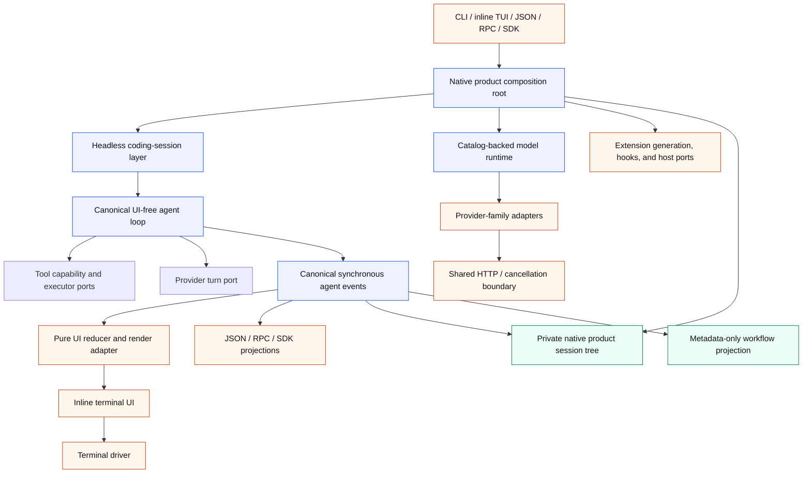

# Pipy Architecture

Status: living overview of the current native coding-agent product.

Pipy is a Python coding-agent application. Its primary path is the native
interactive product (`pipy` / `pipy repl`), not a wrapper around another agent
CLI. `pipy_harness` owns the agent runtime, providers, tools, private product
sessions, automation modes, extensions, and terminal UI. `pipy_session` is a
separate metadata-only workflow archive and catalog.

The Phase 0–7 [Architecture Migration](architecture-migration.md) is completed
historical evidence. Current structural work is ordered by the reviewed
[Architecture Quality Improvement Program](specs/2026-07-24-architecture-quality-improvement-plan.md)
and indexed in the [Backlog](backlog.md).

## Runtime structure


```mermaid
flowchart TB
  Entrypoints[CLI / inline TUI / JSON / RPC / SDK] --> Composition[Native product composition root]
  Composition --> Coding[Headless coding-session layer]
  Coding --> Agent[Canonical UI-free agent loop]
  Agent --> Tools[Tool capability and executor ports]
  Agent --> ProviderPort[Provider turn port]
  Composition --> Runtime[Catalog-backed model runtime]
  Runtime --> Providers[Provider-family adapters]
  Providers --> HTTP[Shared HTTP / cancellation boundary]
  Composition --> Extensions[Extension generation, hooks, and host ports]
  Composition --> ProductTree[Private native product session tree]
  Agent --> Events[Canonical synchronous agent events]
  Events --> UI[Pure UI reducer and render adapter]
  Events --> Automation[JSON / RPC / SDK projections]
  Events --> ProductTree
  Events --> Workflow[Metadata-only workflow projection]
  UI --> TUI[Inline terminal UI]
  TUI --> Driver[Terminal driver]

  classDef core fill:#eef2ff,stroke:#1d4ed8,color:#111111;
  classDef adapter fill:#fff7ed,stroke:#c2410c,color:#111111;
  classDef store fill:#ecfdf5,stroke:#047857,color:#111111;
  class Agent,Coding,Composition,Runtime,Events core;
  class Entrypoints,Providers,HTTP,Extensions,UI,TUI,Driver,Automation adapter;
  class ProductTree,Workflow store;
```

The core is synchronous. Provider and tool work may use owned workers so a TTY
or RPC caller can cancel or inject input, but no asyncio loop owns the product
lifecycle. Canonical events use synchronous push semantics: each mode's fixed
composite accepts its ordered projections before the producer advances.

## Canonical agent layer

`src/pipy_harness/native/agent/` is the reusable, provider-neutral core. It
owns immutable full-content messages and events, active-input identity,
request-local tool authorization, usage accounting, history reduction, one
provider-turn execution, one tool-call execution, and the single accepted-run
`AgentLoop`. The loop runs against fake provider/tool/event ports without a
terminal, product session, extension implementation, concrete transport, or
workflow archive.

Product adapters in `native/agent_request.py`, `agent_loop_policy.py`,
`agent_runtime.py`, `agent_adapters.py`, and `tool_capabilities.py` bind that
core to catalog selections, extension policy, current product state, concrete
tools, rendering, and persistence. These adapters are composition seams; the
canonical package does not import them back.

## Headless coding-session layer

`src/pipy_harness/native/coding/` owns product policy above a single agent run:

- `input_queue.py` owns command precedence and steering/follow-up/trigger
  ordering;
- `state.py` owns the active provider/model labels, canonical history, usage,
  counters, compaction state, and provider-failure state;
- `accepted_input.py` prepares one accepted prompt and request-only context;
- `agent_run.py` assembles and invokes the canonical loop;
- `commands.py` and `command_registry.py` own the closed command vocabulary,
  classification, metadata, and dispatch outcomes;
- `product_session.py` coordinates state-first private-session transitions; and
- `session_controller.py` owns input selection, command/resource/extension
  precedence, true-idle settlement, and the outer session lifecycle.

This package is headless: terminal rendering, extension implementation,
provider construction, concrete tools, filesystem persistence, automation, and
the metadata archive are injected or remain outside it.

## Product composition and one-shot runtime

`native/tool_loop_session.py` is the interactive product composition root. It
constructs settings and trust state, catalog-backed providers, tools,
extensions, the private session tree, event projections, automation or terminal
input, and the headless coding/agent collaborators. Dynamic command effects and
cross-boundary orchestration remain here. The session-owned built-in effects
(status, compact, name, new, tree, resume, fork, and clone) execute through one
frozen `_SessionCommandEffects` bundle composed from narrow run-scope ports;
provider/configuration built-ins (hotkeys, changelog, copy, settings, trust,
model and scoped-model selection, login, and logout) execute through a separate
frozen `_ProviderConfigurationCommandEffects` bundle. That executor composes
with `_ProviderMutationEffects`, which remains the single owner for live model
and authentication mutation ordering, while preserving live-terminal versus
captured-stream presentation. Native session export, import, and share execute
through `_TransferCommandEffects`; import replaces the live tree and then uses
the session collaborator's authoritative history/input rebuild seam. `/reload`
executes through `_ReloadCommandEffects`, whose explicit phases preserve the
publication gate around configuration/package/resource recomposition,
extension generation activation/publication, provider refresh, tool-capability
publication, and terminal refresh. Provider fallback and unavailable binding
remain methods on `_ProviderMutationEffects`, rather than a second reload-only
mutation path. `_BuiltinCommandInterpreter` now contains only the closed
four-family routing plus the closed footer policy.

`native/session.py` still owns the one-shot `NativeAgentSession` used by the
harness/SDK compatibility path. It projects canonical event/result types but is
not yet routed through the complete interactive `AgentLoop`. Whether that
pipeline should converge on the canonical loop or remain a named compatibility
runtime is an explicit architecture-program decision, not an assumed
equivalence.

`pipy_harness.runner.HarnessRunner` and the adapter ports continue to support
conservative subprocess lifecycle capture. Subprocess wrapping is a reference
and capture facility, not the product runtime direction.

## Providers and HTTP ownership

`native.repl_state.ModelRuntime` composes `catalog_state.py` with
`provider_construction.py`. It is the product owner for resolving a provider /
model specification, determining availability and thinking levels, and
constructing the selected provider. Built-in rows, `models.json`, stored auth,
and extension-registered providers join at the catalog/construction boundary;
provider selection code does not bypass it with a second factory.

Concrete HTTP adapters live by protocol family under `native/providers/`, with
shared wire translators for OpenAI Responses, Chat Completions, Anthropic
Messages, and Gemini `generateContent`. The specialized Codex streaming adapter
remains `native/openai_codex_provider.py`. `native/http.py` owns common JSON and
SSE execution, timeout/error normalization, cancellation, and retryable
transport classification. Provider adapters return normalized results and never
write sessions or import UI code.

## Extensions

Extension ownership is split deliberately:

- `extensions.py` discovers and inventories loadable local resources;
- `extension_loader.py` owns isolated module loading and awaitable driving;
- `extension_types.py` owns the stable typed API, contribution, hook, host-port,
  and UI value vocabulary;
- `extension_runtime.py` activates one validated batch and owns commands,
  shortcuts, tools, providers, flags, renderers, queues, and host contexts;
- `extension_hooks.py` owns serial lifecycle, input, request, tool, trust, bash,
  and session-gate dispatch; and
- `extension_ui.py` owns the deterministic headless UI bridge, while
  `tui.py` owns the concrete live extension UI driver and chrome rendering.

The stable `pipy_harness.extensions` module is a façade, not another behavior
owner. Its exact 97-name `__all__` inventory imports each value directly from
the module above that owns it (plus the provider construction/header seams),
so its public contract does not depend on whatever `extension_runtime.py`
happens to import for its own implementation. `extension_runtime.py` keeps the
already-characterized direct-import compatibility identities explicit for
internal consumers, including the headless UI bridge and render helpers; those
aliases still denote the authoritative owner objects.

Activation fails closed per extension. Trusted extension code may perform its
own external effects, but pipy-owned registries do not publish a partial
activation.

The live extension state is one generation reached through
`native/session_generation.py`. `SessionGenerationRef` owns the generation
pointer, its identity, and the session's single mutex; `_RunControlState`
reaches the generation only through that reference. `/reload` parses the
candidate's flags before anything becomes live, so a malformed flag rejects the
whole candidate and the previous generation stays complete — its commands,
hooks, tools, providers, renderers and flag values together — instead of the
new runtime being paired with stale flags. Only the extension generation is
rejected: settings, keybindings, package roots, and workspace resources that
reloaded successfully stay applied, and the rest of the reload runs against the
unchanged generation.

While a reload republishes its derived projections the reference opens a
publication gate, and the extension mutation ports refuse changes for that
window. `set_active_tools` and `set_thinking_level` take the session mutex
across both the refusal check and their assignment; `set_model` still persists
part-way through its mutation, so for that one port the gate narrows the window
rather than closing it. Model defaults are queued during a selection and written
only after the selection is live, and a persistence failure is reported without
claiming the selection reverted. The reload effect owner closes the gate before
firing the replacement generation's `session_start` hook, then emits the final
reload diagnostic; the root footer policy runs only after that complete effect
returns.

## Sessions, automation, and trust domains

Two stores serve different purposes and must not be conflated:

1. `native/session_tree.py` is the private native product session source of
   truth. Its append-only JSONL tree intentionally stores full conversation,
   assistant, tool, custom-message, compaction, and branch content for resume,
   fork, clone, import, and export.
2. `pipy_session` is a separate metadata-only workflow archive. Its JSONL,
   Markdown summaries, and list/search/inspect/verify surfaces allowlist safe
   lifecycle metadata, counters, hashes, bounded labels, and summary-safe
   learning events. It excludes prompts, provider text, raw tool or command
   output, file content, diffs, paths, raw exception text, and credentials by
   default.

`--mode json`, `--mode rpc`, `--print`, and the Python SDK are explicit
full-content product transports, not workflow-archive channels.
`native/automation/` owns Pi-shaped event dictionaries, deterministic JSONL,
one-shot JSON/print drivers, and the long-lived RPC server. RPC additionally
owns command correlation, queued-input reservation/settlement, true-idle
notification, and its direct bash boundary.

Project trust is fail-closed. Final-workspace project settings, packages,
resources, and executable extensions are unavailable until saved or run-local
trust is resolved; global and explicit CLI sources follow their documented
separate policy. Workspace tools enforce containment after symlink resolution
and default-deny `.git` and ignored/generated paths where specified. Provider
auth is resolved at the catalog/construction boundary, secrets stay out of
session/archive diagnostics, and extension activation cannot silently widen
provider or tool authority.

## Terminal boundary

`native/ui/state.py` is a pure reducer from canonical agent events to render
decisions, and `native/ui/rendering.py` drives a renderer port.
`native/tui.py` owns the product's large stateful inline-scrollback façade:
editor state, selectors and overlays, extension chrome, live frame composition,
and TUI-facing event rendering. Finalized blocks are committed to the normal
terminal buffer; pipy does not use the alternate screen.

`native/terminal_driver.py` owns terminal writes/flushes, raw-mode and bracketed
paste lifecycle, title restoration, decoded input bytes, SIGWINCH handling, and
live terminal geometry. The TUI decides what to draw; the driver decides how
bytes and terminal lifecycle transitions occur. Real-PTY tests protect prompt
readiness and restoration.

## Executable architecture gates

`tests/test_architecture_import_boundaries.py` statically rejects forbidden
imports without importing product entrypoints. It activates package- and
module-specific rules for the canonical agent, coding, UI, providers, HTTP,
extensions, terminal driver, persistence, automation, and composition layers;
focused fresh-process and exact-import tests strengthen important leaves.
Golden architecture contracts separately pin cross-mode event order and the
full-content product-session versus metadata-archive privacy split.

The current Mypy strict-equivalent frontier is exactly the override in
`pyproject.toml`: `pipy_harness.cli`, `native.ui.*`, `native.agent.*`,
`native.coding.*`, `native.automation.*`, `native.providers.*`, the complete
extension ownership surface (`pipy_harness.extensions`,
`native.extension_types`, `native.extension_ui`, `native.extension_runtime`,
`native.extension_hooks`, `native.extension_loader`, and
`native.extensions`), and the named root modules `native.http`,
`native.repl_state`, `native.session`, `native.tool_loop_session`, `native.tui`,
`native.settings`, `native.package_manager`, and
`native.session_tree_commands`, `native.package_resources`,
`native.package_runtime`, `native.resources`, `native.repl_input`,
`native.autocomplete_provider`, and `native.tool_renderers`. This is 27 exact
override entries. Slice 8a's three support owners narrow validated integer settings
without accepting booleans, preserve string- and object-form package JSON
through a string-keyed object boundary, and traverse the product-session tree
through the authoritative `SessionTreeNode` type. Slice 8b adds the
package-resource resolver, package-runtime composition seam, and resource
registry/dispatcher. `PackageResourceRoots` remains authoritatively defined in
`package_resources`; `package_runtime` explicitly re-exports that same class
object for existing composition-root imports. Dynamic package JSON/TOML stays
behind executable `object`, `Mapping`, `Sequence`, and `str` narrowing. Slice
8c adds the terminal-support owners. Autocomplete provider invocation remains
duck-typed and snake-case-first, but its arguments and result cross an explicit
`object` boundary before existing coercion. The optional prompt-toolkit
key-binding class, decorators, events, and buffers are described by local
protocols without importing or requiring the package. Chrome and tool rendering
reuse the authoritative runtime-checkable component/context/theme contracts
from `extension_types`; the captured dispatcher now has the same typed
callable, mapping, context, and result shape as the TUI dispatcher while
retaining its original renderer pinning and opaque-details compatibility seam.
These modules are strict; the repository default remains non-strict only
outside the listed frontier.

Ruff C901 is a directional repository gate. Previously complex files are
explicitly pinned and no new pin may be added; a finding in a previously clean
file fails `just lint`. At the Slice 1 baseline, unignored Ruff reports 39
repository findings, 23 under `src`, while `src` contains one justified
`type: ignore`. Run the reproducible source-only inventory with:

```sh
uv run python scripts/architecture_metrics.py --json
```

## Intentionally remaining risks

The active program addresses ownership risks rather than cosmetic size:

- extension reload publishes one generation and rejects a candidate whole, but
  the candidate is not yet staged behind an isolated activation host. A
  candidate activates against the live host, so extension chrome must still be
  cleared before activation rather than after commit — which means a rejected
  candidate leaves the retained generation's chrome cleared — and a timed-out
  activation worker is not yet sealed out of its runtime;
- `set_model` persists a default part-way through its mutation, so its
  publication-gate admission is not yet atomic;
- `_ReplLoopStep.step_once` remains a high-complexity cross-boundary
  orchestrator with a wide collaborator list;
- strict typing has not yet reached every source module;
- the one-shot runtime and canonical interactive loop have unresolved semantic
  overlap;
- `ToolLoopTerminalUi` still combines editor, overlay, extension chrome, and
  frame state (128 measured state fields at baseline); and
- load-sensitive PTY readiness races and the absence of a repository Ruff-format
  gate remain explicit quality work.

See the active improvement plan for ordered acceptance criteria. These are
intentional, measured residuals—not evidence that the completed migration is
still awaiting its original phases.
