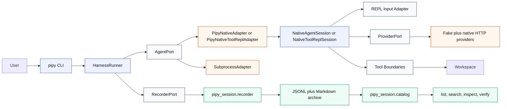
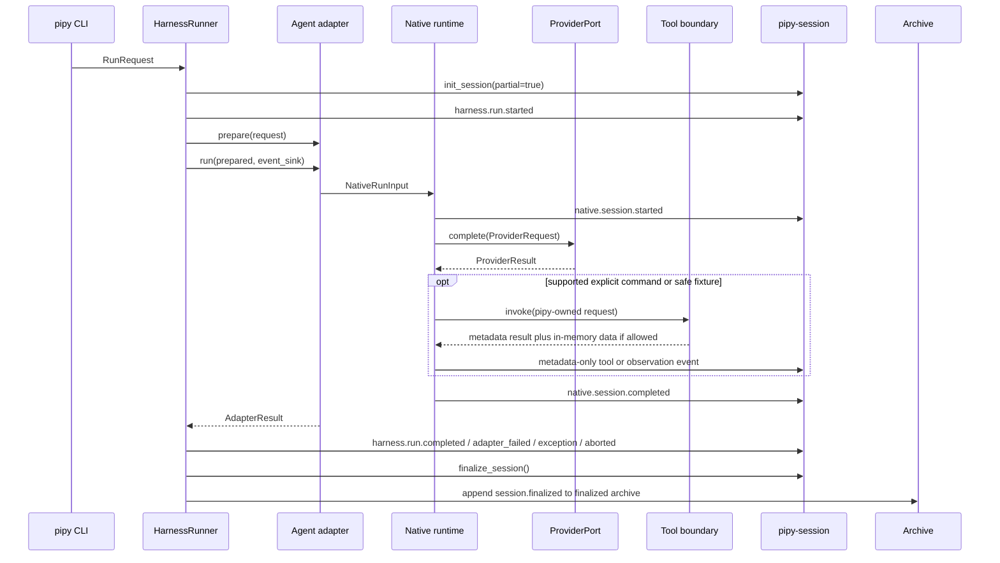
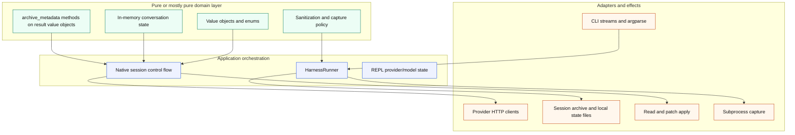

# Pipy Architecture

Status: describes the current codebase after the native shell, proposal,
apply, startup chrome, and input-adapter slices.

This page describes the current runtime. The ordered plan for moving from the
current large session/provider/UI modules to explicit agent, coding-session,
event, UI, and provider boundaries is the
[Architecture Migration Plan](architecture-migration.md).

Pipy is split into two Python packages:

- `pipy_harness`: the product-facing harness, native runtime, providers, tools,
  and CLI.
- `pipy_session`: the durable session recorder, archive catalog, search,
  inspection, verification, and conservative capture helpers.

The product direction is `pipy-native`. Subprocess wrapping of Codex, Claude,
Pi, or arbitrary commands exists for conservative lifecycle capture and smoke
testing, but those tools are not the main runtime path.

## System View


```mermaid
flowchart LR
  User[User] --> CLI[pipy CLI]
  CLI --> Runner[HarnessRunner]
  Runner --> AgentPort[AgentPort]
  AgentPort --> NativeAdapter[PipyNativeAdapter or PipyNativeToolReplAdapter]
  AgentPort --> SubprocessAdapter[SubprocessAdapter]
  NativeAdapter --> NativeSession[NativeAgentSession or NativeToolReplSession]
  NativeSession --> InputAdapter[REPL Input Adapter]
  NativeSession --> ProviderPort[ProviderPort]
  NativeSession --> ToolBoundaries[Tool Boundaries]
  ProviderPort --> Providers[Fake plus native HTTP providers]
  ToolBoundaries --> Workspace[Workspace]
  Runner --> RecorderPort[RecorderPort]
  RecorderPort --> SessionRecorder[pipy_session.recorder]
  SessionRecorder --> Archive[JSONL plus Markdown archive]
  Archive --> Catalog[pipy_session.catalog]
  Catalog --> ReaderCommands[list, search, inspect, verify]

  classDef core fill:#eef2ff,stroke:#1d4ed8,color:#111111;
  classDef adapter fill:#fff7ed,stroke:#c2410c,color:#111111;
  classDef store fill:#ecfdf5,stroke:#047857,color:#111111;
  classDef boundary fill:#f8fafc,stroke:#334155,color:#111111;
  class CLI,Runner,NativeSession core;
  class AgentPort,InputAdapter,ProviderPort,RecorderPort,ToolBoundaries boundary;
  class NativeAdapter,SubprocessAdapter,Providers adapter;
  class SessionRecorder,Archive,Catalog,ReaderCommands store;
```

The important ownership rule is simple: `HarnessRunner` owns the run lifecycle
and the pipy session record. Adapters and native sessions report safe events
through an `EventSink`; they do not mutate finalized records directly.
One-shot native runs go through `PipyNativeAdapter` and `NativeAgentSession`;
interactive REPL runs go through `PipyNativeToolReplAdapter` and
`NativeToolReplSession`, the single model-driven tool-loop product session.

## Runtime Flow


```mermaid
sequenceDiagram
  participant CLI as pipy CLI
  participant Runner as HarnessRunner
  participant Adapter as Agent adapter
  participant Runtime as Native runtime
  participant Provider as ProviderPort
  participant Tool as Tool boundary
  participant Recorder as pipy-session
  participant Archive as Archive

  CLI->>Runner: RunRequest
  Runner->>Recorder: init_session(partial=true)
  Runner->>Recorder: harness.run.started
  Runner->>Adapter: prepare(request)
  Runner->>Adapter: run(prepared, event_sink)
  Adapter->>Runtime: NativeRunInput
  Runtime->>Recorder: native.session.started
  Runtime->>Provider: complete(ProviderRequest)
  Provider-->>Runtime: ProviderResult
  opt supported explicit command or safe fixture
    Runtime->>Tool: invoke(pipy-owned request)
    Tool-->>Runtime: metadata result plus in-memory data if allowed
    Runtime->>Recorder: metadata-only tool or observation event
  end
  Runtime->>Recorder: native.session.completed
  Adapter-->>Runner: AdapterResult
  Runner->>Recorder: harness.run.completed / adapter_failed / exception / aborted
  Runner->>Recorder: finalize_session()
  Runner->>Archive: append session.finalized to finalized archive
```

This diagram compresses the native event stream. See
[Harness Spec](harness-spec.md) for the detailed harness, provider, tool,
proposal, apply, and session event vocabulary.

The following exclusion rule applies only to the metadata-only `pipy-session`
workflow archive: its recorder JSONL, derived Markdown summaries, and catalog
list/search/inspect/verify output exclude provider text, prompts, raw HTTP
payloads, raw tool results, diffs, file contents, stdout, stderr, command
output, raw exception messages, paths, auth material, secrets, credentials,
tokens, private keys, and sensitive personal data by default. An escaped
adapter failure may retain caller-facing or in-memory detail, but durable
`harness.run.exception` JSONL and Markdown retain only its bounded exception
type and fixed lifecycle metadata. It does not describe the separate private
native product session tree, which intentionally stores full-content
conversation JSONL, or the JSON/RPC/SDK agent transports, which carry
full-content payloads through their explicit product boundaries.

## Codebase Map

| Area | Main files | Responsibility |
| --- | --- | --- |
| CLI | `src/pipy_harness/cli.py` | Parse `pipy`, `pipy run`, `pipy repl`, and auth commands; select adapters and providers; preserve stdout/stderr contracts. |
| Harness core | `src/pipy_harness/models.py`, `src/pipy_harness/runner.py` | Define `RunRequest`, `PreparedRun`, `AdapterResult`, `RunResult`, `HarnessStatus`, recorder port, event sink, lifecycle events, and finalization. |
| Adapter port | `src/pipy_harness/adapters/base.py` | Stable `AgentPort` and `EventSink` protocols. |
| Native adapters | `src/pipy_harness/adapters/native.py` | Bridge the harness port to one-shot native sessions (`PipyNativeAdapter`) and the bounded model-driven tool-loop product REPL (`PipyNativeToolReplAdapter`). |
| Subprocess adapter | `src/pipy_harness/adapters/subprocess.py` | Run arbitrary child processes for conservative lifecycle capture. |
| Capture policy | `src/pipy_harness/capture.py` | Sanitization, workspace basename plus hash, argv redaction, and optional changed-path capture. |
| Native sessions | `src/pipy_harness/native/session.py` | One-shot native control flow and provider turns. Its public stream/result callbacks are synchronous projections of canonical agent events; metadata-only runtime events remain separately allowlisted. |
| Shared harness status | `src/pipy_harness/status.py` | Dependency-neutral canonical `HarnessStatus` vocabulary shared by public harness models and native provider results. Keeping the enum outside capture/archive-owning models lets headless native contracts import it without loading metadata-session infrastructure; existing SDK/model exports retain the same runtime enum object. |
| Canonical agent contracts | `src/pipy_harness/native/agent/` | Immutable provider-neutral messages, full-content event vocabulary, normalized usage/failure/run results, and the synchronous `AgentEventSink` port. The package has no UI, automation, extension, provider-transport, persistence, runner, or archive dependency. |
| Reusable tool executor | `src/pipy_harness/native/agent/tools.py` | UI-free synchronous execution of one canonical tool call: lookup, JSON/schema validation, pipy request identity, invocation, live `ToolContext` updates, normalized results, malformed/error mapping, and closed settled/operator-abort/local-command interruption signaling. Callers schedule one call at a time and inject wait policy through a port; an uncooperative cancelled worker may outlive the bounded join, with new output admissions closed and any already admitted callback still bound to its original turn and call. |
| Canonical tool-capability port | `src/pipy_harness/native/agent/tools.py` | Runtime-checkable `AgentToolCapabilities` protocol for detached definition tuples, synchronous sequential execution, and canonical policy-error results. It owns no registry construction, filtering, extension activation, workspace context, UI, provider, persistence, capture, or archive policy and is not eagerly exported from `native.agent`. |
| Product tool-capability facade | `src/pipy_harness/native/tool_capabilities.py` | `NativeToolCapabilities` composes injected built-in and extension `ToolPort` registries, frozen `ToolFilterOptions`, active-name selection, extension-registry replacement, workspace `ToolContext`, and the reusable `ToolExecutor`. The facade implements the canonical protocol structurally without importing or constructing concrete tools and is not a native-root export. |
| Canonical provider-request snapshot | `src/pipy_harness/native/agent/request.py` | Exact frozen binding between one `ProviderRequest` and its ordered advertised tool names. Serial transforms can only intersect the current detached definitions; the snapshot authorizes returned calls for that response and owns no extension dispatch, UI, persistence, provider construction, capture, or archive projection. It is not eagerly exported from `native.agent`. |
| Canonical active input | `src/pipy_harness/native/agent/active_input.py` | Immutable identity binding between one accepted user message and its detached request-only context. It projects the overlay after the exact anchor for every provider iteration, rewrites only that anchor after prompt hooks, and derives compaction-safe run-result messages without adding the overlay to canonical history. It imports no product session, extension, automation/archive, UI, provider, or concrete tool code and is not eagerly exported from `native.agent`. |
| Product provider-request adapter | `src/pipy_harness/native/agent_request.py` | Builds one product request from injected provider/model/cwd/prompt/history/tool/image/header inputs, dispatches `before_provider_request` hooks serially, asks the active-input binding for the exact transformed request-message tuple, and delegates exact monotonic authorization snapshots to the canonical layer. It imports no concrete provider/tool, automation, capture/archive, product-session persistence, or terminal implementation and is not a native-root export. |
| Canonical agent-loop policy | `src/pipy_harness/native/agent/loop_policy.py` | Immutable provider-request input, tool-policy state/transitions, the named 200-call maximum consumed by product validation, and provider-status normalization for the reusable loop. Budget exhaustion precedes request authorization, authorization precedes product preflight, blocked and unauthorized calls consume one turn slot, malformed streaks remain session-wide, valid settlements reset the streak, and provider failures retain zero-retry behavior. Budget exhaustion remains a normal error tool result rather than a terminal outcome. Deep snapshot validation occurs at construction/adapter/provider projection boundaries rather than once per returned tool call. The layer imports no extension, terminal/UI, persistence/session, automation/archive, concrete provider, or concrete tool implementation and is not eagerly exported. |
| Product agent-loop policy adapters | `src/pipy_harness/native/agent_loop_policy.py` | Synchronous callback adapters bind canonical request and tool ports to product-owned request construction and extension hooks. The canonical input explicitly detaches and recursively freezes shallow `ProviderRequest` tool schemas and rejects wrong canonical/scalar/subclass substitutions. A distinct provider-bound projection rematerializes fresh ordinary JSON containers before every built-in or extension provider invocation while the immutable snapshot remains authoritative for authorization. Tool postflight may replace only full-content result text, preserving identities, error status, and added-tool metadata. Callback failures propagate before later loop work. |
| Canonical single-run agent loop | `src/pipy_harness/native/agent/loop.py` | UI-free synchronous ownership of one already accepted prompt from `AgentRunStarted` through `AgentRunCompleted`: provider/tool iterations, assistant assembly, exact event/usage ordering, budget/authorization/preflight/postflight sequencing, sequential tool execution and updates, malformed-fatal settlement, provider/tool cancellation, the existing `tool_budget + 2` guard, and the typed final result/history/tool state. Product callbacks inject request preparation/compaction results, a freshly bound provider turn, status-side rendering/diagnostics, exact tool-policy-state mirror updates (including a final update before `AgentRunCompleted`), and optional tool wait policy. After `AgentRunCompleted`, a non-terminating run polls the controller-owned queued-input port exactly once and returns the selected whole DTO without starting it internally. The loop runs with fake ports and imports no terminal/UI, extension runtime, automation/archive, persistence/session, concrete provider/tool, provider construction, or product adapter; it is not eagerly exported. Queue storage and RPC reservation/settlement remain controller-owned. |
| Provider-turn executor | `src/pipy_harness/native/agent/provider_turn.py` | UI-free synchronous execution of one provider completion. It publishes text/reasoning deltas as canonical events and owns the optional worker, `CancelToken`, exact cancellation/completion ordering, bounded cleanup, late-delta admission gate, and typed result-or-cancellation outcome. The canonical `AgentLoop` invokes it through a product adapter that materializes the immutable request and binds terminal or external-abort wait policy freshly for each provider iteration. The module imports only provider/cancellation ports, native value objects, and canonical agent contracts and is not eagerly re-exported by `native.agent`. |
| Canonical agent usage accounting | `src/pipy_harness/native/agent/usage.py` | Provider-neutral cumulative token accounting, last-turn context totals, OpenAI-subset versus Anthropic/Bedrock-separate cache classification, immutable canonical `AgentUsage` snapshots, and optional cost calculation from an injected, runtime-validated `AgentTokenPricing`. Provider/model pricing lookup stays in the product composition layer; the usage module imports no UI, session, capture/archive, concrete provider, or pricing-catalog implementation and is not eagerly re-exported by `native.agent`. |
| Canonical agent runtime ports | `src/pipy_harness/native/agent/runtime_ports.py` | Closed synchronous seams for normalized provider-usage publications and controller-selected steering/follow-up input. The queue port takes at most one already eligible full-content product value whose content and closed kind remain one atomic DTO; it owns no queue storage, priority, reservation, idle, settlement, or lifecycle policy. The module has no UI, automation, extension, persistence, provider-transport, capture, or archive dependency and is not eagerly re-exported by `native.agent`. |
| Product agent-runtime adapters | `src/pipy_harness/native/agent_runtime.py` | Late-bound callback adapters update current session usage before canonical publication and expose one controller-owned queue selection. They preserve synchronous failure propagation while leaving RPC settlement at its serialized boundary. Slice 3.3 relocated durable product-session persistence to a live projection inside each mode's fixed composite (`ProductSessionEventProjection` wired through the typed `NativeProductSessionActionSink` in `native.agent_adapters`), so the former run-effect append adapter and its canonical `AppendAgentMessage`/`AgentRunEffect`/`AgentRunEffectSink` ports are deleted rather than routed through here. |
| Coding-session input policy | `src/pipy_harness/native/coding/input_queue.py` | Headless synchronous product policy for local-command precedence, retained ordinary lines and FIFO post-run handoffs, ordered injected queue sources, positional seeds, extension steering/follow-up/trigger queues, and one-shot request-only next-turn context. A command discovered during a registered blocking wake wins without losing or reordering the already-read line or a newer mismatching DTO; a command-triggered provider run appends any new handoff behind older retained handoffs. The module exposes the narrow queue port consumed by the reusable agent loop, preserves exact full-content typed identities, and owns neither terminal/RPC storage, lifecycle settlement, extension implementation, persistence, rendering, provider construction, nor concrete tools. Static and fresh-process gates prohibit back-imports into the old composition monolith or those implementation layers. |
| Coding-session state | `src/pipy_harness/native/coding/state.py` | Headless synchronous owner of the active provider port and explicit provider/model labels, canonical live message history, cumulative usage and result counters, compaction prompt suffix/metrics, and unresolved provider-failure metadata. Named transitions preserve exact canonical message identity, atomically rebind provider context, and distinguish same-context port refresh from session-tree history rebuild. Provider selection/construction, pricing lookup, persistence callbacks and writes, commands, rendering, extensions, RPC settlement, and `AgentLoop` invocation remain injected composition concerns. The state module is direct-import only and has stricter static, recursive, and fresh-process dependency gates than the broader future controller package. |
| Product-session coordination | `src/pipy_harness/native/coding/product_session.py` | Headless synchronous coordinator for exact full-content active-history loads, canonical message appends, and compaction transitions. Append and compaction update `CodingSessionState` before invoking typed durable callbacks; failures and invalid asynchronous/non-`None` callback returns propagate with the characterized live-state timing. Switch rebuild validates one immutable context before replacing live history. Concrete native-tree/filesystem ownership and summary formatting remain in composition; Slice 3.3 relocated the per-message durable append into the composite's `ProductSessionEventProjection`, which reaches this coordinator's `append_message` through the typed `NativeProductSessionActionSink`. The direct-import-only module has exact static, recursive, fresh-process, and no-eager-export gates and no UI, extension, automation/RPC, concrete persistence, provider/tool, capture, SDK, or metadata-archive dependency. |
| Coding-command outcomes | `src/pipy_harness/native/coding/commands.py` | Direct-import-only headless classifier and exact frozen/slotted outcome vocabulary for imperative coding-session commands. Phase 3.1d.1 owns blank, exit/quit, hotkeys, changelog, copy, and session-status classification; Phase 3.1d.2a adds compact and session-name actions; Phase 3.1d.2b adds model, scoped-model, login, and logout actions with exact full-content arguments and a distinct usage-aware footer policy; Phase 3.1d.3a-d adds exact new-session, full-content session-tree/resume/fork, and payload-free clone actions; Phase 3.1d.4a-d adds payload-free trust/settings plus exact full-content session-export/session-import classification, Phase 3.1d.4x-share adds the payload-free session-share action, and Phase 3.1d.4d-reload adds the payload-free reload action. With reload the final built-in to leave the raw late-branch path, Phase 3.1d is complete: the kernel is the sole classifier for every built-in slash command (only the `HOTKEY_*` sentinels and the `!` shell prefix precede classification), and its `UNHANDLED` outcome is the single delegation boundary in the fixed order resource dispatch -> extension dispatch -> unknown-`/` fallback -> provider turn. Composition interprets the closed outcomes through existing dynamic render, provider/auth/settings/UI, private-session, persistence, project-trust, export, and import adapters. Every other value falls through to the single remaining imperative precedence skeleton. Non-empty queued/RPC content bypasses classification, while classified whitespace retains the prior unconditional blank outcome. Phase 3.1f.3 adds the closed dispatch/resolution outcome contracts consumed by `CodingSessionController.dispatch_command`: `ResourceDispatchResolution`/`ResourceDispatchKind` (LIST/REJECT/RUN) and `ExtensionDispatchResolution` are narrow headless projections of a resolved resource/extension `/command`, and `CommandDispatchResolution`/`CommandDispatchResolutionKind` (CONTINUE_LOOP/PROCEED_TO_RUN, plus 3.1f.3 continuation 1's EXIT_LOOP for `/exit`/`/quit`) carries the loop's break/continue signal or the exact run-transition payload; each rejects non-exact fields and inconsistent construction. Phase 3.1f.3 continuation 2 removed the transitional INTERPRET_BUILTIN kind and `interpret_outcome` field: a continuing built-in is now interpreted through the `CodingCommandEffects.interpret_builtin` port (symmetric with resource/extension dispatch) and resolves to CONTINUE_LOOP, so the outcome no longer crosses back to the composition loop as data. It contains no registry metadata, UI/terminal, persistence, provider/tool, settings/resources, extension, automation, SDK, capture, or archive implementation and is not eagerly exported. |
| Agent-run collaborator adapters and coordinator | `src/pipy_harness/native/coding/agent_run.py` | Direct-import-only home for the three public typed adapters (`AgentLoopRequestSourceAdapter`, `AgentLoopProviderTurnAdapter`, `AgentLoopStatusPolicyAdapter`) that bind product-owned callables to the canonical `native.agent.loop` request-source, provider-turn, and status-policy protocols, plus `CodingAgentRunCoordinator`, which assembles and drives one reusable `AgentLoop` per accepted turn. Each adapter is a pure callable wrapper with identical positional-only signatures and no product policy of its own; the composition root constructs them around freshly bound per-run closures. The coordinator receives those adapters plus the composed reusable-loop ports (`tool_capabilities`, `tool_policy`, the emitter `event_sink`, `usage_publisher`, the controller-owned queue port, and an optional `tool_waiter`), the live `CodingSessionState`, and the input-queue retention seam; its single `run_turn(...)` method builds the `AgentLoop`, constructs the `AgentLoopRunInput` from the live session history, invokes the loop, mirrors the final history into session state, and forwards the loop's controller handoff to the retention seam. It owns neither queue storage/ordering/reservation/lifecycle nor persistence writes; since Slice 3.3 the loop no longer carries a run-effect append port at all — durable persistence is the composite's `ProductSessionEventProjection`. The module depends only on canonical `native.agent` contracts (`loop`, `loop_policy`, `runtime_ports`, `tools`, `usage`, `active_input`, `messages`, `ports`, `provider_turn`, `request`, `results`), the shared `native.models`/`native.tools.base` data contracts (`ProviderResult`, `ToolDefinition`), and `native.coding.state.CodingSessionState`; it forbids UI/terminal, extensions, concrete providers/tools implementations, persistence coordination, automation/RPC, SDK, capture, and the metadata-only workflow archive under static, recursive, and exact direct-import gates. Accepted-input preparation is owned by `native.coding.accepted_input` (Phase 3.1e.3). |
| Accepted-input preparation | `src/pipy_harness/native/coding/accepted_input.py` | Direct-import-only home for the frozen/slotted `CodingAcceptedTurn` DTO and `CodingAcceptedInputPreparer`, which translates one accepted prompt into the exact inputs the reusable agent loop consumes: the accepted `AgentUserMessage`, the `AgentActiveInput` bound to it plus the next-turn request overlay, the `AgentToolPolicyState` counter snapshot, the provider-visible prompt text, image attachments, and the `before_agent_start`-augmented agent system prompt. It owns the resource-vs-literal branch, the transformed-vs-original prompt split, the hook ordering (input hook, then `@file` resolution, then image attachments, then the `before_agent_start` suffix appended exactly once), the diagnostic text, and safe-counter recording, but performs no effect itself: every transform, resolution, suffix, next-turn-context read, diagnostic emission, and counter record flows through an injected product port; the composition root binds thin adapters over `dispatch_input_hooks`, `resolve_file_references`, `resolve_image_attachments`, `dispatch_before_agent_start_hooks`, `_emit_diagnostic`, `coding_input_queue.take_next_turn_context`, and a `CodingSessionAcceptedInputRecorder` over the live `CodingSessionState`. The provider-visible excerpts, image bytes, transformed text, and injected system-prompt context ride the returned turn and never enter the metadata-only workflow archive. The module depends only on canonical `native.agent` contracts (`active_input`, `content`, `loop_policy`, `messages`), the injected `native.coding.state.CodingSessionState`, and the `native.file_references`/`native.image_attachment` resolution data contracts; it forbids UI/terminal, extensions, concrete providers/tools implementations, persistence coordination, automation/RPC, SDK, capture, and the metadata-only workflow archive under static, recursive, and exact direct-import gates. |
| Run-result projection | `src/pipy_harness/native/coding/result.py` | Direct-import-only home for the bounded metadata-only `NativeToolReplResult` dataclass returned by `NativeToolReplSession.run()` and the pure `build_repl_result(snapshot, *, status, exit_code, started_at, ended_at, error_type=None, error_message=None)` projection that owns the shutdown transition's run->result mapping. It reproduces the two run() shutdown returns byte-identically: the terminate `FAILED` path maps the non-image counter subset and carries the unpacked loop failure through the plain `error_type`/`error_message` strings (leaving image counters and provider-failure fields defaulted), and the `SUCCEEDED` path maps the full counter set including image attachments and projects the snapshot's optional provider failure into `provider_failure_type`/`provider_failure_message`. The loop failure arrives as plain strings because a malformed-fatal terminate's failure is not the recorded `snapshot.provider_failure`, so the projection needs no `native.agent` failure import and stays byte-identical. No prompts, model text, tool payloads, file contents, or diffs cross this boundary; the module depends only on the standard library (`dataclasses`, `datetime`), the shared `pipy_harness.models.HarnessStatus` enum, and `native.coding.state.CodingSessionResultSnapshot`, and forbids UI/terminal, extensions, concrete providers/tools, persistence coordination, automation/RPC, SDK, capture, and the metadata-only workflow archive under an exact direct-import gate. `native/__init__` re-exports `NativeToolReplResult` as the unchanged public surface. The while-loop, run-transition wiring, and shutdown `try/finally` stay in composition and call this projection; the controller class begins in Phase 3.1f.2. |
| Coding-session loop controller | `src/pipy_harness/native/coding/session_controller.py` | Direct-import-only headless controller (`CodingSessionController`) that owns the two most tightly-coupled outer transitions of `NativeToolReplSession.run()`: input selection and the true-idle (`agent_settled`) boundary. Its single `select_next_step(*, settle_pending, drain_outbox, read_fresh_line, input_queued_input_port)` drains the extension outboxes, takes one queued input through the `native.coding.input_queue` priority, fires `agent_settled` exactly once when nothing local-command/retained-fresh/provider-visible is pending and re-drains/re-polls, otherwise reads one fresh line through the injected reader and applies the `classify_external_wake` overlay, and returns a frozen discriminated `CodingLoopStep` (`LOCAL_COMMAND`/`RETAINED_FRESH`/`PROVIDER_CONTENT`/`FRESH_LINE`/`EOF`) plus the post-boundary `settle_pending`. It is constructed once per run from the injected `CodingInputQueue`, an outbox-drain callable, a fresh-line reader callable wrapping `repl_input.read_line`, and the settled emitter, plus its exact `CodingSessionState` anchor; it never touches the terminal, renderer, `repl_input`, extensions, providers, tools, persistence, automation/RPC, the SDK, capture, or the metadata-only workflow archive. The composition root keeps the `while True` skeleton, separator print, footer text, `/tree` prefill rehydration, command dispatch, run transition, result building, lifecycle firing, and the shutdown `try/finally` (including the shutdown-time `agent_settled` fire via the `run()`-local flag) inline and calls `select_next_step` each iteration. Phase 3.1f.3 adds `dispatch_command(*, command_text, stripped, user_input, selected_provider_content, effects)`, which owns the built-in>resource>extension command-dispatch precedence and returns a typed `CommandDispatchResolution`. Its continuation-1 cut moved built-in classification (`classify_coding_command`) into the controller so it runs FIRST — gated by the exact `selected_provider_content is None or not stripped` condition (threaded as `stripped`) — resolving `/exit`/`/quit` to EXIT_LOOP (the loop breaks); its continuation-2 cut then routes every other continuing built-in through the injected `CodingCommandEffects.interpret_builtin(outcome)` port (the composition root's per-action effect chain) and returns CONTINUE_LOOP, so built-in interpretation runs through the same port as resource/extension dispatch and the outcome is no longer carried back as data. A non-built-in then runs resource dispatch (list/reject consumed locally; run records the invocation counter and carries the bounded provider text), then extension dispatch, then the unhandled-`/` fallback (CONTINUE_LOOP), otherwise PROCEED_TO_RUN carrying the run-transition payload — performing every effect through the injected `CodingCommandEffects` port (`emit_diagnostic`/`refresh_footer`/`interpret_builtin`/`record_resource_invocation`/`dispatch_resource`/`dispatch_extension`); the port protocol is defined here while the concrete adapter stays in the composition root. The 29-branch `CodingCommandAction` per-action effect chain (which reassigns `run()`-local control state) now runs in the module-level composition-root handler `_BuiltinCommandInterpreter.interpret(command_outcome, *, session, ctl, …)` behind the `interpret_builtin` port — physically relocated out of `run()` (the 3.1f-completion built-in-interpretation cut), receiving `ctl` plus the run-loop collaborators explicitly and mutating `ctl` in place, no longer a `run()` closure. Phase 3.1f.4 adds `run_loop(*, step_once, finalize, fire_session_start, fire_session_shutdown, consume_settle_pending, clear_extension_chrome)`, which owns the session's `while True` loop skeleton and start/shutdown lifecycle: it fires `session_start` outside the try, runs the `while True` itself, and each iteration calls the injected per-iteration `step_once` port and routes the frozen `LoopStepSignal` it returns (`CONTINUE` re-enters the loop, `BREAK` ends it through the injected `finalize` port yielding the post-loop `SUCCEEDED` projection, `RETURN_RESULT` returns the terminate `FAILED` projection the step already built), guaranteeing, on every exit path (normal/fatal/exception), the once-only true-idle settle (fired through the controller's own settled emitter), the `session_shutdown` fire, and the extension-chrome clear, in that exact order — every effect through an injected port, so the controller still touches none of the terminal, renderer, `repl_input`, extensions, providers, tools, persistence, automation, SDK, capture, or the archive. The module depends only on stdlib, the canonical `native.agent` `content`/`runtime_ports` contracts, `native.coding.commands` (the dispatch/resolution outcome contracts), `native.coding.command_registry` (the declarative registry's `classify_coding_command`), `native.coding.input_queue`, `native.coding.result` (the `NativeToolReplResult` run-result type), and `native.coding.state.CodingSessionState` under static and exact direct-import gates. The 3.1f-completion enabler cut has since landed the mutable `_RunControlState` holder (`ctl`) that consolidates the run-scope `session_tree`/`tree_filter_mode`/`pending_prefill`/`/reload`-bundle control state: the composition-root closures reassign `ctl.<attr>` where they previously rebound the `nonlocal` names, and all four `nonlocal` blocks are deleted (ten assign-before-read `_interpret_builtin_effect` transients stay function-local). The 3.1f-completion built-in-interpretation cut then physically relocated the per-action effect chain out of `run()` into the module-level `_BuiltinCommandInterpreter.interpret` handler that the `interpret_builtin` port reaches, dropping `run()` by ~850 `ast`-lines, and the 3.1f-completion repl-loop-step cut relocated the per-iteration `_repl_step` body (with its nested `_prepare_loop_request`) and the five lifecycle bookends out of `run()` into the module-level stateless `_ReplLoopStep` handler (`__slots__ = ()`), whose `step_once`/`finalize`/`fire_session_start`/`fire_session_shutdown`/`consume_settle_pending`/`clear_extension_chrome` methods `run_loop` reaches through the same unchanged ports via `functools.partial`-bound run-scope collaborators receiving `ctl` explicitly, dropping `run()` by a further ~506 `ast`-lines. The 3.1f-completion custom-entry-renderer cut then relocated the ~208-line custom-entry/custom-message rendering and extension-outbox band (the eleven `render_extension_custom_message`/`render_extension_custom_entry`/`add_rendered_custom_entry_to_terminal`/`render_custom_message_entry`/`add_rendered_entry_to_terminal`/`add_custom_message_entry_to_terminal`/`replay_custom_entries_to_terminal`/`redraw_custom_entries_for_active_branch`/`extension_append_entry`/`extension_send_message`/`drain_extension_outboxes` closures) out of `run()` into the module-level frozen/kw-only `_CustomEntryRenderer` handler that holds `ctl` plus the run-scope session/terminal-UI/input-queue/error-stream collaborators and whose bound methods `run()` passes where the closures were consumed, dropping `run()` by a further ~204 `ast`-lines. The 3.1f-completion provider-mutation cut then relocated the seven provider/model/auth/compaction mutation closures (`apply_model_selection`/`apply_auth_change`/`apply_compaction`/`_append_durable_compaction`/`extension_set_active_tools`/`extension_set_model`/`extension_set_thinking_level`) out of `run()` into the module-level frozen/kw-only `_ProviderMutationEffects` handler that holds `ctl` plus the run-scope session (for its live `provider_state`)/coding-state/product-session/terminal-UI/tool-capability/settings/stream/footer-port/extension collaborators and whose bound methods `run()` passes to the interpreter/loop-step/extension-dispatch/provider-request/tool-policy hook seams, preserving the exact rebind semantics (a provider/model/auth rebind clears only the live provider history and resets usage while preserving the in-memory compaction suffix and leaving the durable tree intact), dropping `run()` by a further ~181 `ast`-lines. The 3.1f-completion residual-adapter cut then relocated the remaining substantial collaborator closures out of `run()` into two module-level frozen/kw-only handlers — `_FooterEffects` (the footer/status-line set) and `_SessionCollaborators` (diagnostics, session-name setters, session-dir/resolution, tree rebuild, branch summarization, the extension completion/custom-UI/session-gate/provider-request/tool-policy hooks, and the resource/extension command-dispatch effects) — both holding `ctl` plus the run-scope collaborators and whose bound methods `run()` passes where the closures were consumed, dropping `run()` to 793 `ast`-lines and completing Phase 3.1: `run()` is now a composition shell guarded by the `test_session_controller_owns_the_loop_skeleton_and_lifecycle` `< 800`-`ast`-line assertion. The persistence write callbacks stay run-scope closures (`_persist_compaction`'s late `provider_mutation` reference versus `product_session`'s earlier construction is a genuine cycle resolved by write-ownership relocation, Slice 3.3), and splitting the single `interpret_builtin` port into per-effect port methods remains Slice 3.2. |
| Canonical agent-history compaction | `src/pipy_harness/native/agent/history.py` | Pure mechanical reduction of canonical `AgentMessage` sequences at user-group boundaries. It returns immutable retained history plus structural counters from caller-injected limits, with no summary formatting, policy, provider, UI, persistence, capture, or archive dependency. It is not eagerly re-exported by `native.agent`. |
| Agent-event projections | `src/pipy_harness/native/agent_adapters.py`, `src/pipy_harness/native/automation/agent_events.py` | Fixed-order synchronous product-session, SDK, metadata-only workflow, and Pi-shaped automation projections plus the `SynchronousAgentEventComposite` used by each run mode. Automation owns cumulative text partials, malformed tool arguments, camelCase fields, and public provider correlation ids. RPC retains queue and true-idle settlement ownership. Slice 4.1 relocated the rendering projection to `native.ui`, so this module no longer imports the assistant-lifecycle event types or the renderer protocol and is gated to forbid importing `native.ui`. |
| Pure UI state reducer | `src/pipy_harness/native/ui/state.py`, `src/pipy_harness/native/ui/rendering.py` | Slice 4.1's UI boundary. `state.py` is a pure, terminal-free reducer: the frozen `UiState` (`assistant_active`/`assistant_streamed`/`assistant_completion_suppressed`) and `reduce(state, event) -> (UiState, tuple[RenderDecision, ...])` own the assistant message lifecycle — start-and-reset, non-empty stream accumulation, reasoning passthrough, `ProviderFailed`/`RunCancelled` suppression (fail/cancel only while active, suppress regardless), and `MessageCompleted` buffered-vs-streamed body selection, `has_tool_calls`, and complete-once (a second or inactive completion is silent). Slice 4.1b folds the three tool-event renders into the same `reduce` (`ToolCallStarted` -> `RenderToolCall`, `ToolCallUpdated` -> `StreamToolOutput`, `ToolCallCompleted` -> `RenderToolResult` forwarding `output_text`/`is_error`/`duration_seconds`), so `reduce` is the sole owner of every agent-event-to-render-decision mapping; tool events leave `UiState` untouched. It imports only `native.agent` `events`/`messages`/`results` value types. `rendering.py` holds the `AgentEventRenderer` protocol and `RenderingAgentEventAdapter`, now a pure driver whose `emit` reduces every event and applies the returned ordered `RenderDecision` tuple through one exhaustive `_apply`, with no residual inline event branching (footer/status and coding-state projection are deferred; extension UI in Slice 6.4). The import-boundary gate forbids `native.ui` from importing `coding.state`, `coding.session`, or `tool_loop_session`. |
| Tool-loop session | `src/pipy_harness/native/tool_loop_session.py` | Bounded model-driven REPL and current composition root: remaining imperative commands/resources, terminal/RPC source adaptation, rendering and extension ordering, diagnostics, provider/model pricing lookup, compaction policy/summary formatting, concrete registry construction, and actual durable writes. It delegates queue storage/priority and the active-loop queue port to `native.coding.input_queue`, live provider/message/counter/usage/compaction/failure transitions to `native.coding.state`, typed state-first append/load/compaction timing to `native.coding.product_session`, accepted-turn input preparation to `native.coding.accepted_input`, reusable-loop assembly/invocation to `native.coding.agent_run`, the shutdown run->result projection to `native.coding.result`, input selection, the true-idle (`agent_settled`) boundary, the built-in>resource>extension command-dispatch precedence including built-in classification, EXIT routing, and per-action built-in interpretation (via `CodingSessionController.dispatch_command` behind the composition-supplied `CodingCommandEffects` adapter, whose `interpret_builtin` port runs the module-level `_BuiltinCommandInterpreter.interpret` handler — physically relocated out of `run()`), and the `while True` loop skeleton + start/shutdown lifecycle (via `CodingSessionController.run_loop`, which owns the `while True`, calls the module-level `_ReplLoopStep.step_once` per-iteration port routing its `LoopStepSignal`, finalizes a `BREAK` through `_ReplLoopStep.finalize`, and fires `session_start`/`session_shutdown`/the once-only `agent_settled`/`clear_extension_chrome` through the handler's injected lifecycle methods — all `functools.partial`-bound to the run-scope collaborators) to `native.coding.session_controller`, and closed state-free/compact/name/provider-control/new-session/session-tree/resume/fork/clone/trust/settings/export/import/share/reload command classification to the declarative `native.coding.command_registry` (whose frozen `BuiltinCommandSpec` table drives `classify_coding_command` over the `native.coding.commands` outcome kernel); it composes one accepted prompt through the canonical `AgentLoop` request, fresh provider-turn, status, event, usage, and tool-policy adapters (the loop no longer carries a run-effect append port since Slice 3.3). Dynamic command effects—including the shared compaction adapter, concrete name writes, provider/auth/settings selection, private-tree creation/rebuild/navigation/forking, tree selectors/summaries, resume picker/store/redraw behavior, live trust-store/selector effects, the live settings dialog and captured status overlay, Pi-shaped export/import argument parsing, native-session writes, direct-stream import confirmations and missing-cwd recovery, and usage rebinding—and the residual precedence skeleton stay here now that Phase 3.1d is complete; the kernel classifies every built-in and its `UNHANDLED` outcome (with queued/provider content) delegates through `CodingSessionController.dispatch_command`, which now classifies built-ins first (EXIT_LOOP for `/exit`/`/quit`, otherwise the continuing built-in's per-action effect chain runs through the `interpret_builtin` port and resolves to CONTINUE_LOOP) then owns the fixed order resource dispatch -> extension dispatch -> unknown-`/` fallback -> provider turn and performs each effect through the composition-supplied `CodingCommandEffects` adapter, while the mutable `_RunControlState` holder (`ctl`) consolidating the run-scope control state now exists (the closures reassign `ctl.<attr>` and the `nonlocal` blocks are deleted) and the per-action effect chain has been physically relocated out of `run()` into the module-level `_BuiltinCommandInterpreter.interpret` handler that receives `ctl` explicitly, while the per-iteration `_repl_step` body and its five lifecycle bookends have likewise been relocated out of `run()` into the module-level stateless `_ReplLoopStep` handler whose `step_once`/`finalize`/lifecycle methods `run_loop` reaches through `functools.partial`-bound run-scope collaborators receiving `ctl` explicitly, and the custom-entry/custom-message rendering and extension-outbox band has been relocated out of `run()` into the module-level `_CustomEntryRenderer` handler holding `ctl` plus the run-scope collaborators whose bound methods `run()` passes to the loop-step/interpreter/extension-dispatch seams, and the provider/model/auth/compaction mutation band has been relocated out of `run()` into the module-level `_ProviderMutationEffects` handler holding `ctl` plus the run-scope collaborators whose bound methods `run()` passes to the interpreter/loop-step/extension-dispatch/provider-request/tool-policy hook seams (preserving the exact live-history-clear/usage-reset rebind semantics with the durable tree intact), and the residual footer/dispatch/collaborator closures have been relocated out of `run()` into the module-level `_FooterEffects` and `_SessionCollaborators` handlers (holding `ctl` plus the run-scope collaborators, bound methods passed to the command-effects/interpreter/loop-step seams), leaving `run()` a 793-`ast`-line composition shell guarded by the `< 800` assertion — completing Phase 3.1; Slice 3.3 then made durable product-session persistence a live projection inside the mode's fixed composite: `_ExtensionAwareAgentEventSink` builds its `ProductSessionEventProjection` with the typed `NativeProductSessionActionSink` (`native.agent_adapters`), which forwards each projected `AppendProductMessage` to the run-scope `product_session.append_message` callback (the same coding-state-then-session-tree write the deleted reusable-loop run-effect append performed), and the emitter is composed just below the session-tree/product-session setup band so the composite can hold the live sink (composite emission order unchanged); the `_persist_agent_message`/`_persist_compaction` native-tree callbacks stay run-scope closures here, but the per-message append is now driven by the projection rather than a loop effect; the declarative registry now drives built-in classification (`native.coding.command_registry`'s `BuiltinCommandSpec` table) and owns advertised command metadata: each spec carries a validated `description`, and `native.repl_input`/`native.tui` build `DEFAULT_REPL_SLASH_COMMAND_COMPLETIONS`/`DEFAULT_REPL_COMMAND_DESCRIPTIONS`/`TOOL_LOOP_TUI_SLASH_COMMAND_COMPLETIONS` as curated ordered projections through the registry's `builtin_command_names`/`builtin_command_description`/`project_command_completions`/`project_command_descriptions` helpers (explicit name lists validated against the registry, descriptions read from it), with resource-owned `/skill` kept as an explicit REPL adjunct so its advertised text is preserved; the registry is also the single source of the reserved advertising set — `native.resources.RESERVED_COMMAND_NAMES` derives from `builtin_command_names()` unioned with the `skill`/`theme` resource adjuncts, and the built-in half of `native.extension_provider_catalog.extension_reserved_command_names` reuses that same set, so a colliding custom command, prompt template, or extension named after ANY built-in is kept out of slash discovery and extension registration (not only the completion-menu subset); splitting `interpret` into per-effect port methods and availability enforcement in menus/help remain later Phase 3.2/Phase 3 sub-slices. Concrete native-tree callbacks and filesystem ownership stay here, but Slice 3.3 relocated the per-message durable write out of the reusable-loop effect into the composite's `ProductSessionEventProjection` (via `NativeProductSessionActionSink`). The serialized RPC boundary retains reservation, idle transitions, and `agent_settled`. Request-only `deliverAs=nextTurn` context never enters canonical history. The native session tree is the full-content record; product exports and imports retain their existing private-content boundaries and never use the metadata-only workflow archive as their source. The current import path deliberately retains direct-stream confirmations in captured mode, raw path display, no post-switch resume lifecycle event, and no custom-entry or ordinary-scrollback redraw pending dedicated UI/lifecycle/security decisions. Exceptions continue to propagate directly from `NativeToolReplSession`; only the separate harness archive projection bounds durable exception metadata. |
| Tool-loop terminal UI | `src/pipy_harness/native/tui.py` | Pipy-owned inline-scrollback TTY shell for the bounded tool-loop REPL. It never enters the alternate screen: finalized startup, user, assistant, reasoning, tool, and notice blocks commit into the terminal's normal buffer while the bounded live stream tail, input/editor, slash/menu overlays, and footer/status repaint in a bottom-pinned live region. Captured streams keep the deterministic line-rendering fallback. Slice 4.2 moved every terminal write/flush plus the raw-mode, bracketed-paste, and terminal-title lifecycle behind the `TerminalDriver` collaborator built in `__post_init__`, Slice 4.2b moved the fd-level input reads and key decoder there too, and Slice 4.2c moved the SIGWINCH resize lifecycle and live terminal-size resolution there as well; the shell composes frames and decides what to draw, while the driver owns how bytes and mode/title transitions reach the terminal, how raw input bytes become decoded keys, and what terminal geometry each frame lays out against. `_read_key_polling_resize` keeps its footer-branch and resize-polling loop and the layout-coupled `_poll_resize_repaint`/`_repaint_after_resize` stay in the UI, but delegate the read+decode, size query (`_driver.size()`), and pending-resize drain (`_driver.take_resize_pending()`) to the driver; the durable `_pending_paste` buffer stays UI-owned (filled from the driver's returned paste body via `_read_driver_key`). |
| Terminal driver | `src/pipy_harness/native/terminal_driver.py` | Slice 4.2 terminal-I/O ownership boundary for `ToolLoopTerminalUi`. `TerminalDriver` holds the input/terminal streams and owns the error-swallowing `write(text) -> bool` write/flush sink (callers branch on the result to skip follow-up bookkeeping on a failed frame) plus a `write_deferred(text) -> bool` write-without-flush variant for the two screen-clear sites that must coalesce with the following paint's flush, the termios raw-mode lifecycle (`enter_raw_mode`/`restore_terminal_mode`, saved `_old_termios`), ANSI bracketed-paste toggling (`_set_bracketed_paste` and the `_BRACKETED_PASTE_ENABLE`/`_DISABLE` sequences), and the xterm terminal-title OSC push/write/restore (`push_title`/`write_title`/`restore_title`, `_TITLE_MAX_CHARS`, control-character sanitization to block escape-sequence injection). Slice 4.2b added the fd-level read primitives and key decoder: `read_key`/`read_key_if_available` decode raw bytes on the owned input fd into named keys/scalars/`"paste"`/`None`, owning the escape/CSI/kitty/bracketed-paste decode logic, the `_pending_input_bytes` over-read buffer (`has_pending_input()`), and the `_BRACKETED_PASTE_START`/`_END` decode markers; a decoded paste's body is returned to the caller via `consume_paste()` because the UI keeps `_pending_paste` ownership. Slice 4.2c added the SIGWINCH resize lifecycle and live terminal-size resolution: `size(*, width=None, height=None)` resolves the geometry (explicit override, else `COLUMNS`/`LINES` env, else the real output `winsize`, else the `shutil` fallback) clamped to the `_MIN_WIDTH`/`_MIN_HEIGHT` floors with `_DEFAULT_SIZE` as the no-TTY fallback; `install_resize_handler`/`remove_resize_handler` (wired from the UI's `start`/`close`) register and restore the best-effort SIGWINCH handler; and `take_resize_pending()` drains the flag the handler flips, which the UI's layout-coupled resize repaint queries. Raw-mode transitions preserve the `tty.setraw` default `termios.TCSAFLUSH` typeahead flush, so consumers synchronize on prompt readiness rather than typed-ahead bytes. The agent/coding import-boundary gates forbid depending on it. |
| Terminal-screen verifier | `src/pipy_harness/native/terminal_screen.py` | Stdlib ANSI screen-cell model used by TUI tests and tmux verification artifacts. Replays terminal output into viewport rows, columns, cursor position, scroll state, visible-string findings, reverse/cell attributes, and screen anomaly reports. |
| Terminal comparison verifier | `src/pipy_harness/native/terminal_compare.py` | Compares pipy and Pi screen metrics from controlled tmux captures, writing row/column and cell-attribute deltas plus anomalies for prompt, expected output, footer/status, input row, live cursor, and drawn cursor positions. |
| Native value objects | `src/pipy_harness/native/models.py` | Provider, tool, read, proposal, apply, verification, output, and `ProviderToolCall` value objects; `ProviderRequest.messages`/`available_tools`/`attachments` (current-turn image blocks); closed labels and storage booleans. |
| Conversation state | `src/pipy_harness/native/conversation.py` | In-memory conversation identity, bounded turns, and metadata-only turn payloads. |
| Provider registry | `src/pipy_harness/native/provider_registry.py` | Product provider/model registry: supported ids, default models, local/credential availability probes, one-shot model-default policy, auto-default eligibility, and conservative tool-call capability flags. |
| REPL state | `src/pipy_harness/native/repl_state.py` | Provider/model selection, non-secret defaults, and catalog-backed local availability checks. Since Slice 5.3a the module also hosts `ModelRuntime`, the single owner of catalog spec resolution and provider construction: it composes `ProviderCatalogState` (the merged built-in + `models.json` + auth catalog in `catalog_state.py`) with the `provider_construction` boundary and exposes `resolve_spec`, `thinking_levels`, and `construct`. Since Slice 5.3b `construct` is **total** — every selection yields a provider through the construction boundary, threading the settings-derived `ConstructionOptions` (provider retry policy + `openai-codex` transport/idle-timeout/websocket-connect knobs): catalog-wired families, `openai-codex` (spec-resolved effort/tool-search) and the deterministic `fake` bootstrap are built in `build_provider`; extension-provider rows through `provider_construction.try_build_extension_provider_port` (Slice 6.3a — the same construction owner as built-ins, fail-closed on a bad factory); and the spec-less bare built-in `ds4` selection by name in `build_builtin_provider`. There is no separate legacy provider factory. Since Slice 5.3c the `model_runtime: ModelRuntime` field is **required** (no longer `| None`): model listing, selection, availability, and thinking-level cycling flow solely through the catalog-backed runtime — the legacy one-default-per-provider registry branches in `model_options`/`select_model`/`provider_available`/`current_thinking_levels` and the `_provider_available`/`_provider_unavailable_message`/`_resolve_model_reference` helpers are deleted, with `ProviderCatalogState.provider_available` (resolving through `auth_store.provider_available`, Pi's `hasAuth`, plus the `fake`/`openai-codex`/extension-OAuth special-cases) remaining the catalog's single availability owner; `native_provider_available` stays as the deliberately separate startup auto-default env probe (reached only via `repl_state._provider_available_in_env`). `NativeReplProviderState` holds the required `model_runtime` plus a `construction_options` field and delegates `provider_for`/`current_thinking_levels` and all catalog read-through (`model_options`, `select_model`, availability, login/logout) to the runtime. |
| Provider port | `src/pipy_harness/native/provider.py` | `ProviderPort.complete()` protocol plus the `supports_tool_calls` capability flag. |
| HTTP transport boundary | `src/pipy_harness/native/http.py` | Request execution, timeouts, and cancellation for every provider transport: the injectable `JsonHTTPClient`/`JsonResponse` contract, the shared `UrllibJsonHTTPClient` reused by every plain-JSON adapter, the shared `ProviderHTTPError` base and its declarative `from_http_error` status/api-error normalization (`ApiErrorField`), the cancellable `open_url_cancellable`/`urlopen_read_cancellable` machinery that shuts an in-flight socket down on Escape/Ctrl-C, the `iter_sse_event_payloads` SSE line-framer and `transport_exception_retryable` network-exception retry classifier reused by the Codex streaming adapter, JSON body decoding, and safe usage-field extraction (flat, Responses-nested, and the total-synthesizing `extract_anthropic_usage` shared by the Anthropic and Bedrock adapters). |
| Shared provider helpers | `src/pipy_harness/native/_provider_helpers.py`, `deferred_tools.py` | Shared result/tool serializers (UTC clock, label sanitizer, tool-call/serializer parsers, message-envelope serialization, and the `HarnessStatus.FAILED` result builder) plus the provider-neutral durable dynamic-tool split and Pi-compatible deterministic hash used by Anthropic and both OpenAI Responses adapters. |
| Providers | `src/pipy_harness/native/fake.py`, `providers/openai_responses.py`, `providers/azure_openai_responses.py`, `providers/openai_completions.py`, `providers/ds4.py`, `providers/mistral.py`, `providers/openrouter.py`, `providers/cloudflare.py`, `providers/anthropic_messages.py`, `providers/bedrock.py`, `providers/google_generative_ai.py`, `providers/google_vertex.py`, `openai_codex_provider.py` | Deterministic fake provider plus stdlib HTTP adapters for twelve real providers. Phase 5.2 migrates the concrete transports under `native.providers` one wire-protocol family at a time. The OpenAI Responses family landed first — the OpenAI Responses adapter (`native/providers/openai_responses.py`) and the Azure OpenAI Responses adapter (`native/providers/azure_openai_responses.py`) both live there now (public names `OpenAIResponsesProvider`/`AzureOpenAIResponsesProvider` still constructed via `provider_construction`; `OpenAIResponsesProvider` is re-exported from `pipy_harness.native`), and both are thin auth/URL + dataclass shells over the shared `native/providers/openai_responses_wire.py` translator that owns the byte-identical Responses request/response wire translation. The Chat Completions family followed: the OpenAI-compatible Chat Completions adapter (`native/providers/openai_completions.py`) with its ds4 reuse (`native/providers/ds4.py`, re-exported as `Ds4ChatCompletionsProvider`), and then the Mistral (`native/providers/mistral.py`, re-exported as `MistralProvider`) and OpenRouter (`native/providers/openrouter.py`, re-exported as `OpenRouterChatCompletionsProvider`) clones; ds4 keeps its own endpoint normalization and its divergent transport-vs-status labelling, Mistral keeps its `reasoning_effort` passthrough, and OpenRouter keeps its nested `reasoning` normalization. The Cloudflare Workers AI adapter (`native/providers/cloudflare.py`, constructed lazily by `provider_construction`/CLI rather than re-exported) joined them next, keeping its `{account_id}` base-URL template resolution and the unset-account-id raise. The Anthropic Messages family opened next: the Anthropic Messages adapter (`native/providers/anthropic_messages.py`, public name `AnthropicProvider` re-exported from `pipy_harness.native`) moved there verbatim, keeping its budget-vs-adaptive thinking split and exporting the thinking constants/`supports_adaptive_thinking` shared with its Bedrock sibling. The Bedrock InvokeModel adapter (`native/providers/bedrock.py`, public name `AmazonBedrockProvider` re-exported from `pipy_harness.native`) then relocated there verbatim, keeping its pure-stdlib SigV4 signer, region-templated endpoint, `anthropic_version` envelope, and env-resolved credentials byte-for-byte. Both are now thin auth/URL/thinking + dataclass shells over the shared `native/providers/anthropic_messages_wire.py` translator that owns the byte-identical Anthropic Messages request/response wire translation (`messages_payload`, `envelope_to_message`, `convert_tool_result`, `parse_response`, `extract_final_text`, `extract_tool_calls`, and the `ParsedAnthropicMessagesResponse` result), parameterized only by each adapter's parse-error class, response label, tool-call provider prefix, and the Anthropic-only message extensions Bedrock omits (tool-result coalescing, deferred `tool_reference` emission, and image attachment); the two provider dataclasses and their separate error hierarchies (including `BedrockHTTPStatusError`'s own top-level-`message`/`__type` `from_http_error`) stay unmerged. The Gemini `generateContent` adapter (`native/providers/google_generative_ai.py`, public name `GoogleGenerativeAIProvider` re-exported from `pipy_harness.native`) then relocated there verbatim over the shared `native.http` primitives, keeping its URL-embedded `?key=` auth, its `contents` envelope with `functionCall`/`functionResponse`/`inlineData` parts, its per-model `generationConfig.thinkingConfig` (level enum vs token budget) shape, and its `GOOGLE_USAGE_FIELDS` remap byte-for-byte. The Vertex `generateContent` sibling (`native/providers/google_vertex.py`, public name `GoogleVertexProvider` constructed lazily by `provider_construction`/CLI rather than re-exported) then relocated there verbatim over the same `native.http` primitives, keeping its Express-vs-ADC auth switch (`x-goog-api-key` global-host Express key vs `Authorization: Bearer` ADC token), its regional/Express endpoint templates, its `vertex_auth_mode`/`google_cloud_location` metadata, and its per-model `generationConfig.thinkingConfig` (level enum vs token budget, no flash-lite table, no Gemma 4) byte-for-byte. Both Gemini adapters are now thin auth/URL/thinking + dataclass shells over the shared `native/providers/google_generate_content_wire.py` translator that owns the byte-identical Gemini `generateContent` request/response wire translation (`gemini_contents`, `envelope_to_content`, `serialize_tool_for_gemini`, `parse_response`, `extract_final_text`, `extract_tool_calls`, and the `ParsedGeminiResponse` result), parameterized only by each adapter's parse-error class, response label, usage-field remap, tool-call provider prefix, and the Google-only `inlineData` image attachment (`attach_images`, which Vertex omits); the two provider dataclasses, their separate error hierarchies, and their divergent thinking-config mappings stay unmerged. The four Chat Completions adapters (plus ds4 through `OpenAIChatCompletionsProvider`) are now thin auth/URL + dataclass shells over the shared `native/providers/chat_completions_wire.py` translator that owns the byte-identical Chat Completions request/response wire translation (`chat_messages`, `parse_response`, and the `ParsedChatCompletion` result), parameterized only by each adapter's parse-error class, response label, tool-call provider prefix, and usage-field remap; the four provider dataclasses and their separate error hierarchies stay unmerged. Tool-capable adapters advertise `supports_tool_calls=True`; supported Anthropic/OpenAI Responses models also place dynamically activated tool definitions at their durable result load point. |
| Archive-safe tool port | `src/pipy_harness/native/tool.py` | Minimal `ToolPort` invocation protocol for the native runtime bootstrap. |
| Model-driven tool contracts | `src/pipy_harness/native/tools/base.py`, `src/pipy_harness/native/tools/__init__.py`, `src/pipy_harness/native/agent/messages.py`, `src/pipy_harness/native/agent/tools.py` | `ToolDefinition`, `ToolRequest`, `ToolExecutionResult`, `ToolArgumentError`, `ToolContext`, `ToolPort`, manual JSON-schema-subset `validate_arguments`, recursive schema materialization for provider wire payloads, the canonical message envelope, and the reusable normalized executor outcome. The `native.tools` initializer is contract-only; it does not load or export concrete filesystem tools. |
| Model-driven tools | `src/pipy_harness/native/tools/read.py`, `ls.py`, `grep.py`, `find.py`, `write.py`, `edit.py`, `edit_diff.py`, `truncate.py`, `bash.py` | Production registry tools for the bounded tool-loop. Filesystem tools reuse `_validate_workspace_relative_path`, `_is_ignored_or_generated`, `_is_relative_to`, and `_resolved_relative_label` from `read_only_tool.py` for `.git`/symlink default-deny, and stat-gate oversized file reads before loading content. `truncate` is pure transformation only. `bash` is a real shell matching Pi: it runs `bash -c <command>` in the workspace with the inherited environment, streams combined stdout/stderr to the live UI when available, returns bounded combined output to the model, and kills the process group on timeout. The archive records only safe counters and labels, never the raw command or output. |
| Usage normalization | `src/pipy_harness/native/usage.py` | Normalizes provider token counters to the safe allowlisted metadata keys. |
| Read boundary | `src/pipy_harness/native/read_only_tool.py` | Bounded explicit file excerpt reads with workspace-relative validation, metadata-only archive output, and the `_resolved_relative_label` helper used by every model-driven tool. Backs `@path` references and the model-driven `read` tool. |
| Runtime resources | `src/pipy_harness/native/_resource_files.py`, `skills.py`, `prompt_templates.py`, `custom_commands.py`, `resources.py` | Workspace + global `.pipy/{skills,templates,commands}/*.md` discovery (frontmatter parse, byte caps, symlink/secret-shaped/binary/ignored safety screen) and the `WorkspaceResources` registry + pure `dispatch_resource_command` consumed by the product REPL for `/skill`, each prompt template's own `/<template-name>` command, and custom `/<name>` slash commands. `RESERVED_COMMAND_NAMES` — the built-in names a custom command or prompt template may never shadow or advertise — is derived from the declarative command registry's full name+alias set (`builtin_command_names()`) unioned with the `skill`/`theme` resource adjuncts, and is the single source the extension reserved set also reuses. Workspace defaults are fail-closed; product callers opt in only after trust resolution, and direct conformance fixtures must declare trusted-workspace intent explicitly. Only safe per-resource metadata (path label, sha256, byte length, truncated, name, kind) is archived; bodies/expansions stay provider-visible only. |
| Chrome + themes | `src/pipy_harness/native/chrome.py`, `themes.py` | Shared Pi-parity terminal chrome (startup banner, separators, two-row status block) rendered through `ChromeStyle`, which holds a `ChromePalette`. `themes.py` is the palette registry (`pi`/`high-contrast`/`ocean`), `NativeThemeStore` persistence, and `resolve_active_theme_name` (env `PIPY_THEME` > store > default). The Theme row in the `/settings` dialog swaps the active palette; `chrome_style_for` decides color enablement (NO_COLOR / non-TTY → plain) before any palette is consulted, so a theme never overrides the no-color contract. |
| User-directed @-context | `src/pipy_harness/native/file_references.py`, `image_attachment.py` | Resolve `@path` text excerpts and `@image:<path>` image attachments from a genuine prompt, reusing the `read` tool's path policy. `file_references` appends bounded UTF-8 excerpts to the provider prompt; `image_attachment` loads bounded, magic-byte-validated (PNG/JPEG/GIF/WebP) images onto `ProviderRequest.attachments`, which multimodal adapters render as native image blocks. Both fail closed and archive only safe metadata (counts; for images, media type / byte count / sha256) — never file contents or raw image bytes. |
| Patch apply boundary | `src/pipy_harness/native/patch_apply.py` | One approved, human-reviewed, bounded workspace mutation request. |
| Legacy verification boundary | `src/pipy_harness/native/verification.py` | Retained legacy allowlisted `just-check` helper; no longer wired as a user-facing REPL slash command. |
| Session resume (archive) | `src/pipy_harness/native/session_resume.py` | Metadata-only finalized-record reader and safe resume system-block composer over the `pipy-session` archive. Not the product session source. |
| Native product session tree | `src/pipy_harness/native/session_tree.py` | The product session source of truth: append-only JSONL conversation tree (`NativeSessionTree`), entry value objects, parse/write, leaf pointer, `get_branch`/`get_tree`/`build_context`, `fork_from`, `continue_recent`, under `~/.local/state/pipy/native-sessions/--<encoded-cwd>--/`. |
| Session-tree commands | `src/pipy_harness/native/session_tree_commands.py` | Loop-/TTY-independent `/tree` selection semantics, filters, rendering, status, entry/session reference resolution, and `resolve_startup_session` (Pi `-c`/`-r`/`--session`/`--fork`/`--no-session`). |
| Session recorder | `src/pipy_session/recorder.py` | Active `.in-progress/pipy` JSONL records, finalized `pipy/YYYY/MM` records, immutable finalization, and Markdown summaries (metadata archive, not the product session source). |
| Session catalog | `src/pipy_session/catalog.py` | Read-only list, search, inspect, and verify surfaces over finalized records. |
| Automatic capture | `src/pipy_session/auto_capture.py` | Conservative adapter helpers for wrapper and hook-based partial capture (Claude hook + generic `wrap`). |

## Isolation Model

Pipy uses explicit ports and value objects instead of letting provider adapters,
tool code, and archive code freely call each other.


```mermaid
flowchart TB
  subgraph Pure[Pure or mostly pure domain layer]
    Models[Value objects and enums]
    Conversation[In-memory conversation state]
    Capture[Sanitization and capture policy]
    ArchiveMetadata[archive_metadata methods on result value objects]
  end

  subgraph Orchestration[Application orchestration]
    Runner[HarnessRunner]
    NativeSession[Native session control flow]
    ReplState[REPL provider/model state]
  end

  subgraph Adapters[Adapters and effects]
    CLI[CLI streams and argparse]
    HTTP[Provider HTTP clients]
    FileIO[Session archive and local state files]
    WorkspaceIO[Read and patch apply]
    ProcessIO[Subprocess capture]
  end

  Models --> NativeSession
  Conversation --> NativeSession
  Capture --> Runner
  ArchiveMetadata --> NativeSession
  Runner --> FileIO
  NativeSession --> HTTP
  NativeSession --> WorkspaceIO
  CLI --> Runner
  Runner --> ProcessIO

  classDef pure fill:#ecfdf5,stroke:#047857,color:#111111;
  classDef orchestration fill:#eef2ff,stroke:#1d4ed8,color:#111111;
  classDef effects fill:#fff7ed,stroke:#c2410c,color:#111111;
  class Models,Conversation,Capture,ArchiveMetadata pure;
  class Runner,NativeSession,ReplState orchestration;
  class CLI,HTTP,FileIO,WorkspaceIO,ProcessIO effects;
```

The pure side is not perfectly effect-free because this is still a small Python
codebase, but the dependency direction is deliberate:

- Domain value objects validate closed labels, limits, storage booleans, and
  request authority.
- Provider adapters return `ProviderResult`; they do not write session records.
- Workspace tools return metadata-only result objects; raw excerpt text can
  exist only in memory where the command explicitly needs it.
- Archive-facing allowlists are exposed as `archive_metadata()` methods on
  result value objects, not as a separate archive-metadata module.
- The runner assigns event metadata and calls the recorder.
- The catalog is read-only and works only over finalized archive records.

## Data And Privacy Boundaries

Pipy has three data classes:

- In-memory runtime data: provider prompts, model final text, bounded excerpts,
  proposal drafts, and command input may exist transiently during a run.
- Metadata archive data: JSONL and Markdown keep statuses, safe labels,
  counters, durations, booleans, hashes, and summaries.
- Native or external data: Pi, Codex, Claude, provider, and shell transcript
  stores remain external unless pipy records a metadata-only reference.

The archive is intentionally metadata-first. The headless automation surfaces
(`--mode json`, `--mode rpc`, `--print`) are separate full-content transports
and are not metadata archive channels (see `docs/automation-rpc.md`).

## Testing And Verification

The test suite mirrors these boundaries:

- `tests/test_harness_*` covers CLI, runner, subprocess, and native CLI
  behavior.
- `tests/test_native_*` covers providers, session flow, conversation state,
  read-only tools, patch apply, approval helper behavior, usage
  normalization, and privacy assertions.
- `tests/test_recorder.py`, `tests/test_catalog.py`, and
  `tests/test_auto_capture.py` cover session storage and catalog behavior.
- `tests/test_architecture_mode_contracts.py`,
  `tests/test_architecture_archive_sdk_contracts.py`, and
  `tests/test_architecture_import_boundaries.py` freeze cross-mode event order,
  SDK/archive privacy separation, and the dependency rules that activate as the
  migration's agent/coding/UI/provider/extension layers appear.

Use:

```sh
just check
just test-pty-smoke
just docs-build
```

`just check` verifies Python linting, types, and tests. `just docs-build`
verifies that the Zensical documentation site can render. Checked-in CI runs
lint/types/docs on Python 3.14, the full suite on Python 3.11 and 3.14, and the
bounded real-PTY smoke recipe on Linux and macOS. Ruff formatting is not yet a
gate because the pre-existing tree is not format-clean; enabling it requires a
separate mechanical normalization slice.
