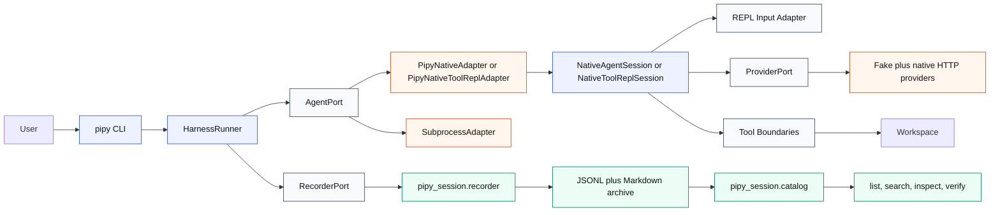
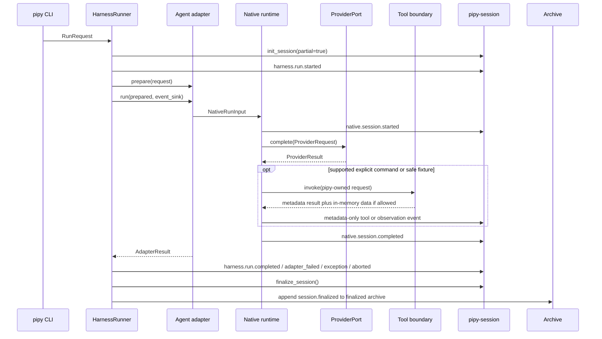
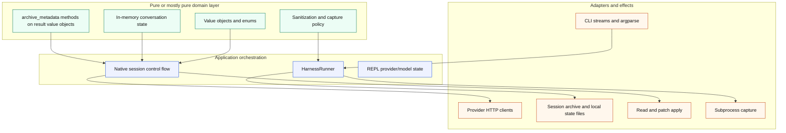

# Pipy Architecture

Status: describes the current codebase after the native shell, proposal,
apply, startup chrome, and input-adapter slices.

This page describes the current runtime. The ordered plan for moving from the
current large session/provider/UI modules to explicit agent, coding-session,
event, UI, and provider boundaries is the
[Architecture Migration Plan](architecture-migration.md).

Pipy is split into two Python packages:

- `pipy_harness`: the product-facing harness, native runtime, providers, tools,
  and CLI.
- `pipy_session`: the durable session recorder, archive catalog, search,
  inspection, verification, and conservative capture helpers.

The product direction is `pipy-native`. Subprocess wrapping of Codex, Claude,
Pi, or arbitrary commands exists for conservative lifecycle capture and smoke
testing, but those tools are not the main runtime path.

## System View


```mermaid
flowchart LR
  User[User] --> CLI[pipy CLI]
  CLI --> Runner[HarnessRunner]
  Runner --> AgentPort[AgentPort]
  AgentPort --> NativeAdapter[PipyNativeAdapter or PipyNativeToolReplAdapter]
  AgentPort --> SubprocessAdapter[SubprocessAdapter]
  NativeAdapter --> NativeSession[NativeAgentSession or NativeToolReplSession]
  NativeSession --> InputAdapter[REPL Input Adapter]
  NativeSession --> ProviderPort[ProviderPort]
  NativeSession --> ToolBoundaries[Tool Boundaries]
  ProviderPort --> Providers[Fake plus native HTTP providers]
  ToolBoundaries --> Workspace[Workspace]
  Runner --> RecorderPort[RecorderPort]
  RecorderPort --> SessionRecorder[pipy_session.recorder]
  SessionRecorder --> Archive[JSONL plus Markdown archive]
  Archive --> Catalog[pipy_session.catalog]
  Catalog --> ReaderCommands[list, search, inspect, verify]

  classDef core fill:#eef2ff,stroke:#1d4ed8,color:#111111;
  classDef adapter fill:#fff7ed,stroke:#c2410c,color:#111111;
  classDef store fill:#ecfdf5,stroke:#047857,color:#111111;
  classDef boundary fill:#f8fafc,stroke:#334155,color:#111111;
  class CLI,Runner,NativeSession core;
  class AgentPort,InputAdapter,ProviderPort,RecorderPort,ToolBoundaries boundary;
  class NativeAdapter,SubprocessAdapter,Providers adapter;
  class SessionRecorder,Archive,Catalog,ReaderCommands store;
```

The important ownership rule is simple: `HarnessRunner` owns the run lifecycle
and the pipy session record. Adapters and native sessions report safe events
through an `EventSink`; they do not mutate finalized records directly.
One-shot native runs go through `PipyNativeAdapter` and `NativeAgentSession`;
interactive REPL runs go through `PipyNativeToolReplAdapter` and
`NativeToolReplSession`, the single model-driven tool-loop product session.

## Runtime Flow


```mermaid
sequenceDiagram
  participant CLI as pipy CLI
  participant Runner as HarnessRunner
  participant Adapter as Agent adapter
  participant Runtime as Native runtime
  participant Provider as ProviderPort
  participant Tool as Tool boundary
  participant Recorder as pipy-session
  participant Archive as Archive

  CLI->>Runner: RunRequest
  Runner->>Recorder: init_session(partial=true)
  Runner->>Recorder: harness.run.started
  Runner->>Adapter: prepare(request)
  Runner->>Adapter: run(prepared, event_sink)
  Adapter->>Runtime: NativeRunInput
  Runtime->>Recorder: native.session.started
  Runtime->>Provider: complete(ProviderRequest)
  Provider-->>Runtime: ProviderResult
  opt supported explicit command or safe fixture
    Runtime->>Tool: invoke(pipy-owned request)
    Tool-->>Runtime: metadata result plus in-memory data if allowed
    Runtime->>Recorder: metadata-only tool or observation event
  end
  Runtime->>Recorder: native.session.completed
  Adapter-->>Runner: AdapterResult
  Runner->>Recorder: harness.run.completed / adapter_failed / exception / aborted
  Runner->>Recorder: finalize_session()
  Runner->>Archive: append session.finalized to finalized archive
```

This diagram compresses the native event stream. See
[Harness Spec](harness-spec.md) for the detailed harness, provider, tool,
proposal, apply, and session event vocabulary.

The following exclusion rule applies only to the metadata-only `pipy-session`
workflow archive: its recorder JSONL, derived Markdown summaries, and catalog
list/search/inspect/verify output exclude provider text, prompts, raw HTTP
payloads, raw tool results, diffs, file contents, stdout, stderr, command
output, auth material, secrets, credentials, tokens, private keys, and
sensitive personal data by default. It does not describe the separate private
native product session tree, which intentionally stores full-content
conversation JSONL, or the JSON/RPC/SDK agent transports, which carry
full-content payloads through their explicit product boundaries.

## Codebase Map

| Area | Main files | Responsibility |
| --- | --- | --- |
| CLI | `src/pipy_harness/cli.py` | Parse `pipy`, `pipy run`, `pipy repl`, and auth commands; select adapters and providers; preserve stdout/stderr contracts. |
| Harness core | `src/pipy_harness/models.py`, `src/pipy_harness/runner.py` | Define `RunRequest`, `PreparedRun`, `AdapterResult`, `RunResult`, `HarnessStatus`, recorder port, event sink, lifecycle events, and finalization. |
| Adapter port | `src/pipy_harness/adapters/base.py` | Stable `AgentPort` and `EventSink` protocols. |
| Native adapters | `src/pipy_harness/adapters/native.py` | Bridge the harness port to one-shot native sessions (`PipyNativeAdapter`) and the bounded model-driven tool-loop product REPL (`PipyNativeToolReplAdapter`). |
| Subprocess adapter | `src/pipy_harness/adapters/subprocess.py` | Run arbitrary child processes for conservative lifecycle capture. |
| Capture policy | `src/pipy_harness/capture.py` | Sanitization, workspace basename plus hash, argv redaction, and optional changed-path capture. |
| Native sessions | `src/pipy_harness/native/session.py` | One-shot native control flow and provider turns. Its public stream/result callbacks are synchronous projections of canonical agent events; metadata-only runtime events remain separately allowlisted. |
| Shared harness status | `src/pipy_harness/status.py` | Dependency-neutral canonical `HarnessStatus` vocabulary shared by public harness models and native provider results. Keeping the enum outside capture/archive-owning models lets headless native contracts import it without loading metadata-session infrastructure; existing SDK/model exports retain the same runtime enum object. |
| Canonical agent contracts | `src/pipy_harness/native/agent/` | Immutable provider-neutral messages, full-content event vocabulary, normalized usage/failure/run results, and the synchronous `AgentEventSink` port. The package has no UI, automation, extension, provider-transport, persistence, runner, or archive dependency. |
| Reusable tool executor | `src/pipy_harness/native/agent/tools.py` | UI-free synchronous execution of one canonical tool call: lookup, JSON/schema validation, pipy request identity, invocation, live `ToolContext` updates, normalized results, malformed/error mapping, and closed settled/operator-abort/local-command interruption signaling. Callers schedule one call at a time and inject wait policy through a port; an uncooperative cancelled worker may outlive the bounded join, with new output admissions closed and any already admitted callback still bound to its original turn and call. |
| Canonical tool-capability port | `src/pipy_harness/native/agent/tools.py` | Runtime-checkable `AgentToolCapabilities` protocol for detached definition tuples, synchronous sequential execution, and canonical policy-error results. It owns no registry construction, filtering, extension activation, workspace context, UI, provider, persistence, capture, or archive policy and is not eagerly exported from `native.agent`. |
| Product tool-capability facade | `src/pipy_harness/native/tool_capabilities.py` | `NativeToolCapabilities` composes injected built-in and extension `ToolPort` registries, frozen `ToolFilterOptions`, active-name selection, extension-registry replacement, workspace `ToolContext`, and the reusable `ToolExecutor`. The facade implements the canonical protocol structurally without importing or constructing concrete tools and is not a native-root export. |
| Canonical provider-request snapshot | `src/pipy_harness/native/agent/request.py` | Exact frozen binding between one `ProviderRequest` and its ordered advertised tool names. Serial transforms can only intersect the current detached definitions; the snapshot authorizes returned calls for that response and owns no extension dispatch, UI, persistence, provider construction, capture, or archive projection. It is not eagerly exported from `native.agent`. |
| Canonical active input | `src/pipy_harness/native/agent/active_input.py` | Immutable identity binding between one accepted user message and its detached request-only context. It projects the overlay after the exact anchor for every provider iteration, rewrites only that anchor after prompt hooks, and derives compaction-safe run-result messages without adding the overlay to canonical history. It imports no product session, extension, automation/archive, UI, provider, or concrete tool code and is not eagerly exported from `native.agent`. |
| Product provider-request adapter | `src/pipy_harness/native/agent_request.py` | Builds one product request from injected provider/model/cwd/prompt/history/tool/image/header inputs, dispatches `before_provider_request` hooks serially, asks the active-input binding for the exact transformed request-message tuple, and delegates exact monotonic authorization snapshots to the canonical layer. It imports no concrete provider/tool, automation, capture/archive, product-session persistence, or terminal implementation and is not a native-root export. |
| Canonical agent-loop policy | `src/pipy_harness/native/agent/loop_policy.py` | Immutable provider-request input, tool-policy state/transitions, the named 200-call maximum consumed by product validation, and provider-status normalization for the reusable loop. Budget exhaustion precedes request authorization, authorization precedes product preflight, blocked and unauthorized calls consume one turn slot, malformed streaks remain session-wide, valid settlements reset the streak, and provider failures retain zero-retry behavior. Budget exhaustion remains a normal error tool result rather than a terminal outcome. Deep snapshot validation occurs at construction/adapter/provider projection boundaries rather than once per returned tool call. The layer imports no extension, terminal/UI, persistence/session, automation/archive, concrete provider, or concrete tool implementation and is not eagerly exported. |
| Product agent-loop policy adapters | `src/pipy_harness/native/agent_loop_policy.py` | Synchronous callback adapters bind canonical request and tool ports to product-owned request construction and extension hooks. The canonical input explicitly detaches and recursively freezes shallow `ProviderRequest` tool schemas and rejects wrong canonical/scalar/subclass substitutions. A distinct provider-bound projection rematerializes fresh ordinary JSON containers before every built-in or extension provider invocation while the immutable snapshot remains authoritative for authorization. Tool postflight may replace only full-content result text, preserving identities, error status, and added-tool metadata. Callback failures propagate before later loop work. |
| Canonical single-run agent loop | `src/pipy_harness/native/agent/loop.py` | UI-free synchronous ownership of one already accepted prompt from `AgentRunStarted` through `AgentRunCompleted`: provider/tool iterations, assistant assembly, exact event/effect/usage ordering, budget/authorization/preflight/postflight sequencing, sequential tool execution and updates, malformed-fatal settlement, provider/tool cancellation, the existing `tool_budget + 2` guard, and the typed final result/history/tool state. Product callbacks inject request preparation/compaction results, a freshly bound provider turn, status-side rendering/diagnostics, exact tool-policy-state mirror updates (including a final update before `AgentRunCompleted`), and optional tool wait policy. After `AgentRunCompleted`, a non-terminating run polls the controller-owned queued-input port exactly once and returns the selected whole DTO without starting it internally. The loop runs with fake ports and imports no terminal/UI, extension runtime, automation/archive, persistence/session, concrete provider/tool, provider construction, or product adapter; it is not eagerly exported. Queue storage and RPC reservation/settlement remain controller-owned. |
| Provider-turn executor | `src/pipy_harness/native/agent/provider_turn.py` | UI-free synchronous execution of one provider completion. It publishes text/reasoning deltas as canonical events and owns the optional worker, `CancelToken`, exact cancellation/completion ordering, bounded cleanup, late-delta admission gate, and typed result-or-cancellation outcome. The canonical `AgentLoop` invokes it through a product adapter that materializes the immutable request and binds terminal or external-abort wait policy freshly for each provider iteration. The module imports only provider/cancellation ports, native value objects, and canonical agent contracts and is not eagerly re-exported by `native.agent`. |
| Canonical agent usage accounting | `src/pipy_harness/native/agent/usage.py` | Provider-neutral cumulative token accounting, last-turn context totals, OpenAI-subset versus Anthropic/Bedrock-separate cache classification, immutable canonical `AgentUsage` snapshots, and optional cost calculation from an injected, runtime-validated `AgentTokenPricing`. Provider/model pricing lookup stays in the product composition layer; the usage module imports no UI, session, capture/archive, concrete provider, or pricing-catalog implementation and is not eagerly re-exported by `native.agent`. |
| Canonical agent runtime ports | `src/pipy_harness/native/agent/runtime_ports.py` | Closed synchronous seams for append-message run effects, normalized provider-usage publications, and controller-selected steering/follow-up input. The queue port takes at most one already eligible full-content product value whose content and closed kind remain one atomic DTO; it owns no queue storage, priority, reservation, idle, settlement, or lifecycle policy. The module has no UI, automation, extension, persistence, provider-transport, capture, or archive dependency and is not eagerly re-exported by `native.agent`. |
| Product agent-runtime adapters | `src/pipy_harness/native/agent_runtime.py` | Late-bound callback adapters apply canonical run effects, update current session usage before canonical publication, and expose one controller-owned queue selection. They preserve synchronous failure propagation while leaving durable write ownership in the product until Phase 3.3 and RPC settlement at its serialized boundary. |
| Coding-session input policy | `src/pipy_harness/native/coding/input_queue.py` | Headless synchronous product policy for local-command precedence, retained ordinary lines and FIFO post-run handoffs, ordered injected queue sources, positional seeds, extension steering/follow-up/trigger queues, and one-shot request-only next-turn context. A command discovered during a registered blocking wake wins without losing or reordering the already-read line or a newer mismatching DTO; a command-triggered provider run appends any new handoff behind older retained handoffs. The module exposes the narrow queue port consumed by the reusable agent loop, preserves exact full-content typed identities, and owns neither terminal/RPC storage, lifecycle settlement, extension implementation, persistence, rendering, provider construction, nor concrete tools. Static and fresh-process gates prohibit back-imports into the old composition monolith or those implementation layers. |
| Coding-session state | `src/pipy_harness/native/coding/state.py` | Headless synchronous owner of the active provider port and explicit provider/model labels, canonical live message history, cumulative usage and result counters, compaction prompt suffix/metrics, and unresolved provider-failure metadata. Named transitions preserve exact canonical message identity, atomically rebind provider context, and distinguish same-context port refresh from session-tree history rebuild. Provider selection/construction, pricing lookup, persistence callbacks and writes, commands, rendering, extensions, RPC settlement, and `AgentLoop` invocation remain injected composition concerns. The state module is direct-import only and has stricter static, recursive, and fresh-process dependency gates than the broader future controller package. |
| Product-session coordination | `src/pipy_harness/native/coding/product_session.py` | Headless synchronous coordinator for exact full-content active-history loads, canonical message appends, and compaction transitions. Append and compaction update `CodingSessionState` before invoking typed durable callbacks; failures and invalid asynchronous/non-`None` callback returns propagate with the characterized live-state timing. Switch rebuild validates one immutable context before replacing live history. Concrete native-tree/filesystem ownership, summary formatting, and event-subscriber relocation remain in composition until Phase 3.3. The direct-import-only module has exact static, recursive, fresh-process, and no-eager-export gates and no UI, extension, automation/RPC, concrete persistence, provider/tool, capture, SDK, or metadata-archive dependency. |
| Coding-command outcomes | `src/pipy_harness/native/coding/commands.py` | Direct-import-only headless classifier and exact frozen/slotted outcome vocabulary for imperative coding-session commands. Phase 3.1d.1 owns blank, exit/quit, hotkeys, changelog, copy, and session-status classification; Phase 3.1d.2a adds compact and session-name actions; Phase 3.1d.2b adds model, scoped-model, login, and logout actions with exact full-content arguments and a distinct usage-aware footer policy; Phase 3.1d.3a-b adds exact new-session and full-content session-tree actions. Composition interprets the closed outcomes through existing dynamic render, provider/auth/settings/UI, private-session, and persistence adapters. Every other value falls through to the single remaining imperative precedence skeleton. Non-empty queued/RPC content bypasses classification, while classified whitespace retains the prior unconditional blank outcome. It contains no registry metadata, UI/terminal, persistence, provider/tool, settings/resources, extension, automation, SDK, capture, or archive implementation and is not eagerly exported. |
| Canonical agent-history compaction | `src/pipy_harness/native/agent/history.py` | Pure mechanical reduction of canonical `AgentMessage` sequences at user-group boundaries. It returns immutable retained history plus structural counters from caller-injected limits, with no summary formatting, policy, provider, UI, persistence, capture, or archive dependency. It is not eagerly re-exported by `native.agent`. |
| Agent-event projections | `src/pipy_harness/native/agent_adapters.py`, `src/pipy_harness/native/automation/agent_events.py` | Fixed-order synchronous rendering, product-session, SDK, metadata-only workflow, and Pi-shaped automation projections. Rendering owns provider text/reasoning deltas, buffered assistant messages, and tool start/update/result output; automation owns cumulative text partials, malformed tool arguments, camelCase fields, and public provider correlation ids. RPC retains queue and true-idle settlement ownership. |
| Tool-loop session | `src/pipy_harness/native/tool_loop_session.py` | Bounded model-driven REPL and current composition root: accepted-input preparation, remaining imperative commands/resources, terminal/RPC source adaptation, rendering and extension ordering, diagnostics, provider/model pricing lookup, compaction policy/summary formatting, concrete registry construction, and actual durable writes. It delegates queue storage/priority and the active-loop queue port to `native.coding.input_queue`, live provider/message/counter/usage/compaction/failure transitions to `native.coding.state`, typed state-first append/load/compaction timing to `native.coding.product_session`, and closed state-free/compact/name/provider-control/new-session/session-tree command classifications to `native.coding.commands`; it composes one accepted prompt through the canonical `AgentLoop` request, fresh provider-turn, status, event/effect, usage, and tool-policy adapters. Dynamic command effects—including the shared compaction adapter, concrete name writes, provider/auth/settings selection, private-tree creation/rebuild/navigation, tree selectors/summaries, and live usage rebinding—and the residual precedence skeleton stay here while Phase 3.1d proceeds; the declarative registry remains Phase 3.2. Concrete native-tree callbacks and filesystem ownership stay here until Phase 3.3. The serialized RPC boundary retains reservation, idle transitions, and `agent_settled`. Request-only `deliverAs=nextTurn` context never enters canonical history. The native session tree is the full-content record; there is no transcript sidecar. |
| Tool-loop terminal UI | `src/pipy_harness/native/tui.py` | Pipy-owned inline-scrollback TTY shell for the bounded tool-loop REPL. It never enters the alternate screen: finalized startup, user, assistant, reasoning, tool, and notice blocks commit into the terminal's normal buffer while the bounded live stream tail, input/editor, slash/menu overlays, and footer/status repaint in a bottom-pinned live region. Captured streams keep the deterministic line-rendering fallback. |
| Terminal-screen verifier | `src/pipy_harness/native/terminal_screen.py` | Stdlib ANSI screen-cell model used by TUI tests and tmux verification artifacts. Replays terminal output into viewport rows, columns, cursor position, scroll state, visible-string findings, reverse/cell attributes, and screen anomaly reports. |
| Terminal comparison verifier | `src/pipy_harness/native/terminal_compare.py` | Compares pipy and Pi screen metrics from controlled tmux captures, writing row/column and cell-attribute deltas plus anomalies for prompt, expected output, footer/status, input row, live cursor, and drawn cursor positions. |
| Native value objects | `src/pipy_harness/native/models.py` | Provider, tool, read, proposal, apply, verification, output, and `ProviderToolCall` value objects; `ProviderRequest.messages`/`available_tools`/`attachments` (current-turn image blocks); closed labels and storage booleans. |
| Conversation state | `src/pipy_harness/native/conversation.py` | In-memory conversation identity, bounded turns, and metadata-only turn payloads. |
| Provider registry | `src/pipy_harness/native/provider_registry.py` | Product provider/model registry: supported ids, default models, local/credential availability probes, one-shot model-default policy, auto-default eligibility, and conservative tool-call capability flags. |
| REPL state | `src/pipy_harness/native/repl_state.py` | Provider/model selection, non-secret defaults, and registry-backed local availability checks. |
| Provider port | `src/pipy_harness/native/provider.py` | `ProviderPort.complete()` protocol plus the `supports_tool_calls` capability flag. |
| Shared provider helpers | `src/pipy_harness/native/_provider_helpers.py`, `deferred_tools.py` | Shared HTTP/result/tool serializers plus the provider-neutral durable dynamic-tool split and Pi-compatible deterministic hash used by Anthropic and both OpenAI Responses adapters. |
| Providers | `src/pipy_harness/native/fake.py`, `ds4_provider.py`, `openai_provider.py`, `openai_completions_provider.py`, `openai_codex_provider.py`, `openrouter_provider.py`, `anthropic_provider.py`, `google_provider.py`, `google_vertex_provider.py`, `mistral_provider.py`, `bedrock_provider.py`, `azure_openai_provider.py`, `cloudflare_provider.py` | Deterministic fake provider plus stdlib HTTP adapters for twelve real providers. Tool-capable adapters advertise `supports_tool_calls=True`; supported Anthropic/OpenAI Responses models also place dynamically activated tool definitions at their durable result load point. |
| Archive-safe tool port | `src/pipy_harness/native/tool.py` | Minimal `ToolPort` invocation protocol for the native runtime bootstrap. |
| Model-driven tool contracts | `src/pipy_harness/native/tools/base.py`, `src/pipy_harness/native/tools/__init__.py`, `src/pipy_harness/native/agent/messages.py`, `src/pipy_harness/native/agent/tools.py` | `ToolDefinition`, `ToolRequest`, `ToolExecutionResult`, `ToolArgumentError`, `ToolContext`, `ToolPort`, manual JSON-schema-subset `validate_arguments`, recursive schema materialization for provider wire payloads, the canonical message envelope, and the reusable normalized executor outcome. The `native.tools` initializer is contract-only; it does not load or export concrete filesystem tools. |
| Model-driven tools | `src/pipy_harness/native/tools/read.py`, `ls.py`, `grep.py`, `find.py`, `write.py`, `edit.py`, `edit_diff.py`, `truncate.py`, `bash.py` | Production registry tools for the bounded tool-loop. Filesystem tools reuse `_validate_workspace_relative_path`, `_is_ignored_or_generated`, `_is_relative_to`, and `_resolved_relative_label` from `read_only_tool.py` for `.git`/symlink default-deny, and stat-gate oversized file reads before loading content. `truncate` is pure transformation only. `bash` is a real shell matching Pi: it runs `bash -c <command>` in the workspace with the inherited environment, streams combined stdout/stderr to the live UI when available, returns bounded combined output to the model, and kills the process group on timeout. The archive records only safe counters and labels, never the raw command or output. |
| Usage normalization | `src/pipy_harness/native/usage.py` | Normalizes provider token counters to the safe allowlisted metadata keys. |
| Read boundary | `src/pipy_harness/native/read_only_tool.py` | Bounded explicit file excerpt reads with workspace-relative validation, metadata-only archive output, and the `_resolved_relative_label` helper used by every model-driven tool. Backs `@path` references and the model-driven `read` tool. |
| Runtime resources | `src/pipy_harness/native/_resource_files.py`, `skills.py`, `prompt_templates.py`, `custom_commands.py`, `resources.py` | Workspace + global `.pipy/{skills,templates,commands}/*.md` discovery (frontmatter parse, byte caps, symlink/secret-shaped/binary/ignored safety screen) and the `WorkspaceResources` registry + pure `dispatch_resource_command` consumed by the product REPL for `/skill`, each prompt template's own `/<template-name>` command, and custom `/<name>` slash commands. Workspace defaults are fail-closed; product callers opt in only after trust resolution, and direct conformance fixtures must declare trusted-workspace intent explicitly. Only safe per-resource metadata (path label, sha256, byte length, truncated, name, kind) is archived; bodies/expansions stay provider-visible only. |
| Chrome + themes | `src/pipy_harness/native/chrome.py`, `themes.py` | Shared Pi-parity terminal chrome (startup banner, separators, two-row status block) rendered through `ChromeStyle`, which holds a `ChromePalette`. `themes.py` is the palette registry (`pi`/`high-contrast`/`ocean`), `NativeThemeStore` persistence, and `resolve_active_theme_name` (env `PIPY_THEME` > store > default). The Theme row in the `/settings` dialog swaps the active palette; `chrome_style_for` decides color enablement (NO_COLOR / non-TTY → plain) before any palette is consulted, so a theme never overrides the no-color contract. |
| User-directed @-context | `src/pipy_harness/native/file_references.py`, `image_attachment.py` | Resolve `@path` text excerpts and `@image:<path>` image attachments from a genuine prompt, reusing the `read` tool's path policy. `file_references` appends bounded UTF-8 excerpts to the provider prompt; `image_attachment` loads bounded, magic-byte-validated (PNG/JPEG/GIF/WebP) images onto `ProviderRequest.attachments`, which multimodal adapters render as native image blocks. Both fail closed and archive only safe metadata (counts; for images, media type / byte count / sha256) — never file contents or raw image bytes. |
| Patch apply boundary | `src/pipy_harness/native/patch_apply.py` | One approved, human-reviewed, bounded workspace mutation request. |
| Legacy verification boundary | `src/pipy_harness/native/verification.py` | Retained legacy allowlisted `just-check` helper; no longer wired as a user-facing REPL slash command. |
| Session resume (archive) | `src/pipy_harness/native/session_resume.py` | Metadata-only finalized-record reader and safe resume system-block composer over the `pipy-session` archive. Not the product session source. |
| Native product session tree | `src/pipy_harness/native/session_tree.py` | The product session source of truth: append-only JSONL conversation tree (`NativeSessionTree`), entry value objects, parse/write, leaf pointer, `get_branch`/`get_tree`/`build_context`, `fork_from`, `continue_recent`, under `~/.local/state/pipy/native-sessions/--<encoded-cwd>--/`. |
| Session-tree commands | `src/pipy_harness/native/session_tree_commands.py` | Loop-/TTY-independent `/tree` selection semantics, filters, rendering, status, entry/session reference resolution, and `resolve_startup_session` (Pi `-c`/`-r`/`--session`/`--fork`/`--no-session`). |
| Session recorder | `src/pipy_session/recorder.py` | Active `.in-progress/pipy` JSONL records, finalized `pipy/YYYY/MM` records, immutable finalization, and Markdown summaries (metadata archive, not the product session source). |
| Session catalog | `src/pipy_session/catalog.py` | Read-only list, search, inspect, and verify surfaces over finalized records. |
| Automatic capture | `src/pipy_session/auto_capture.py` | Conservative adapter helpers for wrapper and hook-based partial capture (Claude hook + generic `wrap`). |

## Isolation Model

Pipy uses explicit ports and value objects instead of letting provider adapters,
tool code, and archive code freely call each other.


```mermaid
flowchart TB
  subgraph Pure[Pure or mostly pure domain layer]
    Models[Value objects and enums]
    Conversation[In-memory conversation state]
    Capture[Sanitization and capture policy]
    ArchiveMetadata[archive_metadata methods on result value objects]
  end

  subgraph Orchestration[Application orchestration]
    Runner[HarnessRunner]
    NativeSession[Native session control flow]
    ReplState[REPL provider/model state]
  end

  subgraph Adapters[Adapters and effects]
    CLI[CLI streams and argparse]
    HTTP[Provider HTTP clients]
    FileIO[Session archive and local state files]
    WorkspaceIO[Read and patch apply]
    ProcessIO[Subprocess capture]
  end

  Models --> NativeSession
  Conversation --> NativeSession
  Capture --> Runner
  ArchiveMetadata --> NativeSession
  Runner --> FileIO
  NativeSession --> HTTP
  NativeSession --> WorkspaceIO
  CLI --> Runner
  Runner --> ProcessIO

  classDef pure fill:#ecfdf5,stroke:#047857,color:#111111;
  classDef orchestration fill:#eef2ff,stroke:#1d4ed8,color:#111111;
  classDef effects fill:#fff7ed,stroke:#c2410c,color:#111111;
  class Models,Conversation,Capture,ArchiveMetadata pure;
  class Runner,NativeSession,ReplState orchestration;
  class CLI,HTTP,FileIO,WorkspaceIO,ProcessIO effects;
```

The pure side is not perfectly effect-free because this is still a small Python
codebase, but the dependency direction is deliberate:

- Domain value objects validate closed labels, limits, storage booleans, and
  request authority.
- Provider adapters return `ProviderResult`; they do not write session records.
- Workspace tools return metadata-only result objects; raw excerpt text can
  exist only in memory where the command explicitly needs it.
- Archive-facing allowlists are exposed as `archive_metadata()` methods on
  result value objects, not as a separate archive-metadata module.
- The runner assigns event metadata and calls the recorder.
- The catalog is read-only and works only over finalized archive records.

## Data And Privacy Boundaries

Pipy has three data classes:

- In-memory runtime data: provider prompts, model final text, bounded excerpts,
  proposal drafts, and command input may exist transiently during a run.
- Metadata archive data: JSONL and Markdown keep statuses, safe labels,
  counters, durations, booleans, hashes, and summaries.
- Native or external data: Pi, Codex, Claude, provider, and shell transcript
  stores remain external unless pipy records a metadata-only reference.

The archive is intentionally metadata-first. The headless automation surfaces
(`--mode json`, `--mode rpc`, `--print`) are separate full-content transports
and are not metadata archive channels (see `docs/automation-rpc.md`).

## Testing And Verification

The test suite mirrors these boundaries:

- `tests/test_harness_*` covers CLI, runner, subprocess, and native CLI
  behavior.
- `tests/test_native_*` covers providers, session flow, conversation state,
  read-only tools, patch apply, approval helper behavior, usage
  normalization, and privacy assertions.
- `tests/test_recorder.py`, `tests/test_catalog.py`, and
  `tests/test_auto_capture.py` cover session storage and catalog behavior.
- `tests/test_architecture_mode_contracts.py`,
  `tests/test_architecture_archive_sdk_contracts.py`, and
  `tests/test_architecture_import_boundaries.py` freeze cross-mode event order,
  SDK/archive privacy separation, and the dependency rules that activate as the
  migration's agent/coding/UI/provider/extension layers appear.

Use:

```sh
just check
just test-pty-smoke
just docs-build
```

`just check` verifies Python linting, types, and tests. `just docs-build`
verifies that the Zensical documentation site can render. Checked-in CI runs
lint/types/docs on Python 3.14, the full suite on Python 3.11 and 3.14, and the
bounded real-PTY smoke recipe on Linux and macOS. Ruff formatting is not yet a
gate because the pre-existing tree is not format-clean; enabling it requires a
separate mechanical normalization slice.
