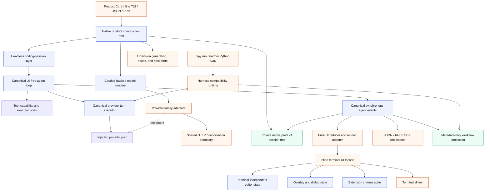

# Pipy Architecture

Status: living overview of the current native coding-agent product.

Pipy is a Python coding-agent application. Its primary path is the native
interactive product (`pipy` / `pipy repl`), not a wrapper around another agent
CLI. `pipy_harness` owns the agent runtime, providers, tools, private product
sessions, automation modes, extensions, and terminal UI. `pipy_session` is a
separate metadata-only workflow archive and catalog.

The Phase 0–7 [Architecture Migration](architecture-migration.md) and reviewed
[Architecture Quality Improvement Program](specs/2026-07-24-architecture-quality-improvement-plan.md)
are completed/reconciled historical evidence.

The final integration ledger is closed/reconciled at reviewed endpoint
`87c6f887f4afb719da89e68074551e9b8786ac1d`: 13 program/integration commits
since `fe474e0e55b3d1e8ae370534acb54a0a5fd9496b`, with 298 changed paths. The
exhaustive A-G partition union exactly covers all 298 changed paths:

- A: 29/29, 220,750 bytes/5,384 lines, valid complete CLEAN.
- B: 22/22, 359,459 bytes/8,776 lines, valid complete CLEAN.
- C: 14/14, 111,705 bytes/2,418 lines, valid complete CLEAN.
- D: 103/103, 410,314 bytes/9,494 lines, valid complete CLEAN.
- E: 150/150, 406,331 bytes/9,333 lines, valid complete CLEAN.
- Refreshed F: 19/19, 139,365 bytes/1,892 lines, valid complete CLEAN.
- G: 8/8, 36,717 bytes, valid complete CLEAN.

Slice 16 landed as `7deb8d8807f4e7eb52f7c9c8bd9e0ad30cb60727`
(`docs: close architecture quality program`). The three integration-fix commits
are the original Bundle F ledger fix
`ffeb86f0319efd28f6f360174ae640fa358761d0`
(`docs: reconcile architecture program ledger`), warning-state closure
`aea52b438713ce04fcad93ae32927ff156574aac`
(`docs: record integration warning closure`), and README/provider-catalog
closure `b64ceb7db9581bf3ebfab51f5803c513c1fdb549`
(`docs: align provider catalog status`). The prior valid complete exact-schema
cross-cutting review by Pi `openai-codex/gpt-5.6-sol` at committed endpoint
`b64ceb7` found the sole incomplete-ledger Warning: living ledgers omitted
refreshed F and `aea52b4`/`b64ceb7`. It found zero Critical or Suggestion
findings, omissions, forbidden tool uses, skips, truncations, or redactions.
Fresh exact-model Pi implementation fixed the ledger/test and metric
synchronization. A first focused review then found inaccurate
implementation/endpoint attribution and missing ratchets; those were corrected.
The final focused exact-schema G review covered 8/8 files and 36,717 bytes and
was valid CLEAN with no findings or coverage defects. That synchronization
landed as `87c6f887f4afb719da89e68074551e9b8786ac1d`
(`docs: sync final integration ledger`).

A fresh valid complete exact-schema cross-cutting re-review by Pi
`openai-codex/gpt-5.6-sol` at reviewed endpoint `87c6f88` covered A-G
manifests/reports, prior cross-cutting evidence, final ledger files, and
unchanged cross-contracts. The A-G manifest union exactly covers all 298 changed
paths. It returned `STATE: CLEAN`, `COVERAGE_COMPLETE: yes`,
`PARTITION_UNION_COMPLETE: yes`, and `VERDICT: CLEAN`, with zero Critical,
Warning, or Suggestion findings; `SCOPED_OMISSIONS: none`,
`FORBIDDEN_TOOL_USES: 0`, `SKIPPED_FILES: none`, `TRUNCATIONS: none`, and
`REDACTIONS: none`. Review stopped because the sole prior ledger Warning was
fixed and the fresh complete re-review was CLEAN; further review would add no
material value unless scope changes.

Latest stable verification for reviewed endpoint `87c6f88` is strict Mypy
across 169 source files, combined Mypy across 438 source/test files, and `just
check` at 4,829 passed / 2 skipped. Ruff formatting covers 480 files. Stable
metrics are 34 / 18 repository/source C901 findings, 81,738 / 121,191
source/test physical lines, 43 `ToolLoopTerminalUi` fields, one source ignore,
and 5,433 / 6,329 lines in `tool_loop_session.py` / `tui.py`. Docs are clean,
diff is clean, both theme sources are `pi`, and pre-commit is absent. Slice 14
stress evidence remains focused 20x, groups 10x, PTY smoke 5x, then the full
check; the latest PTY smoke is 8/8.

The architecture-quality program and final integration review are closed/reconciled. The explicit next
architecture boundary is bounded transactional-reload contract completion or
formal reconciliation before ordinary product-parity selection. The measured
disposition and current comparison are in the
[2026-07-29 architecture quality assessment](2026-07-29-architecture-quality-assessment.md);
the [Backlog](backlog.md) owns the exact pointer and next queue. The package
metadata's native coding-agent description matches this architecture and stays
unchanged; version/distribution identity, license/URLs, and wheel verification
remain release-triggered while the project is private.

## Runtime structure


```mermaid
flowchart TB
  Entrypoints[Product CLI / inline TUI / JSON / RPC] --> Composition[Native product composition root]
  CompatEntrypoints[pipy run / narrow Python SDK] --> Compat[Harness compatibility runtime]
  Composition --> Coding[Headless coding-session layer]
  Coding --> Agent[Canonical UI-free agent loop]
  Agent --> Tools[Tool capability and executor ports]
  Agent --> ProviderExecutor[Canonical provider-turn executor]
  Compat --> ProviderExecutor
  ProviderExecutor --> ProviderPort[Injected provider port]
  Composition --> Runtime[Catalog-backed model runtime]
  Runtime --> Providers[Provider-family adapters]
  Providers -. implement .-> ProviderPort
  Providers --> HTTP[Shared HTTP / cancellation boundary]
  Composition --> Extensions[Extension generation, hooks, and host ports]
  Composition --> ProductTree[Private native product session tree]
  Agent --> Events[Canonical synchronous agent events]
  Events --> UI[Pure UI reducer and render adapter]
  Events --> Automation[JSON / RPC / SDK projections]
  Events --> ProductTree
  Events --> Workflow[Metadata-only workflow projection]
  Compat --> Workflow
  UI --> TUI[Inline terminal UI facade]
  TUI --> Editor[Terminal-independent editor state]
  TUI --> Overlays[Overlay and dialog state]
  TUI --> ChromeState[Extension chrome state]
  TUI --> Driver[Terminal driver]

  classDef core fill:#eef2ff,stroke:#1d4ed8,color:#111111;
  classDef adapter fill:#fff7ed,stroke:#c2410c,color:#111111;
  classDef store fill:#ecfdf5,stroke:#047857,color:#111111;
  class Agent,Coding,Composition,Runtime,Events,ProviderExecutor,Editor,Overlays,ChromeState core;
  class Entrypoints,CompatEntrypoints,Compat,Providers,HTTP,Extensions,UI,TUI,Driver,Automation adapter;
  class ProductTree,Workflow store;
```

The core is synchronous. Provider and tool work may use owned workers so a TTY
or RPC caller can cancel or inject input, but no asyncio loop owns the product
lifecycle. Canonical events use synchronous push semantics: each mode's fixed
composite accepts its ordered projections before the producer advances.

## Canonical agent layer

`src/pipy_harness/native/agent/` is the reusable, provider-neutral core. It
owns immutable full-content messages and events, active-input identity,
request-local tool authorization, usage accounting, history reduction, one
provider-turn execution, one tool-call execution, and the single accepted-run
`AgentLoop`. The loop runs against fake provider/tool/event ports without a
terminal, product session, extension implementation, concrete transport, or
workflow archive.

Product adapters in `native/agent_request.py`, `agent_loop_policy.py`,
`agent_runtime.py`, `agent_adapters.py`, and `tool_capabilities.py` bind that
core to catalog selections, extension policy, current product state, concrete
tools, rendering, and persistence. These adapters are composition seams; the
canonical package does not import them back.

## Headless coding-session layer

`src/pipy_harness/native/coding/` owns product policy above a single agent run:

- `input_queue.py` owns command precedence and steering/follow-up/trigger
  ordering;
- `state.py` owns the active provider/model labels, canonical history, usage,
  counters, compaction state, and provider-failure state;
- `accepted_input.py` prepares one accepted prompt and request-only context;
- `agent_run.py` assembles and invokes the canonical loop;
- `commands.py` and `command_registry.py` own the closed command vocabulary,
  classification, metadata, and dispatch outcomes;
- `product_session.py` coordinates state-first private-session transitions; and
- `session_controller.py` owns input selection, command/resource/extension
  precedence, true-idle settlement, and the outer session lifecycle.

This package is headless: terminal rendering, extension implementation,
provider construction, concrete tools, filesystem persistence, automation, and
the metadata archive are injected or remain outside it.

## Product composition and one-shot runtime

`native/tool_loop_session.py` is the interactive product composition root. It
constructs settings and trust state, catalog-backed providers, tools,
extensions, the private session tree, event projections, automation or terminal
input, and the headless coding/agent collaborators. Dynamic command effects and
cross-boundary orchestration remain here. The session-owned built-in effects
(status, compact, name, new, tree, resume, fork, and clone) execute through one
frozen `_SessionCommandEffects` bundle composed from narrow run-scope ports;
provider/configuration built-ins (hotkeys, changelog, copy, settings, trust,
model and scoped-model selection, login, and logout) execute through a separate
frozen `_ProviderConfigurationCommandEffects` bundle. That executor composes
with `_ProviderMutationEffects`, which remains the single owner for live model
and authentication mutation ordering, while preserving live-terminal versus
captured-stream presentation. Native session export, import, and share execute
through `_TransferCommandEffects`; import replaces the live tree and then uses
the session collaborator's authoritative history/input rebuild seam. `/reload`
executes through `_ReloadCommandEffects`, whose explicit phases preserve the
publication gate around configuration/package/resource recomposition,
extension generation activation/publication, provider refresh, tool-capability
publication, and terminal refresh. Provider fallback and unavailable binding
remain methods on `_ProviderMutationEffects`, rather than a second reload-only
mutation path. `_BuiltinCommandInterpreter` now contains only the closed
four-family routing plus the closed footer policy.

`native/session.py` owns the explicitly named
`NativeHarnessCompatibilityRuntime` used only by `pipy run` and the narrow
Python harness SDK. Slice 10 renamed the former `NativeAgentSession` rather than
leaving two runtimes that appeared semantically equivalent. For every turn, the
compatibility runtime invokes the canonical
`native.agent.provider_turn.ProviderTurnExecutor`, whose delta-admission gate
and typed outcome contract surround the injected provider call. A thin private
adapter makes the final `ProviderPort.complete(...)` call while preserving the
compatibility surface's text-only initial stream and buffered follow-up shape.
The runtime derives one required `stream_text_deltas` capability beside the SDK
event projection and explicitly disables it for both follow-up paths; provider
deltas flow only through the canonical agent-event sink. The adapter is not a
second provider-execution pipeline.

The Slice 10 convergence decision is **intentional separation**, based on the
executable contracts in `tests/test_native_one_shot_runtime_contract.py` and the
terminal-lifecycle characterization in `tests/test_native_session.py`:

- independently observable providers run through real executor calls on both
  sides for an ordinary successful completion, with equivalent emitted text
  deltas, final text, and all six normalized usage counters;
- provider-metadata fixture intents are not canonical `ProviderToolCall`
  values: the compatibility runtime may run one bounded no-op or approved file
  excerpt, synthesize a metadata-only observation, make at most one special
  follow-up provider request, and optionally consume separately injected,
  human-reviewed patch/verification requests;
- the canonical `AgentLoop` instead authorizes advertised provider tool calls,
  maintains full canonical history, and continues provider/tool iterations
  under its tool policy; it correctly ignores compatibility metadata fixtures;
  and
- the compatibility runtime projects `ProviderRequest` construction/validation
  failures and exceptions raised by the injected provider into its established
  failed result, including genuine provider `ValueError` and `TypeError`
  exceptions. `ProviderTurnDeltaPolicy` construction, executor collaborator
  validation, and compatibility-adapter channel violations are programming
  invariants that instead escape loudly. It maps the
  executor's typed provider-cancellation outcome to the same failure/archive
  shape without exposing provider detail, emits
  `native.session/provider/tool/...` metadata lifecycle events, and excludes
  prompt/model/tool content from the workflow archive. The canonical product
  loop propagates through its product status policy and full-content
  event/session projections.

Routing the compatibility contract through `AgentLoop` would therefore change
provider request history, tool authorization, event order, failure handling,
and archive behavior rather than merely remove duplication. Its fixture-shaped
`native.tool.ToolPort`, patch apply, and verification boundaries do not match
canonical model-driven tool execution and are deliberately not adapted into
it. Product one-shot `--mode json` and `--print` already use
`PipyNativeToolReplAdapter` and the canonical coding/agent loop; they are not
served by this compatibility runtime.

`pipy_harness.runner.HarnessRunner` and the adapter ports continue to support
conservative subprocess lifecycle capture. Subprocess wrapping is a reference
and capture facility, not the product runtime direction.

## Providers and HTTP ownership

`native.repl_state.ModelRuntime` composes `catalog_state.py` with
`provider_construction.py`. It is the product owner for resolving a provider /
model specification, determining availability and thinking levels, and
constructing the selected provider. Built-in rows, `models.json`, stored auth,
and extension-registered providers join at the catalog/construction boundary;
provider selection code does not bypass it with a second factory.

Concrete HTTP adapters live by protocol family under `native/providers/`, with
shared wire translators for OpenAI Responses, Chat Completions, Anthropic
Messages, and Gemini `generateContent`. The specialized Codex streaming adapter
remains `native/openai_codex_provider.py`. `native/http.py` owns common JSON and
SSE execution, timeout/error normalization, cancellation, and retryable
transport classification. Provider adapters return normalized results and never
write sessions or import UI code.

## Extensions

Extension ownership is split deliberately:

- `extensions.py` discovers and inventories loadable local resources;
- `extension_loader.py` owns isolated module loading and awaitable driving;
- `extension_types.py` owns the stable typed API, contribution, hook, host-port,
  and UI value vocabulary;
- `extension_runtime.py` activates one validated batch and owns commands,
  shortcuts, tools, providers, flags, renderers, queues, and host contexts;
- `extension_hooks.py` owns serial lifecycle, input, request, tool, trust, bash,
  and session-gate dispatch; and
- `extension_ui.py` owns the deterministic headless UI bridge, while
  `tui.py` owns the concrete live extension UI driver and chrome rendering.

The stable `pipy_harness.extensions` module is a façade, not another behavior
owner. Its exact 97-name `__all__` inventory imports each value directly from
the module above that owns it (plus the provider construction/header seams),
so its public contract does not depend on whatever `extension_runtime.py`
happens to import for its own implementation. `extension_runtime.py` keeps the
already-characterized direct-import compatibility identities explicit for
internal consumers, including the headless UI bridge and render helpers; those
aliases still denote the authoritative owner objects.

Initial activation fails closed per extension. Trusted extension code may
perform its own external effects. Reload now rejects a candidate runtime and
parsed flags together and preserves the prior retained TUI chrome/listeners on
that rejection. Candidate chrome requests use a closed guarded sink and are
reconciled only after semantic acceptance, but the stronger claim that every
pipy-owned registry, projection, retained chrome value, and queue sidecar
publishes coherently is still outstanding. The controlling R0 decisions and per-clause evidence are in
the transactional spec's
[R0 current reconciliation](specs/2026-07-25-transactional-extension-reload-rebuild.md#r0-current-reconciliation-2026-07-30).

The live extension state is one generation reached through
`native/session_generation.py`. `SessionGenerationRef` owns the generation
pointer, its identity, and the session's single mutex; `_RunControlState`
reaches the generation only through that reference. `/reload` parses the
candidate's flags before anything becomes live, so a malformed flag rejects the
runtime-plus-flags candidate rather than pairing new commands with old flags.
Settings, keybindings, package roots, and workspace resources that reload
successfully stay applied when that extension candidate rejects. R0 formally
retains that sequential configuration-refresh behavior: manager values stay
independently immutable/locked and run-control resources are not fields of the
extension generation. RPC's main dispatcher has no settings/keybinding/resource
reference; its session worker runs the same serial loop. The provider-header
worker currently reads only the run-local `project_trusted` scalar through the
manager, and R4a must capture that scalar with the request snapshot. External
callers may retain an injected manager, so the narrowing relies on manager-local
synchronization, not on claiming that no external manager surface exists. R3
therefore builds no settings/resource projection and R4a consumes none.

`SessionExtensionGeneration` does not yet freeze tool capability, renderer,
emitter/lifecycle, provider, menu, retained chrome, or queue-sidecar
projections; those publish or drain separately. Production consumers still read
`generation_ref.current` per access even though `snapshot()` exists. R1 now
owns activation registration with one candidate-host guard over every staged
registry/message, flag value/failure, `_activated`, and the one-way candidate
open→sealed→committed→published/disposed transitions plus the accepted-catalog
terminal transition and host-internal publication marker. Host-internal
lifecycle methods take one atomic frozen contribution snapshot; live
`_activated` state remains guarded on the host rather than duplicated there.
Batch publication takes every host guard, validates the complete set,
and only then applies each host-authored transition, so an open/unsealed sibling
refuses the whole set without making any host live. The guarded host lifecycle
is the sole ownership state machine: the prior wrapper state/lock and publish/
dispose forwarding helpers are gone. Before a reload runtime exists, one
session-thread-owned optional holder is sufficient; it either clears itself
after publication or disposes through the bounded loader/composition seam after
any publication-gate mutex handoff. Cleanup returns structured disposed,
skipped-published, and inaccessible counts, and every ownership boundary routes
anomalies through the single activation-cleanup reporter instead of `warnings`
or runtime-owned raw stderr. Production startup/reload use their existing sinks;
the provider-only catalog helper requires a caller sink, detaches immutable
provider/unregistration outputs, and then terminally finalizes accepted hosts.
A host that refuses that transition is disposed fail-closed while its acquired
guard is held; a published host is instead recorded and left live, and an
inaccessible/failing guard is reported separately. That terminal state clears
all registries, messages, outbox references, and live-send or publication
ability, but retains guarded registration-time default flag values because the
catalog helper does not parse/apply CLI tokens and detached provider factories
commonly capture `api.get_flag(...)`; rejected/abandoned
hosts still dispose and clear flags. Recursive inventory covers activation
producers, cleanup/finalization-reporting seams, and each production startup/
reload caller; pending pre-trust batches finalize or
abandon their one-shot host holders. Reload builds
the exact `SessionExtensionGeneration` first, then ownership transfer is followed
only by the generation reference's non-fallible pointer publication; later
projection failures therefore leave the published host on the installed live
generation rather than orphaning it. Startup likewise constructs its generation
reference before transferring host ownership. Retained late
class-D `register_*`, `unregister_provider`, and direct/decorator `on` calls
raise `ExtensionCapabilityError`; accepted `str` subclasses (including
`StrEnum`, default-stringifying `(str, Enum)` values, and subclasses overriding
`__str__`) are detached from the underlying value to exact plain strings without
invoking the override, while invalid provider unregistration records and raises
the existing `invalid_provider`
failure. Every `register_*` family uses one typed staging seam with explicit
historical ordering for ordinary validation and a guarded atomic recheck-and-
commit. Command, tool, and flag availability failures precede their remaining
value validation; shortcut key shape precedes its callable check, which precedes
normalization and reserved/duplicate checks; providers validate factory/models/
default/OAuth before a duplicate; and message/entry renderers validate
callability before a duplicate. Unexpected extension-controlled normalization/
copy exceptions instead record the first bounded family-invalid reason and type-
only diagnostic even if extension code catches the raised error; exact pre-R1
reason behavior is not retained for that hostile case. All extension-controlled
validation remains outside the guard. `RegisteredFlag`
exposes guarded callbacks
rather than a mutable values alias. The seal-time frozen snapshot is also
authoritative for staged user/custom messages: sends after seal while activation
is still pending retain their silent `None` shape but change nothing, and commit
flushes the frozen messages exactly once. Accepted/live message routing after
activation commit releases the candidate guard before its still-list-backed queue
append. Only the frozen staged flush versus accepted/live runtime append
ordering seam remains R4a-owned; R1 does not publish that queue sidecar early.
Current activation still has
no timeout—`extension_loader._drive_awaitable()` joins its private worker
without one—and R1 added no timeout policy. R2 removed the pre-validation live
chrome clear: malformed flags and other candidate failures retain the old title,
widgets, listeners, autocomplete/editor registrations, indicator, and folded-
thinking label. Candidate sinks close without delivery; every late retained
class-B setter/registration silently returns `None`, while
`on_terminal_input` returns an inert disposer. A rejected reload does not
re-fire the retained generation's `session_start`; its existing append-style
listeners, autocomplete providers, and editor factory remain untouched.
Replacement `session_start` callbacks are the production candidate-chrome
producer only after semantic acceptance: R2 routes those post-gate,
pre-reconciliation retained writes into the detached sink exactly once. The
live driver's separate owner-selection guard records only short handoff/lease
transitions. Reconcile/paint, factories and callbacks, session-mutex
acquisition, and retired disposal run after it is released. Concurrent retained
or candidate writes racing a handoff queue/replay exactly once; an explicit
nested retirement routing scope sends synchronous disposal reentry to a closed
sink, so retiring writes cannot join that queue or overwrite the candidate. R3 carries the
sidecar in the complete generation; R4c, not R2, binds ordinary
command/hook/tool invocations (including retained stale invocations) to the
originating published or retired generation and closes retired-live handles.

The R0 audit also found a reachable queue lost update: a cancelled
`pipy-tool-call` worker may outlive its bounded join and use a retained activation
API to append directly to a generation outbox while the session/RPC-session
worker's `_CustomEntryRenderer.drain_extension_outboxes()` copies and clears the
same list. R3 owns generation queue-sidecar values; R4a converts every writer—
`_ActivationApi.send_user_message()`, `send_message()`/its alias, and
`_commit_activation()`'s staged user-message flush—plus that drain so the session
mutex serializes closed-check+append, detach/drain, and close. Accepted staged
activation custom messages bypass `custom_outbox` and call
`_CustomEntryRenderer.extension_send_message()` directly. That method is also
the `ExtensionCodingSessionControl` custom-message target; the control is not a
hidden outbox writer: completion calls the provider; append/name/label
write the durable session tree; custom-message send writes that tree and may
render/diagnose or enqueue `CodingInputQueue`. Those sinks have a live-run race,
not merely terminal liveness: `NativeSessionTree` releases `_write_lock` before
its durable `_write_entry()`, while `CodingInputQueue` has no guard and retained
controls may run beside session/RPC readers and writers. R5a promotes the
existing per-run `mutation_io_lock` plus a condition into one coding-effect
coordinator whose exclusive/reentrant owner lease serializes retained effects,
plus active-tree pointer access, every mutable tree/input owner method, durable
order, and terminal teardown. Provider/render work runs unlocked; durable tree append alone holds the
coordinator lock across I/O. A closed activation send silently returns its
existing `None` with no diagnostic. Closing a retired handle changes no
observable delivery—the live
adapter already stops draining the retired list. R4a is nevertheless a
user-visible correctness slice because it prevents a live racing append from
being erased; its future changelog entry must describe that loss fix without
claiming retired handles become deliverable. It does not invent ids, retry
cursors, deduplication, or queue-capacity semantics.

While reload republishes current derived projections the reference opens a
publication gate. `set_active_tools` and `set_thinking_level` take the session
mutex across their gate check and assignment, but none of the exactly three
class-A families (`set_active_tools`, `set_thinking_level`, `set_model`) captures
a generation id. `set_model` also performs provider construction and persistence
outside an atomic admission/commit shape. R5a's terminal path closes admission
and condition-waits (releasing the lock) for effects accepted before close, then refuses later effectful coding-session
calls with `ExtensionCapabilityError`; once quiescent it takes
`mutation_io_lock → session mutex` only for terminal generation/outbox state and
never holds the session mutex across provider or filesystem I/O. R5b owns generation-bound active-tool/thinking
admission and makes stale or terminal calls return `False`. R6 owns terminal
`set_model` refusal plus three-phase model preparation, in-memory commit, and fail-soft
persistence. Model defaults are queued during selection and written only after
the selection is live; a persistence failure is reported without claiming the
selection reverted. The reload effect owner closes the publication gate before
firing an accepted replacement generation's `session_start` hook exactly once;
a rejected replacement fires no retained-generation lifecycle hook. It emits the final reload
diagnostic next, and the root footer policy runs only after that effect returns.
The full R1–R6 sequence, including ordered R5a then R5b, remains mandatory before
R7 can close this boundary; the remediation queue contains exactly 27 execution
slices.

## Sessions, automation, and trust domains

Two stores serve different purposes and must not be conflated:

1. `native/session_tree.py` is the private native product session source of
   truth. Its append-only JSONL tree intentionally stores full conversation,
   assistant, tool, custom-message, compaction, and branch content for resume,
   fork, clone, import, and export.
2. `pipy_session` is a separate metadata-only workflow archive. Its JSONL,
   Markdown summaries, and list/search/inspect/verify surfaces allowlist safe
   lifecycle metadata, counters, hashes, bounded labels, and summary-safe
   learning events. It excludes prompts, provider text, raw tool or command
   output, file content, diffs, paths, raw exception text, and credentials by
   default.

`--mode json`, `--mode rpc`, `--print`, and the Python SDK are explicit
full-content product transports, not workflow-archive channels.
`native/automation/` owns Pi-shaped event dictionaries, deterministic JSONL,
one-shot JSON/print drivers, and the long-lived RPC server. RPC additionally
owns command correlation, queued-input reservation/settlement, true-idle
notification, and its direct bash boundary.

Project trust is fail-closed. Final-workspace project settings, packages,
resources, and executable extensions are unavailable until saved or run-local
trust is resolved; global and explicit CLI sources follow their documented
separate policy. Workspace tools enforce containment after symlink resolution
and default-deny `.git` and ignored/generated paths where specified. Provider
auth is resolved at the catalog/construction boundary, secrets stay out of
session/archive diagnostics, and extension activation cannot silently widen
provider or tool authority.

## Terminal boundary

`native/ui/state.py` is a pure reducer from canonical agent events to render
decisions, and `native/ui/rendering.py` drives a renderer port.
`native/tui.py` owns the product's stateful inline-scrollback façade,
TUI-facing event rendering, and translation of terminal, filesystem, clipboard,
and extension effects. `native/frame_renderer.py` owns frame composition behind
an immutable snapshot boundary. Its frozen snapshots contain copied history
`(kind, lines)` values (never callback-bearing live rerender state), transient
text, editor values, resolved overlay/chrome rows, and geometry; a separate
frozen `PaintState` carries prior physical paint metadata. Effectful custom
editors cross as detached `ResolvedCustomEditorLine` tuples, an immutable
`FrameLine` subtype retaining resolved kind and cursor metadata. The façade
applies the established plain control/SGR clipping policy once; the subtype
marks that hand-off so full-frame finishing preserves the exact bytes (adding
only requested right padding), while input layout only applies the row window. Pure functions perform block wrapping,
clipping, row budgeting/selection, input/footer pinning, style mapping, cursor
placement, and deterministic terminal paint-plan calculation. The renderer does
not call components or callbacks, inspect streams or terminal geometry, acquire
locks, write bytes, or mutate snapshots/owners.

The façade prepares live-paint snapshots while holding its existing paint lock
(and captured snapshots through the same effect adapters). Preparation may still
render/invalidate/dispose trusted extension components,
inspect git/filesystem-backed chrome, and resolve custom editor or overlay rows;
only copied immutable values cross into the renderer. Empty overlays are valid
resolved values and keep the hardware cursor hidden even when the same paint
commits history. Non-positive input row budgets still produce one cursor row.
The façade's clip/pad methods delegate to renderer helpers, whose plain clipping
reuses the shared label sanitizer. `TerminalDriver` remains
the sole byte sink. `ToolLoopTerminalUi` publishes the returned live-height,
input-row, committed-block count, and painted geometry before attempting the
write, preserving failed-write bookkeeping, and retains paint re-entry
coalescing, resize clear/home, deferred flush, and restoration. Finalized blocks
are committed exactly once to the normal terminal buffer and ordinary paints
redraw only the live region; pipy does not use the alternate screen.

`native/overlay_state.py` is the single typed owner for model, settings,
project-trust, tree, scoped-model, session-picker, and custom-overlay state. One
closed `active` discriminator plus typed owner frames makes the renderable
overlay stack explicit, so a distinct nested overlay restores its outer driver
on close and independent `*_open` flags cannot disagree. A suspended settings-
family frame owns the exact shared rows, title, and selection as well as its
`settings` or `project_trust` discriminator; nesting between those two kinds
therefore restores the outer dialog payload before it resumes. Direct façade
projection writes deliberately supersede stale stack state. Its
synchronous transitions own navigation wrapping, selectable/actionable
constraints, checkbox membership, session-picker query/scope/sort/submode state,
and custom-overlay completion; the façade still decodes keys, controls raw mode,
runs callbacks and trusted components, paints, and restores the terminal. The
captured `render_lines()` projection retains its characterized exclusion of the
session picker while the live paint projection renders it.

`native/extension_chrome_state.py` owns both guarded candidate retained-chrome
sidecars and the concrete TUI's live region/hook generation. One sidecar guard
serializes each closed-check+write with close for header/footer/widgets,
title/indicator, terminal-input listeners, autocomplete providers, custom editor
registration, and the folded-thinking label. Attach keeps delivery unpublished
while reconciling its snapshot, queues writes that race that handoff, drains each
once, and only then exposes live delivery. Driver ownership stays on the old
sink until this succeeds; reconcile failure restores the old snapshot or retries
the candidate before transferring ownership. Adapter delivery, callbacks,
disposal, paint, and session-mutex acquisition occur only after unlock. The TUI
reconciliation clear snapshots regions for effectful façade disposal first,
then advances the generation and drops all of those retained families plus
footer factory/branch/callback/rebuild state. Chrome or listeners synchronously registered by a
component's `dispose()` therefore remain in the retiring generation and are
cleared too, while retained old-generation disposers are inert. Status rows and
the sticky working message/visibility are cross-generation product values and
intentionally survive clear/reload. The TUI continues to hold the paint lock and
remains the only owner of extension factory and component calls,
invalidate/render/dispose lifecycle, git inspection, terminal title
push/write/restore, caps/sanitization, and painting. Narrow
slotted façade projections expose characterized access directly from these
owners; they do not store parallel copies.

`native/editor_state.py` is the single typed owner for the editable buffer and
cursor, slash/completion selection and anchor state, prompt recall navigation,
undo/redo snapshots, bracketed-paste hand-off, initial-text rehydration, and the
terminal steering/follow-up/local-command queue. Its transitions are synchronous
and terminal-independent. It imports only the standard library and is unit-tested
without streams, file descriptors, termios, PTYs, or a `ToolLoopTerminalUi`.
`ToolLoopTerminalUi` retains narrow properties and methods for callers and
characterized test access, but they project directly to that owner rather than
storing a mirrored copy; its existing slots reject retired names instead of
silently accepting dead writes. Queue entries carry typed content/kind pairs,
while the frame adapter alone maps those kinds to rendering labels. Completion
lookup, extension-provider execution, clipboard/filesystem I/O, custom editor
execution, painting, and terminal locks remain in the façade/adapters and
translate their results into editor-state transitions. No-op editing and popup-
navigation transitions skip effectful refreshes/painting; path completion yields
to an open slash menu before lookup. Completion acceptance uses one immutable
owner snapshot and one span invariant across trusted extension callbacks, with
only the typed `at`/`path` mode domain. `EditorState` alone owns queue-
restoration draft precedence; the façade injects a lazy custom-editor text
callback that is skipped for an empty queue or staged initial text. Retired
copy-returning lane projections are rejected by slots rather than retained as
misleading compatibility surfaces.

`native/terminal_driver.py` owns terminal writes/flushes, raw-mode and bracketed
paste lifecycle, title restoration, decoded input bytes, SIGWINCH handling, and
live terminal geometry. Its `raw_mode()` scope acquires before installing its
balanced release, so failed entry cannot consume another scope's owner. The
ownership depth lets nested overlays share one outer transition: closing an
inner selector neither restores cooked mode nor disables bracketed paste, and
the outermost balanced release restores the original termios exactly once. The
custom-component driver preserves its disposal/repaint-before-release ordering
with an explicit successful-acquisition guard. This balanced release is not the
foreign-TTY handoff. Configured editors and blocking login/OAuth prompts use a
scoped façade over nested `suspend_terminal_mode` / `resume_terminal_mode`: the
first suspension immediately disables bracketed paste and restores the saved
cooked attributes without consuming any logical raw owner; only the final
matching resume physically re-enters raw mode, preserving the `TCSAFLUSH`
typeahead policy. The scope is published even without an existing raw owner,
raw acquisition while suspended and unmatched resume fail loudly, failed entry
launches no consumer, and a failed final resume remains recoverable by forced
close. Local `!` commands and model tools do not receive the TTY
(their stdin is detached and the active-turn watcher still owns raw input), so
they do not suspend it. The actual `ToolLoopTerminalUi.close` boundary uses the
driver's third, forced-recovery operation, which zeroes abandoned ownership and
suspension state and restores saved termios/bracketed-paste state whether the
terminal is physically raw or suspended; repeated close is idempotent. Decoded
paste bodies transfer once into
`EditorState`; the TUI decides what to draw and which pure transition to apply,
while the driver decides how bytes and terminal lifecycle transitions occur.
Real-PTY synchronization treats paint as presentation, not input readiness.
At every audited ownership handoff after startup, an overlay/command/turn, a
foreign-editor resume, or a final notice/turn before Ctrl-D exit, tests wait for
the bracketed-paste enable sequence emitted only after the driver's outer
`TCSAFLUSH` raw transition. The inventory includes direct and settings-nested
model selectors, settings open/reopen/close, login/logout continuations,
thinking/model/folding hotkeys, mid-turn local commands, scoped-model open/save,
queued steering drain completion, and the changed final-exit paths. Repeated transitions are
distinguished by exact invocation byte offset or acknowledgement count, so an
older marker cannot satisfy a later handoff. Two-phase output/readiness
observations share one monotonic deadline; count waits also inspect an existing
capture at zero or negative budget and sleep for no more than the remaining
clamped budget.
The fd aggregate used by project-trust tests searches already captured bytes at
or after the preceding match end. Its typed output-then-readiness observation
preserves the full aggregate and both exact offsets while sharing one absolute
monotonic deadline across fd reads and both match phases; coalesced and split
bytes are equivalent, and stale pre-title acknowledgements cannot match.
Resize tests first establish quiescence under the existing raw owner, then use a
fresh pre-resize offset. A PTY master read may split the driver's coalesced
clear-plus-paint flush, so `ESC[2J` alone is not frame completion. Snapshot tests
observe that clear and then a unique visible footer sentinel serialized after
the asserted input, overlay, separator, and settings rows, in order under one
monotonic deadline. In the long-input case, a separate unique final rendered
glyph first proves the complete repetitive byte burst was consumed. Without
that pre-resize acknowledgement, the split-PTY harness can change output
geometry between an input poll and an ordinary key-triggered paint; that paint
adopts the new size, leaving no delta for the next poll and therefore no
full-clear byte. A real foreground terminal's SIGWINCH pending flag is the
second product trigger, but this test-owned split PTY has no such signal
ownership and must not use a partial render as quiescence. The reusable helpers
live only in the test suite; no test-only product API or terminal byte was
added. Polling/deadline sleeps remain safety bounds, not sequencing. Real-PTY
and effect-layer tests protect these handshakes, nested key handling, and
restoration.

## Executable architecture gates

`tests/test_architecture_import_boundaries.py` statically rejects forbidden
imports without importing product entrypoints. It activates package- and
module-specific rules for the canonical agent, coding, UI, providers, HTTP,
extensions, terminal driver, persistence, automation, and composition layers;
focused fresh-process and exact-import tests strengthen important leaves.
Golden architecture contracts separately pin cross-mode event order and the
full-content product-session versus metadata-archive privacy split.

The complete Mypy strict-equivalent source frontier is the single override in
`pyproject.toml`, with exactly two structured package patterns:
`pipy_harness.*` and `pipy_session.*`. Those patterns cover both package
`__init__` modules and every descendant source module, including future source
modules, while top-level test modules retain the repository's existing
non-strict baseline. The override spells out every per-module sub-flag from
`--strict`; the three global-only flags (`warn_unused_configs`,
`warn_redundant_casts`, and `strict_bytes`) remain enabled globally. The
authoritative CI typecheck still runs `mypy src tests`, and the independent
repository-strict diagnostic `mypy --strict src` is clean across all 169 source
files.

`pipy_harness.status.HarnessStatus` is the sole enum definition and the
dependency-neutral owner. `pipy_harness.models` explicitly imports it through a
same-name alias, so Mypy recognizes the established
`pipy_harness.models.HarnessStatus` path as an intentional export under
`no_implicit_reexport`. The models, top-level package, SDK, native result
objects, and provider annotations all continue to expose that exact enum object;
members, serialized values, `AdapterResult`, and `RunResult` are unchanged.
Only the required `pipy_harness.models` public path gains that explicit
same-object export. Other combined source/test-graph findings are resolved at
their consumers: tests import the authoritative status and verification-request
owners and patch `pathlib` or stdlib terminal modules directly, so production
modules do not acquire test-only typed exports.

The package-wide gate preserves the owner and narrowing decisions established
while the frontier was enumerated. `PackageResourceRoots` remains defined by
`package_resources`, with `package_runtime` exposing only an explicit
same-object export. Package JSON/TOML and `models.json` still decode through
`object` and narrow with `Mapping`, `Sequence`, and scalar checks before use.
The optional prompt-toolkit key-binding class, decorators, events, and buffers
remain described by local protocols without importing or requiring that
package. Autocomplete provider dispatch remains intentionally duck-typed
behind an `object` boundary, while extension chrome and tool rendering reuse
the authoritative runtime-checkable contracts from `extension_types`.

Provider catalog construction continues to use the authoritative
`ProviderConfig`, `AuthStatus`, request, result, stream/reasoning, and
cancellation types. Dynamically decoded tool integers still reject `bool`
before `int` narrowing, and edit-diff's atomic writer continues to accept the
already-resolved `Path`. Export/distribution keeps its private generic-keyed
mapping redaction path; the public `redact_export_value(Any) -> Any` boundary is
intentionally dynamic. These are enduring ownership and validation contracts,
not exceptions to the complete strict source frontier.

Completing source strictness changes no runtime boundary. CLI, JSON/RPC, SDK,
provider, tool, session, extension, and archive schemas remain unchanged, as do
the one-way import rules and fail-closed trust gates. Credentials, tokens, and
secrets stay excluded; the private native product session remains the
full-content source of truth, and `pipy_session` remains a separate
metadata-only workflow archive.

Ruff C901 is a directional repository gate. Previously complex files are
explicitly pinned and no new pin may be added; a finding in a previously clean
file fails `just lint`. At the Slice 1 baseline, unignored Ruff reports 39
repository findings, 23 under `src`. Slice 13 pure frame composition removes
four TUI findings (`_frame_lines`, `_paint_locked`, `_styled_line`, and
`_block_frame_lines`) without creating a renderer finding, leaving **34 / 18**
repository/source findings (**9** remain in TUI and zero in the renderer).
The dated assessment individually inventories and justifies all 13 remaining
pinned files. `src` still contains one justified `type: ignore`.

Ruff formatting is also a repository-wide gate. The `format-check` recipe owns
`uv run ruff format --check .`; both the aggregate `just check` gate and the CI
quality job invoke that recipe, so local and hosted verification use the same
command. The completed Slice 15 gate covered **479** files with no custom
formatter exclusion (the formatter-only 15a/15b baseline covered 478; Slice
15c added its focused gate test). The current endpoint covers **480** files
after the focused provider-catalog documentation test. Apply the formatter
with `uv run ruff format .` or `just format`.

Run the reproducible source-only inventory with:

```sh
uv run python scripts/architecture_metrics.py --json
```

## Remaining risks and disposition

The program addressed ownership risks rather than cosmetic size. The
[2026-07-29 assessment](2026-07-29-architecture-quality-assessment.md)
classifies and proportionally justifies every residual, including every
C901-pinned file. The load-bearing summary is:

- the Slice 3 work is a useful generation/publication safety ratchet, but not
  the complete reconciled transaction. R1 has shipped the guarded sealed/
  disposed candidate activation host and R2 has shipped rejected-candidate
  retained-chrome/listener staging and post-acceptance reconciliation; generation
  snapshots are not adopted by production operations; mutation ports are not
  generation-bound; a cancelled extension-tool worker can race the session
  outbox copy/clear and lose its append; a retained coding-session control can
  race live tree/input use and reorder durable JSONL; and tool, renderer,
  lifecycle, provider, menu, retained-chrome, and queue projections publish
  separately. Current activation has no timeout; R1's shipped seal/disposal is
  future-timeout-safe without selecting a timeout policy;
- `set_model` persists a default part-way through its mutation, so its
  publication-gate admission is not atomic;
- `_ReplLoopStep.step_once` remains the principal high-complexity,
  cross-boundary orchestrator with a wide collaborator list;
- the harness/SDK one-shot compatibility runtime is an intentional
  metadata-fixture difference, with canonical provider execution and executable
  non-equivalence tests;
- `ToolLoopTerminalUi` intentionally remains the effectful terminal adapter at
  **43 measured fields**, down from 128, while editor, overlay, chrome, and pure
  frame state have dedicated owners;
- tests intentionally retain their non-strict baseline while both complete
  source packages are strict-equivalent and combined Mypy checks source+tests;
  the one source suppression remains the documented runtime-selected stdlib
  HTTP connection subclass; and
- PTY sleeps and deadlines are bounded polling/backoff and failure limits;
  observable bytes and offsets own sequencing.

R0 reconciled the bounded contract, R1 shipped candidate registration sealing,
and R2 shipped candidate retained-chrome/listener staging without claiming
retired-live generation binding. The next architecture action is **R3 — build
one immutable extension projection**; ordinary product-parity selection remains
blocked through R7.
That is not a verdict that the broader program failed.
