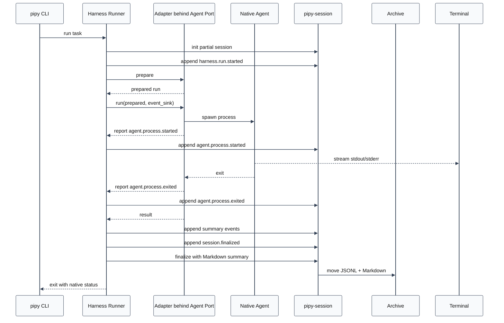
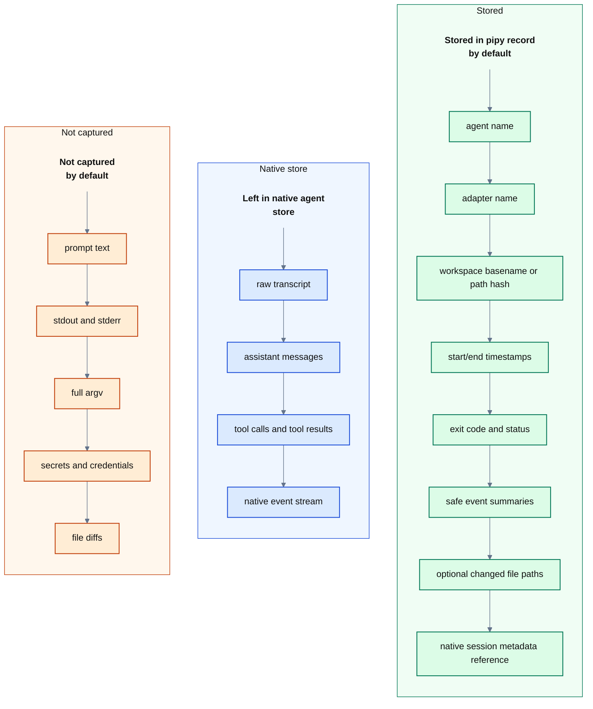

# Coding-Agent Harness Spec

Status: stable design rationale and behavioral invariants for the pipy
harness. For current implementation state and parity status see
[architecture.md](architecture.md) and [pi-parity.md](pi-parity.md).
For forward planning and parity tracks see [backlog.md](backlog.md).

<style>
.mermaid,
.mermaid svg {
  background: transparent !important;
  background-color: transparent !important;
}
</style>

## Goal

Build pipy's own coding-agent harness deliberately, starting with a small
local-first runner that can launch a coding agent, observe a conservative run
lifecycle, and write a durable pipy session record.

The first harness slice is not another session-capture feature by itself. It is
the foundation for pipy's own agent surface:

- a `pipy` CLI for running coding-agent tasks
- a harness core that owns run lifecycle and status
- adapter boundaries for current external agents
- a native pipy agent runtime behind the same interface
- integration with `pipy-session` for durable, privacy-conscious records

The existing `pipy-session` package remains the recorder and archive layer. The
harness should call it instead of creating a parallel transcript format.

## Non-Goals

- Do not build a broad transcript database.
- Do not import raw native transcripts by default.
- Do not store prompts, assistant messages, tool payloads, stdout, stderr,
  secrets, tokens, credentials, private keys, or sensitive personal data by
  default.
- Do not replace Codex, Claude Code, Pi, Aider, Goose, or Continue in the first
  slice.
- Do not implement a full native model/tool loop in the bootstrap slice.
- Do not add multi-agent orchestration, repo maps, indexing, long-running
  daemons, or a web UI yet. (Live single-session resume, branch/fork, and
  in-session compaction have since shipped through pipy-owned boundaries — see
  the `Native Session Workflow Decision` below — but they remain bounded to one
  metadata-first session lineage, not a mutable Pi-style session tree.)
- Do not change the finalized session archive layout documented in
  `docs/session-storage.md`.
- Do not publish documentation, add docs CI/deploy workflows, or turn the local
  docs preview into a product web UI.

## Design Principles

- Local first. Runs execute from a local workspace and local state remains under
  user control.
- Small core, explicit adapters. The harness owns lifecycle; adapters own how a
  native agent is invoked and observed.
- Conservative capture. Store metadata and summaries that help future work, not
  raw conversations or command output.
- Native stores stay native. When an agent already keeps its own transcript,
  pipy may reference that native record without copying its contents.
- One lifecycle vocabulary. Codex, Claude, Pi, and future pipy-native runs should
  normalize into the same small event vocabulary where possible.
- Testable first slice. The initial implementation should be runnable with fake
  subprocess adapters and temporary session roots.
- Standard library first. New dependencies need a clear near-term payoff.

## Core Concepts

### Task

A user-requested unit of work. In the first slice, a task is just metadata plus
the external command being run. Later it may include structured prompts,
permissions, workspace policy, expected outputs, or evaluation criteria.

`slug` is a human-facing label and filename component. It is not the stable
identity of a run.

Suggested fields:

- `slug`
- `goal` or short description
- `workspace`
- `agent`
- `created_at`

### Agent

The logical agent selected for the task, such as `codex`, `claude`, `pi`, or
future `pipy-native`.

An agent is not the same as an adapter. The agent is the product-facing choice;
the adapter is the implementation that knows how to run it.

### Agent Port

The protocol the Runner calls to execute an agent. The port is stable harness
surface; adapters are concrete implementations behind it.

Suggested methods:

- `prepare(task, command, cwd) -> PreparedRun`
- `run(prepared, event_sink) -> AdapterResult`

### Adapter

The concrete implementation behind the harness agent port, such as a
subprocess-backed adapter, Codex adapter, Claude adapter, or future pipy-native
runtime adapter.

Responsibilities:

- validate that the native command can be run
- construct the process invocation or hook behavior
- normalize observable lifecycle events into harness events
- optionally report a native session reference
- return exit status and timing

Non-responsibilities:

- storing pipy records directly
- importing raw transcripts by default
- deciding long-term product policy

Adapters report events; the Runner records them. No adapter may mutate a pipy
session record directly.

### Run

One execution of a task through one adapter.

`run_id` is the stable identity of the execution and should be generated by the
Runner before recording starts. `slug` remains a display label and filename
component. Multiple runs may share the same slug.

Aggregate boundary: one Run equals one durable pipy record file and one recorder
unit of work. Only the owning Runner mutates that record.

Suggested fields:

- `run_id`
- `task`
- `agent`
- `adapter`
- `workspace`
- `status`
- `started_at`
- `ended_at`
- `exit_code`
- `session_record`

`session_record` should be a small structured reference to the pipy-side record,
not the raw record body. Suggested fields: active path while running, finalized
JSONL path after finalize, optional Markdown summary path, and capture marker.

### Run Event

A privacy-safe event emitted by the harness or adapter. Run events are not raw
native transcript events. They should be stable enough to support later UI,
search, and analysis.

Every harness event should carry:

- `event_id`: stable unique identifier within the run record
- `run_id`: stable run identity
- `sequence`: monotonically increasing integer assigned by the Runner
- `timestamp`: ISO-8601 timestamp

The first recorded event should also include `harness_protocol_version`. Start
versioning records in the first slice so finalized JSONL files do not need
in-place migration later.

Initial event vocabulary:

- `harness.run.started`
- `harness.run.completed`
- `harness.run.failed`
- `agent.process.started`
- `agent.process.exited`
- `agent.native_session.referenced`
- `workspace.files.changed`
- `verification.performed`
- `session.finalized`

`session.finalized` is a harness lifecycle event. It is appended by the Runner
just before the recorder unit of work is closed and moved into the finalized
archive.

Potential later events:

- `agent.turn.started`
- `agent.turn.completed`
- `agent.tool.observed`
- `agent.approval.requested`
- `agent.approval.resolved`
- `agent.idle`
- `artifact.created`

### Artifact

A durable output from the run. In the first slice this should mean only safe,
explicit artifacts such as a generated file path or final summary path. It
should not mean raw stdout/stderr, prompts, assistant messages, tool payloads,
or diffs.

### Native Session Reference

A metadata-only reference to an external agent's own session record.

Allowed by default:

- source filename
- source file size
- source mtime
- hash of resolved absolute path
- whether raw content was imported: always `false` by default

Disallowed by default:

- absolute source path
- raw native transcript body
- prompt text
- assistant text
- tool args/results

### Pipy Session Record

The durable pipy-side run record stored through `pipy-session`. It is a summary
and event trail for future review, not a complete transcript.

## Capture Policy

Capture policy is a value object passed to the Runner rather than a set
of scattered flags.

Suggested fields:

- `record_argv`: default `false`
- `record_stdout`: default `false`
- `record_stderr`: default `false`
- `record_file_paths`: default `false`, set by `--record-files`
- `import_raw_transcript`: default `false`
- `workspace_path_mode`: `basename_and_hash` by default

## Recorder Unit of Work

Treat the recorder integration as a unit of work:

```text
with recorder.session(run) as session:
    session.append(...)
```

The concrete API may differ, but the semantics should be the same: initialize an
active record, append lifecycle events while the run is active, and finalize the
record exactly once on success, failure, abort, or adapter exception. Finalize
failure should be explicit rather than silently returning a successful run.

## Adapter Boundary

This section describes the concrete data exchanged through the `AgentPort`
methods defined above.

`PreparedRun` should include:

- display-safe command label
- executable name
- resolved working directory
- redacted or omitted argv metadata

`AdapterResult` should include:

- status
- exit code
- start/end timestamps or duration
- optional native session reference
- safe changed-file paths if collected

The event sink is Runner-owned. It may assign `event_id` and `sequence` before
appending to the recorder. A concrete adapter should not expose full command
output to the recorder. It may stream the native process to the user's terminal.

Concrete adapter examples:

- `SubprocessAdapter`
- `CodexAdapter`
- `ClaudeAdapter`
- `PipyNativeAdapter`

### Native Runtime Bootstrap

The native bootstrap slice adds `PipyNativeAdapter` behind the same
`AgentPort`. It does not shell out to Codex, Claude, Pi, or another coding-agent
CLI. The adapter prepares one native turn, constructs a `NativeAgentSession`,
calls a provider through a minimal `ProviderPort`, invokes deterministic no-op
or bounded read-only tools only through supported pipy-owned intent data, and
can run injected supervised patch apply plus allowlisted verification boundaries
only when explicit pipy-owned request and gate objects are supplied by control
flow.

The deterministic `fake` provider remains the default for tests and smoke runs.
It is not a production AI provider and it does not require credentials. A smoke
run is:

```sh
uv run pipy run --agent pipy-native --slug native-smoke --goal "Native bootstrap smoke"
```

The first real provider is the OpenAI Responses API provider. It is selected
explicitly, reads credentials from `OPENAI_API_KEY`, requires `--native-model`,
uses pipy's internally built system prompt as the Responses API `instructions`
field, uses the short native goal as `input`, and requests `store: false`:

```sh
uv run pipy run --agent pipy-native --native-provider openai --native-model <model> --slug openai-smoke --goal "Say hello briefly"
```

The OpenAI provider uses a small injectable standard-library HTTP boundary so
tests can provide fake responses without live credentials or network access. It
does not enable built-in tools, function calling, web search, file search, code
interpreter, computer use, conversation state, background mode, streaming,
retries, model fallback, OAuth, or a provider registry.

The second real provider is the OpenRouter Chat Completions provider. It is
selected explicitly, reads credentials from `OPENROUTER_API_KEY`, requires
`--native-model`, sends pipy's internally built system prompt and short native
goal as `system` and `user` chat messages, and makes one non-streaming request
to `https://openrouter.ai/api/v1/chat/completions`:

```sh
uv run pipy run --agent pipy-native --native-provider openrouter --native-model <provider/model> --slug openrouter-smoke --goal "Say hello briefly"
```

The OpenRouter provider maps documented usage counters `prompt_tokens`,
`completion_tokens`, and `total_tokens` to pipy's normalized `input_tokens`,
`output_tokens`, and `total_tokens` metadata and omits unknown, unavailable,
negative, non-finite, or provider-native usage fields. It does not
send OpenRouter app-attribution headers, debug options, provider routing
preferences, plugins, tools, function calling, streaming, retries, fallback
routing, OAuth, or provider-side tool settings. It does not store raw request
bodies, raw provider responses, provider response ids, prompts, model output,
auth material, or provider-native payloads in JSONL, Markdown, or
`--native-output json`.

The third real provider is the distinct OpenAI Codex subscription provider. It
is selected explicitly as `--native-provider openai-codex`, requires
`--native-model`, and uses pipy's own OAuth state under
`${PIPY_AUTH_DIR:-~/.local/state/pipy/auth}/openai-codex.json` rather than
Pi's `~/.pi/agent/auth.json` or any Codex/ChatGPT credential store:

```sh
uv run pipy auth openai-codex login
uv run pipy run --agent pipy-native --native-provider openai-codex --native-model <model> --slug codex-smoke --goal "Say hello briefly"
uv run pipy
```

The login boundary follows the local Pi reference shape: PKCE OAuth with client
id `app_EMoamEEZ73f0CkXaXp7hrann`, authorize/token URLs under
`https://auth.openai.com/oauth`, redirect
`http://localhost:1455/auth/callback`, scope
`openid profile email offline_access`, a local callback server, manual-paste
fallback, refresh-token support, and `chatgpt_account_id` extraction from the
access-token JWT. Provider calls use one SSE Responses request to
`https://chatgpt.com/backend-api/codex/responses` with `store: false`,
`stream: true`, Responses-style user input, `Authorization`,
`chatgpt-account-id`, `originator: pipy`,
`OpenAI-Beta: responses=experimental`, and `Accept: text/event-stream`. The
provider sends the same low default text verbosity as Pi's Codex Responses
path, maps streamed final text and normalized usage into the existing provider
result shape, and archives only safe metadata such as provider, model, status,
duration, storage booleans, response status, and normalized counters.
Auth material, authorization URLs, raw request bodies, raw provider responses,
headers with credentials, prompts, model output, provider-native payloads,
stdout, stderr, tool payloads, diffs, file contents, secrets, credentials,
tokens, refresh tokens, private keys, and sensitive personal data remain out of
JSONL, Markdown, catalog/search/inspect surfaces, and `--native-output json`.
The standalone `pipy auth openai-codex login` command remains supported, and
the native shell exposes the same auth boundary through `/login openai-codex`
plus `/logout openai-codex`. Shell login/logout diagnostics stay on stderr and
do not create provider turns or archive auth material.

### Native Interactive REPL

The interactive native shell is available as:

```sh
uv run pipy
uv run pipy repl --agent pipy-native --slug native-repl
```

It is intentionally a thin REPL over the same native provider/session/turn core
used by one-shot `pipy run --agent pipy-native`. Bare `pipy` defaults to the
native REPL in the current directory with slug `native-repl`. The REPL creates
a normal harness record and runs a bounded `NativeNoToolReplSession` with one
fresh pipy-owned `NativeConversationState`.

Each non-empty non-command input line becomes one provider turn. Provider
construction is late-bound: immediately before each provider-visible turn, the
REPL resolves the current provider/model selection to a concrete
`ProviderPort`, and the `NativeRunInput` metadata for that turn reflects that
selection. `/help` prints a grouped static command reference on stderr without
invoking the provider or tools. Malformed supported slash commands and
unsupported slash commands reuse the same grouped reference, while omitting raw
command text. `/clear` clears retained no-tool conversation context and any
pending proposal draft through a local command path. `/status` prints only safe
local shell-state labels and counters to stderr, including provider/model
selection, provider-turn count, retained no-tool history counters, read-budget
flags, pending proposal availability, and verification availability.
`/login [openai-codex]` reuses `OpenAICodexAuthManager.login_interactive()` with
REPL stdin and stderr, `/logout [openai-codex]` removes pipy-owned OpenAI Codex
credentials through the same auth-manager boundary, and
`/model [<provider>/<model>|<model>]` prints or changes the current
provider/model selection. These local commands do not invoke providers, do not
consume provider turns, do not consume explicit-read budgets, do not mutate
state unless their command contract explicitly says so, and do not archive raw
command text, authorization URLs, prompts, provider responses, tokens, or auth
material. Successful `/model` selections are persisted as non-secret native
defaults under local pipy state with only provider and model identifiers.
`/exit` and `/quit` terminate the session.

#### Runtime resource loading (skills, prompt templates, custom commands)

Both REPL product paths load three bounded resource kinds at runtime through
`pipy_harness.native.resources`, a pipy-owned registry and pure dispatcher.
This is **not** a general extension API: only these three kinds load, and they
reuse the existing provider/session/tool/archive boundaries — no parallel
provider path and no new privacy policy.

Discovery (`pipy_harness.native._resource_files` + the `skills`,
`prompt_templates`, and `custom_commands` loaders) reads `*.md` files one level
deep from pipy-owned stores, workspace-first then global: `<workspace>/.pipy/{skills,templates,commands}/`
then `<config>/{skills,templates,commands}/`, where `<config>` resolves through
`PIPY_CONFIG_HOME` → `${XDG_CONFIG_HOME}/pipy` → `~/.config/pipy` (mirroring
`workspace_context`). Results dedupe by canonical path (first wins). Optional
`---`-delimited frontmatter declares `name` and `description`; the body is the
instruction/template text. The per-candidate safety policy skips, silently,
files whose name looks secret (`capture.looks_sensitive`), whose loaded head
bytes contain a NUL (binary), or whose bare filename is a generated/`.gitignore`-matched
artifact (`read_only_tool._is_ignored_or_generated`, applied to the filename so
the pipy-owned `.pipy/` parent is not itself treated as ignored). Per-file and
total byte caps bound the body with a deterministic truncation marker; resource
directories must not be symlinks and resource-file symlinks must resolve inside
their store.

`dispatch_resource_command` runs **after** the built-in command handlers, so a
custom command can never shadow a built-in (collisions are dropped from
discovery). Outcomes:

- `/skill` / `/template` with no argument print a local listing (names +
  descriptions only; no bodies) and issue no provider turn.
- `/skill <name>` loads the skill body, `/template <name> [args]` expands the
  template body (`$ARGUMENTS` / `${ARGUMENTS}` → the full argument string;
  `$1..$9` / `${1}..${9}` → whitespace-split positional arguments; a
  placeholder-free body with arguments appends them as inserted prompt text),
  and a workspace/global custom `/<name> [args]` expands its body the same way.
  Each becomes one bounded provider-visible message through the same provider
  boundary as a genuine prompt.
- Unknown, unsafe, or empty resources fail closed: a diagnostic is printed and
  no provider turn is issued.

Privacy: the resource body, expanded prompt, and command text are never
archived. The no-tool path emits `native.resource.invoked` and
`native.resource.rejected` events whose payload carries only safe metadata
(`resource_kind`, `name`, `path_label`, `sha256`, `byte_length`, `truncated`,
`resource_label`), plus a `resource_invocation_count` in the completion event;
the tool-loop path returns `resource_invocation_count` in
`NativeToolReplResult`. Resource invocations are excluded from the local prompt
history and from the opt-in `--archive-transcript` sidecar body. The `[Skills]`
startup-chrome section lists the loadable skill names from the same loader the
dispatcher uses.
The bounded tool-loop REPL uses a separate terminal UI boundary when stdin and
stderr are real TTY streams and the input runtime is `auto`. That boundary is
`pipy_harness.native.tui.ToolLoopTerminalUi`: it stores chat history,
submitted user-message blocks, the active assistant-output buffer, transient
working text, slash-command menu state, the input/editor line, and the two-row
footer/status. It renders inline (no alternate screen): each finalized block —
startup chrome, submitted prompts, settled assistant turns, settled reasoning,
tool call/result rows, and notices — is committed once into
the terminal's normal buffer, so the host terminal/multiplexer keeps it in
native scrollback. The user can scroll up to review prior output in both a
native terminal (e.g. Ghostty) and inside a multiplexer pane (e.g. zellij)
because the renderer no longer holds the alternate screen. Only a small live
region — the bounded in-progress stream tail, the separator/input/separator
frame, the optional slash menu, and the two footer rows — is redrawn in place
below the committed history, pinned at the bottom of the window. As a session
produces output the committed history fills the full window height with the
input/footer at the bottom rather than capping the frame to the upper half.
Typing `/` in the product TUI opens the same command-list/description
surface inside the frame for the commands this tool-loop dispatcher can execute
locally (`help`, `model`, `skill`, `template`, `settings`, `login`, `logout`,
`copy`, `exit`, `quit`, plus any discovered workspace/global custom slash
commands); Up/Down moves the selected row, Tab or Enter accepts the selected
command, and Escape closes the menu without exiting the session. The menu is
honest — it advertises a command only once the dispatcher can execute it, so
no-tool-only commands (`read`, `ask-file`, `propose-file`, `apply-proposal`,
`verify`) never appear here — and windows to six visible rows with a scroll
indicator when more match. `/copy` is a local-only command: it copies the
most recent assistant answer through a safe OS clipboard command (`pbcopy` on
macOS; `wl-copy`/`xclip`/`xsel` on Linux) or an OSC 52 terminal fallback,
reports a local status notice, and never invokes the provider, tools,
login/logout, or model switching. `/settings` opens an interactive in-frame
settings/control dialog (`ToolLoopTerminalUi.run_settings_dialog`) — a live
overlay drawn in the pinned live region (not a committed history block), like
the `/model` selector. It lists section headers, read-only status rows (the
active provider/model and per-provider local availability reasons, the same safe
information the no-tool `settings_overlay_lines` builder exposes), and actionable
rows. Up/Down move the highlight between actionable rows (skipping headers and
status rows, wrapping), Enter/Space activate the highlighted row, the list
windows with a scroll indicator when it overflows the height, and
Esc/Ctrl-C/Ctrl-D close the dialog and return to the input. A resize while the
dialog is open repaints it coherently through the same inline contract (no
alternate screen). The dialog runs **no** provider turn and **no** tool call.
Its actions are: change provider/model (reuses the `/model` selector and the
`NativeReplProviderState.select_model` boundary), openai-codex auth (reuses the
`/login`/`/logout` auth boundary, showing the current logged-in/out status), and
two prompt-history controls described below (toggle persistent prompt history,
clear persisted history). Provider/model and auth actions return to the dialog
afterward so the user can keep adjusting settings; the prompt-history toggles are
applied in place without leaving the dialog. The captured-stream (non-TTY)
fallback keeps printing the shared read-only `settings_overlay_lines` text.

`/model` is an executable interactive provider/model selector in the product
TUI. Bare `/model` opens an in-frame selector (`ToolLoopTerminalUi.run_model_selector`)
built from `NativeReplProviderState.model_options()`: each row shows the
`provider/model` reference and its availability state (`[available]`, or
`[unavailable: <reason>]` for missing credentials or a provider that does not
advertise tool-call support, which tool-loop mode requires), the active
selection is marked `(current)`, Up/Down move the highlight (wrapping), Enter
chooses the highlighted row only when it is selectable, and Esc/Ctrl-C/Ctrl-D
cancel. The selector runs no provider turn while it is open. On a successful
choice the session calls `NativeReplProviderState.select_model` (the same
provider-state boundary the no-tool `/model` uses), rebinds the live provider,
clears the in-memory conversation context, rebinds the usage meter, refreshes
the footer/status model label, and persists the non-secret default; the next
provider turn is constructed with the new provider/model. A direct
`/model <provider>/<model>` (or `<model>`) form switches without opening the
selector and works in both the product TUI and the captured-stream fallback. A
switch to a provider that does not advertise tool-call support is refused and
the previous selection restored. Unavailable providers stay visible with a
reason but cannot be chosen as if available. The selector reads and mutates only
the in-memory provider state and the non-secret defaults file (provider name and
model id); it adds no auth material, provider payloads, prompts, model output,
command text, or secrets to the metadata archive.

`/login [openai-codex]` and `/logout [openai-codex]` are executable in the
product TUI through the same `NativeReplProviderState` auth boundary the no-tool
REPL uses. Both run no provider turn and no tool call. `/login` calls
`OpenAICodexAuthManager.login_interactive()` (the inline frame is suspended via
`ToolLoopTerminalUi.suspend_for_external_io()` so the OAuth URL/prompt prints to
and reads from the terminal in cooked mode, then the frame repaints below it);
`/logout` removes the stored OpenAI Codex credentials and resets the selection to
the local default. After either, the session clears the in-memory conversation,
rebinds the live provider and usage meter, refreshes the footer/status label, and
the refreshed `model_options()` availability takes effect on the next `/model`
view or turn. Auth URLs, prompts, tokens, and credentials render only on the live
terminal and never reach the session archive; the `/settings` dialog surfaces
`/login`/`/logout` as actionable openai-codex auth rows (and the captured-stream
fallback footer points at them) instead of saying they are unavailable.

The TUI input editor provides daily-driver ergonomics built on the same
raw-mode read loop. Up/Down recall an in-memory, session-scoped prompt history
(submitted, non-blank, consecutively de-duplicated entries) with a preserved
in-progress draft restored when stepping past the newest entry; the menu takes
priority over history while it is open. Optional persistent cross-session prompt
history is available behind the `/settings` "persistent prompt history" toggle
(off by default). When enabled, submitted prompts are saved to a local-only
pipy state file (`PromptHistoryStore`, `~/.local/state/pipy/prompt-history.json`,
overridable via `PIPY_PROMPT_HISTORY_PATH`) — capped, blank/consecutive-duplicate
suppressed, written atomically with owner-only permissions — and a fresh session
seeds its Up/Down recall buffer from those saved prompts. The store is
independent of the metadata-first session archive: only genuine prompts (never
slash commands) are saved, and prompt bodies never enter the archive. When the
toggle is off, nothing is persisted and a fresh session does not seed from disk;
"clear persisted history" in `/settings` wipes the saved entries so a later fresh
session recalls nothing (it leaves the current session's in-memory recall buffer
intact). The in-memory per-session recall always works regardless of the toggle. ANSI bracketed
paste is enabled in raw mode (`ESC[?2004h`); a paste is read whole between the
`ESC[200~`/`ESC[201~` markers, normalized to `\n` line breaks, and inserted as a
single literal edit, so multi-line pastes never submit on an embedded newline and
a leading `/` with whitespace never opens the slash menu. The input buffer keeps
the literal text (so Enter submits the exact multi-line prompt), but the input
cell renders through a single-line projection (`_display_input_text`) that maps
each embedded newline to a single-width `⏎` glyph (and any other control
character to a space), one display character per buffer character. This keeps the
live input row exactly one physical row tall regardless of pasted newlines, so
the separator/input/footer frame, the live-height/erase math, and the cursor
column all stay coherent (the projection is 1:1, so the logical cursor index maps
directly onto the displayed column). Input wider than the cell is horizontally
scrolled through one shared `_input_view(width)` helper (used by both the
renderer and the cursor parking) so the cursor stays visible within `width - 1`
columns and the input never wraps onto a second physical row; the buffer is still
submitted in full. Ctrl-Z/Ctrl-Y provide
per-edit undo/redo over `(text, cursor)` snapshots (a whole paste is one step),
reset per line. Resize handling is poll-based: the read/selector/active-turn
loops compare the live output terminal's `winsize` against the last painted size
every ~100 ms, with a best-effort SIGWINCH handler (which no-ops off the main
thread) only flagging a pending resize to make idle repaints snappier. On a
detected size change the renderer does a drift-independent repaint
(`_repaint_after_resize`): it clears the visible screen, homes the cursor, and
redraws the full frame (committed history + live region) fresh at the new size,
rather than trusting the cached physical live-height (which a width change can
invalidate when a full-width separator reflows). It stays inline — no alternate
screen, no `ESC[3J`, so committed history remains in native scrollback (and is
re-rendered above the frame at the new width). A resize while idle, while the
slash/model overlay is open, or while a turn streams therefore repaints into a
single coherent frame with no stale or overlapping rows. (Resizes are
infrequent, so the full redraw is an acceptable cost for that guarantee.)

Submitted
messages and settled assistant text are committed into native scrollback while
streamed assistant text and the loader live in the redrawn live region; the
input and footer remain stable frame rows pinned at the bottom. Streamed
reasoning is accumulated into one active reasoning block instead of one block
per token, and model-selected tool commands/results render as Pi-style shaded
rows with a bounded result preview. Model-selected `read` calls use Pi's compact
shaded `read <path>` row in the TUI and suppress the excerpt body from the
viewport while still passing the observation back to the model. Because finalized
output lives in scrollback rather than a fixed-height frame, long tool output
and answers scroll up out of the live viewport and stay reviewable; the live
input/footer frame keeps its shape regardless of how much history precedes it.
The logical full-screen composition is still available through
`ToolLoopTerminalUi.render_lines()` for unit tests, but the real paint path and
its scroll/full-height behavior are verified through PTY captures and the ANSI
screen-cell model rather than `render_lines()` alone. Captured streams and explicit non-TTY input runtimes
continue to use the deterministic line-oriented fallback so stdout/stderr
automation contracts and tests remain stable. The TUI shell is a presentation
boundary only; provider calls, bounded tool-loop behavior, transcript
sidecars, and metadata-first archive policy stay behind the existing native
session/tool/provider ports.
TUI verification uses `pipy_harness.native.terminal_screen` as a small
stdlib ANSI screen-cell model, comparable in purpose to Pi's
`packages/tui/test/virtual-terminal.ts`: it can replay rendered terminal
output into visible rows, columns, cursor position, viewport/scroll state, and
SGR-backed cell attributes. Visible-string findings match text that wraps
across adjacent captured rows, and expected-output findings exclude cells that
belong to the submitted prompt so prompts such as `Reply exactly: ...` do not
mask missing assistant output. `scripts/tmux_transient_ui_verify.sh <out-dir>
[prompt] [expected-output]` exercises the real product command
`uv run pipy repl --native-provider openai-codex --native-model gpt-5.5` in a
controlled tmux pane and writes both text summaries and machine-readable
screen artifacts. The script samples active frames at 100 ms by default
(`SAMPLE_INTERVAL` and `MAX_SAMPLES` can override that) and requires an
expected output string unless it can derive one from a `Reply exactly: `
prompt. The pane geometry defaults to `PANE_COLUMNS=100` and `PANE_ROWS=30`;
set those environment variables before invoking either tmux verifier to cover
shorter or wider terminal layouts. Its settle checks use an approximate wrapped
visible-text count so sampling does not stop on the prompt copy alone. Treat
`screen-metrics.jsonl`,
`terminal-report.json`, and
`screen-anomalies.tsv` as the authoritative verification outputs; screenshots
are supporting evidence only. A longer product-path smoke under
`docs/audit/2026-05-28/tool-overflow-smoke-after-tui-fix/pipy/` exercises
model-selected `ls` tool rendering, prompt retention away from the top row,
final assistant output, footer rows, and cursor alignment through the same
script.
`scripts/tmux_tui_input_verify.sh <out-dir>` is the no-provider-call
product-path input-state gate. It launches the same real `pipy repl
--native-provider openai-codex --native-model gpt-5.5` command, samples
Escape-on-empty-input, slash-menu-open, slash-menu navigation, and
Escape-to-close frames, then fails from parsed `screen-metrics.jsonl` when the
slash-menu list, Pi-style arrow selection, typed slash preservation, input row,
cursor cell, footer/status rows, or named visual-region styles are missing.
Active provider-turn Escape parity is covered by tmux audit captures that submit
a long prompt, sample `Working...`, press Escape, and require the post-Escape
frame to show red `Operation aborted` with no resumed assistant stream.
`scripts/tmux_pi_comparison_verify.sh <out-dir> [prompt] [expected-output]`
wraps that product-path run and a Pi reference run in matching 100x30 tmux
panes, then feeds both `screen-metrics.jsonl` files to
`pipy_harness.native.terminal_compare`. The comparison writes
`comparison/row-column-deltas.{json,tsv}`,
`comparison/final-viewport-deltas.{json,tsv}`, `comparison-report.json`, and
`comparison-anomalies.tsv`; the final-frame deltas must show prompt,
expected output, status/footer, cwd, inferred input row, live cursor, and
drawn reverse cursor within zero row/column tolerance. Matching cell
attributes are also recorded for visible findings and the drawn reverse
cursor, and attribute mismatches fail the comparison. Screen metrics record
the prompt background-band rows and named visual-region rows for submitted
prompts, tool-call rows, tool-result rows, slash-menu rows and selection
highlights, separators, cursor cells, and footer/status rows; the comparison
fails on active or final visual-region deltas so color/background regressions
cannot pass through screenshots alone. The final viewport is also compared after
normalizing dynamic usage meters, including optional reasoning-token counters,
so ordinary prompts such as `hello world` fail when the visible answer or
retained startup chrome differs even if the selected expected-output marker is
present on both sides. The Pi command defaults to `pi --provider openai-codex
--model gpt-5.5` and can be overridden with `PI_COMMAND`. The parity gate
includes the default 100x30 pane and the short 100x24 pane so height-sensitive
prompt, answer, separator, input, footer, cursor placement, and shaded prompt
band regressions are caught by machine-readable comparison artifacts.
See `Read-Failure Recovery Boundary Direction`: two successful explicit file
excerpts per REPL session plus one bounded failed or skipped read-attempt
budget leaves the successful excerpt budget available.
`/read <workspace-relative-path>` is the display-only workspace command.
`/ask-file <workspace-relative-path> -- <question>` is the first explicit
provider-visible context command: it uses a whitespace-delimited `--` separator,
the same bounded explicit file excerpt path as `/read`, then sends exactly that
in-memory excerpt plus the question to one provider turn. EOF exits cleanly,
interrupt exits with code `130`, and the fixed in-memory turn bound stops
provider turns before they can become unbounded. The first provider request
uses the conversation-state turn index `0` and label `initial`; later no-tool
REPL provider requests use subsequent conversation-state turn indexes and the
closed label `no_tool_repl`. The `/ask-file` provider request uses the next
conversation-state turn index and the closed label `ask_file_repl`.
`/propose-file <workspace-relative-path> -- <change-request>` uses the same
bounded explicit-file-excerpt path as `/ask-file`, then sends one in-memory
excerpt plus one change request to one provider turn labeled
`propose_file_repl`. `/apply-proposal <workspace-relative-path>` performs no
provider turn; it consumes only one pending in-memory proposal draft from the
same REPL session and exact same normalized workspace-relative path.
`/verify just-check` performs no provider turn; it is accepted only after a
successful same-session `/apply-proposal` mutation and maps the safe command
label to the internal `just check` argv through the existing verification
boundary. These turn indexes and labels are pipy-owned; they are not copied
from provider metadata and are not derived from prompts, model output,
filesystem paths, stdout, stderr, secrets, or credentials.

The REPL stdout/stderr convention is conservative: provider final text from
successful ordinary, `/ask-file`, or `/propose-file` turns and successful
`/read` excerpt text print to stdout, while prompts, help, auth/model status,
clear status, local status, malformed-command usage diagnostics,
unsupported slash-command diagnostics, finalization, errors, interrupt
handling, apply status, verification status, command-skip messages, and the
turn-limit notice stay on stderr. `/model` with no arguments prints the current
selection and conservative configured-model information to stderr only.
`/ask-file` and `/propose-file` never print their raw excerpts directly;
`/apply-proposal` does not print raw replacement text or diffs, and
`/verify just-check` does not print command stdout or stderr. This is separate
from one-shot `--native-output json`; the REPL does not add structured stdout,
a transcript stream, or conversation export.

The `/read`, `/ask-file`, and `/propose-file` commands share two successful
explicit file excerpts per REPL session plus one bounded failed or skipped
read-attempt budget. Each accepted command builds one pipy-owned
`NativeReadOnlyToolRequest` with request kind `explicit-file-excerpt`, a
pipy-owned `NativeExplicitFileExcerptTarget`, and the existing read-only
workspace sandbox policy. Explicit user-entered REPL read/context commands use
`not-required` approval policy data and do not render a visible approval prompt
before invoking `NativeExplicitFileExcerptTool`. Malformed `/read`, `/ask-file`,
and `/propose-file` commands and unsupported slash commands fail closed before
any read, tool event, provider visibility, or budget consumption. A failed or
skipped first read attempt, such as unsafe-target, ignored/generated,
secret-looking, oversized, binary, unreadable, unsupported-encoding, or
tool-skipped, leaves the successful excerpt budget available for later explicit
file commands. After two successful excerpts, later `/read`, `/ask-file`, and
`/propose-file` attempts fail closed before reading, before provider
visibility, and before proposal parsing. If the recovery attempt after a
failed/skipped read also fails, later read/context attempts fail closed before
another read. Static help and usage diagnostics are not archived and do not
consume either budget.

Provider metadata is intentionally omitted from REPL provider lifecycle payloads
so provider-returned tool intent markers cannot become archive content. The
provider-visible content added by ordinary REPL turns is the current input line
plus bounded in-memory ordinary no-tool history. Later ordinary no-tool turns
receive only prior successful ordinary non-command user prompts and provider
final text, translated into prior user/assistant messages for providers that
support message-shaped requests. This history is bounded by the REPL provider
turn limit and a 4 KiB provider-visible byte budget, drops oldest exchanges
before provider visibility, and clears on provider/model changes, login,
logout, successful `/clear`, provider failure, or ambiguous provider-carryover
paths. Successful `/read` excerpts are printed only to the interactive stdout
stream; they are not provider-forwarded, archived, included in Markdown,
included in catalog/search surfaces, or included in one-shot
`--native-output json`. Successful `/ask-file` and `/propose-file` excerpts are
provider-forwarded only in memory to the single corresponding provider turn
and are not printed directly, archived, included in Markdown, included in
catalog/search surfaces, included in one-shot `--native-output json`,
persisted as provider context, or reused by later turns.

REPL archives reuse existing safe lifecycle event names:

- `native.session.started`
- `native.provider.started`
- `native.provider.completed` or `native.provider.failed`
- `native.tool.started`
- `native.tool.completed`, `native.tool.skipped`, or `native.tool.failed`
- `native.tool.observation.recorded` for successful `/ask-file` and
  `/propose-file` provider visibility only
- `native.patch.proposal.recorded` for the proposal-only `/propose-file`
  boundary only
- `native.patch.apply.recorded` for successful, skipped, or failed
  `/apply-proposal` attempts that reach the patch-apply tool
- `native.verification.recorded` for successful, skipped, or failed
  `/verify just-check` attempts that reach the verification tool
- `native.session.completed`

No conversation or turn export event is emitted. REPL lifecycle payloads remain
metadata-only and may include safe labels and counters such as provider, model,
mode `repl`, `tools_enabled=true`, `read_only_commands_enabled=true`,
`provider_visible_context_enabled=true`, provider-visible-context-used state,
provider turn index/label, status, exit code, duration, normalized usage, turn
count, read-command-used state, ask-file-command-used state, and an exit reason
label. Tool lifecycle payloads remain metadata-only and may include safe
read-tool status, reason labels, approval/sandbox labels, capability booleans,
counts, source labels, path hashes, and storage booleans. Patch-apply payloads
remain the existing metadata-only apply shape with safe status/reason labels,
operation counts and labels, approval/sandbox labels, capability booleans,
workspace mutation state, optional safe scope labels, and false storage
booleans. JSONL, Markdown, catalog/search/inspect surfaces, and one-shot
`--native-output json` must still omit raw prompts, model output, provider
responses, provider-native payloads, provider metadata, raw approval prompts,
raw tool arguments, raw tool results, stdout, stderr, diffs, patches, full file
contents, command output, auth material, secrets, credentials, tokens, private
keys, and sensitive personal data.

### Native Approval And Sandbox Enforcement Baseline

This historical baseline defines the visible approval prompt foundation and
sandbox enforcement for broad interactive tools, provider-visible context, and
sanitized fixtures that can drive one follow-up provider turn. Decisions use
`pending`, `allowed`, `denied`, `skipped`, and `failed`. Operations covered:
read-only workspace tools, provider-visible repo context production, write
tools, patch proposal apply, shell execution, network access, and verification
commands. Sandbox modes are `no-workspace-access`, `read-only-workspace`, and
`mutating-workspace`; capabilities are `workspace_read_allowed`,
`filesystem_mutation_allowed`, `shell_execution_allowed`, and
`network_access_allowed`.

Gate order: Policy validation; Request normalization and identity; Approval
gate; Sandbox capability gate; Path and context validation; Execution gate;
Observation and provider-context gate. Missing policy, unsupported approval
mode, unsupported sandbox mode, denied approval, unavailable approval UI,
sandbox mismatch, unsafe request data, model-selected paths, and attempted
capability escalation must not execute. Archive-safe fields are policy labels,
approval required/resolved booleans, decision labels, safe reason labels,
`tool_request_id`, `turn_index`, `duration_seconds`, and storage booleans. raw
prompts, model output, provider responses, provider-native payloads, raw tool
payloads, stdout, stderr, diffs, patches, full file contents, shell commands,
raw args, model-selected paths, secrets, credentials, API keys, tokens, private
keys, and sensitive personal data remain forbidden.

### OpenAI Subscription-Backed Native Auth Decision

Decision: reopened and implemented as a distinct `openai-codex` provider.
Decision date: 2026-05-07. Decision update: reopened for a distinct
`openai-codex` provider after checking /Users/jochen/src/pi-mono and these
sources: https://developers.openai.com/api/reference/overview,
https://help.openai.com/en/articles/6950777-what-is-chatgpt-plus,
https://help.openai.com/en/articles/9039756,
https://developers.openai.com/codex/auth,
https://developers.openai.com/codex/pricing, and
https://developers.openai.com/codex/sdk. Checked topics: ChatGPT subscription
versus OpenAI API billing, OpenAI API authentication, Codex CLI authentication
and device-code sign-in behavior, Codex pricing, and Codex SDK surface.

The API-key path for direct API calls and subscription-backed sign-in path for
Codex product clients are distinct. The docs do not document an official,
stable, locally usable OAuth or device-code flow for a third-party native
application call OpenAI models directly, so pipy must not turn the existing
`--native-provider openai` Responses API provider into subscription auth. The
OpenAI Platform API-key baseline uses `OPENAI_API_KEY` plus `--native-model`;
the existing `openai` provider remains the OpenAI Platform API-key provider
and must remain the OpenAI Platform API-key provider.
Rejected approaches: scraping or reusing ChatGPT, browser, Codex CLI, or IDE
extension credential stores; access tokens; refresh tokens; cookies;
authorization headers; cached `auth.json` values; reverse engineering private
product endpoints; wrapping Codex, ChatGPT, Claude Code, or another product
UI/CLI; and archiving raw provider response content. OpenRouter remains
implemented and usable for manual smoke tests, but the desired default
real-provider direction is the `openai-codex` provider. The Pi reference files
were packages/ai/src/utils/oauth/openai-codex.ts,
packages/coding-agent/src/core/auth-storage.ts, and
packages/ai/src/providers/openai-codex-responses.ts, including
https://chatgpt.com/backend-api/codex/responses. This provider must also
continue to reject credential-store scraping. Historical provider priority
after the original blocked decision: Local model provider integrations remained
deferred pending benchmark work. Anthropic subscription-backed native provider
support was not promoted. Required closeout was focused
tests for OAuth shape, credential storage, refresh, and manual smoke confirms
that live login, refresh, provider calls work.

### Native Provider-Visible Repo Context Policy

Provider-visible repo context is provider input, not archive content. It is
limited to exactly one follow-up provider turn and may include bounded explicit
file excerpts, bounded search-result excerpts, explicit per-turn workspace
summaries, short user-provided goal metadata, and sanitized tool-observation
summaries. Forbidden context includes broad repo maps, unbounded file contents,
persistent workspace summaries, raw diffs, patches, stdout, stderr, shell
command output, raw tool payloads, raw tool arguments, raw provider responses,
model-selected paths, secrets, credentials, API keys, tokens, private keys, and
sensitive personal data.

Limits: per excerpt: 4 KiB and 80 lines; per source file per provider turn:
8 KiB and 160 lines; total provider-visible repo context per provider turn:
24 KiB and 480 lines; maximum excerpts per provider turn: 12; maximum distinct
source files per provider turn: 6. Metadata uses normalized relative workspace
path plus source label plus a stable path hash or omit the path. Unsafe data
must fail closed. Unsafe data must be dropped or skipped in memory before
provider-visible context. JSONL, Markdown, and `--native-output json` may
record only `tool_request_id`, `turn_index`, and
`native.tool.observation.recorded` metadata. No-fixture fake/OpenAI/OpenRouter
runs still perform no repo reads.

### Implemented REPL Boundary: Proposal-Only File Context

`/propose-file <workspace-relative-path> -- <change-request>` builds on the
fact that `/ask-file` already proved one bounded explicit-file-excerpt read.
The turn is labeled `propose_file_repl`, uses `pipy_native_patch_proposal`,
records `native.tool.observation.recorded`, the same metadata-only
`native.tool.observation.recorded` lifecycle event, and a
`native.patch.proposal.recorded` event. It accepts at most one proposal and
uses the existing metadata-only proposal payload allowlist. It hard-stops at
provider result and proposal parse boundaries. Required boundaries are
read-only sandbox policy, explicit-file-excerpt tool, workspace-relative target
validation, and shared successful-read budget. Deferred: workspace mutation,
verification, shell execution, broad search, multiple file context,
provider-side tools, general model/tool loop, network access, and another
provider turn. Allowed metadata: `tool_request_id`, `turn_index`, `status`,
`reason_label`, file and operation counts, closed operation labels, and false
storage booleans. Forbidden: raw patch text, raw diffs, replacement file
contents, model-selected paths, raw provider proposal objects, raw provider
metadata, raw prompts, model output, provider responses, provider-native
payloads, raw approval prompts, raw tool arguments, raw tool results, stdout,
stderr, command output, auth material, secrets, credentials, API keys, tokens,
private keys, and sensitive personal data.

### Proposal Trial Outcome And Write Boundary Direction

/apply-proposal <workspace-relative-path> is the first public write-capable
REPL boundary. It requires same-session `/propose-file`, the exact same
normalized workspace-relative path, a pending in-memory proposal draft,
`NativePatchApplyRequest`, and `NativePatchApplyTool`. The explicit slash
command is the human review signal and does not add a visible approval popup.
It records `native.patch.apply.recorded`. Verification is now exposed through
`/verify just-check` and must not run `just check` unless apply succeeded.
Review and smoke status covered propose/apply/verify success, a failing
`just check` path, and `pipy-session verify`, `list`, `search`, and `inspect`
remained compatible.

Checks: one pending proposal for one file and one operation,
request_source=pipy-owned-human-reviewed, `mutating-workspace` sandbox policy,
workspace read and filesystem mutation allowed, shell/network access forbidden,
expected SHA-256 hashes, provider-selected paths, multi-file plans, and
multiple operations. Allowed metadata: `tool_request_id`, `turn_index`, status
and reason labels, file and operation counts, closed operation labels,
approval/sandbox labels, `workspace_mutated`, and false storage booleans.
Forbidden: raw proposal text, raw patch text, raw diffs, replacement file
contents, target paths, raw prompts, model output, provider responses,
provider-native payloads, raw provider metadata, raw tool payloads, stdout,
stderr, command output, shell commands, auth material, secrets, credentials,
API keys, tokens, private keys, and sensitive personal data.

### Native Session Workflow Decision

Live resume, branch/fork, and in-session compaction are pipy-owned single-
lineage workflows, deliberately not a mutable Pi-style session tree. The shape:

- **Resume seeding** reuses the existing metadata-only reader. A fresh session
  is always a new finalized record seeded with `compose_resume_system_block`
  (prior provider/model/turn labels only). The parent is read read-only and
  never mutated; no raw transcript sidecar is copied. Display uses a separate
  `compose_resume_status_line` banner carrying the same safe labels (and the
  branch label when forking) — never summary text.
- **Lineage** is a plain-data `SessionLineage` value object on `RunRequest`, so
  the runner (not the effectful adapter) writes the safe `resume` object onto
  `session.started` and emits `native.session.resumed`. Branch labels pass
  `validate_branch_label` (single-line, non-path, non-secret-shaped, bounded).
- **Compaction** is a pure transform (`session_compaction`). The tool-loop cut
  is constrained to `UserMessage` group boundaries so the retained provider
  history is always protocol-valid (no orphaned tool result, no reordered
  tool-call/observation pair, no exposed raw tool payload). The summary folded
  back into the provider system prompt is counts only; the dropped raw context
  is discarded from memory and never archived. Triggers are an explicit
  `/compact` command and an automatic threshold in both REPL modes.
- **Archive metadata** stays counts/labels only: `native.session.compacted`
  carries drop/retain counts, before/after byte totals, and a trigger label.

Allowed metadata: parent session id (a bare record stem), relationship,
validated branch label, fork timestamp, prior provider/model/turn counters, and
compaction counts. Forbidden: prompts, model output, provider responses, tool
payloads, file contents, diffs, command output, raw Markdown summary text,
secrets, credentials, tokens, private keys, and sensitive personal data. A
documented safe-summary policy that surfaced prior model/user text would be a
separate, separately tested change; none ships today.

### First Native Self-Bootstrap Trial Outcome

On 2026-05-11, `openai-codex/gpt-5.2` proposed and applied a tiny
`pyproject.toml` change through `/apply-proposal pyproject.toml` and
`/verify just-check`. The observed state confirmed no runtime dependencies are
declared, `pipy-session verify` reported `ok`, and the session slug was
`native-self-bootstrap-trial`. The archive contained metadata-only lifecycle,
provider, tool, patch-apply, and verification event types plus partial
lifecycle metadata only. Deferred: provider auth changes, token storage
changes, provider routing changes, model default changes, arbitrary shell
execution, non-allowlisted verification commands, multi-file reads, multiple
tool requests, automatic write selection, provider follow-up turns, and
general model/tool loop.

### Read-Failure Recovery Boundary Direction

The selected boundary was bounded read-failure recovery for explicit REPL file
commands, based on `native-self-bootstrap-trial` metadata-only
propose/apply/verify run evidence. A secret-looking target failed closed as
intended, but the one-read session limit then blocked a second explicit target.
The boundary keeps one successful explicit file excerpt budget per REPL session
plus one narrowly bounded failed or skipped explicit-read attempt budget for
`/read`, `/ask-file`, and `/propose-file` before provider visibility and
outside both budgets for usage/help. It reuses existing metadata-only tool
lifecycle and observation events. Failed reasons include unsafe target,
ignored/generated target, binary or unreadable file, unsupported encoding,
secret-looking content, size or line limit failure, and tool-skipped status.
Deferred: broad context loading, provider-selected filesystem paths,
provider-side tools, provider follow-up turns, arbitrary shell execution,
non-allowlisted verification commands, automatic write selection, and general
model/tool loop. Forbidden archive content: raw prompts, excerpts, model
output, provider responses, proposal text, patch text, diffs, file contents,
command stdout, command stderr, auth material, secrets, credentials, API keys,
tokens, private keys, and sensitive personal data.

### No-Tool REPL Conversation Context

The no-tool REPL now has bounded in-memory conversation context for ordinary
no-tool REPL turns, including ordinary non-command REPL turns, backed by
summary-safe archive evidence only. The
read-failure recovery review and smoke records show a clean closeout, including
fake-provider REPL smoke with finalized archive verification. Ordinary
non-command REPL turns may forward prior successful ordinary no-tool user
prompts and provider final text through `NativeNoToolReplConversationContext`
under the existing REPL provider-turn limit and a 4 KiB provider-visible
history byte budget; oldest no-tool exchanges are dropped before provider
visibility. It is cleared when provider/model selection changes, on login, on
logout, after provider failure, and by `/clear`; `/read`, `/ask-file`,
`/propose-file`, `/apply-proposal`, and `/verify just-check` are excluded.
Archive metadata-only Provider lifecycle events may state whether history
exchanges were forwarded, history bytes were forwarded, terminal session event
labels, retained-at-end counters, and how many exchanges remained retained.
Excluded history: file excerpts, `/ask-file` questions, `/propose-file` change
requests, visible proposal drafts, raw proposal text, patch text, diffs,
verification status or output, command output, provider metadata, tool
observations, auth material, and local slash-command text. Deferred:
persistent conversation history, transcript export, structured conversation
stdout, conversation archive events, provider auth changes, token storage
changes, provider routing changes, model default changes, arbitrary shell
execution, non-allowlisted verification commands, multi-file reads, second
successful read/context handoff, provider-selected filesystem paths, automatic
write selection, provider-side tools, and general model/tool loop. Forbidden
archive content: raw prompts, provider final text, model output, provider
responses, provider-native payloads, excerpts, proposal text, patch text,
diffs, file contents, command stdout, command stderr, auth material, secrets,
credentials, API keys, tokens, private keys, and sensitive personal data.

### No-Tool REPL Conversation Context Review And Smoke

The bounded no-tool REPL conversation context implementation is reviewed and
smoked. The two-round independent review cycle first round reported one
warning and three suggestions; the second round reported zero findings. Smoke
used two ordinary fake-provider REPL turns, `pipy-session verify`, and
`just check` passed. It did not require implementation hardening.

### Native Local Clear REPL Command

The native shell exposes a local `/clear` command that clears retained no-tool
history and discards any pending same-session proposal draft. Malformed
`/clear <text>` remains local and does not clear retained no-tool history, does
not reset provider/model selection, auth state, read budgets, verification
availability, or provider turn indexes. It archives metadata-only.

### Native Local Clear Review And Smoke

The `/clear` slice had a two-round independent review cycle with two
suggestion-level coverage items; the second review reported no findings,
`just check` passed, fake-provider REPL smoke passed, and the next native work
selected by the follow-up decision slice was a local `/status` command. The
implementation is now present.

### Native Local Status REPL Command

The native shell exposes a local `/status` command with summary-safe archive
evidence only, clean second review, and a later closeout audit also found no
new issues. /status is listed by `/help`, uses static supported-command usage
diagnostics, and prints safe state labels and counters to stderr: provider/model
selection labels, provider turn count and limit, retained no-tool history
counts and byte counts, explicit-read budget booleans, pending proposal
availability, and verification availability. It must not invoke providers,
tools, reads, writes, patch apply, verification commands, shell commands,
network access, provider-visible context handoff, provider-side tools, another
provider turn, consume provider turns, consume explicit-read budgets, mutate
retained conversation context, clear pending proposals, change provider/model
selection, change auth state, change verification availability, emits no
archive events, and stores no raw command text. Forbidden content: raw prompts,
provider final text, model output, provider responses, provider-native
payloads, excerpts, proposal text, patch text, diffs, file contents, command
stdout, command stderr, shell commands, auth material, authorization URLs,
secrets, credentials, API keys, tokens, private keys, and sensitive personal
data.

### Native Explicit File Excerpt Tool

`NativeExplicitFileExcerptTool` uses `NativeReadOnlyGateDecision` and
`NativeExplicitFileExcerptTarget` with `workspace_read_allowed`. It was wired
into `NativeAgentSession` only through the bounded fixture-gated provider turn
path. Oversized files fail closed, fuller ignore semantics remain deferred,
and the metadata helper excludes raw excerpt text.

### Pi Parity Direction

The broader slopfork direction is Pi parity through pipy-owned Python
boundaries.

### Native Pi-Like REPL Startup Chrome

The startup-chrome slice printed compact Pi-like native shell chrome.

### Native Terminal-Layer Direction Checkpoint

Prompt-toolkit is the best next candidate for the input-adapter boundary while
the plain captured-stream fallback remains required.

### Native Prompt-Toolkit Line-Editor Feasibility Boundary

The prompt-toolkit line-editor feasibility boundary kept the runtime optional.

### Native Prompt-Toolkit Slash-Command Completion Boundary

Slash-command completion is an input-editor feature, not provider context.

### Native Prompt-Toolkit File/Path Completion Boundary

Workspace path completion suggests labels; command handlers remain authority.

### Native Prompt-Toolkit Multiline Input Boundary

Enter submits the current buffer and Esc+Enter inserts a newline.

### Native Prompt-Toolkit Bottom-Toolbar Status Decision

The bottom-toolbar decision defers footer behavior.

### Native Prompt-Toolkit Real-TTY Input Hardening

Real-TTY hardening disables prompt-toolkit cursor-position requests and handles
CR and LF encodings.

### Native Prompt-Toolkit File Reference Completion Boundary

The prompt-toolkit completion itself is an input-editor feature: it inserts
safe workspace-relative `@file` labels into the editor buffer.

(Historical note: this completion originally shipped as completion-only with no
read/context behavior.) User-directed `@file` *context* now ships as a separate
boundary: see [Native User-Directed @file Context](#native-user-directed-file-context).

### Native User-Directed @file Context

A genuine user prompt (not a slash command) that names workspace files with
`@path` loads bounded UTF-8 excerpts for those files into the next provider
request. It ships in both `pipy repl --agent pipy-native` (no-tool) and
`--repl-mode tool-loop`, and applies to every input runtime — including the
product TUI and the captured-stream fallback — because resolution happens on
the submitted prompt after `read_line`, not in any runtime-specific path.

Boundaries:

- References are parsed from the submitted prompt (anchored so `foo@bar`-style
  text and bare `@` are not treated as references), de-duplicated in first-seen
  order, and capped per turn (`MAX_FILE_REFERENCES_PER_TURN`) with a bounded
  total context budget.
- Each reference resolves through the existing bounded `read` tool policy
  (`pipy_harness.native.file_references` calls `ReadTool`), reusing the
  workspace resolution plus the `.git`/`.gitignore`, binary, oversized,
  non-UTF-8, and secret-shaped defenses. No new reader or path policy is
  introduced. The tool-loop REPL also passes its `--read-root` reference roots,
  so absolute references under a configured read-root resolve there; the
  no-tool REPL resolves workspace-relative references only, matching its other
  reads (`/read`, `/ask-file`, `/propose-file`), which carry no reference roots.
- Failures fail closed: missing, ignored, binary, oversized, secret-shaped, and
  out-of-workspace references load no content and produce a safe local
  diagnostic. One bad reference never blocks a good one and never leaks unsafe
  content into the prompt.
- The user's literal prompt text is preserved verbatim; bounded excerpts are
  appended as a clearly labeled read-only context block. The no-tool rolling
  conversation context stores the literal prompt, not the excerpt appendix.
- Only safe counters (`file_reference_count`, `file_reference_loaded_count`,
  `file_reference_failed_count`) cross the archive boundary. No raw paths, file
  contents, provider payloads, or secrets are recorded.

### Native Explicit Multi-File Context Budget

The boundary raises the successful explicit file-excerpt budget from one to two
and keeps file reads explicit.

### Local Documentation Preview Decision

Recommendation: yes, for local preview/build only. A minimal Zensical setup
with `zensical.toml`, `docs/index.md`, and local recipes is acceptable.

## Native Tool Boundaries

### Read-Only Tool Request Value Objects

The bounded read-only path needs stable native data contracts before it can
read files or run searches. The native model surface includes read-only
workspace inspection value objects. These value objects are consumed by the
direct explicit file excerpt tool described below. `NativeAgentSession` creates
and executes one of these requests only through the supported fixture-gated
explicit-file-excerpt path; no-fixture runs do not create, archive, execute, or
provider-forward read-only requests.

Read-only request kind labels are limited to:

- `explicit-file-excerpt`: an approved, bounded explicit file excerpt request
- `search-excerpt`: a future approved, bounded search-result excerpt request

`NativeReadOnlyToolLimits` represents the same upper bounds as the
provider-visible repo context policy:

- per excerpt: 4 KiB and 80 lines
- per source file per provider turn: 8 KiB and 160 lines
- total provider-visible repo context per provider turn: 24 KiB and 480 lines
- maximum excerpts per provider turn: 12
- maximum distinct source files per provider turn: 6

The value object validates that the represented limits do not exceed those
policy caps. These limits remain metadata and do not authorize execution by
themselves.

`NativeReadOnlyToolRequest` carries only metadata-only contract fields:

- pipy-owned `tool_request_id` and `turn_index`
- safe request kind, tool name, and tool kind labels
- `NativeToolApprovalPolicy` with `required` as the read-only default
- `NativeToolSandboxPolicy` with `read-only-workspace`,
  `workspace_read_allowed=true`, and `filesystem_mutation_allowed=false`,
  `shell_execution_allowed=false`, and `network_access_allowed=false`
- bounded limit metadata
- optional `scope_label` placeholders that are labels, not path authority
- storage booleans that remain false for tool payloads, stdout, stderr, diffs,
  file contents, prompts, model output, provider responses, and raw transcript
  import

The inert read-only request shape must not include raw prompts, model output,
provider responses, provider-native payloads, raw tool payloads, stdout,
stderr, diffs, patches, full file contents, excerpt text, search result text,
shell commands, raw args, model-selected paths, provider-selected paths as
authority, secrets, credentials, API keys, tokens, private keys, or sensitive
personal data. `scope_label` is intentionally not a resolved filesystem path,
not a provider/model-selected path, and not authority to read anything.

### Explicit File Excerpt Tool

The first real bounded native read-only workspace tool is the direct
`NativeExplicitFileExcerptTool`. It can be exercised directly in tests and is
also wired into `NativeAgentSession` only through the bounded fixture-gated
read-only provider-context path. Both entry points require explicit pipy-owned
data:

- `NativeReadOnlyToolRequest` with request kind `explicit-file-excerpt`,
  pipy-owned `tool_request_id="native-tool-0001"`, `turn_index=0`, required
  approval policy, read-only sandbox policy, `workspace_read_allowed=true`, and
  mutation, shell, and network booleans all false
- `NativeReadOnlyGateDecision` with pipy-owned decision authority and one of
  the safe labels `allowed`, `denied`, `skipped`, or `failed`
- `NativeExplicitFileExcerptTarget` with a pipy-owned normalized
  workspace-relative target; provider/model authority is rejected

The tool enforces this fixed order before reading:

1. request kind, identity, approval policy, sandbox mode, and capability
   posture are checked
2. approval gate data must be present and `allowed`
3. the target must be pipy-owned, normalized, relative to the workspace, not
   absolute, not `..` escaping, not shell-expanded, not Windows-drive based,
   not sensitive-looking, and still inside the workspace after symlink
   resolution
4. conservative ignored/generated-file checks run before reading, including
   obvious generated directories and suffixes plus simple root `.gitignore`
   patterns; fuller ignore semantics remain deferred
5. the source must exist, be regular, readable by mode bits, UTF-8 text, not
   binary/control-content, not secret-looking, and within the configured byte
   and line limits

Limits are enforced before an excerpt can become provider-visible in memory.
The direct implementation never raises the documented caps from
`NativeReadOnlyToolLimits`; if a configured limit is zero or the file exceeds
the effective per-excerpt, per-source-file, or total-context byte or line
limit, the result is skipped with a safe reason label. Oversized files fail
closed rather than being partially streamed.

Successful reads return `NativeExplicitFileExcerptResult` with a
`NativeInMemoryFileExcerpt` containing the sanitized excerpt text. That text may
be sent only as in-memory provider-visible context during the one bounded
read-only follow-up provider turn. It is not archived, not emitted as a native
lifecycle event, not printed to stdout, and not included in
`--native-output json`.

Archive/event-facing metadata for this direct tool is available only through
the result's metadata helper. That helper includes safe labels, status, reason,
`duration_seconds`, approval decision metadata, sandbox labels and capability
booleans including `workspace_read_allowed`, byte and line counts, excerpt and
distinct-source counts, a short source label, a path hash, `tool_request_id`,
`turn_index`, and false storage booleans. It excludes raw excerpt text, file
contents, search result text, stdout, stderr, diffs, patches, shell commands,
raw args, prompts, model output, provider responses, provider-native payloads,
secrets, credentials, tokens, private keys, and sensitive personal data.

The default no-fixture native runtime remains unchanged by this direct tool
boundary: no live approval prompts, no default repo reads, no default search
execution, no archive writes for live context, and no general model/tool loop.
The read-only runtime path is available only when the first provider result
carries a supported safe read-only intent and the supported pipy-owned explicit
file excerpt fixture.

### Provider-Visible Repo Context Policy

Provider-visible repo context is provider input, not archive content. The
boundary is narrow: after one safe supported read-only intent and one supported
pipy-owned explicit-file-excerpt fixture, `NativeAgentSession` may read one
bounded UTF-8 text file, emit metadata-only tool and observation events,
forward the successful excerpt only in memory to exactly one follow-up provider
turn, and hard-stop. No-fixture fake/OpenAI/OpenRouter runs perform no repo
reads and complete without tool events.

Allowed source types are limited to explicitly bounded, sanitized context
produced after approval and sandbox checks exist:

- bounded explicit file excerpts from approved read-only file requests
- bounded search-result excerpts from approved read-only search requests
- explicit per-turn workspace summaries authored by pipy or the user, not broad
  repo maps or persistent workspace summaries
- short user-provided goal metadata that is already safe enough to send to the
  provider for the current run
- sanitized tool-observation summaries derived from
  `native.tool.observation.recorded` metadata and safe in-memory observation
  labels

Forbidden source types and content must never become provider-visible repo
context through this policy:

- broad repo maps, unbounded file contents, persistent workspace summaries, or
  arbitrary directory listings
- raw diffs, patches, stdout, stderr, shell command output, raw tool payloads,
  raw tool arguments, provider-native tool-call or tool-result payloads, raw
  provider responses, model output, or prompt fragments
- model-selected paths or provider-supplied paths as trusted read targets
- generated files, ignored files, binary or unreadable files, unsupported
  encodings, and large files unless a later bounded-read shape explicitly
  permits a sanitized summary
- secrets, credentials, API keys, tokens, private keys, and sensitive personal
  data

Limits no larger than these values must be encoded before any real read occurs
or any context is sent to a provider:

- per excerpt: 4 KiB and 80 lines
- per source file per provider turn: 8 KiB and 160 lines
- total provider-visible repo context per provider turn: 24 KiB and 480 lines
- maximum excerpts per provider turn: 12
- maximum distinct source files per provider turn: 6

These are upper bounds, not targets. Raising any limit requires an explicit
docs and test update before runtime wiring changes.

Provider-visible paths are labels, not authority. A read request must be
authorized from pipy-owned scope and approval data before any path is resolved.
When a path is included for provider context, prefer a normalized relative
workspace path only after it has been validated to stay inside the workspace and
outside ignored or generated areas. If a relative path is sensitive or unsafe to
show, use a source label plus a stable path hash or omit the path. Raw
model-selected paths, provider-supplied paths, absolute paths, shell-expanded
paths, and paths derived from raw tool arguments must not be trusted or
archived as context identity.

Redaction happens before provider visibility. Unsafe data must be dropped or
skipped in memory before provider-visible context is produced; it must not be
archived first and redacted later. Secret-looking keys or values, credentials,
tokens, private keys, sensitive personal data, unsupported encodings, binary
content, unreadable content, generated files, ignored files, oversized files,
and excerpts that cannot be proven within limit must fail closed. The safe
outcome is to skip the source, record summary-safe skip metadata, and continue
only if the remaining context is still useful and policy-compliant. Otherwise
the tool observation or post-tool turn should be skipped or failed with safe
reason labels.

Archives and structured stdout remain metadata-only when repo context is
produced. JSONL, Markdown, and `--native-output json` may record only safe
metadata such as source labels, counts, byte and line counts, excerpt counts,
distinct file counts, redaction and skipped booleans, safe skip reason labels,
`duration_seconds`, storage booleans, `tool_request_id`, `turn_index`, and
optional finalized-record references. They must not store raw excerpt text,
file contents, search result text, raw prompts, model output, provider
responses, raw tool payloads, stdout, stderr, diffs, patches, shell commands,
raw args, model-selected paths, secrets, credentials, tokens, private keys, or
sensitive personal data. Storage booleans must make the boundary explicit; raw
repo context storage remains false by default.

### Patch Proposal Boundary

The native patch proposal boundary is a metadata-only step before supervised
write capability. After one successful bounded read-only tool observation and
one successful follow-up provider turn, `NativeAgentSession` may parse a single
pipy-owned structured proposal from provider result metadata and emit
`native.patch.proposal.recorded`. Without an injected human-reviewed patch apply
request, the runtime hard-stops after this event. It does not apply edits, run
shell commands, run verification commands, request network access, or create
another provider turn.

The accepted provider metadata key is pipy-owned and bounded:
`pipy_native_patch_proposal`. Its value must be a mapping with only these
fields:

- `proposal_source`: `pipy_owned_patch_proposal`
- `tool_request_id`: the current pipy-owned `native-tool-0001`
- `turn_index`: `0`
- `status`: `proposed`
- `reason_label`: `structured_proposal_accepted`
- `file_count`: finite integer metadata, currently at most 50
- `operation_count`: finite integer metadata, currently at most 200
- `operation_labels`: at most 8 closed labels from `create`, `modify`,
  `delete`, and `rename`
- storage booleans that must remain false: `patch_text_stored`,
  `diffs_stored`, `file_contents_stored`, `prompt_stored`,
  `model_output_stored`, `provider_responses_stored`,
  `raw_transcript_imported`, and `workspace_mutated`

The proposal parser does not accept provider-native tool calls, raw model text,
raw diffs, patch text, file contents, filesystem paths, shell commands,
provider response ids, function arguments, or arbitrary provider payloads as
archiveable proposal content. Unknown fields, provider-owned ids, bad counts,
storage booleans set to true, unsupported source/status/reason labels, or
unsupported operation labels fail closed. When a proposal key is present but
unsafe or unsupported, the archive may record a skipped proposal event with
`reason_label` set to `unsafe_proposal` or `unsupported_proposal`; counts are
zero, operation labels are empty, and all storage booleans remain false.

The `native.patch.proposal.recorded` payload allowlist is exactly:

- `tool_request_id`
- `turn_index`
- `status`
- `reason_label`
- `file_count`
- `operation_count`
- `operation_labels`
- `patch_text_stored`
- `diffs_stored`
- `file_contents_stored`
- `prompt_stored`
- `model_output_stored`
- `provider_responses_stored`
- `raw_transcript_imported`
- `workspace_mutated`

Proposal archive and structured stdout boundaries stay metadata-only. JSONL,
Markdown, and `--native-output json` must not include raw patch text, raw
diffs, file contents, file paths proposed by the model, raw prompts, model
output, provider responses, provider-native payloads, tool payloads, stdout,
stderr, shell commands, auth material, secrets, credentials, tokens, private
keys, or sensitive personal data. The current JSON stdout schema does not
include proposal detail; proposal metadata is represented only by finalized
archive events.

### Patch Apply Boundary

The native patch apply boundary is the first supervised workspace mutation path.
It is not provider tool calling. Non-interactive `NativeAgentSession` consumes
only an injected in-memory `NativePatchApplyRequest` supplied by pipy-owned
control flow after human review, and only after a supported
`native.patch.proposal.recorded` event with `status=proposed`. The interactive
native REPL exposes the same boundary through `/apply-proposal
<workspace-relative-path>` after a successful same-session `/propose-file` for
the exact same normalized path. Ordinary provider turns and provider runs
without an explicit apply command remain proposal-only.

The request requires:

- the current pipy-owned `tool_request_id` and `turn_index`
- `request_source`: `pipy-owned-human-reviewed`
- explicit required approval and a human-reviewed
  `NativePatchApplyGateDecision`
- `mutating-workspace` sandbox policy with workspace read and filesystem
  mutation allowed, and shell/network access forbidden
- at least one and at most 10 operations across at most 5 distinct workspace
  paths
- normalized workspace-relative targets validated to stay inside the workspace
  and outside ignored or generated files
- expected SHA-256 hashes for existing files before modify, delete, or rename,
  after rejecting files above the apply byte cap
- bounded UTF-8 replacement text for create and modify operations
- non-overlapping operation source and target paths

The implementation supports conservative whole-file create, modify, delete, and
rename operations. It validates the full operation plan before any mutation,
requires existing-file hashes to match, rejects secret-looking new content,
rejects missing or generated targets, and does not create parent directories.
Verification command execution is a separate post-apply boundary. General shell
execution, network access, provider-side built-in tools, provider-native
function calls, streaming, retries, fallback, OAuth, provider routing, and
additional provider turns remain out of scope.

The terminal archive event is `native.patch.apply.recorded`. Its payload remains
metadata-only:

- `tool_request_id`
- `turn_index`
- `status`
- `reason_label`
- `duration_seconds`
- `file_count`
- `operation_count`
- `operation_labels`
- approval and sandbox labels/booleans
- `workspace_mutated`
- optional safe `scope_label`
- false storage booleans for patch text, diffs, file contents, prompts, model
  output, provider responses, and raw transcript import

JSONL, Markdown, default stdout, and `--native-output json` must not include raw
patch text, raw diffs, replacement file contents, target paths, raw prompts,
model output, provider responses, provider-native payloads, tool payloads,
stdout, stderr, shell commands, auth material, secrets, credentials, tokens,
private keys, or sensitive personal data. Unsafe or unsupported apply data fails
closed before mutation; skipped or failed apply attempts record only safe status
and reason labels. In one-shot injected sessions, a skipped or failed patch
apply result makes the native run fail with only safe error labels; in the
interactive REPL, the shell stays open and prints a safe stderr diagnostic.
Hash failures distinguish missing, malformed, and mismatched expected hashes.
If an unexpected write error happens after one or more operations have already
applied, the terminal result records `reason_label=write_partially_applied` and
`workspace_mutated=true` so archives do not claim a clean no-mutation failure.

### Verification Command Boundary

The native verification boundary is the first supervised command-execution path.
It is not arbitrary shell access and it is not provider-selected command
execution. It consumes only an in-memory `NativeVerificationRequest` supplied to
`NativeAgentSession` by pipy-owned control flow after a successful supervised
patch apply. Normal CLI provider runs do not supply this request and remain
unchanged.

The request requires:

- the current pipy-owned `tool_request_id` and `turn_index`
- `request_source`: `pipy-owned-human-reviewed`
- command label `just-check`, which is the only supported command label
- explicit required approval and a human-reviewed
  `NativeVerificationGateDecision`
- `read-only-workspace` sandbox policy with workspace read allowed, filesystem
  mutation and network access forbidden, and shell execution allowed only for
  the internal `just check` argv mapping

The implementation maps the safe label `just-check` internally to the argv
`just check`, resolves the `just` executable before execution, runs from the
requested workspace, and redirects stdin/stdout/stderr to non-archive channels
so command output cannot become CLI stdout, JSON output, Markdown, or JSONL
event content. Unsupported labels, shell-looking labels, missing or denied
approval, unsafe policy, missing `just`, non-zero exit, and execution errors
fail closed with safe reason labels before any provider visibility.

The terminal archive event is `native.verification.recorded`. Its payload
remains metadata-only:

- `tool_request_id`
- `turn_index`
- `command_label`
- `status`
- `reason_label`
- optional safe `error_label`
- `exit_code`
- `duration_seconds`
- approval and sandbox labels/booleans
- optional safe `scope_label`
- false storage booleans for stdout, stderr, command output, prompts, model
  output, provider responses, and raw transcript import

JSONL, Markdown, default stdout, and `--native-output json` must not include raw
command stdout, command stderr, shell command text, raw prompts, model output,
provider responses, provider-native payloads, tool payloads, raw diffs, file
contents, auth material, secrets, credentials, tokens, private keys, or
sensitive personal data. A skipped or failed verification result makes the
native run fail only when a verification request was supplied and the boundary
was invoked. Runs without a verification request preserve the existing
provider behavior and stdout contracts.

### Tool Request Identity And Turn Index

The native runtime implements a tool request identity and turn-index contract.
The explicit identity value object prevents the loop from guessing whether ids
come from providers, archives, or pipy itself.

- the runtime makes one initial provider call
- the fake path allows at most one no-op tool invocation
- `turn_index` for the pipy-owned tool request remains `0`
- an optional synthetic-observation follow-up provider turn is recorded with
  `provider_turn_index=1`
- `request_id` remains an opaque pipy-owned id, deterministic in tests
- no real tool execution, approval prompt, sandbox enforcement, retry,
  streaming, fallback, provider registry, OAuth, or provider-side built-in tool
  is added by this boundary

`turn_index` identifies the provider turn that produced the sanitized internal
tool intent. It is assigned by pipy as a small non-negative integer. In the
bounded tool-request identity there is only one tool-producing provider turn,
so the only valid archived tool `turn_index` value is `0`. Provider call
lifecycle events use separate `provider_turn_index` metadata, where the bounded
synthetic-observation follow-up turn is `1`.

`request_id` identifies one pipy tool request within the native session. It is
generated by pipy after provider parsing, not copied from provider-native
tool-call ids or raw provider payloads. It may be deterministic in tests and
must be stable enough to connect `native.tool.intent.detected`,
`native.tool.started`, and the matching terminal tool event within one record.
It is not a durable cross-run identity and must not encode prompt text, model
output, provider response ids, raw tool arguments, shell commands, filesystem
paths selected by the model, stdout, stderr, diffs, file contents, secrets,
credentials, private keys, tokens, or sensitive personal data.

Allowed archive fields for this boundary are limited to the existing
metadata-only lifecycle surface: `tool_request_id`, `turn_index`, safe tool
name/kind labels, intent source label, approval and sandbox policy labels,
storage booleans, status, duration, sanitized error type/message, and optional
sanitized counters, booleans, enum labels, or short non-secret identifiers.
The internal native value object may name the same identity `request_id`, but
current archive lifecycle payloads expose it as `tool_request_id`. Archives and
structured stdout must still omit raw prompts, model output, provider
responses, provider-native tool-call objects, function arguments, tool
arguments, tool result payloads, stdout, stderr, diffs, patches, file contents,
secrets, credentials, private keys, tokens, and sensitive personal data.

## Run Lifecycle



The Runner should serialize recorder writes through a single async queue or
write lock. Child stdout/stderr streams and adapter lifecycle callbacks may
arrive concurrently; recorder event order must come from Runner-assigned
`sequence`, not thread scheduling.

`session.finalized` is the final JSONL event appended while the record is still
active. The recorder then closes the unit of work and moves the JSONL and
Markdown summary into the finalized archive.

The Runner returns the native exit status only after recorder finalization has
completed or a recording failure has been handled according to the capture
policy.

Status model:

- `pending`: run object created but process not started
- `running`: native process started
- `succeeded`: process exited 0
- `failed`: process exited non-zero or adapter failed
- `aborted`: interrupted by signal or cancellation

## Privacy and Capture Boundaries



Default capture policy:

- Store enough lifecycle metadata to find and understand the run later.
- Prefer summaries authored by the harness over raw native content.
- Avoid storing text that came from the user prompt or model output.
- Redact secret-looking metadata keys and values.
- For argv, store only the executable and safe mode flags unless a user
  explicitly requests full command capture in a future opt-in feature.
- For workspace paths, prefer basename plus optional path hash. Full paths are
  sometimes useful locally but can leak private project structure.

## Session Recording Integration

The harness initializes a partial pipy session record at run start:

```text
session.started
capture.limitations
harness.run.started
agent.process.started
agent.process.exited
harness.run.completed | harness.run.failed | harness.run.aborted
session.finalized
```

Across the lifecycle, event payloads draw from these fields; not every event
carries every field. Completion-only fields such as `status`, `exit_code`, and
`duration_seconds` should appear on completion, failure, or abort events rather
than every event:

- `adapter`
- `run_id`
- `harness_protocol_version`
- `event_id`
- `sequence`
- `status`
- `exit_code`
- `duration_seconds`
- `cwd_name`
- `cwd_sha256`
- `command_executable`
- `argv_stored`: `false`
- `stdout_stored`: `false`
- `stderr_stored`: `false`
- `raw_transcript_imported`: `false`

`session.started` is a recorder marker. When created by the harness, it should
carry the run envelope fields (`run_id`, `event_id`, `sequence`, `timestamp`)
and `harness_protocol_version`, with `sequence` set to 0. Subsequent harness
events should carry the same envelope fields. `session.finalized` is a harness
event appended before recorder finalization, not a post-archive mutation.

The finalized Markdown summary should include:

- run status
- agent and adapter
- workspace display name
- start/end timestamps or duration
- exit code
- native session reference note, if any
- changed file paths, if enabled
- explicit note that raw transcript content was not imported

## CLI Shape

The product CLI:

```sh
uv run pipy run --agent codex --slug harness-smoke --cwd . -- codex exec "..."
uv run pipy run --agent pi --slug issue-123 --cwd . -- pi -p "..."
uv run pipy run --agent custom --slug smoke --cwd . -- echo "hello"
```

The lower-level recorder CLI:

```sh
uv run pipy-session init ...
uv run pipy-session append ...
uv run pipy-session finalize ...
uv run pipy-session list
uv run pipy-session verify
```

`pipy run` flags:

- `--agent <name>`: logical agent name
- `--slug <slug>`: human-facing run label and session filename component
- `--cwd <path>`: working directory for the native command, default current dir
- `--goal <text>`: optional short goal, but avoid storing full prompts by default
- `--record-files`: opt in to recording changed file paths
- `--root <path>`: optional session root override, matching `pipy-session`
- command after `--`: native command to execute

The Runner generates `run_id`; users do not need to provide it. Two invocations
may use the same `--slug`; the recorder may disambiguate filenames, but
`run_id` remains the stable identity.

CLI output convention:

- harness diagnostics, event summaries, and progress go to stderr
- child process output streams through according to adapter policy
- native provider final text prints to stdout only when `pipy-native` succeeds
- `pipy-native` session-finalization messages and errors go to stderr
- `--native-output json` emits one final metadata-only JSON object for
  `pipy-native`, not a JSONL event stream, and is rejected for non-native
  agents before record creation

The CLI does not have:

- `pipy dev`
- `pipy serve`
- `pipy import-transcript`
- `pipy replay`
- `pipy task spawn`
- `pipy approve`

## Testing Plan

Focused tests run alongside implementation:

- runner unit tests use an in-memory recorder fake
- runner success creates and finalizes a partial session record
- runner failure finalizes a record and returns non-zero exit code
- runner returns the native exit code only after recorder finalization completes
- interrupted or adapter error path records failure without mutating finalized
  records
- concurrent adapter event callbacks are serialized with stable `sequence`
- subprocess stdout/stderr are streamed or allowed through but not stored in the
  JSONL or Markdown record
- command prompt text after `--` is not stored by default
- secret-looking argv, metadata keys, and values are redacted or omitted
- `--record-files` records file paths only, not diffs
- without `--record-files`, changed file paths are not recorded
- CLI parser preserves command after `--`
- session archive remains compatible with existing `verify`, `list`,
  `search`, and `inspect`
- integration tests can use temporary real session roots through `--root`

## Deferred Work

For the current task-slice backlog and next-step ordering, see
[backlog.md](backlog.md). The list below records broader deferred design areas.

- Full native pipy agent runtime beyond the current scope.
- Codex JSONL event adapter.
- Claude hook integration beyond existing conservative `pipy-session auto`.
- Pi-native session inspection beyond metadata references.
- Raw transcript import with explicit opt-in and redaction policy.
- Indexed archive search.
- Repo maps or workspace summaries.
- Permission policy and sandbox profiles. A real process/filesystem
  sandbox is the prerequisite for production registration of any
  `bash`-style shell tool.
- Network/wire-protocol RPC daemon. The in-process Python SDK at
  `pipy_harness.sdk` is in place; a long-running server, socket transport, or
  external RPC contract remains deferred.
- Multi-agent task delegation.
- Long-running dev server.
