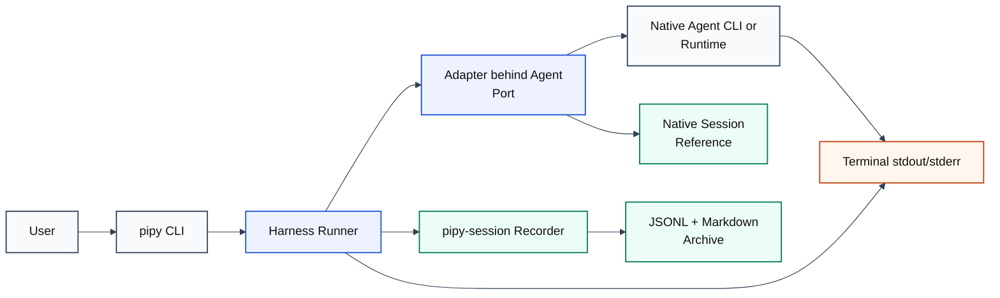
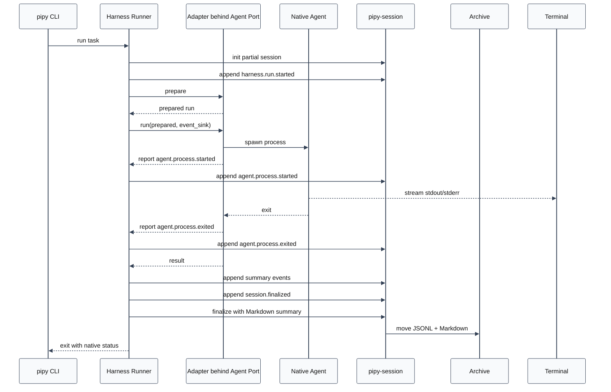
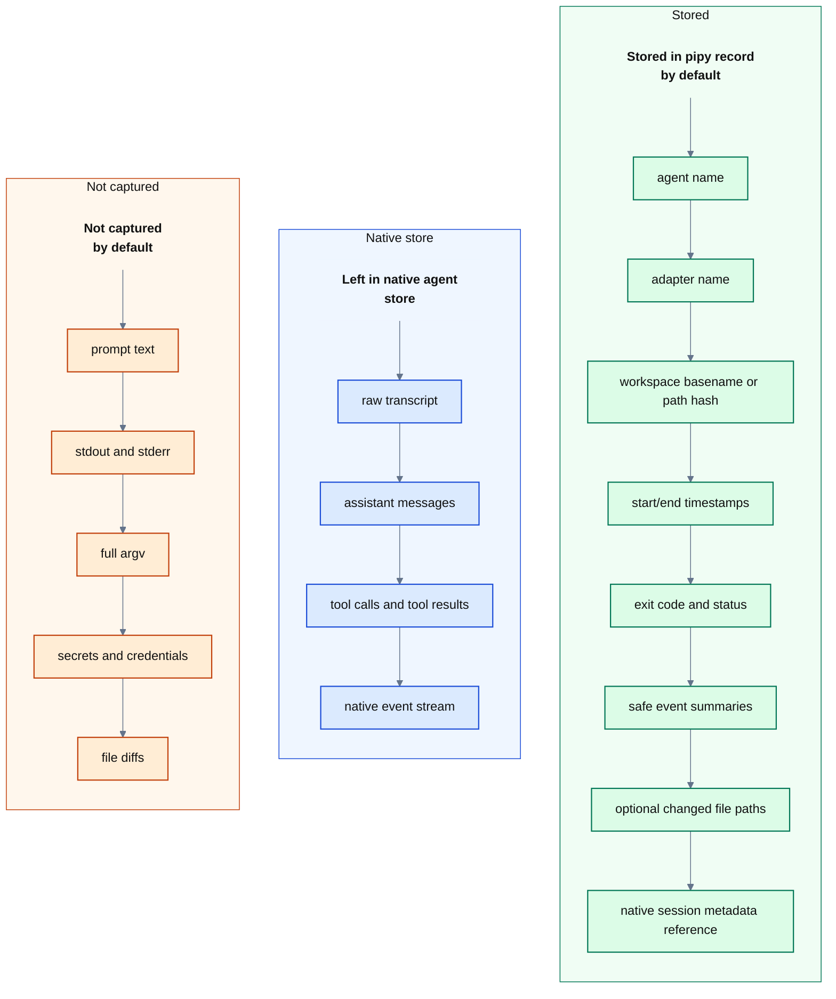

# Coding-Agent Harness Spec

Status: slice-22 OpenRouter provider support documented

<style>
.mermaid,
.mermaid svg {
  background: transparent !important;
  background-color: transparent !important;
}
</style>

## Goal

Build pipy's own coding-agent harness deliberately, starting with a small
local-first runner that can launch a coding agent, observe a conservative run
lifecycle, and write a durable pipy session record.

The first harness slice is not another session-capture feature by itself. It is
the foundation for pipy's own agent surface:

- a `pipy` CLI for running coding-agent tasks
- a harness core that owns run lifecycle and status
- adapter boundaries for current external agents
- a native pipy agent runtime behind the same interface
- integration with `pipy-session` for durable, privacy-conscious records

The existing `pipy-session` package remains the recorder and archive layer. The
harness should call it instead of creating a parallel transcript format.

## Non-Goals

- Do not build a broad transcript database.
- Do not import raw native transcripts by default.
- Do not store prompts, assistant messages, tool payloads, stdout, stderr,
  secrets, tokens, credentials, private keys, or sensitive personal data by
  default.
- Do not replace Codex, Claude Code, Pi, Aider, Goose, or Continue in the first
  slice.
- Do not implement a full native model/tool loop in the bootstrap slice.
- Do not add multi-agent orchestration, branching, compaction, repo maps,
  indexing, long-running daemons, or a web UI yet.
- Do not change the finalized session archive layout documented in
  `docs/session-storage.md`.
- Do not add a docs server unless the docs set grows enough to need navigation,
  search, preview, or publishing.

## Design Principles

- Local first. Runs execute from a local workspace and local state remains under
  user control.
- Small core, explicit adapters. The harness owns lifecycle; adapters own how a
  native agent is invoked and observed.
- Conservative capture. Store metadata and summaries that help future work, not
  raw conversations or command output.
- Native stores stay native. When an agent already keeps its own transcript,
  pipy may reference that native record without copying its contents.
- One lifecycle vocabulary. Codex, Claude, Pi, and future pipy-native runs should
  normalize into the same small event vocabulary where possible.
- Testable first slice. The initial implementation should be runnable with fake
  subprocess adapters and temporary session roots.
- Standard library first. New dependencies need a clear near-term payoff.

## Research Notes

### Pipy Foundation

The existing session recorder already establishes the storage invariants the
harness should reuse:

- active records live under `.in-progress/pipy/`
- finalized records move into `pipy/YYYY/MM/`
- JSONL is append-only while active
- finalized files are immutable
- Markdown summaries are intentional human-review artifacts
- catalog/search/inspect/verify avoid printing raw event bodies and payloads
- automatic capture is adapter-specific and partial by default

The harness should treat `pipy_session.recorder` as its durable event sink, and
`pipy_session.catalog` as the archive inspection surface.

### Flue Lessons

Local repo: `/Users/jochen/src/flue`

Useful ideas:

- Separate command modes. `flue run` is one-shot, `flue dev` is long-running,
  and `flue build` creates artifacts. Pipy should start with one-shot `pipy run`
  before designing watch mode, servers, or deployable artifacts.
- Keep a small event stream. Flue normalizes agent activity into events such as
  agent start, text deltas, tool start/end, turn end, command start/end,
  task start/end, compaction start/end, idle, and error. Pipy should define a
  smaller privacy-safe subset first.
- Keep pipeline behavior predictable. Flue prints the final result to stdout and
  sends progress, events, and logs to stderr. Pipy should follow the same CLI
  convention for harness output so `pipy run` composes in shell pipelines.
- Keep harness/session logic below UI and transport layers. Flue's CLI consumes
  events, but core session behavior is not embedded in the CLI.
- Discover runtime context from workspace files such as `AGENTS.md`, `CLAUDE.md`,
  skills, and directory listings, but avoid baking all context into build
  artifacts. Pipy can defer context discovery because external agents already do
  their own instruction loading.

Things not to borrow yet:

- Build and deploy targets.
- Server generation.
- Runtime tool APIs.
- Subagent execution.
- Compaction.

### Pi Lessons

Local repo: `/Users/jochen/src/pi-mono`

Useful ideas:

- Pi separates the small `Agent` event vocabulary from `AgentSession`, which
  composes lifecycle, persistence, settings, retry, compaction, and UI/RPC/print
  modes. This maps directly onto pipy's adapter/runner split: adapters observe
  and normalize events, while the runner owns lifecycle and persistence.
- `AgentSession` is the durable center. Interactive, print, RPC, and SDK modes
  sit on top of one lifecycle/session abstraction. Pipy should likewise keep
  `pipy run` thin and put lifecycle in a harness core.
- Pi supports in-memory sessions through `SessionManager.inMemory()` and
  `--no-session`. Pipy should use an in-memory recorder fake for unit tests and
  reserve real temporary session roots for integration tests.
- Pi uses JSONL session files with structured entries and a tree model. The tree
  model is powerful, but too broad for pipy's first harness slice.
- Pi separates a UUID session id from any human-facing display name. Pipy should
  likewise make `run_id` the stable identity and keep `slug` as a display and
  filename component.
- Pi's print mode and RPC mode show two useful future directions: a one-shot
  final-output path and a JSONL protocol for process integration.
- Pi distinguishes native session data, user-facing UI, extension state, and LLM
  context. Pipy should maintain a similar distinction between native agent
  transcript stores and pipy's conservative run records.
- Pi's session migrations are a warning for pipy because finalized pipy files
  are immutable. Pipy should version harness records from the first slice instead
  of planning in-place archive rewrites later.
- Pipy's lifecycle should complete recorder append/finalize work before the
  runner returns the native process exit code.

Things not to borrow yet:

- Session branching and `/tree`.
- In-place transcript migration.
- Extension UI and RPC protocol.
- Prompt template/skill expansion.
- Native model registry and OAuth handling.

### Web Research

Relevant external patterns:

- Codex CLI is a local coding agent that can read, edit, and run code in the
  selected directory. It has non-interactive `codex exec` and JSONL output where
  stdout becomes a stream of events such as `thread.started`, `turn.started`,
  `turn.completed`, `turn.failed`, `item.*`, and `error`.
  Sources: <https://developers.openai.com/codex/cli>,
  <https://developers.openai.com/codex/noninteractive>.
- Codex hooks receive JSON hook payloads with shared fields such as
  `session_id`, `transcript_path`, `cwd`, `hook_event_name`, and `model`.
  Source: <https://developers.openai.com/codex/hooks>.
- Claude Code hooks also provide lifecycle, prompt, tool, compaction, subagent,
  and session-end events with `transcript_path` and `session_id`. Hook stdout can
  affect context for some events, so pipy hook adapters must avoid accidental
  context injection unless explicitly designed.
  Source: <https://docs.claude.com/en/docs/claude-code/hooks>.
- OpenHands uses an append-only typed event log with message, action,
  observation, state update, error, and condensation events. Its
  action/observation split is useful prior art for later pipy event vocabulary,
  but slice 1 should stay at lifecycle metadata.
  Source: <https://docs.openhands.dev/sdk/arch/events>.
- Inspect AI writes structured eval logs with top-level metadata, samples,
  events, summaries, and APIs for reading headers or samples incrementally. Its
  log shape is useful prior art for keeping records stable enough for later UI,
  search, and analysis.
  Source: <https://inspect.aisi.org.uk/eval-logs.html>.
- OpenTelemetry GenAI semantic conventions define names such as
  `gen_ai.operation.name`, `gen_ai.agent.name`, and conversation identifiers.
  Pipy can keep its own event names while documenting a small mapping later.
  Source: <https://opentelemetry.io/docs/specs/semconv/gen-ai/>.
- Anthropic's Claude Agent SDK exposes a supported headless Python surface with
  `query()` as an async iterator and options such as `cwd`, `allowed_tools`, and
  `permission_mode`. A future Claude adapter should target a supported SDK shape
  before scraping hook output.
  Source: <https://github.com/anthropics/claude-agent-sdk-python>.
- pydantic-ai exposes `Agent.run`, `run_stream`, `iter`, and `RunContext`-based
  dependency injection. It is useful prior art for a future native pipy agent
  runtime behind the same harness port.
  Source: <https://ai.pydantic.dev/api/agent/>.
- Goose's `goose run` starts a session, executes provided instructions, exits,
  and supports `json` and `stream-json` output for automation. Goose also has an
  explicit `--no-session` mode and currently stores sessions in SQLite.
  Sources: <https://goose-docs.ai/docs/guides/running-tasks/>,
  <https://goose-docs.ai/docs/guides/sessions/session-management/>.
- Aider supports `--message` / `--message-file` for one-shot scripting and has a
  repository map concept that gives broad code context. The one-shot CLI shape is
  useful; repo maps should be deferred.
  Sources: <https://aider.chat/docs/scripting.html>,
  <https://aider.chat/docs/repomap.html>.
- Continue CLI headless mode uses `cn -p` for single tasks and requires explicit
  write/tool permissions in headless mode. Pipy should likewise make permission
  posture explicit instead of guessing.
  Source: <https://docs.continue.dev/cli/headless-mode>.
- LangGraph, smolagents, AutoGen, and CrewAI provide vocabulary for checkpoints,
  step callbacks, teams, and task processes, but they are too framework-heavy for
  pipy's first local harness slice.
  Sources: <https://docs.langchain.com/oss/python/langgraph/persistence>,
  <https://huggingface.co/docs/smolagents/reference/agents>,
  <https://microsoft.github.io/autogen/stable/reference/python/autogen_agentchat.teams.html>,
  <https://docs.crewai.com/en/concepts/crews>.
- Zensical can turn Markdown into a documentation site, serve previews, and use
  Mermaid through Markdown extensions, but this project does not need a docs
  server for one spec file.
  Sources: <https://zensical.org/docs/create-your-site/>,
  <https://zensical.org/docs/setup/extensions/>.

## Core Concepts

### Task

A user-requested unit of work. In the first slice, a task is just metadata plus
the external command being run. Later it may include structured prompts,
permissions, workspace policy, expected outputs, or evaluation criteria.

`slug` is a human-facing label and filename component. It is not the stable
identity of a run.

Suggested fields:

- `slug`
- `goal` or short description
- `workspace`
- `agent`
- `created_at`

### Agent

The logical agent selected for the task, such as `codex`, `claude`, `pi`, or
future `pipy-native`.

An agent is not the same as an adapter. The agent is the product-facing choice;
the adapter is the implementation that knows how to run it.

### Agent Port

The protocol the Runner calls to execute an agent. The port is stable harness
surface; adapters are concrete implementations behind it.

Suggested methods:

- `prepare(task, command, cwd) -> PreparedRun`
- `run(prepared, event_sink) -> AdapterResult`

### Adapter

The concrete implementation behind the harness agent port, such as a
subprocess-backed adapter, Codex adapter, Claude adapter, or future pipy-native
runtime adapter.

Responsibilities:

- validate that the native command can be run
- construct the process invocation or hook behavior
- normalize observable lifecycle events into harness events
- optionally report a native session reference
- return exit status and timing

Non-responsibilities:

- storing pipy records directly
- importing raw transcripts by default
- deciding long-term product policy

Adapters report events; the Runner records them. No adapter may mutate a pipy
session record directly.

### Run

One execution of a task through one adapter.

`run_id` is the stable identity of the execution and should be generated by the
Runner before recording starts. `slug` remains a display label and filename
component. Multiple runs may share the same slug.

Aggregate boundary: one Run equals one durable pipy record file and one recorder
unit of work. Only the owning Runner mutates that record.

Suggested fields:

- `run_id`
- `task`
- `agent`
- `adapter`
- `workspace`
- `status`
- `started_at`
- `ended_at`
- `exit_code`
- `session_record`

`session_record` should be a small structured reference to the pipy-side record,
not the raw record body. Suggested fields: active path while running, finalized
JSONL path after finalize, optional Markdown summary path, and capture marker.

### Run Event

A privacy-safe event emitted by the harness or adapter. Run events are not raw
native transcript events. They should be stable enough to support later UI,
search, and analysis.

Every harness event should carry:

- `event_id`: stable unique identifier within the run record
- `run_id`: stable run identity
- `sequence`: monotonically increasing integer assigned by the Runner
- `timestamp`: ISO-8601 timestamp

The first recorded event should also include `harness_protocol_version`. Start
versioning records in the first slice so finalized JSONL files do not need
in-place migration later.

Initial event vocabulary:

- `harness.run.started`
- `harness.run.completed`
- `harness.run.failed`
- `agent.process.started`
- `agent.process.exited`
- `agent.native_session.referenced`
- `workspace.files.changed`
- `verification.performed`
- `session.finalized`

`session.finalized` is a harness lifecycle event. It is appended by the Runner
just before the recorder unit of work is closed and moved into the finalized
archive.

Potential later events:

- `agent.turn.started`
- `agent.turn.completed`
- `agent.tool.observed`
- `agent.approval.requested`
- `agent.approval.resolved`
- `agent.idle`
- `artifact.created`

### Artifact

A durable output from the run. In the first slice this should mean only safe,
explicit artifacts such as a generated file path or final summary path. It
should not mean raw stdout/stderr, prompts, assistant messages, tool payloads,
or diffs.

### Native Session Reference

A metadata-only reference to an external agent's own session record.

Allowed by default:

- source filename
- source file size
- source mtime
- hash of resolved absolute path
- whether raw content was imported: always `false` by default

Disallowed by default:

- absolute source path
- raw native transcript body
- prompt text
- assistant text
- tool args/results

### Pipy Session Record

The durable pipy-side run record stored through `pipy-session`. It is a summary
and event trail for future review, not a complete transcript.

## Architecture



Important boundaries:

- CLI parses user intent and passes it to the harness core.
- Harness core owns run lifecycle and recorder integration.
- Agent port defines the protocol the Runner calls.
- Concrete adapters own native agent invocation details.
- Recorder owns active/finalized session file lifecycle.
- Native transcript stores remain outside pipy's archive unless explicitly
  referenced.

Wiring should use explicit constructor injection:

```text
Runner(agent_port, recorder, capture_policy, clock=..., id_factory=...)
bootstrap(agent_name, root) -> Runner
```

No dependency injection framework or global adapter registry is needed in the
first slice. A small bootstrap selector is enough.

### Capture Policy

Capture policy should be a value object passed to the Runner rather than a set
of scattered flags.

Suggested fields:

- `record_argv`: default `false`
- `record_stdout`: default `false`
- `record_stderr`: default `false`
- `record_file_paths`: default `false`, set by `--record-files`
- `import_raw_transcript`: default `false`
- `workspace_path_mode`: `basename_and_hash` by default

### Recorder Unit of Work

Treat the recorder integration as a unit of work:

```text
with recorder.session(run) as session:
    session.append(...)
```

The concrete API may differ, but the semantics should be the same: initialize an
active record, append lifecycle events while the run is active, and finalize the
record exactly once on success, failure, abort, or adapter exception. Finalize
failure should be explicit rather than silently returning a successful run.

## Adapter Boundary

This section describes the concrete data exchanged through the `AgentPort`
methods defined above.

`PreparedRun` should include:

- display-safe command label
- executable name
- resolved working directory
- redacted or omitted argv metadata

`AdapterResult` should include:

- status
- exit code
- start/end timestamps or duration
- optional native session reference
- safe changed-file paths if collected

The event sink is Runner-owned. It may assign `event_id` and `sequence` before
appending to the recorder. A concrete adapter should not expose full command
output to the recorder. It may stream the native process to the user's terminal.

Concrete adapter examples:

- `SubprocessAdapter`
- `CodexAdapter`
- `ClaudeAdapter`
- `PipyNativeAdapter`

### Native Runtime Bootstrap

The native bootstrap slice adds `PipyNativeAdapter` behind the same
`AgentPort`. It does not shell out to Codex, Claude, Pi, or another coding-agent
CLI. The adapter prepares one native turn, constructs a `NativeAgentSession`,
calls a provider through a minimal `ProviderPort`, and invokes a deterministic
no-op tool through a minimal `ToolPort` only when the provider result contains
one sanitized supported no-op intent.

The deterministic `fake` provider remains the default for tests and smoke runs.
It is not a production AI provider and it does not require credentials. A smoke
run is:

```sh
uv run pipy run --agent pipy-native --slug native-smoke --goal "Native bootstrap smoke"
```

The first real provider is the OpenAI Responses API provider. It is selected
explicitly, reads credentials from `OPENAI_API_KEY`, requires `--native-model`,
uses pipy's internally built system prompt as the Responses API `instructions`
field, uses the short native goal as `input`, and requests `store: false`:

```sh
uv run pipy run --agent pipy-native --native-provider openai --native-model <model> --slug openai-smoke --goal "Say hello briefly"
```

The OpenAI provider uses a small injectable standard-library HTTP boundary so
tests can provide fake responses without live credentials or network access. It
does not enable built-in tools, function calling, web search, file search, code
interpreter, computer use, conversation state, background mode, streaming,
retries, model fallback, OAuth, or a provider registry.

The second real provider is the OpenRouter Chat Completions provider. It is
selected explicitly, reads credentials from `OPENROUTER_API_KEY`, requires
`--native-model`, sends pipy's internally built system prompt and short native
goal as `system` and `user` chat messages, and makes one non-streaming request
to `https://openrouter.ai/api/v1/chat/completions`:

```sh
uv run pipy run --agent pipy-native --native-provider openrouter --native-model <provider/model> --slug openrouter-smoke --goal "Say hello briefly"
```

Official OpenRouter docs checked on 2026-05-07 document bearer API-key
authentication, the `/api/v1/chat/completions` endpoint, `model` identifiers
such as `openai/gpt-5.2` and `google/gemini-2.5-pro-preview`, request
`messages`, non-streaming `choices` responses with message content, and token
usage fields such as `prompt_tokens`, `completion_tokens`, and `total_tokens`.
The OpenRouter provider maps those usage counters to pipy's normalized
`input_tokens`, `output_tokens`, and `total_tokens` metadata and omits unknown,
unavailable, negative, non-finite, or provider-native usage fields. It does not
send OpenRouter app-attribution headers, debug options, provider routing
preferences, plugins, tools, function calling, streaming, retries, fallback
routing, OAuth, or provider-side tool settings. It does not store raw request
bodies, raw provider responses, provider response ids, prompts, model output,
auth material, or provider-native payloads in JSONL, Markdown, or
`--native-output json`.

### OpenAI Subscription-Backed Native Auth Decision

Decision: `blocked-for-now`.

Decision date: 2026-05-07.

Official sources checked:

- [OpenAI API authentication](https://developers.openai.com/api/reference/overview):
  the REST API uses API keys provided as HTTP bearer credentials, and usage is
  attributed to an API organization or project.
- [ChatGPT Plus help](https://help.openai.com/en/articles/6950777-what-is-chatgpt-plus):
  ChatGPT Plus is a subscription for the ChatGPT web app, and API usage is
  separate and billed independently.
- [ChatGPT web and API billing help](https://help.openai.com/en/articles/9039756):
  ChatGPT and the API platform use separate billing systems.
- [Codex authentication](https://developers.openai.com/codex/auth): Codex
  supports ChatGPT subscription sign-in and API-key sign-in for OpenAI models,
  but the documented ChatGPT sign-in flow is for the Codex app, CLI, and IDE
  extension.
- [Codex pricing](https://developers.openai.com/codex/pricing): Codex
  subscription access is described for Codex product surfaces, while API-key
  usage pays standard API rates.
- [Codex SDK](https://developers.openai.com/codex/sdk): the SDK controls local
  Codex agents programmatically; it is a Codex product integration surface, not
  a generic OpenAI model provider auth API for third-party native runtimes.

What was checked: ChatGPT subscription versus OpenAI API billing, OpenAI API
authentication, Codex CLI authentication and device-code sign-in behavior,
Codex pricing, and the Codex SDK surface. The checked official docs currently
show a supported API-key path for direct API calls and a supported
subscription-backed sign-in path for Codex product clients. They do not document
an official, stable, locally usable OAuth or device-code provider auth flow that
lets a third-party native application call OpenAI models directly using a
ChatGPT or Codex subscription without running Codex itself.

Implication: `pipy-native` must not implement OpenAI subscription-backed native
provider auth in this slice. The existing `--native-provider openai` Responses
API provider remains the OpenAI baseline and continues to require
`OPENAI_API_KEY` plus `--native-model`. Pay-by-token API usage remains
compatible but is not promoted as the preferred self-bootstrap path.

Rejected approaches:

- scraping or reusing ChatGPT, browser, Codex CLI, or IDE extension credential
  stores
- copying access tokens, refresh tokens, cookies, authorization headers, or
  cached `auth.json` values into pipy
- reverse engineering private product endpoints or token refresh behavior
- wrapping Codex, ChatGPT, Claude Code, or another product UI/CLI as
  `pipy-native`'s provider implementation
- archiving any auth material, raw provider response, prompt, model output, or
  provider-native payload

Provider priority after this decision: OpenRouter provider support with
explicit model selection is implemented as the next provider-access path, and
the backlog can continue to the bounded post-tool provider turn work. Local
model provider integrations remain deferred pending benchmark work, and
Anthropic subscription-backed native provider support is not promoted to the
near-term provider priority.

The native tool boundary defines explicit request/result/status value objects
plus approval and sandbox policy data. The native provider-to-tool bridge first
converts provider metadata into a sanitized internal `NativeToolIntent`; raw
provider tool-call objects are never archived. The only supported intent in the
current slice is `noop` / `internal_noop`. The only implemented tool is the
deterministic fake no-op tool. It does not read, write, edit, delete, diff,
inspect, or execute anything in the workspace. Its current role is to prove
event shape, lifecycle, dependency injection, and privacy-safe records before
real permission prompts or sandbox enforcement exist.

Native runs emit only privacy-safe lifecycle metadata:

- `native.session.started`
- `native.provider.started`
- `native.provider.completed`
- `native.provider.failed`
- `native.tool.intent.detected`
- `native.tool.started`
- `native.tool.completed`
- `native.tool.failed`
- `native.tool.skipped`
- `native.session.completed`

Payloads may include safe labels such as `provider`, `model_id`,
`system_prompt_id`, `system_prompt_version`, `status`, `exit_code`, duration,
normalized usage counters, provider response storage booleans, tool name/kind,
approval policy label, sandbox policy label, storage booleans, and
conservative sanitized error metadata. Normalized provider usage is limited to
finite non-negative `input_tokens`, `output_tokens`, `total_tokens`,
`cached_tokens`, and `reasoning_tokens`; unknown provider-native usage keys and
unavailable counters are omitted rather than guessed. Payloads must not include
the full system prompt, user prompt text beyond the existing short `--goal`
session metadata, model output, raw HTTP request or response bodies, raw
provider usage payloads, tool arguments, tool payloads, stdout, stderr, diffs,
file contents, secrets, tokens, credentials, private keys, or sensitive
personal data.

The native session owns system prompt construction internally. Archive records
store `system_prompt_id` and `system_prompt_version`, not the prompt text. The
provider's final text is not stored in JSONL or Markdown by default. If the
provider succeeds with no safe intent, the session completes without emitting
tool lifecycle events. If the provider fails, the no-op tool path is recorded
as `native.tool.skipped`; if a safe no-op intent is detected and the no-op tool
fails, the native run fails without printing provider final text.

The current native stdout decision is to preserve the human-readable default:
successful provider final text prints to stdout and nothing else in the native
success path is written there by the harness. Session finalization notices,
diagnostics, progress, provider errors, and other harness messages go to
stderr. Failed native runs do not print provider final text to stdout.
Structured machine-readable native stdout is available only through explicit
`--native-output json`; it is not part of the default
`pipy run --agent pipy-native` contract.

### Native Structured Stdout JSON Mode

Structured native stdout is an explicit opt-in contract. The default stays
unchanged: successful `pipy-native` runs print provider final text only, failed
native runs print no provider final text, and diagnostics, finalization
notices, provider errors, and harness errors remain on stderr.

The implemented flag shape is:

```sh
uv run pipy run --agent pipy-native --native-output json ...
```

Omitting the flag preserves the current human-readable stdout mode. The JSON
mode emits one final JSON object to stdout after the native run and recorder
finalization attempt complete. It is not a JSONL stream, does not interleave
progress events, and does not change the process exit-code contract.
`--native-output` is rejected for non-native agents before creating a session
record. If a later streaming protocol is needed, it should use a separate
explicit mode or flag with its own schema decision.

The JSON object is versioned and metadata-only. Current fields are limited to
summary-safe values:

- `schema`: `pipy.native_output`
- `schema_version`: `1`
- `run_id`
- `status` and `exit_code`
- `agent`, adapter, provider, and model labels
- `duration_seconds`
- normalized usage counters already allowed in archives, when available
- finalized JSONL and Markdown record path references
- storage booleans such as `prompt_stored=false`,
  `model_output_stored=false`, `raw_transcript_imported=false`, and
  `tool_payloads_stored=false`

Structured stdout must remain aligned with the archive privacy policy. It must
not emit raw system prompts, raw user prompts, model output, provider
responses, provider-native payloads, tool arguments, tool results, tool
payloads, stdout, stderr, diffs, patches, file contents, secrets, credentials,
tokens, private keys, or sensitive personal data by default. JSON mode is
therefore a status and metadata surface, not a replacement transcript or a way
to expose final model text.

### Native Fake Tool Intent

The native fake tool-intent slice implements the smallest provider-to-tool path
that proves contract and lifecycle behavior without adding real execution
powers. It remains bounded, deterministic, and metadata-only in the pipy
archive.

The smallest useful loop is:

1. Build the internal native system prompt and one user goal, as the current
   native session does.
2. Call the selected provider through `ProviderPort`.
3. Interpret the provider result as either final text or one sanitized internal
   tool-request intent.
4. If there is no tool intent, complete the native session and print provider
   final text only on success.
5. If there is one supported tool intent, invoke only the injected no-op
   `ToolPort`, record privacy-safe tool lifecycle metadata, and then complete
   the session with a bounded fake result path.
6. If provider or tool status is not successful, fail the native session and do
   not print provider final text.

This is intentionally not a general model/tool loop. A later real loop may
feed a sanitized tool-result observation back to a provider for another model
turn, but this slice keeps the first implementation to at most one
fake provider-emitted intent and one no-op tool invocation.

Provider-owned raw response content remains provider-owned. Pipy may parse a
provider response inside the provider boundary, but the archive must store only
safe lifecycle fields. Raw provider response bodies, raw model messages,
provider-native tool-call payloads, function arguments, output text, and
provider-specific request ids that could reveal payload content must not be
written to JSONL or Markdown by default.

The internal tool-request intent is a sanitized value produced after provider
parsing, not the raw provider tool-call object. Allowed fields are limited to:

- `request_id`: a pipy-generated opaque id, deterministic in tests. The current
  `native-tool-0001` value is acceptable only while the no-op path has at most
  one invocation per native session; later loop work should generate a
  per-invocation id from pipy-owned turn/request position data.
- `tool_name`: an allowlisted safe label such as `noop`.
- `tool_kind`: an allowlisted safe category such as `internal_noop`.
- `turn_index`: a small integer assigned by pipy.
- `intent_source`: a safe label such as `fake_provider` or `provider_metadata`.
- `approval_policy`: the policy label already represented by
  `NativeToolApprovalPolicy`.
- `approval_required`: a boolean derived from approval policy data.
- `sandbox_policy`: the policy label already represented by
  `NativeToolSandboxPolicy`.
- `filesystem_mutation_allowed`, `shell_execution_allowed`, and
  `network_access_allowed`: booleans derived from sandbox policy data.
- `tool_payloads_stored`, `stdout_stored`, `stderr_stored`, `diffs_stored`, and
  `file_contents_stored`: booleans that remain `false` for the no-op slice.
- optional sanitized metadata containing only counters, booleans, enum labels,
  and short non-secret identifiers.

The internal tool-request intent must not contain or persist raw prompts, model
output, raw provider responses, provider-native tool-call objects, tool
arguments, shell commands, filesystem paths selected by the model, file
contents, diffs, patches, stdout, stderr, credentials, tokens, private keys,
API keys, or sensitive personal data. If a provider can only express a tool
request through raw arguments, the provider adapter must convert that into an
allowlisted intent in memory and drop the raw payload before emitting events.
Unsupported or unsafe provider requests should become sanitized failures or
safe skipped-tool records, not archived payloads.

Deterministic fake behavior remains the first implementation target. The fake
provider has an explicit fixture field that writes one allowlisted
`ProviderResult.metadata` key asking for a no-op intent. That fixture path does
not inspect the prompt, echo the prompt, or derive archived content from prompt
text. The fake no-op tool continues to return deterministic safe metadata
showing that the workspace was not inspected or mutated and that no stdout,
stderr, or tool payloads were stored.

The no-op tool is now an injected smoke-test and unit-test tool rather than a
mandatory part of every successful native provider run. Production native runs
do not execute an implicit tool when a provider returns only final text; tool
invocation is driven by an explicit sanitized intent.

The expected lifecycle for a safe fake intent is:

```text
native.session.started
native.provider.started
native.provider.completed
native.tool.intent.detected        # metadata-only, emitted only for a safe intent
native.tool.started
native.tool.completed | native.tool.failed | native.tool.skipped
native.session.completed
```

Provider failure should still record `native.provider.failed` followed by
`native.tool.skipped` with a safe reason. A provider success with no intent
should not emit `native.tool.started`. A provider success with an unsupported
or unsafe intent should not emit `native.tool.intent.detected` or
`native.tool.started`; it should emit only a metadata-only skipped or failed
lifecycle event with safe labels and no raw payload.

### Native Post-Tool Provider Turn Decision

The current native runtime remains bounded to one provider turn plus, only when
the provider result exposes one safe supported intent, one injected fake no-op
tool invocation. After `native.tool.completed`, the session emits
`native.session.completed`; it does not call the provider again and does not
emit another `native.provider.started` event.

A post-tool provider turn remains deferred even though the summary-safe
observation boundary is now documented below. Adding that turn would move the
native path toward a real agent loop, so the runtime must also design approval
prompts, sandbox enforcement, and real execution behavior before any provider
can receive an observation from a tool result.

If a future slice adds a post-tool provider turn, the archive may record only
summary-safe metadata such as turn index, provider and model labels, status,
duration, normalized usage counters, provider response storage booleans, prompt
and model-output storage booleans, safe tool-observation labels, and storage
booleans for tool payloads, stdout, stderr, diffs, and file contents. It must
not archive raw tool result payloads, stdout, stderr, diffs, file contents,
prompts, model output, provider responses, provider-native tool-call objects,
function arguments, secrets, credentials, private keys, tokens, or sensitive
personal data.

### Native Approval And Sandbox Enforcement Baseline

Approval and sandbox enforcement are future gates for native tools. This
baseline defines the contract before real read tools, write tools, shell
execution, network access, verification commands, live approval prompts, or
runtime sandbox enforcement exist. The current `pipy-native` runtime remains
bounded to one provider turn plus optional one fake no-op tool invocation. It
does not add live approval prompts, sandbox enforcement, real repo reads,
provider-visible repo context forwarding, live observation emission, archive
writes for live context or real execution, a post-tool provider call, or a
general model/tool loop.

Approval decision labels are `pending`, `allowed`, `denied`, `skipped`, and
`failed`.

- `pending`: approval is required but has not been resolved yet.
- `allowed`: approval was not required or was granted by a pipy-owned approval
  authority.
- `denied`: approval was requested and refused.
- `skipped`: the request did not reach approval or execution because an earlier
  policy, capability, sandbox, path, context, or safety gate skipped it.
- `failed`: approval resolution or gate processing failed without a safe
  denial or skip decision.

Approval is not delegated to provider output. A future provider may request an
operation only through a sanitized internal pipy request; pipy decides whether
approval is required and records only safe decision metadata. The minimum
future approval posture is:

- no approval required for internal no-op tools with `no-workspace-access`, no
  shell execution, no network access, no repo context production, no stdout or
  stderr storage, and no workspace inspection or mutation
- approval required for read-only workspace tools before any file read, search,
  directory inspection, or provider-visible repo context production
- approval required for write tools, patch proposal apply, file creation,
  deletion, rename, edit, diff application, or any mutating workspace action
- approval required for shell execution, even when intended to be read-only
- approval required for network access, even when no workspace access is
  requested
- approval required for verification commands such as a future allowlisted
  `just check`, because they may execute code, inspect the workspace, and emit
  stdout or stderr even when archives omit that output

Sandbox modes remain the three labels already represented in native value
objects:

- `no-workspace-access`: the request may not inspect, read, write, diff, patch,
  list, search, or otherwise resolve workspace paths.
- `read-only-workspace`: the request may inspect only approved, validated,
  bounded workspace sources and may not mutate files or execute shell commands
  unless separate gates explicitly allow those capabilities.
- `mutating-workspace`: the request may mutate only approved, validated
  workspace paths and only through the specific future tool contract that
  requested the capability.

Shell execution and network access are independent capability booleans, not
implicit consequences of a workspace sandbox mode. The baseline capability
booleans are `workspace_read_allowed`, `filesystem_mutation_allowed`,
`shell_execution_allowed`, and `network_access_allowed`. A read-only workspace
sandbox does not imply shell execution. A mutating workspace sandbox does not
imply network access. Shell execution does not by itself permit filesystem
mutation; mutating workspace files through shell execution requires both
`shell_execution_allowed` and `filesystem_mutation_allowed`. Network access
does not imply workspace access.

Future tool execution must use this fixed gate order before any real effect:

1. Policy validation: the request must name a supported tool kind, approval
   policy, sandbox mode, and capability booleans.
2. Request normalization and identity: raw provider payloads are converted to a
   sanitized pipy-owned request with pipy's `tool_request_id` and `turn_index`;
   provider-owned ids, raw args, and provider-native payloads are dropped.
3. Approval gate: if approval is required, resolve it through a pipy-owned
   approval path before sandbox or path work proceeds.
4. Sandbox capability gate: compare the approved request with the selected
   sandbox mode and independent capability booleans.
5. Path and context validation: validate pipy-owned scope, workspace-relative
   path labels, ignore/generated-file boundaries, size limits, encodings, and
   redaction rules before any read, write, shell, network, verification, or
   provider-visible context production.
6. Execution gate: execute only if all earlier gates succeeded; otherwise emit
   metadata-only skipped or failed lifecycle metadata.
7. Observation and provider-context gate: derive only sanitized in-memory
   observations or provider-visible context after execution, and archive only
   metadata allowed by this spec.

All future gates fail closed. Missing policy, unsupported approval mode,
unsupported sandbox mode, denied approval, unavailable approval UI, sandbox
mismatch, unsafe request data, model-selected paths, provider-supplied paths,
raw args, unsupported encodings, ignored or generated files, oversized sources,
secret-looking data, and attempted capability escalation must not execute. The
safe outcome is a metadata-only `skipped`, `denied`, or `failed` decision with
safe reason labels. Capability escalation includes any request that asks for
more than its approved policy permits, such as a read tool attempting mutation,
a verification command attempting network access without the network gate, or a
shell request attempting workspace mutation without both shell and mutation
gates.

Future archives, Markdown summaries, and `--native-output json` may record only
metadata-only approval and sandbox fields:

- policy labels, sandbox mode labels, approval required/resolved booleans, and
  decision labels
- safe reason labels and supported capability booleans, including
  `workspace_read_allowed`, `filesystem_mutation_allowed`,
  `shell_execution_allowed`, and `network_access_allowed`
- `tool_request_id`, `turn_index`, safe tool name/kind labels, status,
  `duration_seconds`, counts, byte and line counts, redaction/skipped booleans,
  storage booleans, and optional finalized-record references

Archives, Markdown summaries, and default structured stdout must not store raw
prompts, model output, provider responses, provider-native payloads, raw tool
payloads, stdout, stderr, diffs, patches, full file contents, shell commands,
raw args, model-selected paths, provider-selected paths as authority, secrets,
credentials, API keys, tokens, private keys, or sensitive personal data.
Storage booleans must remain explicit, and metadata-only archives must not
become raw execution, transcript, repo-context, stdout, stderr, diff, patch, or
file-content stores.

This baseline is a prerequisite for bounded read-only tools, provider-visible
repo context production, write tools, patch application, shell or network
access, and verification commands. It does not imply that the current runtime
enforces approvals or sandboxing. Future implementation slices must wire these
gates explicitly and keep the existing pipy-owned `tool_request_id`,
`turn_index`, `native.tool.observation.recorded`, `duration_seconds`, storage
booleans, provider-visible context, and metadata-only archive contracts in
sync.

### Native Read-Only Tool Request Value Objects

The first bounded read-only implementation needed stable native data contracts
before it could read files or run searches. The implemented native model
surface includes read-only workspace inspection value objects. These value
objects are now consumed by the direct explicit file excerpt tool described
below, but the default `NativeAgentSession` runtime still does not create,
archive, execute, or provider-forward these requests.

Read-only request kind labels are limited to:

- `explicit-file-excerpt`: a future approved, bounded explicit file excerpt
  request
- `search-excerpt`: a future approved, bounded search-result excerpt request

`NativeReadOnlyToolLimits` represents the same upper bounds as the
provider-visible repo context policy:

- per excerpt: 4 KiB and 80 lines
- per source file per provider turn: 8 KiB and 160 lines
- total provider-visible repo context per provider turn: 24 KiB and 480 lines
- maximum excerpts per provider turn: 12
- maximum distinct source files per provider turn: 6

The value object validates that the represented limits do not exceed those
policy caps. These limits remain metadata and do not authorize execution by
themselves.

`NativeReadOnlyToolRequest` carries only metadata-only contract fields:

- pipy-owned `tool_request_id` and `turn_index`
- safe request kind, tool name, and tool kind labels
- `NativeToolApprovalPolicy` with `required` as the read-only default
- `NativeToolSandboxPolicy` with `read-only-workspace`,
  `workspace_read_allowed=true`, and `filesystem_mutation_allowed=false`,
  `shell_execution_allowed=false`, and `network_access_allowed=false`
- bounded limit metadata
- optional `scope_label` placeholders that are labels, not path authority
- storage booleans that remain false for tool payloads, stdout, stderr, diffs,
  file contents, prompts, model output, provider responses, and raw transcript
  import

The inert read-only request shape must not include raw prompts, model output,
provider responses, provider-native payloads, raw tool payloads, stdout,
stderr, diffs, patches, full file contents, excerpt text, search result text,
shell commands, raw args, model-selected paths, provider-selected paths as
authority, secrets, credentials, API keys, tokens, private keys, or sensitive
personal data. `scope_label` is intentionally not a resolved filesystem path,
not a provider/model-selected path, and not authority to read anything.

Adding these value objects did not add live approval prompts, default-session
sandbox enforcement, search execution, provider-visible repo context
forwarding, live observation emission, archive writes for live context or real
execution, a post-tool provider call, or a general model/tool loop.

### Native Explicit File Excerpt Tool

The first real bounded native read-only workspace tool is the direct
`NativeExplicitFileExcerptTool`. It is not wired into `NativeAgentSession` by
default. Tests and future slices can exercise it directly with explicit
pipy-owned data:

- `NativeReadOnlyToolRequest` with request kind `explicit-file-excerpt`,
  pipy-owned `tool_request_id="native-tool-0001"`, `turn_index=0`, required
  approval policy, read-only sandbox policy, `workspace_read_allowed=true`, and
  mutation, shell, and network booleans all false
- `NativeReadOnlyGateDecision` with pipy-owned decision authority and one of
  the safe labels `allowed`, `denied`, `skipped`, or `failed`
- `NativeExplicitFileExcerptTarget` with a pipy-owned normalized
  workspace-relative target; provider/model authority is rejected

The tool enforces this fixed order before reading:

1. request kind, identity, approval policy, sandbox mode, and capability
   posture are checked
2. approval gate data must be present and `allowed`
3. the target must be pipy-owned, normalized, relative to the workspace, not
   absolute, not `..` escaping, not shell-expanded, not Windows-drive based,
   not sensitive-looking, and still inside the workspace after symlink
   resolution
4. conservative ignored/generated-file checks run before reading, including
   obvious generated directories and suffixes plus simple root `.gitignore`
   patterns; fuller ignore semantics remain deferred
5. the source must exist, be regular, readable by mode bits, UTF-8 text, not
   binary/control-content, not secret-looking, and within the configured byte
   and line limits

Limits are enforced before an excerpt can become provider-visible in memory.
The direct implementation never raises the documented caps from
`NativeReadOnlyToolLimits`; if a configured limit is zero or the file exceeds
the effective per-excerpt, per-source-file, or total-context byte or line
limit, the result is skipped with a safe reason label. Oversized files fail
closed rather than being partially streamed in this first slice.

Successful reads return `NativeExplicitFileExcerptResult` with a
`NativeInMemoryFileExcerpt` containing the sanitized excerpt text. That text is
an in-memory candidate for a later provider-visible context slice only. It is
not archived, not emitted as a native lifecycle event, not printed to stdout,
not included in `--native-output json`, not sent to the provider by the current
runtime, and not converted into `native.tool.observation.recorded`.

Archive/event-facing metadata for this direct tool is available only through
the result's metadata helper. That helper includes safe labels, status, reason,
`duration_seconds`, approval decision metadata, sandbox labels and capability
booleans including `workspace_read_allowed`, byte and line counts, excerpt and
distinct-source counts, a short source label, a path hash, `tool_request_id`,
`turn_index`, and false storage booleans. It excludes raw excerpt text, file
contents, search result text, stdout, stderr, diffs, patches, shell commands,
raw args, prompts, model output, provider responses, provider-native payloads,
secrets, credentials, tokens, private keys, and sensitive personal data.

The default native runtime remains unchanged by this direct tool boundary: no
live approval prompts, no default repo reads, no default search execution, no
provider-visible context forwarding, no live observation emission, no archive
writes for live context or real execution, no post-tool provider call, and no
general model/tool loop.

### Native Provider-Visible Repo Context Policy

Provider-visible repo context is future provider input, not archive content.
This policy decides the smallest boundary for bounded native read tools and one
deferred post-tool provider turn. The direct explicit-file-excerpt tool can now
produce an in-memory excerpt result, but the default `NativeAgentSession`
runtime does not construct provider-visible repo context, does not read files or
run searches for repo context, does not forward repo context to a provider,
does not emit live observations, and does not add a post-tool provider call.

Allowed future source types are limited to explicitly bounded, sanitized
context produced after approval and sandbox checks exist:

- bounded explicit file excerpts from approved read-only file requests
- bounded search-result excerpts from approved read-only search requests
- explicit per-turn workspace summaries authored by pipy or the user, not broad
  repo maps or persistent workspace summaries
- short user-provided goal metadata that is already safe enough to send to the
  provider for the current run
- sanitized tool-observation summaries derived from
  `native.tool.observation.recorded` metadata and safe in-memory observation
  labels

Forbidden source types and content must never become provider-visible repo
context through this policy:

- broad repo maps, unbounded file contents, persistent workspace summaries, or
  arbitrary directory listings
- raw diffs, patches, stdout, stderr, shell command output, raw tool payloads,
  raw tool arguments, provider-native tool-call or tool-result payloads, raw
  provider responses, model output, or prompt fragments
- model-selected paths or provider-supplied paths as trusted read targets
- generated files, ignored files, binary or unreadable files, unsupported
  encodings, and large files unless a later bounded-read shape explicitly
  permits a sanitized summary
- secrets, credentials, API keys, tokens, private keys, and sensitive personal
  data

The first live implementation must encode limits no larger than these values
before any real read occurs or any context is sent to a provider:

- per excerpt: 4 KiB and 80 lines
- per source file per provider turn: 8 KiB and 160 lines
- total provider-visible repo context per provider turn: 24 KiB and 480 lines
- maximum excerpts per provider turn: 12
- maximum distinct source files per provider turn: 6

These are upper bounds, not targets. A later slice may choose smaller values for
the first read tool. Raising any limit requires an explicit docs and test update
before runtime wiring changes.

Provider-visible paths are labels, not authority. A future read request must be
authorized from pipy-owned scope and approval data before any path is resolved.
When a path is included for provider context, prefer a normalized relative
workspace path only after it has been validated to stay inside the workspace and
outside ignored or generated areas. If a relative path is sensitive or unsafe to
show, use a source label plus a stable path hash or omit the path. Raw
model-selected paths, provider-supplied paths, absolute paths, shell-expanded
paths, and paths derived from raw tool arguments must not be trusted or
archived as context identity.

Redaction happens before provider visibility. Unsafe data must be dropped or
skipped in memory before provider-visible context is produced; it must not be
archived first and redacted later. Secret-looking keys or values, credentials,
tokens, private keys, sensitive personal data, unsupported encodings, binary
content, unreadable content, generated files, ignored files, oversized files,
and excerpts that cannot be proven within limit must fail closed. The safe
outcome is to skip the source, record summary-safe skip metadata, and continue
only if the remaining context is still useful and policy-compliant. Otherwise
the tool observation or post-tool turn should be skipped or failed with safe
reason labels.

Archives and structured stdout remain metadata-only when repo context is
produced later. JSONL, Markdown, and `--native-output json` may record only
safe metadata such as source labels, counts, byte and line counts, excerpt
counts, distinct file counts, redaction and skipped booleans, safe skip reason
labels, `duration_seconds`, storage booleans, `tool_request_id`, `turn_index`,
and optional finalized-record references. They must not store raw excerpt text,
file contents, search result text, raw prompts, model output, provider
responses, raw tool payloads, stdout, stderr, diffs, patches, shell commands,
raw args, model-selected paths, secrets, credentials, tokens, private keys, or
sensitive personal data. Storage booleans must make the boundary explicit; raw
repo context storage remains false by default.

This policy is a prerequisite for future read-only tools and a later post-tool
provider turn, but it does not implement either one. Future read tools must
produce sanitized in-memory context under these limits, and a future post-tool
provider turn may receive only that sanitized provider-visible context plus the
metadata-only observation shape anchored to pipy's `tool_request_id` and
`turn_index`.

### Native Post-Tool Observation Contract Decision

A future post-tool observation is an internal sanitized record that may connect
one native tool result to a later provider turn. The implemented
`NativeToolObservation` value-object stub is inert and internal: it is not a raw
transcript item, not a provider-native tool result, and not a storage channel
for tool output. The current runtime does not create this value, archive this
value, call the provider after a tool result, or change the one-provider-turn
plus optional one-no-op-tool bound.

The selected future lifecycle event shape is deliberately small: one terminal
event named `native.tool.observation.recorded`. There is no
`native.tool.observation.started` event, because a sanitized observation is
derived after a tool result and must not represent raw payload, stdout, stderr,
diff, patch, prompt, or model-output handling. Separate completed, failed, and
skipped event names are not used; the terminal outcome is carried by the
metadata-only `status` label on the single recorded event. This keeps future
archive compatibility explicit without implying that the current runtime emits
observations.

The future `native.tool.observation.recorded` payload allowlist is exactly:

- `tool_request_id`
- `turn_index`
- `tool_name`
- `tool_kind`
- `status`
- `reason_label`
- `duration_seconds`
- `tool_payloads_stored`
- `stdout_stored`
- `stderr_stored`
- `diffs_stored`
- `file_contents_stored`
- `prompt_stored`
- `model_output_stored`
- `provider_responses_stored`
- `raw_transcript_imported`

No normalized counters are included in the first observation event payload
allowlist. A later real tool slice may add finite non-negative counters only
through an explicit schema update and tests.

Allowed observation status labels are terminal only: `succeeded`, `failed`, and
`skipped`. Allowed reason labels are closed safe labels:
`tool_result_succeeded`, `tool_result_failed`, `tool_result_skipped`,
`unsupported_observation`, and `unsafe_observation`. These labels are represented
as inert native model enums so later archive writers do not invent ad hoc
strings.

The identity terms below rely on the pipy-owned request identity defined in
`Native Tool Request Identity And Turn Index`.

Correlation must use pipy-owned identity only:

- `tool_request_id`: the archive-facing id for the pipy-owned tool request.
  It corresponds to the internal `NativeToolRequestIdentity.request_id` and must
  not be copied from provider tool-call ids.
- `turn_index`: the pipy-assigned provider turn that produced the sanitized
  internal tool intent. The current bounded runtime remains `turn_index=0`; a
  later second provider turn must define its own subsequent turn index before it
  emits another `native.provider.started` event.
- safe observation status or reason labels from the closed label sets above.

The first observation event shape is limited to summary-safe metadata:

- safe tool name and kind labels already allowed in current lifecycle events
- result status labels and safe reason/error labels
- `duration_seconds`
- storage booleans that remain explicit, including
  `tool_payloads_stored=false`, `stdout_stored=false`,
  `stderr_stored=false`, `diffs_stored=false`,
  `file_contents_stored=false`, `prompt_stored=false`,
  `model_output_stored=false`, `provider_responses_stored=false`, and
  `raw_transcript_imported=false`

Finite non-negative counters, approval or sandbox policy labels, and optional
sanitized metadata are not included in the first event payload allowlist. They
may be added only through a later explicit observation schema update and tests.

The observation must never contain raw or provider-owned content:

- raw tool result payloads or tool payloads
- stdout or stderr
- diffs, patches, or file contents
- filesystem paths selected by the model
- shell commands or raw tool arguments
- raw system prompts, raw user prompts beyond the short `--goal` session
  metadata, or prompt fragments
- model output
- provider responses, provider-native tool-call objects, provider-native tool
  result objects, function arguments, or provider response ids that could reveal
  payload content
- secrets, credentials, API keys, tokens, private keys, or sensitive personal
  data

A future provider turn may receive only an explicitly designed sanitized
observation derived from this contract. It must not receive raw tool output,
stdout, stderr, diffs, patches, file contents, raw tool arguments,
provider-native tool-call objects, prompts, model output, or provider responses
through the observation path. If real filesystem or shell tool execution is
added later, the observation shape must be implemented alongside approval
prompts and sandbox enforcement so the provider-visible summary cannot bypass
those controls.

Unsupported or unsafe observations must fail closed. The runtime should either
stop the loop safely or emit sanitized skipped/failed lifecycle metadata using
the existing pipy-owned `tool_request_id`, `turn_index`, safe status, safe
reason labels, and storage booleans. Unsafe data must be dropped or redacted in
memory before any archive event, Markdown summary, structured stdout object, or
future provider-visible observation is produced. It must not be archived first
and redacted later.

Still deferred for this boundary:

- a second provider call or post-tool provider turn
- a general model/tool loop
- real filesystem or shell tool execution
- approval prompts or sandbox enforcement
- multiple tool requests per provider turn
- provider-side built-in tools
- streaming, retries, model fallback, provider registry, OAuth, or raw
  transcript import

### Native Tool Request Identity And Turn Index

The native runtime implements a tool request identity and turn-index contract.
This is narrower than a post-tool observation contract because the current
runtime already has one sanitized internal tool intent and one fake no-op
request. The explicit identity value object prevents later loop work from
guessing whether ids come from providers, archives, or pipy itself.

The selected boundary remains bounded:

- the runtime still makes one provider call
- the current fake path still allows at most one no-op tool invocation
- `turn_index` remains `0` until multiple provider turns are explicitly
  designed
- `request_id` remains an opaque pipy-owned id, deterministic in tests
- no second provider call, real tool execution, approval prompt, sandbox
  enforcement, retry, streaming, fallback, provider registry, OAuth, or
  provider-side built-in tool is added

`turn_index` identifies the provider turn that produced the sanitized internal
tool intent. It is assigned by pipy as a small non-negative integer. In the
current bounded runtime there is only one provider turn, so the only valid
archived value is `0`. A later post-tool provider turn must define the next
turn indexes before it can emit another `native.provider.started` event.

`request_id` identifies one pipy tool request within the native session. It is
generated by pipy after provider parsing, not copied from provider-native
tool-call ids or raw provider payloads. It may be deterministic in tests and
must be stable enough to connect `native.tool.intent.detected`,
`native.tool.started`, and the matching terminal tool event within one record.
It is not a durable cross-run identity and must not encode prompt text, model
output, provider response ids, raw tool arguments, shell commands, filesystem
paths selected by the model, stdout, stderr, diffs, file contents, secrets,
credentials, private keys, tokens, or sensitive personal data.

The current `native-tool-0001` value remains acceptable only because there is
at most one tool request in one native session. The implementation represents
that rule with a small pipy-owned identity value object that derives the safe
request id from the pipy turn/request position rather than from provider
metadata. Tests prove that provider-supplied request ids are rejected as unsafe
input, the archived request id remains safe, and no extra provider/tool turns
are introduced.

Allowed archive fields for this boundary are limited to the existing
metadata-only lifecycle surface: `tool_request_id`, `turn_index`, safe tool
name/kind labels, intent source label, approval and sandbox policy labels,
storage booleans, status, duration, sanitized error type/message, and optional
sanitized counters, booleans, enum labels, or short non-secret identifiers.
The internal native value object may name the same identity `request_id`, but
current archive lifecycle payloads expose it as `tool_request_id`.
Archives and structured stdout must still omit raw prompts, model output,
provider responses, provider-native tool-call objects, function arguments, tool
arguments, tool result payloads, stdout, stderr, diffs, patches, file contents,
secrets, credentials, private keys, tokens, and sensitive personal data.

Still deferred:

- real filesystem or shell tool execution
- approval prompts or sandbox enforcement
- multiple native tool requests per provider turn
- provider retries, streaming, fallback, OAuth, or a provider registry
- provider-side built-in tools such as web search, file search, code
  interpreter, computer use, or background mode
- raw transcript import
- raw prompt, model output, tool argument, tool payload, stdout, stderr, diff,
  patch, file-content, secret, credential, private-key, token, or sensitive
  personal-data storage in JSONL or Markdown by default
- TUI, RPC, compaction, branching, orchestration, and agent delegation

## Run Lifecycle



The Runner should serialize recorder writes through a single async queue or
write lock. Child stdout/stderr streams and adapter lifecycle callbacks may
arrive concurrently; recorder event order must come from Runner-assigned
`sequence`, not thread scheduling.

`session.finalized` is the final JSONL event appended while the record is still
active. The recorder then closes the unit of work and moves the JSONL and
Markdown summary into the finalized archive.

The Runner returns the native exit status only after recorder finalization has
completed or a recording failure has been handled according to the capture
policy.

Status model:

- `pending`: run object created but process not started
- `running`: native process started
- `succeeded`: process exited 0
- `failed`: process exited non-zero or adapter failed
- `aborted`: interrupted by signal or cancellation

## Privacy and Capture Boundaries



Default capture policy:

- Store enough lifecycle metadata to find and understand the run later.
- Prefer summaries authored by the harness over raw native content.
- Avoid storing text that came from the user prompt or model output.
- Redact secret-looking metadata keys and values.
- For argv, store only the executable and safe mode flags unless a user
  explicitly requests full command capture in a future opt-in feature.
- For workspace paths, prefer basename plus optional path hash. Full paths are
  sometimes useful locally but can leak private project structure.

## Session Recording Integration

The first harness should initialize a partial pipy session record at run start:

```text
session.started
capture.limitations
harness.run.started
agent.process.started
agent.process.exited
harness.run.completed | harness.run.failed | harness.run.aborted
session.finalized
```

Across the lifecycle, event payloads draw from these fields; not every event
carries every field. Completion-only fields such as `status`, `exit_code`, and
`duration_seconds` should appear on completion, failure, or abort events rather
than every event:

- `adapter`
- `run_id`
- `harness_protocol_version`
- `event_id`
- `sequence`
- `status`
- `exit_code`
- `duration_seconds`
- `cwd_name`
- `cwd_sha256`
- `command_executable`
- `argv_stored`: `false`
- `stdout_stored`: `false`
- `stderr_stored`: `false`
- `raw_transcript_imported`: `false`

`session.started` is a recorder marker. When created by the harness, it should
carry the run envelope fields (`run_id`, `event_id`, `sequence`, `timestamp`)
and `harness_protocol_version`, with `sequence` set to 0. Subsequent harness
events should carry the same envelope fields. `session.finalized` is a harness
event appended before recorder finalization, not a post-archive mutation.

The finalized Markdown summary should include:

- run status
- agent and adapter
- workspace display name
- start/end timestamps or duration
- exit code
- native session reference note, if any
- changed file paths, if enabled
- explicit note that raw transcript content was not imported

## CLI Shape

Add a new product CLI:

```sh
uv run pipy run --agent codex --slug harness-smoke --cwd . -- codex exec "..."
uv run pipy run --agent pi --slug issue-123 --cwd . -- pi -p "..."
uv run pipy run --agent custom --slug smoke --cwd . -- echo "hello"
```

Keep the existing lower-level recorder CLI:

```sh
uv run pipy-session init ...
uv run pipy-session append ...
uv run pipy-session finalize ...
uv run pipy-session list
uv run pipy-session verify
```

Initial `pipy run` flags:

- `--agent <name>`: logical agent name
- `--slug <slug>`: human-facing run label and session filename component
- `--cwd <path>`: working directory for the native command, default current dir
- `--goal <text>`: optional short goal, but avoid storing full prompts by default
- `--record-files`: opt in to recording changed file paths
- `--root <path>`: optional session root override, matching `pipy-session`
- command after `--`: native command to execute

The Runner generates `run_id`; users should not need to provide it in slice 1.
Two invocations may use the same `--slug`; the recorder may disambiguate
filenames, but `run_id` remains the stable identity.

CLI output convention:

- harness diagnostics, event summaries, and progress go to stderr
- child process output streams through according to adapter policy
- native provider final text prints to stdout only when `pipy-native` succeeds
- `pipy-native` session-finalization messages and errors go to stderr
- `--native-output json` emits one final metadata-only JSON object for
  `pipy-native`, not a JSONL event stream, and is rejected for non-native
  agents before record creation

The initial CLI should not have:

- `pipy dev`
- `pipy serve`
- `pipy import-transcript`
- `pipy replay`
- `pipy task spawn`
- `pipy approve`

## First Implementation Slice

Implementation note: this slice is now implemented as the top-level
`pipy run` command backed by `SubprocessAdapter`. It records partial lifecycle
metadata only, streams child stdout/stderr without storing them, finalizes the
record before returning, and keeps changed file path capture opt-in through
`--record-files`.

The first slice should implement a subprocess-backed harness runner. It should
work with real native commands and fake test commands, but it should not parse
native transcripts.

Likely package layout:

```text
src/pipy_harness/__init__.py
src/pipy_harness/models.py
src/pipy_harness/runner.py
src/pipy_harness/capture.py
src/pipy_harness/adapters/__init__.py
src/pipy_harness/adapters/base.py
src/pipy_harness/adapters/subprocess.py
src/pipy_harness/cli.py
```

Likely project metadata change:

```toml
[project.scripts]
pipy = "pipy_harness.cli:main"
pipy-session = "pipy_session.cli:main"
```

Scope:

- create run model and status enum
- create agent port protocol
- create capture policy value object
- implement generic subprocess adapter
- implement `pipy run`
- stream child stdout/stderr through to the terminal
- initialize and finalize a partial pipy session record
- record process start/exit and run completion/failure
- assign `run_id`, `event_id`, and `sequence`
- return the native process exit code
- optionally record changed file paths using git status porcelain output when
  `--record-files` is set

Explicitly out of scope:

- reading native transcript files
- parsing Codex/Claude/Pi JSONL
- storing prompts or model output
- enforcing sandbox policy
- managing approvals
- retrying failed agent runs
- running multiple agents
- serving docs or UI

## Testing Plan

Add focused tests before or alongside implementation:

- runner unit tests use an in-memory recorder fake
- runner success creates and finalizes a partial session record
- runner failure finalizes a record and returns non-zero exit code
- runner returns the native exit code only after recorder finalization completes
- interrupted or adapter error path records failure without mutating finalized
  records
- concurrent adapter event callbacks are serialized with stable `sequence`
- subprocess stdout/stderr are streamed or allowed through but not stored in the
  JSONL or Markdown record
- command prompt text after `--` is not stored by default
- secret-looking argv, metadata keys, and values are redacted or omitted
- `--record-files` records file paths only, not diffs
- without `--record-files`, changed file paths are not recorded
- CLI parser preserves command after `--`
- session archive remains compatible with existing `verify`, `list`,
  `search`, and `inspect`
- integration tests can still use temporary real session roots through `--root`

Suggested test files:

```text
tests/test_harness_runner.py
tests/test_harness_cli.py
tests/test_harness_subprocess_adapter.py
```

## Native Provider And Tool Boundary Slices

Implementation note: the first native slices are implemented as
`--agent pipy-native`. They add:

- native value objects under `src/pipy_harness/native/`
- a minimal `ProviderPort`
- a minimal `ToolPort`
- deterministic `FakeNativeProvider`
- deterministic `FakeNoOpNativeTool`
- `NativeAgentSession` that owns system prompt construction
- normalized provider usage metadata limited to finite non-negative
  `input_tokens`, `output_tokens`, `total_tokens`, `cached_tokens`, and
  `reasoning_tokens`
- `PipyNativeAdapter` behind the existing runner boundary
- CLI selection without requiring a command after `--`
- focused provider, tool, session, runner, CLI, and catalog compatibility tests

These slices deliberately remain partial. They do not implement a full
model/tool loop, real filesystem or shell tool execution, OAuth, provider
registries, retries, approval prompts, sandbox enforcement, external-agent
adapters, raw transcript import, TUI/RPC modes, indexed search, compaction,
branching, or multi-agent orchestration.

## Deferred Work

For the current task-slice backlog and next-step ordering, see
`docs/backlog.md`. The list below records broader deferred design areas.

- Full native pipy agent runtime beyond the bootstrap slice.
- Codex JSONL event adapter.
- Claude hook integration beyond existing conservative `pipy-session auto`.
- Pi-native session inspection beyond metadata references.
- Raw transcript import with explicit opt-in and redaction policy.
- Indexed archive search.
- Repo maps or workspace summaries.
- Permission policy and sandbox profiles.
- Interactive TUI.
- RPC mode.
- Multi-agent task delegation.
- Long-running dev server.
- Docs server such as Zensical.

## Open Questions

### 1. Should the first `pipy run` allow arbitrary subprocess commands?

Recommendation: yes, but frame it as a `custom` or `subprocess` adapter and keep
the capture policy conservative.

Reasoning: this makes the first harness testable without depending on Codex,
Claude, or Pi being installed and authenticated. Named adapters can still add
agent-specific validation later.

### 2. Should changed file paths be recorded by default?

Recommendation: no. Add `--record-files` in the first slice.

Reasoning: file paths can leak project structure. Recording paths is useful, but
it should start as an explicit choice until the redaction and display policy is
settled.

### 3. Should the new CLI be `pipy`?

Recommendation: yes.

Reasoning: `pipy-session` is a useful low-level recorder CLI, but the harness is
the product surface. A top-level `pipy run` command makes the distinction clear:
`pipy` runs agent tasks; `pipy-session` manages records.

### 4. What is the first native-agent target?

Recommendation: after the generic subprocess harness slice, implement a native
pipy runtime bootstrap rather than a thin Codex or Claude adapter. This is now
the implemented second slice.

Reasoning: pipy should own the agent loop, prompt stack, provider boundary,
tool boundary, auth boundary, and durable session semantics. Calling `codex`,
`claude`, or another coding-agent CLI would inherit that product's system
prompt, approval model, transcript shape, and execution loop, which defeats the
purpose of building pipy as a clean-architecture Pi-like agent. External-agent
wrappers are useful for smoke tests and reference records, but they should not
be the main product direction.

The native runtime bootstrap establishes:

- a native `pipy` agent path behind the same runner/adapter boundary
- a minimal provider port and prompt/session construction owned by
  pipy
- a fake no-op tool port with explicit approval and sandbox policy data
- model output, prompts, and tool payloads kept out of the pipy archive by
  default
- deferral of a real tool loop, approval prompts, sandbox enforcement, and raw
  transcript import unless explicitly scoped

### 5. Should a docs server be introduced now?

Recommendation: no.

Reasoning: the near-term review artifact is one Markdown spec plus the existing
session-storage document. Mermaid diagrams in Markdown are enough. Revisit
Zensical or a similar docs server when navigation, search, publishing, or live
preview becomes a real bottleneck.

## Recommendation

The first harness slice is implemented as `pipy run` with a generic subprocess
adapter, lifecycle events, conservative session recording, and focused tests.
The second slice is implemented as a native pipy runtime bootstrap with a
minimal provider/session boundary and deterministic fake provider path. The
next implementation should extend the native runtime deliberately rather than
making Codex or Claude subprocess wrapping the main product path. Track the
current next slice in `docs/backlog.md`.
