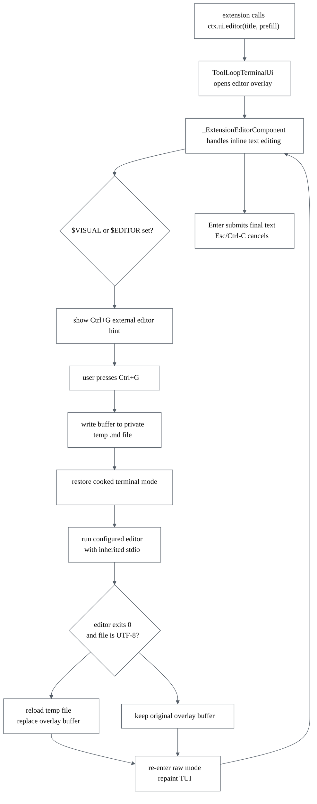

# Parity Slice Report: Extension Editor External Handoff

Run label: `parity-20260623T102740Z`
Runner result: one gap completed, then stopped at `--max-gaps 1`
Feature commit: `882baae feat(extension): add external editor handoff`

## What Changed

This slice made pipy's extension multi-line editor behave more like Pi's editor
overlay when a terminal editor is configured. An extension can already call
`ctx.ui.editor(title, prefill)` to ask for text. That overlay now shows a
`ctrl-g external editor` hint when `$VISUAL` or `$EDITOR` is set, and Ctrl+G
hands the current buffer to the configured editor.

On a successful external-editor exit, pipy reloads the temp file and replaces
the overlay text. If the editor exits non-zero, writes invalid UTF-8, cannot be
started, or has an invalid command line, pipy keeps the original in-frame text.

## Flow

## Commit Map

| Commit | Role |
| --- | --- |
| `882baae` | Implements the Ctrl+G `$VISUAL`/`$EDITOR` handoff, updates parity docs, and adds PTY coverage. |
| `92e390e` | Captures the review lesson from the slice. |
| `e392661` | Adds direct component tests for the external-editor mode transitions. |
| `f1e3ab8` | Marks the captured lesson as applied after the follow-up test landed. |

## Files To Read

- `src/pipy_harness/native/tui.py`: `_ExtensionEditorComponent` now accepts an
  external-editor callback; `ToolLoopTerminalUi` builds that callback from
  `$VISUAL` or `$EDITOR`.
- `tests/test_native_extension_custom_ui_pty.py`: PTY tests prove successful
  external edits load back into the overlay, failing editors keep the original
  text, and invalid UTF-8 is ignored.
- `tests/test_native_extension_custom_ui.py`: focused component tests guard when
  Ctrl+G should and should not mutate editor text.
- `docs/extension-api.md`, `docs/pi-mono-gap-audit.md`, `docs/parity-plan.md`,
  and `docs/backlog.md`: parity status now lists this exact handoff as shipped.

## Boundaries

This does not add Pi's full custom editor component API. Autocomplete providers,
live per-frame `render()`/`requestRender` behavior, reactive footer data, and
broader custom editor extension surfaces remain deferred. The implemented slice
is specifically the terminal-editor handoff from pipy's existing extension
multi-line text overlay.

The editor command is parsed with `shlex.split`; it is not run through a shell.
That means simple commands such as `vim`, `nvim`, or `code --wait` work, while
shell-only expansion and shell functions are outside this slice.
