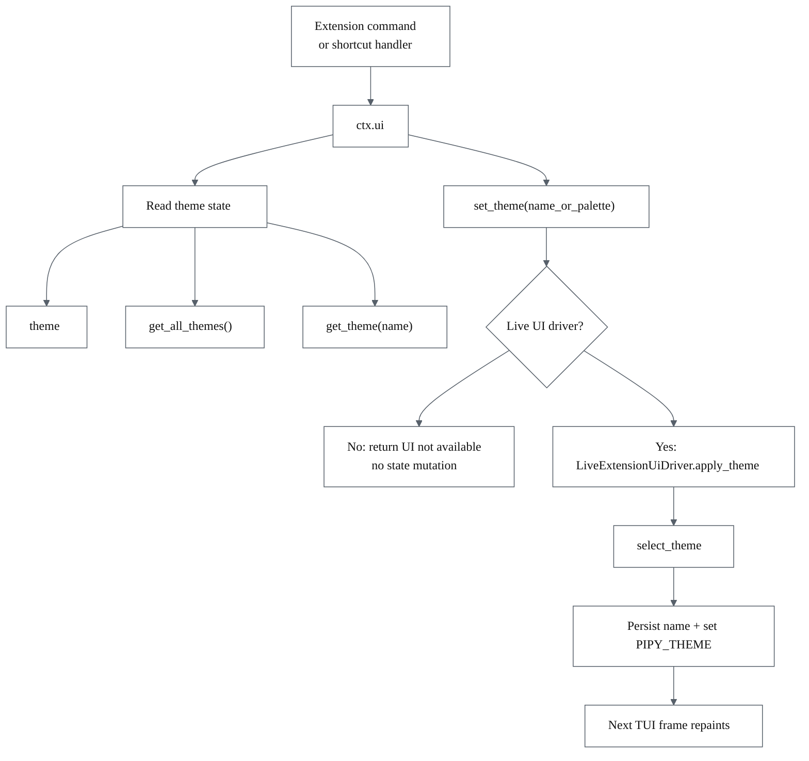

# Parity Slice Report: parity-20260624T065600Z

<!-- parity-run-label: parity-20260624T065600Z -->

<!-- BEGIN GENERATED:facts -->
## Generated Facts

| Field | Value |
| --- | --- |
| Run label | `parity-20260624T065600Z` |
| Agent | `claude` |
| Recorded start | `25e2ff8d6b02` |
| Recorded end | `b0d2bbc237b8` |
| Gaps done | 1 |
| Stop reason | `cap_reached` |
| Exit code | 0 |
| Range note | `head_before..recorded_end`; this is factual, not curated semantic membership. |

### Recorded Range Commits

| Commit | Subject |
| --- | --- |
| `83165f6` | feat(extension): add ctx.ui theme controls (rich-UI item E) |
| `b0d2bbc` | chore(lessons): capture mypy-protocol-fake and theme-store-isolation lessons |

### Change Shape

| Area | Files | Added | Deleted |
| --- | --- | --- | --- |
| CHANGELOG.md | 1 | 15 | 0 |
| docs | 3 | 60 | 11 |
| docs/parity-loop | 1 | 2 | 0 |
| docs/superpowers | 1 | 175 | 0 |
| src | 2 | 83 | 0 |
| tests | 2 | 236 | 0 |

### Changed Files

| File | Added | Deleted |
| --- | --- | --- |
| CHANGELOG.md | 15 | 0 |
| docs/backlog.md | 8 | 5 |
| docs/extension-api.md | 36 | 5 |
| docs/parity-loop/lessons/lessons.jsonl | 2 | 0 |
| docs/pi-mono-gap-audit.md | 16 | 1 |
| docs/superpowers/specs/2026-06-24-extension-theme-controls-design.md | 175 | 0 |
| src/pipy_harness/native/extension_runtime.py | 69 | 0 |
| src/pipy_harness/native/tool_loop_session.py | 14 | 0 |
| tests/test_native_extension_custom_ui.py | 4 | 0 |
| tests/test_native_extension_theme_controls.py | 232 | 0 |

### Recorded Caveats

| Phase | Log | Caveat |
| --- | --- | --- |
| postloop | improve-postloop.log | `just check` — lint + typecheck + **2519 passed, 2 skipped**. |

<!-- END GENERATED:facts -->

## What Changed

This slice added Pi-shaped theme controls to extension command and shortcut
contexts. Extensions can now inspect the active chrome palette, list available
themes, load a theme by name without switching, and request a live theme switch:

- `ctx.ui.theme`
- `ctx.ui.get_all_themes()`
- `ctx.ui.get_theme(name)`
- `ctx.ui.set_theme(name_or_palette)`

Reads are ambient and deterministic even without a live TUI: they use the global
theme registry plus `PIPY_THEME` and the native chrome theme store. `set_theme`
is the only mutating operation, so it requires a live UI driver. In headless
dispatch it returns `{"success": False, "error": "UI not available"}` without
changing process state. In live TUI dispatch it reuses the existing `/settings`
theme-selection mechanism, so the selected theme is persisted and the next frame
repaints with the new palette.

## Visualization

## Boundaries

This is theme selection, not theme registration. Themes are still contributed
through package/resource discovery; there is no new extension API for registering
theme files at runtime.

`get_all_themes()` keeps Pi's `{name, path}` shape, but `path` is always `None`.
Pipy retains only `name -> palette` in the session theme registry and does not
expose package theme file paths to extension code.

Nearby extension UI gaps remain deferred: custom editor component replacement,
autocomplete providers, multi-widget custom overlays beyond the narrow
`ctx.ui.custom` path, and live invalidation-driven component rendering.

## Comprehension Check

1. What happens if an extension calls `ctx.ui.set_theme("high-contrast")` in a
   headless dispatch?

Answer

It returns `{"success": False, "error": "UI not available"}` and does not mutate
`PIPY_THEME`, the native theme store, or any other process state.

2. Why does `ctx.ui.get_all_themes()` return `{"path": None}` for every theme?

Answer

The extension-facing boundary is name-only. Pipy's session theme registry keeps
only theme names and palettes, so package theme file paths are not leaked to
extension code.

3. What existing product path does live `set_theme` reuse?

Answer

It reuses the `/settings` theme-selection path via `select_theme`, which
validates the name, persists it, sets `PIPY_THEME`, and lets the next TUI frame
render with the selected palette.

