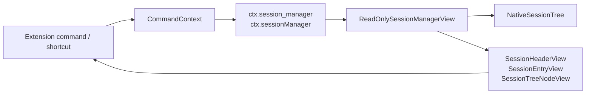

# Parity Slice Report: parity-20260625T073530Z

<!-- parity-run-label: parity-20260625T073530Z -->

<!-- BEGIN GENERATED:facts -->
## Generated Facts

| Field | Value |
| --- | --- |
| Run label | `parity-20260625T073530Z` |
| Agent | `pipy` |
| Recorded start | `65bcc2243578` |
| Recorded end | `077d3d034984` |
| Gaps done | 1 |
| Stop reason | `cap_reached` |
| Exit code | 0 |
| Range note | `head_before..recorded_end`; this is factual, not curated semantic membership. |

### Recorded Range Commits

| Commit | Subject |
| --- | --- |
| `077d3d0` | feat(extensions): expose session manager view |

### Change Shape

| Area | Files | Added | Deleted |
| --- | --- | --- | --- |
| docs | 3 | 43 | 8 |
| docs/superpowers | 2 | 47 | 0 |
| src | 3 | 220 | 0 |
| tests | 1 | 83 | 0 |

### Changed Files

| File | Added | Deleted |
| --- | --- | --- |
| docs/backlog.md | 10 | 5 |
| docs/extension-api.md | 26 | 2 |
| docs/pi-mono-gap-audit.md | 7 | 1 |
| docs/superpowers/plans/2026-06-25-extension-session-manager.md | 19 | 0 |
| docs/superpowers/specs/2026-06-25-extension-session-manager-design.md | 28 | 0 |
| src/pipy_harness/extensions.py | 8 | 0 |
| src/pipy_harness/native/extension_runtime.py | 210 | 0 |
| src/pipy_harness/native/tool_loop_session.py | 2 | 0 |
| tests/test_native_extension_dispatch.py | 83 | 0 |

### Recorded Caveats

None recorded in `run.jsonl`.

<!-- END GENERATED:facts -->
## What Changed

This slice adds a read-only session-manager view to extension command and
shortcut contexts. Extension handlers can now inspect the active native session
through `ctx.session_manager` and the Pi-shaped alias `ctx.sessionManager`.

The view exposes the active session cwd, session directory/file/id, header,
entries, labels, branch, tree, leaf entry, and session name through immutable
view objects. It does not hand extension code the mutable `NativeSessionTree` or
session writer methods.

The product TUI dispatch path now passes the active session tree into extension
commands and shortcuts, while direct/headless dispatch still returns deterministic
empty values.

## Visualization

## Boundaries

This is an inspection-only slice. It does not add Pi's mutating session-manager
operations such as `setLabel`, `setSessionName`, `sendMessage`, replacement
session operations, or provider/model registry changes.

Entry snapshots are read-only copies, but they reflect native session entry
content. Extensions are trusted local code, so this is an extension capability
boundary rather than a metadata-only archive surface.

## Comprehension Check

Which names should extension authors use?

Use `ctx.session_manager` in native Python extensions. `ctx.sessionManager` is
also available as a Pi-shaped alias for translated extensions.

Can an extension mutate the session through this view?

No. The view exposes immutable snapshot objects and read methods only. Mutation
helpers such as session replacement, message sending, and label/session-name
updates remain deferred.

What happens outside a live product session?

Direct or headless dispatch receives a deterministic empty view: ids and paths
are `None`, and entry/tree/branch collections are empty tuples.

