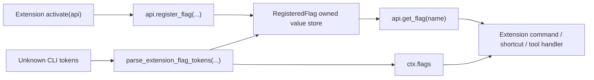

# Parity Slice Report: parity-20260625T141428Z

<!-- parity-run-label: parity-20260625T141428Z -->

<!-- BEGIN GENERATED:facts -->
## Generated Facts

| Field | Value |
| --- | --- |
| Run label | `parity-20260625T141428Z` |
| Agent | `pipy` |
| Recorded start | `80bc58ae4190` |
| Main range start | `80bc58ae4190` |
| Recorded end | `62243585dede` |
| Gaps done | 1 |
| Stop reason | `cap_reached` |
| Exit code | 0 |
| Range note | `main_range_start..recorded_end`; this is factual, not curated semantic membership. |

### Recorded Range Commits

| Commit | Subject |
| --- | --- |
| `6224358` | feat(extensions): expose flag getter |

### Change Shape

| Area | Files | Added | Deleted |
| --- | --- | --- | --- |
| docs | 3 | 16 | 8 |
| src | 1 | 30 | 5 |
| tests | 2 | 70 | 3 |

### Changed Files

| File | Added | Deleted |
| --- | --- | --- |
| docs/backlog.md | 1 | 1 |
| docs/extension-api.md | 14 | 6 |
| docs/pi-mono-gap-audit.md | 1 | 1 |
| src/pipy_harness/native/extension_runtime.py | 30 | 5 |
| tests/test_native_extension_activation.py | 31 | 0 |
| tests/test_native_extension_dispatch.py | 39 | 3 |

### Lesson Safety Net

No safety-net improvement commits were recorded.

### Recorded Caveats

None recorded in `run.jsonl`.

<!-- END GENERATED:facts -->
## What Changed

This slice completes the extension-owned flag getter surface. Extensions that
register dynamic CLI flags can now call `api.get_flag(name)` from handlers they
closed over during activation, while command contexts continue to receive the
same parsed values through `ctx.flags`.

During activation, `api.get_flag(...)` returns only that extension's own
registered defaults and returns `None` for names the extension did not register.
After the native startup path parses extension CLI tokens, the parsed run-local
overrides are written back to the owning `RegisteredFlag`, so later extension
commands see the effective values through both `api.get_flag(...)` and
`ctx.flags`.

The user-visible effect is that translated Pi-style extensions can keep using a
flag getter captured from their activation API instead of being forced to thread
every value through command arguments or context-only reads.

## Visualization

## Boundaries

This remains a dynamic extension flag slice, not a broader extension state API.
It does not add new flag types beyond the existing boolean/string parsing
surface, global cross-extension flag lookup, mutable extension state helpers,
OAuth/provider extension registration, TypeScript source compatibility, or
package distribution work.

The getter is intentionally scoped to the owning extension's registered flags:
one extension cannot inspect another extension's defaults or parsed values
through its activation API.

## Comprehension Check

When does `api.get_flag("name")` return a default?

During activation, after that same extension has registered the flag with a
default. Names the extension has not registered return `None`, even if another
extension owns a flag with that name.

Where do parsed CLI overrides become visible?

`parse_extension_flag_tokens(...)` records the parsed value in the normal
`ctx.flags` map and also writes it back to the owning `RegisteredFlag`, allowing
handlers that closed over `api.get_flag(...)` to see the same effective value.

What did this slice deliberately leave out?

It did not broaden dynamic flag parsing beyond the existing boolean/string
forms, add mutable extension state helpers, or allow extensions to inspect
flags owned by other extensions.

