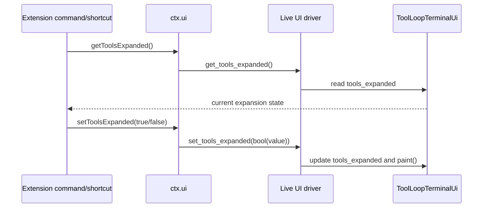

# Parity Slice Report: parity-20260628T094351Z

<!-- parity-run-label: parity-20260628T094351Z -->

<!-- BEGIN GENERATED:facts -->
## Generated Facts

| Field | Value |
| --- | --- |
| Run label | `parity-20260628T094351Z` |
| Agent | `pipy` |
| Recorded start | `89d1cbc32835` |
| Main range start | `89d1cbc32835` |
| Recorded end | `13a8a9014510` |
| Gaps done | 1 |
| Stop reason | `cap_reached` |
| Exit code | 0 |
| Range note | `main_range_start..recorded_end`; this is factual, not curated semantic membership. |

### Recorded Range Commits

| Commit | Subject |
| --- | --- |
| `13a8a90` | feat(extensions): expose tool expansion UI controls |

### Change Shape

| Area | Files | Added | Deleted |
| --- | --- | --- | --- |
| docs | 3 | 30 | 3 |
| docs/superpowers | 2 | 45 | 0 |
| src | 2 | 49 | 0 |
| tests | 1 | 64 | 0 |

### Changed Files

| File | Added | Deleted |
| --- | --- | --- |
| docs/backlog.md | 5 | 1 |
| docs/extension-api.md | 18 | 1 |
| docs/pi-mono-gap-audit.md | 7 | 1 |
| docs/superpowers/specs/extension-tools-expanded-implementation.md | 12 | 0 |
| docs/superpowers/specs/extension-tools-expanded-plan.md | 33 | 0 |
| src/pipy_harness/native/extension_runtime.py | 40 | 0 |
| src/pipy_harness/native/tool_loop_session.py | 9 | 0 |
| tests/test_native_extension_dispatch.py | 64 | 0 |

### Lesson Safety Net

No safety-net improvement commits were recorded.

### Recorded Caveats

None recorded in `run.jsonl`.

<!-- END GENERATED:facts -->

## What Changed

Extensions can now control the same tool-output expansion state that the live product TUI uses for its built-in tool-row toggle. In command and shortcut handlers with a live UI, `ctx.ui.get_tools_expanded()` / `getToolsExpanded()` report whether tool output is expanded, and `ctx.ui.set_tools_expanded(...)` / `setToolsExpanded(...)` update that state, coerce the value to a boolean, and repaint the frame.

Headless and RPC-like extension contexts intentionally behave like Pi: the getter returns `False`, and setter calls are accepted but do not change anything. This lets extensions written against Pi's UI API run without special-case guards when no interactive UI is attached.

## Visualization

## Boundaries

This slice only shipped the extension-facing controls for the existing live tool-output expansion bit. It did not add new persisted session state, archive the expansion setting, or broaden headless behavior beyond Pi-compatible `False`/no-op semantics. Richer tool-output rendering and invalidation work, multi-widget message components, custom message-entry surfaces, and broader extension/package platform follow-ons remain deferred.

## Comprehension Check

What state do the new extension methods control?

They read and write the live product-TUI `tools_expanded` state used by the built-in tool-output expansion toggle.

What happens when an extension calls these methods without a live UI?

`getToolsExpanded()` / `get_tools_expanded()` return `False`; setter calls are no-ops, matching Pi RPC/headless behavior.

