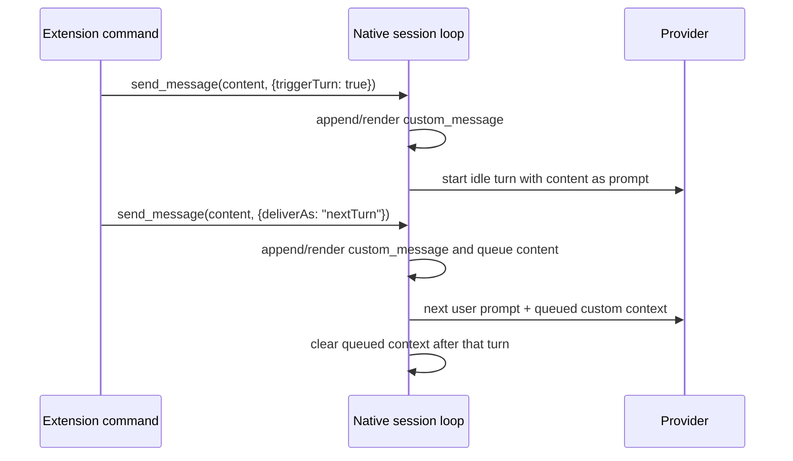

# Parity Slice Report: parity-20260628T182543Z

<!-- parity-run-label: parity-20260628T182543Z -->

<!-- BEGIN GENERATED:facts -->
## Generated Facts

| Field | Value |
| --- | --- |
| Run label | `parity-20260628T182543Z` |
| Agent | `pipy` |
| Recorded start | `0af4f6c50d4f` |
| Main range start | `0af4f6c50d4f` |
| Recorded end | `8ecefde3b67c` |
| Gaps done | 1 |
| Stop reason | `cap_reached` |
| Exit code | 0 |
| Range note | `main_range_start..recorded_end`; this is factual, not curated semantic membership. |

### Recorded Range Commits

| Commit | Subject |
| --- | --- |
| `8ecefde` | feat(extensions): deliver custom messages |

### Change Shape

| Area | Files | Added | Deleted |
| --- | --- | --- | --- |
| docs | 6 | 118 | 20 |
| docs/parity-loop | 1 | 1 | 0 |
| scripts | 1 | 88 | 2 |
| src | 1 | 58 | 8 |
| tests | 1 | 120 | 1 |

### Changed Files

| File | Added | Deleted |
| --- | --- | --- |
| docs/backlog.md | 4 | 3 |
| docs/extension-api.md | 11 | 8 |
| docs/extension-send-message-delivery-implementation.md | 29 | 0 |
| docs/extension-send-message-delivery-plan.md | 65 | 0 |
| docs/parity-loop/lessons/lessons.jsonl | 1 | 0 |
| docs/parity-plan.md | 5 | 5 |
| docs/pi-mono-gap-audit.md | 4 | 4 |
| scripts/parity_checks/extension_package_conformance.py | 88 | 2 |
| src/pipy_harness/native/tool_loop_session.py | 58 | 8 |
| tests/test_native_extension_dispatch.py | 120 | 1 |

### Lesson Safety Net

| Phase | Log | Start | End | Exit | Open Before | Open After | Commits |
| --- | --- | --- | --- | --- | --- | --- | --- |
| postloop | improve-postloop.log | `8ecefde3b67c` | `19d779dd18da` | 0 | 1 | 0 | `788e9d0` test(extension): cover send_message delivery boundaries `19d779d` chore(lessons): mark 2026-06-28-80feba applied |

### Recorded Caveats

| Phase | Log | Caveat |
| --- | --- | --- |
| postloop | improve-postloop.log | Caveat: repo was already `main...origin/main [ahead 1]` at start; it is now ahead by 3 commits. |

<!-- END GENERATED:facts -->

## What Changed

Extensions can now use `send_message` / `sendMessage` for provider-visible idle delivery, not just local display and archival. A custom message with `triggerTurn: true` starts a deterministic provider turn while the session is idle, using the custom message content as the provider prompt. A custom message with `deliverAs: "nextTurn"` waits for the next accepted user turn, injects the custom content into that provider request, and is then consumed.

The shipped behavior keeps the persisted session tree unchanged: custom messages remain stored as `custom_message` entries, while next-turn delivery is an in-memory provider-context handoff. The follow-up safety-net commit tightened lifecycle coverage so queued context is single-use, cleared across session switches, and `triggerTurn` only fires for a strict boolean `true`.

## Visualization

## Boundaries

This slice did not add streaming-time delivery. `deliverAs: "steer"` and `deliverAs: "followUp"` are still accepted for API compatibility but do not steer an active stream or schedule follow-up work. It also did not change richer custom-message rendering, in-session full-history redraw on `/resume`, multi-widget message components, or live per-frame invalidation. Provider injection for `nextTurn` is intentionally transient and does not become long-lived archived history.

## Comprehension Check

What is the difference between <code>triggerTurn</code> and <code>deliverAs: "nextTurn"</code> in this slice?

`triggerTurn: true` starts a provider turn immediately while idle, using the custom message as the prompt. `deliverAs: "nextTurn"` only queues the custom content and injects it into the next real accepted provider turn.

Does queued <code>nextTurn</code> content remain in provider history after it is delivered?

No. It is injected into one provider request, then removed from the live long-lived message history and cleared on session-boundary changes such as `/new`.

