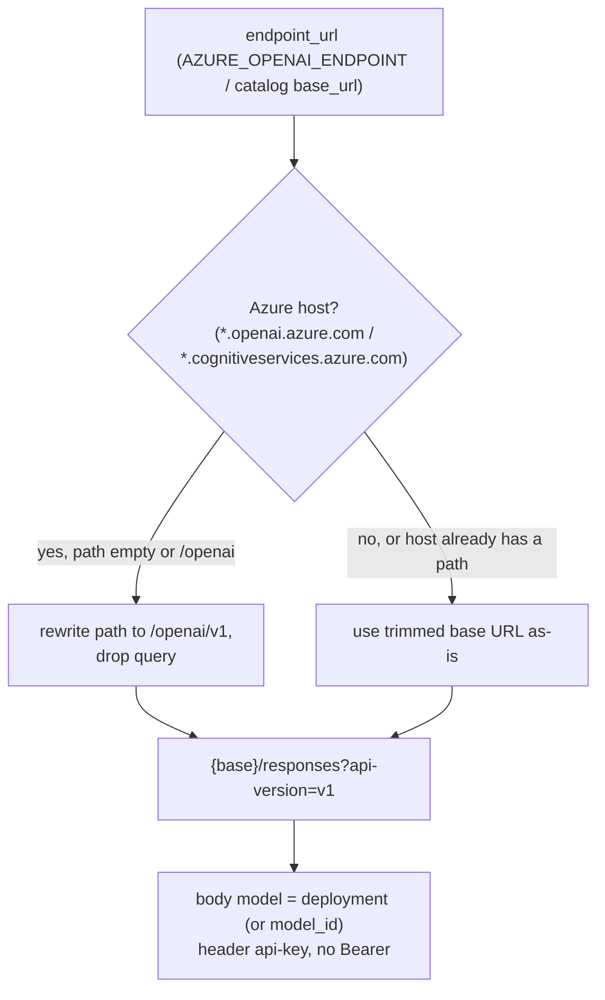

# Parity Slice Report: parity-20260630T040915Z

<!-- parity-run-label: parity-20260630T040915Z -->

<!-- BEGIN GENERATED:facts -->
## Generated Facts

| Field | Value |
| --- | --- |
| Run label | `parity-20260630T040915Z` |
| Agent | `claude` |
| Recorded start | `8b715f822de4` |
| Main range start | `8b715f822de4` |
| Recorded end | `bd85faad704a` |
| Gaps done | 1 |
| Stop reason | `cap_reached` |
| Exit code | 0 |
| Range note | `main_range_start..recorded_end`; this is factual, not curated semantic membership. |

### Recorded Range Commits

| Commit | Subject |
| --- | --- |
| `8b4b449` | feat(azure): match Pi AzureOpenAI v1 URL/api-version request shape |
| `bd85faa` | chore(lessons): capture azure construction-test env-dict-vs-os.environ lesson |

### Change Shape

| Area | Files | Added | Deleted |
| --- | --- | --- | --- |
| docs | 3 | 38 | 17 |
| docs/parity-loop | 1 | 1 | 0 |
| scripts | 1 | 9 | 7 |
| src | 2 | 51 | 17 |
| tests | 2 | 67 | 14 |

### Changed Files

| File | Added | Deleted |
| --- | --- | --- |
| docs/backlog.md | 11 | 7 |
| docs/parity-loop/lessons/lessons.jsonl | 1 | 0 |
| docs/pi-mono-gap-audit.md | 7 | 1 |
| docs/provider-catalog.md | 20 | 9 |
| scripts/parity_checks/provider_catalog_conformance.py | 9 | 7 |
| src/pipy_harness/native/azure_openai_provider.py | 49 | 16 |
| src/pipy_harness/native/catalog_data.py | 2 | 1 |
| tests/test_native_azure_openai_provider.py | 59 | 11 |
| tests/test_native_provider_construction.py | 8 | 3 |

### Lesson Safety Net

| Phase | Log | Start | End | Exit | Open Before | Open After | Commits |
| --- | --- | --- | --- | --- | --- | --- | --- |
| postloop | improve-postloop.log | `bd85faad704a` | `89596ed18f6f` | 0 | 1 | 0 | `04b11ab` test(azure): exercise AZURE_OPENAI_API_VERSION env-override path `89596ed` chore(lessons): mark 2026-06-30-7eb775 applied |

### Recorded Caveats

None recorded in `run.jsonl`.

<!-- END GENERATED:facts -->

## What Changed

The native `azure-openai-responses` provider now issues requests in the shape Pi's `AzureOpenAI` SDK v1 surface produces, instead of the classic Azure deployment-path surface it used before.

Concretely, for a request against an Azure host:

- **Default api-version is now `v1`** (previously `2024-12-01-preview`). `AZURE_OPENAI_API_VERSION` still overrides it via the environment.
- **Azure-host base URLs are normalized to `/openai/v1`.** When the endpoint is an Azure host (`*.openai.azure.com` or `*.cognitiveservices.azure.com`) whose path is empty or just `/openai`, the path is rewritten to `/openai/v1` and any query is dropped — mirroring Pi's `normalizeAzureBaseUrl`.
- **The request URL is `{normalized_base}/responses?api-version=v1`.** The deployment name no longer appears as a `/openai/deployments/{deployment}/` path segment.
- **The deployment name moves into the request body `model` field** (matching Pi's `buildParams: model: deploymentName`). It is the explicit `deployment` if set, otherwise the model id.
- **Custom and already-pathed base URLs are respected verbatim.** A non-Azure gateway host, or an Azure host that already carries a non-trivial path, is left untouched apart from appending `/responses?api-version=...`.

Authentication is unchanged: Azure's `api-key` header is used, never `Authorization: Bearer`. The catalog conformance gate (item 21b) and the provider/gap-audit/backlog docs were updated to assert and describe the new URL/body shape.

A reader-facing effect: anyone pointing pipy at an Azure OpenAI resource now hits the same endpoint and api-version Pi does, so deployment routing and request bodies match Pi byte-for-byte where it matters.

## Visualization

The one decision worth picturing is how a configured base URL becomes the request URL:

## Boundaries

This slice aligned only the request *shape*. The remaining Azure config-source conveniences Pi offers were deliberately deferred and recorded as separate follow-ons:

- Building a default base URL from `AZURE_OPENAI_RESOURCE_NAME` — pipy still resolves the base via `endpoint_url` (`AZURE_OPENAI_ENDPOINT` / catalog `base_url`).
- The `AZURE_OPENAI_DEPLOYMENT_NAME_MAP` model→deployment map — pipy resolves the deployment via the explicit `deployment` field or the model id.
- Pi's `AZURE_OPENAI_BASE_URL` env name — pipy reads `AZURE_OPENAI_ENDPOINT` instead.

No auth scheme, streaming, usage-normalization, or other-provider behavior changed in this slice.

## Comprehension Check

Where does the Azure deployment name end up in the outgoing request now, and where did it live before?

It is now the request body's `model` field. Before this slice it was a URL path segment (`/openai/deployments/{deployment}/responses`). The model id is used as the deployment when no explicit `deployment` is set.

A user sets the endpoint to `https://gateway.example.com/azure-proxy/`. What URL is posted, and why isn't it rewritten to `/openai/v1`?

`https://gateway.example.com/azure-proxy/responses?api-version=v1`. The host isn't an Azure host suffix, so `normalizeAzureBaseUrl` leaves it verbatim and only appends `/responses?api-version=...`. The same verbatim handling applies to an Azure host that already carries a non-trivial path.

