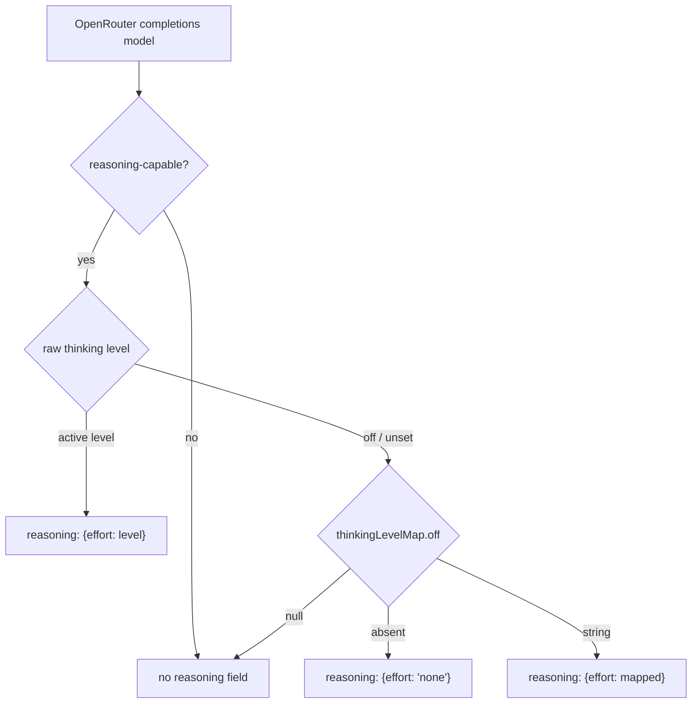

# Parity Slice Report: parity-20260630T195030Z

<!-- parity-run-label: parity-20260630T195030Z -->

<!-- BEGIN GENERATED:facts -->
## Generated Facts

| Field | Value |
| --- | --- |
| Run label | `parity-20260630T195030Z` |
| Agent | `claude` |
| Recorded start | `c0d49c034bc4` |
| Main range start | `c0d49c034bc4` |
| Recorded end | `1e012941cb59` |
| Gaps done | 1 |
| Stop reason | `cap_reached` |
| Exit code | 0 |
| Range note | `main_range_start..recorded_end`; this is factual, not curated semantic membership. |

### Recorded Range Commits

| Commit | Subject |
| --- | --- |
| `8acef9d` | feat(openrouter): emit reasoning off-state for completions thinking format |
| `1e01294` | chore(lessons): capture absent-vs-null map-default gate-failure lesson |

### Change Shape

| Area | Files | Added | Deleted |
| --- | --- | --- | --- |
| docs | 3 | 34 | 1 |
| docs/parity-loop | 1 | 1 | 0 |
| docs/superpowers | 1 | 192 | 0 |
| scripts | 1 | 7 | 1 |
| src | 1 | 31 | 0 |
| tests | 1 | 65 | 0 |

### Changed Files

| File | Added | Deleted |
| --- | --- | --- |
| docs/backlog.md | 6 | 1 |
| docs/parity-loop/lessons/lessons.jsonl | 1 | 0 |
| docs/pi-mono-gap-audit.md | 10 | 0 |
| docs/provider-catalog.md | 18 | 0 |
| docs/superpowers/specs/2026-06-30-openrouter-reasoning-off-state-design.md | 192 | 0 |
| scripts/parity_checks/provider_catalog_conformance.py | 7 | 1 |
| src/pipy_harness/native/provider_construction.py | 31 | 0 |
| tests/test_native_provider_construction.py | 65 | 0 |

### Lesson Safety Net

| Phase | Log | Start | End | Exit | Open Before | Open After | Commits |
| --- | --- | --- | --- | --- | --- | --- | --- |
| postloop | improve-postloop.log | `1e012941cb59` | `144ffa6889c6` | 0 | 1 | 0 | `e2e2458` test(openrouter): assert reasoning off-state reaches the request body `144ffa6` chore(lessons): mark 2026-06-30-d93f38 applied |

### Recorded Caveats

None recorded in `run.jsonl`.

<!-- END GENERATED:facts -->

## What Changed

This slice closes a request-body parity gap for **OpenRouter models that use the `openai-completions` thinking format**. When a reasoning-capable OpenRouter model runs a turn with thinking **off or unset**, pipy now actively disables reasoning at the router by sending `reasoning: {effort: "none"}` in the request body, instead of silently omitting the `reasoning` field.

Previously pipy only emitted the nested `reasoning.effort` object when an active thinking level was requested; an off/unset turn left reasoning unconstrained, so the router could still apply a model's default reasoning. Pi sends the explicit off-state (`reasoning: {effort: thinkingLevelMap.off ?? "none"}`, openai-completions.ts:578-580), and pipy now mirrors it — bringing the OpenRouter off-state in line with the already-shipped anthropic `thinking: {type: "disabled"}` off-state.

The off-state value follows the model's `thinkingLevelMap.off`:

- **absent `off` key** → emit `"none"` (the `?? "none"` fallback)
- **explicit `null` off mapping** → suppress the `reasoning` field entirely
- **string off mapping** (e.g. `"minimal"`) → emit it verbatim

The on-state emission is unchanged; an active level still sends `reasoning: {effort: <level>}`.

## Visualization

## Boundaries

- **Gated on the raw off/unset level, not on a cleared mapped value.** An *unsupported* level that clamps away to `None` (e.g. `medium` on a map with only `high`) is treated by Pi as still-thinking-and-clamp, so it must not fall into the off branch. The gate checks the raw level is `None`/`"off"` rather than testing `reasoning_value is None`.
- **OpenRouter `openai-completions` only.** This does not touch the OpenAI Responses path, the anthropic-messages off-state (already shipped), or any other family's thinking handling.
- **No catalog/model-row changes.** No new providers or models were added; this is purely the request-body shape for existing reasoning-capable OpenRouter rows.

## Comprehension Check

Why test the raw thinking level instead of <code>reasoning_value is None</code>?

Because both an off/unset turn and an *unsupported clamped* level produce a `None` resolved value, but Pi treats them differently — off means "disable reasoning," while an unsupported level means "keep thinking and let the router clamp." Gating on the raw level keeps the clamped case out of the off branch.

What is the difference between an absent <code>off</code> key and an <code>off</code> key mapped to <code>null</code>?

An absent key falls back to `"none"` and actively disables reasoning; an explicit `null` suppresses the `reasoning` field entirely. Because they diverge, membership is tested before lookup rather than using `.get`, which would conflate them.

