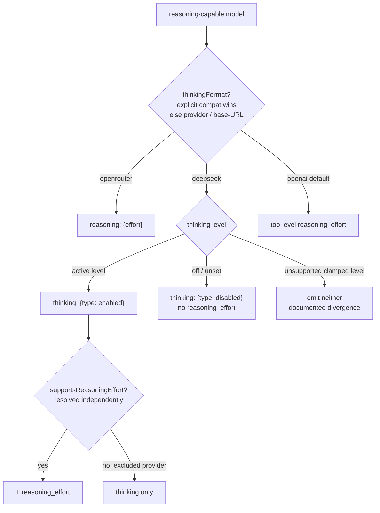

# Parity Slice Report: parity-20260630T201404Z

<!-- parity-run-label: parity-20260630T201404Z -->

<!-- BEGIN GENERATED:facts -->
## Generated Facts

| Field | Value |
| --- | --- |
| Run label | `parity-20260630T201404Z` |
| Agent | `claude` |
| Recorded start | `9da5571790ac` |
| Main range start | `9da5571790ac` |
| Recorded end | `9ded4ea838ca` |
| Gaps done | 1 |
| Stop reason | `cap_reached` |
| Exit code | 0 |
| Range note | `main_range_start..recorded_end`; this is factual, not curated semantic membership. |

### Recorded Range Commits

| Commit | Subject |
| --- | --- |
| `a8d4b3e` | feat(openai-completions): emit DeepSeek thinking-format request shape |
| `9ded4ea` | chore(lessons): capture secondary-compat-flag gating lesson |

### Change Shape

| Area | Files | Added | Deleted |
| --- | --- | --- | --- |
| docs | 3 | 44 | 5 |
| docs/parity-loop | 1 | 1 | 0 |
| docs/superpowers | 1 | 277 | 0 |
| scripts | 1 | 34 | 0 |
| src | 1 | 103 | 33 |
| tests | 1 | 116 | 0 |

### Changed Files

| File | Added | Deleted |
| --- | --- | --- |
| docs/backlog.md | 8 | 1 |
| docs/parity-loop/lessons/lessons.jsonl | 1 | 0 |
| docs/pi-mono-gap-audit.md | 12 | 2 |
| docs/provider-catalog.md | 24 | 2 |
| docs/superpowers/specs/2026-06-30-deepseek-thinking-format-design.md | 277 | 0 |
| scripts/parity_checks/provider_catalog_conformance.py | 34 | 0 |
| src/pipy_harness/native/provider_construction.py | 103 | 33 |
| tests/test_native_provider_construction.py | 116 | 0 |

### Lesson Safety Net

| Phase | Log | Start | End | Exit | Open Before | Open After | Commits |
| --- | --- | --- | --- | --- | --- | --- | --- |
| postloop | improve-postloop.log | `9ded4ea838ca` | `767f4912edb9` | 0 | 1 | 0 | `d40f15a` docs(parity-loop): pin per-field compat-flag gating in Phase 2 `767f491` chore(lessons): mark 2026-06-30-7fb385 applied |

### Recorded Caveats

None recorded in `run.jsonl`.

<!-- END GENERATED:facts -->

## What Changed

This slice ports Pi's DeepSeek thinking-format request shape to the `openai-completions` adapter. Previously pipy emitted reasoning two ways: OpenRouter's nested `reasoning: {effort}` object, or the OpenAI-style top-level `reasoning_effort`. DeepSeek-flavored providers now get their own wire shape.

For a reasoning-capable model on the `deepseek` thinking format, the outgoing request body now carries a top-level `thinking: {type: "enabled"|"disabled"}` object:

- **On-state** (an active thinking level): `thinking: {type: "enabled"}`, and a top-level `reasoning_effort` rides along **only** when the model supports reasoning effort.
- **Off/unset state**: `thinking: {type: "disabled"}` and no `reasoning_effort`. This is a deliberate Pi-forced explicit disable — DeepSeek's reasoning is turned off at the API rather than the field simply being omitted, matching how the OpenRouter (`effort: "none"`) and anthropic (`type: "disabled"`) off-states already behave.

Two resolution rules make this behave like Pi rather than a naive provider check:

- **Format precedence** follows Pi's `getCompat`: an explicit `compat.thinkingFormat` wins over provider/base-URL detection (`deepseek` name or `deepseek.com` base URL). So an explicit `thinkingFormat: "openrouter"` on a DeepSeek base URL still emits the nested OpenRouter shape, not the thinking object.
- **`supportsReasoningEffort` is resolved independently of the thinking format**, via Pi's `detectCompat` exclusion list (xAI, z.ai, Moonshot, Together, Cloudflare AI Gateway, Nvidia, ant-ling). An explicit `thinkingFormat: "deepseek"` pinned onto an excluded provider (e.g. Together) therefore emits `thinking: {type: "enabled"}` but correctly drops `reasoning_effort`.

As with the OpenRouter path, an unsupported thinking level (one that clamps to no mapped value) emits *neither* the on- nor off-state object — pipy does not clamp the way Pi does, so this stays a documented divergence rather than guessing a level.

Behavior is covered end-to-end: unit tests assert both the resolved construction and the field surviving onto the real request body through the completions adapter, plus conformance check `18h` (`18_product_deepseek_thinking`).

## Visualization

## Boundaries

- **Other `openai-completions` thinking formats remain deferred.** Only `deepseek` was added this slice; `zai`, `qwen`, `qwen-chat-template`, `together`, `ant-ling`, and `string-thinking` still fall through to the default top-level `reasoning_effort` shape — a documented deferral, not a regression.
- **No full `detectCompat` port.** `_supports_reasoning_effort` is a single bounded predicate over Pi's exclusion list, not the complete `detectCompat` routine.
- **The DeepSeek message transform is out of scope.** Pi's `requiresReasoningContentOnAssistantMessages` (the DeepSeek assistant-message reasoning-content reshaping) is a separate follow-on; this slice only changes the request thinking/effort shape.

## Comprehension Check

Why does an off/unset DeepSeek request send <code>thinking: {type: "disabled"}</code> instead of just omitting the field?

To match Pi's forced-disable semantics: for a reasoning-capable model, Pi explicitly turns reasoning off at the API rather than leaving it unset, the same as the OpenRouter `effort: "none"` and anthropic `type: "disabled"` off-states. Omitting the field would let the provider default decide.

An explicit <code>thinkingFormat: "deepseek"</code> is set on a Together base URL. What goes on the wire?

`thinking: {type: "enabled"}` with **no** `reasoning_effort`. Format detection honors the explicit compat value (deepseek shape), but `supportsReasoningEffort` is resolved independently and Together is on Pi's exclusion list, so the top-level effort is dropped.

Why does an unsupported (clamped) thinking level emit neither the enabled nor the disabled object?

The off-state branch is gated on the raw level being off/unset, not merely on the mapped value being absent. An unsupported level is neither "off" nor a valid mapped level, so it falls outside both branches — pipy declines to clamp it the way Pi would, which is the same documented divergence as the OpenRouter path.

