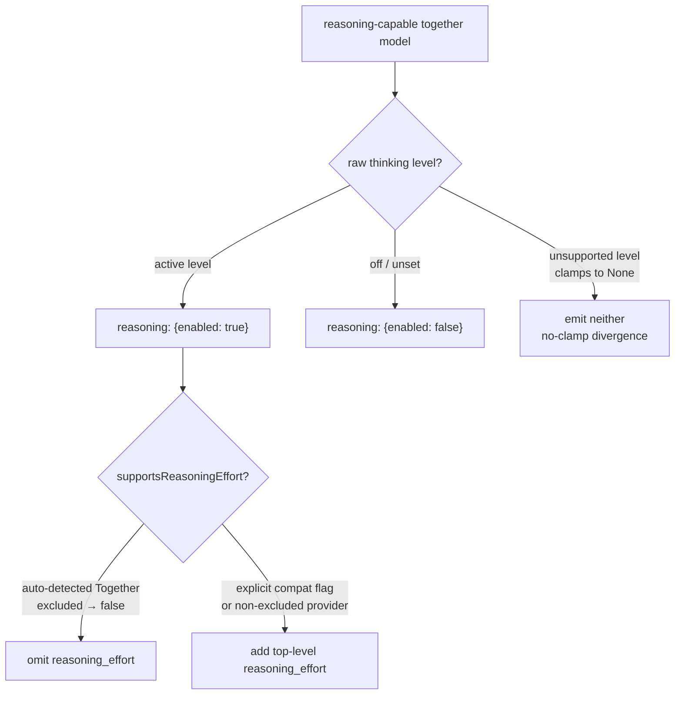

# Parity Slice Report: parity-20260630T205244Z

<!-- parity-run-label: parity-20260630T205244Z -->

<!-- BEGIN GENERATED:facts -->
## Generated Facts

| Field | Value |
| --- | --- |
| Run label | `parity-20260630T205244Z` |
| Agent | `claude` |
| Recorded start | `07eec622622f` |
| Main range start | `07eec622622f` |
| Recorded end | `b53ac80e540f` |
| Gaps done | 1 |
| Stop reason | `cap_reached` |
| Exit code | 0 |
| Range note | `main_range_start..recorded_end`; this is factual, not curated semantic membership. |

### Recorded Range Commits

| Commit | Subject |
| --- | --- |
| `df09ebc` | feat(openai-completions): emit Together reasoning request shape |
| `b53ac80` | chore(lessons): capture detectCompat detection-chain-order lesson |

### Change Shape

| Area | Files | Added | Deleted |
| --- | --- | --- | --- |
| docs | 3 | 54 | 7 |
| docs/parity-loop | 1 | 1 | 0 |
| docs/superpowers | 1 | 296 | 0 |
| scripts | 1 | 36 | 0 |
| src | 1 | 34 | 9 |
| tests | 1 | 117 | 0 |

### Changed Files

| File | Added | Deleted |
| --- | --- | --- |
| docs/backlog.md | 10 | 1 |
| docs/parity-loop/lessons/lessons.jsonl | 1 | 0 |
| docs/pi-mono-gap-audit.md | 17 | 3 |
| docs/provider-catalog.md | 27 | 3 |
| docs/superpowers/specs/2026-06-30-together-thinking-format-design.md | 296 | 0 |
| scripts/parity_checks/provider_catalog_conformance.py | 36 | 0 |
| src/pipy_harness/native/provider_construction.py | 34 | 9 |
| tests/test_native_provider_construction.py | 117 | 0 |

### Lesson Safety Net

| Phase | Log | Start | End | Exit | Open Before | Open After | Commits |
| --- | --- | --- | --- | --- | --- | --- | --- |
| postloop | improve-postloop.log | `b53ac80e540f` | `1b58b1359d3f` | 0 | 1 | 0 | `1121635` docs(parity-loop): pin Pi detectCompat chain ORDER per ported rung `1b58b13` chore(lessons): mark 2026-06-30-0870dd applied |

### Recorded Caveats

None recorded in `run.jsonl`.

<!-- END GENERATED:facts -->

## What Changed

This slice ports Pi's `together` thinking format for the `openai-completions`
provider family, so pipy now emits the same reasoning request shape Pi sends to
Together-hosted reasoning models (`openai-completions.ts:586-594`).

For a reasoning-capable model resolved to the `together` format, requests now
carry a top-level `reasoning: {enabled: <bool>}` object:

- **On-state** (an active thinking level): `reasoning: {enabled: true}`.
- **Off/unset state**: `reasoning: {enabled: false}` — a Pi-forced *explicit*
  disable, mirroring the DeepSeek `thinking: {type: "disabled"}`, OpenRouter
  `reasoning: {effort: "none"}`, and anthropic `type: "disabled"` off-states
  rather than simply omitting the field.

A top-level `reasoning_effort` rides along on the on-state **only** when the
model `supportsReasoningEffort`. That flag is resolved *independently* of the
thinking format, via Pi's `detectCompat` exclusion list — and that list
*includes* Together. So an auto-detected Together model (provider `together`, or
an `api.together.ai` / `api.together.xyz` base URL) emits the `reasoning` object
but omits `reasoning_effort`. An explicit `compat.supportsReasoningEffort=true`
— or an explicit `thinkingFormat="together"` on a provider Pi does *not* exclude
(e.g. `api.openai.com`) — flips it back on and adds `reasoning_effort`.

Format detection is wired into the `_resolve_thinking_format` chain in Pi's
`detectCompat` order (`isDeepSeek > isZai > isTogether > isAntLing >
isOpenRouter`), so `together` is tested **before** `openrouter`. A row that
matches both the Together provider and an `openrouter.ai` base URL therefore
resolves to the Together shape, not OpenRouter's nested `reasoning: {effort}`.

## Visualization

## Boundaries

- **`supportsReasoningEffort` stays in the exclusion list.** Auto-detected
  Together rows deliberately omit `reasoning_effort`; only an explicit compat
  override (or an explicit format on a non-excluded provider) adds it. This is
  intentional Pi parity, not a missing field.
- **No clamping.** An unsupported level clamps to `None` in pipy (Pi clamps
  differently), so neither the on- nor off-state fires — the same documented
  divergence already accepted for the DeepSeek and OpenRouter paths.
- **Other completions thinking formats remain deferred.** The `zai`, `qwen`,
  `qwen-chat-template`, `ant-ling`, and `string-thinking` variants still fall
  through to the default top-level `reasoning_effort` shape, and a full
  `detectCompat` port is still a follow-on. The DeepSeek
  `requiresReasoningContentOnAssistantMessages` message transform is likewise
  still outstanding.

## Comprehension Check

Why does an auto-detected Together model emit <code>reasoning: {enabled: true}</code> but no <code>reasoning_effort</code>?

Because the thinking format and `supportsReasoningEffort` are resolved
independently. Together is matched as the `together` format (so the `reasoning`
object is emitted), but Together is also in Pi's `detectCompat`
`supportsReasoningEffort` exclusion list, so that predicate returns false and
`reasoning_effort` is suppressed.

A model has the Together provider but an <code>openrouter.ai</code> base URL. Which shape wins?

The Together shape (`reasoning: {enabled}`). The detection chain mirrors Pi's
`detectCompat` order, testing `isTogether` before `isOpenRouter`, so the first
match wins before the OpenRouter branch is ever reached.

