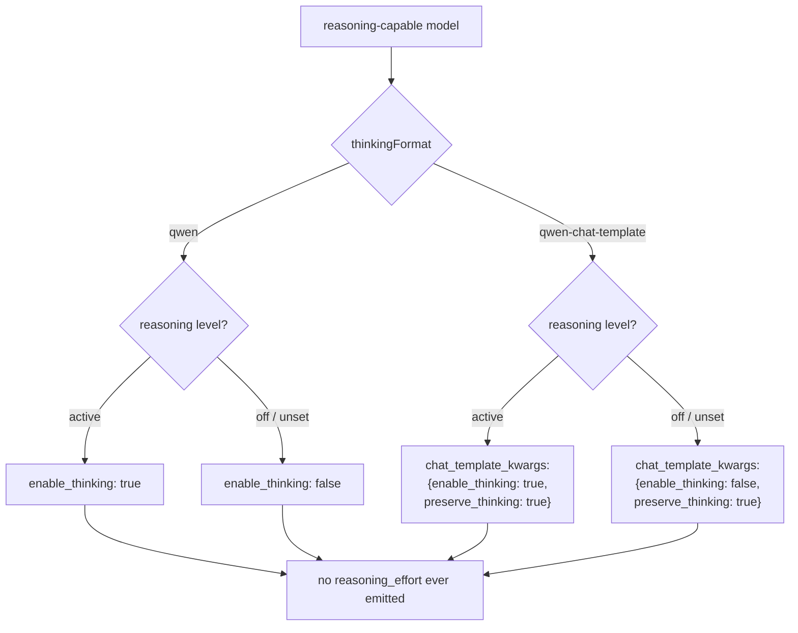

# Parity Slice Report: parity-20260630T213301Z

<!-- parity-run-label: parity-20260630T213301Z -->

<!-- BEGIN GENERATED:facts -->
## Generated Facts

| Field | Value |
| --- | --- |
| Run label | `parity-20260630T213301Z` |
| Agent | `claude` |
| Recorded start | `362ef480be7b` |
| Main range start | `362ef480be7b` |
| Recorded end | `4af1cf5fe4e2` |
| Gaps done | 1 |
| Stop reason | `cap_reached` |
| Exit code | 0 |
| Range note | `main_range_start..recorded_end`; this is factual, not curated semantic membership. |

### Recorded Range Commits

| Commit | Subject |
| --- | --- |
| `592d72f` | feat(openai-completions): emit Qwen enable_thinking request shapes |
| `4af1cf5` | chore(lessons): capture qwen explicit-compat-only thinking-format lesson |

### Change Shape

| Area | Files | Added | Deleted |
| --- | --- | --- | --- |
| docs | 3 | 51 | 13 |
| docs/parity-loop | 1 | 1 | 0 |
| docs/superpowers | 1 | 296 | 0 |
| scripts | 1 | 71 | 0 |
| src | 1 | 40 | 9 |
| tests | 1 | 173 | 0 |

### Changed Files

| File | Added | Deleted |
| --- | --- | --- |
| docs/backlog.md | 8 | 2 |
| docs/parity-loop/lessons/lessons.jsonl | 1 | 0 |
| docs/pi-mono-gap-audit.md | 16 | 3 |
| docs/provider-catalog.md | 27 | 8 |
| docs/superpowers/specs/2026-06-30-qwen-thinking-format-design.md | 296 | 0 |
| scripts/parity_checks/provider_catalog_conformance.py | 71 | 0 |
| src/pipy_harness/native/provider_construction.py | 40 | 9 |
| tests/test_native_provider_construction.py | 173 | 0 |

### Lesson Safety Net

| Phase | Log | Start | End | Exit | Open Before | Open After | Commits |
| --- | --- | --- | --- | --- | --- | --- | --- |
| postloop | improve-postloop.log | `4af1cf5fe4e2` | `f51865df0f3e` | 0 | 1 | 0 | `8fea3e3` docs(parity-loop): pin explicit-compat-only thinkingFormat inverse rule `f51865d` chore(lessons): mark 2026-06-30-34e963 applied |

### Recorded Caveats

None recorded in `run.jsonl`.

<!-- END GENERATED:facts -->

## What Changed

This slice teaches pipy's `openai-completions` request builder to emit Qwen's
reasoning request shapes, so a reasoning-capable model configured with a Qwen
thinking format now sends the same wire body Pi sends instead of a generic
OpenAI-style `reasoning_effort`.

Two formats ship together, both members of the `enable_thinking` bare-boolean
family already established by `zai`:

- **`qwen`** — a single top-level boolean `enable_thinking`: `true` when a
  reasoning level is active, `false` (an explicit disable, not omission) when
  reasoning is off or unset. No `reasoning_effort` is emitted.
- **`qwen-chat-template`** — the same boolean nested inside a
  `chat_template_kwargs` object alongside a constant `preserve_thinking: true`,
  e.g. `{"enable_thinking": true, "preserve_thinking": true}`. Also no
  `reasoning_effort`.

Before this change a Qwen-format model fell through to the default branch and
wrongly received a plain top-level `reasoning_effort` with no `enable_thinking`
flag and no explicit off-state. Now the body matches Pi byte-for-byte for both
the on and off states.

## Visualization

## Boundaries

- **Explicit-compat-only.** Pi's `detectCompat` has no `qwen`/`qwen-chat-template`
  rung, so neither format is ever auto-detected from provider name or base URL.
  A model reaches these shapes only through an explicit
  `model.compat.thinkingFormat`; this slice adds no detection logic.
- **Never consults `supportsReasoningEffort`.** Like `zai` and unlike
  `deepseek`/`together`, the Qwen branches never read that flag and never ride a
  top-level `reasoning_effort` alongside the boolean — even when
  `compat.supportsReasoningEffort=true` is forced.
- **Off-state gated on the raw level**, not on a clamped result: pipy does not
  clamp, so an unsupported clamped level emits neither field (the same documented
  divergence as the DeepSeek/Together/OpenRouter paths).
- **Still deferred:** the remaining completions `thinkingFormat` variants
  (`ant-ling`, `string-thinking`) and a full `detectCompat` port are separate
  follow-ons, untouched here.

## Comprehension Check

Why does a Qwen-format model not get a <code>reasoning_effort</code> field even when the model supports reasoning effort?

Because the `enable_thinking` bare-boolean family is structurally distinct from
the DeepSeek/Together formats: the branch emits only the boolean (or the nested
`chat_template_kwargs` object) and never consults `supportsReasoningEffort`. The
omission is intrinsic to the branch, not a side effect of a detection exclusion.

What is the only way a model ends up using the <code>qwen</code> or <code>qwen-chat-template</code> shape?

An explicit `model.compat.thinkingFormat`. Pi's `detectCompat` chain has no
`isQwen` rung, so these formats are never inferred from provider or base-URL
detection — and this slice deliberately adds none.

What does the off/unset state send, and how does it differ from simply omitting the field?

It sends an explicit `enable_thinking: false` (top-level for `qwen`, or inside
`chat_template_kwargs` for `qwen-chat-template`) — a Pi-forced explicit disable,
not an absent key. This makes the off-state observable on the wire rather than
indistinguishable from a non-reasoning request.

