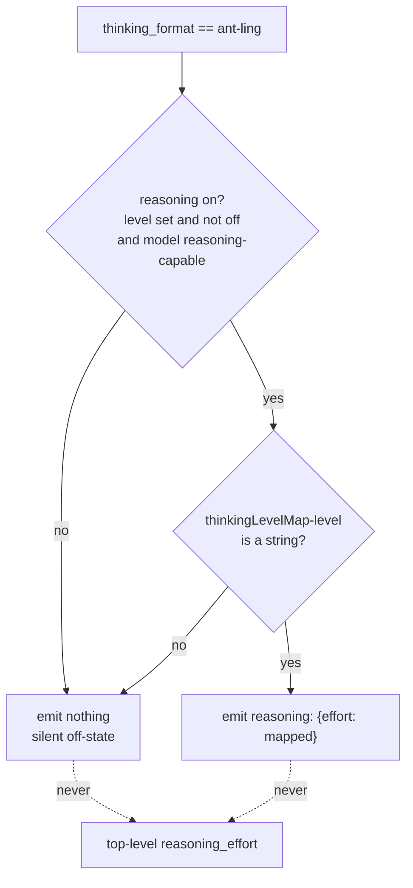

# Parity Slice Report: parity-20260630T222620Z

<!-- parity-run-label: parity-20260630T222620Z -->

<!-- BEGIN GENERATED:facts -->
## Generated Facts

| Field | Value |
| --- | --- |
| Run label | `parity-20260630T222620Z` |
| Agent | `claude` |
| Recorded start | `59cfac12b04e` |
| Main range start | `59cfac12b04e` |
| Recorded end | `e228cc891769` |
| Gaps done | 1 |
| Stop reason | `cap_reached` |
| Exit code | 0 |
| Range note | `main_range_start..recorded_end`; this is factual, not curated semantic membership. |

### Recorded Range Commits

| Commit | Subject |
| --- | --- |
| `e2c2029` | feat(openai-completions): emit ant-ling reasoning request shape |
| `e228cc8` | chore(lessons): capture ant-ling non-reasoning leak + raw-lookup lesson |

### Change Shape

| Area | Files | Added | Deleted |
| --- | --- | --- | --- |
| docs | 3 | 61 | 19 |
| docs/parity-loop | 1 | 1 | 0 |
| docs/superpowers | 2 | 285 | 0 |
| scripts | 1 | 62 | 0 |
| src | 1 | 58 | 17 |
| tests | 1 | 161 | 0 |

### Changed Files

| File | Added | Deleted |
| --- | --- | --- |
| docs/backlog.md | 10 | 2 |
| docs/parity-loop/lessons/lessons.jsonl | 1 | 0 |
| docs/pi-mono-gap-audit.md | 18 | 5 |
| docs/provider-catalog.md | 33 | 12 |
| docs/superpowers/specs/2026-07-01-ant-ling-thinking-format-design.md | 221 | 0 |
| docs/superpowers/specs/2026-07-01-ant-ling-thinking-format-implementation.md | 64 | 0 |
| scripts/parity_checks/provider_catalog_conformance.py | 62 | 0 |
| src/pipy_harness/native/provider_construction.py | 58 | 17 |
| tests/test_native_provider_construction.py | 161 | 0 |

### Lesson Safety Net

| Phase | Log | Start | End | Exit | Open Before | Open After | Commits |
| --- | --- | --- | --- | --- | --- | --- | --- |
| postloop | improve-postloop.log | `e228cc891769` | `180a0cfebc5b` | 0 | 1 | 0 | `bee0f9a` docs(parity-loop): pin ant-ling thinking-format reasoning_value traps `180a0cf` chore(lessons): mark 2026-07-01-6d98f1 applied |

### Recorded Caveats

| Phase | Log | Caveat |
| --- | --- | --- |
| postloop | improve-postloop.log | Caveat: the applied lesson records a known latent divergence as a future-work follow-on — the existing `zai`/`together`/`qwen` thinking-format branches still carry the same non-reasoning + `thinkingLevelMap` default-branch leak pattern. This is now documented in the skill-body guidance but is not yet fixed in provider code; it remains a candidate for a future parity gap, not a blocker for this run. |

<!-- END GENERATED:facts -->

## What Changed

This slice ports Pi's `ant-ling` thinking format for `openai-completions` providers (`openai-completions.ts:581-585`), so a model served by `ant-ling` now shapes its reasoning request the way Pi does.

A model is treated as `ant-ling` when its provider is `ant-ling` or its base URL is `api.ant-ling.com` (auto-detected — no explicit `compat.thinkingFormat` needed, unlike the qwen variants), or when `compat.thinkingFormat: "ant-ling"` is set explicitly. For such a model, the on-state of reasoning now emits a nested `reasoning: {effort: <mapped>}` object in the request body. The behavior is deliberately stricter than the other completions variants in three ways that are now user-visible:

- **Raw map lookup, no fallback.** The `effort` value is the raw `thinkingLevelMap[level]` lookup. Unlike DeepSeek/Together/OpenRouter, there is no `?? level` fallback, so a reasoning-capable ant-ling model with no `thinkingLevelMap` (or a level that doesn't map to a string) emits nothing at all.
- **Fully silent off-state.** When reasoning is off or unset, ant-ling emits *neither* `reasoning` *nor* `reasoning_effort` — it is the only emitting completions variant with no off-state emission whatsoever.
- **Never a top-level `reasoning_effort`.** ant-ling never consults `supportsReasoningEffort` and never emits a top-level `reasoning_effort`. The dedicated branch is keyed only on the thinking format (not on the model being reasoning-capable), so a *non-reasoning* ant-ling model that happens to declare a `thinkingLevelMap` can no longer leak a top-level `reasoning_effort` through the default branch.

Detection slots into Pi's `detectCompat` order between `together` and `openrouter` (`isDeepSeek > isZai > isTogether > isAntLing > isOpenRouter`), so an ant-ling row that also matches an `openrouter.ai` base URL resolves to the `ant-ling` shape, while explicit `compat.thinkingFormat` still wins over auto-detection.

## Visualization

How an `openai-completions` request body is shaped once a model resolves to the `ant-ling` thinking format:

The dotted edge is the point of the slice: no ant-ling path — on or off, reasoning or not — ever reaches the default top-level `reasoning_effort` branch.

## Boundaries

- **`string-thinking` is still deferred.** It is now the last unported `openai-completions` thinking-format variant; a full `detectCompat` port also remains a separate follow-on.
- **No clamping.** An unsupported but mapped level still emits nothing rather than being clamped to a supported level — the same documented no-clamp divergence from Pi that the DeepSeek/Together/OpenRouter/Qwen paths already carry.
- **Latent leak in sibling branches not fixed.** The recorded caveat applies: the existing `zai` / `together` / `qwen` branches still carry the same non-reasoning-plus-`thinkingLevelMap` default-branch leak pattern that this slice closed for ant-ling. That divergence is now documented in the skill-body guidance but intentionally left as a future parity-gap candidate, not addressed here.

## Comprehension Check

A reasoning-capable ant-ling model declares no <code>thinkingLevelMap</code> and is asked to reason at <code>high</code>. What does the request body carry?

Nothing reasoning-related. ant-ling uses the raw map lookup with no `?? level` fallback, so with no map the lookup yields no string and neither `reasoning` nor `reasoning_effort` is emitted.

A <em>non-reasoning</em> ant-ling model declares a <code>thinkingLevelMap</code>. Before this slice, what could leak — and why can't it now?

Before, such a model could fall through to the default branch and emit a top-level `reasoning_effort`. The new branch is keyed on the thinking format alone (not on the model being reasoning-capable), so it consumes every ant-ling case; the helper returns `None` for a non-reasoning model and emits nothing.

An ant-ling-detected model is hosted on an <code>openrouter.ai</code> base URL. Which thinking shape wins?

`ant-ling`. Pi's `detectCompat` chain evaluates `isAntLing` before `isOpenRouter`, so the ant-ling rung matches first and the model emits the nested `reasoning: {effort}` shape, not the OpenRouter shape. (An explicit `compat.thinkingFormat` would still override this.)

