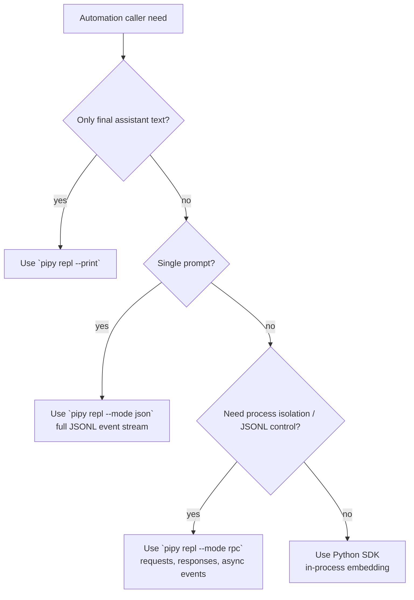

# Parity Slice Report: parity-20260706T094619Z

<!-- parity-run-label: parity-20260706T094619Z -->

<!-- BEGIN GENERATED:facts -->
## Generated Facts

| Field | Value |
| --- | --- |
| Run label | `parity-20260706T094619Z` |
| Agent | `pipy` |
| Recorded start | `89f919f4b4e4` |
| Main range start | `89f919f4b4e4` |
| Recorded end | `98cfcbb8b80a` |
| Gaps done | 1 |
| Stop reason | `cap_reached` |
| Exit code | 0 |
| Range note | `main_range_start..recorded_end`; this is factual, not curated semantic membership. |

### Recorded Range Commits

| Commit | Subject |
| --- | --- |
| `98cfcbb` | docs: add automation user guides |

### Change Shape

| Area | Files | Added | Deleted |
| --- | --- | --- | --- |
| docs | 7 | 159 | 23 |
| docs/superpowers | 2 | 39 | 0 |
| zensical.toml | 1 | 3 | 0 |

### Changed Files

| File | Added | Deleted |
| --- | --- | --- |
| docs/backlog.md | 6 | 6 |
| docs/index.md | 8 | 7 |
| docs/json.md | 54 | 0 |
| docs/pi-mono-gap-audit.md | 3 | 2 |
| docs/rpc.md | 78 | 0 |
| docs/sdk.md | 5 | 4 |
| docs/superpowers/specs/2026-07-06-automation-user-docs-implementation-plan.md | 14 | 0 |
| docs/superpowers/specs/2026-07-06-automation-user-docs-plan.md | 25 | 0 |
| docs/user-documentation.md | 5 | 4 |
| zensical.toml | 3 | 0 |

### Lesson Safety Net

No safety-net improvement commits were recorded.

### Recorded Caveats

None recorded in `run.jsonl`.

<!-- END GENERATED:facts -->

## What Changed

This slice shipped user-facing documentation for pipy automation surfaces that
already exist: one-shot JSON event streaming, long-lived JSONL RPC control, and
Python SDK embedding. Users now have separate entry pages that explain when to
choose `pipy repl --mode json`, `pipy repl --mode rpc`, `--print`, or the Python
SDK, what framing to expect on stdout/stdin/stderr, and why these transports
must be treated as full transcript/tool-output data rather than summary-safe
metadata.

The docs navigation and parity planning notes were updated so automation JSON/RPC
user documentation is no longer represented as an open user-docs gap. The deeper
`automation-rpc.md` protocol contract remains the maintainer/reference spec;
`json.md` and `rpc.md` are the outside-in user guides.

## Visualization

## Boundaries

This was a documentation-only parity slice. It did not add or change JSON mode,
RPC mode, SDK APIs, event schemas, request payloads, provider behavior, session
storage, or privacy enforcement. It also did not close the remaining user
documentation work for install/update deep dives.

## Comprehension Check

Which surface should a script use for one prompt when it needs every event, not just final text?

Use `pipy repl --mode json`, which emits newline-delimited JSON session events on
stdout for a single non-interactive run.

Why are JSON and RPC outputs not summary-safe logs?

They can include prompts, assistant text, tool-call arguments, tool results, and
bash output, so stdout should be treated as full transcript/tool-output content.

