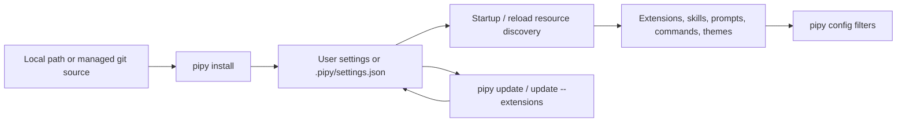

# Parity Slice Report: parity-20260706T100226Z

<!-- parity-run-label: parity-20260706T100226Z -->

<!-- BEGIN GENERATED:facts -->
## Generated Facts

| Field | Value |
| --- | --- |
| Run label | `parity-20260706T100226Z` |
| Agent | `pipy` |
| Recorded start | `32b655e07e3a` |
| Main range start | `32b655e07e3a` |
| Recorded end | `d1e14530957f` |
| Gaps done | 1 |
| Stop reason | `cap_reached` |
| Exit code | 0 |
| Range note | `main_range_start..recorded_end`; this is factual, not curated semantic membership. |

### Recorded Range Commits

| Commit | Subject |
| --- | --- |
| `d1e1453` | docs: add package install update guide |

### Change Shape

| Area | Files | Added | Deleted |
| --- | --- | --- | --- |
| docs | 9 | 308 | 51 |
| zensical.toml | 1 | 1 | 0 |

### Changed Files

| File | Added | Deleted |
| --- | --- | --- |
| docs/backlog.md | 4 | 0 |
| docs/index.md | 39 | 37 |
| docs/package-install-update-implementation.md | 19 | 0 |
| docs/package-install-update-plan.md | 49 | 0 |
| docs/packages.md | 175 | 0 |
| docs/pi-mono-gap-audit.md | 6 | 4 |
| docs/quickstart.md | 2 | 0 |
| docs/usage.md | 2 | 1 |
| docs/user-documentation.md | 12 | 9 |
| zensical.toml | 1 | 0 |

### Lesson Safety Net

No safety-net improvement commits were recorded.

### Recorded Caveats

None recorded in `run.jsonl`.

<!-- END GENERATED:facts -->

## What Changed

This slice shipped the missing user-facing package install/update guide. Users
now have a documented path for installing trusted local or managed-git pipy
packages, removing/uninstalling them, listing installed sources, inspecting and
filtering contributed resources with `pipy config`, and reconciling packages with
`pipy update`.

The documentation is explicit about the behavior pipy actually supports today:
packages are trusted local resources, project installs live in `.pipy/settings.json`,
user installs stay in the user config root, local paths are not copied, managed
git packages are cached and reconciled, and installed packages can contribute
Python extensions, skills, prompt templates, custom slash commands, and TOML
themes. The main docs navigation, quickstart, usage guide, parity audit, and
backlog now point to that package guide instead of treating install/update docs
as a missing parity gap.

## Visualization

## Boundaries

This was a docs-only parity slice. It did not add new package runtime behavior,
new installer support, or new extension APIs. PyPI and npm package sources remain
deferred pending supply-chain policy, JavaScript/TypeScript Pi extensions are not
executed by pipy, and broader extension/package platform follow-ons remain in the
parity backlog.

## Comprehension Check

What package sources does the shipped guide tell users to rely on today?

Local paths and managed git sources. PyPI/npm package sources are explicitly not
supported yet.

What user-visible gap did this slice close?

The missing install/update package documentation gap: users can now find one
package guide covering install, remove/uninstall, list, config/filtering, update,
settings scopes, package layout, runtime loading, and limitations.

