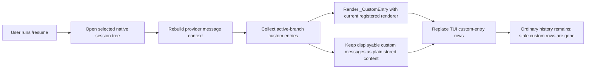

# Parity Slice Report: parity-20260706T121122Z

<!-- parity-run-label: parity-20260706T121122Z -->

<!-- BEGIN GENERATED:facts -->
## Generated Facts

| Field | Value |
| --- | --- |
| Run label | `parity-20260706T121122Z` |
| Agent | `pipy` |
| Recorded start | `031745265d34` |
| Main range start | `031745265d34` |
| Recorded end | `f16cd154e362` |
| Gaps done | 1 |
| Stop reason | `cap_reached` |
| Exit code | 0 |
| Range note | `main_range_start..recorded_end`; this is factual, not curated semantic membership. |

### Recorded Range Commits

| Commit | Subject |
| --- | --- |
| `f16cd15` | feat(extension): redraw custom entries on resume |

### Change Shape

| Area | Files | Added | Deleted |
| --- | --- | --- | --- |
| docs | 3 | 34 | 44 |
| docs/superpowers | 2 | 60 | 0 |
| scripts | 1 | 34 | 0 |
| src | 2 | 109 | 0 |
| tests | 1 | 75 | 0 |

### Changed Files

| File | Added | Deleted |
| --- | --- | --- |
| docs/backlog.md | 17 | 32 |
| docs/extension-api.md | 9 | 9 |
| docs/pi-mono-gap-audit.md | 8 | 3 |
| docs/superpowers/plans/2026-07-06-extension-rich-message-resume-redraw-implementation.md | 24 | 0 |
| docs/superpowers/specs/2026-07-06-extension-rich-message-resume-redraw-plan.md | 36 | 0 |
| scripts/parity_checks/extension_message_renderer_conformance.py | 34 | 0 |
| src/pipy_harness/native/tool_loop_session.py | 47 | 0 |
| src/pipy_harness/native/tui.py | 62 | 0 |
| tests/test_native_extension_message_renderer.py | 75 | 0 |

### Lesson Safety Net

No safety-net improvement commits were recorded.

### Recorded Caveats

None recorded in `run.jsonl`.

<!-- END GENERATED:facts -->

## What Changed

Extensions that add custom session entries now behave correctly across an
interactive `/resume`: after switching sessions, pipy removes stale extension
custom rows from the previously active branch and redraws the newly active
branch's visible custom entries. `_CustomEntry` rows are rendered with the
message renderer registered in the current run, including rich/component output
when available; displayable custom messages continue to appear as plain stored
content. Renderer output remains live-only and fail-soft, so redraw does not
mutate the session file or archive rendered bodies.

This aligns pipy's native TUI more closely with Pi's session-switch behavior:
resume rebuilds the visible custom-message surface from the active session
rather than leaving old extension-rendered rows in the scrollback.

## Visualization

## Boundaries

This slice only redraws committed custom-entry rows after successful in-session
`/resume` switches and preserves the existing startup-open replay behavior. It
does not add live per-frame renderer invalidation, multi-widget custom message
components, rendering persisted `CustomMessageEntry` values through extension
renderers, full custom editor input/rendering integration, OAuth `/login` wiring,
or package-source policy for PyPI/npm extensions.

## Comprehension Check

What visible problem does this fix?

After `/resume`, extension-rendered custom rows from the old active branch could
remain visible. The TUI now replaces those rows with custom entries from the
newly active branch.

Does redraw persist renderer output to the session archive?

No. Renderer output is still live-only; only JSON-safe entry data or stored plain
custom-message content remains in the session tree.

