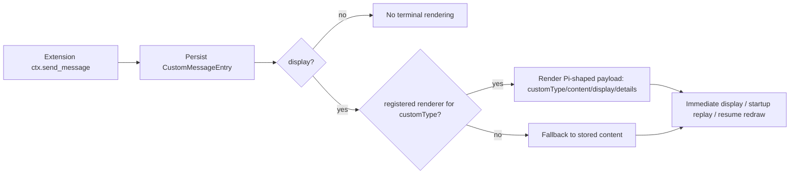

# Parity Slice Report: parity-20260706T123416Z

<!-- parity-run-label: parity-20260706T123416Z -->

<!-- BEGIN GENERATED:facts -->
## Generated Facts

| Field | Value |
| --- | --- |
| Run label | `parity-20260706T123416Z` |
| Agent | `pipy` |
| Recorded start | `1896d7dfb9da` |
| Main range start | `1896d7dfb9da` |
| Recorded end | `3bf62e909dfd` |
| Gaps done | 1 |
| Stop reason | `cap_reached` |
| Exit code | 0 |
| Range note | `main_range_start..recorded_end`; this is factual, not curated semantic membership. |

### Recorded Range Commits

| Commit | Subject |
| --- | --- |
| `3bf62e9` | feat(extension): render custom messages with registered renderers |

### Change Shape

| Area | Files | Added | Deleted |
| --- | --- | --- | --- |
| CHANGELOG.md | 1 | 6 | 3 |
| docs | 4 | 10 | 8 |
| docs/superpowers | 2 | 44 | 0 |
| scripts | 1 | 22 | 4 |
| src | 1 | 85 | 14 |
| tests | 1 | 83 | 0 |

### Changed Files

| File | Added | Deleted |
| --- | --- | --- |
| CHANGELOG.md | 6 | 3 |
| docs/backlog.md | 0 | 1 |
| docs/extension-api.md | 6 | 3 |
| docs/parity-plan.md | 2 | 2 |
| docs/pi-mono-gap-audit.md | 2 | 2 |
| docs/superpowers/plans/2026-07-06-custom-message-entry-renderer-implementation.md | 18 | 0 |
| docs/superpowers/specs/2026-07-06-custom-message-entry-renderer-plan.md | 26 | 0 |
| scripts/parity_checks/extension_message_renderer_conformance.py | 22 | 4 |
| src/pipy_harness/native/tool_loop_session.py | 85 | 14 |
| tests/test_native_extension_message_renderer.py | 83 | 0 |

### Lesson Safety Net

No safety-net improvement commits were recorded.

### Recorded Caveats

None recorded in `run.jsonl`.

<!-- END GENERATED:facts -->

## What Changed

Extensions that call `ctx.send_message` with a displayable custom message now get the same renderer path as other custom extension output. When a renderer is registered for the message's `customType`, pipy passes a Pi-shaped payload containing `customType`, `content`, `display`, and JSON-safe `details`, then displays the renderer result in the terminal UI. The behavior applies to newly sent messages, startup replay of persisted session history, and active-branch custom-message redraws after `/resume`.

If no renderer is registered, the message still falls back to its stored text content. Hidden custom messages remain hidden, renderer output remains live-only rather than persisted, and renderer failures continue to be fail-soft.

## Visualization

## Boundaries

This slice did not change the persisted session schema: custom-message renderer results are not stored, only the original message fields are. It also did not ship the remaining message-entry follow-ons called out in the audit, such as streaming `steer`/`followUp` delivery or full-history redraw semantics for `/resume` switches. Broader rich extension UI work, live render invalidation, and multi-widget message components remain separate parity gaps.

## Comprehension Check

What data does a custom-message renderer receive for a persisted `CustomMessageEntry`?

A JSON-safe payload shaped like Pi's custom message object: `customType`, `content`, `display`, and `details`.

What happens when there is no registered renderer for the message type?

The visible custom message falls back to displaying its stored `content`, preserving the previous user-visible behavior.

