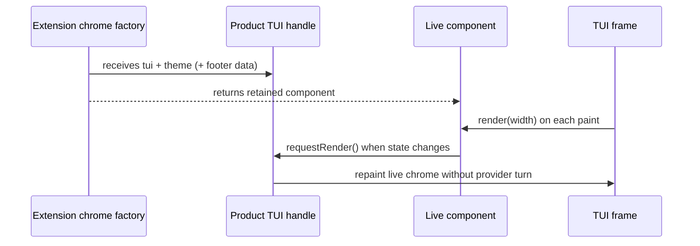

# Parity Slice Report: parity-20260706T125759Z

<!-- parity-run-label: parity-20260706T125759Z -->

<!-- BEGIN GENERATED:facts -->
## Generated Facts

| Field | Value |
| --- | --- |
| Run label | `parity-20260706T125759Z` |
| Agent | `pipy` |
| Recorded start | `2b6547e740a3` |
| Main range start | `2b6547e740a3` |
| Recorded end | `055fdb455b50` |
| Gaps done | 1 |
| Stop reason | `cap_reached` |
| Exit code | 0 |
| Range note | `main_range_start..recorded_end`; this is factual, not curated semantic membership. |

### Recorded Range Commits

| Commit | Subject |
| --- | --- |
| `055fdb4` | feat(extension): support live chrome requestRender |

### Change Shape

| Area | Files | Added | Deleted |
| --- | --- | --- | --- |
| docs | 4 | 18 | 28 |
| docs/superpowers | 2 | 48 | 0 |
| scripts | 1 | 26 | 2 |
| src | 1 | 98 | 23 |
| tests | 1 | 101 | 0 |

### Changed Files

| File | Added | Deleted |
| --- | --- | --- |
| docs/backlog.md | 2 | 4 |
| docs/extension-api.md | 13 | 16 |
| docs/parity-plan.md | 2 | 5 |
| docs/pi-mono-gap-audit.md | 1 | 3 |
| docs/superpowers/plans/2026-07-06-extension-chrome-request-render.md | 16 | 0 |
| docs/superpowers/specs/2026-07-06-extension-chrome-request-render.md | 32 | 0 |
| scripts/parity_checks/extension_chrome_widgets_conformance.py | 26 | 2 |
| src/pipy_harness/native/tui.py | 98 | 23 |
| tests/test_native_tui_chrome_widgets.py | 101 | 0 |

### Lesson Safety Net

No safety-net improvement commits were recorded.

### Recorded Caveats

None recorded in `run.jsonl`.

<!-- END GENERATED:facts -->

## What Changed

Extension chrome components are now live instead of snapshot-only after their initial render. Widget and header factories receive a Pi-shaped TUI handle plus the active theme, and footer factories receive that handle, theme, and footer data. The handle exposes `requestRender()` (and the Pythonic `request_render()` alias), so an extension chrome component can ask the product TUI to repaint without waiting for a provider turn.

Factory-created chrome components are retained and their `render(width)` method is called on each frame, including at the same terminal width, so state changes inside an extension can become visible immediately. Repaint requests made while a component is already rendering are coalesced into one follow-up paint rather than recursing. Legacy pipy factory arities still work when their signatures cannot accept the Pi-shaped arguments, while body-raised `TypeError`s remain fail-soft failures and are not retried with duplicate side effects.

## Visualization

## Boundaries

This slice is limited to the already-supported product-TUI chrome regions: `set_widget`, `set_header`, and `set_footer`. It does not ship Pi's full async render scheduler, overlay/component input, full custom editor rendering, multi-widget message components, live tool-render invalidation, or immediate UI-driver threading for non-lifecycle hooks. Static string/list chrome keeps snapshot semantics.

## Comprehension Check

What new argument do chrome factories receive?

Widget and header factories receive `(tui_handle, theme)`, and footer factories receive `(tui_handle, theme, footer_data)`. The handle includes `requestRender()`.

What does `requestRender()` do in this slice?

It requests a fail-soft live repaint of extension chrome without creating a provider turn; calls made during rendering are coalesced into a follow-up paint.

