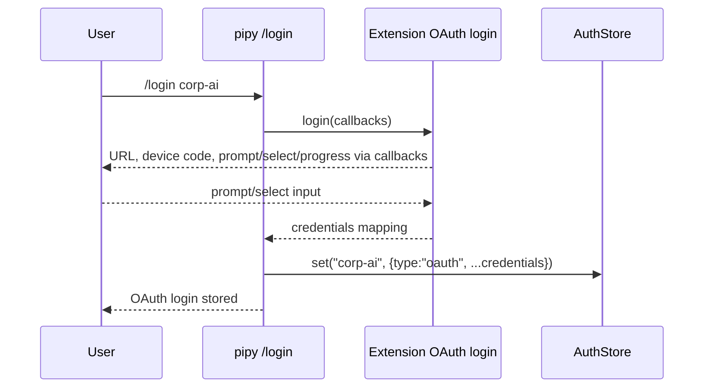

# Parity Slice Report: parity-20260706T133355Z

<!-- parity-run-label: parity-20260706T133355Z -->

<!-- BEGIN GENERATED:facts -->
## Generated Facts

| Field | Value |
| --- | --- |
| Run label | `parity-20260706T133355Z` |
| Agent | `pipy` |
| Recorded start | `210514c6eb82` |
| Main range start | `210514c6eb82` |
| Recorded end | `6331cfac6be2` |
| Gaps done | 1 |
| Stop reason | `cap_reached` |
| Exit code | 0 |
| Range note | `main_range_start..recorded_end`; this is factual, not curated semantic membership. |

### Recorded Range Commits

| Commit | Subject |
| --- | --- |
| `ee4c330` | feat(extensions): wire OAuth provider login |
| `6331cfa` | chore(lessons): record extension oauth review finding |

### Change Shape

| Area | Files | Added | Deleted |
| --- | --- | --- | --- |
| docs | 3 | 62 | 23 |
| docs/parity-loop | 3 | 52 | 0 |
| scripts | 1 | 22 | 1 |
| src | 4 | 182 | 21 |
| tests | 1 | 57 | 0 |

### Changed Files

| File | Added | Deleted |
| --- | --- | --- |
| docs/backlog.md | 8 | 3 |
| docs/extension-api.md | 40 | 17 |
| docs/parity-loop/extension-oauth-login-implementation-plan.md | 21 | 0 |
| docs/parity-loop/extension-oauth-login-plan.md | 30 | 0 |
| docs/parity-loop/lessons/lessons.jsonl | 1 | 0 |
| docs/pi-mono-gap-audit.md | 14 | 3 |
| scripts/parity_checks/extension_providers_conformance.py | 22 | 1 |
| src/pipy_harness/extensions.py | 2 | 0 |
| src/pipy_harness/native/catalog_state.py | 25 | 3 |
| src/pipy_harness/native/extension_runtime.py | 18 | 0 |
| src/pipy_harness/native/repl_state.py | 137 | 18 |
| tests/test_native_extension_providers.py | 57 | 0 |

### Lesson Safety Net

| Phase | Log | Start | End | Exit | Open Before | Open After | Commits |
| --- | --- | --- | --- | --- | --- | --- | --- |
| postloop | improve-postloop.log | `6331cfac6be2` | `386d21029bce` | 0 | 1 | 0 | `fc704cc` docs(parity): apply lesson 2026-07-06-9dc618 `386d210` chore(lessons): mark 2026-07-06-9dc618 applied |

### Recorded Caveats

| Phase | Log | Caveat |
| --- | --- | --- |
| postloop | improve-postloop.log | Caveat: repo was already ahead of `origin/main`; it is now `ahead 4`. |

<!-- END GENERATED:facts -->

## What Changed

This slice made extension-registered OAuth providers usable from the native product login flow. A Python extension can register an `ExtensionProvider` with `ExtensionOAuthConfig`; pipy now treats the provider name as the Pi-style derived OAuth id, reports that provider as `login-required` until credentials exist, and lets users run `/login <provider>` to complete the extension-owned OAuth exchange.

During login, pipy calls the extension's synchronous `login(callbacks)` function with Pi-shaped callback methods for browser/auth URLs, device-code messages, prompts, selections, and progress output. Returned credentials are stored in the shared `AuthStore` as `{"type":"oauth", ...}`. `/logout <provider>` removes those stored credentials and moves the active selection away from the provider when needed. Built-in `openai-codex` login/logout behavior remains intact, and non-OAuth extension providers stay available without this credential gate.

The post-loop lesson tightened the implementation-slice documentation rule: when a shipped item is inserted into a numbered slice list, subsequent entries must be renumbered in the same change so the source remains clear to reviewers.

## Visualization

## Boundaries

This slice did not add declarative API-backed provider configuration, credential injection into provider factories, async OAuth login callbacks, or broader provider/auth helper APIs. The OAuth callback is invoked only during explicit `/login`; activation, catalog projection, and provider-port construction still do not run extension OAuth code. Package-source expansion and other extension-platform polish remain separate parity work.

## Comprehension Check

What provider id does pipy use for an extension OAuth login?

The normalized extension provider name, matching Pi's derived OAuth id behavior; extension authors do not provide a separate OAuth id.

When does an OAuth-backed extension provider become available?

After `/login <provider>` succeeds and pipy stores an OAuth credential record for that provider in `AuthStore`. Until then, catalog availability reports `login-required`.

