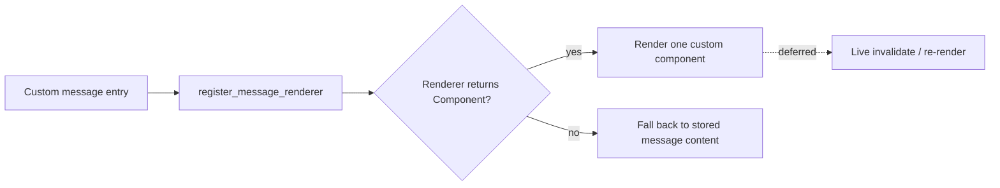

# Parity Slice Report: parity-20260706T143717Z

<!-- parity-run-label: parity-20260706T143717Z -->

<!-- BEGIN GENERATED:facts -->
## Generated Facts

| Field | Value |
| --- | --- |
| Run label | `parity-20260706T143717Z` |
| Agent | `pipy` |
| Recorded start | `7bbac77670f0` |
| Main range start | `7bbac77670f0` |
| Recorded end | `7b6f7bf43c43` |
| Gaps done | 1 |
| Stop reason | `cap_reached` |
| Exit code | 0 |
| Range note | `main_range_start..recorded_end`; this is factual, not curated semantic membership. |

### Recorded Range Commits

| Commit | Subject |
| --- | --- |
| `7b6f7bf` | docs(parity): correct message renderer follow-on scope |

### Change Shape

| Area | Files | Added | Deleted |
| --- | --- | --- | --- |
| docs | 5 | 44 | 11 |

### Changed Files

| File | Added | Deleted |
| --- | --- | --- |
| docs/backlog.md | 5 | 4 |
| docs/extension-api.md | 6 | 4 |
| docs/parity-loop-impl-plan-message-renderer-scope.md | 15 | 0 |
| docs/parity-loop-plan-message-renderer-scope.md | 15 | 0 |
| docs/pi-mono-gap-audit.md | 3 | 3 |

### Lesson Safety Net

No safety-net improvement commits were recorded.

### Recorded Caveats

None recorded in `run.jsonl`.

<!-- END GENERATED:facts -->

## What Changed

This was a documentation-only parity correction: the extension roadmap no longer advertises "multi-widget message components" as a Pi parity gap. The referenced Pi API returns a single `Component | undefined` for each custom message renderer, so pipy's already shipped single-component custom message renderer is the correct shape. The remaining user-visible follow-on is live custom message component invalidation/re-rendering, not a new multi-widget message-renderer surface.

## Visualization

## Boundaries

No runtime behavior shipped in this slice. It did not add live custom message invalidation, full custom editor rendering/input integration, broader provider/auth helpers, remote package distribution, or any new extension UI surface. It only corrected the documented parity target so future work follows Pi's single-component message-renderer contract.

## Comprehension Check

What parity gap was removed?

"Multi-widget message components" was removed because Pi's message renderer API returns at most one component per custom message.

What message-renderer gap remains?

Live custom message component invalidation/re-rendering remains deferred beyond the shipped render-once single-component behavior.

