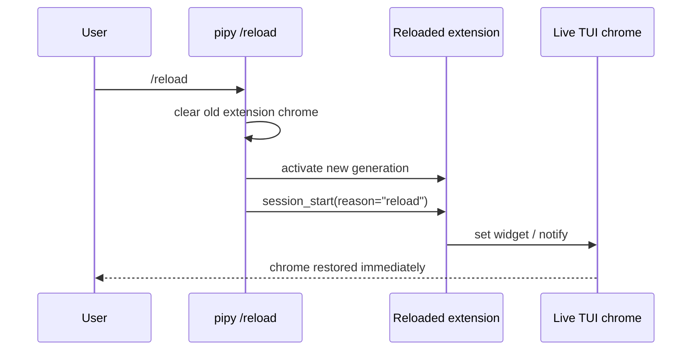

# Parity Slice Report: parity-20260707T150554Z

<!-- parity-run-label: parity-20260707T150554Z -->

<!-- BEGIN GENERATED:facts -->
## Generated Facts

| Field | Value |
| --- | --- |
| Run label | `parity-20260707T150554Z` |
| Agent | `pipy` |
| Recorded start | `a1ed3a21fe37` |
| Main range start | `a1ed3a21fe37` |
| Recorded end | `d6ce4832d955` |
| Gaps done | 1 |
| Stop reason | `cap_reached` |
| Exit code | 0 |
| Range note | `main_range_start..recorded_end`; this is factual, not curated semantic membership. |

### Recorded Range Commits

| Commit | Subject |
| --- | --- |
| `d6ce483` | feat(extension): fire session_start on reload |

### Change Shape

| Area | Files | Added | Deleted |
| --- | --- | --- | --- |
| docs | 1 | 4 | 6 |
| docs/parity-loop | 2 | 47 | 0 |
| src | 1 | 2 | 0 |
| tests | 2 | 128 | 2 |

### Changed Files

| File | Added | Deleted |
| --- | --- | --- |
| docs/extension-api.md | 4 | 6 |
| docs/parity-loop/plans/20260707-reload-session-start-implementation.md | 19 | 0 |
| docs/parity-loop/plans/20260707-reload-session-start.md | 28 | 0 |
| src/pipy_harness/native/tool_loop_session.py | 2 | 0 |
| tests/test_native_extension_chrome_session.py | 87 | 2 |
| tests/test_native_tool_loop_session.py | 41 | 0 |

### Lesson Safety Net

No safety-net improvement commits were recorded.

### Recorded Caveats

None recorded in `run.jsonl`.

<!-- END GENERATED:facts -->

## What Changed

`/reload` now behaves like Pi for extension session startup lifecycle. After pipy reloads the extension generation and rebinds extension-provided commands, flags, renderers, menu metadata, and live UI hooks, it fires the new generation's `session_start` hook with `reason="reload"`.

User-visible effect: extension chrome or notifications that are initialized only from `session_start` are restored immediately after `/reload`, instead of staying blank until a later lifecycle event. The hook sees the reloaded extension code/state and can update the live TUI without causing a provider turn.

## Visualization

## Boundaries

This slice only shipped the reload-time `session_start(reason="reload")` parity behavior. It did not change normal startup `session_start` semantics, add reload-time `session_shutdown`, alter package/source policy, or change fail-soft lifecycle error handling. If a reloaded extension no longer exists or no longer registers a `session_start` hook, `/reload` still clears the old chrome and nothing restores it.

## Comprehension Check

What reason does an extension receive when its session_start hook runs because of /reload?

`reason="reload"`; startup hooks still use the existing startup reason.

Does the reload session_start hook trigger a provider/model turn?

No. The lifecycle hook runs during reload so extensions can refresh UI state, and the tests assert no provider call occurs.

