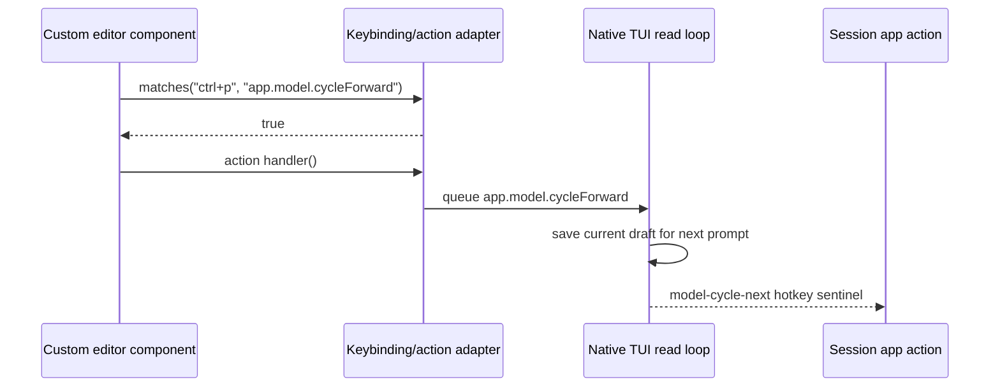

# Parity Slice Report: parity-20260707T210111Z

<!-- parity-run-label: parity-20260707T210111Z -->

<!-- BEGIN GENERATED:facts -->
## Generated Facts

| Field | Value |
| --- | --- |
| Run label | `parity-20260707T210111Z` |
| Agent | `pipy` |
| Recorded start | `9b430621de0f` |
| Main range start | `9b430621de0f` |
| Recorded end | `5138c86bc0cf` |
| Gaps done | 1 |
| Stop reason | `cap_reached` |
| Exit code | 0 |
| Range note | `main_range_start..recorded_end`; this is factual, not curated semantic membership. |

### Recorded Range Commits

| Commit | Subject |
| --- | --- |
| `ff54aad` | feat(extension): delegate custom editor app hotkeys |
| `5138c86` | chore(lessons): capture custom editor hotkey review |

### Change Shape

| Area | Files | Added | Deleted |
| --- | --- | --- | --- |
| docs | 3 | 19 | 13 |
| docs/parity-loop | 3 | 37 | 0 |
| src | 1 | 119 | 9 |
| tests | 1 | 84 | 2 |

### Changed Files

| File | Added | Deleted |
| --- | --- | --- |
| docs/backlog.md | 9 | 6 |
| docs/extension-api.md | 8 | 5 |
| docs/parity-loop/lessons/lessons.jsonl | 1 | 0 |
| docs/parity-loop/plans/20260707-custom-editor-app-hotkeys-implementation.md | 10 | 0 |
| docs/parity-loop/plans/20260707-custom-editor-app-hotkeys.md | 26 | 0 |
| docs/pi-mono-gap-audit.md | 2 | 2 |
| src/pipy_harness/native/tui.py | 119 | 9 |
| tests/test_native_custom_editor_component.py | 84 | 2 |

### Lesson Safety Net

| Phase | Log | Start | End | Exit | Open Before | Open After | Commits |
| --- | --- | --- | --- | --- | --- | --- | --- |
| postloop | improve-postloop.log | `5138c86bc0cf` | `13893b44d440` | 0 | 1 | 0 | `aadcebe` test(custom-editor): cover camel app hotkey delegation `13893b4` chore(lessons): mark 2026-07-07-6dae57 applied |

### Recorded Caveats

| Phase | Log | Caveat |
| --- | --- | --- |
| postloop | improve-postloop.log | Caveat: First `just check` hit macOS “Too many open files”; reran with `ulimit -n 4096`. |
| postloop | improve-postloop.log | Caveat: One full-suite run had a transient PTY test failure; the focused failing test passed immediately, and a subsequent full `just check` passed. |

<!-- END GENERATED:facts -->

## What Changed

Custom editor components can now delegate the same app-level hotkeys that the native message editor handles. When an extension-provided editor receives Pi-style key specs such as `ctrl+p`, `ctrl+o`, or `shift-tab`, it gets a bounded keybinding/action adapter and wired action handlers for model cycling, thinking-mode controls, tools expansion, and extension shortcuts. Triggering one of those handlers returns the same session hotkey sentinel as the built-in editor, while preserving the in-progress draft so it reappears after the app action completes.

The slice also tightened Pi-shape compatibility by supporting both snake-case and camelCase component surfaces, including `action_handlers`/`actionHandlers` and `matches_action`/`matchesAction`, so translated Pi custom editors can use their expected naming style.

## Visualization

## Boundaries

This slice did not implement the full Pi editor/component library. The adapter is intentionally bounded to the app hotkeys needed by live custom editors: model cycling, thinking controls, tools expansion, and extension shortcuts. Broader rich component parity, package-source policy work, and other deferred extension API gaps remain outside this change.

## Comprehension Check

What happens to text already typed into a custom editor when it delegates an app hotkey?

The TUI copies the custom editor text into pending initial text, clears the component for the app action, and restores the draft on the next prompt instead of losing it.

Why does the adapter accept both `ctrl-p` and `ctrl+p` forms?

Pipy's native read loop decodes keys in dash form, while Pi-style custom editors often inspect plus-form key specs. Supporting both lets translated editors match live events without rewriting their Pi-shaped keybinding logic.

