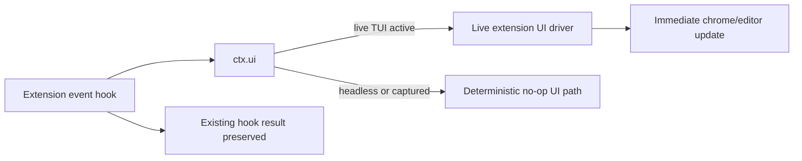

# Parity Slice Report: parity-20260709T030629Z

<!-- parity-run-label: parity-20260709T030629Z -->

<!-- BEGIN GENERATED:facts -->
## Generated Facts

| Field | Value |
| --- | --- |
| Run label | `parity-20260709T030629Z` |
| Agent | `pipy` |
| Recorded start | `e7d5e19039da` |
| Main range start | `e7d5e19039da` |
| Recorded end | `f2e52ea65132` |
| Gaps done | 1 |
| Stop reason | `cap_reached` |
| Exit code | 0 |
| Range note | `main_range_start..recorded_end`; this is factual, not curated semantic membership. |

### Recorded Range Commits

| Commit | Subject |
| --- | --- |
| `c552fff` | feat(extensions): thread live ui into event hooks |
| `f2e52ea` | chore(lessons): record parity gate retry note |

### Change Shape

| Area | Files | Added | Deleted |
| --- | --- | --- | --- |
| docs | 3 | 12 | 12 |
| docs/parity-loop | 1 | 1 | 0 |
| docs/superpowers | 2 | 36 | 0 |
| src | 2 | 24 | 7 |
| tests | 1 | 206 | 0 |

### Changed Files

| File | Added | Deleted |
| --- | --- | --- |
| docs/backlog.md | 6 | 4 |
| docs/extension-api.md | 5 | 5 |
| docs/parity-loop/lessons/lessons.jsonl | 1 | 0 |
| docs/pi-mono-gap-audit.md | 1 | 3 |
| docs/superpowers/plans/live-extension-event-ui-driver-implementation.md | 22 | 0 |
| docs/superpowers/specs/live-extension-event-ui-driver-plan.md | 14 | 0 |
| src/pipy_harness/native/extension_runtime.py | 14 | 7 |
| src/pipy_harness/native/tool_loop_session.py | 10 | 0 |
| tests/test_native_extension_live_session_hooks.py | 206 | 0 |

### Lesson Safety Net

| Phase | Log | Start | End | Exit | Open Before | Open After | Commits |
| --- | --- | --- | --- | --- | --- | --- | --- |
| postloop | improve-postloop.log | `f2e52ea65132` | `6acf7f6df815` | 0 | 1 | 0 | `8af0295` test(parity): pin fd pressure gate guidance `6acf7f6` chore(lessons): mark 2026-07-09-406f78 applied |

### Recorded Caveats

| Phase | Log | Caveat |
| --- | --- | --- |
| postloop | improve-postloop.log | Caveat: `opus-review-loop` command was not installed, so I used a direct fresh `claude -p --model opus` review context instead. |

<!-- END GENERATED:facts -->

## What Changed

Extensions running during live product-TUI sessions can now update the visible interface from ordinary event hooks, not only from lifecycle startup hooks. Hooks for input transforms, before-agent-start, tool-call and tool-result handling, user bash gates, provider-request transforms, and session-before gates all receive the same live UI driver when a terminal UI is active.

The user-visible result is that Pi-shaped `ctx.ui` calls made from those hooks paint immediately: status entries, widgets, editor text updates/pastes, and tool-expansion state changes affect the current TUI as the hook runs. The hook's existing semantic result still applies normally, such as transforming input, appending system prompt text, blocking a tool, rewriting a tool result, allowing or rewriting a bash command, transforming the provider prompt, or blocking a session operation.

Headless and captured contexts keep deterministic no-op UI behavior, so the slice does not make non-interactive extension runs depend on terminal state.

## Visualization

## Boundaries

- This slice only threaded the existing live UI driver into non-lifecycle event dispatchers and their live session call sites; it did not add new `ctx.ui` methods or change their Pi-shaped semantics.
- Hook ordering, transform/block decision policy, fail-open/fail-closed behavior, notification privacy, and dynamic flag behavior were intentionally left unchanged.
- Remaining extension parity work still includes custom editor/component-library follow-ons, `send_message` turn-delivery behavior, streaming steer/follow-up delivery, `/resume` redraw behavior, `CustomMessageEntry` renderer dispatch, live tool-render invalidation beyond render-once snapshots, broader dynamic-flag integration, and broader extension state helpers.
- The follow-up lesson about retrying `just check` under macOS file-descriptor pressure was recorded separately; it did not change shipped extension behavior in this slice.

## Comprehension Check

What can an extension now do from a `tool_call` or `before_provider_request` hook in a live TUI session?

It can make Pi-shaped `ctx.ui` calls such as setting status, adding widgets, editing or pasting into the editor, or changing tool expansion state, and those changes appear immediately in the product TUI while the hook still returns its normal block/transform decision.

Did this change make headless extension runs paint or depend on a terminal?

No. When there is no live UI, the same UI calls remain deterministic no-ops, preserving captured/headless behavior.

