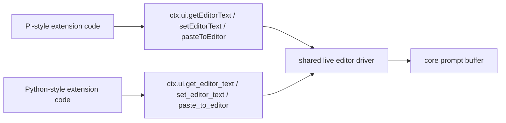

# Parity Slice Report: parity-20260709T092221Z

<!-- parity-run-label: parity-20260709T092221Z -->

<!-- BEGIN GENERATED:facts -->
## Generated Facts

| Field | Value |
| --- | --- |
| Run label | `parity-20260709T092221Z` |
| Agent | `pipy` |
| Recorded start | `9e4a41df9ea5` |
| Main range start | `9e4a41df9ea5` |
| Recorded end | `31d9135c0eea` |
| Gaps done | 1 |
| Stop reason | `cap_reached` |
| Exit code | 0 |
| Range note | `main_range_start..recorded_end`; this is factual, not curated semantic membership. |

### Recorded Range Commits

| Commit | Subject |
| --- | --- |
| `44d51f9` | feat(extension-api): add camelcase editor text helpers |
| `31d9135` | chore(lessons): capture editor alias coverage lesson |

### Change Shape

| Area | Files | Added | Deleted |
| --- | --- | --- | --- |
| CHANGELOG.md | 1 | 6 | 3 |
| docs | 3 | 18 | 6 |
| docs/parity-loop | 3 | 51 | 0 |
| src | 1 | 15 | 0 |
| tests | 1 | 73 | 2 |

### Changed Files

| File | Added | Deleted |
| --- | --- | --- |
| CHANGELOG.md | 6 | 3 |
| docs/backlog.md | 5 | 0 |
| docs/extension-api.md | 8 | 6 |
| docs/parity-loop/lessons/lessons.jsonl | 1 | 0 |
| docs/parity-loop/plans/camelcase-editor-helpers-implementation.md | 21 | 0 |
| docs/parity-loop/plans/camelcase-editor-helpers.md | 29 | 0 |
| docs/pi-mono-gap-audit.md | 5 | 0 |
| src/pipy_harness/native/extension_runtime.py | 15 | 0 |
| tests/test_native_extension_dispatch.py | 73 | 2 |

### Lesson Safety Net

| Phase | Log | Start | End | Exit | Open Before | Open After | Commits |
| --- | --- | --- | --- | --- | --- | --- | --- |
| postloop | improve-postloop.log | `31d9135c0eea` | `8e9302e11b8e` | 0 | 1 | 0 | `44b74c9` test(extension-api): cover editor helper alias effects `8e9302e` chore(lessons): mark 2026-07-09-a3ba73 applied |

### Recorded Caveats

| Phase | Log | Caveat |
| --- | --- | --- |
| postloop | improve-postloop.log | Caveat: initial plain `just check` hit macOS `Too many open files`; unchanged retry with `ulimit -n 4096` passed, per repo workflow guidance. |

<!-- END GENERATED:facts -->

## What Changed

Extension command and shortcut handlers can now use Pi's canonical camelCase editor text helpers on `ctx.ui`:

- `getEditorText()` reads the current prompt editor contents.
- `setEditorText(text)` replaces the prompt editor contents.
- `pasteToEditor(text)` inserts/pastes text through the same live editor path as the existing helper.

These names are aliases over the already-shipped live editor integration, so translated Pi extensions no longer need to be rewritten to Python-style snake_case for this part of the UI API. The existing `get_editor_text`, `set_editor_text`, and `paste_to_editor` names remain available as Python convenience helpers. Headless behavior is unchanged: reads return an empty string and writes/pastes are deterministic no-ops.

A follow-up safety-net commit strengthened tests so both naming styles prove each intermediate editor effect, not just the final overwritten buffer state.

## Visualization

## Boundaries

This slice only closed the naming parity gap for the core editor text helpers. It did not add new editor capabilities, change paste semantics, expose raw mutable editor internals, or alter custom editor component behavior. Broader extension/package platform parity remains deferred outside this focused alias slice.

## Comprehension Check

Which extension code benefits directly from this slice?

Pi-shaped command or shortcut code that calls `ctx.ui.getEditorText()`, `ctx.ui.setEditorText(text)`, or `ctx.ui.pasteToEditor(text)` now runs without renaming those calls to snake_case.

Did the existing snake_case helpers change?

No. They remain supported Python convenience aliases and delegate to the same live editor behavior as the new camelCase names.

