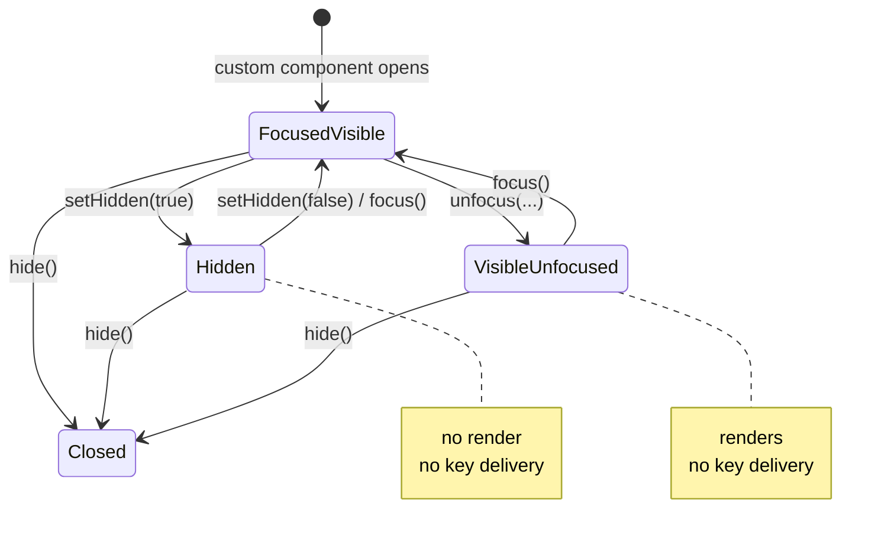

# Parity Slice Report: parity-20260710T063810Z

<!-- parity-run-label: parity-20260710T063810Z -->

<!-- BEGIN GENERATED:facts -->
## Generated Facts

| Field | Value |
| --- | --- |
| Run label | `parity-20260710T063810Z` |
| Agent | `pipy` |
| Recorded start | `e5c572754863` |
| Main range start | `e5c572754863` |
| Recorded end | `8b6a081cbd9d` |
| Gaps done | 1 |
| Stop reason | `cap_reached` |
| Exit code | 0 |
| Range note | `main_range_start..recorded_end`; this is factual, not curated semantic membership. |

### Recorded Range Commits

| Commit | Subject |
| --- | --- |
| `8b6a081` | feat(extension): add custom overlay handle controls |

### Change Shape

| Area | Files | Added | Deleted |
| --- | --- | --- | --- |
| docs | 5 | 69 | 12 |
| src | 1 | 59 | 4 |
| tests | 1 | 68 | 2 |

### Changed Files

| File | Added | Deleted |
| --- | --- | --- |
| docs/backlog.md | 4 | 0 |
| docs/extension-api.md | 13 | 5 |
| docs/extension-custom-overlay-handle-implementation.md | 12 | 0 |
| docs/extension-custom-overlay-handle-plan.md | 30 | 0 |
| docs/pi-mono-gap-audit.md | 10 | 7 |
| src/pipy_harness/native/tui.py | 59 | 4 |
| tests/test_native_extension_custom_ui.py | 68 | 2 |

### Lesson Safety Net

No safety-net improvement commits were recorded.

### Recorded Caveats

None recorded in `run.jsonl`.

<!-- END GENERATED:facts -->

## What Changed

This slice made pipy's live `ctx.ui.custom(..., options)` handle much closer to Pi's overlay handle. Extensions that receive an `onHandle` callback can now temporarily hide and show the custom overlay, move it in and out of input focus, query those states, request a repaint, or permanently close it with `hide()`.

The shipped behavior is intentionally deterministic in pipy's current single-custom-component renderer: hidden overlays do not render and do not receive keys; visible but unfocused overlays continue rendering but stop receiving keys until `focus()` is called again; `hide()` closes the custom component and returns `None` as the component result.

## Visualization

## Boundaries

This did not add Pi's full overlay stack, z-ordering, positioning model, non-capturing overlays, or target-aware focus graph. `unfocus({ target })` is accepted for Pi-shaped compatibility, but the target is ignored until pipy has multiple overlay/focus targets to route between. Broader custom component-library parity and live per-frame component invalidation remain deferred.

## Comprehension Check

What is the difference between `setHidden(true)` and `unfocus()` in this slice?

`setHidden(true)` removes the custom overlay from rendering and key delivery. `unfocus()` leaves the overlay visible and rendering, but suppresses key delivery until `focus()` is called.

Does `unfocus({ target })` move focus to a specific target now?

No. Pipy accepts the Pi-shaped option for extension compatibility, but ignores the target because this bounded path still has only one live custom overlay and no overlay focus graph.

