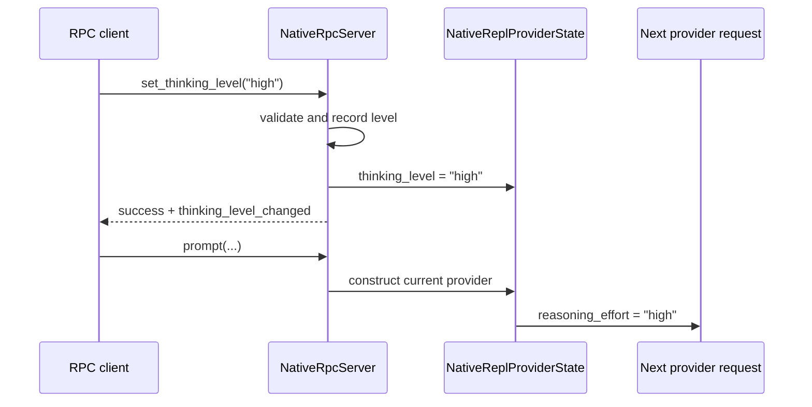

# Parity Slice Report: parity-20260713T134559Z

<!-- parity-run-label: parity-20260713T134559Z -->

<!-- BEGIN GENERATED:facts -->
## Generated Facts

| Field | Value |
| --- | --- |
| Run label | `parity-20260713T134559Z` |
| Agent | `pipy` |
| Recorded start | `1e0f436caf1d` |
| Main range start | `1e0f436caf1d` |
| Recorded end | `87f8a61f72b5` |
| Gaps done | 1 |
| Stop reason | `cap_reached` |
| Exit code | 0 |
| Range note | `main_range_start..recorded_end`; this is factual, not curated semantic membership. |

### Recorded Range Commits

| Commit | Subject |
| --- | --- |
| `87f8a61` | feat(rpc): propagate thinking level to provider state |

### Change Shape

| Area | Files | Added | Deleted |
| --- | --- | --- | --- |
| docs | 4 | 54 | 20 |
| src | 1 | 44 | 26 |
| tests | 1 | 75 | 3 |

### Changed Files

| File | Added | Deleted |
| --- | --- | --- |
| docs/automation-rpc.md | 14 | 16 |
| docs/backlog.md | 3 | 2 |
| docs/pi-mono-gap-audit.md | 5 | 2 |
| docs/rpc-thinking-level-plan.md | 32 | 0 |
| src/pipy_harness/native/automation/rpc.py | 44 | 26 |
| tests/test_native_automation_rpc.py | 75 | 3 |

### Lesson Safety Net

No safety-net improvement commits were recorded.

### Recorded Caveats

None recorded in `run.jsonl`.

<!-- END GENERATED:facts -->

## What Changed

RPC thinking controls now affect the next provider request in real catalog-backed automation sessions. When a headless client sends `set_thinking_level` or `cycle_thinking_level`, pipy still returns the same Pi-shaped responses, updates `get_state.thinkingLevel`, and emits `thinking_level_changed`; additionally, the selected level is written into the shared native provider state before the next provider is constructed. That means subsequent prompts can be sent with the requested reasoning effort instead of merely showing the level in transport metadata.

The deterministic injected-provider test path remains metadata-only because it has no provider-state construction boundary to mutate.

## Visualization

## Boundaries

This slice only threads thinking-level changes through catalog-backed RPC provider construction. It does not implement live provider/model switching over RPC: `set_model` still only accepts the already configured provider/model, `cycle_model` still has nothing to cycle, and broader provider registry behavior remains deferred. It also does not add in-turn steering semantics or change response/event shapes for thinking commands.

## Comprehension Check

What user-visible behavior changed for RPC clients?

A client that changes the thinking level over `--mode rpc` now influences the reasoning effort used by subsequent catalog-backed provider requests, rather than only seeing the value reflected in `get_state` and events.

Why do injected-provider adapters keep metadata-only behavior?

They do not expose the shared `NativeReplProviderState` construction boundary, so there is no live provider state for the RPC server to update before constructing the next request.

