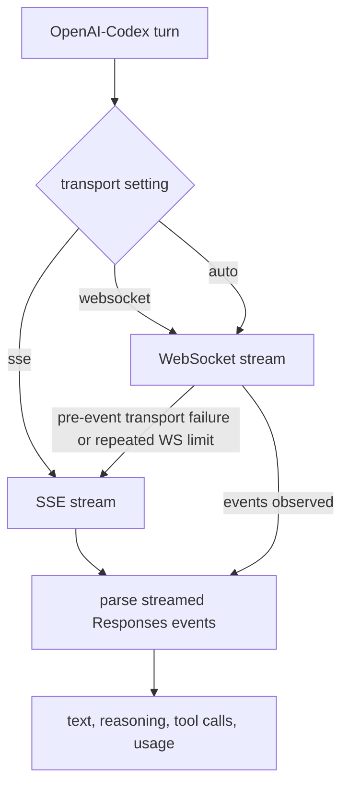

# Parity Slice Report: parity-20260713T192057Z

<!-- parity-run-label: parity-20260713T192057Z -->

<!-- BEGIN GENERATED:facts -->
## Generated Facts

| Field | Value |
| --- | --- |
| Run label | `parity-20260713T192057Z` |
| Agent | `pipy` |
| Recorded start | `d718fa96b245` |
| Main range start | `d718fa96b245` |
| Recorded end | `3797154e1a0e` |
| Gaps done | 1 |
| Stop reason | `cap_reached` |
| Exit code | 0 |
| Range note | `main_range_start..recorded_end`; this is factual, not curated semantic membership. |

### Recorded Range Commits

| Commit | Subject |
| --- | --- |
| `3797154` | fix(provider): enable Codex WebSocket transport |

### Change Shape

| Area | Files | Added | Deleted |
| --- | --- | --- | --- |
| docs | 6 | 32 | 32 |
| docs/superpowers | 2 | 16 | 1 |
| pyproject.toml | 1 | 4 | 2 |
| src | 1 | 272 | 17 |
| tests | 2 | 416 | 0 |
| uv.lock | 1 | 103 | 0 |

### Changed Files

| File | Added | Deleted |
| --- | --- | --- |
| docs/backlog.md | 9 | 11 |
| docs/harness-spec.md | 3 | 2 |
| docs/pi-mono-gap-audit.md | 5 | 5 |
| docs/pi-parity.md | 1 | 1 |
| docs/settings-config.md | 11 | 10 |
| docs/settings.md | 3 | 3 |
| docs/superpowers/plans/2026-07-13-openai-codex-transport-reliability.md | 1 | 1 |
| docs/superpowers/specs/2026-07-13-openai-codex-websocket-slice-plan.md | 15 | 0 |
| pyproject.toml | 4 | 2 |
| src/pipy_harness/native/openai_codex_provider.py | 272 | 17 |
| tests/test_harness_native_cli.py | 10 | 0 |
| tests/test_native_openai_codex_provider.py | 406 | 0 |
| uv.lock | 103 | 0 |

### Lesson Safety Net

No safety-net improvement commits were recorded.

### Recorded Caveats

None recorded in `run.jsonl`.

<!-- END GENERATED:facts -->

## What Changed

OpenAI-Codex native turns can now use the Pi-style WebSocket Responses transport instead of being SSE-only. The runtime factory selects `transport: auto` for OpenAI-Codex, so normal users get WebSocket first with a safe SSE fallback before any response progress is observed. Explicit settings remain available for `sse` or `websocket`.

The WebSocket path sends the same streamed Responses request shape as SSE, preserves live text/reasoning/tool-call assembly, applies the configured idle and connect timeouts, handles cancellation by closing the live socket, and reports transport-specific retry metadata. If the service reports `websocket_connection_limit_reached`, pipy retries one fresh WebSocket connection before falling back to SSE in auto mode.

## Visualization

## Boundaries

This slice only shipped the OpenAI-Codex provider transport behavior. It did not add multi-transport support for other providers, change OAuth/login flows, alter model selection, or introduce new TUI controls beyond honoring the existing `transport`, `httpIdleTimeoutMs`, and `websocketConnectTimeoutMs` settings. In-turn steering/follow-up queue settings and unrelated display/workflow settings remain deferred.

## Comprehension Check

What does `transport: auto` do for OpenAI-Codex now?

It starts with WebSocket and falls back to SSE only when the WebSocket attempt fails before any response progress, including the handled connection-limit case.

Why does fallback stop once response events have been observed?

After progress, retrying on another transport could duplicate or lose part of a streamed provider turn, so pipy reports the stream failure instead of silently switching transports.

