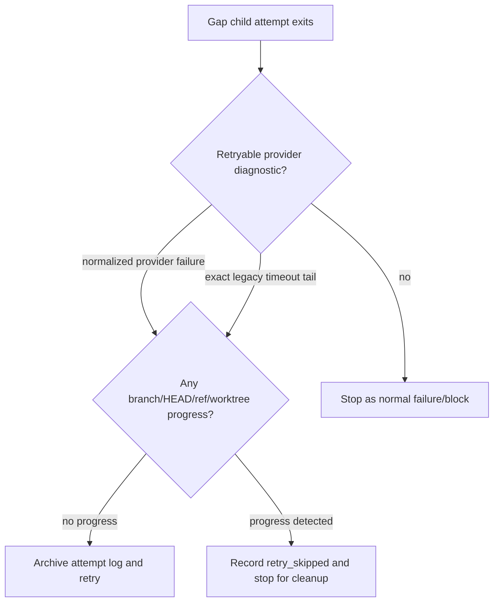

# Parity Slice Report: parity-20260713T212505Z

<!-- parity-run-label: parity-20260713T212505Z -->

<!-- BEGIN GENERATED:facts -->
## Generated Facts

| Field | Value |
| --- | --- |
| Run label | `parity-20260713T212505Z` |
| Agent | `pipy` |
| Recorded start | `086a38f84ae6` |
| Main range start | `086a38f84ae6` |
| Recorded end | `37f54372f16b` |
| Gaps done | 1 |
| Stop reason | `cap_reached` |
| Exit code | 0 |
| Range note | `main_range_start..recorded_end`; this is factual, not curated semantic membership. |

### Recorded Range Commits

| Commit | Subject |
| --- | --- |
| `37f5437` | fix(parity): retry stalled provider attempts safely |

### Change Shape

| Area | Files | Added | Deleted |
| --- | --- | --- | --- |
| CHANGELOG.md | 1 | 4 | 0 |
| docs | 2 | 13 | 9 |
| docs/parity-loop | 1 | 12 | 5 |
| docs/superpowers | 2 | 27 | 1 |
| scripts | 1 | 48 | 11 |
| tests | 1 | 210 | 52 |

### Changed Files

| File | Added | Deleted |
| --- | --- | --- |
| CHANGELOG.md | 4 | 0 |
| docs/backlog.md | 7 | 5 |
| docs/parity-loop/parity-runner.md | 12 | 5 |
| docs/pi-mono-gap-audit.md | 6 | 4 |
| docs/superpowers/plans/2026-07-13-openai-codex-transport-reliability.md | 1 | 1 |
| docs/superpowers/specs/2026-07-13-openai-codex-parity-runner-defense-plan.md | 26 | 0 |
| scripts/parity_runner.py | 48 | 11 |
| tests/test_parity_runner.py | 210 | 52 |

### Lesson Safety Net

No safety-net improvement commits were recorded.

### Recorded Caveats

None recorded in `run.jsonl`.

<!-- END GENERATED:facts -->

## What Changed

This slice made unattended parity runs more resilient to a specific historical OpenAI-Codex/pipy failure mode: a child agent that stalls out with the raw tail line `pipy: The read operation timed out`. The provider layer is still expected to normalize transport failures first, but the runner now has a narrow defense-in-depth fallback for older/raw child logs.

When a gap attempt ends in either the normalized provider-failure diagnostic or that exact legacy timeout tail, the runner may retry the same gap once. It only does so when the failed child left no evidence of progress: still on `main`, same `HEAD`, same refs, and a clean worktree. If anything changed, the runner stops for human cleanup instead of replaying over partial work.

The runner also records summary-safe attempt lifecycle events for every spawned gap child. `gap.attempt_started` and `gap.attempt_finished` now make retry behavior auditable without copying child transcript bodies into `run.jsonl`; finished events include the exit code, whether the runner timeout path killed the child, and the bounded outcome/reason classification.

## Visualization

## Boundaries

- This did not change OpenAI-Codex request construction, SSE/WebSocket behavior, or the provider's primary timeout normalization path.
- The legacy matcher is intentionally exact and tail-only; broader timeout wording, OSError text, payload-like lines, near matches, or old recovered log lines are not treated as retryable provider failures.
- Retries remain guarded by the existing no-progress checks and configured retry cap; the runner still refuses to auto-retry after partial edits, commits, ref changes, or branch movement.
- The transport-reliability closeout work remains deferred to the follow-on integration/docs closure noted in the backlog.

## Comprehension Check

When will the runner retry a child that printed <code>pipy: The read operation timed out</code>?

Only when that exact stripped line appears in the child log tail, the retry budget remains, enough time remains, and the child made no branch, HEAD, ref, or worktree progress.

Why does the runner record attempt lifecycle events instead of copying the child log into <code>run.jsonl</code>?

The events make retries and exits auditable with summary-safe metadata while keeping stdout/stderr transcript bodies confined to per-attempt log files.

