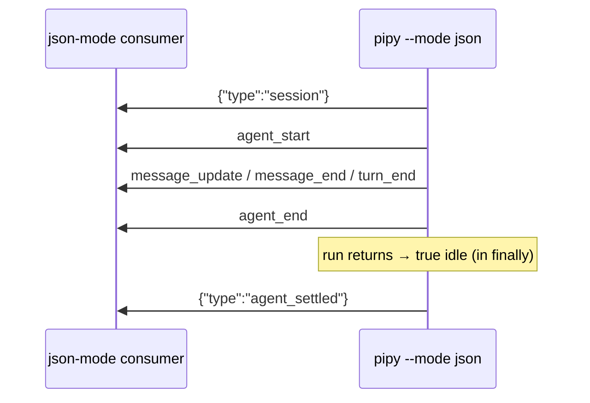

# Parity Slice Report: parity-20260714T164849Z

<!-- parity-run-label: parity-20260714T164849Z -->

<!-- BEGIN GENERATED:facts -->
## Generated Facts

| Field | Value |
| --- | --- |
| Run label | `parity-20260714T164849Z` |
| Agent | `claude` |
| Recorded start | `4bb4792cdb24` |
| Main range start | `4bb4792cdb24` |
| Recorded end | `64a82016ff54` |
| Gaps done | 1 |
| Stop reason | `cap_reached` |
| Exit code | 0 |
| Range note | `main_range_start..recorded_end`; this is factual, not curated semantic membership. |

### Recorded Range Commits

| Commit | Subject |
| --- | --- |
| `2a75c91` | feat(json): emit agent_settled at true idle in --mode json |
| `64a8201` | chore(lessons): capture json-mode agent_settled parity-loop lessons |

### Change Shape

| Area | Files | Added | Deleted |
| --- | --- | --- | --- |
| CHANGELOG.md | 1 | 6 | 2 |
| docs | 6 | 51 | 30 |
| docs/parity-loop | 1 | 2 | 0 |
| docs/superpowers | 1 | 142 | 0 |
| scripts | 1 | 8 | 4 |
| src | 1 | 14 | 1 |
| tests | 2 | 43 | 1 |

### Changed Files

| File | Added | Deleted |
| --- | --- | --- |
| CHANGELOG.md | 6 | 2 |
| docs/automation-rpc.md | 23 | 7 |
| docs/backlog.md | 8 | 7 |
| docs/parity-criterion.md | 1 | 1 |
| docs/parity-loop/lessons/lessons.jsonl | 2 | 0 |
| docs/parity-plan.md | 5 | 5 |
| docs/pi-mono-gap-audit.md | 9 | 6 |
| docs/pi-parity.md | 5 | 4 |
| docs/superpowers/specs/2026-07-14-json-mode-agent-settled-plan.md | 142 | 0 |
| scripts/parity_checks/automation_rpc_conformance.py | 8 | 4 |
| src/pipy_harness/native/automation/run_modes.py | 14 | 1 |
| tests/test_native_automation_cli.py | 5 | 1 |
| tests/test_native_automation_json_mode.py | 38 | 0 |

### Lesson Safety Net

| Phase | Log | Start | End | Exit | Open Before | Open After | Commits |
| --- | --- | --- | --- | --- | --- | --- | --- |
| postloop | improve-postloop.log | `64a82016ff54` | `b9853e2202af` | 0 | 2 | 0 | `a5927b0` docs(parity): materialize json-mode agent_settled parity lessons `b9853e2` chore(lessons): mark 2026-07-14-63d0e2, 2026-07-14-d3c86d applied |

### Recorded Caveats

None recorded in `run.jsonl`.

<!-- END GENERATED:facts -->

## What Changed

`pipy --mode json` now emits a single payload-free `{"type":"agent_settled"}`
as the final line of its JSONL stream, immediately after the run's `agent_end`.
This closes a parity gap with Pi: Pi's `--mode json` forwards every session
event, so its stream ends with the `agent_settled` that
`AgentSession._runAgentPrompt` emits from a `finally` once the run settles into
idle. Anyone driving pipy in json mode as a subprocess now gets the same
end-of-stream idle marker Pi produces, so an existing consumer can key off the
settle line instead of guessing that `agent_end` was the last event.

Because pipy's json driver is one-shot with no steering or queue, the entire
run — including internal retries and compaction — drains to idle exactly when
the run returns. The settle line is written from a `finally`, mirroring Pi, so
it still fires if the run raised. The RPC mode synthesizes its own queue-aware
settle event separately (shipped in the preceding `feat(rpc)` commit), so the
shared `AutomationEmitter` never emits one and neither stream double-emits.

This flips the previously-red `automation_pi_comparison` event-order check
green and extends the json-mode conformance check to assert the trailing settle.

## Visualization

## Boundaries

- Only `--mode json` gained the settle line in this slice. RPC mode already
  emitted its own queue-aware `agent_settled` (preceding commit); this change
  does not touch RPC.
- The `agent_settled` line is payload-free by design — it carries no result,
  timing, or status fields, matching Pi's event shape.
- The extension-surface `agent_settled` hook remains an explicit follow-on and
  is not part of this slice.

## Comprehension Check

Why is the settle line written from a <code>finally</code> rather than after a successful run?

So it fires even when the run raises, mirroring Pi's `_runAgentPrompt` `finally`.
The idle marker should terminate the stream regardless of how the run ended.

Why doesn't the shared <code>AutomationEmitter</code> emit the settle event for both modes?

The idle semantics differ per mode: the json driver is one-shot and settles when
the run returns, while RPC must stay queue-aware and avoid a premature settle
between queued steer/follow-up runs. Each mode synthesizes its own settle line so
neither stream double-emits.

