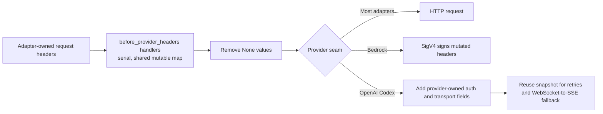

# Parity Slice Report: parity-20260716T155135Z

<!-- parity-run-label: parity-20260716T155135Z -->

<!-- BEGIN GENERATED:facts -->
## Generated Facts

| Field | Value |
| --- | --- |
| Run label | `parity-20260716T155135Z` |
| Agent | `codex` |
| Recorded start | `0a0d27e525ce` |
| Main range start | `0a0d27e525ce` |
| Recorded end | `73eab40ae6a4` |
| Gaps done | 1 |
| Stop reason | `cap_reached` |
| Exit code | 0 |
| Range note | `main_range_start..recorded_end`; this is factual, not curated semantic membership. |

### Recorded Range Commits

| Commit | Subject |
| --- | --- |
| `7bff383` | feat(extensions): add provider header hooks |
| `73eab40` | chore(lessons): capture provider header ownership |

### Change Shape

| Area | Files | Added | Deleted |
| --- | --- | --- | --- |
| CHANGELOG.md | 1 | 7 | 0 |
| docs | 5 | 76 | 26 |
| docs/examples | 1 | 10 | 0 |
| docs/parity-loop | 1 | 1 | 0 |
| docs/plans | 1 | 60 | 0 |
| docs/specs | 1 | 134 | 0 |
| scripts | 1 | 17 | 0 |
| src | 16 | 172 | 21 |
| tests | 7 | 346 | 6 |

### Changed Files

| File | Added | Deleted |
| --- | --- | --- |
| CHANGELOG.md | 7 | 0 |
| docs/backlog.md | 17 | 7 |
| docs/examples/extensions/pipy-extension-conformance.py | 10 | 0 |
| docs/extension-api.md | 36 | 5 |
| docs/parity-loop/lessons/lessons.jsonl | 1 | 0 |
| docs/parity-plan.md | 5 | 3 |
| docs/pi-mono-gap-audit.md | 14 | 6 |
| docs/pi-parity.md | 4 | 5 |
| docs/plans/2026-07-16-before-provider-headers-implementation-plan.md | 60 | 0 |
| docs/specs/2026-07-16-before-provider-headers-design.md | 134 | 0 |
| scripts/parity_checks/extension_conformance_gate.py | 17 | 0 |
| src/pipy_harness/extensions.py | 6 | 0 |
| src/pipy_harness/native/anthropic_provider.py | 2 | 1 |
| src/pipy_harness/native/azure_openai_provider.py | 2 | 1 |
| src/pipy_harness/native/bedrock_provider.py | 8 | 1 |
| src/pipy_harness/native/cloudflare_provider.py | 2 | 1 |
| src/pipy_harness/native/extension_runtime.py | 50 | 0 |
| src/pipy_harness/native/google_provider.py | 2 | 1 |
| src/pipy_harness/native/google_vertex_provider.py | 2 | 1 |
| src/pipy_harness/native/mistral_provider.py | 2 | 1 |
| src/pipy_harness/native/models.py | 11 | 1 |
| src/pipy_harness/native/openai_codex_provider.py | 15 | 9 |
| src/pipy_harness/native/openai_completions_provider.py | 2 | 1 |
| src/pipy_harness/native/openai_provider.py | 2 | 1 |
| src/pipy_harness/native/openrouter_provider.py | 2 | 1 |
| src/pipy_harness/native/provider.py | 23 | 1 |
| src/pipy_harness/native/tool_loop_session.py | 41 | 0 |
| tests/test_native_bedrock_provider.py | 42 | 0 |
| tests/test_native_ds4_provider.py | 18 | 1 |
| tests/test_native_extension_live_session_hooks.py | 155 | 0 |
| tests/test_native_extension_providers.py | 25 | 2 |
| tests/test_native_openai_codex_provider.py | 15 | 1 |
| tests/test_native_openai_completions_provider.py | 52 | 0 |
| tests/test_openai_codex_retry.py | 39 | 2 |

### Lesson Safety Net

| Phase | Log | Start | End | Exit | Open Before | Open After | Commits |
| --- | --- | --- | --- | --- | --- | --- | --- |
| postloop | improve-postloop.log | `73eab40ae6a4` | `08195290eef0` | 0 | 1 | 0 | `4352dd9` docs(parity): pin provider hook ownership `0819529` chore(lessons): mark 2026-07-16-c0c740 applied |

### Recorded Caveats

| Phase | Log | Caveat |
| --- | --- | --- |
| postloop | improve-postloop.log | Caveat: `main` is 4 commits ahead of `origin/main`; 2 commits predated this run and 2 were created here. |

<!-- END GENERATED:facts -->

## What Changed

Python extensions can now register a Pi-shaped `before_provider_headers` hook to customize the live HTTP headers for a provider request. Each handler sees a shared mutable map after the adapter has assembled the headers owned by that seam. Handlers run in extension load order, may add or override a string value, and may set a value to `None` to remove that header before transport. Synchronous and asynchronous handlers are supported; return values are ignored, and a failing handler does not prevent later handlers or the request itself from continuing.

The hook is wired through every built-in provider that makes a real HTTP request. It fires once per logical provider request: delegated providers such as ds4 do not double-fire, and OpenAI Codex retries or WebSocket-to-SSE fallback reuse the same transformed header snapshot. Bedrock applies mutations before SigV4 signing, so eligible added headers are signed and deleted headers are omitted from the signature. Live header contents remain request-only and do not appear in session archives or JSON/RPC output.

## Visualization

## Boundaries

- The deterministic fake provider has no HTTP request, so it does not emit this event.
- Extension-provided HTTP adapters receive the request-local callback but must call the public `apply_provider_headers(...)` helper at their own final mutable-header seam.
- The hook cannot replace provider-owned signing or transport behavior. In particular, Codex derives authorization, account, and protocol headers after the hook, while Bedrock retains ownership of signer-controlled `authorization`, `host`, and `x-amz-*` fields.
- This slice did not add the extension-surface `agent_settled` hook, durable entry renderers, cache-friendly dynamic tool loading, richer extension UI, or RPC extension UI; those remain separate parity gaps.

## Comprehension Check

If a Codex request falls back from WebSocket to SSE, how many times do the header handlers run?

Once. Codex creates one transformed request-header snapshot and reuses it across retries and transport fallback; provider-owned transport fields are derived separately.

Can an extension delete a Bedrock base header and add a header that participates in signing?

Yes. The hook runs before SigV4 signing, `None` removes an eligible base header, and an eligible added header is included in the signature. Signer-owned fields remain controlled by Bedrock.

