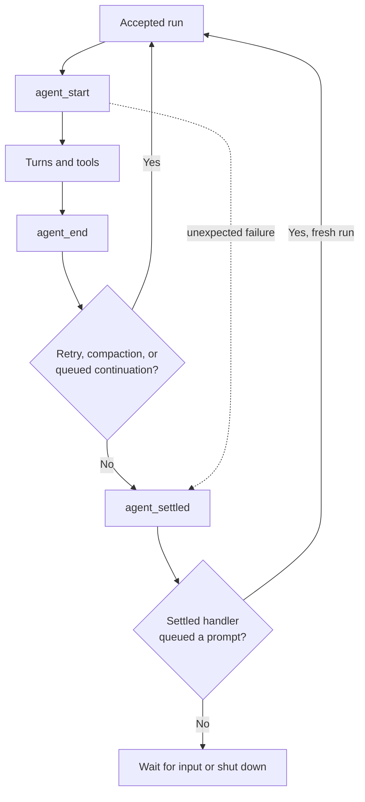

# Parity Slice Report: parity-20260716T173901Z

<!-- parity-run-label: parity-20260716T173901Z -->

<!-- BEGIN GENERATED:facts -->
## Generated Facts

| Field | Value |
| --- | --- |
| Run label | `parity-20260716T173901Z` |
| Agent | `codex` |
| Recorded start | `ef8d0d1c067a` |
| Main range start | `ef8d0d1c067a` |
| Recorded end | `5dec9eb93008` |
| Gaps done | 1 |
| Stop reason | `cap_reached` |
| Exit code | 0 |
| Range note | `main_range_start..recorded_end`; this is factual, not curated semantic membership. |

### Recorded Range Commits

| Commit | Subject |
| --- | --- |
| `23e3a78` | feat(extensions): add agent settled lifecycle hook |
| `5dec9eb` | chore(lessons): capture settled lifecycle boundary |

### Change Shape

| Area | Files | Added | Deleted |
| --- | --- | --- | --- |
| CHANGELOG.md | 1 | 8 | 2 |
| docs | 7 | 65 | 53 |
| docs/examples | 1 | 6 | 1 |
| docs/parity-loop | 1 | 1 | 0 |
| docs/plans | 1 | 42 | 0 |
| docs/specs | 1 | 113 | 0 |
| scripts | 2 | 11 | 4 |
| src | 2 | 64 | 14 |
| tests | 2 | 234 | 8 |

### Changed Files

| File | Added | Deleted |
| --- | --- | --- |
| CHANGELOG.md | 8 | 2 |
| docs/automation-rpc.md | 3 | 3 |
| docs/backlog.md | 19 | 14 |
| docs/examples/extensions/pipy-extension-conformance.py | 6 | 1 |
| docs/extension-api.md | 15 | 8 |
| docs/parity-criterion.md | 2 | 2 |
| docs/parity-loop/lessons/lessons.jsonl | 1 | 0 |
| docs/parity-plan.md | 9 | 8 |
| docs/pi-mono-gap-audit.md | 11 | 12 |
| docs/pi-parity.md | 6 | 6 |
| docs/plans/2026-07-16-extension-agent-settled-implementation-plan.md | 42 | 0 |
| docs/specs/2026-07-16-extension-agent-settled-design.md | 113 | 0 |
| scripts/parity_checks/extension_conformance_gate.py | 3 | 1 |
| scripts/parity_checks/extension_lifecycle_conformance.py | 8 | 3 |
| src/pipy_harness/native/extension_runtime.py | 2 | 0 |
| src/pipy_harness/native/tool_loop_session.py | 62 | 14 |
| tests/test_native_extension_conformance.py | 2 | 0 |
| tests/test_native_extension_lifecycle.py | 232 | 8 |

### Lesson Safety Net

| Phase | Log | Start | End | Exit | Open Before | Open After | Commits |
| --- | --- | --- | --- | --- | --- | --- | --- |
| postloop | improve-postloop.log | `5dec9eb93008` | `dfeaf9b64d22` | 0 | 1 | 0 | `6c6c13e` docs(parity): pin true-idle settlement lifecycle `dfeaf9b` chore(lessons): mark 2026-07-16-a2e15b applied |

### Recorded Caveats

| Phase | Log | Caveat |
| --- | --- | --- |
| postloop | improve-postloop.log | Caveat: `main` was already two commits ahead of `origin/main`; it is now four commits ahead. No push was performed. |

<!-- END GENERATED:facts -->

## What Changed

Python extensions can now register `api.on("agent_settled", ...)` to observe
when an accepted agent run becomes truly idle. Unlike `agent_end`, settlement
waits for automatic retries, compaction work, and queued steering, follow-up,
or extension-scheduled prompts to finish. A chain of continued runs therefore
produces one settlement notification only after the final run.

The callback is payload-free, observe-only, and fail-soft: a failing handler
does not break the session or prevent later handlers from running. Settlement
also fires before shutdown when a run exits through a fatal return or an
unexpected mid-run exception; the latter does not fabricate an `agent_end`.
A settled handler may enqueue a new prompt, which starts a fresh run without
waiting for stdin and receives its own later settlement notification.

## Visualization

## Boundaries

- This is the Python extension lifecycle hook only. It does not add another
  automation event; JSON and RPC retain their single, mode-owned
  `agent_settled` protocol event without duplication.
- A session that never starts an agent run emits no extension
  `agent_settled` callback.
- The slice does not add durable TUI entry renderers, cache-friendly dynamic
  tool loading, provider-native message anchoring, or package/update CLI work.

## Comprehension Check

Why can <code>agent_settled</code> occur later than <code>agent_end</code>?

Because settlement waits until all automatic retry/compaction work and queued
continuations have drained, while `agent_end` marks the end of one agent run.

What happens if a settled handler schedules another prompt?

The prompt starts a fresh agent run immediately, without first blocking on
stdin. That new run has its own later `agent_settled` notification.

