# Parity Slice Report: parity-20260717T124642Z

<!-- parity-run-label: parity-20260717T124642Z -->

<!-- BEGIN GENERATED:facts -->
## Generated Facts

| Field | Value |
| --- | --- |
| Run label | `parity-20260717T124642Z` |
| Agent | `codex` |
| Recorded start | `f0eb439ff9e7` |
| Main range start | `f0eb439ff9e7` |
| Recorded end | `28318c2dd052` |
| Gaps done | 1 |
| Stop reason | `cap_reached` |
| Exit code | 0 |
| Range note | `main_range_start..recorded_end`; this is factual, not curated semantic membership. |

### Recorded Range Commits

| Commit | Subject |
| --- | --- |
| `713414b` | feat(providers): add Responses dynamic tool search |
| `28318c2` | chore(lessons): capture deferred loading invariant |

### Change Shape

| Area | Files | Added | Deleted |
| --- | --- | --- | --- |
| CHANGELOG.md | 1 | 5 | 3 |
| docs | 10 | 66 | 45 |
| docs/parity-loop | 1 | 1 | 0 |
| docs/plans | 1 | 56 | 0 |
| docs/specs | 1 | 183 | 0 |
| scripts | 1 | 13 | 2 |
| src | 7 | 231 | 59 |
| tests | 7 | 437 | 4 |

### Changed Files

| File | Added | Deleted |
| --- | --- | --- |
| CHANGELOG.md | 5 | 3 |
| docs/architecture.md | 2 | 2 |
| docs/backlog.md | 12 | 7 |
| docs/customization.md | 3 | 2 |
| docs/extension-api.md | 13 | 6 |
| docs/parity-criterion.md | 6 | 6 |
| docs/parity-loop/lessons/lessons.jsonl | 1 | 0 |
| docs/parity-plan.md | 5 | 5 |
| docs/pi-mono-gap-audit.md | 8 | 10 |
| docs/pi-parity.md | 4 | 4 |
| docs/plans/2026-07-17-openai-responses-dynamic-tool-search-implementation-plan.md | 56 | 0 |
| docs/provider-catalog.md | 6 | 3 |
| docs/providers.md | 7 | 0 |
| docs/specs/2026-07-17-openai-responses-dynamic-tool-search-design.md | 183 | 0 |
| scripts/parity_checks/provider_catalog_conformance.py | 13 | 2 |
| src/pipy_harness/native/anthropic_provider.py | 2 | 32 |
| src/pipy_harness/native/catalog_data.py | 7 | 0 |
| src/pipy_harness/native/deferred_tools.py | 120 | 0 |
| src/pipy_harness/native/openai_codex_provider.py | 31 | 4 |
| src/pipy_harness/native/openai_provider.py | 31 | 4 |
| src/pipy_harness/native/provider_construction.py | 18 | 0 |
| src/pipy_harness/native/repl_state.py | 22 | 19 |
| tests/test_native_deferred_tools.py | 121 | 0 |
| tests/test_native_openai_codex_tool_calls.py | 87 | 0 |
| tests/test_native_openai_tool_calls.py | 134 | 2 |
| tests/test_native_provider_catalog.py | 17 | 0 |
| tests/test_native_provider_construction.py | 17 | 0 |
| tests/test_native_repl_state.py | 8 | 0 |
| tests/test_openai_codex_retry.py | 53 | 2 |

### Lesson Safety Net

| Phase | Log | Start | End | Exit | Open Before | Open After | Commits |
| --- | --- | --- | --- | --- | --- | --- | --- |
| postloop | improve-postloop.log | `28318c2dd052` | `ba0f7abd4d39` | 0 | 1 | 0 | `3f98719` docs(parity): pin deferred tool materialization invariant `ba0f7ab` chore(lessons): mark 2026-07-17-2250eb applied |

### Recorded Caveats

| Phase | Log | Caveat |
| --- | --- | --- |
| postloop | improve-postloop.log | Caveat: The first review attempt waited on a live global review lock. |
| postloop | improve-postloop.log | Caveat: A subsequent attempt was discarded as INVALID after an out-of-scope context-file read; a fresh context-free retry produced the accepted CLEAN verdict. |

<!-- END GENERATED:facts -->

## What Changed

Python extensions that activate additional registered tools can now preserve the
stable tool prefix when using supported OpenAI Responses and OpenAI Codex
Responses models. On the next request, pipy keeps the newly activated definitions
out of the top-level `tools` list and inserts a completed client
`tool_search_call`/`tool_search_output` pair immediately after the tool result
where those definitions became available. The original tool output remains in
place, and deterministic load identifiers keep retries and reconstructed
providers stable.

The built-in GPT-5.4 and GPT-5.5 Responses rows opt in, as do the Codex GPT-5.4,
GPT-5.5, and GPT-5.6 Sol rows. Custom models must explicitly set
`compat.supportsToolSearch`; older or unverified models default off and continue
to receive the complete current tool list. Stale, duplicate, previously used, or
uncorrelated load markers cannot hide a definition: tools are deferred only when
the same request can materialize them at a valid result.

## Visualization

```mermaid
%%{init: {'theme': 'base', 'themeVariables': {'primaryColor': '#f3ecd4', 'secondaryColor': '#f3ecd4', 'tertiaryColor': '#f3ecd4', 'primaryTextColor': '#111111', 'secondaryTextColor': '#111111', 'tertiaryTextColor': '#111111', 'textColor': '#111111', 'lineColor': '#111111', 'primaryBorderColor': '#111111', 'edgeLabelBackground': '#f3ecd4'}, 'flowchart': {'htmlLabels': true}}}%%
flowchart LR
  A["<span style='color:#111111'>Top-level tools<br/>stable definitions only</span>"] --> B["<span style='color:#111111'>function_call_output<br/>activation result</span>"]
  B --> C["<span style='color:#111111'>completed client<br/>tool_search_call</span>"]
  C --> D["<span style='color:#111111'>completed client<br/>tool_search_output</span>"]
  D --> E["<span style='color:#111111'>new definitions available<br/>at their durable load point</span>"]
```

## Boundaries

- This slice adds deferred placement only for the OpenAI Responses and OpenAI
  Codex Responses request shapes. Kimi Chat Completions deferred tools remain a
  separate parity gap.
- It does not add tool discovery, a search algorithm, or another registration
  API. The client-side search pair carries definitions that an extension already
  registered and activated through the existing control.
- Support is model-specific and explicit. Unsupported models, missing provider
  correlation, removals, and definitions no longer present in the active set use
  the safe immediate-tool behavior instead of attempting deferred loading.
- Response parsing, transport and retry behavior, authentication, reasoning,
  attachments, usage accounting, and broader strict-mode request parity were not
  changed by this slice.
- The post-loop safety-net commits only codified the materialization invariant
  for future parity work and closed its captured lesson; they shipped no
  additional runtime behavior.

## Comprehension Check

Where does a newly activated tool definition appear for a supported Responses model?

It is omitted from the stable top-level `tools` prefix and emitted in a completed
client `tool_search_output` immediately after the activating tool's ordinary
`function_call_output`, paired with a completed `tool_search_call`.

What happens when the model is not opted in or a load marker lacks provider correlation?

Pipy keeps the definition in the immediate top-level tool list and emits no
deferred search pair, so the tool cannot disappear from the request.

