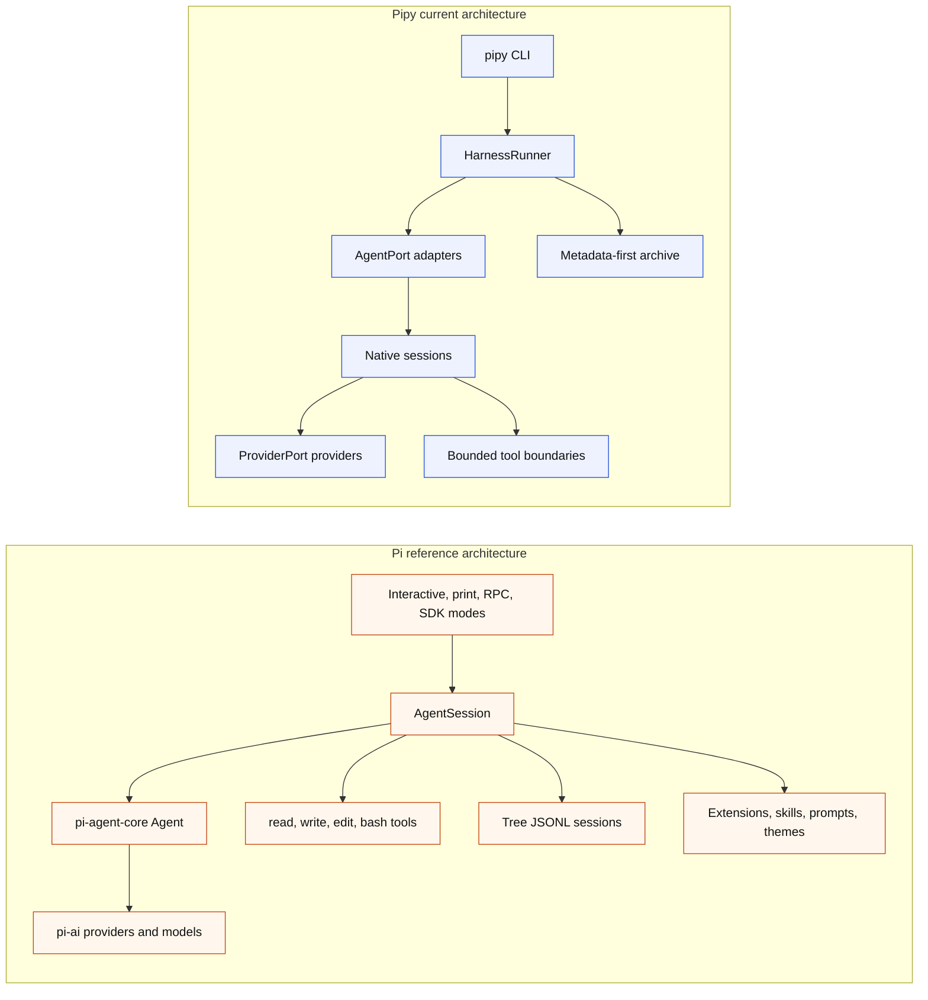

# Pi Parity And Differences

Status: current slopfork map for the Python `pipy` runtime compared with the
local Pi reference in `/Users/jochen/src/pi-mono`.

Pipy is a Python slopfork inspired by Pi. The goal is Pi-class local
coding-agent usefulness — including the terminal UI — through pipy-owned
Python boundaries. It is not a literal port of Pi's TypeScript packages,
storage model, extension system, or command names: pipy slopforks the same
end-user capability into Python, not the TypeScript code itself.

## What Has Been Slopforked

Status labels are intentionally coarse:

- Implemented: the named capability exists for pipy's current architecture.
- Partial: pipy has a bounded subset of the Pi behavior.
- Narrow first slice: pipy has the first reviewed boundary, not the general Pi
  capability.
- Different foundation: pipy solves the same product need through a deliberately
  different storage or architecture model.
- Support path: implemented for capture/reference work, not the product
  runtime.

| Pi idea | Pipy state | Notes |
| --- | --- | --- |
| Local-first terminal coding agent | Partial | `pipy` and `pipy repl` start a native shell in the current workspace. It is still line-oriented, not a full TUI. |
| Direct provider access | Implemented (11 providers) | `ProviderPort` now supports fake, OpenAI Responses, OpenAI Chat Completions, OpenAI Codex subscription, OpenRouter, Anthropic, Google (Gemini Generative AI), Google Vertex, Mistral, Amazon Bedrock, Azure OpenAI Responses, and Cloudflare Workers AI. All are stdlib-only (urllib + JSON + hashlib/hmac for SigV4); the no-new-runtime-deps invariant is preserved. See `docs/parity-criterion.md` for the locked feature list. |
| Arbitrary shell execution | Deferred | The `BashTool` helper was removed in the 2026-05-26 code-quality audit cleanup (it was never registered for model-loop use). A real shell sandbox is required before this can land in the production registry. See backlog Track CQ-A. |
| Retry/backoff for transient HTTP errors | Implemented as reusable `RetryPolicy` | `pipy_harness.native.retry.retry_with_backoff` wraps any provider call with exponential backoff + jitter for 429 and 5xx responses. Injectable sleep + jitter for hermetic tests. |
| Unified-diff edit tool | Implemented as `edit-diff` | `pipy_harness.native.tools.edit_diff.EditDiffTool` parses and applies a unified-diff patch in pure stdlib (no shell-out to `patch(1)`), atomic temp-file rename, and reuses the same `.git`/symlink/pre-read byte-cap defenses as `EditTool`. |
| Output-shrinking helper | Implemented as `truncate` tool | `pipy_harness.native.tools.truncate.TruncateTool` is a pure-transformation tool the model can use to fold an oversized previous tool result into a head+tail+deterministic-marker form. No I/O. |
| Session export | Implemented | `pipy-session export <stem>` writes a metadata-only JSON portable summary to stdout. `--include-transcript` opts in to the sensitive sidecar at `~/.local/state/pipy/transcripts/<id>.jsonl`. Default export retains the metadata-first archive contract via an event-key allowlist. |
| Session resume | Metadata reader implemented | `pipy_harness.native.session_resume` resolves finalized records and returns a metadata-only `ResumeContext`; `pipy-session resume-info <stem>` exposes that context as JSON. Runtime prompt seeding for a resumed live session remains a follow-up. |
| Dynamic provider/model swap | Deferred | The `dynamic_provider` helper was removed in the 2026-05-26 code-quality audit cleanup; future `/provider` and `/model` wiring can call `NativeReplProviderState.select_model` directly. See backlog Track CQ-A. |
| OpenAI Codex subscription auth | Implemented as separate provider | Pipy uses its own OAuth state under `${PIPY_AUTH_DIR:-~/.local/state/pipy/auth}/openai-codex.json`, modeled on Pi's Codex OAuth shape, and does not read Pi credentials. |
| `/login`, `/logout`, `/model`, `/settings` | Implemented narrow shell commands | Commands are local, late-bind provider selection or inspect safe local state, and do not create provider turns or archive auth material. `/settings` prints provider/model labels and availability reasons only. |
| Startup orientation | Implemented Pi-parity pass | The shell prints Pi-shape compact startup chrome on stderr: title in sage truecolor with a single-space indent (with 16-color fallback), one-line dim controls strip, `Type / to open the command menu` affordance, and a loaded-only `[Context]` section in yellow listing `AGENTS.md` files discovered in the workspace, its ancestors, and the global pipy config root. A `[Skills]` directory-listing section is also rendered when `.pipy/skills/<name>` subdirectories exist (rendering only — no runtime loader). Chrome rendering is shared between the no-tool and bounded tool-loop sessions through `pipy_harness.native.chrome`. |
| Active prompt state | Implemented | The prompt is a simple `> ` leader framed by horizontal purple separator lines, with a persistent two-row bottom status block rendered below the input area: row one is the workspace cwd, row two is the Pi-shape status line `$cost (plan) used%/budget (suffix) … (provider) model • effort` (with `↑in ↓out` token arrows prepended after a turn). `plan` is `sub` for openai-codex OAuth and `api` for keyed providers; `effort` is the configured reasoning effort label (`default` until per-model effort selection is wired). `proposal ready` / `verify ready` user-state signals are appended after the effort label so they stay visible without breaking the Pi-shape layout. The default `pipy` invocation auto-picks an available real provider, so the bottom status surfaces `(provider) model • effort` rather than `fake/fake-native-bootstrap` whenever credentials are configured. The slash-menu input adapter additionally draws this same bottom block below the live input area so the user sees the status line directly below the prompt while typing. |
| Terminal input runtime | Pi-parity `/` menu + Tab discovery | The default `auto` runtime selects a stdlib-only `slash-menu` raw-mode line editor on real TTY streams: typing `/` opens a Pi-like popup command menu beneath the input with names, dim descriptions, reverse-video selection highlight, Up/Down navigation, Enter to submit the selected command, Tab to accept without submitting, and Esc to close. The next fall-throughs are optional prompt-toolkit input with slash-command completion (descriptions through `display_meta`), explicit file/path completion, completion-only `@file` reference labels, and multiline entry; then the stdlib `readline` adapter for Tab discovery without a runtime dependency; then plain stdin/stderr for captured streams. Richer editor behavior (history, resize-resilient TUI, mouse selection) remains deferred. |
| No approval popups for normal interactive read/context commands | Implemented | Explicit user-entered `/read`, `/ask-file`, and `/propose-file` commands use non-interactive safety checks rather than visible approval prompts. |
| Read tool | Implemented in two flavors | `/read <path>` keeps the explicit, bounded, UTF-8 workspace-relative excerpt within the shared two-successful-excerpt REPL budget. The model-driven `read` tool ships through the [Tool-Loop Parity Track](backlog.md#tool-loop-parity-track), stat-gates oversized files before loading content, and is invoked from `--repl-mode tool-loop`. |
| Provider-visible file context | Partial | `/ask-file <path> -- <question>` forwards one bounded excerpt only in memory to one provider turn and consumes one successful excerpt from the shared REPL budget. |
| Proposal flow | Partial | `/propose-file <path> -- <change-request>` forwards one bounded excerpt, consumes one successful excerpt from the shared REPL budget, and can retain a same-session proposal draft. |
| Write/edit capability | Implemented in bounded tool loop | `/apply-proposal <path>` applies one same-session, human-reviewed, one-file proposal through `NativePatchApplyTool`. The model-driven tool loop now also exposes bounded `write`, `edit`, and `edit_diff` tools. |
| Verification after changes | Narrow first slice | `/verify just-check` runs only the allowlisted internal `just check` command after a successful same-session apply. |
| Session records | Different foundation implemented | Pipy writes metadata-first JSONL plus optional Markdown under `~/.local/state/pipy/sessions`; Pi stores full tree sessions under its own agent state. |
| Search/inspect | Implemented for pipy records | `pipy-session list/search/inspect/verify` operates over finalized metadata records, not full transcripts. The `reflect` surface was removed in the 2026-05-26 code-quality audit cleanup. See backlog Track CQ-A. |
| Print-like one-shot mode | Partial | `pipy run --agent pipy-native` runs one native turn; default stdout is successful final text only, and `--native-output json` gives metadata-only automation output. |
| Subprocess wrapping | Implemented as support path | `pipy run --agent custom|codex|claude|pi -- ...` records conservative lifecycle metadata around another command, but this is not the product runtime. |
| AGENTS.md / CLAUDE.md workspace context discovery | Implemented | `pipy_harness.native.workspace_context.discover_workspace_instructions` walks the workspace, its parents, and the global pipy config root (resolved through `PIPY_CONFIG_HOME`, then `${XDG_CONFIG_HOME}/pipy`, then `~/.config/pipy`), composes the discovered instructions into the system prompt for one-shot, no-tool REPL, and tool-loop modes, and records only safe per-file metadata (path label, sha256, byte length) into the session archive. See the [Workspace Context Loading Parity Track](backlog.md#workspace-context-loading-parity-track). |
| Workspace skills and prompt templates | Deferred | The `skills`, `prompt_templates`, and shared `_resource_files` discovery modules were removed in the 2026-05-26 code-quality audit cleanup — they had no runtime consumer. See backlog Track CQ-A. |
| Custom slash commands | Deferred | The `custom_commands` discovery module was removed in the 2026-05-26 code-quality audit cleanup — no dispatcher ever consumed it. See backlog Track CQ-A. |
| Themes | Deferred | The pure-data `themes` registry was removed in the 2026-05-26 code-quality audit cleanup — no production caller ever consumed it. See backlog Track CQ-A. |
| Streaming provider output | Implemented in REPL | The [Streaming Output Parity Track](backlog.md#streaming-output-parity-track) closed parity-criterion row C14. `ProviderPort.complete(..., stream_sink=...)` exposes an optional synchronous chunk sink; `OpenAICodexResponsesProvider` forwards each parsed `response.output_text.delta` event through it. The bounded model-driven tool loop (`pipy` / `pipy repl --repl-mode tool-loop`) now wires this sink through `_ToolLoopRenderer`, so streaming-capable providers paint assistant text incrementally with a dim `assistant >` prefix while the loop runs. `pipy run --stream` retains the stdout/stderr split for automation use. Other providers stay buffered. |
| Tool call / output rendering | Pi-shape inline blocks | `pipy_harness.native.tool_loop_session._ToolLoopRenderer` paints each model-driven tool invocation as an italic green `→ <tool>(<arg-preview>)` header followed by a dim `↳` result block on stderr (alongside the bottom-status footer). Errors get a red `↳ [error]` tag, and result bodies truncate after twelve lines with a deterministic `… (+N more line(s))` marker. ANSI styling is gated on TTY detection and `NO_COLOR`; captured streams stay readable. |
| Cross-repo read-only inspection | Reference-root tools | Model-driven `read`/`ls`/`grep`/`find` accept absolute paths under the workspace or any configured read-only reference root. Roots come from repeated `--read-root <PATH>` CLI flags, the `PIPY_READ_ROOTS=:`-separated env var, or auto-discovery of `~/<dir>` paths mentioned in `AGENTS.md`, `docs/parity-criterion.md`, and `docs/pi-parity.md` (deepest existing path wins). Mutation tools (`write`/`edit`/`edit_diff`) always stay inside the workspace. The reference-root boundary reuses the existing `.git`/`.gitignore`/symlink/binary defenses and gates content through `has_secret_shaped_content`, a stricter shape-based secret detector that lets prose discussing auth pass while blocking `api_key=<value>`, AWS key IDs, JWTs, and PEM private-key blocks. |
| Image/binary attachment loading | Deferred | The `image_attachment` helper and `ProviderRequest.image_attachments` field were removed in the 2026-05-26 code-quality audit cleanup — no provider adapter consumed them. See backlog Track CQ-A. |
| Session compaction | Deferred | The `session_compaction` helper was removed in the 2026-05-26 code-quality audit cleanup — it could not fire because `NativeConversationState.MAX_TURNS = 8` is below the compaction threshold. See backlog Track CQ-A. |
| Session branching/forking | Deferred | The `session_branching` helper was removed in the 2026-05-26 code-quality audit cleanup — recorder integration was never wired. See backlog Track CQ-A. |
| SDK / RPC embedding | SDK module implemented | `pipy_harness.sdk` exposes `make_native_run_request(...)`, `run_native(...)`, and the public value objects (`RunRequest`, `RunResult`, `HarnessStatus`, `CapturePolicy`, `HarnessRunner`, `ProviderPort`, `StreamChunkSink`) for in-process embedding. RPC/network transports remain explicitly deferred; the SDK module closes parity-criterion row E7. |

## Still To Slopfork

The locked 50-feature parity criterion (see `docs/parity-criterion.md`) is now
43/50 with 7 big features green after the 2026-05-26 code-quality audit
cleanup honestly reset the per-row state. Red rows are B7 (`bash`), D4
(skills loading), D5 (prompt templates), D7 (themes), E2 (session
compaction), E3 (session branching), and E5 (dynamic provider swap). Each
red row corresponds to a previously file-existence-checked surface that the
audit identified as dead code with no production consumer; the surfaces
were removed in Track CQ-A of `docs/backlog.md`. Rewriting the parity-score
checks to verify real behavior (rather than `test -f path`) is queued. The
boundaries below remain Pi-class surfaces that pipy has not yet closed,
several because the previously dormant helper was removed for being
unwired rather than because it was ever live:

- A real production-registered `bash` tool. The standalone `BashTool` helper
  was removed in the 2026-05-26 code-quality audit cleanup; registering a
  production shell requires a real process/filesystem sandbox that preserves
  secret isolation and `.git` default-deny against shell-quoting, glob, and
  command-substitution bypasses. See `docs/parity-criterion.md` for the
  documented bar and backlog Track CQ-A for the deletion rationale.
- Live runtime wiring for streaming in `--repl-mode no-tool` and
  `--repl-mode tool-loop`. The dormant `image_attachment`,
  `session_compaction`, and `session_branching` helpers were removed in the
  2026-05-26 cleanup; their parity rows are now `Deferred` rather than
  `Helper implemented`.
- Full interactive terminal UI with editor, persistent footer,
  model/status controls, overlays, selectors, and resize handling beyond the
  implemented narrow prompt-toolkit input-adapter, slash-command completion,
  explicit file/path completion, and multiline entry boundaries.
- Automatic file-content reads from `@file` references, pasted images,
  persistent history, and broader keyboard shortcut handling.
- Multiple file/context reads per session and broader context/resource
  loading.
- Richer resource loading beyond AGENTS/CLAUDE-style instruction discovery.
  The previous `skills`, `prompt_templates`, `custom_commands`, and `themes`
  discovery helpers were removed in the 2026-05-26 cleanup — they were
  never wired to a runtime consumer. Re-introduce only with the
  runtime consumer that uses them.
- Network-transported RPC (the in-process Python SDK at
  `pipy_harness.sdk` closes parity-criterion row E7; a long-running daemon,
  socket transport, or wire protocol remains explicitly deferred).
- Provider registry and broad provider/model catalog.
- Cost/context/token footer behavior beyond safe usage counters.
- Non-allowlisted verification.

## Architecture Differences From Pi

Pi's durable center is `AgentSession`: it composes agent state, model and
thinking-level management, persistence, settings, resources, extensions, bash,
compaction, branching, and mode integration. Interactive, print, RPC, and SDK
surfaces sit above that shared session abstraction.

Pipy's durable center is currently split:

- `HarnessRunner` owns run lifecycle, event recording, and finalization.
- `NativeAgentSession` and `NativeNoToolReplSession` own native provider/tool
  control flow.
- `pipy_session.recorder` owns file lifecycle.
- `pipy_session.catalog` owns read-only archive inspection.

That split is deliberate. Pipy is using clean-architecture boundaries while it
bootstraps, so effectful adapters cannot silently become the product core.

## Key Design Differences

| Topic | Pi | Pipy |
| --- | --- | --- |
| Language and package shape | TypeScript monorepo with `coding-agent`, `agent`, `ai`, `tui`, and related packages. | Python package with `pipy_harness` and `pipy_session`. |
| Main runtime center | `AgentSession` wrapped around `pi-agent-core` and `pi-ai`. | `HarnessRunner` plus native session classes behind explicit ports. |
| UI | Rich TUI with editor, footer, selectors, overlays, and extension UI. | Line-oriented REPL with compact startup chrome, grouped help, `/status`, `/settings`, a state-aware prompt label, and an optional prompt-toolkit input adapter with command/path completion, completion-only `@file` reference labels, and multiline entry; richer editor behavior remains deferred. |
| Session storage | Full tree JSONL sessions with parent links, branching, compaction, and resume workflows. | Immutable metadata-first JSONL plus Markdown summaries under `pipy/YYYY/MM`; `pipy-session resume-info` can read metadata-only continuation context, but live resume wiring is still deferred. No raw transcript import by default. |
| Tool model | Model-visible read, write, edit, and bash tools are core defaults. | Explicit, bounded, pipy-owned command/tool boundaries plus the implemented bounded model-selected loop with `read`, `write`, `edit`, `ls`, `grep`, `find`, `edit_diff`, and `truncate` behind `pipy repl --repl-mode tool-loop`; `bash` is deferred from the production registry pending a real shell sandbox. See the [Tool-Loop Parity Track](backlog.md#tool-loop-parity-track). |
| Approval posture | No permission popups for the normal product workflow. | Same direction for explicit REPL read/context commands, while non-interactive request objects still carry policy and authority data. |
| Provider access | Broad provider/model registry through Pi's AI package, including subscription and API-key paths. | Twelve native provider selections behind `ProviderPort`: fake, OpenAI Responses, OpenAI Chat Completions, OpenAI Codex OAuth, OpenRouter, Anthropic, Google Generative AI, Google Vertex, Mistral, Amazon Bedrock, Azure OpenAI, and Cloudflare Workers AI. |
| Extension system | First-class extensions, skills, prompt templates, themes, custom commands, and UI hooks. | Skills, prompt templates, custom slash commands, and themes have narrow discovery/registry helpers; runtime slash commands, extensions, and package loading remain deferred. |
| Privacy posture | Full Pi sessions are native product transcripts. | Pipy archive is metadata-first and excludes prompts, model output, provider payloads, file contents, command output, and auth material by default. |
| External agent wrapping | Pi is itself the product. | Pipy can wrap external CLIs for conservative capture, but external wrappers are not the product runtime. |
| Verification | Pi exposes broad bash/tool capability. | Pipy exposes only `/verify just-check` after successful same-session apply. |

Pi's README describes `read`, `write`, `edit`, and `bash` as the default model
tools. The Pi codebase also includes additional tool modules such as `find`,
`grep`, `ls`, `edit-diff`, and `truncate`; the table compares the default
product posture rather than every shipped helper.

## Pipy Layering Compared With Pi

Pi integrates more behavior inside its session and agent abstractions because it
already has a mature product surface. Pipy keeps sharper early boundaries:

- Domain value objects in `pipy_harness.native.models` define safe request,
  result, policy, and storage metadata.
- Provider adapters implement only `ProviderPort.complete()`.
- Tool boundaries implement explicit read, patch apply, and verification
  request shapes.
- The harness runner is the only layer that coordinates archive finalization.
- The catalog is read-only and never repairs, imports, or indexes raw records.

This means pipy currently has less product capability, but the code more
clearly separates:

- pure or mostly pure domain data,
- orchestration control flow,
- provider adapters,
- workspace effects,
- recorder/archive effects,
- and external subprocess capture.

## Compatibility Rules

Future Pi parity work should preserve these pipy-specific rules:

- `pipy-native` remains the product runtime.
- Codex, Claude, Pi, and arbitrary subprocess wrapping remain capture/reference
  paths unless the product direction explicitly changes.
- Raw prompts, model output, provider responses, stdout, stderr, command output,
  file contents, patches, diffs, secrets, credentials, tokens, private keys,
  and sensitive personal data stay out of archives by default.
- User-visible runtime behavior and docs must stay aligned in the same change.
- Broad features should land as small named boundaries, with focused tests,
  `just check`, docs updates, and review.

## Reading The Current Roadmap

Use these docs together:

- [Architecture](architecture.md) explains what exists now and where it lives.
- [Backlog](backlog.md) is the current slice index and historical ledger.
- [Harness Spec](harness-spec.md) records detailed rationale and deferred
  design.
- [Session Storage](session-storage.md) is the archive and privacy policy.
