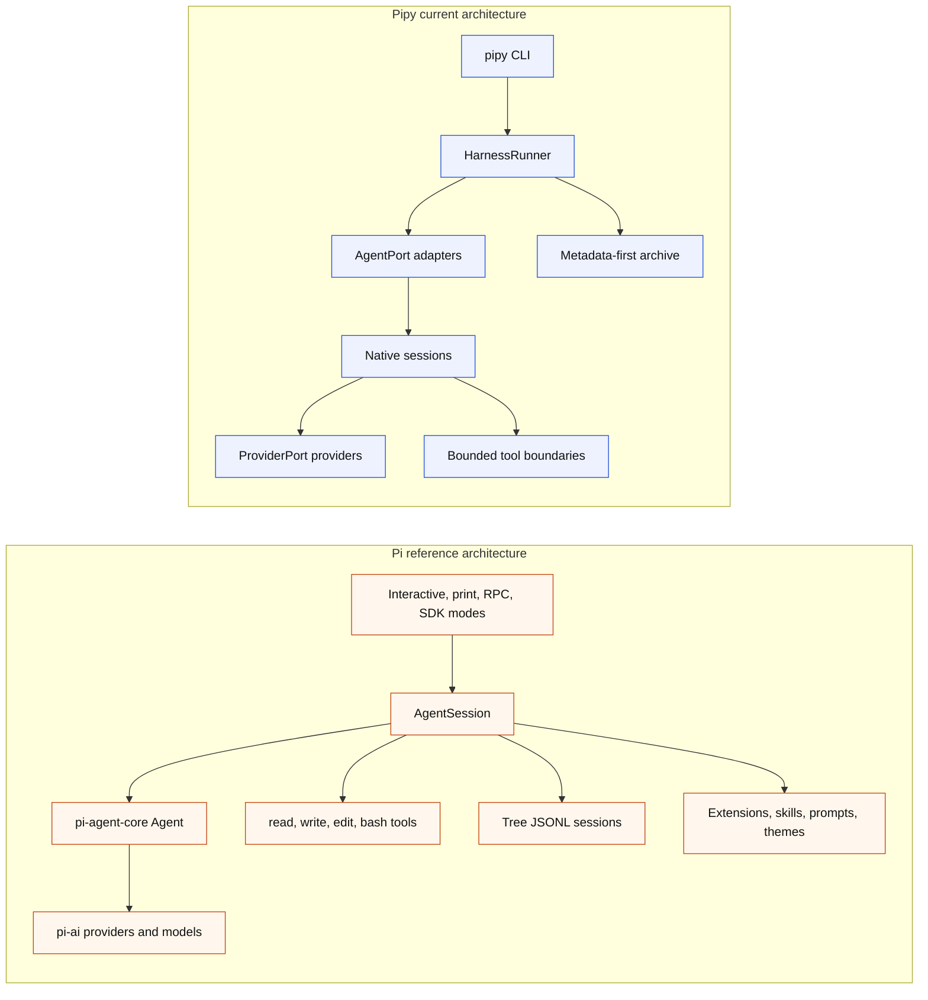

# Pi Parity And Differences

Status: current slopfork map for the Python `pipy` runtime compared with the
local Pi reference in `/Users/jochen/src/pi-mono`.

Pipy is a Python slopfork inspired by Pi. The goal is Pi-class local
coding-agent usefulness through pipy-owned Python boundaries, not a literal
port of Pi's TypeScript packages, terminal UI, storage model, extension system,
or command names.

## What Has Been Slopforked

Status labels are intentionally coarse:

- Implemented: the named capability exists for pipy's current architecture.
- Partial: pipy has a bounded subset of the Pi behavior.
- Narrow first slice: pipy has the first reviewed boundary, not the general Pi
  capability.
- Different foundation: pipy solves the same product need through a deliberately
  different storage or architecture model.
- Support path: implemented for capture/reference work, not the product
  runtime.

| Pi idea | Pipy state | Notes |
| --- | --- | --- |
| Local-first terminal coding agent | Partial | `pipy` and `pipy repl` start a native shell in the current workspace. It is still line-oriented, not a full TUI. |
| Direct provider access | Implemented (11 providers) | `ProviderPort` now supports fake, OpenAI Responses, OpenAI Chat Completions, OpenAI Codex subscription, OpenRouter, Anthropic, Google (Gemini Generative AI), Google Vertex, Mistral, Amazon Bedrock, Azure OpenAI Responses, and Cloudflare Workers AI. All are stdlib-only (urllib + JSON + hashlib/hmac for SigV4); the no-new-runtime-deps invariant is preserved. See `docs/parity-criterion.md` for the locked feature list. |
| Arbitrary shell execution | Implemented as bounded `bash` tool | `pipy_harness.native.tools.bash.BashTool` runs one shell command per invocation via `subprocess.Popen(..., shell=True)` with a workspace-relative cwd, bounded stdout/stderr collection, bounded timeout, and a `.git`/`--git-dir` substring refusal. Registered in the production tool registry. Command text and capped output stay in memory; the metadata archive is untouched. |
| Retry/backoff for transient HTTP errors | Implemented as reusable `RetryPolicy` | `pipy_harness.native.retry.retry_with_backoff` wraps any provider call with exponential backoff + jitter for 429 and 5xx responses. Injectable sleep + jitter for hermetic tests. |
| Unified-diff edit tool | Implemented as `edit-diff` | `pipy_harness.native.tools.edit_diff.EditDiffTool` parses and applies a unified-diff patch in pure stdlib (no shell-out to `patch(1)`), atomic temp-file rename, reuses the same `.git`/symlink/byte-cap defenses as `EditTool`. |
| Output-shrinking helper | Implemented as `truncate` tool | `pipy_harness.native.tools.truncate.TruncateTool` is a pure-transformation tool the model can use to fold an oversized previous tool result into a head+tail+deterministic-marker form. No I/O. |
| Session export | Implemented | `pipy-session export <stem>` writes a metadata-only JSON portable summary to stdout. `--include-transcript` opts in to the sensitive sidecar at `~/.local/state/pipy/transcripts/<id>.jsonl`. Default export retains the metadata-first archive contract via an event-key allowlist. |
| Session resume | Metadata reader implemented | `pipy_harness.native.session_resume` resolves finalized records and returns a metadata-only `ResumeContext`; `pipy-session resume-info <stem>` exposes that context as JSON. Runtime prompt seeding for a resumed live session remains a follow-up. |
| Dynamic provider/model swap | Helper implemented | `pipy_harness.native.dynamic_provider` wraps the existing `NativeReplProviderState.select_model` path so future `/provider` and `/model` wiring can reuse current availability gates and non-secret defaults. It does not call providers or run tools. |
| OpenAI Codex subscription auth | Implemented as separate provider | Pipy uses its own OAuth state under `${PIPY_AUTH_DIR:-~/.local/state/pipy/auth}/openai-codex.json`, modeled on Pi's Codex OAuth shape, and does not read Pi credentials. |
| `/login`, `/logout`, `/model`, `/settings` | Implemented narrow shell commands | Commands are local, late-bind provider selection or inspect safe local state, and do not create provider turns or archive auth material. `/settings` prints provider/model labels and availability reasons only. |
| Startup orientation | Implemented styled pass | The shell prints sectioned startup chrome with TTY-only ANSI styling, plain captured-stream fallback, safe resource-source labels, and compact workspace/model/turn status labels. |
| Active prompt state | Implemented | The line-oriented prompt label reflects safe provider/model, turn, read, proposal, and verification state before each input. |
| Terminal input runtime | Narrow first slice | A small input adapter preserves plain captured-stream fallback and can use optional prompt-toolkit line-editor input with slash-command completion, explicit file/path completion, completion-only `@file` reference labels, and multiline entry on real TTY streams. Richer editor behavior remains deferred. |
| No approval popups for normal interactive read/context commands | Implemented | Explicit user-entered `/read`, `/ask-file`, and `/propose-file` commands use non-interactive safety checks rather than visible approval prompts. |
| Read tool | Implemented in two flavors | `/read <path>` keeps the explicit, bounded, UTF-8 workspace-relative excerpt within the shared two-successful-excerpt REPL budget. The model-driven `read` tool ships through the [Native Tool-Loop Parity Track](#native-tool-loop-parity-track) and is invoked from `--repl-mode tool-loop`. |
| Provider-visible file context | Partial | `/ask-file <path> -- <question>` forwards one bounded excerpt only in memory to one provider turn and consumes one successful excerpt from the shared REPL budget. |
| Proposal flow | Partial | `/propose-file <path> -- <change-request>` forwards one bounded excerpt, consumes one successful excerpt from the shared REPL budget, and can retain a same-session proposal draft. |
| Write/edit capability | Implemented in bounded tool loop | `/apply-proposal <path>` applies one same-session, human-reviewed, one-file proposal through `NativePatchApplyTool`. The model-driven tool loop now also exposes bounded `write`, `edit`, and `edit_diff` tools. |
| Verification after changes | Narrow first slice | `/verify just-check` runs only the allowlisted internal `just check` command after a successful same-session apply. |
| Session records | Different foundation implemented | Pipy writes metadata-first JSONL plus optional Markdown under `~/.local/state/pipy/sessions`; Pi stores full tree sessions under its own agent state. |
| Search/inspect/reflect | Implemented for pipy records | `pipy-session list/search/inspect/verify/reflect` operates over finalized metadata records, not full transcripts. |
| Print-like one-shot mode | Partial | `pipy run --agent pipy-native` runs one native turn; default stdout is successful final text only, and `--native-output json` gives metadata-only automation output. |
| Subprocess wrapping | Implemented as support path | `pipy run --agent custom|codex|claude|pi -- ...` records conservative lifecycle metadata around another command, but this is not the product runtime. |
| AGENTS.md / CLAUDE.md workspace context discovery | Implemented | `pipy_harness.native.workspace_context.discover_workspace_instructions` walks the workspace, its parents, and the global pipy config root (resolved through `PIPY_CONFIG_HOME`, then `${XDG_CONFIG_HOME}/pipy`, then `~/.config/pipy`), composes the discovered instructions into the system prompt for one-shot, no-tool REPL, and tool-loop modes, and records only safe per-file metadata (path label, sha256, byte length) into the session archive. See the [Workspace Context Loading Parity Track](#workspace-context-loading-parity-track). |
| Workspace skills and prompt templates | Narrow discovery implemented | `pipy_harness.native.skills` and `pipy_harness.native.prompt_templates` discover workspace/global Markdown resources with byte caps, symlink containment, deterministic metadata, and no body text in archive-safe projections. Slash-command loading remains deferred. |
| Custom slash commands | Discovery implemented | `pipy_harness.native.custom_commands` discovers workspace/global `.pipy/commands/*.md` resources with the same byte caps, metadata projection, and symlink containment as skills/templates. Dispatcher wiring for invoking `/<name>` remains deferred. |
| Themes | Registry implemented | `pipy_harness.native.themes` defines `default`, `quiet`, and plain `mono` themes as pure data. `resolve_theme(..., tty=False)` returns `mono` so captured streams stay plain. Runtime startup-chrome integration remains deferred. |

## Still To Slopfork

The main missing Pi-class surfaces are intentionally deferred until the current
metadata and boundary invariants are stable:

- Full interactive terminal UI with editor, persistent footer,
  model/status controls, overlays, selectors, and resize handling beyond the
  implemented narrow prompt-toolkit input-adapter, slash-command completion,
  explicit file/path completion, and multiline entry boundaries.
- Automatic file-content reads from `@file` references, pasted images,
  persistent history, and broader keyboard shortcut handling.
- Multiple file/context reads per session and broader context/resource loading.
- Richer resource loading beyond AGENTS/CLAUDE-style instruction
  discovery and the current skills, prompt-template, and custom-command
  discovery helpers (extensions, package loading, and runtime slash-command
  loading).
  The instruction-discovery slice itself shipped through the
  [Workspace Context Loading Parity Track](#workspace-context-loading-parity-track);
  these other resource types remain deferred for later parity work.
- Live session resume, branch/tree navigation, fork, compaction, and share.
- RPC mode and SDK embedding surfaces.
- Provider registry and broad provider/model catalog.
- Cost/context/token footer behavior beyond safe usage counters.
- Non-allowlisted verification.

## Native Tool-Loop Parity Track

The bounded model-selected tool loop behind
`pipy repl --agent pipy-native --repl-mode tool-loop` is now implemented.
It shipped as twelve reviewed slices plus an OpenRouter response-parser
follow-up, alongside the existing no-tool REPL and the existing
slash-command boundaries. OpenRouter was the first real provider to
advertise `supports_tool_calls=True`; the matching OpenAI Responses and
OpenAI Codex parsers now ship as the separate
[OpenAI Responses + OpenAI Codex Tool-Call Parity Track](#openai-responses--openai-codex-tool-call-parity-track).
Each slice landed as a named conventional commit with focused tests,
`just check`, and docs updates.

### Goal

- A real model-driven loop over tool-capable native providers with bounded
  `read`, `write`, `edit`, `ls`, `grep`, `find`, `bash`, `edit_diff`, and
  `truncate` tools, producing a useful end-to-end change against this repo
  with `just check` green.
- Pi-shaped behavior: the model picks files, edits them directly, the resulting
  unified diff is written to stderr, no approval popups appear, and the loop
  iterates within a bounded tool budget.
- Slash commands `/read`, `/ask-file`, `/propose-file`, `/apply-proposal`, and
  `/verify just-check` keep working unchanged in both `--repl-mode no-tool` and
  `--repl-mode tool-loop`.

### Planned Slices

1. Docs only. Record the tool-loop parity goal, invariants, and deferred work in
   `docs/pi-parity.md`, `docs/backlog.md`, and `docs/harness-spec.md`.
2. `tools/base.py` contracts: `ToolDefinition`, `ToolRequest`,
   `ToolExecutionResult`, `ToolArgumentError`, `ToolContext`, and `ToolPort`,
   built from stdlib dataclasses with manual JSON-schema validation. Focused
   contract tests, no provider or REPL wiring.
3. `ProviderPort` extension: a `supports_tool_calls` capability flag (real
   providers stay `False`), a `ProviderToolCall` value object, `tool_calls` on
   `ProviderResult`, and a provider-agnostic message envelope
   (`user`/`assistant`/`tool_result`). The fake provider gains
   `programmable_tool_calls` for tests; real adapters stay inert.
4. `NativeToolReplSession` skeleton: bounded turn loop with `--tool-budget`
   defaulting to 10 (max 25), malformed tool arguments returned to the model as
   an observation (fatal after three consecutive malformed turns), a test-only
   `_FixtureTool` injected by tests, and an empty production tool registry.
5. `read` tool: reuses `read_only_tool.py` validation. The first real provider
   adapter flips `supports_tool_calls` to `True`; a manual smoke run lands with
   the slice.
6. `ls` tool: bounded directory entries returned as workspace-relative paths.
7. `grep` tool: `subprocess.run` to `rg` with no `shell=True`, a fixed argv, a
   workspace `cwd`, a timeout, and bounded results, with a stdlib fallback when
   `rg` is unavailable.
8. `find` tool: bounded glob lookup.
9. `write` tool: create-only; refuses existing files, `.git`, and paths that
   escape the workspace; applies directly and writes the unified diff to
   stderr. Tests pin: file mutation, diff lands only on stderr, archive remains
   untouched, and the diff lands in the opt-in sidecar only when enabled.
10. `edit` tool: string-replace with a unique-`old_string` default and an
    opt-in `replace_all`; reuses `patch_apply.py`. Same diff and archive
    privacy tests.
11. Opt-in `TranscriptSink`: a sidecar JSONL at
    `~/.local/state/pipy/transcripts/<id>.jsonl`, enabled by
    `--archive-transcript`, marked sensitive, written outside the metadata
    archive, and excluded from `pipy-session list/search/inspect`. Focused
    privacy tests.
12. Flip the default `--repl-mode` to `tool-loop` when the selected provider
    supports tool calls. The `no-tool` mode stays available. Update README and
    user-facing docs.

### Invariants

- Metadata-first archive privacy is preserved exactly across the whole track.
  `pipy_session.recorder` records no prompts, model text, tool payloads, file
  contents, or diffs in any slice. Any leak fails the slice.
- `.git` is default-deny across all model-driven tools. Slash commands are
  unaffected.
- No new runtime dependencies. Stdlib plus manual dict validation only; no
  pydantic.
- `NativeToolResult` carries archive-safe metadata only;
  `ToolExecutionResult` carries provider-visible payloads. The two shapes are
  not conflated.
- The internal pipy-owned `tool_request_id` does not leak as a provider id;
  provider identifiers are carried separately as `provider_correlation_id`.
- The existing no-tool REPL and the listed slash commands keep working in both
  modes.
- Each slice ships focused tests, a green `just check`, updated docs, a
  conventional commit, and stops for review.

### Out Of Scope For This Track

These were explicitly deferred for the original tool-loop track and some have
now shipped in later parity work:

- A `bash` tool or any arbitrary shell execution tool. Shipped later as a
  bounded model-loop `bash` tool.
- Generalizing `/verify` beyond the allowlisted `just check` boundary.
- Live session resume, branch/fork navigation, and compaction. A metadata-only
  resume reader shipped later.
- RPC mode and SDK embedding.
- Extensions, package loading, theme integration, and slash-command loading for
  skills and prompt templates. A pure theme registry shipped later.
- Automatic `@file` content reads from completion-only references.
- Persistent shell history and a full interactive TUI.
- Additional providers beyond `openai`, `openai-codex`, and `openrouter`.
  Shipped later for the eight providers listed in `docs/parity-criterion.md`.
- Removing the no-tool REPL or its slash-command boundaries.

## OpenAI Responses + OpenAI Codex Tool-Call Parity Track

The Native Tool-Loop Parity Track originally shipped end-to-end with
OpenRouter as the only real provider advertising
`supports_tool_calls=True`. This follow-up track extended the same
model-driven loop closure to `OpenAIResponsesProvider` and
`OpenAICodexResponsesProvider`, so `pipy repl --agent pipy-native
--native-provider openai` and `--native-provider openai-codex` now
drive the existing bounded tool loop end-to-end against their
respective endpoints, matching the bar set by OpenRouter (see
`tests/test_tool_loop_end_to_end.py`,
`tests/test_tool_loop_end_to_end_openai.py`, and
`tests/test_tool_loop_end_to_end_openai_codex.py`).

### Goal

- `OpenAIResponsesProvider` serializes the provider-agnostic message
  envelope plus `available_tools` into the OpenAI Responses API
  `input`/`tools` shape, parses `function_call` outputs into
  `ProviderToolCall` values on `ProviderResult.tool_calls`, serializes
  `ToolResultMessage` as Responses `function_call_output` items, and
  flips `supports_tool_calls=True`.
- `OpenAICodexResponsesProvider` does the same over Codex Responses
  streaming, assembling function calls across SSE
  `response.output_item.added` / `response.function_call_arguments.delta`
  / `response.output_item.done` events (or equivalents), serializing
  `ToolResultMessage` as `function_call_output` items, and flipping
  `supports_tool_calls=True`.
- Each provider ships a hermetic end-to-end loop-closure test against
  a stub transport (JSON for `openai`, SSE for `openai-codex`),
  mirroring `tests/test_tool_loop_end_to_end.py`.
- Legacy no-tool / single-turn callers (`/ask-file`, `/propose-file`,
  `pipy run --agent pipy-native --goal ...`) keep their existing
  behavior; their tests stay green unchanged.

### Planned Slices

1. Docs only. Record the OpenAI parity goal, invariants, slice plan,
   and deferred work in `docs/pi-parity.md`, `docs/backlog.md`,
   `docs/harness-spec.md`, `docs/architecture.md`, and `README.md`.
2. `OpenAIResponsesProvider` tool-call wiring: serialize messages and
   tools into the Responses `input`/`tools` shape, parse `function_call`
   outputs into `ProviderToolCall`, serialize `ToolResultMessage` as
   `function_call_output`, flip `supports_tool_calls=True`, ship the
   hermetic JSON-transport end-to-end test, and update the existing
   `test_real_providers_advertise_tool_call_support_correctly` test.
3. `OpenAICodexResponsesProvider` tool-call wiring: serialize messages
   and tools into the Codex Responses streaming shape, assemble function
   calls across the SSE event stream, allow terminal `response.completed`
   without final text when tool_calls are present, serialize
   `ToolResultMessage` as `function_call_output`, flip
   `supports_tool_calls=True`, and ship the hermetic SSE-transport
   end-to-end test.
4. README and cross-doc cleanup: remove any remaining "follow-up" /
   "OpenRouter is the only" phrasing once both providers have shipped.

### Invariants

These hold throughout the track, not as later deferrals:

- Metadata-first archive privacy is preserved exactly. `pipy_session.recorder`
  records no prompts, model text, tool payloads, file contents, or diffs
  in any slice. Pinned by tests.
- `.git` is default-deny across all model-driven tools, including the
  resolved-symlink check via `_resolved_relative_label`.
- No new runtime dependencies. Stdlib plus manual dict validation only.
  No pydantic, jsonschema, or attrs.
- Reuse the existing tool-loop contracts and helpers (`ToolDefinition`,
  `ToolRequest`, `ToolExecutionResult`, `ToolPort`, `validate_arguments`,
  the `LoopMessage` envelope, `NativeToolReplSession`). Do not redesign
  the loop.
- `NativeToolResult` (archive-safe metadata) and `ToolExecutionResult`
  (provider-visible payload) stay strictly separate; do not conflate.
- Pipy-owned `tool_request_id` (`pipy-tool-` prefix) stays internal;
  provider identifiers ride separately as `provider_correlation_id`.
- The no-tool REPL and the existing slash commands (`/read`,
  `/ask-file`, `/propose-file`, `/apply-proposal`,
  `/verify just-check`) keep working unchanged in both modes.
- The opt-in `--archive-transcript` sidecar contracts (path, exclusion
  from `pipy-session list/search/inspect`, off-by-default) are unchanged.
- Each slice ships focused tests, a green `just check`, updated docs,
  a conventional commit, and stops for review.

### Out Of Scope For This Track

These remain explicitly deferred while the track lands and after it
lands. They are not later slices of this track:

- Generalizing `/verify` beyond `just check`, session
  resume/branch/compaction, RPC mode, SDK embedding, extensions,
  theme/package loading, automatic `@file` content reads, persistent
  history, and a full TUI.
- Removing the no-tool REPL or redesigning the tool-loop contracts.

## Workspace Context Loading Parity Track

The named Pi-parity track after the
[OpenAI Responses + OpenAI Codex Tool-Call Parity Track](#openai-responses--openai-codex-tool-call-parity-track)
added AGENTS.md / CLAUDE.md discovery and injection into the native
pipy system prompt and has now shipped end-to-end. Pi's
`loadProjectContextFiles` in
`pi-mono/packages/coding-agent/src/core/resource-loader.ts` resolves
its global agent configuration root, walks from the workspace upward
through every parent directory, picks the first existing file per
directory in the candidate list `AGENTS.md > AGENTS.MD > CLAUDE.md >
CLAUDE.MD`, and dedupes by canonical path; the returned list is
composed global-first, then ancestors from the root-most ancestor
down to the workspace's direct parent, then the workspace itself
last, so more-specific instructions override earlier ones. Pipy
slopforks the same behavior through pipy-owned Python boundaries in
`pipy_harness.native.workspace_context`, not as a literal TypeScript
port. The track shipped as four reviewed slices (docs-only opener,
pure loader plus unit tests, system-prompt wiring plus round-trip
tests, docs cleanup and close) alongside the existing one-shot
runner, no-tool REPL, and tool-loop REPL.

Use this section together with the matching design notes in
`docs/harness-spec.md` (`Workspace Context Loading Parity Track`) and
the backlog entry in `docs/backlog.md`
(`Workspace Context Loading Parity Track`).

### Goal

- `pipy repl --agent pipy-native` and `pipy run --agent pipy-native`
  send a system prompt that includes the workspace's `AGENTS.md` /
  `CLAUDE.md` content plus any parent-walk and global instructions, in
  both `--repl-mode tool-loop` and `--repl-mode no-tool`, across
  `openai`, `openai-codex`, and `openrouter`.
- A round-trip smoke shows the model honoring an instruction that is
  stated only in `AGENTS.md` (for example, "do not record raw prompts")
  and would not be honored from the base bootstrap system prompt alone.
  A hermetic test pins the same against the fake provider.
- Discovery rules are pinned by focused unit tests: per-directory
  candidate filename precedence, nested-workspace ordering, missing
  files do not fail, symlinks must resolve inside the workspace, the
  global root respects `PIPY_CONFIG_HOME`, then `XDG_CONFIG_HOME/pipy`,
  then `~/.config/pipy`, and bounded per-file and total byte caps
  apply with deterministic truncation labels.
- `pipy-session` records only metadata about which instruction files
  were loaded: workspace-relative path (or a `<global>`-prefixed label
  for the global root), sha256, byte length, and a `truncated` flag,
  plus a `total_byte_cap_reached` boolean. A test pins that no
  instruction body reaches session JSONL, the Markdown summary, or the
  opt-in `--archive-transcript` sidecar.

### Planned Slices

1. Docs only. Record the workspace-context parity goal, invariants,
   slice plan, and deferred work in `docs/pi-parity.md`,
   `docs/backlog.md`, and `docs/harness-spec.md`.
2. Workspace instruction loader. Add
   `pipy_harness.native.workspace_context` with a
   `WorkspaceInstructionFile` value object and a
   `discover_workspace_instructions(workspace_root, ...)` helper that
   mirrors `loadProjectContextFiles` through pipy-owned Python: the
   per-directory candidate precedence above, the parent-walk
   ordering (root-most ancestor first, the workspace itself last),
   the global root resolved through `PIPY_CONFIG_HOME` then
   `XDG_CONFIG_HOME/pipy` then `~/.config/pipy`, deduplication by
   canonical absolute path, symlink resolution that stays inside the
   workspace, bounded per-file and total byte caps with deterministic
   truncation labels, and "missing files do not fail" semantics.
   Focused unit tests pin every rule. No REPL or run wiring in this
   slice.
3. System-prompt wiring and archive metadata. Compose the system
   prompt from the existing bootstrap base plus the discovered
   instructions, and pass it through `PipyNativeAdapter` (one-shot),
   `PipyNativeReplAdapter` (no-tool REPL), and
   `PipyNativeToolReplAdapter` (tool-loop). Record per-run
   `workspace_instruction_files` metadata (workspace-relative or
   `<global>` label, sha256, byte length) in the session safe
   context. Pin that bodies never appear in JSONL, the Markdown
   summary, or the `--archive-transcript` sidecar. Ship a hermetic
   round-trip test against a request-capturing fake provider that
   proves an `AGENTS.md` instruction reaches `ProviderRequest.system_prompt`
   across both REPL modes and the one-shot runner.
4. Docs cleanup and close. Move the parity-map row to "Implemented",
   remove the "Still To Slopfork" / "Deferred" wording for
   AGENTS/CLAUDE-style context discovery, refresh the Pi Parity
   Roadmap context/resource-loading bullet, add the Done entry in
   `docs/backlog.md`, and run a real-provider smoke (recorded as a
   metadata-only `pipy-session`) that honors an `AGENTS.md`-only
   instruction end-to-end.

### Invariants

These hold throughout the track, not as later deferrals:

- Metadata-first archive privacy is preserved exactly.
  `pipy_session.recorder` records no instruction bodies in any slice;
  only safe per-file metadata (path label, sha256, byte length).
  Pinned by tests.
- The opt-in `--archive-transcript` sidecar contracts (path, exclusion
  from `pipy-session list/search/inspect`, off-by-default) stay
  unchanged. Instruction bodies never reach the sidecar.
- `.git` default-deny posture and existing slash commands (`/read`,
  `/ask-file`, `/propose-file`, `/apply-proposal`,
  `/verify just-check`) keep working unchanged in both REPL modes.
- No new runtime dependencies. Stdlib plus manual dict validation
  only. No pydantic, jsonschema, or attrs.
- Reuse the existing `ProviderPort` message envelope and
  `NativeToolReplSession`. Do not redesign the loop.
- Per-file and total byte caps are enforced before the prompt is
  composed; an over-cap file is included up to its slice with a
  deterministic truncation marker, and over-total reads stop at the
  total cap with a deterministic notice.
- Symlinks that resolve outside the workspace are skipped; their
  metadata is not recorded.
- Each slice ships focused tests, a green `just check`, updated docs,
  a conventional commit, and stops for review.

### Out Of Scope For This Track

These remain explicitly deferred while the track lands and after it
lands. They are not later slices of this track:

- Slash-command loading for skills and prompt templates, extensions, and
  package loading. Custom-command discovery and a pure theme registry shipped
  later.
- Live session resume, branch/fork, compaction, and share. A metadata-only
  resume reader shipped later.
- Full TUI, persistent history, and resize handling.
- Generalizing `/verify` beyond `just check`.
- Watching the workspace for instruction-file changes during a session.
  The current track resolves instructions once per run.

## Architecture Differences From Pi

Pi's durable center is `AgentSession`: it composes agent state, model and
thinking-level management, persistence, settings, resources, extensions, bash,
compaction, branching, and mode integration. Interactive, print, RPC, and SDK
surfaces sit above that shared session abstraction.

Pipy's durable center is currently split:

- `HarnessRunner` owns run lifecycle, event recording, and finalization.
- `NativeAgentSession` and `NativeNoToolReplSession` own native provider/tool
  control flow.
- `pipy_session.recorder` owns file lifecycle.
- `pipy_session.catalog` owns read-only archive inspection.

That split is deliberate. Pipy is using clean-architecture boundaries while it
bootstraps, so effectful adapters cannot silently become the product core.

## Key Design Differences

| Topic | Pi | Pipy |
| --- | --- | --- |
| Language and package shape | TypeScript monorepo with `coding-agent`, `agent`, `ai`, `tui`, and related packages. | Python package with `pipy_harness` and `pipy_session`. |
| Main runtime center | `AgentSession` wrapped around `pi-agent-core` and `pi-ai`. | `HarnessRunner` plus native session classes behind explicit ports. |
| UI | Rich TUI with editor, footer, selectors, overlays, and extension UI. | Line-oriented REPL with compact startup chrome, grouped help, `/status`, `/settings`, a state-aware prompt label, and an optional prompt-toolkit input adapter with command/path completion, completion-only `@file` reference labels, and multiline entry; richer editor behavior remains deferred. |
| Session storage | Full tree JSONL sessions with parent links, branching, compaction, and resume workflows. | Immutable metadata-first JSONL plus Markdown summaries under `pipy/YYYY/MM`; `pipy-session resume-info` can read metadata-only continuation context, but live resume wiring is still deferred. No raw transcript import by default. |
| Tool model | Model-visible read, write, edit, and bash tools are core defaults. | Explicit, bounded, pipy-owned command/tool boundaries plus the implemented bounded model-selected loop with `read`, `write`, `edit`, `ls`, `grep`, `find`, `bash`, `edit_diff`, and `truncate` behind `pipy repl --repl-mode tool-loop`. See the [Native Tool-Loop Parity Track](#native-tool-loop-parity-track). |
| Approval posture | No permission popups for the normal product workflow. | Same direction for explicit REPL read/context commands, while non-interactive request objects still carry policy and authority data. |
| Provider access | Broad provider/model registry through Pi's AI package, including subscription and API-key paths. | Twelve native provider selections behind `ProviderPort`: fake, OpenAI Responses, OpenAI Chat Completions, OpenAI Codex OAuth, OpenRouter, Anthropic, Google Generative AI, Google Vertex, Mistral, Amazon Bedrock, Azure OpenAI, and Cloudflare Workers AI. |
| Extension system | First-class extensions, skills, prompt templates, themes, custom commands, and UI hooks. | Skills, prompt templates, custom slash commands, and themes have narrow discovery/registry helpers; runtime slash commands, extensions, and package loading remain deferred. |
| Privacy posture | Full Pi sessions are native product transcripts. | Pipy archive is metadata-first and excludes prompts, model output, provider payloads, file contents, command output, and auth material by default. |
| External agent wrapping | Pi is itself the product. | Pipy can wrap external CLIs for conservative capture, but external wrappers are not the product runtime. |
| Verification | Pi exposes broad bash/tool capability. | Pipy exposes only `/verify just-check` after successful same-session apply. |

Pi's README describes `read`, `write`, `edit`, and `bash` as the default model
tools. The Pi codebase also includes additional tool modules such as `find`,
`grep`, `ls`, `edit-diff`, and `truncate`; the table compares the default
product posture rather than every shipped helper.

## Pipy Layering Compared With Pi

Pi integrates more behavior inside its session and agent abstractions because it
already has a mature product surface. Pipy keeps sharper early boundaries:

- Domain value objects in `pipy_harness.native.models` define safe request,
  result, policy, and storage metadata.
- Provider adapters implement only `ProviderPort.complete()`.
- Tool boundaries implement explicit read, patch apply, and verification
  request shapes.
- The harness runner is the only layer that coordinates archive finalization.
- The catalog is read-only and never repairs, imports, or indexes raw records.

This means pipy currently has less product capability, but the code more
clearly separates:

- pure or mostly pure domain data,
- orchestration control flow,
- provider adapters,
- workspace effects,
- recorder/archive effects,
- and external subprocess capture.

## Compatibility Rules

Future Pi parity work should preserve these pipy-specific rules:

- `pipy-native` remains the product runtime.
- Codex, Claude, Pi, and arbitrary subprocess wrapping remain capture/reference
  paths unless the product direction explicitly changes.
- Raw prompts, model output, provider responses, stdout, stderr, command output,
  file contents, patches, diffs, secrets, credentials, tokens, private keys,
  and sensitive personal data stay out of archives by default.
- User-visible runtime behavior and docs must stay aligned in the same change.
- Broad features should land as small named boundaries, with focused tests,
  `just check`, docs updates, and review.

## Reading The Current Roadmap

Use these docs together:

- [Architecture](architecture.md) explains what exists now and where it lives.
- [Backlog](backlog.md) is the current slice index and historical ledger.
- [Harness Spec](harness-spec.md) records detailed rationale and deferred
  design.
- [Session Storage](session-storage.md) is the archive and privacy policy.
