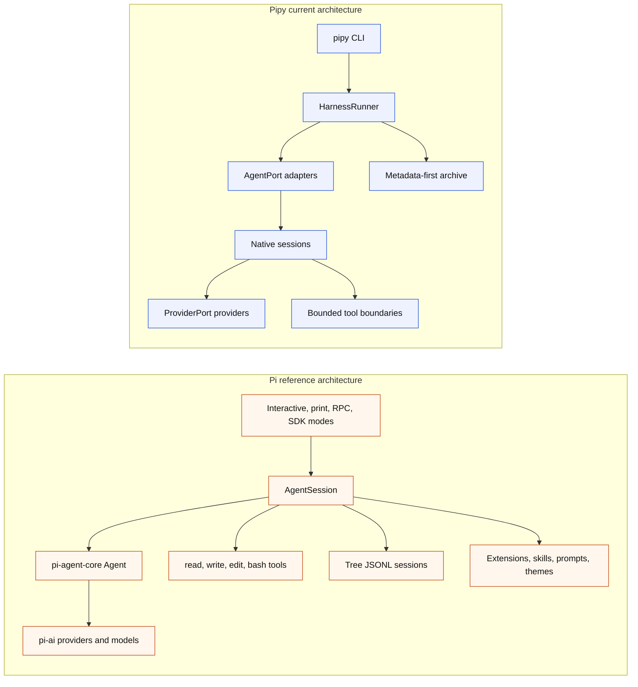

# Pi Parity And Differences

Status: current slopfork map for the Python `pipy` runtime compared with the
local Pi reference in `/Users/jochen/src/pi-mono`.

Pipy is a Python slopfork inspired by Pi. The goal is Pi-class local
coding-agent usefulness — including the terminal UI — through pipy-owned
Python boundaries. It is not a literal port of Pi's TypeScript packages,
extension system, or command names: pipy slopforks the same end-user
capability into Python, not the TypeScript code itself.

**Parity stance (2026-06-02):** real parity means Pi-equivalent *behavior*,
including Pi's storage and output model. The latest ranked comparison snapshot
against `/Users/jochen/src/pi-mono` is
[Pi-Mono Gap Audit](pi-mono-gap-audit.md). Where this doc previously framed pipy's
"metadata-first" archive as a deliberate divergence, that framing is retired:
the metadata-only archive is a pipy-specific layer, not a parity virtue, and is
not a reason to diverge from Pi. The full-transcript native session tree
(`docs/session-tree.md`) is the product session store, and full session content
is streamed (`docs/automation-rpc.md`) and exported (`docs/export-distribution.md`)
like Pi. See [parity-plan.md](parity-plan.md) for the full plan and the list of
accidental pipy-only surfaces being removed or realigned.

## What Has Been Slopforked

Status labels are intentionally coarse:

- Implemented: the named capability exists for pipy's current architecture.
- Partial: pipy has a bounded subset of the Pi behavior.
- Narrow first slice: pipy has the first reviewed boundary, not the general Pi
  capability.
- Different foundation: pipy solves the same product need through a deliberately
  different storage or architecture model.
- Support path: implemented for capture/reference work, not the product
  runtime.

| Pi idea | Pipy state | Notes |
| --- | --- | --- |
| Local-first terminal coding agent | Partial | `pipy` and `pipy repl` start a native shell in the current workspace. The bounded tool-loop REPL now enters a pipy-owned inline-scrollback TTY shell: finalized output commits into the terminal's normal buffer (so native scrollback in Ghostty/zellij reviews it) while the input and footer/status stay in a live frame pinned at the bottom, using the full window height. The no-tool REPL and captured-stream fallback remain line-oriented. |
| Direct provider access | Implemented (11 providers) | `ProviderPort` now supports fake, OpenAI Responses, OpenAI Chat Completions, OpenAI Codex subscription, OpenRouter, Anthropic, Google (Gemini Generative AI), Google Vertex, Mistral, Amazon Bedrock, Azure OpenAI Responses, and Cloudflare Workers AI. All are stdlib-only (urllib + JSON + hashlib/hmac for SigV4); the no-new-runtime-deps invariant is preserved. See `docs/parity-criterion.md` for the locked feature list. |
| Arbitrary shell execution | Implemented | The model-visible `bash` tool is a real shell, matching Pi's bash tool: it spawns `bash -c <command>` in the workspace root with the inherited environment, an optional `timeout` in seconds (the whole process group is killed when it elapses), and returns the combined, bounded stdout/stderr to the model. Pipes, redirection, command substitution, globbing, chaining, and any executable on `PATH` are allowed. Registered in `production_tool_registry`. The archive boundary records only counters and labels — never the raw command string or output body. |
| Retry/backoff for transient HTTP errors | Implemented as reusable `RetryPolicy` | `pipy_harness.native.retry.retry_with_backoff` wraps any provider call with exponential backoff + jitter for 429 and 5xx responses. Injectable sleep + jitter for hermetic tests. |
| Unified-diff edit tool | Implemented as `edit-diff` | `pipy_harness.native.tools.edit_diff.EditDiffTool` parses and applies a unified-diff patch in pure stdlib (no shell-out to `patch(1)`), atomic temp-file rename, and reuses the same `.git`/symlink/pre-read byte-cap defenses as `EditTool`. |
| Output-shrinking helper | Implemented as `truncate` tool | `pipy_harness.native.tools.truncate.TruncateTool` is a pure-transformation tool the model can use to fold an oversized previous tool result into a head+tail+deterministic-marker form. No I/O. |
| Session export | Implemented | `pipy-session export <stem>` writes a metadata-only JSON portable summary to stdout. `--include-transcript` opts in to the sensitive sidecar at `~/.local/state/pipy/transcripts/<id>.jsonl`. Default export retains the metadata-first archive contract via an event-key allowlist. |
| Session resume | Implemented (live runtime resume) | `pipy repl --agent pipy-native --resume <stem>` starts a fresh no-tool or tool-loop session seeded from the existing metadata-only `ResumeContext`/`compose_resume_system_block` (prior provider/model/turn labels only — never prompts, model output, tool payloads, file contents, diffs, or raw Markdown summary text). The prior finalized record is never mutated and no raw transcript sidecar is copied. The product TUI commits a safe resumed-state notice (prior session id, provider, model, turn count, finalized time, and optional branch label) into scrollback at startup; the no-tool REPL prints the same safe banner. The new child archive records only safe lineage: a `resume` object on `session.started` plus a `native.session.resumed` event. `pipy-session resume-info <stem>` still exposes the metadata-only context (now including branch/compaction fields) as JSON. |
| Dynamic provider/model swap | Implemented in both REPL modes | Both the no-tool `/model` command and the product-TUI interactive `/model` selector switch the live provider/model through `NativeReplProviderState.select_model` — the shared provider-state boundary, not a recreated `dynamic_provider` wrapper. A mid-session switch rebinds the live provider/model for subsequent turns, preserves the availability gate (an unavailable target is refused with the prior selection intact), clears the provider-visible conversation on a successful switch (and preserves it on a refused one), refreshes the visible status/footer, and creates no provider/tool/archive side effects during selection. Behavior check: `scripts/parity_checks/dynamic_provider_behavior.py` drives both REPL product paths. |
| OpenAI Codex subscription auth | Implemented as separate provider | Pipy uses its own OAuth state under `${PIPY_AUTH_DIR:-~/.local/state/pipy/auth}/openai-codex.json`, modeled on Pi's Codex OAuth shape, and does not read Pi credentials. |
| `/login`, `/logout`, `/model`, `/settings` | Implemented narrow shell commands | Commands are local, late-bind provider selection or inspect safe local state, and do not create provider turns or archive auth material. In the no-tool REPL `/settings` prints provider/model labels and availability reasons only (the read-only `settings_overlay_lines` builder). In the product TUI `/settings` opens an interactive in-frame control dialog (`ToolLoopTerminalUi.run_settings_dialog`): it shows the same safe active selection and per-provider local availability as read-only status rows, plus actionable rows to change provider/model (reusing the `/model` selector), manage openai-codex auth (reusing the `/login`/`/logout` boundary), and toggle/clear optional persistent cross-session prompt history — all with no provider turn or tool call. `/model` is interactive in both surfaces: the no-tool command prints/changes the selection, and the product TUI opens a keyboard-navigable selector (`ToolLoopTerminalUi.run_model_selector`) over `model_options()` with availability state and reasons, highlighted selection, an unselectable gate for unavailable or non-tool-capable providers, and a footer/status update plus context clear/rebind on a successful choice (`/model <provider>/<model>` also switches directly). `/login [openai-codex]` and `/logout [openai-codex]` are now executable in the product TUI through the same `NativeReplProviderState` auth boundary as the no-tool REPL: they run no provider turn and no tool call, clear the in-memory conversation, refresh model-option availability, and rebind the live provider/footer (logout resets the selection to the local default); interactive login output renders only on the live terminal (the inline frame is suspended around it and repainted afterward) and never reaches the session archive. |
| Startup orientation | Implemented Pi-parity pass | The shell prints Pi-shape compact startup chrome on stderr: title in sage truecolor with a single-space indent (with 16-color fallback), one-line dim controls strip, `Type / to open the command menu` affordance, and a loaded-only `[Context]` section in yellow listing `AGENTS.md` files discovered in the workspace, its ancestors, and the global pipy config root. A `[Skills]` section lists the loadable skill names discovered from `.pipy/skills/*.md` (workspace) and the global `<config>/skills/*.md` store — the same names a user can run with `/skill <name>`, sourced from the runtime loader the dispatcher uses (no longer a display-only directory scan). Chrome rendering is shared between the no-tool and bounded tool-loop sessions through `pipy_harness.native.chrome`. |
| Active prompt state | Implemented | The no-tool REPL keeps the separator-framed prompt and persistent two-row bottom status block. In real TTY tool-loop sessions, `pipy_harness.native.tui.ToolLoopTerminalUi` renders inline (no alternate screen): finalized blocks — startup chrome, submitted messages, settled assistant turns, settled reasoning, tool call/result rows, and notices — are committed once into the terminal's normal buffer, so the host terminal/multiplexer keeps them in native scrollback and the user can scroll up to review prior output in both a native terminal (Ghostty) and a multiplexer pane (zellij). Only a small live region (the bounded in-progress stream tail, the separator/input/separator frame, the optional slash menu, and the two footer rows) is redrawn in place, pinned at the bottom; committed history fills the full window height with the input/footer at the bottom rather than capping the frame to the upper half. Streamed reasoning rows render in italic dim via `ChromeStyle.dim_italic`, matching Pi's italic thinking voice and pipy's captured-stream fallback renderer. During active provider turns, the main thread keeps a raw-mode Escape/Ctrl-C watcher alive while the provider runs in a worker; Escape and Ctrl-C each truly cancel the in-flight provider request via a per-turn `CancelToken` (`pipy_harness.native.cancellation`) threaded into `ProviderPort.complete(...)` that shuts the live `urllib`/SSE connection down so the worker's blocking read raises `ProviderCancelledError` and is then best-effort joined, then clear the loader, suppress any late stream chunks, return to a usable prompt, and render Pi-style red `Operation aborted` (the aborted turn records the user prompt but no assistant/tool observation; cancellation is cooperative, so even a provider that ignored the token cannot mutate session/context state because the turn returns without appending one and late chunks are suppressed). The submitted-prompt shaded band matches Pi's three-row shape: spacer, prompt, spacer. Model-selected tool commands and result previews render as Pi-style shaded rows. `/copy` is an executable local command: it copies the most recent assistant answer through a safe OS clipboard command (`pbcopy`/`wl-copy`/`xclip`/`xsel`) or an OSC 52 terminal fallback, reports a local status notice, and creates no provider turn, tool call, or auth change. Typing `/settings` opens an interactive in-frame settings/control dialog (`ToolLoopTerminalUi.run_settings_dialog`) drawn in the live region (not a committed block): read-only status rows show the same safe provider/model/availability information as the no-tool `/settings` command, and actionable rows change provider/model, manage openai-codex auth, and toggle/clear optional persistent cross-session prompt history — Up/Down move the highlight between actionable rows, Enter/Space act, the list windows with a scroll indicator when it overflows, and Esc/Ctrl-C/Ctrl-D cancel back to the input, all with no provider turn or tool call. The status line keeps the same `$cost (plan) used%/budget (suffix) … (provider) model • effort` shape with token arrows when usage is available. TUI verification includes a stdlib ANSI screen-cell model plus real-PTY product-path tests (`tests/test_native_tool_loop_tui_pty.py`) at Ghostty (100x40) and zellij (80x24) sizes that prove the inline renderer never enters the alternate screen, history scrolls into native scrollback while the input/footer stay pinned, the window's full height is used, and `/copy` runs locally with no extra provider turn; the same suite also drives the interactive `/model` selector over a real PTY (keyboard navigation, no provider turn during selection, footer/status update, and next-turn provider/model use). Typing `/model` opens an in-frame provider/model selector (`ToolLoopTerminalUi.run_model_selector`) with availability reasons, a highlighted selection, an unselectable gate for unavailable or non-tool-capable providers, and a context clear/rebind plus footer update on a successful choice. The input editor now provides daily-driver ergonomics: in-memory (session-scoped) Up/Down prompt history recall with a preserved in-progress draft — plus optional persistent cross-session recall behind the `/settings` "persistent prompt history" toggle (off by default), which saves submitted prompts to a local-only, capped, owner-private state file (`PromptHistoryStore`; never the metadata-first session archive) and seeds a fresh session's recall from them — ANSI bracketed-paste (`ESC[?2004h`) so multi-line pastes insert literally as one undo-able edit and never submit on an embedded newline (the buffer keeps the literal text for submission, while the input cell renders each embedded newline as a single-width `⏎` glyph so the live input stays one physical row and the frame math stays coherent), over-wide input horizontally scrolled through one shared `_input_view` helper so it stays one physical row (never wraps) while the full buffer is still submitted, per-edit Ctrl-Z/Ctrl-Y undo/redo, and poll-based resize handling that reads the live output terminal's `winsize` (with a best-effort SIGWINCH accelerator) and, on a size change, does a drift-independent clear-and-full-redraw (`_repaint_after_resize`) so a resize while idle, while the slash/model overlay is open, or while a turn streams repaints into a single coherent inline frame with no stale/overlapping rows and without entering the alternate screen (committed history stays in native scrollback). `/login`/`/logout` are executable here (see the `/login`, `/logout`, `/model`, `/settings` row). The real-PTY suite drives the full keystroke set: prompt-history recall edits and resubmits the expected prompt, bracketed paste inserts multi-line text without submitting (the live screen is parsed before Enter to assert the pasted newline renders as one `⏎` glyph on a single separator-framed input row at 80x24 and 100x40), Ctrl-Z/Ctrl-Y restore line state before submit, fake auth login/logout flips availability with no provider turn, and a TIOCSWINSZ resize repaints coherently at 80x24 and 100x40 with no alternate screen — including a resize with a multi-line paste in the editor, where the post-resize viewport (and the viewport after a further keypress) is asserted to be a single coherent frame with exactly one input row and no stale rows before the literal multi-line prompt is submitted. The real-PTY suite also drives the interactive `/settings` dialog at 80x24 and 100x40: it opens the dialog, inspects the live overlay before any action, navigates between actionable rows, toggles persistent prompt history and clears it (asserting the live screen updates), resizes the terminal while the dialog is open (asserting a single coherent frame with the correct highlighted row and no stale rows), and cancels back to the separator-framed input — and a cross-session test proves persistent recall end to end (enable + submit in one session, recall with Up in a fresh session, then disable/clear and prove a third fresh session does not recall). tmux product-path artifacts continue to locate visible strings, cursor position, inferred input/footer rows, cell attributes, and final viewport text. The remaining interaction-comfort gaps on this track have since shipped (see [tui-workflow.md](tui-workflow.md), gated by `scripts/parity_checks/tui_workflow_conformance.py`): the `@` file picker (exact/prefix/substring ranking) and Tab path completion, `!`/`!!` shell shortcuts, `Shift+Tab` thinking-level and `Ctrl+P`/`Shift+Ctrl+P` model cycling, `Ctrl+O`/`Ctrl+T` tool-output/thinking folding, queued steering/follow-up during active turns, `Ctrl+V` clipboard / drag image references, the `/scoped-models` and `/hotkeys` overlays plus new `/settings` rows, and the terminal-native mouse-selection invariant (no xterm mouse-tracking enable sequences are ever emitted). |
| Settings / config / keybindings | Implemented | A Pi-style layered settings system ships in `pipy_harness.native.settings`: a global `<config>/settings.json` (on the `PIPY_CONFIG_HOME` → `${XDG_CONFIG_HOME}/pipy` → `~/.config/pipy` chain) plus a project `.pipy/settings.json`, with Pi migrations, one-level deep merge under project precedence, CLI/env overrides, parse-error isolation, and field-scoped lock-guarded writes that preserve unknown keys. `keybindings.json` (`pipy_harness.native.keybindings`) carries the default editor/app binding table (35+ app bindings, single key spec or array of alternatives), legacy-name migration, malformed-file fallback to defaults, and `/hotkeys` rendered from the resolved manager. Settings drive `defaultProvider`/`defaultModel`, `theme`, `quietStartup`, `promptHistory.enabled`, and `autocompleteMaxVisible` at startup, and `/settings` reports the resolved configuration. System-prompt inputs (`--system-prompt`, repeatable `--append-system-prompt`, `SYSTEM.md`/`APPEND_SYSTEM.md`, `--no-context-files`/`-nc`) reach the provider request with body-free metadata only; `retry.*` feeds the provider HTTP retry policy and `compaction.enabled` gates auto-compaction; scoped models (`enabledModels` + `/scoped-models` + Ctrl+P) constrain the model cycle; `pipy config` toggles resource enablement via `-pattern`/`+pattern`; `/reload` re-reads settings/keybindings/resources/theme; `/changelog` and a startup version-bump display ship alongside `--version` and a default-off, no-network update gate. Verified by `scripts/parity_checks/settings_config_conformance.py` (17 checks). A few display/transport keys (editor padding, hardware cursor, clear-on-shrink, websocket transport, in-turn steering, `compaction.reserveTokens`/`keepRecentTokens`, `branchSummary`) and the interactive `pi config` TUI selector are accepted/reported but not yet live-applied, pending their runtime surfaces. |
| Terminal input runtime | Pi-parity `/` menu + Tab discovery | The default `auto` runtime selects the product TUI on real TTY tool-loop sessions and a stdlib-only `slash-menu` raw-mode line editor for the no-tool line-editor path. In the product TUI, typing `/` opens a Pi-like command menu beneath the input separator with slashless command labels, dim descriptions, an accent-colored `→` selection row, Up/Down navigation, Enter to submit the selected command, Tab to accept without submitting, and Esc to close without exiting; it lists only local commands the tool-loop dispatcher can execute — `help`, `hotkeys`, `model`, `scoped-models`, `settings`, `login`, `logout`, `copy`, `compact`, `reload`, `changelog`, plus `skill`/`template` and any discovered workspace custom `/<name>` commands, then `exit`, `quit` — so the menu stays honest (the menu windows to the `autocompleteMaxVisible` setting (Pi default 5) with a scroll indicator, so later rows may scroll below the fold but remain reachable). `settings` opens the interactive settings/control dialog described under Active prompt state, `model` opens the interactive provider/model selector, `login`/`logout` run the OAuth auth boundary without a provider turn, `copy` copies the last answer to the clipboard locally, and `compact` reduces the provider-visible context in place while keeping recent turns plus a safe summary. Outside the slash menu, Up/Down recall prompt history (in-memory, plus optional persistent cross-session recall when enabled in `/settings`), bracketed paste inserts multi-line text literally, and Ctrl-Z/Ctrl-Y undo/redo line edits; the inline frame is resize-aware (poll-based `winsize` reads plus a best-effort SIGWINCH flag). The broader stdlib/prompt-toolkit line-editor paths keep the full local slash-command completion set. `scripts/tmux_tui_input_verify.sh` now exercises Escape and slash-menu frames through the real product command without submitting a provider turn. The next fall-throughs are optional prompt-toolkit input with slash-command completion (descriptions through `display_meta`), explicit file/path completion, completion-only `@file` reference labels, and multiline entry; then the stdlib `readline` adapter for Tab discovery without a runtime dependency; then plain stdin/stderr for captured streams. Mouse selection remains deferred. |
| No approval popups for normal interactive read/context commands | Implemented | Explicit user-entered `/read`, `/ask-file`, and `/propose-file` commands use non-interactive safety checks rather than visible approval prompts. |
| Read tool | Implemented in two flavors | `/read <path>` keeps the explicit, bounded, UTF-8 workspace-relative excerpt within the shared two-successful-excerpt REPL budget. The model-driven `read` tool ships through the [Tool-Loop Parity Track](backlog.md#tool-loop-parity-track), stat-gates oversized files before loading content, and is invoked from `--repl-mode tool-loop`. In real TTY tool-loop sessions, successful model-selected reads render as Pi-style compact shaded `read <path>` rows while the excerpt body stays out of the viewport and is still sent back to the model as the tool observation. |
| Provider-visible file context | Implemented for user-directed `@file`; `/ask-file` partial | `/ask-file <path> -- <question>` forwards one bounded excerpt only in memory to one provider turn and consumes one successful excerpt from the shared REPL budget. Separately, a genuine user prompt that names workspace files with `@path` loads bounded UTF-8 excerpts into the next provider request in both `pipy repl --agent pipy-native` and `--repl-mode tool-loop` (and the product TUI), de-duping references and resolving through the same bounded reader as `/read`/the model-selected `read` tool (workspace-relative in the no-tool REPL, matching its other reads; workspace plus `--read-root` reference roots in tool-loop, where read-roots are configured), so missing/ignored/binary/oversized/secret-shaped/out-of-workspace paths fail closed with safe local diagnostics while the user's literal prompt is preserved; only safe counters reach the archive. |
| Proposal flow | Partial | `/propose-file <path> -- <change-request>` forwards one bounded excerpt, consumes one successful excerpt from the shared REPL budget, and can retain a same-session proposal draft. |
| Write/edit capability | Implemented in bounded tool loop | `/apply-proposal <path>` applies one same-session, human-reviewed, one-file proposal through `NativePatchApplyTool`. The model-driven tool loop now also exposes bounded `write`, `edit`, and `edit_diff` tools. |
| Verification after changes | Not a separate Pi-parity feature | The former pipy-specific `/verify just-check` no-tool REPL command was removed because Pi has no matching built-in slash command; Pi-style verification happens through model-visible `bash` and future extension/project policy. |
| Session records | Different foundation implemented | Pipy writes metadata-first JSONL plus optional Markdown under `~/.local/state/pipy/sessions`; Pi stores full tree sessions under its own agent state. |
| Search/inspect | Implemented for pipy records | `pipy-session list/search/inspect/export/resume-info/verify` operates over finalized metadata records, not full transcripts, and now surfaces safe resume/branch/compaction metadata read-only (lineage relationship + branch label in `list`; relationship, parent id, and `compaction_event_count` in `inspect`; a `resume` lineage object and `compaction_event_count` in `export`; branch/parent/compaction fields in `resume-info`). All catalog commands reject malformed, ambiguous, symlinked, active (`.in-progress`), or out-of-archive records without printing raw event bodies or unsafe labels. The `reflect` surface was removed in the 2026-05-26 code-quality audit cleanup. See backlog Track CQ-A. |
| Print-like one-shot mode | Implemented | `pipy repl --print`/`-p "<prompt>"` runs one non-interactive turn and prints only the final assistant text to stdout (Pi `-p`), and `pipy repl --mode json "<prompt>"` emits the full Pi-shaped session event stream as LF-only JSONL (`docs/automation-rpc.md`). `pipy run --agent pipy-native` remains the metadata-recording one-shot path; the legacy metadata-only `--native-output json` is deprecated in favor of `--mode json`. |
| Subprocess wrapping | Implemented as support path | `pipy run --agent custom|codex|claude|pi -- ...` records conservative lifecycle metadata around another command, but this is not the product runtime. |
| AGENTS.md / CLAUDE.md workspace context discovery | Implemented | `pipy_harness.native.workspace_context.discover_workspace_instructions` walks the workspace, its parents, and the global pipy config root (resolved through `PIPY_CONFIG_HOME`, then `${XDG_CONFIG_HOME}/pipy`, then `~/.config/pipy`), composes the discovered instructions into the system prompt for one-shot, no-tool REPL, and tool-loop modes, and records only safe per-file metadata (path label, sha256, byte length) into the session archive. See the [Workspace Context Loading Parity Track](backlog.md#workspace-context-loading-parity-track). |
| Workspace skills and prompt templates | Implemented Pi-parity pass | The `skills`, `prompt_templates`, and shared `_resource_files` discovery modules were reintroduced **with** a runtime consumer (the prior 2026-05-26 audit cleanup had removed them as dead code). `/skill [<name>]` and `/template [<name> [args]]` list and run workspace/global resources in both the no-tool and tool-loop REPL paths via `pipy_harness.native.resources`; only safe metadata (path label, sha256, byte length, truncated, name) reaches the archive. Discovery enforces secret-shaped-name, binary-content, ignored/generated, oversized, and symlink-escape rejection. |
| Custom slash commands | Implemented Pi-parity pass | The `custom_commands` discovery module is reintroduced with a dispatcher consumer: workspace/global `.pipy/commands/<name>.md` files run as `/<name>` through the same local-command boundary as built-ins (reserved built-in names cannot be shadowed), expanding `$ARGUMENTS`/`$1..$9` into a bounded provider turn. Valid custom commands appear in the tool-loop TUI slash menu and the no-tool completion set. Unsupported/unsafe commands fail closed with no provider turn. |
| Themes / color schemes | Implemented (both REPL modes) | `pipy_harness.native.themes` is the palette registry (`pi` default plus `high-contrast` and `ocean`) behind `chrome.ChromeStyle`, which renders through the active `ChromePalette`. A `/theme [<name>]` command in both the no-tool REPL and the tool-loop TUI lists or switches the active theme; the choice persists to a non-secret `NativeThemeStore` and resolves per render through `PIPY_THEME` (env override > store > default), so the next chrome frame repaints with the new palette. The palette only changes *which* ANSI codes are emitted: `chrome_style_for` decides color enablement (NO_COLOR / non-TTY → plain) before a palette is consulted, so a theme never overrides the no-color contract. Behavior check: `scripts/parity_checks/theme_behavior.py`. |
| Streaming provider output | Implemented in REPL | The [Streaming Output Parity Track](backlog.md#streaming-output-parity-track) closed parity-criterion row C14. `ProviderPort.complete(..., stream_sink=...)` exposes an optional synchronous chunk sink; `OpenAICodexResponsesProvider` forwards each parsed `response.output_text.delta` event through it. In real TTY tool-loop sessions, `_TuiToolLoopRenderer` routes streaming text into the active assistant-output region and clears the transient working region. Captured streams keep the deterministic `_ToolLoopRenderer` fallback and `pipy run --stream` keeps the stdout/stderr split for automation use. |
| Tool call / output rendering | Pi-shape inline blocks + TUI frame | Real TTY tool-loop sessions render tool calls/results into the TUI history region through `ToolLoopTerminalUi`, while captured streams still use `_ToolLoopRenderer`'s readable stderr blocks. Successful read calls collapse to the compact shaded `read <path>` row; non-read result previews remain bounded. Errors are tagged, long result bodies are bounded, ANSI styling is gated on TTY detection and `NO_COLOR`, and captured logs stay readable. |
| Cross-repo read-only inspection | Reference-root tools | Model-driven `read`/`ls`/`grep`/`find` accept absolute paths under the workspace or any configured read-only reference root. Roots come from repeated `--read-root <PATH>` CLI flags, the `PIPY_READ_ROOTS=:`-separated env var, or auto-discovery of `~/<dir>` paths mentioned in `AGENTS.md`, `docs/parity-criterion.md`, and `docs/pi-parity.md` (deepest existing path wins). Mutation tools (`write`/`edit`/`edit_diff`) always stay inside the workspace. The reference-root boundary reuses the existing `.git`/`.gitignore`/symlink/binary defenses and gates content through `has_secret_shaped_content`, a stricter shape-based secret detector that lets prose discussing auth pass while blocking `api_key=<value>`, AWS key IDs, JWTs, and PEM private-key blocks. |
| Image/binary attachment loading | Implemented (provider-visible, both REPL modes) | `pipy_harness.native.image_attachment` resolves `@image:<path>` (alias `@img:`) references in a genuine user prompt into bounded, fail-closed image attachments: it reuses the `read` tool's path policy (workspace/read-root, `.git`/`.gitignore`, traversal/shell-expansion refusal), validates type by magic bytes (PNG/JPEG/GIF/WebP only — arbitrary binary fails closed), and caps per-image (5 MiB), per-turn (4 images), and aggregate (16 MiB) size. Loaded images travel on `ProviderRequest.attachments` and the Anthropic, OpenAI-Responses, and Google adapters render them as native image content blocks attached to the current user message. Both REPL paths wire resolution in. The metadata-first archive (and the opt-in transcript sidecar) record only safe metadata — media type, byte count, sha256, counts — never the raw base64 bytes. Behavior check: `scripts/parity_checks/attachment_behavior.py`. |
| Session compaction | Implemented (live, both REPL modes) | `pipy_harness.native.session_compaction` is a pure transformation over the in-memory provider-visible context. An explicit `/compact` local command and an automatic threshold reduce retained context while keeping recent turns plus a safe metadata-only summary appended to the system prompt. The no-tool REPL compacts its bounded exchange context; the tool-loop cuts the `LoopMessage` history only at `UserMessage` group boundaries, so compaction never orphans a tool result, reorders a tool-call/observation pair, or exposes a raw tool payload that the archive would forbid. Provider/model state, usage counters, prompt history, and the TUI frame continue correctly. Compaction is recorded as metadata-only counters (`native.session.compacted` events; `compaction_count`). |
| Session branching/forking | Implemented (real product workflow) | `pipy repl --resume <stem> --branch <label>` starts a child branch from a finalized parent with a validated safe label. The child archive records safe parent id, branch label, fork timestamp, and relationship metadata (a `resume` object on `session.started` plus a `native.session.resumed` event); the parent record stays byte-for-byte immutable. `--branch` requires `--resume`, and unsafe branch labels (paths, control characters, secret-shaped, over-long) fail closed. |
| SDK / RPC embedding | Implemented | `pipy_harness.sdk` exposes `make_native_run_request(...)`, `run_native(...)`, and the public value objects (`RunRequest`, `RunResult`, `HarnessStatus`, `CapturePolicy`, `HarnessRunner`, `ProviderPort`, `StreamChunkSink`) for in-process headless Python embedding; see [sdk.md](sdk.md). Pi-style out-of-process stdin/stdout JSON/RPC automation has **shipped** — `pipy repl --mode json`/`--mode rpc`/`--print` (`docs/automation-rpc.md`), gated by `scripts/parity_checks/automation_rpc_conformance.py --json`. Network/socket daemons remain deferred. |

## Still To Slopfork

The locked 50-feature parity criterion (see `docs/parity-criterion.md`) is now
a **legacy baseline**: 50/50 with 10 big features green. Future roadmap work
uses the post-baseline product-surface matrix in that document plus the gap
list below, not the completed 80% score alone. D4 (skills loading), D5 (prompt templates),
and D6 (custom slash commands) went green earlier: the discovery helpers were
reintroduced **with** a runtime consumer (`pipy_harness.native.resources`)
wired into both REPL product paths, and their parity-score checks were
upgraded from `test -f path` rubber-stamps to behavior checks that seed a
resource and assert the dispatcher resolves it to a bounded provider turn.
E2 (session compaction) and E3 (session branching) are now green too: live
compaction (`/compact` plus an automatic threshold) and the branch/fork
workflow (`pipy repl --resume <stem> --branch <label>`) ship through real
product paths, and their parity-score rows were rewritten from file-existence
rubber-stamps to behavior checks that seed temporary records and prove the
runtime behavior (`scripts/parity_checks/compaction_behavior.py` and
`scripts/parity_checks/branching_behavior.py`).

The Pi-style **native product session tree** now ships as the product session
source of truth for pipy-native (see [session-tree.md](session-tree.md)). A
private append-only JSONL store under
`~/.local/state/pipy/native-sessions/--<encoded-cwd>--/<timestamp>_<uuid>.jsonl`
holds the raw conversation tree; `/session`, `/name`, `/new`, `/tree`,
`/resume`, `/fork`, `/clone`, durable `/compact`, branch summaries, and the
startup flags `-c`/`-r`/`--session`/`--fork`/`--no-session` all read and write
it through the product runtime. `pipy-session` remains a separate metadata-only
archive and is **not** the product session source. The deterministic
conformance gate `scripts/parity_checks/session_tree_conformance.py --json`
proves the full workflow end to end.
All 50 rows are ✅. B7 (`bash`) is green as a real shell matching Pi (arbitrary
commands in the workspace, combined bounded output, optional timeout); D7
(themes), D8 (image
attachments), and E5 (dynamic provider swap) are behavior checks that
exercise the real product paths (`scripts/parity_checks/bash_behavior.py`,
`scripts/parity_checks/theme_behavior.py`,
`scripts/parity_checks/attachment_behavior.py`, and
`scripts/parity_checks/dynamic_provider_behavior.py`). The boundaries below
remain Pi-class surfaces that pipy has not yet closed:

- Full interactive terminal UI parity beyond the current tool-loop TTY shell.
  **The Pi-style TUI/editor workflow track has shipped** (see
  [tui-workflow.md](tui-workflow.md), gated by
  `scripts/parity_checks/tui_workflow_conformance.py`): the `@` file picker with
  Pi exact/prefix/substring ranking, general Tab path completion, `!`/`!!` shell
  shortcuts, `Shift+Tab` thinking-level and `Ctrl+P`/`Shift+Ctrl+P` model
  cycling, `Ctrl+O`/`Ctrl+T` tool-output/thinking folding, queued
  steering/follow-up during active turns, true provider-request cancellation,
  the `/scoped-models` + `/hotkeys` overlays and new `/settings` rows, and the
  terminal-native mouse-selection invariant (the renderer never enables xterm
  mouse tracking). Prompt history recall, bracketed paste, undo/redo, resize
  handling, the interactive `/settings` control dialog, and optional persistent
  cross-session prompt history shipped earlier. Remaining UI work is a fuller
  framework (e.g. extension-registered UI surfaces) once the extension platform
  exists.
- Clipboard-pasted images **now ship**: `Ctrl+V` reads an OS clipboard image
  (pngpaste / wl-paste / xclip), writes it to an owner-only temp file under an
  image reference root, and inserts an `@image:` reference that attaches on
  submit; terminal drag-drop of a file path becomes an `@image:`/`@path`
  reference. A genuine prompt naming a workspace image with `@image:<path>`
  loads it as a bounded, type-validated provider-visible image block in both
  REPL modes, and `@file`/`@path` text reads load bounded excerpts into the
  next provider request. Image bytes never reach the metadata archive.
- Broader context/resource loading beyond user-directed `@file` excerpts and
  bounded per-session file reads.
- Richer resource loading beyond AGENTS/CLAUDE-style instruction discovery.
  Workspace/global skills (`.pipy/skills`), prompt templates
  (`.pipy/templates`), and custom slash commands (`.pipy/commands`) now ship
  as executable runtime resources through `pipy_harness.native.resources`,
  wired into both REPL product paths. Chrome themes (`pipy_harness.native.themes`)
  now also ship with a runtime consumer — the `/theme` command and the
  palette-aware `chrome.ChromeStyle` — see the Themes row above.
- Network-transported RPC (the in-process Python SDK at
  `pipy_harness.sdk` closes parity-criterion row E7; a long-running daemon,
  socket transport, or wire protocol remains explicitly deferred).
- Provider registry and broad provider/model catalog.
- Cost/context/token footer behavior beyond safe usage counters.
- Project-defined verification policy beyond the Pi-style `bash`/extension-gate workflow.

## Architecture Differences From Pi

Pi's durable center is `AgentSession`: it composes agent state, model and
thinking-level management, persistence, settings, resources, extensions, bash,
compaction, branching, and mode integration. Interactive, print, RPC, and SDK
surfaces sit above that shared session abstraction.

Pipy's durable center is currently split:

- `HarnessRunner` owns run lifecycle, event recording, and finalization.
- `NativeAgentSession` and `NativeNoToolReplSession` own native provider/tool
  control flow.
- `pipy_session.recorder` owns file lifecycle.
- `pipy_session.catalog` owns read-only archive inspection.

That split is deliberate. Pipy is using clean-architecture boundaries while it
bootstraps, so effectful adapters cannot silently become the product core.

## Key Design Differences

| Topic | Pi | Pipy |
| --- | --- | --- |
| Language and package shape | TypeScript monorepo with `coding-agent`, `agent`, `ai`, `tui`, and related packages. | Python package with `pipy_harness` and `pipy_session`. |
| Main runtime center | `AgentSession` wrapped around `pi-agent-core` and `pi-ai`. | `HarnessRunner` plus native session classes behind explicit ports. |
| UI | Rich TUI with editor, footer, selectors, overlays, and extension UI. | Product tool-loop sessions use a pipy-owned inline-scrollback TUI (committed history in native scrollback, live input/footer frame pinned at the bottom, full window height) with prompt/footer ownership, slash menu, submitted prompt bands, tool rows, active assistant output, active-Escape abort rendering, an interactive `/settings` control dialog, an interactive `/model` provider/model selector, executable `/login`/`/logout`, and daily-driver editor ergonomics (prompt history with optional persistent cross-session recall, bracketed paste, undo/redo, resize handling). The no-tool REPL remains line-oriented with compact startup chrome, grouped help, `/status`, `/settings`, a state-aware prompt label, and an optional prompt-toolkit input adapter with command/path completion, `@file` reference labels, and multiline entry. The `@file` completion inserts labels in the editor; separately, accepted or typed `@path` references in a submitted prompt now load bounded excerpts into the provider request (see "Provider-visible file context"). Broader selectors/overlays and extension UI remain deferred. |
| Session storage | Full tree JSONL sessions with parent links, branching, compaction, and resume workflows. | Two stores by design. The Pi-style **native product session tree** (`pipy_harness.native.session_tree`, private append-only JSONL under `~/.local/state/pipy/native-sessions/--<encoded-cwd>--/`) is the product session source of truth: full conversation history with parent links, in-place `/tree` navigation, sibling branches, `/fork`/`/clone`, durable `/compact` entries, branch summaries, labels, naming, and `-c`/`-r`/`--session`/`--fork`/`--no-session` startup flags. The separate metadata-first `pipy-session` archive (immutable JSONL + Markdown summaries under `pipy/YYYY/MM`) stays a summary-safe catalog/learning surface and is **not** the product session source; it records only safe lineage/compaction counters. The full behavior and the conformance gate are specified in [session-tree.md](session-tree.md). |
| Tool model | Model-visible read, write, edit, and bash tools are core defaults. | Explicit, bounded, pipy-owned command/tool boundaries plus the implemented bounded model-selected loop with `read`, `write`, `edit`, `ls`, `grep`, `find`, `edit_diff`, `truncate`, and `bash` behind `pipy repl --repl-mode tool-loop`; `bash` is a real shell matching Pi (arbitrary commands in the workspace, combined bounded output, optional timeout), with only metadata recorded at the archive boundary. See the [Tool-Loop Parity Track](backlog.md#tool-loop-parity-track). |
| Approval posture | No permission popups for the normal product workflow. | Same direction for explicit REPL read/context commands, while non-interactive request objects still carry policy and authority data. |
| Provider access | Broad provider/model registry through Pi's AI package, including subscription and API-key paths. | Twelve real provider adapters behind `ProviderPort` plus the fake bootstrap, now fronted by a pipy-owned catalog foundation (`native/catalog.py`/`catalog_data.py`) with multiple rows per provider, a `models.json` custom-provider/override loader (`native/models_json.py`), the layered matcher (`native/model_resolver.py`), auth helpers + availability gate (`native/auth_store.py`), the stdlib OAuth registry for Anthropic/Copilot/Codex (`native/oauth_providers.py`), thinking helpers (`native/thinking.py`), routing config (`native/routing.py`), `--list-models [search]`, the full-catalog `/model` selector + direct `/model <ref>` through the shared resolver, and catalog-driven product construction (`native/provider_construction.py`, `native/catalog_state.py`). ds4 is reframed as a `models.json` custom provider (`native/ds4.py`). Catalog construction now covers the OpenAI-compatible Chat Completions family, implemented catalog-constructed non-completions API families, `pipy run` one-shot construction, and startup `--native-provider`/`--native-model` resolution through the shared resolver; the conformance gate covers Verification-Plan items 1-24 with fake HTTP/product-path assertions. Remaining provider-access gaps are live Anthropic/Copilot login UX, the deliberate `openai-codex-responses` legacy-factory exception for settings-derived retry policy, narrow adapter parity follow-ons (Vertex API-key auth, Anthropic adaptive thinking, Azure URL/api-version parity), and extension-registered providers; see `docs/provider-catalog.md`. |
| Extension system | First-class extensions, skills, prompt templates, themes, custom commands, and UI hooks. | Skills, prompt templates, and custom slash commands now load at runtime from pipy-owned `.pipy/skills`, `.pipy/templates`, and `.pipy/commands` stores (workspace + global) through `pipy_harness.native.resources`, wired into both REPL product paths; the `[Skills]` chrome section lists the loadable skill names a user can run with `/skill`. Chrome color themes also ship through `/theme` (`pipy_harness.native.themes`). A general extension/package loader and runtime UI hooks remain deferred until a consumer exists. This is deliberately **not** a general extension API — only the bounded resource kinds and the theme palette load, through the existing provider/session/tool/archive boundaries. |
| Privacy posture | Full Pi sessions are native product transcripts. | Pipy archive is metadata-first and excludes prompts, model output, provider payloads, file contents, command output, and auth material by default. |
| External agent wrapping | Pi is itself the product. | Pipy can wrap external CLIs for conservative capture, but external wrappers are not the product runtime. |
| Verification | Pi exposes broad bash/tool capability. | Pipy now relies on the Pi-style model-visible `bash` tool for verification-like workflows; a separate project-defined verification policy remains future work. |

Pi's README describes `read`, `write`, `edit`, and `bash` as the default model
tools. The Pi codebase also includes additional tool modules such as `find`,
`grep`, `ls`, `edit-diff`, and `truncate`; the table compares the default
product posture rather than every shipped helper.

## Pipy Layering Compared With Pi

Pi integrates more behavior inside its session and agent abstractions because it
already has a mature product surface. Pipy keeps sharper early boundaries:

- Domain value objects in `pipy_harness.native.models` define safe request,
  result, policy, and storage metadata.
- Provider adapters implement only `ProviderPort.complete()`.
- Tool boundaries implement explicit read, patch apply, and verification
  request shapes.
- The harness runner is the only layer that coordinates archive finalization.
- The catalog is read-only and never repairs, imports, or indexes raw records.

This means pipy currently has less product capability, but the code more
clearly separates:

- pure or mostly pure domain data,
- orchestration control flow,
- provider adapters,
- workspace effects,
- recorder/archive effects,
- and external subprocess capture.

## Compatibility Rules

Future Pi parity work should preserve these pipy-specific rules:

- `pipy-native` remains the product runtime.
- Codex, Claude, Pi, and arbitrary subprocess wrapping remain capture/reference
  paths unless the product direction explicitly changes.
- Raw prompts, model output, provider responses, stdout, stderr, command output,
  file contents, patches, diffs, secrets, credentials, tokens, private keys,
  and sensitive personal data stay out of archives by default.
- User-visible runtime behavior and docs must stay aligned in the same change.
- Broad features should land as small named boundaries, with focused tests,
  `just check`, docs updates, and review.

## Reading The Current Roadmap

Use these docs together:

- [Architecture](architecture.md) explains what exists now and where it lives.
- [Backlog](backlog.md) is the forward-planning index for slices and parity
  tracks.
- [Harness Spec](harness-spec.md) records detailed rationale and deferred
  design.
- [Session Storage](session-storage.md) is the archive and privacy policy.
