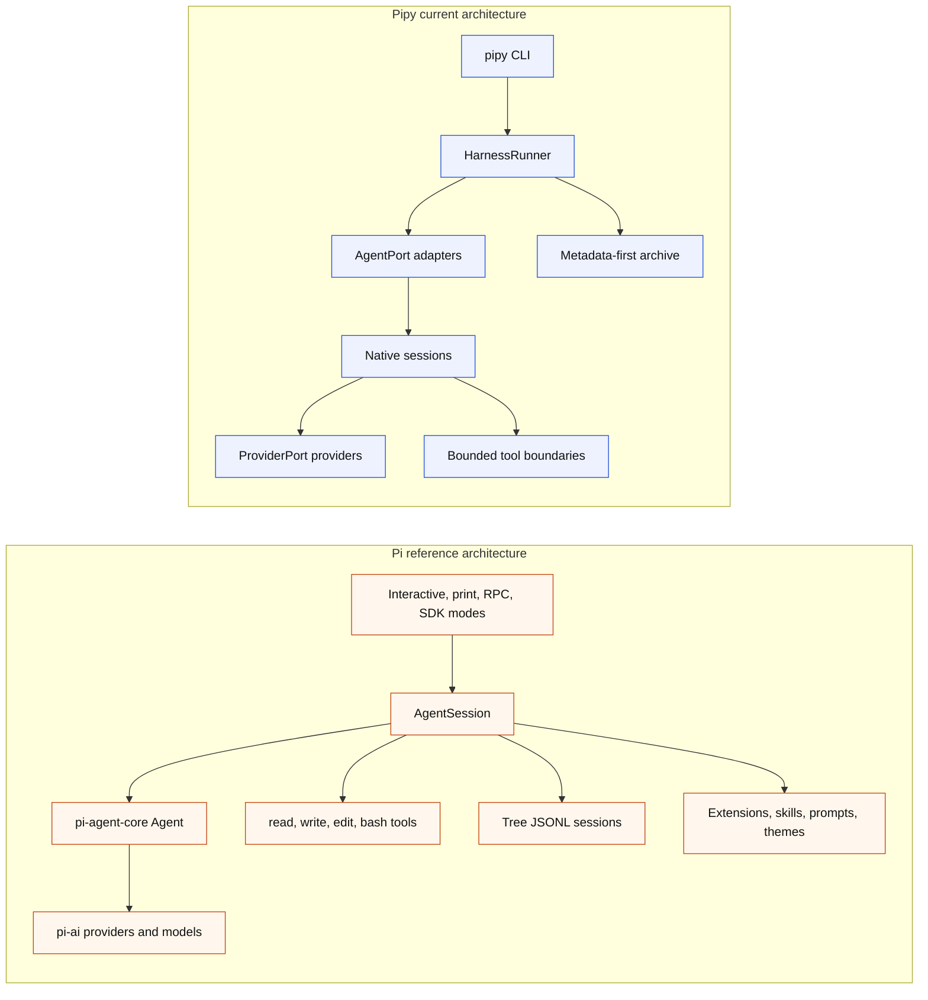

# Pi Parity And Differences

Status: current slopfork map for the Python `pipy` runtime compared with the
local Pi reference in `/Users/jochen/src/pi-mono`.

Pipy is a Python slopfork inspired by Pi. The goal is Pi-class local
coding-agent usefulness through pipy-owned Python boundaries, not a literal
port of Pi's TypeScript packages, terminal UI, storage model, extension system,
or command names.

## What Has Been Slopforked

Status labels are intentionally coarse:

- Implemented: the named capability exists for pipy's current architecture.
- Partial: pipy has a bounded subset of the Pi behavior.
- Narrow first slice: pipy has the first reviewed boundary, not the general Pi
  capability.
- Different foundation: pipy solves the same product need through a deliberately
  different storage or architecture model.
- Support path: implemented for capture/reference work, not the product
  runtime.

| Pi idea | Pipy state | Notes |
| --- | --- | --- |
| Local-first terminal coding agent | Partial | `pipy` and `pipy repl` start a native shell in the current workspace. It is still line-oriented, not a full TUI. |
| Direct provider access | Implemented foundation | `ProviderPort` supports fake, OpenAI API-key Responses, OpenAI Codex subscription, and OpenRouter providers. |
| OpenAI Codex subscription auth | Implemented as separate provider | Pipy uses its own OAuth state under `${PIPY_AUTH_DIR:-~/.local/state/pipy/auth}/openai-codex.json`, modeled on Pi's Codex OAuth shape, and does not read Pi credentials. |
| `/login`, `/logout`, `/model` | Implemented narrow shell commands | Commands are local, late-bind provider selection, and do not create provider turns or archive auth material. |
| Startup orientation | Implemented styled pass | The shell prints sectioned startup chrome with TTY-only ANSI styling, plain captured-stream fallback, safe resource-source labels, and compact workspace/model/turn status labels. |
| Active prompt state | Implemented | The line-oriented prompt label reflects safe provider/model, turn, read, proposal, and verification state before each input. |
| Terminal input runtime | Narrow first slice | A small input adapter preserves plain captured-stream fallback and can use optional prompt-toolkit line-editor input with slash-command completion, explicit file/path completion, completion-only `@file` reference labels, and multiline entry on real TTY streams. Richer editor behavior remains deferred. |
| No approval popups for normal interactive read/context commands | Implemented | Explicit user-entered `/read`, `/ask-file`, and `/propose-file` commands use non-interactive safety checks rather than visible approval prompts. |
| Read tool | Partial | `/read <path>` supports explicit, bounded, UTF-8 workspace-relative excerpts within the shared two-successful-excerpt REPL budget. No broad model-selected read tool exists yet. |
| Provider-visible file context | Partial | `/ask-file <path> -- <question>` forwards one bounded excerpt only in memory to one provider turn and consumes one successful excerpt from the shared REPL budget. |
| Proposal flow | Partial | `/propose-file <path> -- <change-request>` forwards one bounded excerpt, consumes one successful excerpt from the shared REPL budget, and can retain a same-session proposal draft. |
| Write/edit capability | Narrow first slice | `/apply-proposal <path>` applies one same-session, human-reviewed, one-file proposal through `NativePatchApplyTool`. There is no general write/edit tool yet. |
| Verification after changes | Narrow first slice | `/verify just-check` runs only the allowlisted internal `just check` command after a successful same-session apply. |
| Session records | Different foundation implemented | Pipy writes metadata-first JSONL plus optional Markdown under `~/.local/state/pipy/sessions`; Pi stores full tree sessions under its own agent state. |
| Search/inspect/reflect | Implemented for pipy records | `pipy-session list/search/inspect/verify/reflect` operates over finalized metadata records, not full transcripts. |
| Print-like one-shot mode | Partial | `pipy run --agent pipy-native` runs one native turn; default stdout is successful final text only, and `--native-output json` gives metadata-only automation output. |
| Subprocess wrapping | Implemented as support path | `pipy run --agent custom|codex|claude|pi -- ...` records conservative lifecycle metadata around another command, but this is not the product runtime. |

## Still To Slopfork

The main missing Pi-class surfaces are intentionally deferred until the current
metadata and boundary invariants are stable:

- Full interactive terminal UI with editor, persistent footer,
  model/status controls, overlays, selectors, and resize handling beyond the
  implemented narrow prompt-toolkit input-adapter, slash-command completion,
  explicit file/path completion, and multiline entry boundaries.
- Automatic file-content reads from `@file` references, pasted images,
  persistent history, and broader keyboard shortcut handling.
- Model-selected tool loop with read, write, edit, ls, grep, find, and
  follow-up tool observations. Planned as the [Native Tool-Loop Parity
  Track](#native-tool-loop-parity-track) below. A model-driven `bash` tool and
  any generalization of `/verify just-check` remain explicitly out of scope.
- Multiple file/context reads per session and broader context/resource loading.
- AGENTS/CLAUDE-style context discovery beyond the static labels currently
  shown by startup chrome.
- Prompt templates, skills, themes, extensions, and package loading.
- Session resume, branch/tree navigation, fork, compaction, export, and share.
- RPC mode and SDK embedding surfaces.
- Provider registry and broad provider/model catalog.
- Cost/context/token footer behavior beyond safe usage counters.
- Arbitrary shell command support and non-allowlisted verification.

## Native Tool-Loop Parity Track

The next visible Pi-parity step is a bounded model-selected tool loop behind
`pipy repl --agent pipy-native --repl-mode tool-loop`. It is planned as twelve
reviewed slices that ship alongside the existing no-tool REPL and the existing
slash-command boundaries. None of the tool-loop slices land in one change; each
slice is a named conventional commit with focused tests, `just check`, and docs
updates before review.

### Goal

- A real model-driven loop over `openai`, `openai-codex`, and `openrouter` with
  bounded `read`, `write`, `edit`, `ls`, `grep`, and `find` tools, producing a
  useful end-to-end change against this repo with `just check` green.
- Pi-shaped behavior: the model picks files, edits them directly, the resulting
  unified diff is written to stderr, no approval popups appear, and the loop
  iterates within a bounded tool budget.
- Slash commands `/read`, `/ask-file`, `/propose-file`, `/apply-proposal`, and
  `/verify just-check` keep working unchanged in both `--repl-mode no-tool` and
  `--repl-mode tool-loop`.

### Planned Slices

1. Docs only. Record the tool-loop parity goal, invariants, and deferred work in
   `docs/pi-parity.md`, `docs/backlog.md`, and `docs/harness-spec.md`.
2. `tools/base.py` contracts: `ToolDefinition`, `ToolRequest`,
   `ToolExecutionResult`, `ToolArgumentError`, `ToolContext`, and `ToolPort`,
   built from stdlib dataclasses with manual JSON-schema validation. Focused
   contract tests, no provider or REPL wiring.
3. `ProviderPort` extension: a `supports_tool_calls` capability flag (real
   providers stay `False`), a `ProviderToolCall` value object, `tool_calls` on
   `ProviderResult`, and a provider-agnostic message envelope
   (`user`/`assistant`/`tool_result`). The fake provider gains
   `programmable_tool_calls` for tests; real adapters stay inert.
4. `NativeToolReplSession` skeleton: bounded turn loop with `--tool-budget`
   defaulting to 10 (max 25), malformed tool arguments returned to the model as
   an observation (fatal after three consecutive malformed turns), a test-only
   `_FixtureTool` injected by tests, and an empty production tool registry.
5. `read` tool: reuses `read_only_tool.py` validation. The first real provider
   adapter flips `supports_tool_calls` to `True`; a manual smoke run lands with
   the slice.
6. `ls` tool: bounded directory entries returned as workspace-relative paths.
7. `grep` tool: `subprocess.run` to `rg` with no `shell=True`, a fixed argv, a
   workspace `cwd`, a timeout, and bounded results, with a stdlib fallback when
   `rg` is unavailable.
8. `find` tool: bounded glob lookup.
9. `write` tool: create-only; refuses existing files, `.git`, and paths that
   escape the workspace; applies directly and writes the unified diff to
   stderr. Tests pin: file mutation, diff lands only on stderr, archive remains
   untouched, and the diff lands in the opt-in sidecar only when enabled.
10. `edit` tool: string-replace with a unique-`old_string` default and an
    opt-in `replace_all`; reuses `patch_apply.py`. Same diff and archive
    privacy tests.
11. Opt-in `TranscriptSink`: a sidecar JSONL at
    `~/.local/state/pipy/transcripts/<id>.jsonl`, enabled by
    `--archive-transcript`, marked sensitive, written outside the metadata
    archive, and excluded from `pipy-session list/search/inspect`. Focused
    privacy tests.
12. Flip the default `--repl-mode` to `tool-loop` when the selected provider
    supports tool calls. The `no-tool` mode stays available. Update README and
    user-facing docs.

### Invariants

- Metadata-first archive privacy is preserved exactly across the whole track.
  `pipy_session.recorder` records no prompts, model text, tool payloads, file
  contents, or diffs in any slice. Any leak fails the slice.
- `.git` is default-deny across all model-driven tools. Slash commands are
  unaffected.
- No new runtime dependencies. Stdlib plus manual dict validation only; no
  pydantic.
- `NativeToolResult` carries archive-safe metadata only;
  `ToolExecutionResult` carries provider-visible payloads. The two shapes are
  not conflated.
- The internal pipy-owned `tool_request_id` does not leak as a provider id;
  provider identifiers are carried separately as `provider_correlation_id`.
- The existing no-tool REPL and the listed slash commands keep working in both
  modes.
- Each slice ships focused tests, a green `just check`, updated docs, a
  conventional commit, and stops for review.

### Out Of Scope For This Track

These remain explicitly deferred while the tool-loop track lands and after it
lands:

- A `bash` tool or any arbitrary shell execution tool.
- Generalizing `/verify` beyond the allowlisted `just check` boundary.
- Session resume, branch/fork navigation, and compaction.
- RPC mode and SDK embedding.
- Extensions, skills, prompt templates, and theme/package loading.
- Automatic `@file` content reads from completion-only references.
- Persistent shell history and a full interactive TUI.
- Additional providers beyond `openai`, `openai-codex`, and `openrouter`.
- Removing the no-tool REPL or its slash-command boundaries.

## Architecture Differences From Pi

Pi's durable center is `AgentSession`: it composes agent state, model and
thinking-level management, persistence, settings, resources, extensions, bash,
compaction, branching, and mode integration. Interactive, print, RPC, and SDK
surfaces sit above that shared session abstraction.

Pipy's durable center is currently split:

- `HarnessRunner` owns run lifecycle, event recording, and finalization.
- `NativeAgentSession` and `NativeNoToolReplSession` own native provider/tool
  control flow.
- `pipy_session.recorder` owns file lifecycle.
- `pipy_session.catalog` owns read-only archive inspection.

That split is deliberate. Pipy is using clean-architecture boundaries while it
bootstraps, so effectful adapters cannot silently become the product core.

## Key Design Differences

| Topic | Pi | Pipy |
| --- | --- | --- |
| Language and package shape | TypeScript monorepo with `coding-agent`, `agent`, `ai`, `tui`, and related packages. | Python package with `pipy_harness` and `pipy_session`. |
| Main runtime center | `AgentSession` wrapped around `pi-agent-core` and `pi-ai`. | `HarnessRunner` plus native session classes behind explicit ports. |
| UI | Rich TUI with editor, footer, selectors, overlays, and extension UI. | Line-oriented REPL with compact startup chrome, grouped help, `/status`, a state-aware prompt label, and an optional prompt-toolkit input adapter with command/path completion, completion-only `@file` reference labels, and multiline entry; richer editor behavior remains deferred. |
| Session storage | Full tree JSONL sessions with parent links, branching, compaction, and resume workflows. | Immutable metadata-first JSONL plus Markdown summaries under `pipy/YYYY/MM`; no raw transcript import by default. |
| Tool model | Model-visible read, write, edit, and bash tools are core defaults. | Explicit, bounded, pipy-owned command/tool boundaries today; a bounded model-selected loop with `read`, `write`, `edit`, `ls`, `grep`, and `find` (no `bash`) is planned as the [Native Tool-Loop Parity Track](#native-tool-loop-parity-track). |
| Approval posture | No permission popups for the normal product workflow. | Same direction for explicit REPL read/context commands, while non-interactive request objects still carry policy and authority data. |
| Provider access | Broad provider/model registry through Pi's AI package, including subscription and API-key paths. | Four current providers behind `ProviderPort`: fake, OpenAI API-key, OpenAI Codex OAuth, and OpenRouter. |
| Extension system | First-class extensions, skills, prompt templates, themes, custom commands, and UI hooks. | Deferred. The current code has no extension runtime. |
| Privacy posture | Full Pi sessions are native product transcripts. | Pipy archive is metadata-first and excludes prompts, model output, provider payloads, file contents, command output, and auth material by default. |
| External agent wrapping | Pi is itself the product. | Pipy can wrap external CLIs for conservative capture, but external wrappers are not the product runtime. |
| Verification | Pi exposes broad bash/tool capability. | Pipy exposes only `/verify just-check` after successful same-session apply. |

Pi's README describes `read`, `write`, `edit`, and `bash` as the default model
tools. The Pi codebase also includes additional tool modules such as `find`,
`grep`, `ls`, `edit-diff`, and `truncate`; the table compares the default
product posture rather than every shipped helper.

## Pipy Layering Compared With Pi

Pi integrates more behavior inside its session and agent abstractions because it
already has a mature product surface. Pipy keeps sharper early boundaries:

- Domain value objects in `pipy_harness.native.models` define safe request,
  result, policy, and storage metadata.
- Provider adapters implement only `ProviderPort.complete()`.
- Tool boundaries implement explicit read, patch apply, and verification
  request shapes.
- The harness runner is the only layer that coordinates archive finalization.
- The catalog is read-only and never repairs, imports, or indexes raw records.

This means pipy currently has less product capability, but the code more
clearly separates:

- pure or mostly pure domain data,
- orchestration control flow,
- provider adapters,
- workspace effects,
- recorder/archive effects,
- and external subprocess capture.

## Compatibility Rules

Future Pi parity work should preserve these pipy-specific rules:

- `pipy-native` remains the product runtime.
- Codex, Claude, Pi, and arbitrary subprocess wrapping remain capture/reference
  paths unless the product direction explicitly changes.
- Raw prompts, model output, provider responses, stdout, stderr, command output,
  file contents, patches, diffs, secrets, credentials, tokens, private keys,
  and sensitive personal data stay out of archives by default.
- User-visible runtime behavior and docs must stay aligned in the same change.
- Broad features should land as small named boundaries, with focused tests,
  `just check`, docs updates, and review.

## Reading The Current Roadmap

Use these docs together:

- [Architecture](architecture.md) explains what exists now and where it lives.
- [Backlog](backlog.md) is the current slice index and historical ledger.
- [Harness Spec](harness-spec.md) records detailed rationale and deferred
  design.
- [Session Storage](session-storage.md) is the archive and privacy policy.
